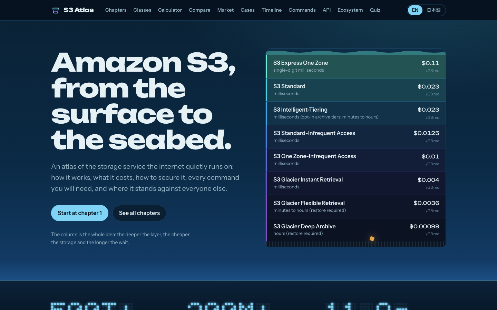

# S3 Atlas

Everything about Amazon S3, from the surface to the seabed: how it works, what it costs, how to secure it, every command you will need, and where it stands against the rest of the industry.

English | [日本語](./README.ja.md)



## What's inside

S3 Atlas has two parts that share one source of truth:

- **Research docs** in [`docs/`](./docs): 18 chapters, about 15,000 lines per language, written in Japanese and translated to English. Each chapter ends with its references, and anything that could not be verified is marked _unverified_.
- **An interactive web app** in [`src/`](./src) that renders the docs and adds tools built on structured data in [`data/`](./data).

### Chapters

| #   | Chapter                                          | English                                     | 日本語                                      |
| --- | ------------------------------------------------ | ------------------------------------------- | ------------------------------------------- |
| 1   | What S3 is                                       | [en](./docs/en/01-overview.md)              | [ja](./docs/ja/01-overview.md)              |
| 2   | Storage classes                                  | [en](./docs/en/02-storage-classes.md)       | [ja](./docs/ja/02-storage-classes.md)       |
| 3   | Pricing                                          | [en](./docs/en/08-pricing.md)               | [ja](./docs/ja/08-pricing.md)               |
| 4   | Security                                         | [en](./docs/en/03-security.md)              | [ja](./docs/ja/03-security.md)              |
| 5   | Data management                                  | [en](./docs/en/04-data-management.md)       | [ja](./docs/ja/04-data-management.md)       |
| 6   | Performance                                      | [en](./docs/en/05-performance.md)           | [ja](./docs/ja/05-performance.md)           |
| 7   | Troubleshooting                                  | [en](./docs/en/12-troubleshooting.md)       | [ja](./docs/ja/12-troubleshooting.md)       |
| 8   | New frontiers (Tables, Vectors, Files, Metadata) | [en](./docs/en/06-new-frontiers.md)         | [ja](./docs/ja/06-new-frontiers.md)         |
| 9   | Architecture patterns                            | [en](./docs/en/11-architecture-patterns.md) | [ja](./docs/ja/11-architecture-patterns.md) |
| 10  | Ecosystem                                        | [en](./docs/en/16-ecosystem.md)             | [ja](./docs/ja/16-ecosystem.md)             |
| 11  | Case studies                                     | [en](./docs/en/15-case-studies.md)          | [ja](./docs/ja/15-case-studies.md)          |
| 12  | Hands-on labs                                    | [en](./docs/en/18-hands-on-labs.md)         | [ja](./docs/ja/18-hands-on-labs.md)         |
| 13  | Competitors                                      | [en](./docs/en/09-competitors.md)           | [ja](./docs/ja/09-competitors.md)           |
| 14  | Industry position                                | [en](./docs/en/10-industry.md)              | [ja](./docs/ja/10-industry.md)              |
| 15  | CLI cookbook                                     | [en](./docs/en/07-cli-cookbook.md)          | [ja](./docs/ja/07-cli-cookbook.md)          |
| 16  | API reference                                    | [en](./docs/en/17-api-reference.md)         | [ja](./docs/ja/17-api-reference.md)         |
| 17  | Glossary                                         | [en](./docs/en/13-glossary.md)              | [ja](./docs/ja/13-glossary.md)              |
| 18  | FAQ & misconceptions                             | [en](./docs/en/14-faq-and-quiz.md)          | [ja](./docs/ja/14-faq-and-quiz.md)          |

File numbers reflect the order chapters were researched; the site and this table use reading order.

### Interactive tools

| Page            | What it does                                                                                     | Data                                                                         |
| --------------- | ------------------------------------------------------------------------------------------------ | ---------------------------------------------------------------------------- |
| Storage classes | Every class as a layer of the water column, with prices, latency, minimums and retrieval options | `data/storage-classes.json`                                                  |
| Cost calculator | Prices one workload across every S3 class and 20+ providers, egress included                     | `data/storage-classes.json`, `data/s3-pricing.json`, `data/competitors.json` |
| Competitors     | Price scatter, price sheet, feature matrix and profiles for 22 services                          | `data/competitors.json`                                                      |
| Market          | Cloud market share by quarter, object storage market estimates, S3 scale numbers                 | `data/market.json`                                                           |
| Case studies    | 38 public cases, including companies that left S3                                                | `data/cases.json`                                                            |
| Timeline        | 68 dated events from 2006 to 2026                                                                | `data/timeline.json`                                                         |
| Commands        | 134 searchable CLI, SDK and third-party recipes; destructive ones are flagged                    | `data/commands.json`                                                         |
| API             | 309 operations across S3, S3 Control, Tables, Vectors, Files and Outposts                        | `data/api.json`                                                              |
| Ecosystem       | 77 services and tools that read and write S3                                                     | `data/ecosystem.json`                                                        |
| Quiz            | 40 questions in three difficulty levels                                                          | `data/quiz.json`                                                             |

The site defaults to English. The language toggle in the header switches every page, chapter and dataset to Japanese, and the choice is remembered in the browser.

## Run it locally

Requires Node.js 22 or later.

```bash
npm ci
npm run dev        # http://localhost:5173
```

Other scripts:

```bash
npm run build      # type-check and build to dist/
npm run preview    # serve the production build
npm test           # unit and component tests (Vitest)
npm run lint       # ESLint
npm run lint:md    # markdownlint-cli2 over every Markdown file
npm run check      # everything CI runs, in order
node scripts/validate-data.mjs   # JSON validity and en/ja doc parity
```

## How it is built

- Vite, React 19, TypeScript, React Router (hash routing, so it works on any static host)
- `react-markdown` with GFM, `rehype-slug` and `rehype-highlight`; Mermaid diagrams render lazily
- Charts are hand-written SVG with hover and keyboard tooltips, using a palette validated for color-vision deficiency on the dark surface
- Each route and each dataset is its own chunk, so a page only downloads what it shows

## CI

| Workflow         | Runs                                                                                                                                                               |
| ---------------- | ------------------------------------------------------------------------------------------------------------------------------------------------------------------ |
| `ci.yml`         | type-check, ESLint, Prettier, markdownlint, Vitest on Node 22 and 24 with coverage, data and doc-parity validation, production build, external link check (lychee) |
| `deploy.yml`     | builds and publishes to GitHub Pages on every push to `main`                                                                                                       |
| `codeql.yml`     | CodeQL analysis on push, pull request and weekly                                                                                                                   |
| `freshness.yml`  | on the 1st and 15th, lists new S3 announcements from AWS What's New and stale price data in a tracking issue                                                       |
| `dependabot.yml` | weekly grouped updates for npm packages and GitHub Actions                                                                                                         |

To enable the site, set **Settings → Pages → Source** to **GitHub Actions**.

## Accuracy

Facts were checked against AWS documentation, the AWS Price List API, What's New posts, the AWS News Blog, vendor pricing pages and analyst reports, as of 2026-10-03. Prices are us-east-1 list prices unless stated. Cloud pricing changes often: confirm on the official pricing page before you rely on a number. Corrections are welcome; see [CONTRIBUTING.md](./CONTRIBUTING.md).

S3 Atlas is an independent study guide. It is not affiliated with or endorsed by Amazon Web Services.

## License

Code is under the [MIT License](./LICENSE). Documentation and data in `docs/` and `data/` are under [CC BY 4.0](https://creativecommons.org/licenses/by/4.0/).
