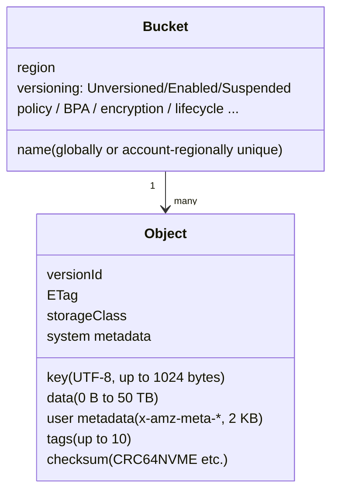
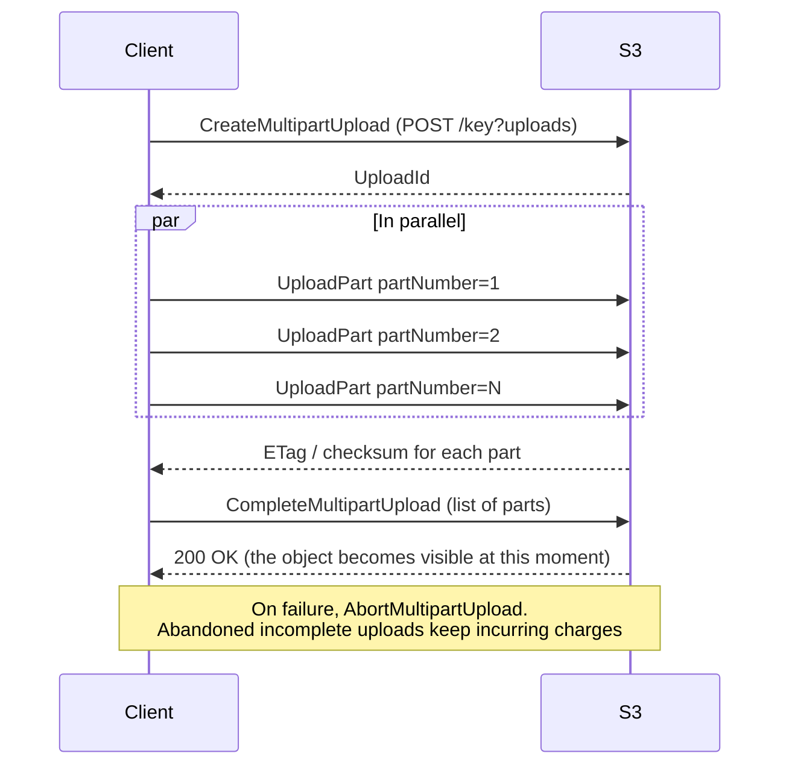
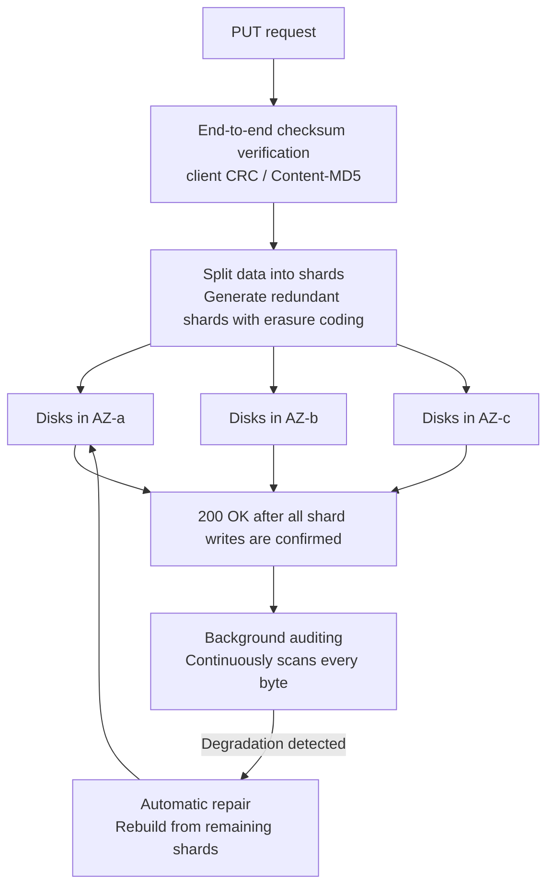
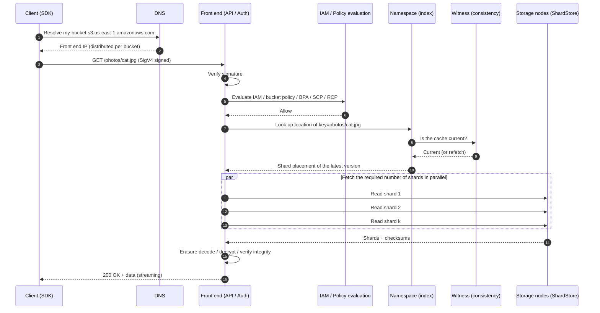

# What is Amazon S3: overview, data model, and internal architecture

_Last verified: 2026-10-03_

This chapter is the entry point to s3-atlas. It covers what S3 (Amazon Simple Storage Service) is, what shape it has, how it works, and how far it scales. Individual features (storage classes, security, pricing, and so on) are covered in depth in later chapters.

Every number here was checked against official AWS documentation, the AWS News Blog, What's New posts, or published papers. Anything that could not be confirmed is marked "unverified".

## Contents

- Section 1: S3 in one sentence
- Section 2: History: 2006 to 2026
- Section 3: Data model: bucket / object / key / prefix / metadata / version ID / ETag
- Section 4: Bucket types: general purpose / directory / table / vector
- Section 5: Naming rules
- Section 6: Regions and endpoints
- Section 7: The shape of the REST API
- Section 8: Consistency model
- Section 9: How 11 nines of durability is achieved
- Section 10: Limits and quotas
- Section 11: Published scale statistics
- Section 12: Internal architecture (based on public information)
- Section 13: The path of a request (diagram)
- Section 14: Common misconceptions
- References

## 1. S3 in one sentence

S3 is **a fully managed, Regional object store accessed through an HTTP(S) REST API**.

- It is not a file system. There is (basically) no directory tree, no inodes, and no locking
- It is not block storage either. An object is basically something you **put whole / read whole (or partially with Range) / delete whole**
- You do not provision capacity in advance. You pay for what you use (GB-months), the number of requests, and data transfer
- Designed durability is 99.999999999% (11 nines). S3 Standard is designed for 99.99% availability

```text
          ┌──────────────── AWS Region (e.g. us-east-1) ───────────────┐
          │                                                             │
 Client ──┼──HTTPS──▶  bucket "my-app-logs"                             │
 (SDK /   │              ├── object  key="2026/10/03/app.log"  (bytes + metadata)
  CLI /   │              ├── object  key="2026/10/03/app.log.1"
  curl)   │              └── object  key="index.html"
          │                                                             │
          │   Data is spread across multiple AZs (>=3) (except One Zone)│
          └─────────────────────────────────────────────────────────────┘
```

Here is how S3 compares with other AWS storage services.

| Aspect | S3 (object) | EBS (block) | EFS / FSx (file) |
| --- | --- | --- | --- |
| Access method | HTTP REST API / SDK | OS block device | NFS / SMB / POSIX |
| Unit | Object (up to 50 TB) | Block (volume) | File / directory |
| Partial update | No (overwrite only; append is supported only in Express One Zone) | Yes | Yes |
| Scope | Region (AZ-redundant) | Single AZ | Region or AZ |
| Capacity provisioning | Not needed (unlimited) | Size specified up front | Grows automatically (EFS) |
| Concurrent access | Effectively unlimited clients | Basically one instance (Multi-Attach is the exception) | Many clients |

In 2026-04, **S3 Files** (an EFS-based service that lets you mount an S3 bucket as a POSIX file system) became GA, so the line "S3 is not a file system" is gradually blurring. The semantics of S3 itself (the object API) have not changed, however.

## 2. History: 2006 to 2026

S3 became generally available in the US on **2006-03-14** (Pi Day), making it one of the earliest generally available AWS services. It turned 20 in 2026-03, and the AWS News Blog published an anniversary post.

### 2.1 S3 at launch (2006)

According to the 20th-anniversary post (published 2026-03-13), S3 at launch looked like this.

| Item | At launch in 2006 | 2026 |
| --- | --- | --- |
| Total capacity | About 1 PB | Hundreds of exabytes |
| Storage nodes | About 400 nodes / 15 racks / 3 data centers | Not published (said to be tens of millions of HDDs) |
| Total bandwidth | 15 Gbps | Said to peak at about 1 PB/s (see below; check the source) |
| Maximum object size | 5 GB | 50 TB (10,000x) |
| Storage price | 15 cents / GB-month | Just over 2 cents / GB-month (about 85% lower) |
| Scale | — | Over 500 trillion objects, over 200 million req/s, 39 Regions and 123 AZs |

### 2.2 Major milestones

A detailed timeline (with dates and URLs) is in `data/timeline.json`. Only the turning points that changed the character of S3 are listed here.

| Year | Event | Significance |
| --- | --- | --- |
| 2006 | S3 launch | A simple object store with PUT/GET/DELETE/LIST |
| 2010 | Versioning, Reduced Redundancy Storage, Multipart Upload | Foundations for data protection and large uploads |
| 2011 | Static website hosting, SSE (server-side encryption) | Web delivery and encryption |
| 2012 | Amazon Glacier, Glacier archiving via lifecycle | Hot/cold tiering begins |
| 2014 | Event notifications | S3 becomes the starting point of event-driven architectures |
| 2015 | Standard-IA, cross-Region replication, VPC endpoints | Storage classes diversify |
| 2017 | Major us-east-1 outage (2017-02-28) | Trigger for stronger safeguards in operational tooling |
| 2018 | Block Public Access, Intelligent-Tiering, Object Lock, One Zone-IA | Countermeasures for public-bucket incidents, and automatic tiering |
| 2019 | Glacier Deep Archive, Batch Operations, Access Points | Tape-replacement price point, large-scale bulk operations |
| 2020 | **Strong consistency (strong read-after-write)**, Storage Lens, Bucket Keys | The year "eventually consistent S3" ended |
| 2021 | Object Lambda, Multi-Region Access Points, Glacier Instant Retrieval, disabling ACLs | Simpler access control |
| 2023 | Default encryption (SSE-S3) for all new objects, BPA + ACLs disabled by default for new buckets, **Express One Zone**, Mountpoint | Secure by default, low-latency tier |
| 2024 | No charges for unauthorized 403 requests, **conditional writes**, bucket limit of 10,000, **S3 Tables**, S3 Metadata (preview) | S3 becomes an analytics and data platform |
| 2025 | S3 Metadata GA, large Express One Zone price cuts, **S3 Vectors** (preview → GA), **50 TB maximum object size** | Storage for the AI era |
| 2026 | Account regional namespaces, **S3 Files**, SSE-C disabled by default, Annotations, removal of the 30-day requirement for IA transitions, Iceberg V3 | Bucket name collisions solved, file and AI integration |

### 2.3 Key points of the 2017-02-28 us-east-1 outage

This is the most famous outage in S3's history. The key points of AWS's official post-event summary (Summary of the Amazon S3 Service Disruption in the Northern Virginia (US-EAST-1) Region) are as follows.

- While debugging the S3 billing system, an operator entered a command that removed more servers than intended
- The removed servers included ones supporting the **index subsystem** (which manages the metadata and location of every object in the Region) and the **placement subsystem** (which decides where new objects are stored)
- Both subsystems needed a full restart, and because they had not been fully restarted in years, it took longer than expected
- Remediation: safeguards so tools cannot reduce capacity below a minimum, and work to split subsystems into small "cells" to shorten recovery time

This separation of index (metadata) from placement / storage (data) ties directly into the internal architecture described later.

## 3. Data model

### 3.1 Basic elements



| Element | Description | Main constraints |
| --- | --- | --- |
| Bucket | A container for objects. Belongs to a Region | Name is 3 to 63 characters. Name and Region cannot be changed after creation |
| Object | The data itself + metadata | 0 B to about 50 TB (48.8 TiB) |
| Key | A string that uniquely identifies an object within a bucket | Up to 1,024 bytes in UTF-8 |
| Prefix | The leading part of a key. The unit for filtering LIST and for performance partitioning | A logical concept (it has no physical existence) |
| Metadata | System-defined (Content-Type, etc.) and user-defined (`x-amz-meta-*`) | User-defined is up to 2 KB (the whole PUT header is up to 8 KB) |
| Tags | Key-value pairs. Usable in IAM conditions, lifecycle, and cost allocation | Up to 10 per object |
| Version ID | Identifies each version of an object when versioning is enabled | `null` when disabled |
| ETag | A hash-like identifier of the object's content | Not necessarily MD5 (see below) |
| Annotations | Added in 2026-06. JSON/XML/YAML context data attached to an object after the fact | Docs say up to 1 MB per annotation; the announcement says up to 1 GB per object |

An object's "address" is uniquely determined by the combination **bucket + key (+ versionId)**.

```text
s3://my-bucket/photos/2026/10/cat.jpg
     ^^^^^^^^^ ^^^^^^^^^^^^^^^^^^^^^^^
      bucket            key
```

### 3.2 The flat namespace and what "folders" really are

The S3 namespace is **flat**. `photos/2026/10/cat.jpg` is not "the 2026 folder inside the photos folder...", it is simply **one string key**, `photos/2026/10/cat.jpg`.

The console shows things like folders because when you pass `delimiter=/` to `ListObjectsV2`, it groups the common part up to the delimiter and returns it as `CommonPrefixes`.

```text
Actual keys in the bucket (flat):
  photos/2026/10/cat.jpg
  photos/2026/10/dog.jpg
  photos/2026/11/bird.jpg
  readme.txt

Result of ListObjectsV2(prefix="photos/", delimiter="/"):
  Contents:       (none)
  CommonPrefixes: ["photos/2026/"]

Result of ListObjectsV2(prefix="photos/2026/", delimiter="/"):
  CommonPrefixes: ["photos/2026/10/", "photos/2026/11/"]
```

Consequences of the flat namespace:

- **There is no "folder rename"**. You must CopyObject + DeleteObject every object under the prefix (N copies for N objects)
- "Create folder" in the console just creates a 0-byte object whose key ends in `/` (`photos/`)
- Empty "folders" do not exist conceptually (except for 0-byte marker objects)
- **Directory buckets (Express One Zone)** are the exception: they manage keys in a truly hierarchical directory structure. LIST ordering guarantees and other behaviors also differ

### 3.3 Prefixes are also a unit of performance

A general purpose bucket can handle **at least 3,500 PUT/COPY/POST/DELETE req/s and 5,500 GET/HEAD req/s per partitioned prefix**. There is no limit on the number of prefixes, so spreading requests across prefixes scales horizontally (for example, 10 prefixes give 55,000 read req/s).

When load spikes, S3 automatically repartitions prefixes, and while that happens it may temporarily return `503 Slow Down`. Clients are expected to absorb this with retries using exponential backoff.

### 3.4 Kinds of metadata

| Kind | Example | Mutable? |
| --- | --- | --- |
| System-defined (system-controlled) | `Date`, `Last-Modified`, `Content-Length`, `x-amz-version-id` | No |
| System-defined (user-controlled) | `Content-Type`, `Cache-Control`, `x-amz-storage-class`, `x-amz-server-side-encryption`, `x-amz-website-redirect-location` | Set at upload. Changing it later requires a copy |
| User-defined | `x-amz-meta-author: alice` | Upload only. Changing it means a copy, which is treated as a new object |
| Object tags | `project=atlas` | Can be changed later with PutObjectTagging |
| Annotations (2026-) | Summaries, classifications, AI-generated descriptions | Can be created, updated, and deleted later |

User-defined metadata **cannot be changed after the object is created** (you copy and recreate it). The standard practice is to keep frequently changing attributes in tags or annotations, or in an external DB / S3 Metadata tables.

### 3.5 Version IDs and versioning

A bucket has three versioning states.

| State | Behavior |
| --- | --- |
| Unversioned (default) | A PUT to the same key overwrites. DELETE removes immediately. The version ID is `null` |
| Enabled | Every PUT gets a new version ID, and older versions remain as noncurrent versions. DELETE just adds a **delete marker** |
| Suspended | New PUTs are created with version ID `null`, overwriting any existing `null` version. Past versions remain |

Once a bucket is Enabled, it cannot go back to Unversioned (it can be Suspended).

```text
Example operations on key="a.txt" in a bucket with Versioning=Enabled

PUT a.txt (v1)          → [v1]
PUT a.txt (v2)          → [v2 (current), v1]
DELETE a.txt            → [DeleteMarker (current), v2, v1]   ← GET a.txt returns 404
DELETE a.txt?versionId=<DeleteMarker> → [v2 (current), v1]   ← restored
DELETE a.txt?versionId=v1             → [v2]                 ← permanently deleted
```

Noncurrent versions are billed too. Without a lifecycle `NoncurrentVersionExpiration` rule, storage quietly grows (covered in the pricing chapter).

### 3.6 What an ETag really means

ETags are often described as "the object's MD5", but strictly speaking that only holds under certain conditions.

| How the object was created | ETag |
| --- | --- |
| Created by PutObject / POST / Copy, unencrypted or SSE-S3 | MD5 digest of the object data |
| Encrypted with SSE-C or SSE-KMS | Not MD5 |
| Created by Multipart Upload or Part Copy | Not MD5, regardless of encryption (the known form is a hash of the concatenated MD5s of each part + `-<number of parts>`, but this is not guaranteed by the spec) |

For integrity checks, the current recommendation is to use **additional checksums** rather than ETags (CRC64NVME, CRC32, CRC32C, SHA-1, SHA-256, plus MD5, XXHash3/64/128, and SHA-512 added in 2026-04, for 10 in total). Since 2024-12, the latest SDKs compute and send a CRC checksum by default on upload, and S3 verifies and stores it.

ETags matter as the comparison value for **conditional requests** (`If-Match` / `If-None-Match`). In 2024 they became usable on the write side as well (Section 7).

## 4. Bucket types

As of 2026, S3 has **four types of buckets**. They are all called "buckets", but their APIs, namespaces, and internal structures differ considerably.

| Type | Introduced | Use | Name example / identification | API namespace | Redundancy |
| --- | --- | --- | --- | --- | --- |
| General purpose bucket | 2006 | General purpose. Almost every use case | `my-bucket` / `my-bucket-111122223333-us-east-1-an` | `s3` | Multiple AZs (One Zone-IA uses 1 AZ) |
| Directory bucket | 2023-11 | S3 Express One Zone (low latency), data residency in Local Zones | `name--use1-az4--x-s3` | `s3` (Zonal / Regional endpoints) | Single AZ (or Local Zone) |
| Table bucket | 2024-12 | Apache Iceberg tables (S3 Tables) | Identified by ARN. `--table-s3` is a reserved suffix | `s3tables` | Multiple AZs |
| Vector bucket | 2025-07 (preview) / 2025-12 (GA) | Storing vector embeddings and similarity search (S3 Vectors) | Identified by ARN | `s3vectors` | Claims the same durability and availability as S3 |

### 4.1 General purpose bucket

- The ordinary S3 bucket that has always existed
- Names are **globally unique within a partition** (four partitions: aws / aws-cn / aws-us-gov / aws-eusc)
- Since 2026-03 you can also create them in an **account regional namespace**, in the form `<prefix>-<12-digit account ID>-<region>-an`, with no risk of another account taking the name
- The default limit is **10,000 buckets per account** (raised from 100 in 2024-11). You can request up to 1 million through Service Quotas
- For accounts approved for more than 10,000, `ListBuckets` without pagination is rejected

### 4.2 Directory bucket

- Dedicated to the S3 Express One Zone storage class (One Zone-IA is also allowed in Local Zones)
- Stores data in a single AZ, targeting consistent single-digit millisecond latency
- Authentication is session-based, using sessions obtained via `CreateSession` (to avoid the cost of per-request IAM evaluation)
- Keys are managed as a true hierarchical directory. LIST results are not guaranteed to be in lexicographic order
- Up to 2 million GET TPS / 200,000 PUT TPS per directory bucket (per the AWS News Blog)
- The default limit is 100 per account (adjustable)
- Supports append (writing to the end of an existing object), which general purpose buckets do not

### 4.3 Table bucket (S3 Tables)

- A dedicated bucket for tabular data in Apache Iceberg format
- Automatically handles compaction, snapshot management, and removal of unreferenced files
- Access control per table
- Intelligent-Tiering and replication in 2025-12, Iceberg V3 support in 2026-09, and in 2026-10 the per-Region table bucket limit was raised from 10 to 100

### 4.4 Vector bucket (S3 Vectors)

- A dedicated bucket that stores vector embeddings and accepts similarity search (k-NN) queries
- Published figures at GA: up to 2 billion vectors per index, 10,000 indexes per bucket, sub-second latency for infrequent queries and about 100 ms for frequent queries
- Integrates with Bedrock Knowledge Bases and OpenSearch Service
- Added metadata pre-filtering in 2026

## 5. Naming rules

### 5.1 General purpose bucket names

- 3 to 63 characters
- Only lowercase letters, digits, periods `.`, and hyphens `-`
- Must start and end with a letter or digit
- No consecutive periods, no IP address format (`192.168.5.4`)
- Reserved prefixes: `xn--`, `sthree-`, `amzn-s3-demo-`
- Reserved suffixes: `-s3alias` (access point alias), `--ol-s3` (Object Lambda), `.mrap` (Multi-Region Access Point), `--x-s3` (directory bucket), `--table-s3` (table bucket)
- Names ending in `-an` can only be used in account regional namespaces
- Buckets that use Transfer Acceleration cannot contain periods
- Names with periods are discouraged (except for static website use) because certificates do not match with virtual-hosted style + HTTPS
- Before 2018-03-01, us-east-1 allowed up to 255 characters, uppercase letters, and underscores (legacy)

**Bucket name "takeover" problem**: when you delete a bucket in the shared global namespace, another account can recreate that name. If apps, docs, or CloudFormation still reference the old bucket name, you risk sending data to a third party's bucket or reading a third party's data. AWS recommends either "empty it and keep it instead of deleting" or "use an account regional namespace".

### 5.2 Directory bucket names

```text
base-name--zoneid--x-s3
e.g. my-cache--use1-az4--x-s3
```

- Unique within the chosen Zone (AZ or Local Zone)
- 3 to 63 characters including the suffix

### 5.3 Object key names

- Up to 1,024 bytes in UTF-8 (bytes, not characters. A Japanese character is 3 bytes, so about 341 characters)
- Any UTF-8 is allowed, but the safe characters are alphanumerics, `! - _ . * ' ( )`, and `/`
- `&`, `$`, `@`, `=`, `;`, `:`, `+`, space, `,`, `?`, and similar characters require URL encoding and are easily mishandled by tools
- `\`, `{`, `}`, `^`, `%`, `` ` ``, `]`, `"`, `>`, `[`, `~`, `<`, `#`, `|`, and control characters should be avoided
- Keys containing `./` or `../` get path-resolved by the console and tools, which causes accidents

## 6. Regions and endpoints

### 6.1 Regions

A bucket's Region is chosen at creation and cannot be changed afterward. Data does not leave that Region unless you explicitly replicate it. As of 2026-03, S3 runs in 39 Regions and 123 AZs (20th-anniversary post).

### 6.2 Two URL styles

| Style | Format | Status |
| --- | --- | --- |
| Virtual-hosted style | `https://BUCKET.s3.REGION.amazonaws.com/KEY` | Recommended |
| Path style | `https://s3.REGION.amazonaws.com/BUCKET/KEY` | Deprecated. In 2019-05 AWS announced it would end for buckets created after 2020-09-30, but this was postponed and it is still available |
| Legacy global | `https://BUCKET.s3.amazonaws.com/KEY` | Routed to us-east-1. Not redirected for buckets in Regions launched after 2019-03-20 |

```text
virtual-hosted:  https://my-bucket.s3.ap-northeast-1.amazonaws.com/photos/cat.jpg
                         ^^^^^^^^^    ^^^^^^^^^^^^^^               ^^^^^^^^^^^^^^
                          bucket          region                        key

path-style:      https://s3.ap-northeast-1.amazonaws.com/my-bucket/photos/cat.jpg
```

Virtual-hosted style is recommended because the bucket name is part of the DNS hostname, which lets S3 route at the DNS level per bucket (with path style, every request converges on a Region-wide hostname).

### 6.3 Other endpoints

| Endpoint | Example format | Use |
| --- | --- | --- |
| Dualstack (IPv4 + IPv6) | `BUCKET.s3.dualstack.REGION.amazonaws.com` | IPv6 clients |
| FIPS | `BUCKET.s3-fips.REGION.amazonaws.com` (dualstack version is `s3-fips.dualstack`) | US government workloads that require FIPS 140-validated cryptographic modules |
| Transfer Acceleration | `BUCKET.s3-accelerate.amazonaws.com` (`s3-accelerate.dualstack` also exists) | Fast long-distance transfers via CloudFront edges |
| Static website | `BUCKET.s3-website-REGION.amazonaws.com` or `BUCKET.s3-website.REGION.amazonaws.com` (varies by Region) | HTTP only, index/error documents, redirects |
| Access Point | `ACCESSPOINT-ACCOUNTID.s3-accesspoint.REGION.amazonaws.com` | Per-application access control |
| Multi-Region Access Point | `ALIAS.accesspoint.s3-global.amazonaws.com` | Proximity routing across multiple Regions |
| Directory bucket (Zonal) | `BUCKET.s3express-use1-az4.us-east-1.amazonaws.com` | Express One Zone data plane |
| Directory bucket (Regional) | `s3express-control.us-east-1.amazonaws.com` | Control plane, such as CreateBucket |
| Gateway VPC endpoint | (DNS stays the normal S3 name; traffic is steered by route tables) | Reach S3 from inside a VPC at no charge |
| Interface VPC endpoint (PrivateLink) | `bucket.vpce-xxxx.s3.REGION.vpce.amazonaws.com` | Reach S3 over private IPs from on premises or other VPCs (paid) |

## 7. The shape of the REST API

### 7.1 HTTP verbs and operations

The S3 API maps fairly directly onto HTTP verbs.

| HTTP | Target | Main operations |
| --- | --- | --- |
| `PUT` | `/key` | PutObject (a single PUT is up to 5 GB), CopyObject (`x-amz-copy-source`), UploadPart |
| `GET` | `/key` | GetObject (partial retrieval with the Range header) |
| `HEAD` | `/key` | HeadObject (metadata only) |
| `DELETE` | `/key` | DeleteObject |
| `POST` | `/?delete` | DeleteObjects (bulk delete of up to 1,000 keys) |
| `POST` | `/key?uploads` | CreateMultipartUpload |
| `POST` | `/key?uploadId=...` | CompleteMultipartUpload |
| `POST` | `/key?restore` | RestoreObject (temporary restore from Glacier classes) |
| `POST` | `/` (form) | POST Object from a browser (signed policy) |
| `GET` | `/?list-type=2` | ListObjectsV2 |
| `GET` | `/?versions` | ListObjectVersions |
| `PUT` / `GET` / `DELETE` | `/?policy`, `/?lifecycle`, `/?versioning` ... | Bucket subresource configuration |

Example: PutObject as raw HTTP.

```http
PUT /photos/cat.jpg HTTP/1.1
Host: my-bucket.s3.ap-northeast-1.amazonaws.com
Content-Type: image/jpeg
Content-Length: 48213
x-amz-meta-author: alice
x-amz-storage-class: STANDARD_IA
x-amz-checksum-crc64nvme: <base64>
x-amz-content-sha256: <hex or UNSIGNED-PAYLOAD>
x-amz-date: 20261003T010203Z
Authorization: AWS4-HMAC-SHA256 Credential=AKIA.../20261003/ap-northeast-1/s3/aws4_request, SignedHeaders=..., Signature=...

<48213 bytes of JPEG>
```

```http
HTTP/1.1 200 OK
ETag: "9b2cf535f27731c974343645a3985328"
x-amz-version-id: 3HL4kqtJlcpXroDTDmJ.rmSpXd3dIbrHY
x-amz-server-side-encryption: AES256
x-amz-checksum-crc64nvme: <base64>
```

Authentication uses **SigV4** (AWS Signature Version 4). SigV2 cannot be used with new buckets (it has been phased out).

### 7.2 ListObjectsV2

`ListObjectsV2` returns up to 1,000 keys per request and paginates with `ContinuationToken`.

```bash
aws s3api list-objects-v2 \
  --bucket my-bucket \
  --prefix "logs/2026/10/" \
  --delimiter "/" \
  --max-keys 1000
```

| Parameter | Meaning |
| --- | --- |
| `prefix` | Only keys that start with this string |
| `delimiter` | Delimiter character. Everything after it is grouped into `CommonPrefixes` |
| `max-keys` | Maximum items per page (up to 1,000) |
| `continuation-token` | The `NextContinuationToken` from the previous page |
| `start-after` | List starting after this key |
| `fetch-owner` | Whether to include Owner information |

Properties:

- In general purpose buckets, results are returned in **UTF-8 binary order of keys (lexicographic)**
- In directory buckets, order is not guaranteed
- V1 (`ListObjects`) uses `Marker`. New implementations should use V2
- Scanning billions of objects with LIST is slow and expensive (one request per 1,000 items = $0.005/1,000 req on Standard). To get a full inventory, use **S3 Inventory** or the **S3 Metadata live inventory table**

### 7.3 Multipart Upload

Large objects are split into parts and uploaded in parallel.



- Part numbers 1 to 10,000
- Part size 5 MiB to 5 GiB (no minimum for the last part)
- A rule of thumb is to consider multipart above 100 MB
- Parts of incomplete multipart uploads keep incurring storage charges. The standard practice is to clean them up automatically with the lifecycle `AbortIncompleteMultipartUpload` action

### 7.4 Conditional requests

| Header | Read (GET/HEAD) | Write (PUT / CompleteMultipartUpload) |
| --- | --- | --- |
| `If-Match: <ETag>` | Returns the object if the ETag matches | Supported since 2024-11. Returns `412 Precondition Failed` on mismatch (optimistic locking) |
| `If-None-Match: *` | — | Supported since 2024-08. Returns `412` if the key already exists (create-if-not-exists) |
| `If-None-Match: <ETag>` | Returns the object if it does not match (304 if it matches) | — |
| `If-Modified-Since` / `If-Unmodified-Since` | Conditional on date/time | — |

Conditional writes made it possible to do "exclusive creation" and "compare-and-swap-style updates" with S3 alone. More and more cases, such as Iceberg / Delta Lake commits and distributed lock implementations, no longer need an external DB (DynamoDB, etc.). In 2024-11 it also became possible to **enforce** conditional writes with a bucket policy.

### 7.5 Common errors

| Status | Example codes | Meaning |
| --- | --- | --- |
| 301 / 307 | `PermanentRedirect` / `TemporaryRedirect` | Request sent to an endpoint in a different Region |
| 400 | `InvalidRequest`, `EntityTooLarge` | Invalid parameters / over 5 GB in a single PUT, etc. |
| 403 | `AccessDenied` | No permission (403s from outside the account/organization are not billed since 2024) |
| 404 | `NoSuchKey`, `NoSuchBucket` | Does not exist |
| 409 | `BucketAlreadyExists`, `OperationAborted` | Name collision / conflicting operation in progress |
| 412 | `PreconditionFailed` | Condition of a conditional request not met |
| 416 | `InvalidRange` | Invalid Range |
| 503 | `SlowDown` | Request rate exceeded. Back off and retry |

## 8. Consistency model

### 8.1 Before and after 2020-12

| Period | GET after new PUT | GET after overwrite/delete | LIST |
| --- | --- | --- | --- |
| Up to 2020-11 | Read-after-write (but eventually consistent if you had GET a 404 beforehand) | Eventually consistent (stale data could be returned) | Eventually consistent |
| From 2020-12-01 | **Strongly consistent** | **Strongly consistent** | **Strongly consistent** |

At re:Invent in 2020-12, S3 began providing **strong read-after-write consistency in all Regions for all objects (including existing ones), with no extra charge and no performance penalty**.

- After a write (new PUT, overwrite PUT, DELETE) returns a success response, any subsequent GET / HEAD / LIST always reflects that write
- Changes to tags, ACLs, and metadata are also strongly consistent
- This made external metadata stores that compensated for S3's eventual consistency, such as EMRFS Consistent View and S3Guard, unnecessary

### 8.2 What is still not strongly consistent

- **Bucket configuration** (bucket policies, lifecycle, versioning settings, etc.) is eventually consistent. Configuration changes can take time to propagate everywhere (some documentation says up to about 15 minutes for lifecycle)
- Behavior right after creating or deleting a bucket
- **Concurrent writes to the same key** are last-writer-wins. Which one wins cannot be predicted from the client side. If you need ordering control, use conditional writes (`If-Match`)
- **Cross-Region replication** is asynchronous (with RTC, there is an SLA to replicate 99.99% within 15 minutes)
- There is no object locking (mutual exclusion) mechanism

### 8.3 How it was achieved (public information)

According to Werner Vogels's article "Diving Deep on S3 Consistency" (2021), S3's metadata subsystem had a cache layer, and that was the source of eventual consistency. To make it strongly consistent, AWS introduced a new **witness component** that tracks the order of metadata updates, so reads can tell whether the cache is stale. The article explains that automated reasoning (formal methods) was used to verify correctness.

```text
           Write                            Read
Client ──PUT──▶ Front end ──▶ Metadata     Client ──GET──▶ Front end
                     │         (index)                           │
                     │           ▲                               ▼
                     └─notify──▶ Witness ◀──── "Is this cache current?" ─ Cache
                                (tracks order)   If stale, refetch from index
```

## 9. How 11 nines of durability is achieved

### 9.1 What 11 nines means

Annual durability of 99.999999999% (11 nines) is, in AWS's words, a design target of "if you store 10 million objects, you can on average expect to lose one object every 10,000 years". **It is a design value, not an SLA**; what the SLA guarantees is availability (monthly uptime).

| Metric | Meaning | S3 Standard |
| --- | --- | --- |
| Durability | Probability that data is not lost | 99.999999999% (design value) |
| Availability | Probability that requests are served | 99.99% (design value) / 99.9% (SLA) |

Note: durability is **protection against failures on the AWS side, such as hardware faults**. It does not protect you from your own accidental deletes, overwrites, or ransomware. That is the job of versioning, Object Lock, replication, and AWS Backup.

### 9.2 Mechanisms behind durability (based on public information)



| Mechanism | Description | Source |
| --- | --- | --- |
| Spread across multiple AZs | Standard and similar classes store data redundantly across three or more AZs. Tolerates the loss of one AZ | Storage class comparison table |
| Erasure coding | Reed-Solomon-style coding provides redundancy with less capacity overhead than replication. Used together with replication | Warfield (article based on the FAST '23 keynote) |
| Success response after write confirmation | Returns 200 only after data is stored redundantly | S3 FAQ |
| Checksums | Data in transit and at rest is verified with checksums. Since 2024-12, SDKs send a CRC by default | What's New 2024-12 |
| Continuous auditing and automatic repair | A set of microservices continuously inspects every byte and automatically repairs any degradation found | 20th-anniversary post |
| Formal methods | ShardStore (the KV store on storage nodes) is verified with lightweight formal methods | SOSP 2021 paper |
| Rust | Performance-critical code was gradually rewritten in Rust over 8 years | 20th-anniversary post |
| Durability review | A culture of reviewing every change for "ways it could lose data", similar to threat modeling | Warfield article |

### 9.3 ShardStore and lightweight formal methods

The key-value store that manages shards (pieces of data) on S3 storage nodes is called **ShardStore** and is written in Rust. The approach was published in the SOSP 2021 paper "Using Lightweight Formal Methods to Validate a Key-Value Storage Node in Amazon S3" (Bornholt et al.).

- An **executable reference model (executable specification)** is written in Rust, the same language as the implementation
- The production code and the reference model are fed the same sequences of operations, and **property-based testing** checks at scale that the results match
- Crash-consistency bugs (correct recovery after power loss or crashes) and concurrency bugs are also explored with model-checking-style techniques
- The key point is that instead of "complete formal proofs", formal methods were adopted in a lightweight form that engineers can run day to day

This paper and Warfield's talk show that "11 nines" depends heavily not only on hardware redundancy but also on **software correctness**.

## 10. Limits and quotas

Main values as of 2026-10. Figures come from the S3 quota table in the AWS General Reference and the User Guide.

### 10.1 Objects

| Item | Value | Notes |
| --- | --- | --- |
| Maximum object size | **50 TB** (48.828125 TB in the quota table, 48.8 TiB in the User Guide) | Increased 10x from 5 TB in 2025-12. All Regions and all storage classes |
| Maximum size of a single PUT | 5 GB | Multipart Upload is required above this |
| Console upload limit | 160 GB | |
| Number of multipart parts | Up to 10,000 | Part numbers 1 to 10,000 |
| Part size | 5 MiB to 5 GiB | No minimum for the last part. 5 GiB × 10,000 ≈ 48.8 TiB is the basis for the maximum size |
| Items per ListParts / ListMultipartUploads response | Up to 1,000 | |
| Key length | 1,024 bytes (UTF-8) | |
| User-defined metadata | 2 KB | The whole PUT request header is up to 8 KB |
| Object tags | 10 | |
| Annotations | Up to 1 MB per annotation (User Guide) / up to 1 GB per object (announcement) | Added in 2026-06 |
| Keys per DeleteObjects call | 1,000 | |

### 10.2 Buckets and accounts

| Item | Default | Adjustable? |
| --- | --- | --- |
| General purpose buckets | 10,000 / account | Yes (up to 1 million) |
| Directory buckets | 100 / account | Yes |
| Table buckets | 100 / Region / account (raised from 10 in 2026-10) | Request through Support |
| Objects per bucket | Unlimited | — |
| Capacity per bucket | Unlimited | — |
| Bucket policy size | 20 KB | No |
| Bucket tags | 50 | No |
| Lifecycle rules | 1,000 / bucket | No |
| Event notification configurations | 100 / bucket | No |
| Access Points | 10,000 / Region / account | Yes |
| Multi-Region Access Points | 100 / account, 20 Regions per MRAP | No |

### 10.3 Performance

| Item | Value |
| --- | --- |
| Writes per prefix | At least 3,500 PUT/COPY/POST/DELETE req/s |
| Reads per prefix | At least 5,500 GET/HEAD req/s |
| Number of prefixes | Unlimited |
| Per directory bucket | Up to 2 million GET TPS / 200,000 PUT TPS |
| Glacier restore requests | 1,000 TPS / account |
| Glacier restore throughput | 1 to 2 PB/day / account |

## 11. Published scale statistics

AWS publishes S3's scale at milestones. Always pair a figure with its year and source.

| Point in time | Objects | Requests | Data | Source |
| --- | --- | --- | --- | --- |
| 2006 (launch) | — | — | About 1 PB of total capacity | AWS News Blog 20th-anniversary post (2026-03-13) |
| 2022-03 | Over 200 trillion | Over 100 million req/s on average | — | AWS News Blog (Pi Day 2022) |
| 2023-07 | Over 280 trillion | Over 100 million req/s on average | Millions of drives | Werner Vogels, All Things Distributed (guest post by Warfield, 2023-07-27) |
| 2025 | Over 500 trillion | Hundreds of millions of TPS | Hundreds of EB | The Pragmatic Engineer interview with Mai-Lan Tomsen Bukovec (secondary source) |
| 2026-03 | **Over 500 trillion** | **Over 200 million req/s** | **Hundreds of EB** | AWS News Blog 20th-anniversary post |

Notes:

- The 2023-07 row comes from the "S3 by the numbers" table image in the All Things Distributed article (as of 2023-07-24), which says "more than 280 trillion objects and averages over 100 million requests per second"; the AWS News Blog Pi Day 2023 post (2023-03-14) gives the same figures
- "Tens of millions of HDDs" is stated in the AWS News Blog 20th-anniversary post (2026-03): "If you stacked all of the tens of millions S3 hard drives on top of each other, they would reach the International Space Station and almost back"
- "Peak bandwidth of about 1 PB/s" is widely quoted in secondary sources (blogs, newsletters) as something said in re:Invent S3 sessions, but this research found it in no AWS document (documentation, News Blog, What's New, or All Things Distributed). The only primary source appears to be the talk videos, which this guide has not checked against a transcript (unverified)
- In the 5 months to GA (2025-07 to 12), S3 Vectors saw over 250,000 indexes, over 40 billion vectors ingested, and over 1 billion queries (20th-anniversary post)

## 12. Internal architecture (based on public information)

Much of S3's internal structure is not public, but a rough picture emerges from Andy Warfield's (VP / Distinguished Engineer at Amazon) FAST '23 keynote, the All Things Distributed article summarizing it, "Building and operating a pretty big storage system called S3" (2023-07-27), the 2017 outage report, and the SOSP 2021 paper.

### 12.1 Major components

```text
┌───────────────────────────────────────────────────────────────────────┐
│                          S3 (one Region)                              │
│                                                                       │
│  ┌──────────────┐   ┌──────────────────────┐   ┌────────────────────┐ │
│  │  Front end   │   │  Namespace / Index   │   │   Storage fleet    │ │
│  │  fleet       │──▶│  (metadata: key →    │   │  (millions of      │ │
│  │  DNS, LB,    │   │   data location)     │   │   HDDs + ShardStore│ │
│  │  REST API,   │──────────────────────────────▶│  erasure-coded     │ │
│  │  authN/authZ │   └──────────────────────┘   │  shards            │ │
│  └──────────────┘            ▲                 └────────────────────┘ │
│                              │                          ▲             │
│                   ┌──────────┴──────────────────────────┴──────────┐  │
│                   │  Background services                           │  │
│                   │  (audit/repair, replication, lifecycle/        │  │
│                   │   tiering, placement, billing/metering ...)    │  │
│                   └────────────────────────────────────────────────┘  │
│                                                                       │
│   * S3 as a whole consists of "hundreds of microservices"             │
│     (Warfield, 2023)                                                  │
└───────────────────────────────────────────────────────────────────────┘
```

| Layer | Role | Notes |
| --- | --- | --- |
| Front end | Accepts HTTP, SigV4 authentication, IAM/bucket policy evaluation, request routing | Virtual-hosted style is recommended because DNS distributes traffic per bucket |
| Namespace (index) | Mapping from key to data location, versions, metadata | The "index subsystem" in the 2017 outage report. The strong-consistency witness is also involved here |
| Placement | Decides which disks new data goes on | The "placement subsystem" in the 2017 outage report |
| Storage fleet | Stores the actual data (shards) on HDDs. The KV store on each node is ShardStore | Written in Rust. Verified with lightweight formal methods |
| Background | Auditing/repair, replication, lifecycle, storage class transitions, etc. | Invisible to users |

Organizationally, each of these components has its own team, run "like an independent business" (Warfield).

### 12.2 Heat management: living with the physical limits of HDDs

The best-known part of Warfield's talk is **heat management**.

- HDD capacity grows every year, but IOPS (seek performance) per drive barely grows. I/O performance per unit of capacity actually keeps falling
- Individual customer workloads are very bursty (concentrated on specific data at a given moment)
- But **aggregating millions of workloads smooths out demand** and makes it predictable
- S3 scatters the shards of a single object across a very large number of disks (spreading data placement). As a result, one customer's burst does not become a hotspot on particular disks but spreads thinly across the whole fleet
- Erasure coding serves not only durability: because data can be reconstructed from any sufficient combination of shards, it can also spread I/O, for example by reading around busy disks

In other words, S3's performance profile (per-request latency in the tens of milliseconds, but throughput that grows practically without limit when parallelized) comes from this thin, wide spread across a huge HDD fleet.

### 12.3 Investment in software correctness

- Lightweight formal methods for **ShardStore** (Section 9.3)
- Verification with automated reasoning when strong consistency was introduced (Section 8.3)
- Verifying the correctness of access policies (Zelkova-style automated reasoning, the foundation of IAM Access Analyzer and Block Public Access decisions)
- Gradual rewriting of performance-critical code in Rust (over 8 years)
- **Durability review**: a review that identifies "scenarios in which this change could lose data" before the change goes in

### 12.4 Lessons from the 2017 outage (structural)

- Split core subsystems such as index / placement into **cells** to reduce the blast radius and restart time during failures
- Prevent operational tools from performing operations that drop below the minimum required capacity
- Because the AWS Service Health Dashboard itself depended on S3 and could not be updated, the dashboard was changed to run across multiple Regions

## 13. The path of a request (diagram)

Using GetObject as an example, the flow from client to disk, based on public information, looks like this. Internal details (component names and ordering) include guesswork, so read it as a conceptual diagram.



A PUT goes the other way:

1. The front end authenticates and authorizes
2. Verifies the checksum of the incoming data
3. Placement decides which set of disks to use, and erasure-coded shards are written to storage nodes in multiple AZs
4. Confirms the data is persisted with the required redundancy
5. Records the metadata in the namespace (index) (from this point it is readable under strong consistency)
6. Returns 200 OK
7. If configured, event notifications, replication, recording to the S3 Metadata journal, and so on run asynchronously

## 14. Common misconceptions

| Misconception | Reality |
| --- | --- |
| S3 has folders | The namespace is flat. Folders are a presentation built from prefixes and delimiters (except in directory buckets) |
| S3 is eventually consistent | Strongly consistent since 2020-12. Bucket configuration and replication are still asynchronous, though |
| The maximum object size is 5 TB | 50 TB since 2025-12. A single PUT is still limited to 5 GB |
| You can have up to 100 buckets per account | The default has been 10,000 since 2024-11, and up to 1 million on request |
| The ETag is the MD5 | Not with multipart or SSE-KMS/SSE-C |
| 11 nines means you do not need backups | Useless against accidental deletes, overwrites, and malicious deletion. You need versioning / Object Lock / replication |
| Bucket names are globally unique | Basically yes, but since 2026-03 you can also choose an account regional namespace |
| Even hostile requests that return 403 are billed | Since 2024, 403s from outside the account / organization incur neither request nor transfer charges |
| S3 cannot be mounted as a file system | Possible with Mountpoint for S3 (2023) and S3 Files (2026). Mind the semantic differences, though |

## References

- [What is Amazon S3? (User Guide)](https://docs.aws.amazon.com/AmazonS3/latest/userguide/Welcome.html)
- [Amazon S3 endpoints and quotas (AWS General Reference)](https://docs.aws.amazon.com/general/latest/gr/s3.html)
- [General purpose bucket quotas, limitations, and restrictions](https://docs.aws.amazon.com/AmazonS3/latest/userguide/BucketRestrictions.html)
- [General purpose bucket naming rules](https://docs.aws.amazon.com/AmazonS3/latest/userguide/bucketnamingrules.html)
- [Directory bucket naming rules](https://docs.aws.amazon.com/AmazonS3/latest/userguide/directory-bucket-naming-rules.html)
- [Regional and Zonal endpoints for directory buckets](https://docs.aws.amazon.com/AmazonS3/latest/userguide/endpoint-directory-buckets-AZ.html)
- [Working with object metadata](https://docs.aws.amazon.com/AmazonS3/latest/userguide/UsingMetadata.html)
- [Amazon S3 multipart upload limits](https://docs.aws.amazon.com/AmazonS3/latest/userguide/qfacts.html)
- [Understanding and managing Amazon S3 storage classes](https://docs.aws.amazon.com/AmazonS3/latest/userguide/storage-class-intro.html)
- [Amazon S3 Strong Consistency](https://aws.amazon.com/s3/consistency/)
- [Amazon S3 now delivers strong read-after-write consistency (What's New, 2020-12)](https://aws.amazon.com/about-aws/whats-new/2020/12/amazon-s3-now-delivers-strong-read-after-write-consistency-automatically-for-all-applications/)
- [Werner Vogels: Diving Deep on S3 Consistency (2021)](https://www.allthingsdistributed.com/2021/04/s3-strong-consistency.html)
- [Building and operating a pretty big storage system called S3 (All Things Distributed, 2023-07-27)](https://www.allthingsdistributed.com/2023/07/building-and-operating-a-pretty-big-storage-system.html)
- [Using Lightweight Formal Methods to Validate a Key-Value Storage Node in Amazon S3 (SOSP 2021)](https://www.amazon.science/publications/using-lightweight-formal-methods-to-validate-a-key-value-storage-node-in-amazon-s3)
- [Twenty years of Amazon S3 and building what's next (AWS News Blog, 2026-03)](https://aws.amazon.com/blogs/aws/twenty-years-of-amazon-s3-and-building-whats-next/)
- [Celebrate Amazon S3's 17th birthday at AWS Pi Day 2023 (AWS News Blog, 2023-03-14)](https://aws.amazon.com/blogs/aws/celebrate-amazon-s3s-17th-birthday-at-aws-pi-day-2023/)
- [Summary of the Amazon S3 Service Disruption in US-EAST-1 (2017)](https://aws.amazon.com/message/41926/)
- [Amazon S3 increases the maximum object size to 50 TB (What's New, 2025-12)](https://aws.amazon.com/about-aws/whats-new/2025/12/amazon-s3-maximum-object-size-50-tb/)
- [Amazon S3 Vectors is now generally available (What's New, 2025-12)](https://aws.amazon.com/about-aws/whats-new/2025/12/amazon-s3-vectors-generally-available/)
- [Amazon S3 introduces account regional namespaces (What's New, 2026-03)](https://aws.amazon.com/about-aws/whats-new/2026/03/amazon-s3-account-regional-namespaces/)
- [Announcing Amazon S3 Files (What's New, 2026-04)](https://aws.amazon.com/about-aws/whats-new/2026/04/amazon-s3-files/)
- [Amazon S3 adds annotations (What's New, 2026-06)](https://aws.amazon.com/about-aws/whats-new/2026/06/amazon-s3-annotations-business-context/)
- [Amazon S3 Tables now support up to 100 table buckets per Region (What's New, 2026-10)](https://aws.amazon.com/about-aws/whats-new/2026/10/amazon-s3-tables-table-bucket-increase/)
- [Amazon S3 now supports conditional writes (What's New, 2024-08)](https://aws.amazon.com/about-aws/whats-new/2024/08/amazon-s3-conditional-writes/)
- [Amazon S3 adds new functionality for conditional writes (What's New, 2024-11)](https://aws.amazon.com/about-aws/whats-new/2024/11/amazon-s3-functionality-conditional-writes/)
- [Amazon S3 adds new default data integrity protections (What's New, 2024-12)](https://aws.amazon.com/about-aws/whats-new/2024/12/amazon-s3-default-data-integrity-protections/)
- [Amazon S3 now supports five additional checksum algorithms (What's New, 2026-04)](https://aws.amazon.com/about-aws/whats-new/2026/04/s3-five-additional-checksum-algorithms/)
- [Update to Amazon S3 Path Deprecation Plan (AWS Storage Blog)](https://aws.amazon.com/blogs/storage/update-to-amazon-s3-path-deprecation-plan/)
- [How do I scale my request rate to Amazon S3? (re:Post Knowledge Center)](https://repost.aws/knowledge-center/s3-object-key-naming-pattern)
- [Announcing up to 85% price reductions for Amazon S3 Express One Zone (AWS News Blog, 2025-04)](https://aws.amazon.com/blogs/aws/up-to-85-price-reductions-for-amazon-s3-express-one-zone/)
- [How S3 is built (The Pragmatic Engineer)](https://newsletter.pragmaticengineer.com/p/how-aws-s3-is-built)
