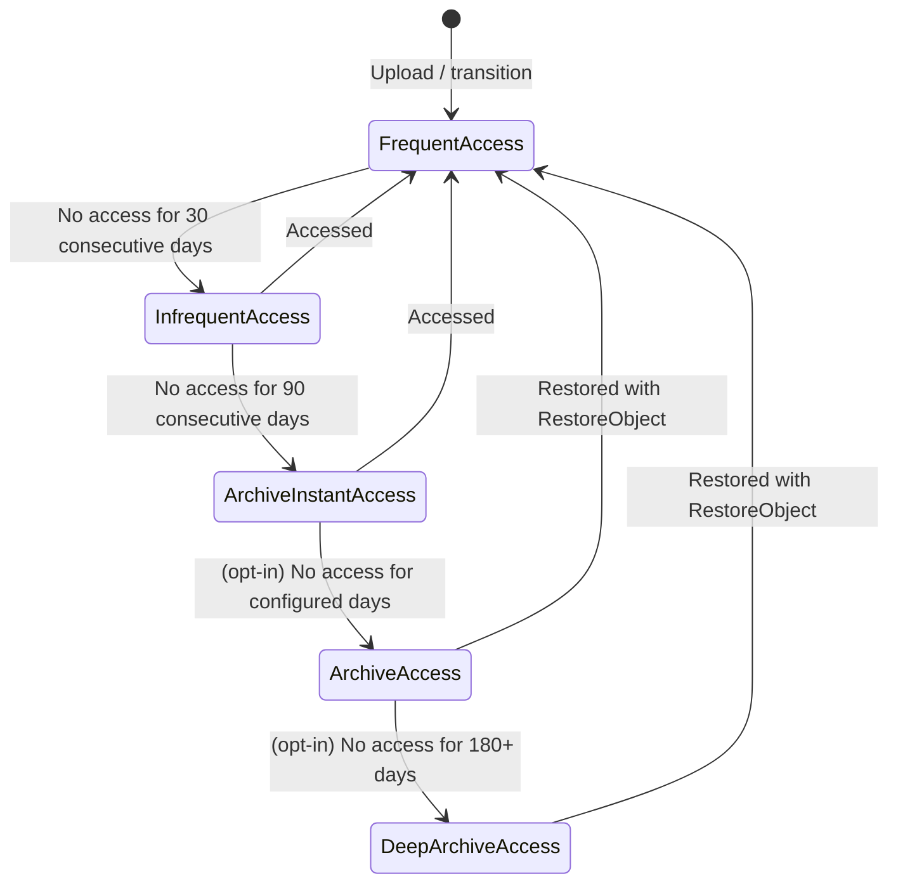
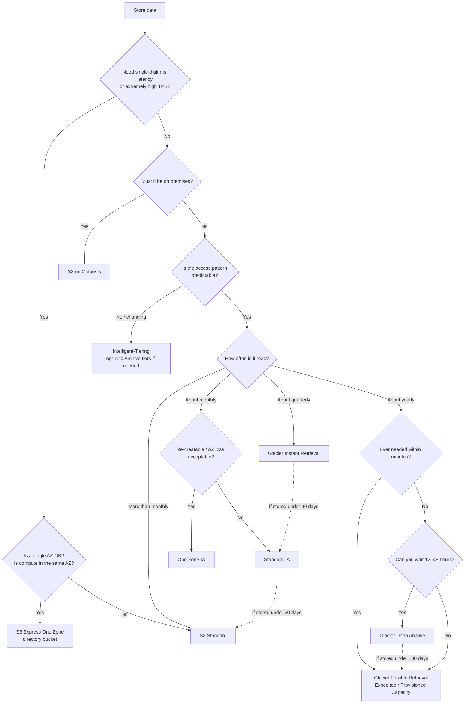
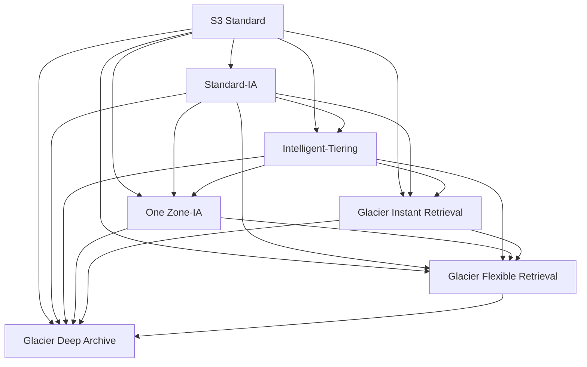

# The complete guide to S3 storage classes

_Last verified: 2026-10-03_

Every object in S3 belongs to a **storage class**. A storage class is a bundle of durability, availability, latency, and pricing, and objects in the same bucket can each have a different class. This chapter covers every class: the numbers, how to choose, and the rules for lifecycle transitions.

All prices are **us-east-1 (N. Virginia), USD, verified 2026-10-03**. Sources are the AWS Price List API (`AmazonS3` / `AmazonS3GlacierDeepArchive` / `AmazonGlacier` offers, publicationDate 2026-09-28) and the S3 pricing page. Machine-readable data lives in `data/storage-classes.json`.

## 1. Overview map

```text
Access frequency  high ◀───────────────────────────────────────────────────▶ low
Latency           short ◀──────────────────────────────────────────────────▶ long
Storage price     high ◀───────────────────────────────────────────────────▶ low

 Express One Zone   Standard   Intelligent-Tiering   Standard-IA   Glacier IR   Glacier Flexible   Deep Archive
   $0.11            $0.023     $0.023–$0.00099        $0.0125       $0.004       $0.0036            $0.00099
   single-digit ms  ms         ms (archive tiers: min–hours)  ms    ms           minutes–hours      hours
   1 AZ             >=3 AZ     >=3 AZ                 >=3 AZ        >=3 AZ       >=3 AZ             >=3 AZ
                                                      One Zone-IA ($0.01, 1 AZ)

 Separate: Reduced Redundancy (legacy, not recommended) / S3 on Outposts (OUTPOSTS, on premises)
```

Values used in the API (`x-amz-storage-class` header):

| Class | API value |
| --- | --- |
| S3 Standard | `STANDARD` |
| S3 Express One Zone | `EXPRESS_ONEZONE` |
| S3 Intelligent-Tiering | `INTELLIGENT_TIERING` |
| S3 Standard-IA | `STANDARD_IA` |
| S3 One Zone-IA | `ONEZONE_IA` |
| S3 Glacier Instant Retrieval | `GLACIER_IR` |
| S3 Glacier Flexible Retrieval | `GLACIER` |
| S3 Glacier Deep Archive | `DEEP_ARCHIVE` |
| Reduced Redundancy Storage | `REDUCED_REDUNDANCY` |
| S3 on Outposts | `OUTPOSTS` |

The API value `GLACIER` is a historical artifact (the former name was S3 Glacier); the current official name is S3 Glacier Flexible Retrieval.

## 2. Comparison table (design values)

Design values from the User Guide comparison table (Comparing the Amazon S3 storage classes).

| Class | Intended access | Durability (design) | Availability (design) | AZs | Minimum storage duration | Minimum billable object size | Retrieval fee |
| --- | --- | --- | --- | --- | --- | --- | --- |
| Standard | More than once a month | 99.999999999% | 99.99% | >= 3 | None | None | None |
| Express One Zone | Needs single-digit ms | 99.999999999% | 99.95% | 1 | None | None | Small per-GB upload / retrieval fees |
| Intelligent-Tiering | Unknown or changing | 99.999999999% | 99.9% | >= 3 | None | None (objects under 128 KB are not monitored) | None (monitoring fee applies) |
| Standard-IA | About once a month | 99.999999999% | 99.9% | >= 3 | 30 days | 128 KB | Yes |
| One Zone-IA | About once a month, re-creatable | 99.999999999% | 99.5% | 1 | 30 days | 128 KB | Yes |
| Glacier Instant Retrieval | About once a quarter | 99.999999999% | 99.9% | >= 3 | 90 days | 128 KB | Yes |
| Glacier Flexible Retrieval | About once a year | 99.999999999% | 99.99% (after restore) | >= 3 | 90 days | None (but 40 KB overhead per object) | Yes (Bulk is free) |
| Glacier Deep Archive | Less than once a year | 99.999999999% | 99.99% (after restore) | >= 3 | 180 days | None (same 40 KB overhead) | Yes |
| Reduced Redundancy (not recommended) | Frequently accessed, re-creatable data | 99.99% | 99.99% | >= 3 | None | None | None |

Notes:

- **Every class except One Zone-IA and Express One Zone is designed to survive the physical loss of one AZ**
- The 11 nines for One Zone-IA and Express One Zone hold only "as long as the AZ survives". If an entire AZ is lost to an earthquake, flood, or similar event, the data is lost too
- The 99.99% availability for Glacier Flexible / Deep Archive applies to the restored copy

## 3. SLA (service level agreement)

Separate from design values, the **SLA** is the contractual figure: if monthly uptime falls below it, you receive service credits (refunds). The S3 SLA (last updated 2023-11-28) splits classes into two groups.

| Group | Classes | 10% credit | 25% credit | 100% credit |
| --- | --- | --- | --- | --- |
| Group 1 | Standard, Express One Zone, Glacier Flexible Retrieval, Glacier Deep Archive, and others | At least 99.0% but below 99.9% | At least 95.0% but below 99.0% | Below 95.0% |
| Group 2 | Intelligent-Tiering, Standard-IA, One Zone-IA, Glacier Instant Retrieval | At least 98.0% but below 99.0% | At least 95.0% but below 98.0% | Below 95.0% |

So the SLA threshold is **99.9%** for group 1 and **99%** for group 2. These are well below the design values (99.99% and so on) because they are the contractual floor, not the availability you see day to day. Durability (11 nines) has no SLA.

## 4. Pricing (us-east-1)

### 4.1 Storage prices

| Class | Per GB-month | Notes |
| --- | --- | --- |
| Standard | First 50 TB: $0.023 / Next 450 TB: $0.022 / Over 500 TB: $0.021 | Tiered |
| Express One Zone | $0.11 | Cut 31% from $0.16 on 2025-04-10 |
| Intelligent-Tiering Frequent Access | $0.023 / $0.022 / $0.021 (same tiers as Standard) | |
| Intelligent-Tiering Infrequent Access | $0.0125 | |
| Intelligent-Tiering Archive Instant Access | $0.004 | |
| Intelligent-Tiering Archive Access (optional) | $0.0036 | |
| Intelligent-Tiering Deep Archive Access (optional) | $0.00099 | |
| Intelligent-Tiering monitoring and automation fee | $0.0025 / 1,000 objects / month | Objects of 128 KB or larger only |
| Standard-IA | $0.0125 | |
| One Zone-IA | $0.01 | |
| Glacier Instant Retrieval | $0.004 | |
| Glacier Flexible Retrieval | $0.0036 | |
| Glacier Deep Archive | $0.00099 | |
| Reduced Redundancy | First 1 TB: $0.024 / Next 49 TB: $0.0236 / ... / Over 5,000 TB: $0.022 | More expensive than Standard |

Converted to a monthly cost per TB (1,024 GB) (Standard uses the first tier):

| Class | Per TB-month |
| --- | --- |
| Express One Zone | About $112.64 |
| Standard | About $23.55 |
| Standard-IA | About $12.80 |
| One Zone-IA | About $10.24 |
| Glacier Instant Retrieval | About $4.10 |
| Glacier Flexible Retrieval | About $3.69 |
| Glacier Deep Archive | About $1.01 |

### 4.2 Request prices

| Class | PUT / COPY / POST / LIST (per 1,000) | GET / SELECT / other (per 1,000) |
| --- | --- | --- |
| Standard | $0.005 | $0.0004 |
| Express One Zone | $0.00113 | $0.00003 |
| Intelligent-Tiering | $0.005 | $0.0004 |
| Standard-IA | $0.01 | $0.001 |
| One Zone-IA | $0.01 | $0.001 |
| Glacier Instant Retrieval | $0.02 | $0.01 |
| Glacier Flexible Retrieval | $0.03 | $0.0004 |
| Glacier Deep Archive | $0.05 | $0.0004 |

DELETE and CANCEL are free. For Glacier Flexible / Deep Archive, the GET price applies to non-GET operations on archived objects (HEAD and so on) and to GETs on restored copies (archived data itself cannot be read with GET).

### 4.3 Retrieval prices

| Class | Retrieval option | Typical time | Per GB | Per request |
| --- | --- | --- | --- | --- |
| Standard / Intelligent-Tiering (FA/IA/AIA) | — | ms | None | None |
| Express One Zone | upload / retrieval | Single-digit ms | upload $0.0032, retrieval $0.0006 | — |
| Standard-IA | — | ms | $0.01 | — |
| One Zone-IA | — | ms | $0.01 | — |
| Glacier Instant Retrieval | — | ms | $0.03 | — |
| Glacier Flexible Retrieval | Expedited | 1–5 minutes | $0.03 | $10 / 1,000 ($0.01 each) |
| Glacier Flexible Retrieval | Standard | 3–5 hours (minutes to 5 hours via Batch Operations) | $0.01 | $0.05 / 1,000 |
| Glacier Flexible Retrieval | Bulk | 5–12 hours | Free | Free |
| Glacier Deep Archive | Standard | Within 12 hours (9–12 hours via Batch Operations) | $0.02 | $0.10 / 1,000 |
| Glacier Deep Archive | Bulk | Within 48 hours | $0.0025 | $0.025 / 1,000 |
| Intelligent-Tiering Archive Access | Expedited | 1–5 minutes | $0.03 | $0.01 each |
| Intelligent-Tiering Archive Access | Standard / Bulk | 3–5 hours / 5–12 hours | Free | Free |
| Intelligent-Tiering Deep Archive Access | Standard / Bulk | Within 12 hours / within 48 hours | Free | Free |

Additional notes:

- Glacier Flexible Expedited requests may be rejected when demand is high. If you need them to be reliable, buy **Provisioned Capacity** ($100 / unit / month; each unit provides at least 3 Expedited retrievals every 5 minutes and up to 300 MB/s of throughput)
- With Expedited, objects under 250 MB are typically retrieved in 1–5 minutes; objects of 250 MB or more are retrieved at up to 300 MB/s
- A restored copy exists for the number of days you specify, and during that time it is **also billed at the Standard rate** (on top of the archive's own charge)
- Per account, expect about 1,000 TPS for restore requests and 1–2 PB/day of throughput
- Objects larger than 5 TB are restored at up to 300 MB/s, so they take longer (for example, a 50 TB Glacier Flexible object can take up to 48 hours)

### 4.4 Lifecycle transition request prices

Moving objects between classes with lifecycle rules is billed as **one transition request per object**.

| Destination | Per 1,000 |
| --- | --- |
| Standard-IA / One Zone-IA / Intelligent-Tiering | $0.01 |
| Glacier Instant Retrieval | $0.02 |
| Glacier Flexible Retrieval | $0.03 |
| Glacier Deep Archive | $0.05 |

## 5. Class details

### 5.1 S3 Standard (`STANDARD`)

The default storage class. If in doubt, start here.

- Millisecond latency, high throughput
- No minimum storage duration, no minimum billable size, no retrieval fee. Delete any time, store objects of any size, and read as often as you like: you pay only storage and request charges
- Stored redundantly across three or more AZs
- Typical uses: static assets for web/mobile, frequently read application data, the hot zone of a data lake, recent logs

### 5.2 S3 Express One Zone (`EXPRESS_ONEZONE`)

A high-performance **single-AZ, single-digit-millisecond** class launched on 2023-11-28 (re:Invent 2023).

- Can only be stored in a **directory bucket**; it cannot be specified in a general purpose bucket
- Up to 10x faster data access than Standard, with much lower request prices (GET is about 1/13 of Standard)
- Storage costs $0.11/GB-month, about 4.8x Standard
- The 2025-04-10 price cut reduced storage by 31%, PUT by 55%, and GET by 85%. Per-GB upload / retrieval fees also dropped 60%, and they are now charged on **every byte** rather than "only the portion above 512 KB"
- Up to 2 million GET TPS / 200,000 PUT TPS per directory bucket
- Session-based authentication via `CreateSession`
- Supports **appending** to the end of an object
- Benefits are greatest when compute (EC2, EKS, SageMaker, and so on) runs in the same AZ
- Typical uses: fast loading of ML training data, interactive analytics, HPC scratch space, intermediate media rendering data, Spark shuffle

Cost example (from the FAQ): store 10 GB for 30 days, 1 million PUTs and 9 million GETs (10 KB each), then delete 1 million objects → storage $1.10 + PUT $1.13 + GET $0.27 + upload $0.03 + retrieval $0.05 = **$2.58**.

### 5.3 S3 Intelligent-Tiering (`INTELLIGENT_TIERING`)

A class for data whose access patterns are **unknown or changing**. It moves each object between access tiers automatically (launched 2018-11).



| Tier | Move condition | Price (GB-month) | Access |
| --- | --- | --- | --- |
| Frequent Access | Default | $0.023–$0.021 | ms |
| Infrequent Access | No access for 30 consecutive days | $0.0125 | ms |
| Archive Instant Access | No access for 90 consecutive days | $0.004 | ms |
| Archive Access (opt-in) | No access for 90+ days (configurable) | $0.0036 | Restore required (minutes to hours) |
| Deep Archive Access (opt-in) | No access for 180+ days (configurable) | $0.00099 | Restore required (hours) |

Key points:

- **No retrieval fees**. An accessed object simply moves back to the Frequent Access tier (except Expedited restores from the opt-in archive tiers)
- Automatic moves between tiers incur no transition fees either
- Instead, there is a **monitoring and automation fee of $0.0025 / 1,000 objects / month**
- **Objects under 128 KB are not monitored and always stay in the Frequent Access tier**. In exchange, they incur no monitoring fee (changed 2021-09)
- In 2021-09 the **minimum storage duration (previously 30 days) was removed**
- Archive Access / Deep Archive Access are used only when explicitly enabled with `PutBucketIntelligentTieringConfiguration`. Do not enable them if your application cannot handle asynchronous restores
- If you enable "Archive Access after 90 days", objects skip Archive Instant Access and go straight to Archive Access
- Designed for 99.9% availability; SLA is group 2 (99%)

Rough break-even for the monitoring fee: monitoring costs $0.0000025 per object per month. Dropping from Frequent to Infrequent saves $0.0105 per GB per month, so **larger objects benefit more**. For example, 1 million 1 MB objects (about 1 TB) cost $2.50/month to monitor, and if only half of them drop to the IA tier, storage savings are about $5/month. Conversely, with a huge number of small objects just around 128 KB, the monitoring fee can exceed the savings.

### 5.4 S3 Standard-IA (`STANDARD_IA`)

For data you read infrequently but need immediately when you do.

- Storage is about half the price of Standard ($0.0125)
- **Retrieval costs $0.01/GB**; PUT is 2x Standard and GET is 2.5x
- **Minimum storage duration of 30 days** (deleting, overwriting, or transitioning earlier bills the remaining days)
- **Minimum billable object size of 128 KB** (a 1 KB object is billed as 128 KB)
- Three or more AZs; designed for 99.9% availability
- Typical uses: backups, DR copies, old logs and documents, historical data users open only occasionally

Break-even: the difference from Standard is $0.0105 per GB per month. With retrieval at $0.01/GB, **reading all of it once a month roughly breaks even**. If you read it more than once a month, Standard is cheaper.

### 5.5 S3 One Zone-IA (`ONEZONE_IA`)

The single-AZ version of Standard-IA.

- Storage at $0.01/GB-month (20% cheaper than Standard-IA)
- Retrieval fees, minimum storage duration, and minimum billable size are the same as Standard-IA
- Designed for 99.5% availability. **Losing the AZ means losing the data**
- Typical uses: re-creatable data (thumbnails, transcoded media), CRR replica destinations (the source data lives in another Region), secondary copies of data whose master also exists on premises
- Can also be used in directory buckets in Local Zones for data residency

### 5.6 S3 Glacier Instant Retrieval (`GLACIER_IR`)

Launched 2021-11 (re:Invent 2021). A class with **archive pricing but millisecond reads**.

- Storage at $0.004/GB-month (about 1/6 of Standard)
- Retrieval **$0.03/GB**, GET $0.01/1,000 (25x Standard)
- **Minimum storage duration of 90 days**, minimum billable size of 128 KB
- No restore step needed; a normal GET reads the data
- Typical uses: medical images, news media archives, older user-generated content, data read about once a quarter

Break-even: the storage difference from Standard-IA is $0.0085 per GB per month, and the retrieval difference is $0.02/GB. If you read all of it once a quarter (3 months), you save 3 × $0.0085 = $0.0255 against $0.02 of extra retrieval, so GIR wins. If you read it monthly, IA wins.

### 5.7 S3 Glacier Flexible Retrieval (`GLACIER`)

Formerly S3 Glacier. An archive class where you **restore before you read**.

- Storage at $0.0036/GB-month
- Three retrieval options: Expedited / Standard / Bulk (section 4.3). **Bulk is free**
- **Minimum storage duration of 90 days**
- No minimum billable size, but **each object carries 40 KB of overhead** (32 KB at the Glacier rate, 8 KB at the Standard rate). Storing huge numbers of small objects is costly
- A restored copy exists temporarily, and the object's storage class still shows as `GLACIER`
- Typical uses: long-term backup retention, media asset archives, audit data accessed once or twice a year

### 5.8 S3 Glacier Deep Archive (`DEEP_ARCHIVE`)

The cheapest class (GA 2019-03), designed to replace tape.

- Storage at **$0.00099/GB-month** (about $1/month per TB)
- Retrieval is Standard (within 12 hours) or Bulk (within 48 hours). There is no Expedited option
- **Minimum storage duration of 180 days**
- 40 KB of overhead per object (same structure as Flexible)
- Typical uses: records retained 7–10 years for regulatory reasons, compliance archives in finance, healthcare, and the public sector, raw data you may never read again

### 5.9 Reduced Redundancy Storage (`REDUCED_REDUNDANCY`) — legacy

A class launched 2010-05 that traded redundancy for a lower price.

- 99.99% durability (expected average annual loss of 0.01% of objects). Requests for lost objects return **405**
- **Standard is now cheaper** ($0.024 vs $0.023), so AWS itself explicitly says not to use it
- Lifecycle rules cannot transition objects to RRS
- The recommendation is to copy existing RRS data into Standard or Intelligent-Tiering

### 5.10 S3 on Outposts (`OUTPOSTS`)

The class for S3 buckets on AWS Outposts (AWS racks installed on premises).

- Usable only in buckets on Outposts, and conversely, Outposts buckets cannot use any other class (doing so returns `InvalidStorageClass`)
- Always encrypted with SSE-S3 (SSE-C is optional; SSE-KMS is not supported)
- Pricing is bundled into the Outposts capacity purchase and does not follow the usual published per-GB-month model (this guide does not cover its prices)
- Typical uses: data residency requirements, factories, hospitals, and financial sites that need local processing

## 6. Selection flowchart



Preconditions to check before using the flowchart:

- If many **objects are smaller than 128 KB**, IA / GIR are costly because of the minimum billable size, and Glacier Flexible / Deep Archive are costly because of the 40 KB overhead. Staying in Standard is the safe choice (even Intelligent-Tiering pins objects under 128 KB to the Frequent tier). Alternatively, aggregate them with tar, Parquet, and so on before storing
- If the **retention period is shorter than the minimum storage duration**, do not use that class
- If **read volume (GB)** is high, estimate the retrieval fees. Choosing on storage price alone can lead to costly surprises

## 7. Lifecycle transition rules

### 7.1 The waterfall model

Lifecycle transitions can **only go downward (toward cheaper, colder classes)**.



| Source | Allowed destinations |
| --- | --- |
| Standard | Standard-IA, Intelligent-Tiering, One Zone-IA, Glacier IR, Glacier Flexible, Deep Archive |
| Standard-IA | Intelligent-Tiering, One Zone-IA, Glacier IR, Glacier Flexible, Deep Archive |
| Intelligent-Tiering (Frequent / Infrequent tiers) | One Zone-IA, Glacier IR, Glacier Flexible, Deep Archive |
| Intelligent-Tiering (Archive Instant Access tier) | Glacier IR, Glacier Flexible, Deep Archive |
| Intelligent-Tiering (Archive Access tier) | Glacier Flexible, Deep Archive |
| Intelligent-Tiering (Deep Archive Access tier) | Deep Archive |
| One Zone-IA | Glacier Flexible, Deep Archive |
| Glacier Instant Retrieval | Glacier Flexible, Deep Archive |
| Glacier Flexible Retrieval | Deep Archive |
| Glacier Deep Archive | (none) |

Not allowed:

- Upward transitions (for example, Standard-IA → Standard, Glacier → Standard). If needed, **restore (for Glacier classes) and then overwrite with CopyObject, specifying the class**
- One Zone-IA → Standard-IA / Intelligent-Tiering / Glacier IR
- Transitions to Reduced Redundancy from any class
- **Express One Zone (directory buckets) does not support lifecycle transitions**. Lifecycle on directory buckets supports expiration only
- Transitions of objects whose replication status is `Pending` / `Failed` in versioning-enabled buckets

### 7.2 The 30-day rule (removed 2026-07-16)

| Period | Transitions to Standard-IA / One Zone-IA |
| --- | --- |
| Before 2026-07-16 | Only objects **at least 30 days old** could transition (you could not create an IA transition rule with `Days` under 30) |
| From 2026-07-16 | **Transitions allowed from the day of creation (day 0)** (all Regions) |

- The old rule existed because newly created data is often accessed, so IA retrieval fees were likely to make the move a net loss
- Even after the removal, IA's **30-day minimum storage duration** and **128 KB minimum billable size** still apply. You can move objects sooner, but deleting them within 30 days of the move still triggers early deletion fees
- Older articles (re:Post Knowledge Center and others) may still describe the 30-day rule, so watch out
- Transitions to Intelligent-Tiering or Glacier classes never had this restriction (day 0 transitions are allowed)

### 7.3 The 128 KB rule (changed 2024-09)

| Period | Default behavior |
| --- | --- |
| Before 2024-09 | Objects under 128 KB did not transition to IA / Intelligent-Tiering / Glacier IR, but **did transition to Glacier Flexible / Deep Archive** |
| From 2024-09 | By default, **objects under 128 KB do not transition to any class** |

- Lifecycle configurations created before 2024-09 keep the old behavior unless edited. Creating, editing, or deleting a rule switches to the new behavior
- To transition small objects too, explicitly set `ObjectSizeGreaterThan` (for example, 1 byte) or `ObjectSizeLessThan` in the rule filter
- To restore the old behavior (objects under 128 KB still transition to Glacier Flexible / Deep Archive), add the `x-amz-transition-default-minimum-object-size` header to `PutBucketLifecycleConfiguration` (value `varies_by_storage_class`; the new default is `all_storage_classes_128K`)
- Why it changed: transitions are billed per object, so for small objects the transition fee easily exceeds the storage savings. Glacier classes also add 40 KB of overhead

Example: transitioning 10 million 10 KB objects (about 95 GB) to Deep Archive:

```text
Transition fee:   10,000,000 / 1,000 × $0.05             = $500 (one time)
Storage savings:  95 GB × ($0.023 - $0.00099)            ≈ $2.09 / month
Overhead:         10M × 8 KB at the Standard rate        ≈ 76 GB × $0.023 ≈ $1.75 / month
                  10M × 32 KB at the Deep Archive rate   ≈ 305 GB × $0.00099 ≈ $0.30 / month
→ Net savings are almost zero. The $500 transition fee is never recovered
```

### 7.4 Minimum storage duration and rule design

- Within one rule, you cannot add the next transition before the minimum storage duration is met. For example, you cannot create a rule that moves objects to Glacier IR (90-day minimum) on day 4 and to Deep Archive on day 20. The Deep Archive transition must be on day 94 or later
- Splitting it into two separate rules lets you configure it, but you pay the charge for the remaining minimum duration (equivalent to an early delete fee)
- Transitions to Glacier Flexible / Deep Archive are asynchronous, and the destination's pricing, minimum storage duration, and 40 KB overhead start billing from the day the rule's condition is met (even if the physical move has not happened yet). The exception is transitions to Intelligent-Tiering, where billing changes only after the physical transition completes

### 7.5 Typical lifecycle configuration example

A configuration that moves logs "Standard for 30 days → Standard-IA until day 120 → Glacier Flexible until year 1 → Deep Archive until year 7 → delete", and also cleans up incomplete multipart uploads and old versions:

```json
{
  "Rules": [
    {
      "ID": "logs-tiering",
      "Status": "Enabled",
      "Filter": {
        "And": {
          "Prefix": "logs/",
          "ObjectSizeGreaterThan": 131072
        }
      },
      "Transitions": [
        { "Days": 30, "StorageClass": "STANDARD_IA" },
        { "Days": 120, "StorageClass": "GLACIER" },
        { "Days": 365, "StorageClass": "DEEP_ARCHIVE" }
      ],
      "Expiration": { "Days": 2555 },
      "NoncurrentVersionExpiration": { "NoncurrentDays": 30 }
    },
    {
      "ID": "abort-mpu",
      "Status": "Enabled",
      "Filter": {},
      "AbortIncompleteMultipartUpload": { "DaysAfterInitiation": 7 }
    }
  ]
}
```

In this example, objects stay in Standard-IA for 90 days (days 30–120, meeting the 30-day minimum), in Glacier Flexible for 245 days (days 120–365, meeting the 90-day minimum), and in Deep Archive from day 365 to day 2,555 (meeting the 180-day minimum), so no early delete fees apply.

## 8. How minimum duration and minimum size are billed

### 8.1 Early delete fees

In a class with a minimum storage duration, **deleting, overwriting, or transitioning to another class** before the duration ends bills the storage charge for the remaining days, prorated daily.

| Class | Minimum storage duration | Early delete rate (GB-month, prorated daily) |
| --- | --- | --- |
| Standard-IA | 30 days | $0.0125 |
| One Zone-IA | 30 days | $0.01 |
| Glacier Instant Retrieval | 90 days | $0.004 |
| Glacier Flexible Retrieval | 90 days | $0.0036 |
| Glacier Deep Archive | 180 days | $0.00099 |

Example: you store 100 GB in Standard-IA and delete it on day 10 → in addition to the actual 10 days, the remaining 20 days (100 GB × $0.0125 × 20/30 ≈ $0.83) are billed as an early delete fee.

### 8.2 Minimum billable object size

Standard-IA / One Zone-IA / Glacier IR **bill objects under 128 KB as 128 KB**. For example, storing 1 million 4 KB objects (about 3.8 GB of actual data) in Standard-IA is billed as about 122 GB, which costs more than storing them in Standard.

```text
Standard:    3.8 GB × $0.023   ≈ $0.09 / month
Standard-IA: 122 GB × $0.0125  ≈ $1.53 / month   ← 17x more expensive
```

### 8.3 The 40 KB overhead on Glacier classes

For Glacier Flexible / Deep Archive, each object adds:

- 8 KB: object name and metadata (so it shows up in real time in LIST) → **Standard rate**
- 32 KB: index and related metadata (needed for restores) → **Glacier / Deep Archive rate**

If you archive large numbers of small objects, the golden rule is to bundle them with tar or zip into units of hundreds of MB to a few GB first.

## 9. Recommendations by use case

| Use case | Recommended class | Why |
| --- | --- | --- |
| Static web assets (CloudFront origin) | Standard | Frequent access, no retrieval fees |
| Data lake with unknown access patterns | Intelligent-Tiering | Drops to IA / AIA automatically; no retrieval fees |
| Fast loading of ML training data | Express One Zone | Single-digit ms, low request prices, pairs with GPUs in the same AZ |
| DB backups (daily, 30-day retention) | Standard-IA (but Standard if deleted in under 30 days) | Read rarely, 30-day minimum |
| Thumbnails, transcoded video | One Zone-IA | Re-creatable |
| Medical images, archived news photos | Glacier Instant Retrieval | Rare but needed immediately |
| Backups audited once a year | Glacier Flexible Retrieval | Retrieval in minutes to hours is fine |
| 7–10 year regulatory retention | Glacier Deep Archive (+ Object Lock) | Cheapest; can wait 12–48 hours |
| CRR replicas (for DR) | One Zone-IA or a Glacier class | The production copy is in another Region |
| Local data at an on-premises factory | S3 on Outposts | Data residency |

## 10. Common pitfalls

| Pitfall | What happens | Mitigation |
| --- | --- | --- |
| Putting small objects in IA / GIR | 128 KB minimum billing makes it more expensive than Standard | Size filters, aggregation, Intelligent-Tiering |
| Transitioning small objects to Glacier classes | Transition fees + 40 KB overhead put you in the red | Keep the post-2024-09 default (no transitions under 128 KB) |
| Putting data deleted within 30 days in IA | Early delete fees | Know the retention period before choosing a class |
| The application GETs data stored in Glacier | `InvalidObjectState` error | Implement a restore flow, or use Glacier IR |
| Enabling Intelligent-Tiering archive tiers casually | Data cannot be read immediately when you need it | Enable only for applications that handle asynchronous restores |
| Relying entirely on Expedited restores | Rejected when demand is high | Provisioned Capacity or Glacier IR |
| Master data in One Zone-IA | Losing the AZ loses the data | Keep master data in a multi-AZ class |
| Continuing to use RRS | More expensive than Standard and less durable | Migrate to Standard / Intelligent-Tiering |
| Keeping restored copies too long | Double billing at the Standard rate | Specify only the days you need |

## References

- [Understanding and managing Amazon S3 storage classes (User Guide)](https://docs.aws.amazon.com/AmazonS3/latest/userguide/storage-class-intro.html)
- [Transitioning objects using Amazon S3 Lifecycle](https://docs.aws.amazon.com/AmazonS3/latest/userguide/lifecycle-transition-general-considerations.html)
- [Lifecycle configuration examples (small objects)](https://docs.aws.amazon.com/AmazonS3/latest/userguide/lifecycle-configuration-examples.html)
- [Understanding archive retrieval options](https://docs.aws.amazon.com/AmazonS3/latest/userguide/restoring-objects-retrieval-options.html)
- [How S3 Intelligent-Tiering works](https://docs.aws.amazon.com/AmazonS3/latest/userguide/intelligent-tiering-overview.html)
- [Amazon S3 pricing](https://aws.amazon.com/s3/pricing/)
- [AWS Price List API: AmazonS3 offer (us-east-1)](https://pricing.us-east-1.amazonaws.com/offers/v1.0/aws/AmazonS3/current/us-east-1/index.json)
- [AWS Price List API: AmazonS3GlacierDeepArchive offer (us-east-1)](https://pricing.us-east-1.amazonaws.com/offers/v1.0/aws/AmazonS3GlacierDeepArchive/current/us-east-1/index.json)
- [Amazon S3 Service Level Agreement](https://aws.amazon.com/s3/sla/)
- [Amazon S3 FAQs](https://aws.amazon.com/s3/faqs/)
- [How do I troubleshoot S3 Lifecycle rules that didn't transition? (re:Post)](https://repost.aws/knowledge-center/s3-lifecycle-configuration-rule)
- [Amazon S3 removes 30-day minimum for transitions to S3 Standard-IA and S3 One Zone-IA (What's New, 2026-07-16)](https://aws.amazon.com/about-aws/whats-new/2026/07/s3-removes-30-day-transitions-standard-ia-one-zone-ia/)
- [Announcing up to 85% price reductions for Amazon S3 Express One Zone (AWS News Blog, 2025-04)](https://aws.amazon.com/blogs/aws/up-to-85-price-reductions-for-amazon-s3-express-one-zone/)
- [S3 Intelligent-Tiering removes minimum storage duration and small-object monitoring charge (What's New, 2021-09)](https://aws.amazon.com/about-aws/whats-new/2021/09/amazon-s3-intelligent-tiering-automates-storage-savings/)
- [What is S3 on Outposts?](https://docs.aws.amazon.com/AmazonS3/latest/s3-outposts/S3onOutposts.html)
