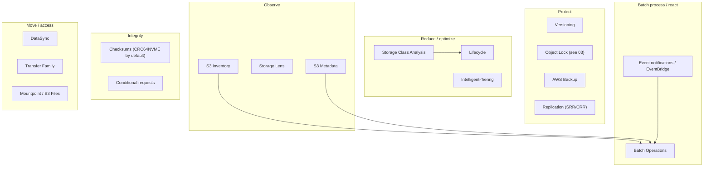
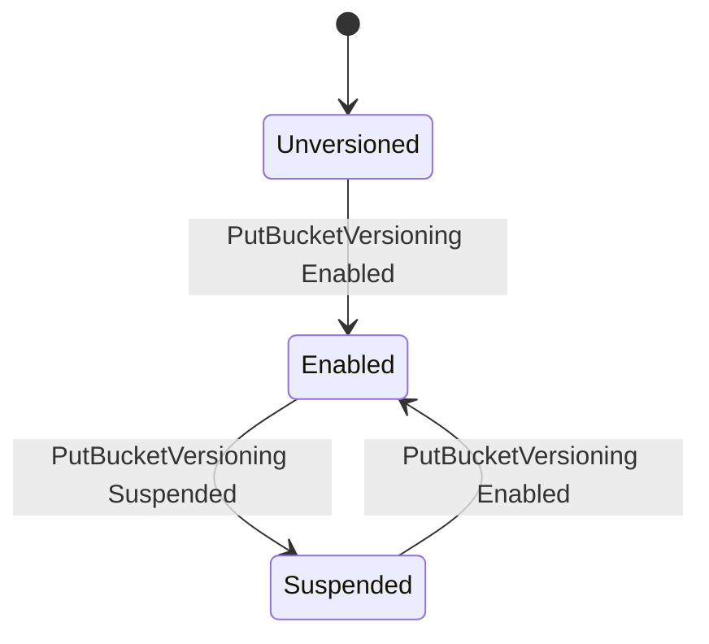
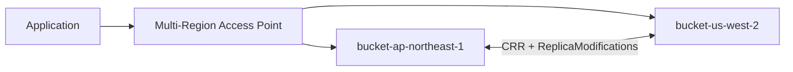
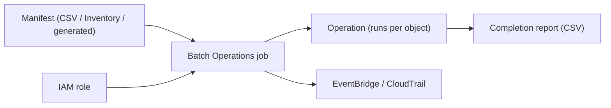
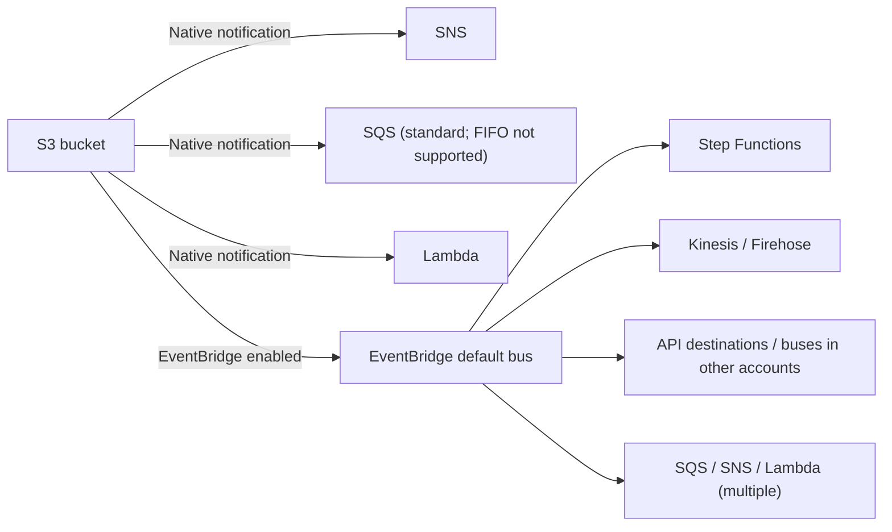
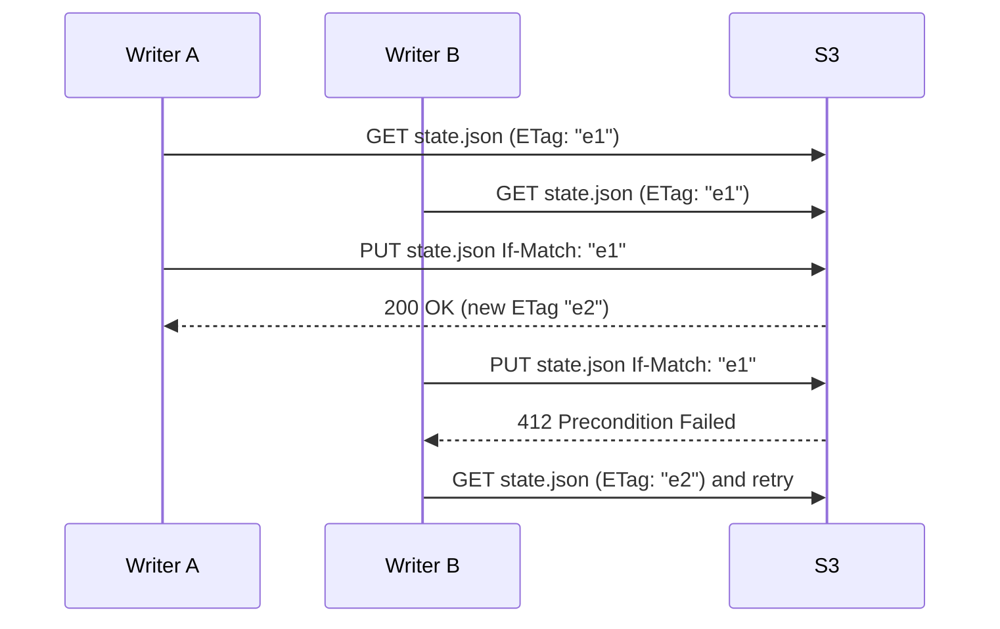
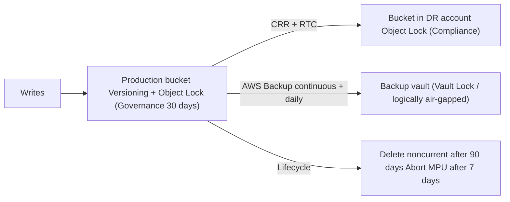

# The complete guide to Amazon S3 data management

_Last verified: 2026-10-03_

This chapter covers the S3 features that protect, reduce, replicate, batch-process, observe, react to, verify, and move the data you store in S3. It covers versioning, Lifecycle, Replication, Batch Operations, Inventory, Storage Lens, S3 Metadata, event notifications, checksums, conditional requests, file access (Mountpoint and S3 Files), and related services such as AWS Backup, DataSync, and Transfer Family.

Dated facts were checked against the AWS documentation, What's New posts, and the AWS News Blog as of 2026-10-03. Anything that could not be confirmed is marked "unverified".

## Contents

- Chapter 1: Overview map
- Chapter 2: Versioning
- Chapter 3: Lifecycle
- Chapter 4: Replication
- Chapter 5: S3 Batch Operations
- Chapter 6: S3 Inventory
- Chapter 7: S3 Storage Lens and Storage Class Analysis
- Chapter 8: S3 Metadata (journal, live inventory, and annotation tables)
- Chapter 9: Object tags, metadata, and annotations
- Chapter 10: Event notifications and EventBridge
- Chapter 11: S3 Object Lambda and S3 Select (availability)
- Chapter 12: Checksums and data integrity
- Chapter 13: Conditional requests
- Chapter 14: Copy, rename, and large objects
- Chapter 15: File access: Mountpoint for Amazon S3 and Amazon S3 Files
- Chapter 16: Related services: AWS Backup, DataSync, Snow, and Transfer Family
- Chapter 17: Design patterns and checklist
- References

## 1. Overview map



| Goal                                           | First choice                          | Supporting options                           |
| ---------------------------------------------- | ------------------------------------- | -------------------------------------------- |
| Recover from accidental deletes and overwrites | Versioning                            | AWS Backup (35-day PITR), Object Lock        |
| Reduce cost                                    | Lifecycle, Intelligent-Tiering        | Storage Lens, Storage Class Analysis         |
| DR / Regional redundancy                       | CRR (+ RTC)                           | MRAP, AWS Backup cross-Region copy           |
| Bulk operations on billions of objects         | Batch Operations                      | Generate manifests with Inventory / Metadata |
| Know what objects you have                     | S3 Metadata live inventory, Inventory | ListObjectsV2 (small scale only)             |
| Detect changes                                 | Event notifications / EventBridge     | S3 Metadata journal table                    |
| Data integrity                                 | Checksums                             | Batch Operations Compute checksums           |
| Optimistic concurrency                         | Conditional writes / deletes          | Version IDs                                  |
| Need a file API                                | S3 Files (NFS), Mountpoint            | Storage Gateway, FSx                         |

## 2. Versioning

### 2.1 The three states

A bucket's versioning has three states. Once you enable it, **you cannot return to Unversioned** (you can only suspend it).



| State       | Version ID of a new PUT | On overwrite                                          | DELETE (no version ID)                        |
| ----------- | ----------------------- | ----------------------------------------------------- | --------------------------------------------- |
| Unversioned | `null`                  | Old data is lost                                      | The object is removed                         |
| Enabled     | A unique ID is assigned | The old version remains as noncurrent                 | Creates a delete marker (data remains)        |
| Suspended   | `null`                  | Overwrites the `null` version (other versions remain) | Creates a delete marker as the `null` version |

### 2.2 Version stacks and delete markers

```text
Key: reports/2026-q3.csv

  [current]    v3  delete marker (DeleteMarker=true)   <- GET returns 404 (x-amz-delete-marker: true)
  [noncurrent] v2  12 MB  2026-09-30
  [noncurrent] v1  11 MB  2026-09-01

  GET ?versionId=v2  -> returns the data of v2
  DELETE ?versionId=v3 (delete the delete marker) -> v2 becomes current again = "undelete"
  DELETE ?versionId=v1 -> permanently deletes v1 (cannot be undone)
```

Key points:

- A delete marker has no data and is billed only for the size of its key name.
- A delete marker that is the current version and has no remaining noncurrent versions is called an "expired object delete marker". Lifecycle can clean these up.
- Noncurrent versions are billed at full price. When versioning is enabled, **always configure Lifecycle for noncurrent versions** (Security Hub S3.10).
- ListObjectsV2 returns only current versions; ListObjectVersions returns all versions and delete markers.

```bash
aws s3api put-bucket-versioning --bucket amzn-s3-demo-bucket \
  --versioning-configuration Status=Enabled

aws s3api list-object-versions --bucket amzn-s3-demo-bucket --prefix reports/

# Undelete: delete the delete marker version
aws s3api delete-object --bucket amzn-s3-demo-bucket \
  --key reports/2026-q3.csv --version-id "3HL4kqtJlcpXroDTDmJ+rmSpXd3dIbrHY"
```

### 2.3 MFA Delete

MFA Delete is attached to the versioning configuration and requires MFA to change the versioning state or to permanently delete a version. Only the root user can enable it, and only through the CLI or API. It cannot be used together with a Lifecycle configuration. For details, see Chapter 8 of 03-security.md.

### 2.4 Performance and cost considerations

- Repeatedly overwriting the same key piles up noncurrent versions without limit. A key with millions of versions makes ListObjectVersions slow and can trigger 503 Slow Down.
- Replication and Object Lock require versioning.
- Directory buckets (S3 Express One Zone) do not support versioning.

## 3. Lifecycle

### 3.1 Components of a Lifecycle rule

| Element                        | Description                                                                                                                  |
| ------------------------------ | ---------------------------------------------------------------------------------------------------------------------------- |
| Filter                         | Prefix, Tag (multiple tags use And), ObjectSizeGreaterThan / ObjectSizeLessThan. An empty filter applies to the whole bucket |
| Status                         | Enabled / Disabled                                                                                                           |
| Transitions                    | Move the current version to another storage class after N days (or on a date)                                                |
| Expiration                     | Expire the current version after N days (with versioning enabled, this creates a delete marker)                              |
| NoncurrentVersionTransitions   | Transition N days after a version becomes noncurrent. Use NewerNoncurrentVersions to keep the newest N                       |
| NoncurrentVersionExpiration    | Permanently delete N days after a version becomes noncurrent                                                                 |
| ExpiredObjectDeleteMarker      | Remove expired object delete markers                                                                                         |
| AbortIncompleteMultipartUpload | Abort incomplete MPUs N days after initiation (stops charges for uploaded parts)                                             |

A bucket can have up to 1,000 rules. Rules are evaluated asynchronously (typically about once a day), so there is a lag between the due date and the actual delete or transition. For Expiration, however, billing stops once the due date passes.

### 3.2 The transition waterfall

```text
S3 Standard
   |
   v
S3 Standard-IA / S3 Intelligent-Tiering / S3 One Zone-IA
   |
   v
S3 Glacier Instant Retrieval
   |
   v
S3 Glacier Flexible Retrieval
   |
   v
S3 Glacier Deep Archive
```

- Transitions only go downward (moving upward requires a copy).
- Objects can transition to Standard-IA / One Zone-IA only after they are at least 30 days old.
- Deleting or transitioning an object before its minimum storage duration (30 days for IA classes, 90 days for Glacier Instant / Flexible, 180 days for Deep Archive) incurs a charge for the remaining days.
- Transitioning small objects is often not worth it because of the transition request charges.

### 3.3 Default behavior for objects under 128 KB (2024-09)

Since 2024-09, the default for a Lifecycle configuration is `TransitionDefaultMinimumObjectSize = all_storage_classes_128K`, so **objects smaller than 128 KB do not transition to any storage class**. If you specify `varies_by_storage_class`, objects under 128 KB still transition to Glacier Flexible Retrieval / Deep Archive as before. Custom `ObjectSizeGreaterThan` / `ObjectSizeLessThan` filters take precedence over the default.

### 3.4 Example JSON

A typical configuration for a log bucket:

```json
{
  "TransitionDefaultMinimumObjectSize": "all_storage_classes_128K",
  "Rules": [
    {
      "ID": "logs-tiering-and-expire",
      "Status": "Enabled",
      "Filter": { "Prefix": "logs/" },
      "Transitions": [
        { "Days": 30, "StorageClass": "STANDARD_IA" },
        { "Days": 90, "StorageClass": "GLACIER_IR" },
        { "Days": 365, "StorageClass": "DEEP_ARCHIVE" }
      ],
      "Expiration": { "Days": 2555 }
    },
    {
      "ID": "noncurrent-cleanup",
      "Status": "Enabled",
      "Filter": {},
      "NoncurrentVersionTransitions": [
        { "NoncurrentDays": 30, "StorageClass": "GLACIER_IR", "NewerNoncurrentVersions": 3 }
      ],
      "NoncurrentVersionExpiration": { "NoncurrentDays": 90, "NewerNoncurrentVersions": 3 }
    },
    {
      "ID": "delete-expired-markers",
      "Status": "Enabled",
      "Filter": {},
      "Expiration": { "ExpiredObjectDeleteMarker": true }
    },
    {
      "ID": "abort-mpu",
      "Status": "Enabled",
      "Filter": {},
      "AbortIncompleteMultipartUpload": { "DaysAfterInitiation": 7 }
    }
  ]
}
```

An example that filters by tag and size (only objects of 1 MB or larger tagged `class=archive` go to Deep Archive):

```json
{
  "Rules": [
    {
      "ID": "archive-large-tagged",
      "Status": "Enabled",
      "Filter": {
        "And": {
          "Prefix": "media/",
          "Tags": [{ "Key": "class", "Value": "archive" }],
          "ObjectSizeGreaterThan": 1048576
        }
      },
      "Transitions": [{ "Days": 0, "StorageClass": "DEEP_ARCHIVE" }]
    }
  ]
}
```

An example that moves everything to Intelligent-Tiering (for general-purpose data with unknown access patterns):

```json
{
  "Rules": [
    {
      "ID": "to-intelligent-tiering",
      "Status": "Enabled",
      "Filter": { "ObjectSizeGreaterThan": 131072 },
      "Transitions": [{ "Days": 0, "StorageClass": "INTELLIGENT_TIERING" }]
    }
  ]
}
```

```bash
aws s3api put-bucket-lifecycle-configuration \
  --bucket amzn-s3-demo-bucket \
  --lifecycle-configuration file://lifecycle.json

aws s3api get-bucket-lifecycle-configuration --bucket amzn-s3-demo-bucket
```

`put-bucket-lifecycle-configuration` **replaces the entire configuration**. To keep existing rules, get the configuration, edit it, and put it back.

### 3.5 Important Lifecycle behavior

- When multiple rules apply to the same object: Expiration takes precedence over Transition, and if transition targets conflict, the cheaper storage class wins.
- Lifecycle deletes and transitions can be detected with event notifications (`s3:LifecycleExpiration:*`, `s3:LifecycleTransition`). They are also recorded in server access logs, but not in CloudTrail data events.
- Since 2026-03, **objects that failed to replicate are temporarily excluded from Lifecycle transitions and expirations**. After you fix the permissions or configuration and re-replicate them with Batch Replication, Lifecycle processes them normally.
- Directory buckets also support Lifecycle (expiration and MPU abort) (Security Hub S3.25). They do not support transitions.
- You cannot configure Lifecycle on a bucket with MFA Delete enabled.

## 4. Replication

### 4.1 Types

| Type                           | Description                                                                                               |
| ------------------------------ | --------------------------------------------------------------------------------------------------------- |
| SRR (Same-Region Replication)  | To another bucket in the same Region. Log aggregation, separating production and test, account separation |
| CRR (Cross-Region Replication) | To another Region. DR, latency, data sovereignty requirements                                             |
| Live replication               | Asynchronously replicates new and updated objects after configuration                                     |
| Batch Replication              | Replicates existing objects, previously failed objects, and replicas (a Batch Operations job)             |
| Two-way                        | Mutual replication between two buckets + replica modification sync. Used in MRAP active-active setups     |
| Multi-destination              | From one source to multiple destinations (one destination per rule)                                       |

Prerequisites:

1. Versioning is enabled on both the source and destination.
2. An IAM role that S3 assumes (read from the source + write to the destination).
3. For cross-account replication, the destination bucket policy grants access (+ use Object Ownership to make the destination the owner).
4. To replicate SSE-KMS objects, enable `SseKmsEncryptedObjects` in the rule and grant KMS permissions to the role.
5. If the source has Object Lock enabled, the destination must also have Object Lock enabled.

### 4.2 What is and is not replicated

| Item                                                    | Default                                             | Notes                                                                                   |
| ------------------------------------------------------- | --------------------------------------------------- | --------------------------------------------------------------------------------------- |
| New objects after configuration                         | Replicated                                          |                                                                                         |
| Existing objects before configuration                   | Not replicated                                      | Use Batch Replication                                                                   |
| Metadata, tags, ACLs, Object Lock retention information | Replicated                                          |                                                                                         |
| Delete markers                                          | Not replicated by default                           | Enable with `DeleteMarkerReplication` (not available for rules with tag-based filters)  |
| Deletes that specify a version ID (permanent deletes)   | Not replicated                                      | Designed to prevent malicious deletes from propagating                                  |
| Changes to replicas (metadata, etc.)                    | Not replicated                                      | Two-way sync with `ReplicaModifications`                                                |
| Actions taken by Lifecycle                              | Not replicated                                      | Configure Lifecycle on the destination as well                                          |
| SSE-C objects                                           | Replicated (supported)                              | Fails with 403 if SSE-C is blocked on the destination (watch the default since 2026-04) |
| Objects that are already replicas                       | Not replicated (no chaining)                        | In A→B→C, replicas in B are not sent to C. Batch Replication can do this                |
| Glacier / Deep Archive objects                          | Live replication works; Batch may require a restore |                                                                                         |

### 4.3 S3 Replication Time Control (RTC)

- Designed to replicate most objects in seconds and **99.99% within 15 minutes**.
- **The SLA is "99.9% of objects within 15 minutes, per billing month, per Region pair"**.
- Enabling RTC automatically enables Replication metrics (pending operations, pending bytes, maximum replication latency) and events for exceeding the 15-minute threshold (`s3:Replication:OperationMissedThreshold` and others).
- It incurs an additional per-GB charge.

### 4.4 Configuration example

```json
{
  "Role": "arn:aws:iam::111122223333:role/s3-replication-role",
  "Rules": [
    {
      "ID": "crr-all-to-dr",
      "Priority": 1,
      "Status": "Enabled",
      "Filter": {},
      "DeleteMarkerReplication": { "Status": "Enabled" },
      "SourceSelectionCriteria": {
        "SseKmsEncryptedObjects": { "Status": "Enabled" },
        "ReplicaModifications": { "Status": "Enabled" }
      },
      "Destination": {
        "Bucket": "arn:aws:s3:::amzn-s3-demo-dr-bucket",
        "Account": "444455556666",
        "StorageClass": "STANDARD_IA",
        "AccessControlTranslation": { "Owner": "Destination" },
        "EncryptionConfiguration": {
          "ReplicaKmsKeyID": "arn:aws:kms:us-west-2:444455556666:key/abcd1234-ab12-cd34-ef56-abcdef123456"
        },
        "ReplicationTime": { "Status": "Enabled", "Time": { "Minutes": 15 } },
        "Metrics": { "Status": "Enabled", "EventThreshold": { "Minutes": 15 } }
      }
    }
  ]
}
```

```bash
aws s3api put-bucket-replication \
  --bucket amzn-s3-demo-bucket \
  --replication-configuration file://replication.json

# Check an object's replication status (PENDING / COMPLETED / FAILED / REPLICA)
aws s3api head-object --bucket amzn-s3-demo-bucket --key data/file.parquet \
  --query ReplicationStatus
```

The trust policy and permissions policy for the replication role:

```json
{
  "Version": "2012-10-17",
  "Statement": [
    {
      "Effect": "Allow",
      "Principal": { "Service": "s3.amazonaws.com" },
      "Action": "sts:AssumeRole"
    }
  ]
}
```

```json
{
  "Version": "2012-10-17",
  "Statement": [
    {
      "Effect": "Allow",
      "Action": ["s3:GetReplicationConfiguration", "s3:ListBucket"],
      "Resource": "arn:aws:s3:::amzn-s3-demo-bucket"
    },
    {
      "Effect": "Allow",
      "Action": ["s3:GetObjectVersionForReplication", "s3:GetObjectVersionAcl", "s3:GetObjectVersionTagging"],
      "Resource": "arn:aws:s3:::amzn-s3-demo-bucket/*"
    },
    {
      "Effect": "Allow",
      "Action": [
        "s3:ReplicateObject",
        "s3:ReplicateDelete",
        "s3:ReplicateTags",
        "s3:ObjectOwnerOverrideToBucketOwner"
      ],
      "Resource": "arn:aws:s3:::amzn-s3-demo-dr-bucket/*"
    }
  ]
}
```

### 4.5 Two-way replication and MRAP



With two-way replication, concurrent writes to the same key can end up as "whichever replica arrives last wins". For updates that need strong consistency, it is safer to route them to a single Region.

### 4.6 Batch Replication

A Batch Operations job for replicating existing or failed objects. The manifest is either generated by S3 (filtered based on the replication configuration: "not replicated", "failed", "replica", and so on) or supplied as an Inventory report or CSV.

```bash
aws s3control create-job \
  --account-id 111122223333 \
  --operation '{"S3ReplicateObject":{}}' \
  --report '{"Bucket":"arn:aws:s3:::amzn-s3-demo-reports","Prefix":"batch-replication","Format":"Report_CSV_20180820","Enabled":true,"ReportScope":"AllTasks"}' \
  --manifest-generator '{"S3JobManifestGenerator":{"SourceBucket":"arn:aws:s3:::amzn-s3-demo-bucket","EnableManifestOutput":false,"Filter":{"EligibleForReplication":true,"ObjectReplicationStatuses":["NONE","FAILED"]}}}' \
  --priority 1 \
  --role-arn arn:aws:iam::111122223333:role/batch-replication-role \
  --no-confirmation-required
```

## 5. S3 Batch Operations

### 5.1 Architecture



A single job can process billions of objects and exabytes of data, with progress tracking, retries, and a completion report.

### 5.2 Supported operations (as of 2026-10)

| Operation                          | What it does                                                                           | Notes                                                    |
| ---------------------------------- | -------------------------------------------------------------------------------------- | -------------------------------------------------------- |
| Copy                               | Copies objects (can also change metadata, storage class, and encryption)               | Also works on directory buckets                          |
| Compute checksums (2025-08)        | Computes and reports checksums of stored objects without restoring or downloading them | SHA-1 / SHA-256 / CRC32 / CRC32C / CRC64NVME / MD5, etc. |
| Delete all object tags             | Removes all tags                                                                       |                                                          |
| Invoke AWS Lambda function         | Arbitrary processing                                                                   | Also works on directory buckets                          |
| Replace all object tags            | Replaces tags in bulk                                                                  |                                                          |
| Replace access control list (ACL)  | Replaces ACLs                                                                          | Not needed on buckets with ACLs disabled                 |
| Restore                            | Restores from Glacier Flexible / Deep Archive / Intelligent-Tiering archive tiers      |                                                          |
| Update object encryption (2026-01) | Changes the SSE type, KMS key, or Bucket Key without moving data                       | Up to 20 billion objects per job                         |
| Replicate (Batch Replication)      | Replicates existing and failed objects                                                 |                                                          |
| Object Lock retention              | Sets the retain-until date and mode                                                    |                                                          |
| Object Lock legal hold             | Sets or removes a legal hold                                                           |                                                          |

For objects in directory buckets, only Copy and Invoke Lambda are supported.

At its 2025-08 announcement, Compute checksums supported SHA-1 / SHA-256 / CRC32 / CRC32C / CRC64NVME / MD5. It also supports SHA-512 and the XXHash family added in 2026-04: in the current API reference (`S3ComputeObjectChecksumOperation`), the valid values of `ChecksumAlgorithm` are the ten values `CRC32` / `CRC32C` / `CRC64NVME` / `MD5` / `SHA1` / `SHA256` / `SHA512` / `XXHASH64` / `XXHASH3` / `XXHASH128` (`ChecksumType` is `FULL_OBJECT` / `COMPOSITE`).

### 5.3 Manifests

| Method                             | Description                                                                                                                                                               |
| ---------------------------------- | ------------------------------------------------------------------------------------------------------------------------------------------------------------------------- |
| CSV                                | Rows of `bucket,key[,versionId]`. Keys are URL-encoded                                                                                                                    |
| S3 Inventory report                | Specify the `manifest.json`                                                                                                                                               |
| Generated (S3JobManifestGenerator) | S3 builds the list from a source bucket + filters (creation date, key prefix / suffix / substring, size, storage class, encryption type `MatchAnyObjectEncryption`, etc.) |

### 5.4 Job lifecycle

```text
New -> Preparing -> Suspended (awaiting confirmation: with --confirmation-required)
    -> Ready -> Active -> Completing -> Complete
                      \-> Failing -> Failed   (task failure rate exceeds the threshold)
                      \-> Cancelling -> Cancelled
```

### 5.5 CLI example: replace tags in bulk

```bash
aws s3control create-job \
  --account-id 111122223333 \
  --operation '{"S3PutObjectTagging":{"TagSet":[{"Key":"retention","Value":"7y"}]}}' \
  --manifest '{"Spec":{"Format":"S3BatchOperations_CSV_20180820","Fields":["Bucket","Key"]},"Location":{"ObjectArn":"arn:aws:s3:::amzn-s3-demo-manifests/tags.csv","ETag":"60e460c9d1046e73f7dde5043ac3ae85"}}' \
  --report '{"Bucket":"arn:aws:s3:::amzn-s3-demo-reports","Prefix":"tagging","Format":"Report_CSV_20180820","Enabled":true,"ReportScope":"FailedTasksOnly"}' \
  --priority 10 \
  --role-arn arn:aws:iam::111122223333:role/batch-ops-role \
  --client-request-token "$(uuidgen)"

aws s3control describe-job --account-id 111122223333 --job-id 00e123a4-c0d8-41f4-a0eb-b46f9ba5b07c
aws s3control update-job-status --account-id 111122223333 \
  --job-id 00e123a4-c0d8-41f4-a0eb-b46f9ba5b07c --requested-job-status Ready
```

### 5.6 Completion reports

The report is a CSV with fields such as `Bucket, Key, VersionId, TaskStatus, ErrorCode, HTTPStatusCode, ResultMessage` for each task. `ReportScope` is either `AllTasks` or `FailedTasksOnly`. You can use the failed-task report directly as the manifest for the next job.

## 6. S3 Inventory

S3 Inventory exports a list of objects and their attributes for a bucket (or prefix) daily or weekly as CSV, ORC, or Parquet. For buckets with billions of objects, it is far cheaper and faster than running ListObjects.

| Item                    | Details                                                                                                                                                                                                                                                                    |
| ----------------------- | -------------------------------------------------------------------------------------------------------------------------------------------------------------------------------------------------------------------------------------------------------------------------- |
| Frequency               | Daily / Weekly                                                                                                                                                                                                                                                             |
| Format                  | CSV, Apache ORC, Apache Parquet                                                                                                                                                                                                                                            |
| Scope                   | Current versions only / all versions                                                                                                                                                                                                                                       |
| Destination             | A destination bucket in the same Region (cross-account allowed). Can be encrypted with SSE-S3 / SSE-KMS                                                                                                                                                                    |
| Example optional fields | Size, LastModifiedDate, StorageClass, ETag, IsMultipartUploaded, ReplicationStatus, EncryptionStatus, BucketKeyStatus, ObjectLockRetainUntilDate / Mode / LegalHoldStatus, IntelligentTieringAccessTier, ChecksumAlgorithm, ObjectOwner, ObjectAccessControlList, and more |
| Consistency             | Eventually consistent (a snapshot at report generation time; recent changes may be missing)                                                                                                                                                                                |

```bash
aws s3api put-bucket-inventory-configuration \
  --bucket amzn-s3-demo-bucket \
  --id daily-parquet \
  --inventory-configuration '{
    "Id": "daily-parquet",
    "IsEnabled": true,
    "IncludedObjectVersions": "All",
    "Schedule": {"Frequency": "Daily"},
    "Destination": {
      "S3BucketDestination": {
        "Bucket": "arn:aws:s3:::amzn-s3-demo-inventory",
        "Format": "Parquet",
        "Prefix": "inventory",
        "Encryption": {"SSES3": {}}
      }
    },
    "OptionalFields": ["Size","LastModifiedDate","StorageClass","EncryptionStatus","ReplicationStatus","ChecksumAlgorithm","ObjectOwner"]
  }'
```

The destination bucket needs a bucket policy that allows PutObject from the `s3.amazonaws.com` service principal, with `aws:SourceArn` (the source bucket) and `aws:SourceAccount` conditions.

A typical Athena query (finding SSE-C or unencrypted objects):

```sql
SELECT encryption_status, count(*) AS objects, sum(size) AS bytes
FROM s3_inventory_db.amzn_s3_demo_bucket_daily
WHERE dt = '2026-10-02-01-00'
GROUP BY encryption_status;
```

## 7. S3 Storage Lens and Storage Class Analysis

### 7.1 Storage Lens

A dashboard that shows storage usage and activity at the organization (with Organizations integration), account, Region, bucket, and prefix levels. According to the FAQ, there are 198 metrics in total (unique + derived).

| Item                  | Free tier                                                                                                     | Paid (Advanced metrics and recommendations)                                                                                                                                                                     |
| --------------------- | ------------------------------------------------------------------------------------------------------------- | --------------------------------------------------------------------------------------------------------------------------------------------------------------------------------------------------------------- |
| Metrics               | Usage metrics in the cost optimization, data protection, access management, performance, and event categories | Free metrics + activity (request counts, etc.), detailed status codes (403, etc.), advanced cost optimization and data protection (number of Lifecycle / Replication rules, etc.), advanced performance metrics |
| History               | 14 days                                                                                                       | 15 months                                                                                                                                                                                                       |
| Prefix aggregation    | No                                                                                                            | Yes (since 2025-12, expanded to billions of prefixes per bucket)                                                                                                                                                |
| Publish to CloudWatch | No                                                                                                            | Yes                                                                                                                                                                                                             |
| Recommendations       | No                                                                                                            | Yes                                                                                                                                                                                                             |
| Export                | S3 (CSV / Parquet) or S3 Tables (Parquet)                                                                     | Same                                                                                                                                                                                                            |
| Storage Lens groups   | Not available                                                                                                 | Available (define custom groups by object tags, size, age, prefix, etc. and aggregate)                                                                                                                          |

The 2025-12 update added the following (excluding AWS China and GovCloud; Storage Lens itself became available in GovCloud in 2026-01):

1. Performance metrics: access patterns, request origin (such as cross-Region access), object access counts, and more. Use them to detect inefficient access patterns.
2. Expanded prefix analysis: analyze billions of prefixes per bucket.
3. Export to S3 Tables: export directly to managed S3 Tables (Apache Iceberg) and analyze with SQL in Athena, QuickSight, and similar tools.

```bash
aws s3control put-storage-lens-configuration \
  --account-id 111122223333 \
  --config-id org-advanced \
  --storage-lens-configuration file://storage-lens.json
```

```json
{
  "Id": "org-advanced",
  "IsEnabled": true,
  "AccountLevel": {
    "ActivityMetrics": { "IsEnabled": true },
    "AdvancedCostOptimizationMetrics": { "IsEnabled": true },
    "AdvancedDataProtectionMetrics": { "IsEnabled": true },
    "DetailedStatusCodesMetrics": { "IsEnabled": true },
    "BucketLevel": {
      "ActivityMetrics": { "IsEnabled": true },
      "PrefixLevel": {
        "StorageMetrics": {
          "IsEnabled": true,
          "SelectionCriteria": { "Delimiter": "/", "MaxDepth": 5, "MinStorageBytesPercentage": 1.0 }
        }
      }
    }
  },
  "AwsOrg": { "Arn": "arn:aws:organizations::111122223333:organization/o-exampleorgid" }
}
```

The configuration keys for the features added in 2025-12 are documented in the `StorageLensConfiguration` API reference (and in `aws s3control put-storage-lens-configuration help`). Performance metrics are set with `AdvancedPerformanceMetrics` (`IsEnabled`) under `AccountLevel` / `BucketLevel`, export to S3 Tables with `StorageLensTableDestination` (`IsEnabled` plus optional `Encryption`) under `DataExport`, and the expanded prefixes metrics report with the top-level `ExpandedPrefixesDataExport` (`S3BucketDestination` / `StorageLensTableDestination`). The delimiter used to count prefix depth is set with the top-level `PrefixDelimiter` (one character; `/` if unset).

### 7.2 Storage Class Analysis

Observes the access patterns of a bucket (or a prefix or tag), analyzes how many days pass before data stops being read, and suggests when to transition to Standard-IA. At least 30 days of observation is recommended. You can export the results as CSV. Because Intelligent-Tiering now automates this, its use is limited to cases where you want to choose Lifecycle day counts or want to avoid the Intelligent-Tiering monitoring charge (for example, when you have many small objects).

```bash
aws s3api put-bucket-analytics-configuration \
  --bucket amzn-s3-demo-bucket --id logs-analysis \
  --analytics-configuration '{
    "Id": "logs-analysis",
    "Filter": {"Prefix": "logs/"},
    "StorageClassAnalysis": {
      "DataExport": {
        "OutputSchemaVersion": "V_1",
        "Destination": {"S3BucketDestination": {"Format": "CSV", "Bucket": "arn:aws:s3:::amzn-s3-demo-reports", "Prefix": "sca/"}}
      }
    }
  }'
```

## 8. S3 Metadata

### 8.1 Overview

S3 Metadata automatically captures object metadata from general purpose buckets and stores it in **read-only, fully managed Apache Iceberg tables** (in the AWS managed table bucket `aws-s3`). You can query them with SQL from any Iceberg-compatible engine, such as Athena, EMR, Redshift, DuckDB, and PyIceberg. It was announced in preview at re:Invent in 2024-12 and became generally available on 2025-01-27 in three US Regions (N. Virginia, Ohio, Oregon). In 2025-10, Frankfurt, Ireland, and Tokyo were added for a total of six Regions; in 2025-11, 22 more Regions were added for a total of 28; and in 2026-08 it launched in AWS GovCloud (US-East / US-West), together with annotations. For the current Region list, see the S3 Metadata Regions page in the S3 User Guide.

### 8.2 The three tables

| Table                          | Required | Contents                                                                                                                                                                                               | Update frequency                                   |
| ------------------------------ | -------- | ------------------------------------------------------------------------------------------------------------------------------------------------------------------------------------------------------ | -------------------------------------------------- |
| Journal table                  | Required | Records object change events (uploads, deletes, metadata updates, Lifecycle transitions, etc.). Only changes made after the configuration is created. You can set a record expiration (minimum 7 days) | Near real time                                     |
| Live inventory table (2025-07) | Optional | The latest state of every object and every version in the bucket. Enabling it backfills existing objects (at least 15 minutes; hours for large buckets)                                                | Usually within 1 hour                              |
| Annotation table (2026-06)     | Optional | The latest state of object annotations (described later). One row = one annotation on one object version. Enabling it backfills existing annotations (minutes to hours, charged)                       | Usually within 1 hour after the backfill completes |

In the initial release, the journal table was simply called the "metadata table". The 2025-07 expansion added support for existing objects (live inventory) and cut the journal price by 33%. Pricing is based on the number of journal records + live inventory backfill (per object) + a monthly fee for buckets with more than 1 billion objects.

### 8.3 Choosing between Inventory, Storage Lens, and Metadata

| Aspect      | S3 Inventory                                    | Storage Lens            | S3 Metadata                                                   |
| ----------- | ----------------------------------------------- | ----------------------- | ------------------------------------------------------------- |
| Granularity | Per object                                      | Aggregates              | Per object + change events                                    |
| Freshness   | Daily / weekly                                  | Daily                   | Journal is near real time; live inventory is about 1 hour     |
| Querying    | Requires an external table definition in Athena | Dashboard / export      | Query directly with SQL as Iceberg tables                     |
| Main use    | Auditing, Batch manifests                       | Cost and trend analysis | Data discovery, change auditing, catalog for AI and analytics |

### 8.4 Configuration example

```bash
aws s3api create-bucket-metadata-configuration \
  --bucket amzn-s3-demo-bucket \
  --region us-east-2 \
  --metadata-configuration '{
    "JournalTableConfiguration": {
      "RecordExpiration": {"Expiration": "ENABLED", "Days": 30}
    },
    "InventoryTableConfiguration": {"ConfigurationState": "ENABLED"}
  }'
```

Check the API reference for the exact format of `Days` (this guide has only confirmed against primary sources that the minimum journal record expiration is 7 days).

An Athena query example (objects deleted in the last 7 days):

```sql
SELECT key, version_id, requester, record_timestamp
FROM "s3tablescatalog/aws-s3"."b_amzn-s3-demo-bucket"."journal"
WHERE record_type = 'DELETE'
  AND record_timestamp > current_timestamp - interval '7' day
ORDER BY record_timestamp DESC
LIMIT 100;
```

The catalog name and namespace name (`b_` + bucket name) are examples based on the naming convention for managed table buckets and may differ in your environment.

## 9. Object tags, metadata, and annotations

### 9.1 Four kinds of information that describe an object

| Kind                                   | Limit                                                                 | Mutability                                                            | Use                                                                    |
| -------------------------------------- | --------------------------------------------------------------------- | --------------------------------------------------------------------- | ---------------------------------------------------------------------- |
| System-defined metadata                | -                                                                     | Managed by S3 (some, such as Content-Type, can be changed by copying) | Size, creation time, storage class, encryption status, checksum        |
| User-defined metadata (`x-amz-meta-*`) | 2 KB total                                                            | Immutable (changing it requires a copy)                               | Attributes fixed at upload time                                        |
| Object tags                            | 10 per object; keys up to 128 characters, values up to 256 characters | Can be changed at any time (PutObjectTagging)                         | IAM conditions, Lifecycle / Replication filters, ABAC                  |
| Annotations (2026-06)                  | Up to 1 GB per object                                                 | Can be changed or deleted at any time                                 | Business context for AI agents and analytics tools (JSON / XML / YAML) |

### 9.2 Object tags

```bash
aws s3api put-object-tagging --bucket amzn-s3-demo-bucket --key data/a.csv \
  --tagging 'TagSet=[{Key=project,Value=atlas},{Key=classification,Value=internal}]'

aws s3api get-object-tagging --bucket amzn-s3-demo-bucket --key data/a.csv
```

An example IAM condition using tags (ABAC):

```json
{
  "Version": "2012-10-17",
  "Statement": [
    {
      "Effect": "Allow",
      "Action": "s3:GetObject",
      "Resource": "arn:aws:s3:::amzn-s3-demo-bucket/*",
      "Condition": {
        "StringEquals": {
          "s3:ExistingObjectTag/project": "${aws:PrincipalTag/project}"
        }
      }
    }
  ]
}
```

Adding or changing tags is billed as a PUT request, and the tags themselves incur a monthly charge (per 10,000 tags).

### 9.3 Annotations (2026-06)

A feature added in 2026-06 for attaching large amounts of business context to objects.

- JSON / XML / YAML format, up to 1 GB per object.
- Can be changed or deleted at any time. Annotations have the same durability and consistency as the object, move with the object during copy and replication, and are deleted when the object is deleted.
- You can query them at scale with the S3 Metadata annotation table, and they are also searchable from SageMaker Unified Studio agents and the S3 Tables MCP server.
- Available in all Regions (including China). The annotation table is available in Regions where S3 Metadata is offered.
- APIs: the write APIs are `PutObjectAnnotation` / `DeleteObjectAnnotation`, and the read APIs are `GetObjectAnnotation` / `ListObjectAnnotations`. The corresponding IAM actions are `s3:PutObjectAnnotation` / `s3:DeleteObjectAnnotation` / `s3:GetObjectAnnotation` / `s3:ListObjectAnnotations` (the example permissions policy for the annotation table role also grants `s3:GetObjectVersionAnnotation`). Each annotation payload is 1 byte to 1 MiB, with up to 1,000 annotations per object. The annotation table is enabled or disabled with `UpdateBucketMetadataAnnotationTableConfiguration`.

## 10. Event notifications and EventBridge

### 10.1 Two approaches



| Aspect                                                                  | Native notifications                                  | EventBridge                                                   |
| ----------------------------------------------------------------------- | ----------------------------------------------------- | ------------------------------------------------------------- |
| Destinations                                                            | SNS / SQS (standard) / Lambda                         | 20+ targets, buses in other accounts and Regions              |
| Filtering                                                               | Prefix / suffix only                                  | Advanced patterns on key, size, requester, metadata, and more |
| Multiple destinations for the same event type with overlapping prefixes | Not allowed (overlapping configurations are rejected) | Write as many rules as you need                               |
| Archive / replay                                                        | No                                                    | Yes                                                           |
| Price                                                                   | Free (you pay only for the destination)               | EventBridge event charges                                     |
| How to enable                                                           | `NotificationConfiguration`                           | `EventBridgeConfiguration: {}`                                |

AWS Backup continuous backup for S3 depends on EventBridge notifications, so disabling the EventBridge integration stops continuous backups.

### 10.2 Event types

| Category            | Event name (native)                                                                                                                    | EventBridge detail-type                        |
| ------------------- | -------------------------------------------------------------------------------------------------------------------------------------- | ---------------------------------------------- |
| Create              | `s3:ObjectCreated:Put` / `Post` / `Copy` / `CompleteMultipartUpload` / `*`                                                             | Object Created                                 |
| Delete              | `s3:ObjectRemoved:Delete` / `DeleteMarkerCreated` / `*`                                                                                | Object Deleted                                 |
| Restore             | `s3:ObjectRestore:Post` / `Completed` / `Delete`                                                                                       | Object Restore Initiated / Completed / Expired |
| Replication         | `s3:Replication:OperationFailedReplication` / `OperationMissedThreshold` / `OperationReplicatedAfterThreshold` / `OperationNotTracked` | (equivalent events)                            |
| Lifecycle           | `s3:LifecycleExpiration:Delete` / `DeleteMarkerCreated`, `s3:LifecycleTransition`                                                      | Object Deleted / Object Storage Class Changed  |
| Intelligent-Tiering | `s3:IntelligentTiering`                                                                                                                | Object Access Tier Changed                     |
| Tags                | `s3:ObjectTagging:Put` / `Delete`                                                                                                      | Object Tags Added / Deleted                    |
| ACL                 | `s3:ObjectAcl:Put`                                                                                                                     | Object ACL Updated                             |
| Reduced redundancy  | `s3:ReducedRedundancyLostObject`                                                                                                       | -                                              |

### 10.3 Delivery guarantees, ordering, and duplicates

- **At-least-once** delivery. Retries occasionally produce duplicates.
- **Ordering is not guaranteed**. Determine the order of events for the same key with `sequencer` (a hexadecimal string). If the lengths differ, right-pad the shorter one with zeros and compare lexicographically. It cannot be used to order events across different keys.
- Duplicate events have the same key + versionId + operation + sequencer.
- Events are usually delivered within seconds but occasionally take a minute or longer.
- Triggering a Lambda function that writes to the same bucket causes an **infinite loop**. Write output to a different bucket or prefix.

An example of idempotent processing (store the sequencer in DynamoDB and discard stale events):

```python
import boto3

table = boto3.resource("dynamodb").Table("s3-object-state")

def handler(event, context):
    for rec in event["Records"]:
        key = rec["s3"]["object"]["key"]
        seq = rec["s3"]["object"]["sequencer"]
        try:
            table.put_item(
                Item={"key": key, "sequencer": seq},
                ConditionExpression="attribute_not_exists(sequencer) OR sequencer < :s",
                ExpressionAttributeValues={":s": seq},
            )
        except table.meta.client.exceptions.ConditionalCheckFailedException:
            continue  # duplicate or stale event
        process(key)
```

Because this is a string comparison, in production right-pad the sequencer with zeros to a fixed length before storing it.

### 10.4 Configuration example

```json
{
  "LambdaFunctionConfigurations": [
    {
      "Id": "thumbnail",
      "LambdaFunctionArn": "arn:aws:lambda:ap-northeast-1:111122223333:function:make-thumbnail",
      "Events": ["s3:ObjectCreated:*"],
      "Filter": {
        "Key": {
          "FilterRules": [
            { "Name": "prefix", "Value": "uploads/" },
            { "Name": "suffix", "Value": ".jpg" }
          ]
        }
      }
    }
  ],
  "EventBridgeConfiguration": {}
}
```

```bash
aws s3api put-bucket-notification-configuration \
  --bucket amzn-s3-demo-bucket \
  --notification-configuration file://notification.json
```

An example EventBridge rule pattern (PUTs larger than 1 GB only):

```json
{
  "source": ["aws.s3"],
  "detail-type": ["Object Created"],
  "detail": {
    "bucket": { "name": ["amzn-s3-demo-bucket"] },
    "object": { "size": [{ "numeric": [">", 1073741824] }], "key": [{ "prefix": "ingest/" }] }
  }
}
```

## 11. S3 Object Lambda and S3 Select (availability)

### 11.1 S3 Object Lambda

Inserts a Lambda function into GET / HEAD / LIST requests to transform the returned data (through an Object Lambda access point).

**Since 2025-11-07, S3 Object Lambda is available only to existing customers and select APN partners**; new customers cannot use it (the AWS service availability update in 2025-10 classified it as "moving to maintenance"). Existing customers can continue to use it as usual, but no new features are planned.

Alternatives suggested by AWS:

| Use case                       | Alternative                                                                  |
| ------------------------------ | ---------------------------------------------------------------------------- |
| Image transformation           | Dynamic Image Transformation for Amazon CloudFront (AWS Solution)            |
| PII masking, format conversion | Call Lambda directly through CloudFront / API Gateway / Lambda function URLs |
| Simple filtering               | Client-side processing                                                       |

### 11.2 S3 Select

Runs a subset of SQL against a single object (CSV / JSON / Parquet) to retrieve only the parts you need. **It is not available to new customers** (existing customers can keep using it). The closure to new customers was announced around 2024-07. Alternatives are Amazon Athena, S3 Tables / Iceberg, and client-side filtering (for example, DuckDB's httpfs or column selection with PyArrow).

### 11.3 Storage-related services that moved to maintenance at the same time

The services that became unavailable to new customers on 2025-11-07 also include Amazon Glacier (the original vault-based standalone service, not the S3 storage classes) and AWS Snowball Edge (Compute Optimized / Storage Optimized). The S3 Glacier storage classes (Instant / Flexible / Deep Archive) are not affected.

## 12. Checksums and data integrity

### 12.1 Default data integrity protections (2024-12)

Since 2024-12, S3 and the latest AWS SDKs provide **default data integrity protections**.

- The latest SDKs automatically compute and send a CRC-based checksum (CRC64NVME by default) on upload.
- Even when an object is uploaded without a checksum, S3 computes and attaches a full-object CRC64NVME (including for multipart uploads).
- Checksums are stored as object metadata and can be checked with HeadObject, GetObjectAttributes, and Inventory.

### 12.2 Supported algorithms (expanded to 10 in 2026-04)

| Algorithm                      | Full object type (MPU)    | Composite type (MPU) | Notes                                                |
| ------------------------------ | ------------------------- | -------------------- | ---------------------------------------------------- |
| CRC64NVME                      | Supported (the only type) | Not supported        | Default                                              |
| CRC32                          | Supported                 | Supported            |                                                      |
| CRC32C                         | Supported                 | Supported            |                                                      |
| SHA-1                          | Not supported             | Supported            |                                                      |
| SHA-256                        | Not supported             | Supported            |                                                      |
| SHA-512                        | Not supported             | Supported            | Added 2026-04                                        |
| MD5                            | Not supported             | Supported            | Added 2026-04 (separate from the Content-MD5 header) |
| XXHash3 / XXHash64 / XXHash128 | Not supported             | Supported            | Added 2026-04                                        |

For multipart uploads with the algorithms added in 2026-04, you must specify `x-amz-checksum-algorithm` in `CreateMultipartUpload`. The full/composite assignments are based on the official statement that "full object checksums are CRC-only", and composite support for the new algorithms is based on the What's New statement about "computing composites from part-level checksums".

### 12.3 Full object vs composite

```text
Full object type (CRC only):
  part1 CRC, part2 CRC, part3 CRC --(linear combination)--> CRC of the whole object
  => Can be compared directly with the CRC of the whole downloaded file. No need to remember part boundaries.

Composite type:
  checksum( part1_hash || part2_hash || part3_hash ) + "-3"
  => To compare, you must recompute with the same part split.
```

Because CRCs are linear, the CRC of the whole object can be composed from the part CRCs, so you get a full-object checksum even with parallel uploads. SHA and MD5 do not have this property.

### 12.4 CLI examples

```bash
# Specify an algorithm on upload
aws s3api put-object --bucket amzn-s3-demo-bucket --key big.bin \
  --body big.bin --checksum-algorithm SHA256

# Get the stored checksum
aws s3api get-object-attributes --bucket amzn-s3-demo-bucket --key big.bin \
  --object-attributes Checksum ObjectParts ObjectSize

# Validate on download
aws s3api get-object --bucket amzn-s3-demo-bucket --key big.bin \
  --checksum-mode ENABLED out.bin
```

### 12.5 An ETag is not a checksum

An ETag matches the MD5 only for single-part uploads with SSE-S3 (or no encryption). With SSE-KMS / SSE-C or multipart uploads, it is not an MD5 (it may have a `-N` suffix, for example). Use additional checksums, not ETags, to verify integrity.

### 12.6 Verify stored data: Compute checksums (2025-08)

The Batch Operations Compute checksums operation computes checksums for objects of any storage class and size, without restoring or downloading them, and generates an integrity report. Use it for compliance audits and post-migration verification.

## 13. Conditional requests

### 13.1 Timeline

| When          | Feature                                                                                                                                                                                                                      |
| ------------- | ---------------------------------------------------------------------------------------------------------------------------------------------------------------------------------------------------------------------------- |
| Long-standing | If-Match / If-None-Match / If-Modified-Since / If-Unmodified-Since for GET / HEAD / the CopyObject source                                                                                                                    |
| 2024-08       | Conditional writes: `If-None-Match: *` on PutObject / CompleteMultipartUpload (write only if the key does not exist)                                                                                                         |
| 2024-11       | Conditional writes: `If-Match` with an ETag (overwrite only if it matches = optimistic locking). In the same month, enforcement through bucket policies with the `s3:if-none-match` / `s3:if-match` condition keys was added |
| 2025-06       | `If-None-Match: *` on RenameObject (directory buckets)                                                                                                                                                                       |
| 2025-09       | Conditional deletes for general purpose buckets: `If-Match` (an ETag or `*`) on DeleteObject / DeleteObjects                                                                                                                 |
| 2025-10       | Conditional copies: If-None-Match / If-Match on the CopyObject destination (both general purpose and directory buckets)                                                                                                      |

Conditional deletes were available earlier for directory buckets (S3 Express One Zone), launched on 2024-11-25. DeleteObject / DeleteObjects accept `If-Match` (ETag), `x-amz-if-match-last-modified-time`, and `x-amz-if-match-size`, individually or together.

### 13.2 How it works



| Header                 | Succeeds when            | On failure                         |
| ---------------------- | ------------------------ | ---------------------------------- |
| `If-None-Match: *`     | The key does not exist   | 412 Precondition Failed            |
| `If-Match: "etag"`     | The current ETag matches | 412. 404 if the key does not exist |
| `If-Match: *` (delete) | The key exists           | 412 / 404                          |
| Concurrent conflict    | -                        | May return 409 Conflict; retry     |

Conditional deletes are evaluated **only against the current version**.

### 13.3 CLI examples

```bash
# Create only if it does not exist (distributed lock, idempotent first write)
aws s3api put-object --bucket amzn-s3-demo-bucket --key locks/job-42 \
  --body lock.json --if-none-match '*'

# Update with optimistic locking
aws s3api put-object --bucket amzn-s3-demo-bucket --key state.json \
  --body state.json --if-match '"e1b2c3d4e5f6"'

# Delete only if unchanged
aws s3api delete-object --bucket amzn-s3-demo-bucket --key state.json \
  --if-match '"e1b2c3d4e5f6"'
```

### 13.4 Enforce conditional writes with a bucket policy

```json
{
  "Version": "2012-10-17",
  "Statement": [
    {
      "Sid": "RequireConditionalPut",
      "Effect": "Deny",
      "Principal": "*",
      "Action": "s3:PutObject",
      "Resource": "arn:aws:s3:::amzn-s3-demo-bucket/state/*",
      "Condition": {
        "Null": { "s3:if-none-match": "true", "s3:if-match": "true" }
      }
    }
  ]
}
```

Multiple keys in a `Null` condition are evaluated with AND, so this denies PUTs that have neither If-None-Match nor If-Match. For multipart uploads, note that the header goes on CompleteMultipartUpload (not on UploadPart).

An example that enforces conditional deletes (based on the example in the official documentation):

```json
{
  "Version": "2012-10-17",
  "Statement": [
    {
      "Sid": "AllowOnlyConditionalDeletes",
      "Effect": "Allow",
      "Principal": { "AWS": "arn:aws:iam::111122223333:user/Alice" },
      "Action": "s3:DeleteObject",
      "Resource": "arn:aws:s3:::amzn-s3-demo-bucket/*",
      "Condition": {
        "Null": { "s3:if-match": "false" }
      }
    }
  ]
}
```

## 14. Copy, rename, and large objects

### 14.1 Object size limits (raised to 50 TB in 2025-12)

| Item                        | Limit                                                                 |
| --------------------------- | --------------------------------------------------------------------- |
| Single object               | 50 TB (raised from 5 TB in 2025-12; all storage classes, all Regions) |
| Single PUT                  | 5 GB                                                                  |
| Parts per multipart upload  | 10,000                                                                |
| Part size                   | 5 MiB to 5 GiB (except the last part)                                 |
| CopyObject (single request) | 5 GB. Larger objects require a multipart copy with UploadPartCopy     |

For objects around 50 TB, AWS recommends the AWS CRT-based S3 Transfer Manager. The part size limit has not changed (5 MiB to 5 GiB, up to 10,000 parts), and the multipart upload limits table in the S3 User Guide lists the maximum object size as 48.8 TiB. Because 10,000 parts × 5 GiB = 50,000 GiB ≈ 48.8 TiB, an object of the maximum size fits exactly when all 10,000 parts are at the 5 GiB maximum. AWS markets this as "50 TB" by treating 50,000 GiB as 50 TB at 1 TB = 1,000 GB; the exact limit is 5 GiB × 10,000 = 50,000 GiB ÷ 1,024 = 48.828125 TiB (≈ 48.8 TiB), which is 53,687,091,200,000 bytes ≈ 53.7 TB in decimal units.

### 14.2 There is no real "rename"

General purpose buckets have no rename API. `aws s3 mv` is CopyObject + DeleteObject.

```text
mv s3://b/a.txt s3://b/b.txt
  = CopyObject (b.txt <- a.txt)   * multipart copy above 5 GB
  + DeleteObject (a.txt)          * creates a delete marker if versioning is enabled
```

Side effects: because a new object is created, LastModified is updated, the storage class minimum storage duration resets, the Lifecycle day count resets, copy request charges apply, and copying from Glacier classes requires a restore, among others.

### 14.3 RenameObject (directory buckets, 2025-06)

In S3 Express One Zone directory buckets, the `RenameObject` API performs an **atomic rename without moving data**.

- Only within the same directory bucket. Usually completes in milliseconds regardless of size (even for a 1 TB log).
- Preserves metadata such as storage class, encryption, creation date, last modified date, and checksum.
- Cannot be used on keys that end with `/`.
- Prevent overwrites with `If-None-Match: *` (412 if the target exists).
- Authorization goes through `s3express:CreateSession` (a ReadWrite session).
- Mountpoint for Amazon S3 1.19.0 and later uses it for file renames.

```bash
aws s3api rename-object \
  --bucket amzn-s3-demo-bucket--usw2-az1--x-s3 \
  --key logs/current.log \
  --rename-source logs/tmp-current.log
```

The CLI parameter names were confirmed with `aws s3api rename-object help` in AWS CLI v2 (2.37.7). The required parameters are `--bucket` / `--key` (the new name) / `--rename-source` (the existing name); there are also `--destination-if-none-match` / `--destination-if-match` / `--source-if-match` and similar options for conditional renames, plus `--client-token` for idempotency.

### 14.4 Useful copy features

- Change metadata with `--metadata-directive REPLACE` (for example, to fix Content-Type).
- Change the storage class with `--storage-class` (without waiting for Lifecycle).
- Change `--tagging-directive` and `--server-side-encryption`.
- If you only need to change encryption, use UpdateObjectEncryption (2026-01) instead of a copy so that the Lifecycle and minimum storage duration clocks do not reset.

## 15. File access: Mountpoint for Amazon S3 and Amazon S3 Files

### 15.1 Comparing the options

| Option                            | Protocol                   | Writes                                                                                   | POSIX compatibility                                    | Caching                                               | Typical use                                                        |
| --------------------------------- | -------------------------- | ---------------------------------------------------------------------------------------- | ------------------------------------------------------ | ----------------------------------------------------- | ------------------------------------------------------------------ |
| Mountpoint for Amazon S3          | FUSE (client)              | Sequential writes to new files; appends and overwrites when configured. No random writes | Limited (no directory rename, no symbolic links, etc.) | Local cache / S3 Express One Zone cache               | Large-scale parallel reads (ML training, genomics, log processing) |
| Mountpoint CSI driver             | Kubernetes CSI             | Same as above                                                                            | Same as above                                          | Same as above                                         | Mount S3 from EKS pods                                             |
| Amazon S3 Files (GA 2026-04)      | NFS v4.1+                  | Full (create, read, update, delete)                                                      | Full file system semantics                             | Automatic caching in a high-performance storage layer | Existing file-based applications, shared file systems, agentic AI  |
| Storage Gateway (S3 File Gateway) | NFS / SMB (on-premises VM) | Full                                                                                     | Depends on the gateway                                 | Local cache                                           | Using S3 from on premises                                          |
| FSx for Lustre (S3 integration)   | Lustre                     | Full                                                                                     | Full                                                   | The file system itself                                | HPC, importing / exporting S3 data                                 |

### 15.2 Mountpoint for Amazon S3

An open source file client that became GA in 2023-08 (written in Rust, built on the AWS CRT).

```bash
# Amazon Linux / RHEL family
sudo yum install -y ./mount-s3.rpm

mkdir -p /mnt/data
mount-s3 amzn-s3-demo-bucket /mnt/data \
  --prefix datasets/ \
  --cache /var/cache/mountpoint --max-cache-size 10240 \
  --allow-overwrite

umount /mnt/data
```

Not a good fit for: random writes to existing files, file locking, hard links, and concurrent editing from many clients. If you need these, use S3 Files or FSx.

### 15.3 Amazon S3 Files (2026-04)

A new service that became GA in 2026-04 and **makes existing general purpose S3 buckets directly accessible as file systems**. The AWS News Blog describes S3 as "the first and only cloud object store that offers fully featured, high-performance file system access".

| Feature                | Details                                                                                                                                                                                                                      |
| ---------------------- | ---------------------------------------------------------------------------------------------------------------------------------------------------------------------------------------------------------------------------- |
| Foundation             | Built on Amazon EFS technology                                                                                                                                                                                               |
| Protocol               | All NFS v4.1+ operations (create, read, update, delete)                                                                                                                                                                      |
| Scope                  | Any new or existing general purpose bucket (no data migration needed). Can be scoped to a prefix                                                                                                                             |
| Synchronization        | Changes on the file system are automatically reflected in the S3 bucket. Fine-grained control over synchronization is available                                                                                              |
| Performance            | Metadata and contents of frequently used files are placed in a high-performance storage layer for low latency. Large sequential reads are served directly from S3. Aggregate read throughput of up to multiple TB per second |
| Concurrent connections | Mounted concurrently from thousands of compute resources                                                                                                                                                                     |
| Compute                | EC2, ECS, EKS, Lambda                                                                                                                                                                                                        |
| Concurrent use         | Supports simultaneous access through the file system and the S3 API                                                                                                                                                          |
| Regions                | 34 Regions at GA                                                                                                                                                                                                             |
| Networking             | Through mount targets. Allow NFS (TCP 2049) in security groups                                                                                                                                                               |

```text
 [EC2] [ECS] [EKS] [Lambda]
     \     |     |    /
      NFS v4.1+ (TCP 2049)
            |
   +----------------------------+
   |  S3 Files                  |
   |  High-performance storage  |  <- active files / metadata
   +----------------------------+
            |  automatic sync
            v
   +----------------------------+
   |  S3 general purpose bucket |  <- source of truth for all data (also accessible via the S3 API)
   +----------------------------+
```

Pricing consists of a storage rate for the active data resident on the high-performance storage layer and file system access charges for reads from and writes to that layer. Reads of 1 MiB or larger are streamed directly from S3 even when the data is on the high-performance layer, and incur only S3 GET request charges (no file read charge). Synchronization is also charged: importing data onto the high-performance layer incurs write charges, and exporting changes to S3 incurs read charges (see the S3 Files pricing page for rates). Consistency: objects added or changed in S3 are typically reflected in the file system within seconds. File writes are batched until there have been 60 seconds of write inactivity, then copied to S3 as a new object (or a new version); the FAQ says changes are exported "within minutes" by default. If the same data is changed concurrently in the file system and in S3, S3 Files treats the S3 bucket as the source of truth and moves the file to the lost and found directory. S3 Versioning must be enabled on the linked bucket.

## 16. Related services

### 16.1 AWS Backup for Amazon S3

| Item                | Continuous backup                                                 | Periodic backup (snapshots)                              |
| ------------------- | ----------------------------------------------------------------- | -------------------------------------------------------- |
| Restore granularity | Any point in time within the past 35 days (PITR)                  | The snapshot time                                        |
| Retention           | Up to 35 days                                                     | Up to 99 years                                           |
| Frequency           | Continuous                                                        | 1 hour / 12 hours / 1 day / 1 week / 1 month / on demand |
| Prerequisites       | Versioning required; depends on EventBridge notifications         | Versioning required                                      |
| Copies              | Cross-account / cross-Region allowed (copies do not support PITR) | Allowed                                                  |

- Backs up object data, tags, ACLs, and user-defined metadata.
- The first backup is full; subsequent backups are object-level incremental.
- Backup data older than 60 days can be moved to a lower-cost warm storage tier (up to 30% savings).
- Continuous backups and snapshots must be stored in the same backup vault.
- Vault Lock (Compliance mode) on backup vaults and logically air-gapped vaults strengthen ransomware protection.

```bash
aws backup start-backup-job \
  --backup-vault-name s3-vault \
  --resource-arn arn:aws:s3:::amzn-s3-demo-bucket \
  --iam-role-arn arn:aws:iam::111122223333:role/service-role/AWSBackupDefaultServiceRole
```

Versioning + Replication versus AWS Backup: Replication is "a copy of the latest state", so logical damage (accidental deletes, encryption attacks) can propagate. AWS Backup keeps point-in-time data in a separate vault and account. The two complement each other.

### 16.2 AWS DataSync

A managed service for online data transfer.

- Sources / destinations: NFS, SMB, HDFS, object storage (S3-compatible), other clouds (Azure Blob, Google Cloud Storage, etc.), S3, EFS, and the FSx family.
- Some cases require an agent (an on-premises VM); others are agentless (some transfers within AWS and between clouds).
- In-flight and post-transfer integrity verification, bandwidth throttling, scheduling, filters, and task reports.
- You can specify the storage class directly for S3 destinations, but writing small files directly to IA / Glacier incurs minimum billable size and minimum storage duration costs.
- Enhanced mode: introduced in 2024-10 for transfers between S3 locations, it provides virtually unlimited object counts, parallel listing / preparation / transfer / verification, additional metrics, and structured (JSON) logs (it verifies only the transferred data). Coverage expanded in 2025-05 to agentless transfers between other clouds (Google Cloud Storage, Azure Blob Storage, Oracle Cloud Object Storage) and S3, in 2025-12 to on-premises NFS / SMB and S3, and in 2026-07 to Amazon EFS / FSx for Lustre and, through an agent, HDFS / Azure Blob / self-managed object storage. Basic mode is subject to file count quotas and works sequentially.

### 16.3 AWS Snow Family (availability)

- **AWS Snowball Edge is not available to new customers** (existing customers only since 2025-11-07). As a result, AWS no longer offers any Snow Family devices to new customers. Snowcone and Snowmobile were discontinued earlier.
- Alternatives recommended by AWS: DataSync for online transfer, **AWS Data Transfer Terminal** for physical transfer (bring your own storage to an AWS location and upload over a high-speed connection), or partner solutions. For edge computing, AWS recommends AWS Outposts.

### 16.4 AWS Transfer Family

A managed file transfer service backed by S3 (or EFS).

| Feature             | Details                                                                                                               |
| ------------------- | --------------------------------------------------------------------------------------------------------------------- |
| Servers             | SFTP, FTPS, FTP (VPC only), AS2                                                                                       |
| Authentication      | Service-managed users (SSH keys), AWS Directory Service, custom IdP (Lambda / API Gateway)                            |
| SFTP connectors     | Send and receive files from AWS to external SFTP servers                                                              |
| Managed workflows   | Post-upload copy, tagging, decryption (PGP), and Lambda processing                                                    |
| Web apps            | A managed web UI for working with files in S3 from a browser (integrated with S3 Access Grants + IAM Identity Center) |
| Logical directories | Map an S3 prefix to a virtual root per user (equivalent to chroot)                                                    |

```bash
aws transfer create-server \
  --protocols SFTP \
  --identity-provider-type SERVICE_MANAGED \
  --endpoint-type VPC \
  --endpoint-details VpcId=vpc-0abc1234def567890,SubnetIds=subnet-0123456789abcdef0
```

## 17. Design patterns and checklist

### 17.1 Pattern: a bucket resilient to accidental deletes and ransomware



### 17.2 Pattern: data lake ingestion

```text
1. Producer -> PUT (If-None-Match: * prevents duplicate ingestion, CRC64NVME by default)
2. S3 -> EventBridge (Object Created, prefix=raw/) -> Step Functions
3. Step Functions -> transform with Glue / EMR -> curated/ (Parquet / Iceberg)
4. Audit ingestion with the S3 Metadata journal; discover datasets with live inventory
5. Lifecycle: raw/ to GLACIER_IR after 30 days, delete after 365 days
6. Monitor cost and access by prefix with Storage Lens (advanced)
```

### 17.3 Pattern: bulk remediation of large existing datasets

1. Query the S3 Metadata live inventory or Inventory (Parquet) with Athena to extract the targets (for example, objects encrypted with SSE-S3 or objects missing a specific tag).
2. Output the results as a CSV manifest (or use the Batch Operations manifest generator filters).
3. Run Update object encryption, Replace tags, Copy, Restore, or another operation with Batch Operations.
4. Review the completion report (FailedTasksOnly) and rerun the failed tasks.
5. Verify integrity with a Compute checksums job.

### 17.4 Data management checklist

- [ ] Versioning is enabled on important buckets
- [ ] NoncurrentVersionExpiration (+ NewerNoncurrentVersions) on versioned buckets
- [ ] AbortIncompleteMultipartUpload (about 7 days) on all buckets
- [ ] A cleanup rule for ExpiredObjectDeleteMarker
- [ ] Account for the transition cost of small objects (understand the 128 KB default)
- [ ] Intelligent-Tiering when access patterns are unknown
- [ ] CRR + RTC if you have DR requirements, and Batch Replication for existing data
- [ ] Decide whether to replicate delete markers (whether to propagate them)
- [ ] Monitor Replication failures (OperationFailedReplication events)
- [ ] Enable Inventory (Parquet) or the S3 Metadata live inventory
- [ ] Enable Storage Lens at the organization level (advanced if needed)
- [ ] Event processing is idempotent and ordered by sequencer
- [ ] Conditional writes / deletes for keys that are updated concurrently
- [ ] Keep the SDK default checksum (CRC64NVME), and verify with Compute checksums after migrations
- [ ] New designs do not depend on S3 Select / Object Lambda
- [ ] Point-in-time backups to a separate account and Region with AWS Backup
- [ ] Compare S3 Files, Mountpoint, and FSx for workloads that need a file API

## References

- [Retaining multiple versions of objects with S3 Versioning](https://docs.aws.amazon.com/AmazonS3/latest/userguide/Versioning.html)
- [Working with delete markers](https://docs.aws.amazon.com/AmazonS3/latest/userguide/DeleteMarker.html)
- [Configuring MFA delete](https://docs.aws.amazon.com/AmazonS3/latest/userguide/MultiFactorAuthenticationDelete.html)
- [Managing the lifecycle of objects](https://docs.aws.amazon.com/AmazonS3/latest/userguide/object-lifecycle-mgmt.html)
- [Transitioning objects using Amazon S3 Lifecycle](https://docs.aws.amazon.com/AmazonS3/latest/userguide/lifecycle-transition-general-considerations.html)
- [Examples of S3 Lifecycle configurations](https://docs.aws.amazon.com/AmazonS3/latest/userguide/lifecycle-configuration-examples.html)
- [How do I troubleshoot Amazon S3 Lifecycle configuration rule issues? (re:Post)](https://repost.aws/knowledge-center/s3-lifecycle-configuration-rule)
- [Amazon S3 Lifecycle pauses actions on objects that are unable to replicate (2026-03)](https://aws.amazon.com/about-aws/whats-new/2026/03/s3-lifecycle-pauses-actions-on-objects/)
- [Replicating objects within and across Regions](https://docs.aws.amazon.com/AmazonS3/latest/userguide/replication.html)
- [Meeting compliance requirements with S3 Replication Time Control](https://docs.aws.amazon.com/AmazonS3/latest/userguide/replication-time-control.html)
- [Amazon S3 Replication features page](https://aws.amazon.com/s3/features/replication/)
- [Replicating existing objects with Batch Replication](https://docs.aws.amazon.com/AmazonS3/latest/userguide/s3-batch-replication-batch.html)
- [Operations supported by S3 Batch Operations](https://docs.aws.amazon.com/AmazonS3/latest/userguide/batch-ops-operations.html)
- [Update object encryption (Batch Operations)](https://docs.aws.amazon.com/AmazonS3/latest/userguide/batch-ops-update-encryption.html)
- [Change the server-side encryption type of Amazon S3 objects (2026-01)](https://aws.amazon.com/about-aws/whats-new/2026/01/change-the-server-side-encryption-type-of-s3-objects/)
- [Amazon S3 adds new feature to verify content of stored datasets (2025-08)](https://aws.amazon.com/about-aws/whats-new/2025/08/amazon-s3-verify-content-stored-datasets/)
- [S3ComputeObjectChecksumOperation (Amazon S3 API Reference)](https://docs.aws.amazon.com/AmazonS3/latest/API/API_control_S3ComputeObjectChecksumOperation.html)
- [Cataloging and analyzing your data with S3 Inventory](https://docs.aws.amazon.com/AmazonS3/latest/userguide/storage-inventory.html)
- [Understanding Amazon S3 Storage Lens](https://docs.aws.amazon.com/AmazonS3/latest/userguide/storage_lens_basics_metrics_recommendations.html)
- [Amazon S3 Storage Lens adds performance metrics, support for billions of prefixes, and export to S3 Tables (2025-12)](https://aws.amazon.com/about-aws/whats-new/2025/12/amazon-s3-storage-lens-performance-metrics-prefixes-export-tables/)
- [Amazon S3 Storage Lens is now available in AWS GovCloud (US) Regions (2026-01)](https://aws.amazon.com/about-aws/whats-new/2026/01/s3-storage-lens-aws-govcloud-us-regions/)
- [StorageLensConfiguration (Amazon S3 API Reference)](https://docs.aws.amazon.com/AmazonS3/latest/API/API_control_StorageLensConfiguration.html)
- [BucketLevel (Amazon S3 API Reference)](https://docs.aws.amazon.com/AmazonS3/latest/API/API_control_BucketLevel.html)
- [Amazon S3 analytics - Storage Class Analysis](https://docs.aws.amazon.com/AmazonS3/latest/userguide/analytics-storage-class.html)
- [Creating metadata table configurations](https://docs.aws.amazon.com/AmazonS3/latest/userguide/metadata-tables-create-configuration.html)
- [Discovering your data with S3 Metadata tables](https://docs.aws.amazon.com/AmazonS3/latest/userguide/metadata-tables-overview.html)
- [Enabling or disabling annotation tables](https://docs.aws.amazon.com/AmazonS3/latest/userguide/metadata-tables-enable-disable-annotation-tables.html)
- [S3 Metadata annotation table schema](https://docs.aws.amazon.com/AmazonS3/latest/userguide/metadata-tables-annotation-schema.html)
- [Amazon S3 Metadata is now generally available (2025-01)](https://aws.amazon.com/about-aws/whats-new/2025/01/amazon-s3-metadata-generally-available/)
- [Amazon S3 Metadata now supports existing objects and reduces price by up to 33% (2025-07)](https://aws.amazon.com/about-aws/whats-new/2025/07/amazon-s3-metadata-existing-objects-reduces-price/)
- [Amazon S3 Metadata is now available in three additional AWS Regions (2025-10)](https://aws.amazon.com/about-aws/whats-new/2025/10/amazon-s3-metadata-three-additional-regions/)
- [Amazon S3 Metadata expands to 22 additional AWS Regions (2025-11)](https://aws.amazon.com/about-aws/whats-new/2025/11/amazon-s3-metadata-expands-22-regions/)
- [Amazon S3 adds annotations to provide AI agents and analytics tools with context (2026-06)](https://aws.amazon.com/about-aws/whats-new/2026/06/amazon-s3-annotations-business-context/)
- [Amazon S3 Metadata and annotations are now available in AWS GovCloud (US) Regions (2026-08)](https://aws.amazon.com/about-aws/whats-new/2026/08/amazon-s3-metadata-annotations-govcloud-regions/)
- [Analyze Amazon S3 annotations at scale with materialized views (AWS Storage Blog)](https://aws.amazon.com/blogs/storage/analyze-amazon-s3-annotations-at-scale-with-materialized-views/)
- [How Vanderbilt University scales digital archive discovery with Amazon S3 Metadata (AWS Storage Blog)](https://aws.amazon.com/blogs/storage/how-vanderbilt-university-scales-digital-archive-discovery-with-s3-metadata/)
- [Amazon S3 FAQs](https://aws.amazon.com/s3/faqs/)
- [Categorizing your storage using tags](https://docs.aws.amazon.com/AmazonS3/latest/userguide/object-tagging.html)
- [Amazon S3 Event Notifications](https://docs.aws.amazon.com/AmazonS3/latest/userguide/EventNotifications.html)
- [Event notification types and destinations](https://docs.aws.amazon.com/AmazonS3/latest/userguide/notification-how-to-event-types-and-destinations.html)
- [Using EventBridge with Amazon S3](https://docs.aws.amazon.com/AmazonS3/latest/userguide/EventBridge.html)
- [Manage event ordering and duplicate events with Amazon S3 Event Notifications (AWS Storage Blog)](https://aws.amazon.com/blogs/storage/manage-event-ordering-and-duplicate-events-with-amazon-s3-event-notifications/)
- [Why do I see duplicate messages in Amazon SQS for the same Amazon S3 event? (re:Post)](https://repost.aws/knowledge-center/s3-duplicate-sqs-messages)
- [Amazon S3 Object Lambda availability change](https://docs.aws.amazon.com/AmazonS3/latest/userguide/amazons3-ol-change.html)
- [AWS Service Availability Updates (2025-10)](https://aws.amazon.com/about-aws/whats-new/2025/10/aws-service-availability/)
- [Querying data in place with Amazon S3 Select](https://docs.aws.amazon.com/AmazonS3/latest/userguide/selecting-content-from-objects.html)
- [Checking object integrity for data uploads in Amazon S3](https://docs.aws.amazon.com/AmazonS3/latest/userguide/checking-object-integrity-upload.html)
- [Amazon S3 now supports five additional checksum algorithms (2026-04)](https://aws.amazon.com/about-aws/whats-new/2026/04/s3-five-additional-checksum-algorithms/)
- [Add preconditions to S3 operations with conditional requests](https://docs.aws.amazon.com/AmazonS3/latest/userguide/conditional-requests.html)
- [How to perform conditional deletes](https://docs.aws.amazon.com/AmazonS3/latest/userguide/conditional-deletes.html)
- [Enforce conditional deletes on Amazon S3 buckets](https://docs.aws.amazon.com/AmazonS3/latest/userguide/conditional-delete-enforce.html)
- [Amazon S3 introduces conditional deletes in general purpose buckets (2025-09)](https://aws.amazon.com/about-aws/whats-new/2025/09/amazon-s3-conditional-deletes-s3-general-purpose-buckets/)
- [Amazon S3 Express One Zone now supports conditional deletes (2024-11)](https://aws.amazon.com/about-aws/whats-new/2024/11/amazon-s3-express-one-zone-conditional-deletes/)
- [Amazon S3 adds conditional write functionality to copy operations (2025-10)](https://aws.amazon.com/about-aws/whats-new/2025/10/amazon-s3-conditional-write-functionality-copy-operations/)
- [Amazon S3 increases the maximum object size to 50 TB (2025-12)](https://aws.amazon.com/about-aws/whats-new/2025/12/amazon-s3-maximum-object-size-50-tb/)
- [Amazon S3 multipart upload limits](https://docs.aws.amazon.com/AmazonS3/latest/userguide/qfacts.html)
- [Renaming objects in directory buckets](https://docs.aws.amazon.com/AmazonS3/latest/userguide/directory-buckets-objects-rename.html)
- [Amazon S3 Express One Zone now supports atomic renaming of objects (2025-06)](https://aws.amazon.com/about-aws/whats-new/2025/06/amazon-s3-express-one-zone-atomic-renaming-objects-api/)
- [rename-object (AWS CLI Command Reference)](https://docs.aws.amazon.com/cli/latest/reference/s3api/rename-object.html)
- [Mountpoint for Amazon S3](https://docs.aws.amazon.com/AmazonS3/latest/userguide/mountpoint.html)
- [Launching S3 Files, making S3 buckets accessible as file systems (AWS News Blog)](https://aws.amazon.com/blogs/aws/launching-s3-files-making-s3-buckets-accessible-as-file-systems/)
- [Announcing Amazon S3 Files (2026-04)](https://aws.amazon.com/about-aws/whats-new/2026/04/amazon-s3-files/)
- [Amazon S3 Files feature page](https://aws.amazon.com/s3/features/files/)
- [Working with Amazon S3 Files](https://docs.aws.amazon.com/AmazonS3/latest/userguide/s3-files.html)
- [How S3 Files is metered](https://docs.aws.amazon.com/AmazonS3/latest/userguide/s3-files-metering.html)
- [Understanding how synchronization works (S3 Files)](https://docs.aws.amazon.com/AmazonS3/latest/userguide/s3-files-synchronization.html)
- [S3 Files performance specifications](https://docs.aws.amazon.com/AmazonS3/latest/userguide/s3-files-performance.html)
- [S3 Files best practices](https://docs.aws.amazon.com/AmazonS3/latest/userguide/s3-files-best-practices.html)
- [Use Amazon S3 with Amazon EC2 instances (S3 Files mount)](https://docs.aws.amazon.com/AWSEC2/latest/UserGuide/AmazonS3.html)
- [Amazon S3 backups (AWS Backup Developer Guide)](https://docs.aws.amazon.com/aws-backup/latest/devguide/s3-backups.html)
- [AWS Backup FAQs](https://aws.amazon.com/backup/faqs/)
- [AWS DataSync User Guide](https://docs.aws.amazon.com/datasync/latest/userguide/what-is-datasync.html)
- [Choosing a task mode for your data transfer (AWS DataSync)](https://docs.aws.amazon.com/datasync/latest/userguide/choosing-task-mode.html)
- [AWS DataSync increases performance and scalability for data transfers (2024-10)](https://aws.amazon.com/about-aws/whats-new/2024/10/aws-datasync-performance-scalability-data-transfers/)
- [AWS DataSync simplifies and accelerates cross-cloud data transfers (2025-05)](https://aws.amazon.com/about-aws/whats-new/2025/05/aws-datasync-accelerates-cross-cloud-data-transfers/)
- [AWS DataSync increases scalability and performance for on-premises file transfers (2025-12)](https://aws.amazon.com/about-aws/whats-new/2025/12/aws-datasync-scalability-performance-on-premises-file-transfers/)
- [AWS DataSync Enhanced mode now supports Amazon EFS and Amazon FSx for Lustre (2026-07)](https://aws.amazon.com/about-aws/whats-new/2026/07/aws-datasync-amazon-efs-fsx-lustre/)
- [AWS DataSync Enhanced mode adds HDFS, Azure Blob, and object storage locations with Hyper-V agent support (2026-07)](https://aws.amazon.com/about-aws/whats-new/2026/07/aws-datasync-hdfs-azure-blob-hyper-v/)
- [AWS Snowball Edge availability change](https://docs.aws.amazon.com/snowball/latest/developer-guide/snowball-edge-availability-change.html)
- [AWS Transfer Family User Guide](https://docs.aws.amazon.com/transfer/latest/userguide/what-is-aws-transfer-family.html)
