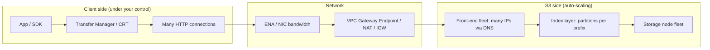
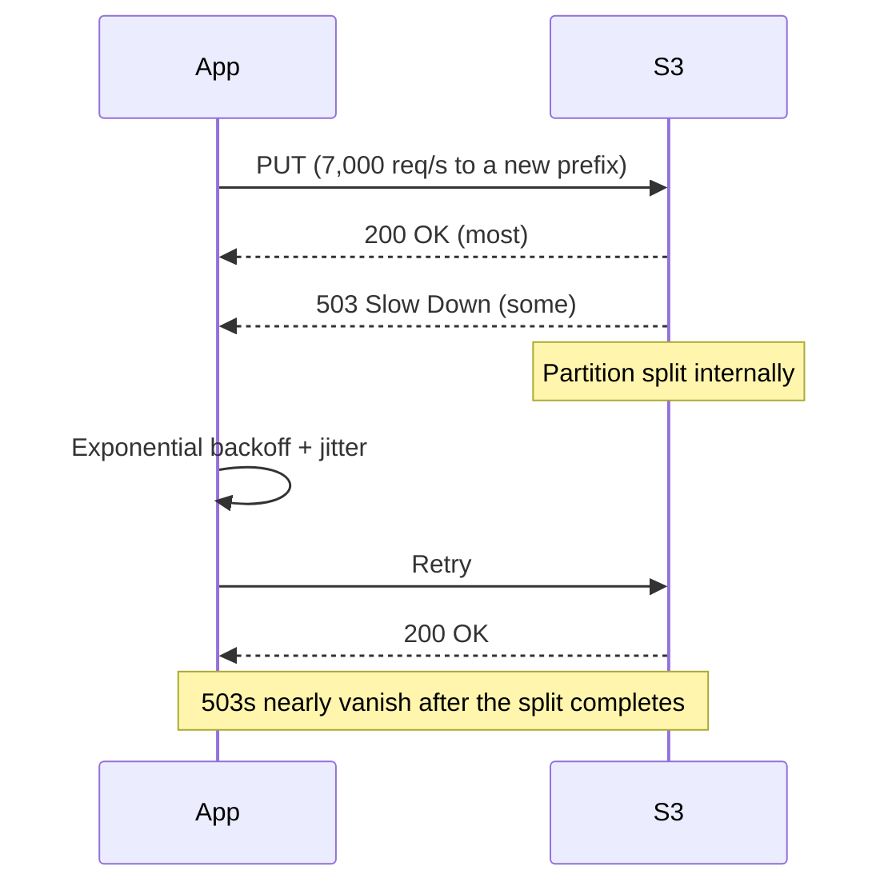
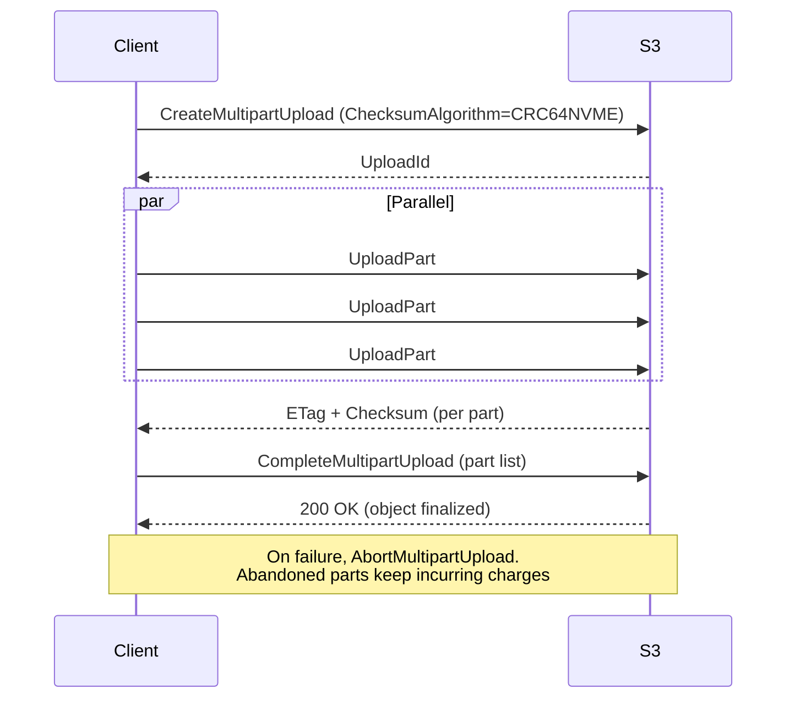
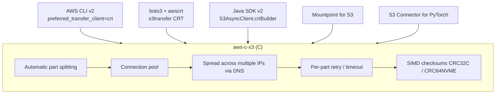
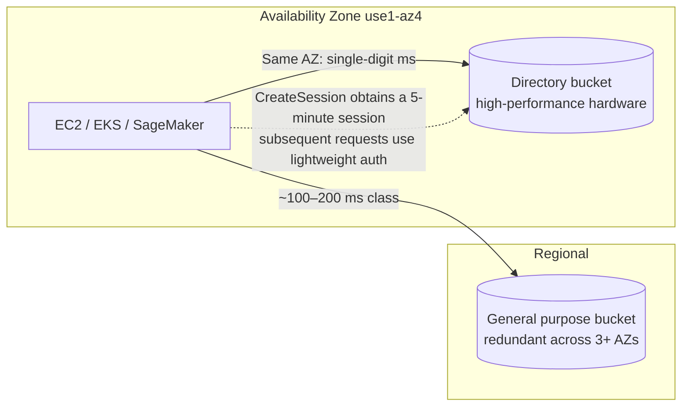
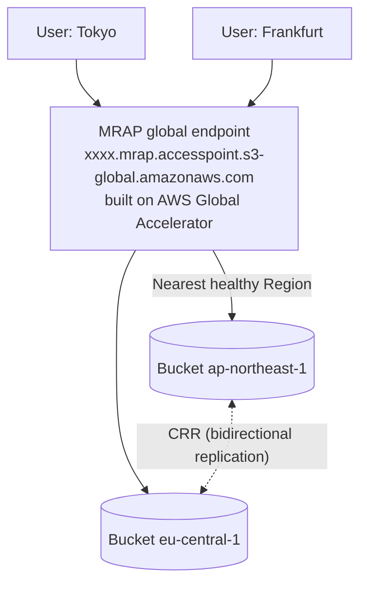

# The complete guide to S3 performance

_Last verified: 2026-10-03_

S3 is not "one fast storage device." Treat it as a **massive distributed system** and it scales almost without limit. Use it like "one TCP connection hammering one key" and it will be slow no matter how good your EC2 instance is. This chapter covers how request-rate limits are determined, what 503 SlowDown really means, parallelism with multipart and Range GET, the CRT client, Mountpoint, S3 Express One Zone, and how to design for 100 Gbps.

## 0. The big picture



Performance bottlenecks fall into four broad categories.

| Layer | Typical symptom | Main remedies |
| --- | --- | --- |
| Request rate (index layer) | `503 Slow Down` errors | Spread across prefixes, ramp up gradually, exponential backoff |
| Single-connection throughput | Transfer of one file plateaus at tens to ~100 MB/s | Multipart, Range GET, parallel connections |
| Client resources | 100% CPU, out of memory, GC | CRT client, optimized checksum computation, instance selection |
| Network | NIC bandwidth saturated, NAT GW charges, latency | Gateway Endpoint, same-Region placement, ENA Express etc., Transfer Acceleration |

## 1. Request rate and prefixes

### 1.1 The official numbers

The official AWS documentation (as of 2026-10) states:

- **Per partitioned prefix**, at least **3,500 PUT/COPY/POST/DELETE** and **5,500 GET/HEAD** requests per second
- There is no limit on the number of prefixes in a bucket
- Splitting across 10 prefixes lets reads scale to 55,000 req/s (official example)
- Scaling is **gradual**, not instantaneous. While scaling, S3 may return 503 Slow Down

The key is what "prefix" means here. S3 has no concept of "folders." A key is just a string, and S3's internal index divides the key space into **lexicographic ranges** assigned to partitions. As traffic grows, S3 automatically **splits** partitions. The "partitioned prefix" in the documentation refers to this internal partition unit, which does not necessarily align with `/` delimiters.

```text
Key space (lexicographic order)
├─────────────── partition A ───────────────┤
logs/2026/10/01/...  logs/2026/10/02/...  logs/2026/10/03/...

As load rises, S3 splits automatically:
├── partition A1 ──┤├── partition A2 ──┤├── partition A3 ──┤
logs/2026/10/01/   logs/2026/10/02/    logs/2026/10/03/
   3,500 PUT/s        3,500 PUT/s         3,500 PUT/s
```

### 1.2 Are random hash prefixes no longer needed? Half right

In July 2018, S3 significantly raised its request-rate performance and withdrew the old guidance to "randomize the start of key names." Before that, hash prefixes like `a1b2/` were standard practice.

Points still worth remembering:

1. **Ordinary workloads don't need hashing**. S3 splits automatically, so even date-based keys are gradually accommodated.
2. **But splitting is reactive**. If you suddenly throw tens of thousands of req/s at a new prefix, you get 503s until splitting catches up.
3. **Hotspots tend to concentrate at the "lexicographic edge"**. Heavy PUTs to keys with monotonically increasing timestamps like `logs/2026-10-03T12:00:00` always concentrate writes on the newest range (= one partition).
4. The official design patterns for "high request rate workloads" still say to distribute across multiple partitions using randomized or sequential prefix patterns.

So the correct understanding is: **"Hashing is not required, but at very high rates, designing for distribution helps avoid 503s."**

### 1.3 Prefix design patterns

| Pattern | Example | Pros | Cons |
| --- | --- | --- | --- |
| Date hierarchy | `logs/2026/10/03/host-a.gz` | Works well with Athena/Glue partitions, easy lifecycle management | Writes concentrate on the latest date |
| Leading shard number | `logs/shard=07/2026/10/03/...` | Parallelizes writes N ways | Readers must scan N prefixes |
| Leading short hash | `a3f/2026/10/03/object.bin` | Maximum distribution | Not human-readable, hard to browse together with ListObjects |
| Leading tenant ID | `tenant=123/...` | Natural distribution for multi-tenant | A huge tenant becomes a hotspot |
| Reversed timestamp | `9999999999-epoch/...` | Avoids monotonic increase | Less readable |

Recommendation: **use an analysis-friendly hierarchy by default, and if the write rate looks likely to consistently exceed 3,500 PUT/s per prefix, add a shard number at a higher level**.

### 1.4 Ramp-up strategy

When sending large volumes of requests to a new prefix, the official guidance recommends:

- **Increase gradually** instead of jumping straight to peak (let S3 split ahead of you)
- Monitor CloudWatch request metrics (`5xxErrors`) and the 503 error count in Storage Lens
- Identify the keys and prefixes returning 503 using server access logs (since 2026-06, these can be delivered directly to CloudWatch Logs / S3 Tables)

## 2. 503 Slow Down and retries

### 2.1 What 503 means

`503 Slow Down` does not mean "S3 is broken." It is a signal that **this partition is not yet optimized for that rate**. With correct retries, it eventually goes away.



### 2.2 SDK retry modes

The AWS SDKs and CLI have three retry modes.

| Mode | Behavior | Default max attempts |
| --- | --- | --- |
| `legacy` | Older per-SDK implementation | Varies by SDK |
| `standard` | Exponential backoff + jitter, retry quota (token bucket) | 3 |
| `adaptive` | standard + client-side rate limiting (throttles the send rate itself when throttling is detected) | 3 |

```bash
# Set in ~/.aws/config
aws configure set retry_mode standard
aws configure set max_attempts 10

# Environment variables also work
export AWS_RETRY_MODE=adaptive
export AWS_MAX_ATTEMPTS=10
```

Note: the CLI's CRT transfer client honors `max_attempts` only within the range 2–64, and with `retry_mode = adaptive` it falls back to the classic client (except on CRT-optimized instances) (check with `aws help s3-config`).

### 2.3 Latency-sensitive retries (tail latency mitigation)

The official design patterns give concrete numbers.

- Large, variably sized requests (e.g. over 128 MB): track effective throughput and retry the **slowest 5%**
- Small requests under 512 KB (median latency in the tens of ms): retry the GET/PUT after **2 seconds**, and if needed once more after 4 seconds
- Fixed-size requests: retrying just the **slowest 1%** is effective
- When retrying, use a **new connection** and **re-resolve DNS** (raises the chance of hitting a different front end)

```python
# Example boto3 config for low latency
import boto3
from botocore.config import Config

cfg = Config(
    retries={"mode": "standard", "max_attempts": 5},
    connect_timeout=1,
    read_timeout=2,          # Assumes small objects. Increase for large objects
    max_pool_connections=128,
    tcp_keepalive=True,
)
s3 = boto3.client("s3", config=cfg)
```

### 2.4 Causes of slowness other than 503

| Symptom | Cause | Fix |
| --- | --- | --- |
| `ThrottlingException` with SSE-KMS | KMS request quota | Enable **S3 Bucket Key** (greatly reduces KMS calls) |
| Slow TLS handshake every time | Connections not reused | HTTP connection pool, Keep-Alive |
| Traffic concentrated on a single IP | DNS caching, pinned IP | Re-resolve DNS periodically; CRT spreads across multiple IPs automatically |
| `ListObjectsV2` is slow | 1,000 keys per page, sequential paging | Parallel List per prefix, replace with S3 Inventory / S3 Metadata tables |

## 3. Multipart upload

### 3.1 Specifications (as of 2026-10)

In December 2025 (re:Invent 2025), the **maximum object size was raised from 5 TB to 50 TB**. The User Guide lists the following.

| Item | Value |
| --- | --- |
| Maximum object size | 48.8 TiB (≈ 50 TB) |
| Maximum size for a single PUT | 5 GB (multipart required beyond that) |
| Maximum number of parts | 10,000 |
| Part numbers | 1–10,000 |
| Part size | 5 MiB–5 GiB (no minimum for the last part) |
| Max returned per ListParts call | 1,000 |
| Max returned per ListMultipartUploads call | 1,000 |
| Recommendation | Consider multipart for objects over 100 MB |

Calculation: 10,000 parts × 5 GiB = 48.8 TiB. So creating a 50 TB-class object requires a **part size near the 5 GiB maximum**.

### 3.2 Flow



Key points:

- Parts can be uploaded in any order, from any host, in parallel
- Only failed parts need to be resent (improves fault tolerance for large files)
- **Parts of incomplete multipart uploads incur storage charges**. The lifecycle rule `AbortIncompleteMultipartUpload` (e.g. 7 days) is a standard setting for every bucket
- The ETag after completion is not an MD5 but has the form `<MD5 of concatenated part MD5s>-<number of parts>`

### 3.3 Choosing part size and chunk size

| Object size | Suggested part size | Reason |
| --- | --- | --- |
| Up to 100 MB | Single PUT or 8–16 MiB | Low overhead |
| 100 MB–10 GB | 8–64 MiB | Balance between parallelism and request count |
| 10 GB–1 TB | 64–256 MiB | Keeps the part count at or below 10,000 |
| 1 TB–48.8 TiB | 1–5 GiB | Watch the part limit (must be at least `size / 10000`) |

The minimum part size is `ceil(object_size / 10000)`. The CLI automatically adjusts `multipart_chunksize` if the part count would exceed the limit.

### 3.4 Checksums and multipart

Since December 2024, the latest SDKs compute and send CRC-based checksums by default, and S3 validates them. The default algorithm is **CRC64NVME**. In April 2026, MD5, XXHash3, XXHash64, XXHash128, and SHA-512 were added, bringing the total to 10 algorithms.

| Type | Description | Supported algorithms |
| --- | --- | --- |
| `FULL_OBJECT` | Checksum of the whole object. Part CRCs can be combined mathematically | CRC64NVME (always full object), CRC32, CRC32C |
| `COMPOSITE` | Checksum of per-part checksums. Takes the form `xxxx-N` | SHA-1, SHA-256, CRC32, CRC32C, etc. |

```bash
# Specify the algorithm and type when starting the multipart upload
aws s3api create-multipart-upload \
  --bucket amzn-s3-demo-bucket --key big.bin \
  --checksum-algorithm CRC64NVME --checksum-type FULL_OBJECT
```

CRC-family checksums have low CPU cost and benefit from hardware assistance (SSE4.2 for CRC32C, and CRT's SIMD implementation for CRC64NVME), so they are far lighter than SHA-256 even in high-throughput environments.

## 4. Byte-range GET and parallel downloads

### 4.1 Basics

The `Range` header lets you fetch only part of an object.

```bash
# First 1 MiB only
aws s3api get-object --bucket amzn-s3-demo-bucket --key big.bin \
  --range bytes=0-1048575 part0.bin

# Only part 3 of a multipart object (aligned to part boundaries, so fastest)
aws s3api get-object --bucket amzn-s3-demo-bucket --key big.bin \
  --part-number 3 part3.bin
```

Official guidance:

- Fetching different ranges concurrently over parallel connections yields higher aggregate throughput than a single GET
- For objects uploaded with multipart, GET using the **same part size (part boundaries)** for best results
- Smaller ranges also reduce the amount of data resent on retry
- The older whitepaper recommended "parallel GETs with 8–16 MB ranges"

### 4.2 When Range GET helps

| Use case | Benefit |
| --- | --- |
| Downloading huge files | Parallelism pushes throughput up to the NIC limit |
| Parquet / ORC analytics | Read the footer (metadata) first, then fetch only the needed column chunks |
| Video seeking | Fetch only the bytes at the playback position |
| Part of a ZIP / tar archive | Read only the central directory |
| ML random access | Fetch a single sample within a shard file |

## 5. Per-connection throughput and the road to 100 Gbps

### 5.1 Rule-of-thumb numbers

| Metric | Value | Source / caveat |
| --- | --- | --- |
| Throughput per connection | ~85–90 MB/s (older whitepaper); a re:Invent 2025 talk gave a rough "~100 MB/s per connection" | Rule of thumb, not an SLA |
| Parallelism needed to saturate a 10 Gbps NIC | ~15 requests | 1,250 MB/s ÷ 85 MB/s |
| Achievable from a single EC2 instance | Up to 100 Gb/s (official User Guide) | 200 Gbps-class instances exist in practice |
| Small-object latency (S3 Standard) | Roughly 100–200 ms (official) | Includes first-byte latency |
| S3 Express One Zone latency | Consistent single-digit ms | When accessed from the same AZ |

Formula:

```text
Required parallelism ≈ target throughput (MB/s) / per-connection (≈85–100 MB/s)

  10 Gbps  = 1,250 MB/s   → ~13–15 parallel
  25 Gbps  = 3,125 MB/s   → ~32–37 parallel
 100 Gbps  = 12,500 MB/s  → ~125–150 parallel
 200 Gbps  = 25,000 MB/s  → ~250–300 parallel
```

### 5.2 Checklist for reaching 100 Gbps

1. **Choose an instance with high network bandwidth** (e.g. c6in/c7gn/c8gn/m6in/p5 families. Check per-instance-type bandwidth in the EC2 documentation)
2. Place it in the **same Region** (cross-Region hurts both latency and data transfer cost)
3. Go through a **VPC Gateway Endpoint** (routing through a NAT Gateway incurs NAT throughput limits and processing charges)
4. Use a **CRT-based client** (automatic parallelism, distribution across multiple IPs, per-part retries)
5. **Make sure local disk isn't the bottleneck** (EBS gp3 throughput limits, use instance store NVMe, or process in memory)
6. Use **CRC-family checksums** (SHA-256 eats CPU)
7. **Stream processing**: process downloads directly in a pipeline instead of writing them to disk, eliminating one I/O step
8. **Scale horizontally if a single instance plateaus** (line up instances with Spark / Ray / Batch for terabit-class throughput)

### 5.3 EC2 networking caveats

| Item | Details |
| --- | --- |
| ENA | Enhanced networking required on all current instances. Keep the driver up to date |
| Per-flow limit | EC2 caps **bandwidth per flow (5-tuple)** (around 5 Gbps outside the same placement group). That's why parallel connections are essential |
| Burst bandwidth | "Up to X Gbps" on small instances is a burst value. Sustained bandwidth is lower |
| NAT Gateway | A single NAT GW also has a bandwidth limit. For S3, Gateway Endpoint is the only sensible choice |
| Interface Endpoint (PrivateLink) | For private access from on-premises or other Regions. Billed per hour and per data processed |
| DNS | S3 returns many IPs via DNS. Caching a single IP forever defeats load balancing |

## 6. CRT-based clients

### 6.1 What the AWS Common Runtime (CRT) is

AWS CRT is a set of shared libraries written in C (`aws-c-s3`, `aws-c-http`, `aws-checksums`, etc.). Its S3 client **automatically splits transfers into multipart/Range GETs, spreads many connections across multiple S3 IPs, and retries per part**. Python, Java, the CLI, Mountpoint, the PyTorch Connector, and others share it.



### 6.2 AWS CLI

```bash
# Force CRT
aws configure set default.s3.preferred_transfer_client crt
# Target bandwidth, effective only when using CRT
aws configure set default.s3.target_bandwidth 100Gb/s

# Revert to classic
aws configure set default.s3.preferred_transfer_client classic
```

Conditions for `auto` per `aws help s3-config` (as of CLI v2.37):

- Not an S3→S3 copy (CRT handles only uploads, downloads, and deletes)
- Running on Linux EC2 on a CRT-optimized instance type (p4d.24xlarge, p5.48xlarge, p5en.48xlarge, p6-b200.48xlarge, trn1.32xlarge, etc.) or an eligible family (c6i, c7g, c8g, m7i, r7i, and many more)
- No other CLI process is using CRT

Otherwise it resolves to classic (the Python implementation). To guarantee CRT, set `crt` explicitly.

### 6.3 boto3 (CRT integration in s3transfer)

```bash
pip install "boto3[crt]"
```

```python
import boto3
from boto3.s3.transfer import TransferConfig

s3 = boto3.client("s3")
cfg = TransferConfig(preferred_transfer_client="crt")  # auto | classic | crt
s3.upload_file("/data/big.bin", "amzn-s3-demo-bucket", "big.bin", Config=cfg)
s3.download_file("amzn-s3-demo-bucket", "big.bin", "/data/big.copy", Config=cfg)
```

Note: when using CRT, many `TransferConfig` values (`max_concurrency`, `io_chunksize`, `use_threads`, `max_bandwidth`, etc.) are ignored, and bandwidth is allocated automatically across the whole process. There is one CRT client per process (controlled by a lock).

### 6.4 Java SDK v2

```java
import software.amazon.awssdk.services.s3.S3AsyncClient;
import software.amazon.awssdk.transfer.s3.S3TransferManager;
import software.amazon.awssdk.transfer.s3.model.UploadFileRequest;
import java.nio.file.Paths;

S3AsyncClient s3 = S3AsyncClient.crtBuilder()
        .targetThroughputInGbps(50.0)
        .minimumPartSizeInBytes(16L * 1024 * 1024)
        .build();

S3TransferManager tm = S3TransferManager.builder().s3Client(s3).build();

tm.uploadFile(UploadFileRequest.builder()
        .putObjectRequest(b -> b.bucket("amzn-s3-demo-bucket").key("big.bin"))
        .source(Paths.get("/data/big.bin"))
        .build())
  .completionFuture().join();
```

### 6.5 Go SDK v2

Go uses a pure Go implementation, not CRT. On January 30, 2026, `feature/s3/transfermanager` became GA and the old `feature/s3/manager` was deprecated. See the SDK section of [07-cli-cookbook](07-cli-cookbook.md) for details.

## 7. Mountpoint for Amazon S3

### 7.1 What it is

Mountpoint is an **open-source FUSE file client** (written in Rust) built on top of CRT. It mounts an S3 bucket as a local directory and translates `open`/`read` into S3 GETs (Range). As of 2026-10, the latest release is `mountpoint-s3-1.24.0` (verified on GitHub).

```bash
# Install (Amazon Linux / RHEL family, x86_64)
wget https://s3.amazonaws.com/mountpoint-s3-release/latest/x86_64/mount-s3.rpm
sudo yum install -y ./mount-s3.rpm

mkdir -p ~/mnt
mount-s3 amzn-s3-demo-bucket ~/mnt
# Unmount
umount ~/mnt
```

### 7.2 Semantics (not fully POSIX-compliant)

Mountpoint's design principle: **file operations that can't be implemented efficiently with S3's object APIs are not supported**.

| Operation | General purpose bucket | Directory bucket (Express One Zone) |
| --- | --- | --- |
| Read (sequential/random) | Yes | Yes |
| Create new file | Yes (sequential writes from the start only) | Yes |
| Overwrite existing file | Only with `--allow-overwrite` + `O_TRUNC` | Same |
| Append | No | Yes with `--incremental-upload` (sequential writes at the end) |
| Rename file | No | Yes (atomic rename via RenameObject) |
| Rename directory | No | No |
| Delete | Only with `--allow-delete` | Same |
| chmod/chown/symlinks | No (set uniformly for the whole mount via `--uid`/`--gid`/`--file-mode`) | No |
| Random writes | No | No |

Consistency: new uploads are atomic, and the whole object becomes visible to other clients once `close` (or `fsync`) succeeds. With `--incremental-upload`, partial writes are visible along the way.

### 7.3 Caching

```bash
# Local disk cache (instance store recommended)
mount-s3 amzn-s3-demo-bucket ~/mnt \
  --cache /mnt/nvme/mp-cache --max-cache-size 102400 \
  --metadata-ttl 300

# Put a cache shared across multiple instances in Express One Zone
mount-s3 amzn-s3-demo-bucket ~/mnt \
  --cache-xz amzn-s3-demo-bucket--usw2-az1--x-s3

# Maximum caching for training data that never changes
mount-s3 amzn-s3-demo-bucket ~/mnt --cache /mnt/nvme/c --metadata-ttl indefinite
```

| Flag | Meaning |
| --- | --- |
| `--metadata-ttl <seconds\|minimal\|indefinite>` | Cache TTL for metadata (existence, size, ETag). Default is `minimal` (when caching is disabled) |
| `--cache <DIR>` | Local cache of object contents. When enabled, the metadata TTL defaults to 60 seconds |
| `--max-cache-size <MiB>` | Upper limit of the local cache |
| `--cache-xz <directory-bucket>` | Shared cache in Express One Zone (for small objects read repeatedly from many instances) |
| `--maximum-throughput-gbps` | Target bandwidth. Defaults to instance bandwidth on EC2, 10 Gbps elsewhere |
| `--max-threads` | Number of concurrent file operations (default 16) |
| `--read-part-size` / `--write-part-size` | Part size (default 8 MiB). Maximum write size is 10,000 × write-part-size, about 78 GiB by default |

Mountpoint never deletes entries from the shared cache (`--cache-xz`), so always attach a **lifecycle expiration rule** to the directory bucket.

### 7.4 Mountpoint vs. S3 Files

In April 2026, **Amazon S3 Files** (an EFS-based managed service that presents an S3 bucket as a full-featured file system) became GA. See [06-new-frontiers](06-new-frontiers.md) for details.

| Aspect | Mountpoint | S3 Files |
| --- | --- | --- |
| Form | Client-side FUSE (OSS, free) | Managed network file system (paid) |
| POSIX compatibility | Limited (no rename or random writes) | Full file system semantics |
| Best suited for | Large-scale sequential reads, ML training data, read-heavy workloads | Existing file-based apps, shared writes, agent workspaces |
| Write-back | Directly to S3 on `close` | Accumulated in the EFS cache and committed to S3 in batches |

## 8. Other connectors

### 8.1 Mountpoint for Amazon S3 CSI Driver

A CSI driver for mounting S3 as a PersistentVolume in Pods on EKS. It uses Mountpoint internally and installs as an EKS add-on.

### 8.2 Amazon S3 Connector for PyTorch

```bash
pip install s3torchconnector
```

```python
from s3torchconnector import S3MapDataset, S3IterableDataset, S3Checkpoint
import torch

REGION = "us-east-1"
URI = "s3://amzn-s3-demo-bucket/train/"

# Random access (map-style)
ds = S3MapDataset.from_prefix(URI, region=REGION)
# Sequential (iterable-style; for large sharded files)
it = S3IterableDataset.from_prefix(URI, region=REGION)

# Save/load checkpoints directly to/from S3
ckpt = S3Checkpoint(region=REGION)
with ckpt.writer("s3://amzn-s3-demo-bucket/ckpt/epoch1.pt") as w:
    torch.save({"step": 1}, w)
with ckpt.reader("s3://amzn-s3-demo-bucket/ckpt/epoch1.pt") as r:
    state = torch.load(r)
```

Because it uses CRT, it is far faster than GETting samples one at a time with plain boto3. It also provides checkpoint IO for PyTorch Lightning and Distributed Checkpoint (DCP) integration.

### 8.3 Hadoop S3A (Spark / Hive / Trino)

S3A is Apache Hadoop's S3 connector (`s3a://`). On EMR, EMRFS (`s3://`) is the default. Commonly tuned S3A parameters:

| Property | Meaning |
| --- | --- |
| `fs.s3a.connection.maximum` | HTTP connection pool limit. Increase it to match parallelism |
| `fs.s3a.threads.max` | Number of threads for uploads etc. |
| `fs.s3a.multipart.size` | Multipart part size |
| `fs.s3a.fast.upload.buffer` | `disk` / `array` / `bytebuffer` |
| `fs.s3a.experimental.input.fadvise` | `random` (Parquet/ORC) / `sequential` / `normal` |
| `fs.s3a.committer.name` | `magic` / `directory` / `partitioned` (S3A committers that avoid rename) |

Because rename on S3 is copy + delete, Hadoop's traditional "write to a temporary directory and commit by rename" is slow and unsafe. Use the **S3A committers** (or a table format such as Iceberg).

In December 2024, AWS announced the **Analytics Accelerator Library for Amazon S3** (a Java library that optimizes prefetching and caching for Parquet reads). Initial S3A integration shipped in Hadoop 3.4.2 (released 2025-08-29; HADOOP-19348) and is enabled with `fs.s3a.input.stream.type=analytics`. The default is still `classic`; the Hadoop documentation describes `analytics` as "in stabilization" and notes that it requires an extra library.

### 8.4 Two different things called s3fs

| Name | What it is | Use |
| --- | --- | --- |
| `s3fs-fuse` | FUSE file system written in C++ | Long-standing, POSIX-leaning mount. Slower than Mountpoint but emulates rename etc. |
| Python `s3fs` | fsspec-based Python library (`s3fs.S3FileSystem`) | Opening `s3://` from pandas / Dask / xarray |

```python
import pandas as pd
df = pd.read_parquet("s3://amzn-s3-demo-bucket/data/part-0000.parquet")  # Uses s3fs internally
```

## 9. Transfer Acceleration

A feature that receives data at CloudFront edge locations and carries it over the AWS backbone to the bucket's Region. Effective for intercontinental uploads.

```bash
# Enable
aws s3api put-bucket-accelerate-configuration \
  --bucket amzn-s3-demo-bucket \
  --accelerate-configuration Status=Enabled

# Use the accelerate endpoint from the CLI
aws configure set default.s3.use_accelerate_endpoint true
aws s3 cp big.bin s3://amzn-s3-demo-bucket/

# For one-off use, --endpoint-url
aws s3 cp big.bin s3://amzn-s3-demo-bucket/ \
  --endpoint-url https://s3-accelerate.amazonaws.com
```

| Item | Details |
| --- | --- |
| Endpoint | `bucket.s3-accelerate.amazonaws.com` (dual-stack: `s3-accelerate.dualstack.amazonaws.com`) |
| Constraints | No dots in the bucket name (DNS-compatible); up to about 30 minutes to take effect after enabling |
| Pricing | Added on top of normal transfer charges. No extra charge for transfers that weren't accelerated |
| Good for | Regular uploads of large files from distant locations, concentrated uploads from around the world |
| Not good for | From EC2 in the same Region, large numbers of small files |

You can measure the benefit beforehand with the Speed Comparison tool.

## 10. Putting CloudFront in front of S3 (OAC)

### 10.1 Why

- Cache the frequently read "working set" at the edge → lower latency, fewer S3 GETs and lower S3 cost
- Data transfer from S3 to CloudFront is free (transfer from CloudFront to the internet is billed)
- Also useful when you need higher transfer rates over a single HTTP connection (official guidance)

### 10.2 OAC (Origin Access Control)

The successor to the old OAI (Origin Access Identity). Because it accesses S3 with SigV4 signing, it supports **objects encrypted with SSE-KMS**, all Regions, PUT/DELETE, and more. The bucket does not need to be public; Block Public Access can stay enabled.

```json
{
  "Version": "2012-10-17",
  "Statement": [
    {
      "Sid": "AllowCloudFrontServicePrincipalReadOnly",
      "Effect": "Allow",
      "Principal": { "Service": "cloudfront.amazonaws.com" },
      "Action": "s3:GetObject",
      "Resource": "arn:aws:s3:::amzn-s3-demo-bucket/*",
      "Condition": {
        "StringEquals": {
          "AWS:SourceArn": "arn:aws:cloudfront::111122223333:distribution/EDFDVBD6EXAMPLE"
        }
      }
    }
  ]
}
```

When using SSE-KMS, the KMS key policy must also allow `kms:Decrypt` for `cloudfront.amazonaws.com`.

## 11. S3 Express One Zone (from a performance perspective)

### 11.1 Key facts

| Item | Value / details |
| --- | --- |
| Announced | re:Invent 2023 |
| Latency | Consistent single-digit ms (up to 10x faster than S3 Standard) |
| Redundancy | Single AZ (you choose the AZ; place it in the same AZ as compute) |
| Bucket type | **Directory bucket** (named in the form `name--usw2-az1--x-s3`) |
| TPS | Up to 2 million GET/s and 200,000 PUT/s per directory bucket. **Defaults are 200,000 reads/s and 100,000 writes/s**; request a limit increase from Support for more |
| Authentication | Session-based auth via `CreateSession` (temporary credentials expire after 5 minutes; the SDK refreshes them automatically) |
| Append | Append to the end of existing objects (since November 2024; `--write-offset-bytes`) |
| Rename | Atomic rename with `RenameObject` (since June 2025) |
| Regions | 15 Regions total after 7 were added in September 2026 |

### 11.2 April 2025 price reduction (us-east-1)

Announced on the AWS News Blog, effective April 10, 2025.

| Item | Old | New | Reduction |
| --- | --- | --- | --- |
| Storage (GB-month) | $0.16 | $0.11 | 31% |
| PUT (per 1,000 requests) | $0.0025 (up to 512 KB) | $0.00113 | 55% |
| GET (per 1,000 requests) | $0.0002 (up to 512 KB) | $0.00003 | 85% |
| Data upload (GB) | $0.008 | $0.0032 | 60% |
| Data retrieval (GB) | $0.0015 | $0.0006 | 60% |

At the same time, per-byte transfer charges changed to apply to **all bytes**, rather than only the portion above 512 KB.

### 11.3 Why it's fast



- **Same-AZ placement**: eliminates cross-AZ hops
- **Session authentication**: the cost of per-request IAM authorization is paid once at session creation
- **Directory structure**: unlike the flat key space of general purpose buckets, it has a real hierarchy (directories). There are differences, such as `ListObjectsV2` results not being sorted lexicographically and prefixes needing to end with `/`
- **Dedicated hardware**: data is stored on high-performance media

### 11.4 Working with directory buckets

```bash
# Create (specify the AZ ID)
aws s3api create-bucket \
  --bucket amzn-s3-demo-bucket--usw2-az1--x-s3 \
  --region us-west-2 \
  --create-bucket-configuration \
  'Location={Type=AvailabilityZone,Name=usw2-az1},Bucket={DataRedundancy=SingleAvailabilityZone,Type=Directory}'

# List
aws s3api list-directory-buckets --region us-west-2

# Regular aws s3 commands work as-is (the CLI manages sessions automatically)
aws s3 cp ./shard-0001.tar s3://amzn-s3-demo-bucket--usw2-az1--x-s3/train/

# Create a session explicitly (for debugging)
aws s3api create-session --bucket amzn-s3-demo-bucket--usw2-az1--x-s3
```

Use cases: ML training data loaders, Spark/Trino shuffle and intermediate data, Mountpoint's shared cache, low-latency cache layers (e.g. KV caches for search engines), and log appends.

Caveat: because it is single-AZ, **data can become temporarily unreadable during an AZ outage, or be lost to physical destruction**. The basic approach is to keep the source of truth in a general purpose bucket (S3 Standard, etc.) and use Express One Zone as a "fast working area." Since August 2025, you can test AZ-failure behavior with AWS FIS.

## 12. Multi-Region Access Points (MRAP) routing



| Item | Details |
| --- | --- |
| Routing | Proximity-based, over the AWS global network |
| Failover | Active-active or active-passive. Manual switching via failover controls |
| Signing | Requires **SigV4A** (multi-Region signing). SDKs often depend on CRT for it |
| Data consistency | MRAP itself does not replicate. **Configure replication separately** (RTC can also add a 15-minute SLA) |
| Pricing | Data routing charges + acceleration charges (when over the internet) |

Performance-wise, steering clients worldwide to the nearest Region lowers latency. Note that when writes land in multiple Regions, data may be inconsistent during replication lag.

## 13. Benchmarking tools

| Tool | Characteristics | Example |
| --- | --- | --- |
| `warp` (MinIO) | S3-compatible benchmark. Scenarios such as GET/PUT/mixed/list, distributed execution | `warp get --host s3.us-east-1.amazonaws.com --tls --bucket b --obj.size 64MiB --concurrent 64` |
| `s5cmd` | Very fast CLI written in Go. Parallel `cp`/`rm`, wildcards | `s5cmd --numworkers 256 cp 's3://b/data/*' /mnt/nvme/` |
| `elbencho` | Distributed storage benchmark. Measures files, block devices, and S3 with one tool | `elbencho --s3endpoints https://s3.us-east-1.amazonaws.com --s3key ... -w -t 32 -n 0 -N 100 -s 64M b` |
| AWS CLI + CRT | Comparison close to real-world usage | `time aws s3 cp s3://b/50G.bin /dev/null` |
| `fio` + Mountpoint | Measures as file I/O | `fio --filename=~/mnt/x --rw=read --bs=1M --numjobs=16` |

Benchmarking ground rules:

1. Start with one request and double the parallelism, watching which of NIC / CPU / disk saturates first (the officially recommended procedure)
2. **Remove disk writes** (write to `/dev/null` or tmpfs) to see network performance on its own
3. Include a warm-up (new prefixes can return 503s)
4. Watch costs (GET/PUT charges, transfer charges). Tens of thousands of PUTs per second on small objects add up quickly

warp example:

```bash
# PUT 16 MiB objects with 64-way concurrency for 2 minutes
warp put \
  --host s3.us-east-1.amazonaws.com --tls --region us-east-1 \
  --access-key "$AWS_ACCESS_KEY_ID" --secret-key "$AWS_SECRET_ACCESS_KEY" \
  --bucket amzn-s3-demo-bench --obj.size 16MiB --concurrent 64 --duration 2m
```

s5cmd example:

```bash
# Parallel copy of 1 million objects
s5cmd --numworkers 512 cp 's3://amzn-s3-demo-src/prefix/*' 's3://amzn-s3-demo-dst/prefix/'

# Batch execution from a command file
cat > cmds.txt <<'EOF'
cp s3://amzn-s3-demo-bucket/a.bin /mnt/nvme/a.bin
cp s3://amzn-s3-demo-bucket/b.bin /mnt/nvme/b.bin
EOF
s5cmd run cmds.txt
```

## 14. Observability and troubleshooting

| Tool | What to look at |
| --- | --- |
| CloudWatch request metrics (paid, per filter) | `AllRequests`, `4xxErrors`, `5xxErrors`, `FirstByteLatency`, `TotalRequestLatency`, `BytesDownloaded` |
| S3 Storage Lens advanced metrics | 503 error counts, request origins, the **performance metrics** added in December 2025 (access patterns, cross-Region requests, object access counts), analysis across billions of prefixes |
| Server access logs | `Turn-Around Time`, `Total Time`, HTTP status, key. Source Region information since February 2026; delivery to CloudWatch Logs / S3 Tables since June 2026 |
| CloudTrail data events | Who called what (more for auditing than performance analysis) |
| SDK metrics / logs | Retry counts, latency distribution |

A large gap between `FirstByteLatency` (from S3 receiving the request to returning the first byte) and `TotalRequestLatency` → the network or client-side receiving is slow. High `FirstByteLatency` itself → suspect the S3 side (or throttling).

## 15. Performance design patterns cheat sheet

| Goal | Pattern | Features / tools |
| --- | --- | --- |
| Upload huge files as fast as possible | Parallel multipart, CRC64NVME | CRT (CLI/boto3/Java), s5cmd |
| Download huge files as fast as possible | Parallel Range GETs aligned to part boundaries | CRT, `--part-number` |
| Tens of thousands of PUTs per second | Prefix distribution + ramp-up + backoff | Shard prefixes, standard/adaptive retries |
| Low-latency small objects | Express One Zone in the same AZ, or CloudFront/ElastiCache | Directory buckets |
| Global distribution | CDN caching | CloudFront + OAC |
| Uploads from around the world | Receive at the edge | Transfer Acceleration, MRAP |
| Loading ML training data | Sharding (tar/WebDataset/Parquet), sequential reads | PyTorch Connector, Mountpoint (+ cache) |
| Saving checkpoints | Parallel multipart, stage first in Express One Zone | S3Checkpoint, DCP |
| Faster analytics queries | Columnar + partitioning + right-sized files (128 MB–1 GB) | Parquet, Iceberg, S3 Tables automatic compaction |
| Bulk processing of many objects | Manifest-driven instead of List | S3 Batch Operations, S3 Inventory, S3 Metadata |
| Escaping small-file hell | Combine files (compaction) | S3 Tables, repartition with Spark |
| Avoiding KMS throttling | Bucket key | S3 Bucket Key |
| Avoiding NAT cost and bottlenecks | VPC Gateway Endpoint | S3 prefix list in the route table |
| Existing apps that require a file API | Managed file system | S3 Files, FSx for Lustre (S3 integration) |

## 16. Anti-patterns

- **`get_object().read()` on a huge file with one thread and one connection** → plateaus around 100 MB/s
- **Hitting a new prefix at maximum rate immediately** → a storm of 503s
- **A homegrown HTTP client without retries** → jobs fail on 503
- **Moving terabytes to S3 through a NAT Gateway** → slow and expensive in processing charges
- **Billions of tiny files of a few KB** → request charges and List costs balloon. For analytics, make files bigger first
- **Apps on Mountpoint that rely on rename** (rename isn't supported on general purpose buckets)
- **Keeping the only source of truth in Express One Zone** → single-AZ risk
- **High TPS with SSE-KMS but Bucket Key disabled** → KMS throttling

## References

- [Best practices design patterns: optimizing Amazon S3 performance](https://docs.aws.amazon.com/AmazonS3/latest/userguide/optimizing-performance.html)
- [Performance guidelines for Amazon S3](https://docs.aws.amazon.com/AmazonS3/latest/userguide/optimizing-performance-guidelines.html)
- [Performance design patterns for Amazon S3](https://docs.aws.amazon.com/AmazonS3/latest/userguide/optimizing-performance-design-patterns.html)
- [Best Practices Design Patterns: Optimizing Amazon S3 Performance (whitepaper PDF)](https://docs.aws.amazon.com/pdfs/whitepapers/latest/s3-optimizing-performance-best-practices/s3-optimizing-performance-best-practices.pdf)
- [Amazon S3 multipart upload limits](https://docs.aws.amazon.com/AmazonS3/latest/userguide/qfacts.html)
- [Amazon S3 increases the maximum object size to 50 TB (2025-12)](https://aws.amazon.com/about-aws/whats-new/2025/12/amazon-s3-maximum-object-size-50-tb/)
- [Amazon S3 adds new default data integrity protections (2024-12)](https://aws.amazon.com/about-aws/whats-new/2024/12/amazon-s3-default-data-integrity-protections/)
- [Amazon S3 now supports five additional checksum algorithms (2026-04)](https://aws.amazon.com/about-aws/whats-new/2026/04/s3-five-additional-checksum-algorithms/)
- [Accelerate Amazon S3 throughput with the AWS Common Runtime](https://aws.amazon.com/blogs/storage/improving-amazon-s3-throughput-for-the-aws-cli-and-boto3-with-the-aws-common-runtime/)
- [Boto3 File transfer configuration](https://docs.aws.amazon.com/boto3/latest/guide/s3.html)
- AWS CLI v2.37.7 `aws help s3-config` (verified locally)
- [S3 Transfer Manager v2 for Go GA (discussion #3306)](https://github.com/aws/aws-sdk-go-v2/discussions/3306)
- [Mountpoint for Amazon S3 (GitHub)](https://github.com/awslabs/mountpoint-s3)
- [Mountpoint file system behavior (SEMANTICS.md)](https://github.com/awslabs/mountpoint-s3/blob/main/doc/SEMANTICS.md)
- [Mountpoint configuration (CONFIGURATION.md)](https://github.com/awslabs/mountpoint-s3/blob/main/doc/CONFIGURATION.md)
- [Configuring and using Mountpoint](https://docs.aws.amazon.com/AmazonS3/latest/userguide/mountpoint-usage.html)
- [Amazon S3 Connector for PyTorch (GitHub)](https://github.com/awslabs/s3-connector-for-pytorch)
- [Hadoop-AWS module: Integration with Amazon Web Services (S3A)](https://hadoop.apache.org/docs/stable/hadoop-aws/tools/hadoop-aws/index.html)
- [Hadoop 3.4.2 S3A: Reading data from S3 (input stream types)](https://hadoop.apache.org/docs/r3.4.2/hadoop-aws/tools/hadoop-aws/reading.html)
- [Apache Hadoop 3.4.2 release (2025-08-29)](https://hadoop.apache.org/release/3.4.2.html)
- [HADOOP-19348: S3A: Add initial support for analytics-accelerator-s3 (ASF Jira)](https://issues.apache.org/jira/browse/HADOOP-19348)
- [Analytics Accelerator Library for Amazon S3 (GitHub)](https://github.com/awslabs/analytics-accelerator-s3)
- [Configuring fast, secure file transfers using Amazon S3 Transfer Acceleration](https://docs.aws.amazon.com/AmazonS3/latest/userguide/transfer-acceleration.html)
- [Restricting access to an Amazon S3 origin (CloudFront OAC)](https://docs.aws.amazon.com/AmazonCloudFront/latest/DeveloperGuide/private-content-restricting-access-to-s3.html)
- [Optimizing S3 Express One Zone performance](https://docs.aws.amazon.com/AmazonS3/latest/userguide/s3-express-performance.html)
- [Directory buckets: high performance workloads](https://docs.aws.amazon.com/AmazonS3/latest/userguide/directory-bucket-high-performance.html)
- [Announcing up to 85% price reductions for Amazon S3 Express One Zone](https://aws.amazon.com/blogs/aws/up-to-85-price-reductions-for-amazon-s3-express-one-zone/)
- [S3 Express One Zone atomic renaming (2025-06)](https://aws.amazon.com/about-aws/whats-new/2025/06/amazon-s3-express-one-zone-atomic-renaming-objects-api/)
- [S3 Express One Zone now available in 7 additional Regions (2026-09)](https://aws.amazon.com/about-aws/whats-new/2026/09/s3-express-one-zone-7-regions/)
- [Multi-Region Access Points in Amazon S3](https://docs.aws.amazon.com/AmazonS3/latest/userguide/MultiRegionAccessPoints.html)
- [S3 Storage Lens adds performance metrics (2025-12)](https://aws.amazon.com/about-aws/whats-new/2025/12/amazon-s3-storage-lens-performance-metrics-prefixes-export-tables/)
- [Amazon S3 server access logs to CloudWatch Logs and S3 Tables (2026-06)](https://aws.amazon.com/about-aws/whats-new/2026/06/amazon-s3-cloudwatch-logs-tables/)
- [Amazon EC2 instance network bandwidth](https://docs.aws.amazon.com/AWSEC2/latest/UserGuide/ec2-instance-network-bandwidth.html)
- [MinIO warp](https://github.com/minio/warp)
- [s5cmd](https://github.com/peak/s5cmd)
- [elbencho](https://github.com/breuner/elbencho)
