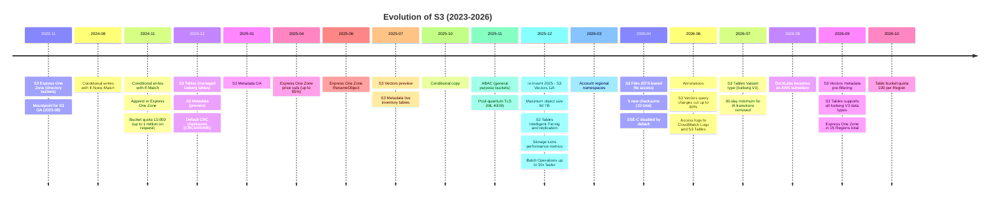
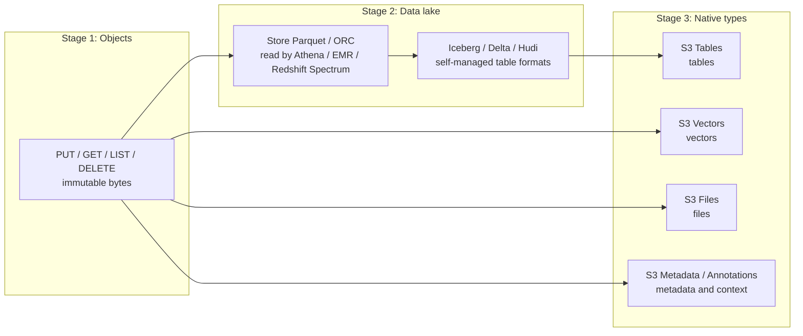
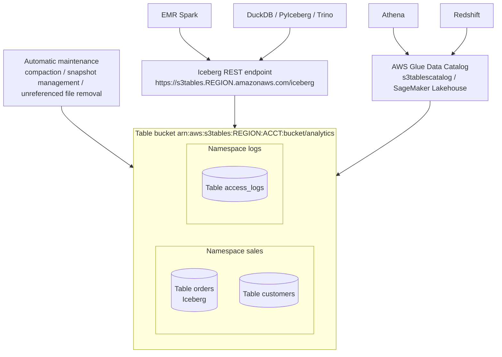
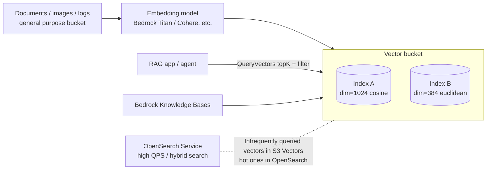
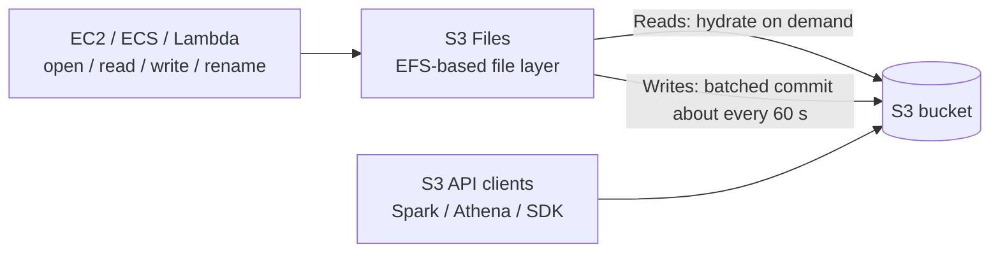
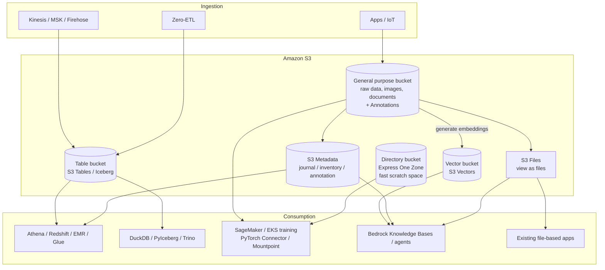

# The new frontiers of S3 (2023-2026)

_Last verified: 2026-10-03_

S3 began in 2006 as "storage for the Internet," and since around 2023 its character has clearly changed: **from "just a place to put objects" to a data platform that directly handles tables, vectors, files, and metadata**. This chapter organizes the major launches of 2023-2026 from a technical standpoint and then covers the strategy behind them: why AWS is extending S3 in this direction.

## 0. Timeline



## 1. Why S3 is becoming a database, a lakehouse, and an AI platform

### 1.1 Data gravity

S3 holds data on the scale of hundreds of trillions of objects (AWS cited more than 400 trillion objects in 2024-12, and more than 500 trillion objects in its 2026-03 20th-anniversary post). Copying data into another system every time you use it creates "data friction":

- The cost of copying (transfer charges, duplicate storage)
- Freshness drift (a copy is always stale)
- Fragmented governance (permissions are managed in two places)

Andy Warfield (VP / Distinguished Engineer for S3), in his All Things Distributed post "S3 Files and the changing face of S3" (2026-04), describes S3 Files as an attempt to eliminate this data friction. The core idea: **"instead of moving data, add representations where the data already lives (S3)."**

### 1.2 "Simplicity is table stakes"

In his March 2025 post "In S3 simplicity is table stakes," Warfield touches on new features such as S3 Tables but writes that what resonated most with the team was **strong consistency, conditional operations, and higher per-account bucket quotas**, because they removed limits and made S3 **simpler**. Preserving "simplicity from the user's point of view" even as features are added is a design principle of the S3 team.

### 1.3 Three stages of evolution



In his 2026-08 post "DuckDB and the changing physics of analytics," Warfield lines up S3 Files, S3 Tables, and S3 Vectors and argues that analytics is shifting from "a separate job you do somewhere else" to "something you do continuously as you build." The same post announced that **DuckLabs (the company behind DuckDB) is becoming an AWS subsidiary, while DuckDB itself continues as open source under the DuckDB Foundation**. The future AWS envisions is one where engines become "libraries" and data lives in one place: S3.

### 1.4 The strategic picture

| Layer            | Before                                           | Now                                                                      |
| ---------------- | ------------------------------------------------ | ------------------------------------------------------------------------ |
| Storage          | S3 (general purpose)                             | S3 general purpose + Express One Zone + table / vector buckets           |
| Table management | Self-managed Iceberg + Glue + compaction jobs    | Managed by S3 Tables (compaction, snapshots, GC)                         |
| Catalog          | Hive Metastore / Glue                            | Iceberg REST endpoint (S3 Tables) + Glue / SageMaker Lakehouse           |
| Vectors          | Dedicated vector DB (OpenSearch, Pinecone, etc.) | S3 Vectors for large, infrequently queried sets; OpenSearch for high QPS |
| Files            | Copy to EFS / FSx                                | S3 Files exposes S3 data directly as files                               |
| Metadata         | Exhaustive List + HEAD, self-built DB            | S3 Metadata (Iceberg tables) + Annotations                               |
| Engines          | Spark / Athena / Redshift                        | + DuckDB / PyIceberg / agents                                            |

## 2. S3 Express One Zone

Performance details are in the Express One Zone section of [05-performance](05-performance.md). Here it is framed as "a new shape of S3."

| Item           | Details                                                                                                                                |
| -------------- | -------------------------------------------------------------------------------------------------------------------------------------- |
| Announced      | 2023-11 (re:Invent 2023)                                                                                                               |
| Essence        | Single AZ, high-performance hardware, and a new bucket type: the **directory bucket**                                                  |
| Authentication | Session credentials valid for 5 minutes, obtained via `CreateSession`                                                                  |
| Performance    | Consistent single-digit ms; up to 2 million GET/s and 200,000 PUT/s per bucket (defaults: 200,000 / 100,000)                           |
| Added in 2024  | Lifecycle expiration, **append** (`x-amz-write-offset-bytes` on `PutObject`), conditional writes                                       |
| Added in 2025  | **Price revision (2025-04)**, Access Points, tags (ABAC, cost allocation), **RenameObject (2025-06)**, AZ failure testing with AWS FIS |
| Added in 2026  | S3 Inventory support (2026-04), 7 more Regions for 15 total (2026-09)                                                                  |

The 2025-04 price cut (us-east-1): storage $0.16 → $0.11/GB-month, PUT $0.00113/1,000, GET $0.00003/1,000, upload $0.0032/GB, retrieval $0.0006/GB.

```bash
# append: add data at the end (current size) of an existing object
SIZE=$(aws s3api head-object --bucket amzn-s3-demo-bucket--usw2-az1--x-s3 \
  --key logs/app.log --query ContentLength --output text)
aws s3api put-object --bucket amzn-s3-demo-bucket--usw2-az1--x-s3 \
  --key logs/app.log --body chunk.log --write-offset-bytes "$SIZE"

# atomic rename
aws s3api rename-object --bucket amzn-s3-demo-bucket--usw2-az1--x-s3 \
  --key logs/app.log.1 --rename-source logs/app.log
```

## 3. S3 Tables

### 3.1 What the problem was

Running Iceberg yourself on general purpose buckets means:

- Streaming ingestion produces **huge numbers of small files**, slowing queries
- You must write and run **compaction** jobs yourself
- Forgetting **snapshot expiration** and **orphan file removal** makes storage balloon
- You operate the catalog (Glue / Hive / Nessie), and permissions are not per table (IAM works per object key)

### 3.2 How S3 Tables is structured

Announced 2024-12 (re:Invent 2024) as "the first cloud object store with built-in Iceberg support." Compared with self-managed Iceberg tables: **up to 3x faster queries and up to 10x higher TPS** (AWS figures).



| Concept           | Description                                                                                                                                                                                |
| ----------------- | ------------------------------------------------------------------------------------------------------------------------------------------------------------------------------------------ |
| Table bucket      | A new bucket type. ARN is `arn:aws:s3tables:...:bucket/<name>`. Default of 100 per Region from 2026-10 (previously 10); up to 1 million tables per Region                                  |
| Namespace         | Logical grouping of tables (equivalent to an Iceberg namespace / database)                                                                                                                 |
| Table             | An Iceberg table. As an IAM resource, permissions can be granted per table                                                                                                                 |
| Maintenance       | `icebergCompaction` (strategy: `auto` / `binpack` / `sort` / `z-order`, target file size), `icebergSnapshotManagement` (minimum snapshots to keep, maximum age), unreferenced file removal |
| Record expiration | Setting that automatically expires records older than a given number of days (`put-table-record-expiration-configuration`)                                                                 |
| Storage class     | `STANDARD` or `INTELLIGENT_TIERING` (from 2025-12)                                                                                                                                         |
| Replication       | Read-only replicas across Regions / accounts (from 2025-12)                                                                                                                                |
| Encryption        | SSE-S3 / SSE-KMS (per bucket or per table)                                                                                                                                                 |

Default snapshot management: "keep at least 1 snapshot, expire those older than 120 hours (5 days)" (per the AWS Big Data Blog).

### 3.3 Two access paths

1. **Iceberg REST endpoint (direct)**: `https://s3tables.<region>.amazonaws.com/iceberg`, with the table bucket ARN as the warehouse and `s3tables` as the SigV4 signing name
2. **Via AWS Glue Data Catalog (integrated)**: integrate the table bucket into Glue as `s3tablescatalog`, apply fine-grained permissions with Lake Formation, and use it from Athena / Redshift / EMR / QuickSight / SageMaker Unified Studio. Glue's Iceberg REST endpoint is `https://glue.<region>.amazonaws.com/iceberg`, signing name `glue`

```python
# Connect from PyIceberg to the S3 Tables Iceberg REST endpoint
from pyiceberg.catalog import load_catalog

catalog = load_catalog(
    "s3tables",
    **{
        "type": "rest",
        "warehouse": "arn:aws:s3tables:us-east-1:111122223333:bucket/analytics",
        "uri": "https://s3tables.us-east-1.amazonaws.com/iceberg",
        "rest.sigv4-enabled": "true",
        "rest.signing-name": "s3tables",
        "rest.signing-region": "us-east-1",
    },
)
tbl = catalog.load_table("sales.orders")
print(tbl.scan(limit=10).to_pandas())
```

```bash
# Example Spark (EMR, etc.) configuration
spark-sql \
  --conf spark.sql.extensions=org.apache.iceberg.spark.extensions.IcebergSparkSessionExtensions \
  --conf spark.sql.catalog.s3t=org.apache.iceberg.spark.SparkCatalog \
  --conf spark.sql.catalog.s3t.type=rest \
  --conf spark.sql.catalog.s3t.uri=https://s3tables.us-east-1.amazonaws.com/iceberg \
  --conf spark.sql.catalog.s3t.warehouse=arn:aws:s3tables:us-east-1:111122223333:bucket/analytics \
  --conf spark.sql.catalog.s3t.rest.sigv4-enabled=true \
  --conf spark.sql.catalog.s3t.rest.signing-name=s3tables \
  --conf spark.sql.catalog.s3t.rest.signing-region=us-east-1
```

### 3.4 Creating with the CLI

```bash
# Table bucket
aws s3tables create-table-bucket --name analytics --region us-east-1

# Namespace
aws s3tables create-namespace \
  --table-bucket-arn arn:aws:s3tables:us-east-1:111122223333:bucket/analytics \
  --namespace sales

# Table (with schema)
aws s3tables create-table \
  --table-bucket-arn arn:aws:s3tables:us-east-1:111122223333:bucket/analytics \
  --namespace sales --name orders --format ICEBERG \
  --metadata '{"iceberg":{"schema":{"fields":[
     {"name":"order_id","type":"long","required":true},
     {"name":"amount","type":"decimal(10,2)"},
     {"name":"ts","type":"timestamp"}]}}}'

# Set the compaction strategy to sort
aws s3tables put-table-maintenance-configuration \
  --table-bucket-arn arn:aws:s3tables:us-east-1:111122223333:bucket/analytics \
  --namespace sales --name orders --type icebergCompaction \
  --value '{"status":"enabled","settings":{"icebergCompaction":{"targetFileSizeMB":512,"strategy":"sort"}}}'

# Set the table bucket's default storage class to Intelligent-Tiering
aws s3tables put-table-bucket-storage-class \
  --table-bucket-arn arn:aws:s3tables:us-east-1:111122223333:bucket/analytics \
  --storage-class-configuration storageClass=INTELLIGENT_TIERING
```

### 3.5 Chronology (S3 Tables)

| When          | Event                                                                                                                                  |
| ------------- | -------------------------------------------------------------------------------------------------------------------------------------- |
| 2024-12       | Announced (starting in us-east-1 / us-east-2 / us-west-2). Glue integration in preview                                                 |
| 2025-01 to 06 | Region expansion: from 3 to 32 Regions (8 on 2025-01-17, 11 on 03-04, 14 on 03-21, 15 on 03-31, 19 on 04-08, 30 on 05-07, 32 on 06-25) |
| 2025-03       | Integration with SageMaker Lakehouse / AWS analytics services (Glue Data Catalog) GA (2025-03-13)                                      |
| 2025-07       | Compaction charges cut by up to 90% (effective 2025-07-01)                                                                             |
| 2025-09       | Table preview in the S3 console                                                                                                        |
| 2025-12       | Intelligent-Tiering storage class, table replication                                                                                   |
| 2026-02       | Available in GovCloud (US)                                                                                                             |
| 2026-05       | Available in Taipei and New Zealand                                                                                                    |
| 2026-06       | S3 server access logs can be delivered to S3 Tables                                                                                    |
| 2026-07       | Iceberg V3 Variant type                                                                                                                |
| 2026-09       | All Iceberg V3 data types (geometry, geography, unknown, nanosecond timestamp, column default values)                                  |
| 2026-10       | Table bucket quota raised from 10 to 100 per Region                                                                                    |

Intelligent-Tiering tiers: after 30 consecutive days without access, data moves to Infrequent Access (40% cheaper than Frequent); after 90 days, to Archive Instant Access (68% cheaper; relative to Frequent Access per AWS What's New wording).

### 3.6 Pricing (us-east-1, pricing page as of 2026-10)

| Item                              | Price                          |
| --------------------------------- | ------------------------------ |
| Storage (first 50 TB)             | $0.0265/GB-month               |
| PUT-type requests                 | $0.005/1,000                   |
| GET-type requests                 | $0.0004/1,000                  |
| Object monitoring                 | $0.025/1,000 objects           |
| Compaction (objects)              | $0.002/1,000 objects processed |
| Compaction (data volume, binpack) | $0.005/GB processed            |

Per-GB charges for sort / z-order compaction are priced separately from binpack. The 2025-07 cut made per-object prices 50% lower and per-GB prices 90% lower for binpack and 80% lower for sort / z-order. The current sort / z-order per-GB rate is unverified: the S3 pricing page text checked for this guide (2026-10) lists only the binpack rate, and the 2025-06 sort / z-order launch post gives no price. Check the pricing calculator for estimates.

## 4. S3 Metadata and Annotations

### 4.1 S3 Metadata

A feature for answering "What is in this bucket?" or "Who wrote to this prefix yesterday?" with **SQL** instead of an exhaustive List + HEAD sweep. Preview in 2024-12, GA in 2025-01.

| Table                | Required                | Contents                                                                                                                                                                              |
| -------------------- | ----------------------- | ------------------------------------------------------------------------------------------------------------------------------------------------------------------------------------- |
| Journal table        | Required                | Records object creation, deletion, and metadata updates in near real time. Record expiration (minimum 7 days) can be configured                                                       |
| Live inventory table | Optional (from 2025-07) | Current state of every object / version in the bucket. Backfills existing objects when enabled (minimum 15 minutes, hours for large buckets). Updates usually reflected within 1 hour |
| Annotation table     | Optional (from 2026-06) | Makes the latest state of annotations attached to objects searchable with SQL                                                                                                         |

Metadata tables are stored as Iceberg in an AWS managed table bucket (`aws-s3`) and can be read with Athena / EMR / DuckDB / PyIceberg, etc.

```bash
aws s3api create-bucket-metadata-configuration \
  --bucket amzn-s3-demo-bucket \
  --metadata-configuration '{
    "JournalTableConfiguration": {"RecordExpiration": {"Expiration": "ENABLED", "Days": 30}},
    "InventoryTableConfiguration": {"ConfigurationState": "ENABLED"}
  }'
```

```sql
-- Athena: objects deleted in the last 24 hours (journal table)
SELECT key, version_id, requester, source_ip_address, record_timestamp
FROM "s3tablescatalog/aws-s3"."b_amzn-s3-demo-bucket"."journal"
WHERE record_type = 'DELETE'
  AND record_timestamp > current_timestamp - interval '1' day;
```

(The exact form of the catalog, namespace, and table names varies by environment, so check them in the Glue console.)

Pricing (us-east-1): journal updates $0.30 per million updates, live inventory backfill $0.30 per million. Journal charges were cut by 33% in 2025-07.

### 4.2 Annotations (2026-06)

A new metadata type for handing AI agents and analytics tools the **business context** of "what this data is."

| Metadata type                          | Size                                          | Mutability                                 | Use                                             |
| -------------------------------------- | --------------------------------------------- | ------------------------------------------ | ----------------------------------------------- |
| System-defined metadata                | Fixed                                         | No                                         | Size, creation time, storage class              |
| User-defined metadata (`x-amz-meta-*`) | Up to 2 KB                                    | Only at PUT (changing requires re-copying) | Small attributes                                |
| Object tags                            | Up to 10                                      | Any time                                   | IAM, lifecycle, cost allocation                 |
| **Annotations**                        | **Up to 1 GB per object** (JSON / XML / YAML) | Any time                                   | Context for AI agents, data catalog information |

Annotations have the same durability and consistency as the object, travel with it on copy and replication, and are deleted when the object is deleted. They are billed the same as S3 Standard storage and request charges.

```bash
aws s3api put-object-annotation \
  --bucket amzn-s3-demo-bucket --key datasets/claims-2026.parquet \
  --annotation-name catalog \
  --annotation-payload claims-annotation.json

aws s3api list-object-annotations --bucket amzn-s3-demo-bucket --key datasets/claims-2026.parquet
aws s3api get-object-annotation --bucket amzn-s3-demo-bucket \
  --key datasets/claims-2026.parquet --annotation-name catalog out.json
```

(`--annotation-payload` takes a plain file path, just like `put-object --body`. Do not prefix it with `fileb://`. Confirmed to pass client-side argument validation in CLI v2.37.7.)

## 5. S3 Vectors

### 5.1 Positioning

"The first cloud object storage with native support for storing and querying vectors." Preview in 2025-07, **GA in 2025-12** (re:Invent 2025). Compared with dedicated vector databases, it **cuts the cost of storing and querying vectors by up to 90%** (AWS figure).



### 5.2 Limits (User Guide, as of 2026-10)

| Item                                                 | Limit                                                                           |
| ---------------------------------------------------- | ------------------------------------------------------------------------------- |
| Vector buckets / Region / account                    | 10,000                                                                          |
| Indexes / vector bucket                              | 10,000                                                                          |
| Vectors / index                                      | Up to 2 billion (40x the preview at GA)                                         |
| Dimensions                                           | 1-4,096                                                                         |
| Data type                                            | `float32`                                                                       |
| Distance                                             | `cosine` / `euclidean`                                                          |
| Total metadata / vector                              | 40 KB (of which 2 KB filterable)                                                |
| Metadata keys / vector                               | 50                                                                              |
| Non-filterable keys / index                          | 10 (fixed at creation)                                                          |
| PutVectors + DeleteVectors requests / second / index | 1,000                                                                           |
| Vectors inserted + deleted / second / index          | 2,500                                                                           |
| Vectors per PutVectors call                          | 500                                                                             |
| Per GetVectors call                                  | 100                                                                             |
| QueryVectors topK                                    | **Up to 10,000** (raised in 2026-06; results are paginated, up to 100 per page) |
| Filter conditions / query on ENHANCED indexes        | 100                                                                             |
| Request payload                                      | 20 MiB                                                                          |

Performance: under 1 second for infrequent queries, around 100 ms for frequent ones (GA announcement). For sustained hundreds to thousands of QPS, OpenSearch is the better fit.

### 5.3 Index modes: CLASSIC and ENHANCED (2026-09)

**Metadata pre-filtering** arrived in 2026-09.

| Mode       | Behavior                                 | Characteristics                                                                                                |
| ---------- | ---------------------------------------- | -------------------------------------------------------------------------------------------------------------- |
| `CLASSIC`  | Applies filters **during** vector search | Highly selective filters can return fewer results than topK                                                    |
| `ENHANCED` | Applies filters **before** vector search | Returns up to 5x more matches with selective filters (better recall). Also supports the `$startsWith` operator |

According to the CLI help (v2.37.7), `CLASSIC` can be specified **only for indexes in vector buckets created before 2026-09-30**. Existing indexes can be switched to ENHANCED in place with `update-index-mode`, and before switching you can compare per query with `query-vectors --query-mode`.

### 5.4 CLI

```bash
aws s3vectors create-vector-bucket --vector-bucket-name kb-vectors

aws s3vectors create-index --vector-bucket-name kb-vectors \
  --index-name docs --data-type float32 --dimension 1024 \
  --distance-metric cosine \
  --metadata-configuration nonFilterableMetadataKeys=source_text

aws s3vectors put-vectors --vector-bucket-name kb-vectors --index-name docs \
  --vectors '[{"key":"doc-1#0","data":{"float32":[0.01,0.02,0.03]},
               "metadata":{"lang":"ja","path":"handbook/a.md"}}]'

aws s3vectors query-vectors --vector-bucket-name kb-vectors --index-name docs \
  --query-vector '{"float32":[0.01,0.02,0.03]}' --top-k 5 \
  --filter '{"lang":{"$eq":"ja"}}' --return-metadata --return-distance

aws s3vectors update-index-mode --vector-bucket-name kb-vectors \
  --index-name docs --index-mode ENHANCED
```

(The example above abbreviates vectors to 3 dimensions. In practice they must have the same length as `--dimension`.)

### 5.5 Integrations

| Integration                    | Usage                                                                                                |
| ------------------------------ | ---------------------------------------------------------------------------------------------------- |
| Amazon Bedrock Knowledge Bases | Choose S3 Vectors as the vector store to lower RAG costs                                             |
| Amazon OpenSearch Service      | Hybrid setup using S3 Vectors as a low-cost storage tier with hot data in OpenSearch / hybrid search |
| SageMaker Unified Studio       | Use from agents and notebooks                                                                        |

### 5.6 Pricing (us-east-1, as listed on the pricing page)

| Item                 | Price                                                                                                                                                                                         |
| -------------------- | --------------------------------------------------------------------------------------------------------------------------------------------------------------------------------------------- |
| Storage              | $0.06/GB-month                                                                                                                                                                                |
| PUT                  | $0.20/GB (minimum 128 KB billed per request)                                                                                                                                                  |
| Query API            | $2.5 per million queries                                                                                                                                                                      |
| Query data processed | Tiered by index size: $0.004/TB for the first 100,000 vectors, $0.002/TB for 100,000-10 million, $0.0004/TB over 10 million. Indexes over 10 million vectors got up to 80% cheaper in 2026-06 |
| Data returned        | With the larger topK, a small charge applies to returned data beyond 512 KB per query                                                                                                         |

Query data processed is billed per TB of vector data scanned, so the bill depends on index size and query count. Use the official pricing page and the pricing calculator for estimates.

## 6. S3 Files (2026-04)

### 6.1 Overview

A service that lets you mount an S3 bucket (or prefix) as a **network file system with full file system semantics**. Built on Amazon EFS; data never leaves S3. GA in 34 Regions.

| Item                   | Details                                                                                           |
| ---------------------- | ------------------------------------------------------------------------------------------------- |
| Scope                  | All S3 data, existing and new                                                                     |
| Concurrent connections | Simultaneous access from thousands of compute resources                                           |
| Throughput             | Up to multiple TB/s of aggregate read                                                             |
| Caching                | Caches active data for low latency                                                                |
| Concurrent access      | The same data via both the file system API and the S3 API                                         |
| Supported compute      | EC2, containers (ECS: Fargate / Managed Instances, plus the EC2 launch type from 2026-09), Lambda |

### 6.2 Design points (from Warfield's post)

- **Stage and commit**: changes made through the file system accumulate on the EFS side and are committed to S3 in batches (about every 60 seconds; third-party measurements show 63-66 seconds)
- **The boundary was made an explicit feature rather than hidden**: trying to fully hide the boundary between files and objects forced unacceptable compromises on one side or the other
- **Lazy hydration**: data is pulled in when needed. Large files stream directly from S3 (reportedly about 3 GiB/s per client)
- **Namespace incompatibilities**: keys ending in `/`, keys containing characters invalid in POSIX, path components over 255 bytes, and so on emit events instead of being silently converted



### 6.3 Relationship to AI agents

The post describes AWS internal engineering teams using Kiro and Claude Code who hit the problem of agents losing session state when their context windows were compacted. With S3 Files, agents can write investigation notes and task summaries to a shared directory that other agents can read. State persists in the file system after a session ends and is available to the next session.

## 7. Data consistency and concurrency control

### 7.1 Conditional writes

| When    | Feature                                                                                                             |
| ------- | ------------------------------------------------------------------------------------------------------------------- |
| 2020-12 | Strong read-after-write consistency (all requests)                                                                  |
| 2024-08 | `If-None-Match: *` (write only if absent). PutObject / CompleteMultipartUpload, general purpose / directory buckets |
| 2024-11 | `If-Match: <ETag>` (write only if unchanged)                                                                        |
| 2024-11 | **Enforce** conditional writes via bucket policy (`s3:if-none-match` / `s3:if-match` condition keys)                |
| 2025-10 | Conditional copy (If-Match / If-None-Match on CopyObject)                                                           |

S3 alone now supports **optimistic locking** and **write-once (create-only)** semantics. These can be used directly for Iceberg / Delta commits, distributed locks, leader election, and idempotent ingestion.

```bash
# Create only if absent (412 Precondition Failed if it already exists)
aws s3api put-object --bucket amzn-s3-demo-bucket --key locks/job-42 \
  --body owner.json --if-none-match '*'

# Update only if the ETag matches (optimistic locking)
ETAG=$(aws s3api head-object --bucket amzn-s3-demo-bucket --key state.json --query ETag --output text)
aws s3api put-object --bucket amzn-s3-demo-bucket --key state.json \
  --body new-state.json --if-match "$ETAG"
```

If another operation runs concurrently, you may get `409 ConditionalRequestConflict`; retry in that case.

### 7.2 Checksums

| When    | Details                                                                                                                                                                                                     |
| ------- | ----------------------------------------------------------------------------------------------------------------------------------------------------------------------------------------------------------- |
| 2022-02 | Additional checksums (CRC32, CRC32C, SHA-1, SHA-256)                                                                                                                                                        |
| 2024-12 | **Default data integrity protections**: the latest SDKs automatically compute and send CRC-based checksums, and S3 validates them. The full-object CRC is stored in metadata. CRC64NVME added (the default) |
| 2025-08 | Batch Operations compute checksum jobs (verify stored data without restoring or downloading it)                                                                                                             |
| 2026-04 | 5 algorithms added: MD5, XXHash3, XXHash64, XXHash128, SHA-512 (10 total)                                                                                                                                   |

### 7.3 Other foundational changes

| When    | Details                                                                                                                                                                              |
| ------- | ------------------------------------------------------------------------------------------------------------------------------------------------------------------------------------ |
| 2023-01 | New objects encrypted with SSE-S3 by default                                                                                                                                         |
| 2023-04 | New buckets default to Block Public Access enabled and ACLs disabled                                                                                                                 |
| 2024-11 | Default general purpose bucket quota per account raised from 100 to 10,000 (up to 1 million on request)                                                                              |
| 2025-10 | End of support for Email Grantee ACLs (noted in the CLI help)                                                                                                                        |
| 2025-11 | ABAC (tag-based access control, `PutBucketAbac`)                                                                                                                                     |
| 2025-11 | Post-quantum TLS key exchange (ML-KEM) on Regional / S3 Tables / Express One Zone endpoints                                                                                          |
| 2025-12 | Organization-wide Block Public Access via Organizations policies                                                                                                                     |
| 2026-01 | `UpdateObjectEncryption`: change the server-side encryption type of existing objects, e.g. SSE-S3 → SSE-KMS, without moving data (What's New 2026-01-29, all Regions)                |
| 2026-03 | **Account regional namespaces** (bucket names of the form `<prefix>-<accountId>-<region>-an` that only your account can create; `create-bucket --bucket-namespace account-regional`) |
| 2026-03 | Lifecycle transitions and expirations paused for objects that failed to replicate                                                                                                    |
| 2026-04 | SSE-C disabled by default on new and existing buckets (except existing buckets in accounts with prior SSE-C usage)                                                                   |
| 2026-07 | 30-day minimum for transitions to Standard-IA / One Zone-IA removed                                                                                                                  |
| 2026-07 | Event notifications include system-generated tags                                                                                                                                    |

## 8. S3 at re:Invent 2025 (2025-12-01 to 05)

| Announcement                             | Key points                                                                               |
| ---------------------------------------- | ---------------------------------------------------------------------------------------- |
| S3 Vectors GA                            | 2 billion vectors per index (40x the preview), 14 Regions, SSE-KMS, tags                 |
| Maximum object size 50 TB                | 10x up from 5 TB. All storage classes and features supported                             |
| S3 Tables Intelligent-Tiering            | Automatically moves data across 3 tiers based on access patterns, up to 80% cost savings |
| S3 Tables replication                    | Read-only replicas across Regions / accounts                                             |
| Storage Lens enhancements                | Performance metrics, analysis of billions of prefixes, export to S3 Tables               |
| Faster Batch Operations                  | Up to 10x faster for jobs of up to 20 billion objects                                    |
| FSx for NetApp ONTAP integration with S3 | ONTAP data usable from analytics and ML services via the S3 API                          |
| Security                                 | ABAC (2025-11), organization-wide BPA, advance notice of SSE-C being disabled            |

## 9. S3 in 2026 (through October)

| Month | Announcements                                                                                                                                     |
| ----- | ------------------------------------------------------------------------------------------------------------------------------------------------- |
| 01    | Storage Lens in GovCloud (US)                                                                                                                     |
| 02    | Source Region information in server access logs, S3 Tables in GovCloud                                                                            |
| 03    | Account regional namespaces, lifecycle pause on replication failure                                                                               |
| 04    | **S3 Files**, mounting S3 Files from Lambda, 5 new checksums, SSE-C disabled by default, S3 Inventory for Express One Zone                        |
| 05    | S3 Tables in Taipei and New Zealand                                                                                                               |
| 06    | **Annotations**, access logs to CloudWatch Logs / S3 Tables, S3 Vectors topK up to 10,000, S3 Vectors query charges cut up to 80%                 |
| 07    | S3 Tables Variant type, 30-day minimum for IA transitions removed, system-generated tags in event notifications                                   |
| 08    | DuckLabs becomes an AWS subsidiary (announced in Warfield's post)                                                                                 |
| 09    | S3 Vectors metadata pre-filtering (ENHANCED), S3 Tables supports all Iceberg V3 types, Express One Zone in 7 more Regions, S3 Files on ECS on EC2 |
| 10    | Table bucket quota 100 per Region                                                                                                                 |

(This aims to be comprehensive, but not every What's New entry was checked systematically. Some may be missing.)

## 10. Overall architecture: the "S3-centric" data platform of 2026



## 11. Which one to use

| Goal                                                                   | Option                                                        |
| ---------------------------------------------------------------------- | ------------------------------------------------------------- |
| Analyze structured data with SQL, including updates and deletes        | S3 Tables (also consider migrating from self-managed Iceberg) |
| Inventory and audit the contents of general purpose buckets with SQL   | S3 Metadata (journal + live inventory)                        |
| Tell agents what the data means                                        | Annotations + annotation table                                |
| Store large volumes of embeddings cheaply and search them occasionally | S3 Vectors                                                    |
| Search embeddings at constant high QPS                                 | OpenSearch (alongside S3 Vectors)                             |
| Single-digit ms object access, ML training                             | Express One Zone                                              |
| Run POSIX apps as-is on S3 data                                        | S3 Files                                                      |
| Cheap, read-heavy, large-scale file access                             | Mountpoint                                                    |
| Distributed locks / idempotent writes                                  | Conditional writes (If-None-Match / If-Match)                 |

## 12. Summary

- S3 is moving from "a place to store bytes" to "**a platform that natively holds data types (tables, vectors, files, metadata)**"
- The motivation is **eliminating data friction**: don't move the data, add representations
- At the same time, the S3 team holds to the principle that "simplicity is table stakes," and gives equal weight to improvements that "remove limits," such as consistency, conditional operations, and raised quotas
- The 2025-2026 arc: S3 Tables maturing (Intelligent-Tiering, replication, Iceberg V3), S3 Vectors reaching GA and gaining features, the arrival of S3 Files and Annotations, and the DuckDB team joining AWS

## References

- [In S3 simplicity is table stakes (Andy Warfield, All Things Distributed, 2025-03)](https://www.allthingsdistributed.com/2025/03/in-s3-simplicity-is-table-stakes.html)
- [S3 Files and the changing face of S3 (Andy Warfield, 2026-04)](https://www.allthingsdistributed.com/2026/04/s3-files-and-the-changing-face-of-s3.html)
- [DuckDB and the changing physics of analytics (Andy Warfield, 2026-08)](https://www.allthingsdistributed.com/2026/08/duckdb-and-the-changing-physics-of-analytics.html)
- [Building and operating a pretty big storage system called S3 (2023)](https://www.allthingsdistributed.com/2023/07/building-and-operating-a-pretty-big-storage-system.html)
- [Top announcements of AWS re:Invent 2025](https://aws.amazon.com/blogs/aws/top-announcements-of-aws-reinvent-2025/)
- [Amazon S3 Vectors is now generally available (2025-12)](https://aws.amazon.com/about-aws/whats-new/2025/12/amazon-s3-vectors-generally-available/)
- [Announcing Amazon S3 Vectors (Preview) (2025-07)](https://aws.amazon.com/about-aws/whats-new/2025/07/amazon-s3-vectors-preview-native-support-storing-querying-vectors/)
- [S3 Vectors limitations and restrictions](https://docs.aws.amazon.com/AmazonS3/latest/userguide/s3-vectors-limitations.html)
- [S3 Vectors supports up to 10,000 search results per query (2026-06)](https://aws.amazon.com/about-aws/whats-new/2026/06/s3-vectors-supports-10000-search-results-per-query/)
- [S3 Vectors reduces query charges by up to 80% (2026-06)](https://aws.amazon.com/about-aws/whats-new/2026/06/s3-vectors-reduces-query-charges-80-percent-large-indexes/)
- [S3 Vectors introduces metadata pre-filtering (2026-09)](https://aws.amazon.com/about-aws/whats-new/2026/09/s3-vectors-introduces-metadata-pre-filtering/)
- [Amazon S3 pricing](https://aws.amazon.com/s3/pricing/)
- [Top analytics announcements of AWS re:Invent 2024](https://aws.amazon.com/blogs/big-data/top-analytics-announcements-of-aws-reinvent-2024/)
- [Build a managed transactional data lake with Amazon S3 Tables](https://aws.amazon.com/blogs/storage/build-a-managed-transactional-data-lake-with-amazon-s3-tables/)
- [Accessing tables using the Amazon S3 Tables Iceberg REST endpoint](https://docs.aws.amazon.com/AmazonS3/latest/userguide/s3-tables-integrating-open-source.html)
- [Record expiration for tables](https://docs.aws.amazon.com/AmazonS3/latest/userguide/s3-tables-record-expiration.html)
- [Optimize Amazon S3 Tables queries with Amazon Redshift](https://aws.amazon.com/blogs/big-data/optimize-amazon-s3-tables-queries-with-amazon-redshift/)
- [S3 Tables reduce compaction costs by up to 90% (2025-07)](https://aws.amazon.com/about-aws/whats-new/2025/07/amazon-s3-tables-reduce-compaction-costs/)
- [S3 Tables Intelligent-Tiering (2025-12)](https://aws.amazon.com/about-aws/whats-new/2025/12/s3-tables-intelligent-tiering-storage-class/)
- [S3 Tables automatic replication (2025-12)](https://aws.amazon.com/about-aws/whats-new/2025/12/s3-tables-automatic-replication-apache-iceberg-tables/)
- [S3 Tables Variant data type (2026-07)](https://aws.amazon.com/about-aws/whats-new/2026/07/amazon-s3-tables-variant-iceberg-v3/)
- [S3 Tables all Iceberg V3 data types (2026-09)](https://aws.amazon.com/about-aws/whats-new/2026/09/amazon-s3-tables-iceberg-v3-data-types/)
- [S3 Tables up to 100 table buckets per Region (2026-10)](https://aws.amazon.com/about-aws/whats-new/2026/10/amazon-s3-tables-table-bucket-increase/)
- [S3 Metadata supports existing objects (2025-07)](https://aws.amazon.com/about-aws/whats-new/2025/07/amazon-s3-metadata-existing-objects-reduces-price/)
- [Amazon S3 adds annotations (2026-06)](https://aws.amazon.com/about-aws/whats-new/2026/06/amazon-s3-annotations-business-context/)
- [How Vanderbilt University scales digital archive discovery with Amazon S3 Metadata](https://aws.amazon.com/blogs/storage/how-vanderbilt-university-scales-digital-archive-discovery-with-s3-metadata/)
- [Analyze Amazon S3 annotations at scale with materialized views](https://aws.amazon.com/blogs/storage/analyze-amazon-s3-annotations-at-scale-with-materialized-views/)
- [Announcing Amazon S3 Files (2026-04)](https://aws.amazon.com/about-aws/whats-new/2026/04/amazon-s3-files/)
- [AWS Lambda can mount S3 buckets with S3 Files (2026-04)](https://aws.amazon.com/about-aws/whats-new/2026/04/aws-lambda-amazon-s3/)
- [Amazon ECS extends S3 Files support to EC2 (2026-09)](https://aws.amazon.com/about-aws/whats-new/2026/09/amazon-ecs-s3-files-ec2/)
- [Announcing up to 85% price reductions for S3 Express One Zone](https://aws.amazon.com/blogs/aws/up-to-85-price-reductions-for-amazon-s3-express-one-zone/)
- [S3 Express One Zone atomic renaming (2025-06)](https://aws.amazon.com/about-aws/whats-new/2025/06/amazon-s3-express-one-zone-atomic-renaming-objects-api/)
- [S3 Express One Zone supports S3 Inventory (2026-04)](https://aws.amazon.com/about-aws/whats-new/2026/04/s3-express-one-zone-supports-s3-inventory/)
- [S3 Express One Zone in 7 additional Regions (2026-09)](https://aws.amazon.com/about-aws/whats-new/2026/09/s3-express-one-zone-7-regions/)
- [Amazon S3 now supports conditional writes (2024-08)](https://aws.amazon.com/about-aws/whats-new/2024/08/amazon-s3-conditional-writes/)
- [Amazon S3 adds new functionality for conditional writes (2024-11)](https://aws.amazon.com/about-aws/whats-new/2024/11/amazon-s3-functionality-conditional-writes/)
- [Enforcement of conditional write operations (2024-11)](https://aws.amazon.com/about-aws/whats-new/2024/11/amazon-s3-enforcement-conditional-write-operations-general-purpose-buckets/)
- [Conditional write functionality for copy operations (2025-10)](https://aws.amazon.com/about-aws/whats-new/2025/10/amazon-s3-conditional-write-functionality-copy-operations/)
- [Amazon S3 adds new default data integrity protections (2024-12)](https://aws.amazon.com/about-aws/whats-new/2024/12/amazon-s3-default-data-integrity-protections/)
- [Amazon S3 supports five additional checksum algorithms (2026-04)](https://aws.amazon.com/about-aws/whats-new/2026/04/s3-five-additional-checksum-algorithms/)
- [Amazon S3 maximum object size 50 TB (2025-12)](https://aws.amazon.com/about-aws/whats-new/2025/12/amazon-s3-maximum-object-size-50-tb/)
- [Storage Lens performance metrics (2025-12)](https://aws.amazon.com/about-aws/whats-new/2025/12/amazon-s3-storage-lens-performance-metrics-prefixes-export-tables/)
- [S3 Batch Operations performance improvements (2025-12)](https://aws.amazon.com/about-aws/whats-new/2025/12/s3-batch-operations-performance-improvements/)
- [Amazon S3 attribute-based access control (2025-11)](https://aws.amazon.com/about-aws/whats-new/2025/11/amazon-s3-attribute-based-access-control/)
- [Post-quantum TLS on S3 endpoints (2025-11)](https://aws.amazon.com/about-aws/whats-new/2025/11/s3-post-quantum-tls-key-exchange-endpoints/)
- [Account regional namespaces (2026-03)](https://aws.amazon.com/about-aws/whats-new/2026/03/amazon-s3-account-regional-namespaces/)
- [S3 default bucket security setting (SSE-C) (2026-04)](https://aws.amazon.com/about-aws/whats-new/2026/04/s3-default-bucket-security-setting/)
- [S3 Lifecycle pauses actions on objects unable to replicate (2026-03)](https://aws.amazon.com/about-aws/whats-new/2026/03/s3-lifecycle-pauses-actions-on-objects/)
- [S3 removes 30-day minimum for IA transitions (2026-07)](https://aws.amazon.com/about-aws/whats-new/2026/07/s3-removes-30-day-transitions-standard-ia-one-zone-ia/)
- [S3 server access logs source region (2026-02)](https://aws.amazon.com/about-aws/whats-new/2026/02/amazon-s3-source-region-information/)
- [S3 server access logs to CloudWatch Logs and S3 Tables (2026-06)](https://aws.amazon.com/about-aws/whats-new/2026/06/amazon-s3-cloudwatch-logs-tables/)
- [S3 Event Notifications system-generated tags (2026-07)](https://aws.amazon.com/about-aws/whats-new/2026/07/amazon-s3-event-notifications-system-generated-tags/)
- [Data Engineering Podcast: S3 Tables and Vectors (Andy Warfield)](https://www.dataengineeringpodcast.com/episodepage/s3-tables-and-vectors-episode-475)
- [Amazon S3 expands capabilities with managed Apache Iceberg tables (press release, 2024-12-03; "more than 400 trillion objects")](https://press.aboutamazon.com/2024/12/amazon-s3-expands-capabilities-with-managed-apache-iceberg-tables-for-faster-data-lake-analytics-and-automatic-metadata-generation-to-simplify-data-discovery-and-understanding)
- [Twenty years of Amazon S3 and building what's next (2026-03)](https://aws.amazon.com/blogs/aws/twenty-years-of-amazon-s3-and-building-whats-next/)
- [Amazon S3 Tables in five additional Regions (2025-01)](https://aws.amazon.com/about-aws/whats-new/2025/01/amazon-s3-tables-additional-aws-regions/)
- [Amazon S3 Tables in two additional Regions (2025-06)](https://aws.amazon.com/about-aws/whats-new/2025/06/amazon-s3-tables-two-additional-aws-regions/)
- [Amazon SageMaker Lakehouse integration with S3 Tables generally available (2025-03-13)](https://aws.amazon.com/about-aws/whats-new/2025/03/amazon-sagemaker-lakehouse-integration-s3-tables-generally-available/)
- [Amazon S3 Tables reduces compaction costs (2025-07)](https://aws.amazon.com/about-aws/whats-new/2025/07/amazon-s3-tables-reduce-compaction-costs/)
- [Change the server-side encryption type of Amazon S3 objects (2026-01-29)](https://aws.amazon.com/about-aws/whats-new/2026/01/change-the-server-side-encryption-type-of-s3-objects/)
