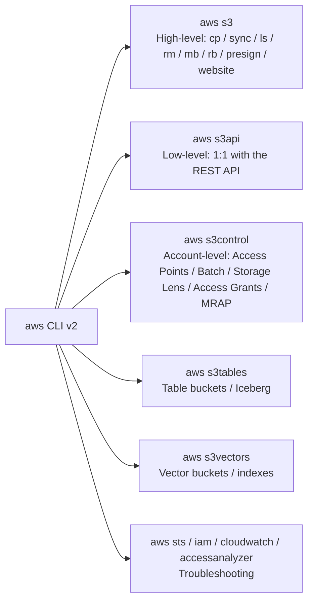
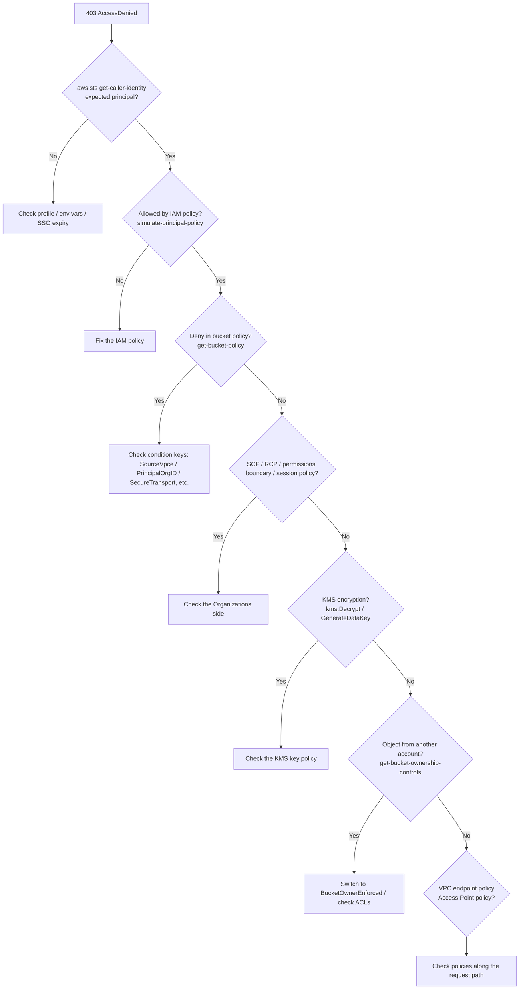

# S3 command reference (CLI / SDK / IaC / third-party)

_Last verified: 2026-10-03_

This chapter is a "dictionary for getting your hands dirty." AWS CLI v2 flag names were checked against the local `aws <service> <command> help` (this book's test environment is **aws-cli/2.37.7**). Following AWS documentation conventions, the bucket name is `amzn-s3-demo-bucket` and the account ID is `111122223333`.

> Destructive commands (deletes, overwrites, policy changes) are marked **[Danger]** in the heading or text. Make it a habit to use `--dryrun`, `--generate-cli-skeleton`, or a separate account for testing before you run them.

## 0. Instead of a table of contents: the command landscape



| Namespace | When to use it |
| --- | --- |
| `aws s3` | Covers 90% of file transfers. Handles multipart, parallelism, and recursion automatically |
| `aws s3api` | Calls the API 1:1. Configuration changes, metadata, versions, conditional writes, and so on |
| `aws s3control` | Resources attached to the **account** rather than a bucket (`--account-id` required) |
| `aws s3tables` | S3 Tables (table buckets, namespaces, tables, maintenance) |
| `aws s3vectors` | S3 Vectors (vector buckets, indexes, vector PUT / query) |

## 1. Setup

### 1.1 Install and verify

```bash
# macOS
brew install awscli
# Linux (x86_64)
curl "https://awscli.amazonaws.com/awscli-exe-linux-x86_64.zip" -o awscliv2.zip
unzip awscliv2.zip && sudo ./aws/install

aws --version
# aws-cli/2.37.7 Python/3.14.8 Darwin/25.4.0 source/arm64
```

### 1.2 Access keys (not recommended, but the basics)

```bash
aws configure
# AWS Access Key ID [None]: AKIA...
# AWS Secret Access Key [None]: ...
# Default region name [None]: ap-northeast-1
# Default output format [None]: json
```

These are written to `~/.aws/credentials` and `~/.aws/config`. Long-term access keys carry a high leak risk, so use SSO for humans and IAM roles for machines.

### 1.3 IAM Identity Center (SSO) profile

```bash
aws configure sso
# SSO session name: my-sso
# SSO start URL: https://my-org.awsapps.com/start
# SSO region: ap-northeast-1
# (authorize in the browser -> choose an account and role)
# CLI profile name: dev-admin

aws sso login --profile dev-admin
aws s3 ls --profile dev-admin
```

The generated `~/.aws/config`:

```text
[profile dev-admin]
sso_session = my-sso
sso_account_id = 111122223333
sso_role_name = AdministratorAccess
region = ap-northeast-1
output = json

[sso-session my-sso]
sso_start_url = https://my-org.awsapps.com/start
sso_region = ap-northeast-1
sso_registration_scopes = sso:account:access
```

### 1.4 AssumeRole profile

```text
[profile prod-readonly]
role_arn = arn:aws:iam::444455556666:role/ReadOnly
source_profile = dev-admin
region = ap-northeast-1
duration_seconds = 3600
```

### 1.5 Environment variables

| Variable | Meaning |
| --- | --- |
| `AWS_PROFILE` | Profile to use |
| `AWS_REGION` / `AWS_DEFAULT_REGION` | Region (SDKs read `AWS_REGION`; the CLI reads both) |
| `AWS_ACCESS_KEY_ID` / `AWS_SECRET_ACCESS_KEY` / `AWS_SESSION_TOKEN` | Temporary credentials specified directly |
| `AWS_ENDPOINT_URL_S3` | Overrides the endpoint for S3 only (MinIO, LocalStack, etc.) |
| `AWS_CA_BUNDLE` | CA for a corporate proxy |
| `AWS_RETRY_MODE` / `AWS_MAX_ATTEMPTS` | Retries (`standard` / `adaptive`) |
| `AWS_PAGER` | Set to `""` to disable the pager (less) |
| `AWS_CLI_AUTO_PROMPT` | `on-partial` enables interactive completion |

```bash
export AWS_PROFILE=dev-admin
export AWS_REGION=ap-northeast-1
export AWS_PAGER=""
aws sts get-caller-identity
```

### 1.6 Tuning CLI S3 transfers

```bash
aws configure set default.s3.max_concurrent_requests 64
aws configure set default.s3.max_queue_size 10000
aws configure set default.s3.multipart_threshold 64MB
aws configure set default.s3.multipart_chunksize 16MB
aws configure set default.s3.max_bandwidth 500MB/s          # classic only
aws configure set default.s3.preferred_transfer_client crt  # auto | classic | crt
aws configure set default.s3.target_bandwidth 25Gb/s        # crt only
aws configure set default.s3.use_accelerate_endpoint true
aws configure set default.s3.addressing_style virtual
```

What it looks like in `~/.aws/config`:

```text
[default]
region = ap-northeast-1
s3 =
  max_concurrent_requests = 64
  multipart_threshold = 64MB
  multipart_chunksize = 16MB
  preferred_transfer_client = crt
  target_bandwidth = 25Gb/s
```

| Key | Default | Client | Description |
| --- | --- | --- | --- |
| `max_concurrent_requests` | 10 | classic | Number of concurrent requests |
| `max_queue_size` | 1000 | classic | Task queue length |
| `multipart_threshold` | 8MB | both | Multipart is used at or above this size |
| `multipart_chunksize` | 8MB | both | Part size (adjusted automatically if it would exceed 10,000 parts) |
| `max_bandwidth` | none | classic | Bandwidth cap |
| `preferred_transfer_client` | auto | — | `auto` / `classic` / `crt` |
| `target_bandwidth` | auto-detected | crt | Target bandwidth |
| `use_accelerate_endpoint` | false | both | Transfer Acceleration |
| `disable_s3_express_session_auth` | false | — | Set directly under the profile (not under the s3 key) |

## 2. `aws s3` high-level commands

### 2.1 ls

```bash
aws s3 ls                                     # list buckets
aws s3 ls --bucket-name-prefix logs-          # filter by name
aws s3 ls --bucket-region us-east-1           # filter by region
aws s3 ls s3://amzn-s3-demo-bucket/           # one level (PRE = common prefix)
aws s3 ls s3://amzn-s3-demo-bucket/logs/ --recursive --human-readable --summarize
```

### 2.2 cp

```bash
# Upload / download
aws s3 cp ./report.pdf s3://amzn-s3-demo-bucket/docs/report.pdf
aws s3 cp s3://amzn-s3-demo-bucket/docs/report.pdf ./report.pdf

# Whole directory
aws s3 cp ./site s3://amzn-s3-demo-bucket/site/ --recursive

# S3 -> S3 (server-side copy; use --source-region across regions)
aws s3 cp s3://src-bucket/a.bin s3://amzn-s3-demo-bucket/a.bin --source-region us-west-2

# stdin / stdout
tar czf - ./data | aws s3 cp - s3://amzn-s3-demo-bucket/backup/data.tgz --expected-size 53687091200
aws s3 cp s3://amzn-s3-demo-bucket/logs/app.log - | grep ERROR

# Storage class, encryption, metadata
aws s3 cp big.iso s3://amzn-s3-demo-bucket/iso/ \
  --storage-class INTELLIGENT_TIERING \
  --sse aws:kms --sse-kms-key-id arn:aws:kms:ap-northeast-1:111122223333:key/1234abcd-12ab-34cd-56ef-1234567890ab \
  --metadata project=atlas,owner=kt \
  --content-type application/octet-stream \
  --checksum-algorithm CRC64NVME

# Do not overwrite existing files
aws s3 cp ./data s3://amzn-s3-demo-bucket/data/ --recursive --no-overwrite

# Only show what would happen
aws s3 cp ./data s3://amzn-s3-demo-bucket/data/ --recursive --dryrun
```

`--expected-size` tells the CLI the size of a huge stream from stdin so that the part count does not exceed 10,000.

### 2.3 mv

```bash
aws s3 mv s3://amzn-s3-demo-bucket/tmp/a.csv s3://amzn-s3-demo-bucket/archive/a.csv
aws s3 mv ./outbox s3://amzn-s3-demo-bucket/inbox/ --recursive
```

S3 has no rename. `mv` means "copy, then delete the source." For large objects or many objects, this costs time and money (in Express One Zone, `rename-object` is atomic).

### 2.4 rm [Danger]

```bash
aws s3 rm s3://amzn-s3-demo-bucket/tmp/a.csv
aws s3 rm s3://amzn-s3-demo-bucket/tmp/ --recursive --dryrun   # check first
aws s3 rm s3://amzn-s3-demo-bucket/tmp/ --recursive
aws s3 rm s3://amzn-s3-demo-bucket/ --recursive --exclude "*" --include "*.tmp"
```

In a versioning-enabled bucket, `rm` only places a **delete marker**; older versions remain (see deleting all versions, below).

### 2.5 sync

```bash
# Local -> S3 (new and updated files only)
aws s3 sync ./site s3://amzn-s3-demo-bucket/site/

# [Danger] Delete files that exist only at the destination (mirror)
aws s3 sync ./site s3://amzn-s3-demo-bucket/site/ --delete --dryrun
aws s3 sync ./site s3://amzn-s3-demo-bucket/site/ --delete

# Filters (later ones take precedence)
aws s3 sync ./logs s3://amzn-s3-demo-bucket/logs/ --exclude "*" --include "*.gz"
aws s3 sync . s3://amzn-s3-demo-bucket/repo/ --exclude ".git/*" --exclude "node_modules/*"

# Compare by size only (ignore timestamps)
aws s3 sync s3://amzn-s3-demo-bucket/data ./data --size-only

# S3 -> local: re-download same-size files whose timestamps do not match exactly
aws s3 sync s3://amzn-s3-demo-bucket/data ./data --exact-timestamps

# Between buckets
aws s3 sync s3://src-bucket/prefix s3://amzn-s3-demo-bucket/prefix --source-region us-west-2
```

How sync compares files:

| Condition | Default behavior |
| --- | --- |
| Does not exist at the destination | Transfer |
| Size differs | Transfer |
| Same size, source modified time is newer | Transfer |
| Same size, modified time is the same or older | Skip |
| `--size-only` | Decide by size only |
| `--exact-timestamps` (S3 -> local) | Transfer same-size files unless timestamps match exactly |
| `--delete` | Delete from the destination anything not in the source |

`--exclude` / `--include` are **evaluated in order, and later filters take precedence**. `--exclude "*" --include "*.gz"` means "exclude everything, then add back only .gz." Paths are evaluated relative to the source directory.

### 2.6 mb / rb

```bash
aws s3 mb s3://amzn-s3-demo-bucket --region ap-northeast-1
aws s3 mb s3://amzn-s3-demo-bucket --tags env dev --tags team data   # repeat --tags <key> <value>

# [Danger] Delete if empty
aws s3 rb s3://amzn-s3-demo-bucket
# [Danger] Delete with contents (fails with versioning enabled because old versions remain)
aws s3 rb s3://amzn-s3-demo-bucket --force
```

### 2.7 presign

```bash
# Presigned URL for GET (default 3600 seconds, max 604800 seconds = 7 days)
aws s3 presign s3://amzn-s3-demo-bucket/docs/report.pdf --expires-in 900
```

`aws s3 presign` is GET-only. Generate upload URLs with an SDK (see below). If the credentials used to sign expire first, the URL stops working too (temporary SSO / role credentials last at most until the session expires).

### 2.8 website

```bash
aws s3 website s3://amzn-s3-demo-bucket/ --index-document index.html --error-document error.html
```

The static website hosting endpoint is HTTP only. To combine HTTPS with a private bucket, use CloudFront + OAC.

## 3. `aws s3api` — buckets

### 3.1 create-bucket

```bash
# In us-east-1, omit LocationConstraint (including it causes an error)
aws s3api create-bucket --bucket amzn-s3-demo-bucket --region us-east-1

# Everywhere else, LocationConstraint is required
aws s3api create-bucket --bucket amzn-s3-demo-bucket --region ap-northeast-1 \
  --create-bucket-configuration LocationConstraint=ap-northeast-1

# Create with Object Lock (it can also be enabled later on an existing versioning-enabled bucket)
aws s3api create-bucket --bucket amzn-s3-demo-worm --region ap-northeast-1 \
  --create-bucket-configuration LocationConstraint=ap-northeast-1 \
  --object-lock-enabled-for-bucket

# Account regional namespace (2026-03 onward). Names are <prefix>-<accountId>-<region>-an
aws s3api create-bucket --bucket logs-111122223333-ap-northeast-1-an \
  --region ap-northeast-1 \
  --create-bucket-configuration LocationConstraint=ap-northeast-1 \
  --bucket-namespace account-regional
```

### 3.2 Getting information

```bash
aws s3api list-buckets --query 'Buckets[].[Name,CreationDate]' --output table
aws s3api get-bucket-location --bucket amzn-s3-demo-bucket    # null for us-east-1
aws s3api head-bucket --bucket amzn-s3-demo-bucket            # existence / permission check (also returns BucketRegion)
aws s3api get-bucket-versioning --bucket amzn-s3-demo-bucket
aws s3api get-bucket-encryption --bucket amzn-s3-demo-bucket
aws s3api get-bucket-ownership-controls --bucket amzn-s3-demo-bucket
aws s3api get-public-access-block --bucket amzn-s3-demo-bucket
aws s3api get-bucket-policy --bucket amzn-s3-demo-bucket --query Policy --output text | jq .
aws s3api get-bucket-policy-status --bucket amzn-s3-demo-bucket
```

### 3.3 Block Public Access and ownership

```bash
aws s3api put-public-access-block --bucket amzn-s3-demo-bucket \
  --public-access-block-configuration \
  BlockPublicAcls=true,IgnorePublicAcls=true,BlockPublicPolicy=true,RestrictPublicBuckets=true

# Whole account (s3control)
aws s3control put-public-access-block --account-id 111122223333 \
  --public-access-block-configuration \
  BlockPublicAcls=true,IgnorePublicAcls=true,BlockPublicPolicy=true,RestrictPublicBuckets=true

# Disable ACLs (the bucket owner owns all objects)
aws s3api put-bucket-ownership-controls --bucket amzn-s3-demo-bucket \
  --ownership-controls 'Rules=[{ObjectOwnership=BucketOwnerEnforced}]'
```

### 3.4 Default encryption

```bash
# SSE-KMS + Bucket Key
aws s3api put-bucket-encryption --bucket amzn-s3-demo-bucket \
  --server-side-encryption-configuration '{
    "Rules": [{
      "ApplyServerSideEncryptionByDefault": {
        "SSEAlgorithm": "aws:kms",
        "KMSMasterKeyID": "arn:aws:kms:ap-northeast-1:111122223333:key/1234abcd-12ab-34cd-56ef-1234567890ab"
      },
      "BucketKeyEnabled": true
    }]
  }'

# Change an existing object's encryption without moving data (UpdateObjectEncryption)
aws s3api update-object-encryption --bucket amzn-s3-demo-bucket --key data/a.parquet \
  --object-encryption '{"SSEKMS":{"KMSKeyArn":"arn:aws:kms:ap-northeast-1:111122223333:key/1234abcd-12ab-34cd-56ef-1234567890ab","BucketKeyEnabled":true}}'
```

### 3.5 Bucket policy [Danger: you can lock yourself out]

```bash
cat > policy.json <<'EOF'
{
  "Version": "2012-10-17",
  "Statement": [
    {
      "Sid": "DenyInsecureTransport",
      "Effect": "Deny",
      "Principal": "*",
      "Action": "s3:*",
      "Resource": [
        "arn:aws:s3:::amzn-s3-demo-bucket",
        "arn:aws:s3:::amzn-s3-demo-bucket/*"
      ],
      "Condition": { "Bool": { "aws:SecureTransport": "false" } }
    },
    {
      "Sid": "DenyOutsideOrg",
      "Effect": "Deny",
      "Principal": "*",
      "Action": "s3:*",
      "Resource": [
        "arn:aws:s3:::amzn-s3-demo-bucket",
        "arn:aws:s3:::amzn-s3-demo-bucket/*"
      ],
      "Condition": { "StringNotEquals": { "aws:PrincipalOrgID": "o-exampleorgid" } }
    }
  ]
}
EOF
aws s3api put-bucket-policy --bucket amzn-s3-demo-bucket --policy file://policy.json
aws s3api delete-bucket-policy --bucket amzn-s3-demo-bucket
```

If a `Principal: "*"` Deny locks out everyone including the root user, the only recovery is to run `delete-bucket-policy` as the root user.

### 3.6 ABAC (tag-based access control)

```bash
aws s3api put-bucket-abac --bucket amzn-s3-demo-bucket --abac-status Status=Enabled
aws s3api get-bucket-abac --bucket amzn-s3-demo-bucket
```

### 3.7 CORS

```bash
aws s3api put-bucket-cors --bucket amzn-s3-demo-bucket --cors-configuration '{
  "CORSRules": [{
    "AllowedOrigins": ["https://app.example.com"],
    "AllowedMethods": ["GET", "PUT", "POST"],
    "AllowedHeaders": ["*"],
    "ExposeHeaders": ["ETag", "x-amz-request-id"],
    "MaxAgeSeconds": 3000
  }]
}'
aws s3api get-bucket-cors --bucket amzn-s3-demo-bucket
```

If the browser PUTs via presigned URLs, including `ETag` in `ExposeHeaders` lets the frontend complete multipart uploads.

### 3.8 Logging and tags

```bash
aws s3api put-bucket-logging --bucket amzn-s3-demo-bucket --bucket-logging-status '{
  "LoggingEnabled": {
    "TargetBucket": "amzn-s3-demo-logs",
    "TargetPrefix": "s3-access/amzn-s3-demo-bucket/",
    "TargetObjectKeyFormat": { "PartitionedPrefix": { "PartitionDateSource": "EventTime" } }
  }
}'

aws s3api put-bucket-tagging --bucket amzn-s3-demo-bucket \
  --tagging 'TagSet=[{Key=env,Value=prod},{Key=team,Value=data}]'
```

## 4. `aws s3api` — objects

### 4.1 put-object / get-object / head-object

```bash
aws s3api put-object --bucket amzn-s3-demo-bucket --key docs/a.txt --body a.txt \
  --content-type text/plain --metadata owner=kt \
  --checksum-algorithm CRC64NVME

aws s3api get-object --bucket amzn-s3-demo-bucket --key docs/a.txt a.txt
aws s3api get-object --bucket amzn-s3-demo-bucket --key big.bin --range bytes=0-1048575 head.bin
aws s3api get-object --bucket amzn-s3-demo-bucket --key big.bin --part-number 2 part2.bin
aws s3api get-object --bucket amzn-s3-demo-bucket --key docs/a.txt --checksum-mode ENABLED a.txt

aws s3api head-object --bucket amzn-s3-demo-bucket --key docs/a.txt
aws s3api head-object --bucket amzn-s3-demo-bucket --key docs/a.txt --checksum-mode ENABLED \
  --query '{Size:ContentLength,ETag:ETag,CRC64:ChecksumCRC64NVME,Class:StorageClass}'

aws s3api get-object-attributes --bucket amzn-s3-demo-bucket --key big.bin \
  --object-attributes ETag Checksum ObjectParts StorageClass ObjectSize
```

Checksum flags (`put-object` / `upload-part`, CLI 2.37.7): `--checksum-algorithm`, `--checksum-crc32`, `--checksum-crc32-c`, `--checksum-crc64-nvme`, `--checksum-sha1`, `--checksum-sha256`, `--checksum-sha512`, `--checksum-md5`, `--checksum-xxhash3`, `--checksum-xxhash64`, `--checksum-xxhash128`. Values are base64.

### 4.2 Conditional writes

```bash
# Create-only (412 if it already exists)
aws s3api put-object --bucket amzn-s3-demo-bucket --key locks/leader --body me.json --if-none-match '*'

# Optimistic locking (update if the ETag matches, 412 otherwise)
ETAG=$(aws s3api head-object --bucket amzn-s3-demo-bucket --key state.json --query ETag --output text)
aws s3api put-object --bucket amzn-s3-demo-bucket --key state.json --body state.json --if-match "$ETAG"

# Conditional delete (only when the ETag matches)
aws s3api delete-object --bucket amzn-s3-demo-bucket --key state.json --if-match "$ETAG"

# Conditional copy
aws s3api copy-object --bucket amzn-s3-demo-bucket --key dst.json \
  --copy-source amzn-s3-demo-bucket/src.json --if-none-match '*'
```

### 4.3 copy-object and metadata

```bash
# Copy while replacing metadata (copy onto itself to update metadata)
aws s3api copy-object --bucket amzn-s3-demo-bucket --key docs/a.txt \
  --copy-source amzn-s3-demo-bucket/docs/a.txt \
  --metadata-directive REPLACE --content-type "text/plain; charset=utf-8" \
  --metadata owner=team-a --cache-control "max-age=3600"

# Change the storage class (up to 5 GB; beyond that use aws s3 cp / multipart copy)
aws s3api copy-object --bucket amzn-s3-demo-bucket --key old.bin \
  --copy-source amzn-s3-demo-bucket/old.bin --storage-class STANDARD_IA

# Replace tags too
aws s3api copy-object --bucket amzn-s3-demo-bucket --key a.txt \
  --copy-source amzn-s3-demo-bucket/a.txt \
  --tagging-directive REPLACE --tagging "class=public"
```

`--metadata-directive`: `COPY` (default, keeps the original metadata) / `REPLACE` (replaces it with what you specify).

### 4.4 list-objects-v2 and JMESPath

```bash
# List (the CLI paginates automatically and fetches everything)
aws s3api list-objects-v2 --bucket amzn-s3-demo-bucket --prefix logs/2026/10/ \
  --query 'Contents[].[Key,Size,LastModified]' --output table

# One level only (common prefixes)
aws s3api list-objects-v2 --bucket amzn-s3-demo-bucket --prefix logs/ --delimiter / \
  --query 'CommonPrefixes[].Prefix' --output text

# Manual pagination
aws s3api list-objects-v2 --bucket amzn-s3-demo-bucket --max-items 1000 --page-size 1000
# Pass the NextToken from the output to the next call
aws s3api list-objects-v2 --bucket amzn-s3-demo-bucket --max-items 1000 --starting-token eyJDb250aW51YXRpb25Ub2tlbiI6IG51bGx9

# Top 10 largest objects
aws s3api list-objects-v2 --bucket amzn-s3-demo-bucket \
  --query 'reverse(sort_by(Contents, &Size))[:10].[Key,Size]' --output table

# Total size and object count for a prefix
aws s3api list-objects-v2 --bucket amzn-s3-demo-bucket --prefix logs/ \
  --query '{bytes: sum(Contents[].Size), count: length(Contents[])}'

# Modified on or after a given date
aws s3api list-objects-v2 --bucket amzn-s3-demo-bucket \
  --query "Contents[?LastModified>='2026-10-01'].Key" --output text

# Count per storage class (aggregated with jq)
aws s3api list-objects-v2 --bucket amzn-s3-demo-bucket --output json \
  | jq -r '.Contents | group_by(.StorageClass) | map("\(.[0].StorageClass)\t\(length)") | .[]'

# Only the .tmp extension
aws s3api list-objects-v2 --bucket amzn-s3-demo-bucket \
  --query "Contents[?ends_with(Key, '.tmp')].Key" --output text
```

JMESPath cheat sheet:

| Expression | Meaning |
| --- | --- |
| `Contents[].Key` | Key from each element of the array |
| ``Contents[?Size > `1048576`]`` | Filter (wrap numeric literals in backticks) |
| `sort_by(Contents, &Size)` | Sort |
| `reverse(...)[:10]` | Top 10 in descending order |
| `sum(Contents[].Size)` | Sum |
| `length(Contents[])` | Count |
| `{a: x, b: y}` | Reshape |
| `starts_with(Key, 'logs/')` / `ends_with(Key, '.gz')` / `contains(Key, 'tmp')` | String functions |

Note: scanning millions of objects with `list-objects-v2` is slow and expensive (one LIST per 1,000 objects). For regular inventories, use **S3 Inventory** or the **S3 Metadata live inventory table**.

### 4.5 Bulk delete with delete-objects [Danger]

```bash
cat > delete.json <<'EOF'
{
  "Objects": [
    { "Key": "tmp/a.txt" },
    { "Key": "tmp/b.txt", "VersionId": "3HL4kqtJlcpXroDTDmJ.rmSpXd3dIbrHY" }
  ],
  "Quiet": true
}
EOF
aws s3api delete-objects --bucket amzn-s3-demo-bucket --delete file://delete.json
```

Up to 1,000 keys per request.

### 4.6 Tags

```bash
aws s3api put-object-tagging --bucket amzn-s3-demo-bucket --key a.txt \
  --tagging 'TagSet=[{Key=class,Value=confidential}]'
aws s3api get-object-tagging --bucket amzn-s3-demo-bucket --key a.txt
aws s3api delete-object-tagging --bucket amzn-s3-demo-bucket --key a.txt
```

## 5. Running a multipart upload by hand

```bash
B=amzn-s3-demo-bucket; K=big.bin
split -b 100M big.bin part-       # part-aa, part-ab, ...

UPLOAD_ID=$(aws s3api create-multipart-upload --bucket $B --key $K \
  --checksum-algorithm CRC32C --query UploadId --output text)

n=1; echo '{"Parts":[' > parts.json
for f in part-*; do
  out=$(aws s3api upload-part --bucket $B --key $K --upload-id "$UPLOAD_ID" \
        --part-number $n --body "$f" --checksum-algorithm CRC32C \
        --query '{ETag:ETag,ChecksumCRC32C:ChecksumCRC32C}' --output json)
  [ $n -gt 1 ] && echo ',' >> parts.json
  echo "$out" | jq --argjson n $n '. + {PartNumber:$n}' >> parts.json
  n=$((n+1))
done
echo ']}' >> parts.json

aws s3api list-parts --bucket $B --key $K --upload-id "$UPLOAD_ID" \
  --query 'Parts[].[PartNumber,Size]' --output table

aws s3api complete-multipart-upload --bucket $B --key $K --upload-id "$UPLOAD_ID" \
  --multipart-upload file://parts.json
```

```bash
# List incomplete uploads
aws s3api list-multipart-uploads --bucket amzn-s3-demo-bucket \
  --query 'Uploads[].[Key,UploadId,Initiated]' --output table

# [Danger] Abort (uploaded parts are deleted)
aws s3api abort-multipart-upload --bucket amzn-s3-demo-bucket --key big.bin --upload-id "$UPLOAD_ID"

# [Danger] Abort all
aws s3api list-multipart-uploads --bucket amzn-s3-demo-bucket \
  --query 'Uploads[].[Key,UploadId]' --output text |
while read -r key id; do
  aws s3api abort-multipart-upload --bucket amzn-s3-demo-bucket --key "$key" --upload-id "$id"
done
```

To copy objects larger than 5 GB, copy part by part with `upload-part-copy` (`--copy-source`, `--copy-source-range bytes=0-...`). `aws s3 cp` does this for you automatically.

## 6. Versioning

```bash
aws s3api put-bucket-versioning --bucket amzn-s3-demo-bucket \
  --versioning-configuration Status=Enabled
# Suspend (versioning cannot be disabled, only Suspended)
aws s3api put-bucket-versioning --bucket amzn-s3-demo-bucket \
  --versioning-configuration Status=Suspended

aws s3api list-object-versions --bucket amzn-s3-demo-bucket --prefix docs/a.txt \
  --query '{V: Versions[].[VersionId,IsLatest,LastModified,Size], D: DeleteMarkers[].[VersionId,IsLatest]}'

# Get a specific version
aws s3api get-object --bucket amzn-s3-demo-bucket --key docs/a.txt \
  --version-id 3HL4kqtJlcpXroDTDmJ.rmSpXd3dIbrHY a.old.txt

# Undo a "delete" = remove the latest delete marker
MARKER=$(aws s3api list-object-versions --bucket amzn-s3-demo-bucket --prefix docs/a.txt \
  --query 'DeleteMarkers[?IsLatest].VersionId' --output text)
aws s3api delete-object --bucket amzn-s3-demo-bucket --key docs/a.txt --version-id "$MARKER"

# Restore an old version as the latest = copy the old version onto itself
aws s3api copy-object --bucket amzn-s3-demo-bucket --key docs/a.txt \
  --copy-source "amzn-s3-demo-bucket/docs/a.txt?versionId=3HL4kqtJlcpXroDTDmJ.rmSpXd3dIbrHY"
```

MFA Delete is enabled with the root user's MFA as `put-bucket-versioning --mfa "arn:aws:iam::111122223333:mfa/root-account-mfa-device 123456" --versioning-configuration Status=Enabled,MFADelete=Enabled` (CLI only).

### 6.1 Script to empty a bucket including all versions [Danger]

```bash
#!/usr/bin/env bash
# usage: ./empty-bucket.sh amzn-s3-demo-bucket
set -euo pipefail
B="$1"
read -r -p "Delete ALL versions in s3://$B ? type the bucket name: " ans
[ "$ans" = "$B" ] || { echo "aborted"; exit 1; }

while :; do
  batch=$(aws s3api list-object-versions --bucket "$B" --max-items 500 --output json \
    --query '{Objects: [Versions, DeleteMarkers][].{Key: Key, VersionId: VersionId}}')
  count=$(echo "$batch" | jq '.Objects | length')
  [ "$count" -eq 0 ] && break
  echo "$batch" | jq '. + {Quiet: true}' > "$TMPDIR/del.json"
  aws s3api delete-objects --bucket "$B" --delete "file://$TMPDIR/del.json" > /dev/null
  echo "deleted $count"
done
echo "done. now: aws s3 rb s3://$B"
```

`--max-items 500` is used because Versions and DeleteMarkers each return up to 500, so the total stays within the delete-objects limit of 1,000. With tens of millions of objects, leaving it to lifecycle rules (expiration + noncurrent version expiration + delete marker cleanup) is cheaper and faster.

Python version (the boto3 resource API batches internally):

```python
import boto3
boto3.resource("s3").Bucket("amzn-s3-demo-bucket").object_versions.delete()
```

## 7. Lifecycle

```bash
cat > lifecycle.json <<'EOF'
{
  "Rules": [
    {
      "ID": "logs-tiering",
      "Filter": { "Prefix": "logs/" },
      "Status": "Enabled",
      "Transitions": [
        { "Days": 30, "StorageClass": "STANDARD_IA" },
        { "Days": 90, "StorageClass": "GLACIER_IR" },
        { "Days": 365, "StorageClass": "DEEP_ARCHIVE" }
      ],
      "Expiration": { "Days": 2555 }
    },
    {
      "ID": "noncurrent-cleanup",
      "Filter": {},
      "Status": "Enabled",
      "NoncurrentVersionTransitions": [
        { "NoncurrentDays": 30, "StorageClass": "GLACIER_IR" }
      ],
      "NoncurrentVersionExpiration": { "NoncurrentDays": 90, "NewerNoncurrentVersions": 3 },
      "Expiration": { "ExpiredObjectDeleteMarker": true }
    },
    {
      "ID": "abort-mpu",
      "Filter": {},
      "Status": "Enabled",
      "AbortIncompleteMultipartUpload": { "DaysAfterInitiation": 7 }
    },
    {
      "ID": "tmp-small",
      "Filter": { "And": { "Prefix": "tmp/", "ObjectSizeLessThan": 131072 } },
      "Status": "Enabled",
      "Expiration": { "Days": 1 }
    }
  ]
}
EOF
aws s3api put-bucket-lifecycle-configuration --bucket amzn-s3-demo-bucket \
  --lifecycle-configuration file://lifecycle.json
aws s3api get-bucket-lifecycle-configuration --bucket amzn-s3-demo-bucket
# [Danger] Delete all rules
aws s3api delete-bucket-lifecycle --bucket amzn-s3-demo-bucket
```

`put-bucket-lifecycle-configuration` **replaces everything**. To add to existing rules, get → edit → put. Since 2026-07, transitions to Standard-IA / One Zone-IA can be configured to happen right after creation instead of waiting 30 days.

## 8. Restoring from Glacier

```bash
# Create a temporary copy for 7 days from Glacier Flexible Retrieval / Deep Archive
aws s3api restore-object --bucket amzn-s3-demo-bucket --key archive/2019.tar \
  --restore-request '{"Days":7,"GlacierJobParameters":{"Tier":"Standard"}}'
# Tier: Expedited (Flexible only, 1-5 minutes) / Standard / Bulk

# Restore status
aws s3api head-object --bucket amzn-s3-demo-bucket --key archive/2019.tar --query Restore
# "ongoing-request=\"true\""  -> in progress
# "ongoing-request=\"false\", expiry-date=\"...\"" -> done

# To move it back to Standard permanently, copy after restoring
aws s3 cp s3://amzn-s3-demo-bucket/archive/2019.tar s3://amzn-s3-demo-bucket/archive/2019.tar \
  --storage-class STANDARD --force-glacier-transfer

# Request restores for an entire prefix
aws s3api list-objects-v2 --bucket amzn-s3-demo-bucket --prefix archive/ \
  --query "Contents[?StorageClass=='DEEP_ARCHIVE'].Key" --output text | tr '\t' '\n' |
while read -r k; do
  aws s3api restore-object --bucket amzn-s3-demo-bucket --key "$k" \
    --restore-request '{"Days":3,"GlacierJobParameters":{"Tier":"Bulk"}}'
done
```

| Class | Expedited | Standard | Bulk |
| --- | --- | --- | --- |
| Glacier Flexible Retrieval | 1-5 minutes | 3-5 hours | 5-12 hours |
| Glacier Deep Archive | not available | within 12 hours | within 48 hours |
| Glacier Instant Retrieval | no restore needed (GET in milliseconds) | — | — |

For large volumes, use S3 Batch Operations `S3InitiateRestoreObject`.

## 9. Replication

```bash
# Prerequisites: versioning enabled on both source and destination, and an IAM role
cat > replication.json <<'EOF'
{
  "Role": "arn:aws:iam::111122223333:role/s3-replication-role",
  "Rules": [
    {
      "ID": "all-to-dr",
      "Priority": 1,
      "Status": "Enabled",
      "Filter": {},
      "DeleteMarkerReplication": { "Status": "Enabled" },
      "Destination": {
        "Bucket": "arn:aws:s3:::amzn-s3-demo-dr",
        "StorageClass": "STANDARD_IA",
        "ReplicationTime": { "Status": "Enabled", "Time": { "Minutes": 15 } },
        "Metrics": { "Status": "Enabled", "EventThreshold": { "Minutes": 15 } }
      }
    }
  ]
}
EOF
aws s3api put-bucket-replication --bucket amzn-s3-demo-bucket \
  --replication-configuration file://replication.json
aws s3api get-bucket-replication --bucket amzn-s3-demo-bucket

# Per-object status (PENDING / COMPLETED / FAILED / REPLICA)
aws s3api head-object --bucket amzn-s3-demo-bucket --key a.txt --query ReplicationStatus
```

Existing objects are not replicated automatically. Backfill them with S3 Batch Replication (Batch Operations `S3ReplicateObject`).

## 10. Object Lock

```bash
# Default retention (bucket created with Object Lock enabled, or an existing versioning-enabled bucket)
aws s3api put-object-lock-configuration --bucket amzn-s3-demo-worm \
  --object-lock-configuration '{
    "ObjectLockEnabled": "Enabled",
    "Rule": { "DefaultRetention": { "Mode": "GOVERNANCE", "Days": 30 } }
  }'

# Per-object retention [Danger: nobody can shorten or delete COMPLIANCE]
aws s3api put-object-retention --bucket amzn-s3-demo-worm --key ledger/2026-10.csv \
  --retention '{"Mode":"COMPLIANCE","RetainUntilDate":"2033-10-01T00:00:00Z"}'

aws s3api put-object-legal-hold --bucket amzn-s3-demo-worm --key ledger/2026-10.csv \
  --legal-hold Status=ON
aws s3api get-object-retention --bucket amzn-s3-demo-worm --key ledger/2026-10.csv

# Override GOVERNANCE and delete with the permission (s3:BypassGovernanceRetention)
aws s3api delete-object --bucket amzn-s3-demo-worm --key tmp.csv \
  --version-id "$VID" --bypass-governance-retention
```

## 11. Event notifications

```bash
aws s3api put-bucket-notification-configuration --bucket amzn-s3-demo-bucket \
  --notification-configuration '{
    "QueueConfigurations": [{
      "Id": "csv-to-sqs",
      "QueueArn": "arn:aws:sqs:ap-northeast-1:111122223333:ingest",
      "Events": ["s3:ObjectCreated:*"],
      "Filter": { "Key": { "FilterRules": [
        { "Name": "prefix", "Value": "incoming/" },
        { "Name": "suffix", "Value": ".csv" }
      ] } }
    }],
    "LambdaFunctionConfigurations": [{
      "LambdaFunctionArn": "arn:aws:lambda:ap-northeast-1:111122223333:function:thumb",
      "Events": ["s3:ObjectCreated:Put"],
      "Filter": { "Key": { "FilterRules": [{ "Name": "suffix", "Value": ".jpg" }] } }
    }],
    "EventBridgeConfiguration": {}
  }'
aws s3api get-bucket-notification-configuration --bucket amzn-s3-demo-bucket
```

This **replaces everything**, so if you do not want to lose the existing configuration, get it first and merge. The PUT fails unless the resource policy on the SQS / SNS / Lambda side grants permission to `s3.amazonaws.com`. `EventBridgeConfiguration: {}` sends all events to EventBridge.

## 12. Transfer Acceleration / Requester Pays

```bash
aws s3api put-bucket-accelerate-configuration --bucket amzn-s3-demo-bucket \
  --accelerate-configuration Status=Enabled
aws s3 cp big.bin s3://amzn-s3-demo-bucket/ --endpoint-url https://s3-accelerate.amazonaws.com

aws s3api put-bucket-request-payment --bucket amzn-s3-demo-bucket \
  --request-payment-configuration Payer=Requester
aws s3 cp s3://amzn-s3-demo-bucket/data.csv . --request-payer requester
```

## 13. `aws s3control`

### 13.1 Access Points

```bash
ACCOUNT=111122223333
aws s3control create-access-point --account-id $ACCOUNT --name analytics-ro \
  --bucket amzn-s3-demo-bucket \
  --vpc-configuration VpcId=vpc-0abc1234def567890

aws s3control list-access-points --account-id $ACCOUNT --bucket amzn-s3-demo-bucket

# Access through the access point (use the ARN or alias in place of the bucket)
aws s3api list-objects-v2 \
  --bucket arn:aws:s3:ap-northeast-1:111122223333:accesspoint/analytics-ro --max-items 5
aws s3 ls s3://analytics-ro-abcdefghijklmnopqrstuvwxyz123-s3alias/

aws s3control put-access-point-policy --account-id $ACCOUNT --name analytics-ro \
  --policy file://ap-policy.json
```

### 13.2 Multi-Region Access Points

```bash
aws s3control create-multi-region-access-point --account-id $ACCOUNT --region us-west-2 \
  --details '{
    "Name": "global-assets",
    "Regions": [{ "Bucket": "assets-tokyo" }, { "Bucket": "assets-frankfurt" }]
  }'
aws s3control list-multi-region-access-points --account-id $ACCOUNT --region us-west-2
```

Call the MRAP control plane APIs in us-west-2. Data access requires SigV4A support (many SDKs need CRT for this).

### 13.3 Batch Operations

```bash
# Have S3 generate the manifest automatically and tag everything under a prefix
aws s3control create-job --account-id $ACCOUNT --region ap-northeast-1 \
  --no-confirmation-required --priority 10 \
  --role-arn arn:aws:iam::111122223333:role/s3-batch-role \
  --operation '{"S3PutObjectTagging":{"TagSet":[{"Key":"tier","Value":"cold"}]}}' \
  --manifest-generator '{
    "S3JobManifestGenerator": {
      "SourceBucket": "arn:aws:s3:::amzn-s3-demo-bucket",
      "EnableManifestOutput": false,
      "Filter": {
        "KeyNameConstraint": { "MatchAnyPrefix": ["logs/2024/"] },
        "CreatedBefore": "2025-01-01T00:00:00Z"
      }
    }
  }' \
  --report '{"Bucket":"arn:aws:s3:::amzn-s3-demo-reports","Format":"Report_CSV_20180820","Enabled":true,"Prefix":"batch","ReportScope":"FailedTasksOnly"}'

# Checksum verification job (integrity check of stored data)
#   --operation '{"S3ComputeObjectChecksum":{"ChecksumAlgorithm":"CRC64NVME","ChecksumType":"FULL_OBJECT"}}'
# Bulk Glacier restore
#   --operation '{"S3InitiateRestoreObject":{"ExpirationInDays":7,"GlacierJobTier":"BULK"}}'

aws s3control list-jobs --account-id $ACCOUNT --job-statuses Active Complete Failed
aws s3control describe-job --account-id $ACCOUNT --job-id 00e123a4-c0d8-41f4-a0eb-b46f9ba5b07c
aws s3control update-job-status --account-id $ACCOUNT \
  --job-id 00e123a4-c0d8-41f4-a0eb-b46f9ba5b07c --requested-job-status Cancelled
```

Batch operations available in CLI 2.37.7: `LambdaInvoke`, `S3PutObjectCopy`, `S3PutObjectAcl`, `S3PutObjectTagging`, `S3DeleteObjectTagging`, `S3InitiateRestoreObject`, `S3PutObjectLegalHold`, `S3PutObjectRetention`, `S3ReplicateObject`, `S3ComputeObjectChecksum`, `S3UpdateObjectEncryption`.

### 13.4 Storage Lens

```bash
cat > lens.json <<'EOF'
{
  "Id": "org-dashboard",
  "IsEnabled": true,
  "AccountLevel": {
    "ActivityMetrics": { "IsEnabled": true },
    "BucketLevel": {
      "ActivityMetrics": { "IsEnabled": true },
      "PrefixLevel": { "StorageMetrics": { "IsEnabled": true,
        "SelectionCriteria": { "MaxDepth": 3, "MinStorageBytesPercentage": 1.0, "Delimiter": "/" } } }
    }
  }
}
EOF
aws s3control put-storage-lens-configuration --account-id $ACCOUNT \
  --config-id org-dashboard --storage-lens-configuration file://lens.json
aws s3control list-storage-lens-configurations --account-id $ACCOUNT
```

The configuration keys for the features added in 2025-12 are documented in `put-storage-lens-configuration help` (CLI v2.37.7) and the API reference. Performance metrics are `AccountLevel.AdvancedPerformanceMetrics.IsEnabled` (per bucket: `AccountLevel.BucketLevel.AdvancedPerformanceMetrics.IsEnabled`), and export to S3 Tables is `DataExport.StorageLensTableDestination` (`IsEnabled` plus optional `Encryption`). The expanded prefixes report is configured separately in `ExpandedPrefixesDataExport` (`S3BucketDestination` / `StorageLensTableDestination`).

### 13.5 Access Grants

```bash
aws s3control create-access-grants-instance --account-id $ACCOUNT \
  --identity-center-arn arn:aws:sso:::instance/ssoins-1234567890abcdef

aws s3control create-access-grants-location --account-id $ACCOUNT \
  --location-scope s3:// \
  --iam-role-arn arn:aws:iam::111122223333:role/access-grants-location-role

aws s3control create-access-grant --account-id $ACCOUNT \
  --access-grants-location-id default \
  --access-grants-location-configuration 'S3SubPrefix=amzn-s3-demo-bucket/projects/atlas/*' \
  --grantee GranteeType=IAM,GranteeIdentifier=arn:aws:iam::111122223333:role/analyst \
  --permission READ

# Consumer side: get temporary credentials
aws s3control get-data-access --account-id $ACCOUNT \
  --target 's3://amzn-s3-demo-bucket/projects/atlas/*' --permission READ
```

## 14. Directory buckets (S3 Express One Zone)

```bash
aws s3api create-bucket --bucket amzn-s3-demo-bucket--apne1-az4--x-s3 --region ap-northeast-1 \
  --create-bucket-configuration \
  'Location={Type=AvailabilityZone,Name=apne1-az4},Bucket={DataRedundancy=SingleAvailabilityZone,Type=Directory}'

aws s3api list-directory-buckets --region ap-northeast-1
aws s3 cp ./shard.tar s3://amzn-s3-demo-bucket--apne1-az4--x-s3/train/
aws s3 ls s3://amzn-s3-demo-bucket--apne1-az4--x-s3/train/

# Session (normally created automatically by the CLI / SDK)
aws s3api create-session --bucket amzn-s3-demo-bucket--apne1-az4--x-s3

# Append (use the current size as the offset)
SIZE=$(aws s3api head-object --bucket amzn-s3-demo-bucket--apne1-az4--x-s3 --key logs/app.log \
  --query ContentLength --output text)
aws s3api put-object --bucket amzn-s3-demo-bucket--apne1-az4--x-s3 --key logs/app.log \
  --body more.log --write-offset-bytes "$SIZE"

# Atomic rename
aws s3api rename-object --bucket amzn-s3-demo-bucket--apne1-az4--x-s3 \
  --key logs/app-2026-10-03.log --rename-source logs/app.log
```

AZ IDs (such as `apne1-az4`) map to per-account AZ names (`ap-northeast-1a`) differently in each account. Check with `aws ec2 describe-availability-zones --query 'AvailabilityZones[].[ZoneName,ZoneId]'`.

## 15. `aws s3tables`

```bash
TB=arn:aws:s3tables:us-east-1:111122223333:bucket/analytics

aws s3tables create-table-bucket --name analytics --region us-east-1
aws s3tables list-table-buckets
aws s3tables create-namespace --table-bucket-arn $TB --namespace sales
aws s3tables list-namespaces --table-bucket-arn $TB

aws s3tables create-table --table-bucket-arn $TB --namespace sales --name orders \
  --format ICEBERG \
  --metadata '{"iceberg":{"schema":{"fields":[
    {"name":"order_id","type":"long","required":true},
    {"name":"amount","type":"double"},
    {"name":"ts","type":"timestamp"}]}}}'

aws s3tables list-tables --table-bucket-arn $TB --namespace sales
aws s3tables get-table --table-bucket-arn $TB --namespace sales --name orders
aws s3tables get-table-metadata-location --table-bucket-arn $TB --namespace sales --name orders

# Maintenance
aws s3tables put-table-maintenance-configuration --table-bucket-arn $TB \
  --namespace sales --name orders --type icebergSnapshotManagement \
  --value '{"status":"enabled","settings":{"icebergSnapshotManagement":{"minSnapshotsToKeep":5,"maxSnapshotAgeHours":168}}}'
aws s3tables get-table-maintenance-job-status --table-bucket-arn $TB --namespace sales --name orders

# Storage class
aws s3tables put-table-bucket-storage-class --table-bucket-arn $TB \
  --storage-class-configuration storageClass=INTELLIGENT_TIERING

# Rename
aws s3tables rename-table --table-bucket-arn $TB --namespace sales --name orders --new-name orders_v1

# [Danger] Delete (table -> namespace -> bucket, in that order)
aws s3tables delete-table --table-bucket-arn $TB --namespace sales --name orders_v1
aws s3tables delete-namespace --table-bucket-arn $TB --namespace sales
aws s3tables delete-table-bucket --table-bucket-arn $TB
```

Main subcommands in CLI 2.37.7: `create-table-bucket` / `create-namespace` / `create-table` / `get-table` / `list-tables` / `rename-table` / `update-table-metadata-location` / `put-table-maintenance-configuration` / `put-table-bucket-maintenance-configuration` / `put-table-bucket-encryption` / `put-table-bucket-policy` / `put-table-policy` / `put-table-bucket-replication` / `put-table-replication` / `put-table-bucket-storage-class` / `put-table-record-expiration-configuration` / `put-table-bucket-metrics-configuration` / `tag-resource`, and more.

## 16. `aws s3vectors`

```bash
aws s3vectors create-vector-bucket --vector-bucket-name kb-vectors
aws s3vectors list-vector-buckets

aws s3vectors create-index --vector-bucket-name kb-vectors --index-name docs \
  --data-type float32 --dimension 1024 --distance-metric cosine \
  --metadata-configuration nonFilterableMetadataKeys=source_text

aws s3vectors list-indexes --vector-bucket-name kb-vectors
aws s3vectors get-index --vector-bucket-name kb-vectors --index-name docs

aws s3vectors put-vectors --vector-bucket-name kb-vectors --index-name docs \
  --vectors file://vectors.json     # [{"key":..., "data":{"float32":[...]}, "metadata":{...}}] up to 500 items

aws s3vectors query-vectors --vector-bucket-name kb-vectors --index-name docs \
  --query-vector file://q.json --top-k 10 \
  --filter '{"$and":[{"lang":{"$eq":"ja"}},{"path":{"$startsWith":"handbook/"}}]}' \
  --return-metadata --return-distance

aws s3vectors get-vectors --vector-bucket-name kb-vectors --index-name docs --keys doc-1#0 doc-1#1 --return-metadata
aws s3vectors list-vectors --vector-bucket-name kb-vectors --index-name docs --max-items 100

# Switch to pre-filtering (ENHANCED) / bucket default mode
aws s3vectors update-index-mode --vector-bucket-name kb-vectors --index-name docs --index-mode ENHANCED
aws s3vectors put-vector-bucket-default-index-mode --vector-bucket-name kb-vectors --default-index-mode ENHANCED

# [Danger]
aws s3vectors delete-vectors --vector-bucket-name kb-vectors --index-name docs --keys doc-1#0
aws s3vectors delete-index --vector-bucket-name kb-vectors --index-name docs
aws s3vectors delete-vector-bucket --vector-bucket-name kb-vectors
```

The `$startsWith` operator was added with the 2026-09 pre-filtering announcement (for ENHANCED indexes). `get-vectors --keys` takes a space-separated list, and `--default-index-mode` accepts `CLASSIC` / `ENHANCED` (verified in the CLI 2.37.7 help).

## 17. S3 Metadata / Annotations

```bash
aws s3api create-bucket-metadata-configuration --bucket amzn-s3-demo-bucket \
  --metadata-configuration '{
    "JournalTableConfiguration": {"RecordExpiration": {"Expiration": "ENABLED", "Days": 30}},
    "InventoryTableConfiguration": {"ConfigurationState": "ENABLED"}
  }'
aws s3api get-bucket-metadata-configuration --bucket amzn-s3-demo-bucket

aws s3api put-object-annotation --bucket amzn-s3-demo-bucket --key data/claims.parquet \
  --annotation-name catalog --annotation-payload catalog.json
aws s3api list-object-annotations --bucket amzn-s3-demo-bucket --key data/claims.parquet
```

## 18. One-liners

```bash
# Bucket size (small to medium buckets; this LISTs everything, so use CloudWatch for large buckets)
aws s3 ls s3://amzn-s3-demo-bucket --recursive --summarize --human-readable | tail -2

# Bucket size (CloudWatch daily metric, free)
aws cloudwatch get-metric-statistics --namespace AWS/S3 --metric-name BucketSizeBytes \
  --dimensions Name=BucketName,Value=amzn-s3-demo-bucket Name=StorageType,Value=StandardStorage \
  --start-time "$(date -u -v-2d +%Y-%m-%dT%H:%M:%SZ 2>/dev/null || date -u -d '2 days ago' +%Y-%m-%dT%H:%M:%SZ)" \
  --end-time "$(date -u +%Y-%m-%dT%H:%M:%SZ)" --period 86400 --statistics Average \
  --query 'Datapoints[].Average' --output text

# Object count
aws cloudwatch get-metric-statistics --namespace AWS/S3 --metric-name NumberOfObjects \
  --dimensions Name=BucketName,Value=amzn-s3-demo-bucket Name=StorageType,Value=AllStorageTypes \
  --start-time 2026-10-01T00:00:00Z --end-time 2026-10-03T00:00:00Z --period 86400 --statistics Average

# Region of every bucket
for b in $(aws s3api list-buckets --query 'Buckets[].Name' --output text); do
  printf '%s\t%s\n' "$b" "$(aws s3api get-bucket-location --bucket "$b" --query LocationConstraint --output text)"
done

# Find buckets that could be public
for b in $(aws s3api list-buckets --query 'Buckets[].Name' --output text); do
  pub=$(aws s3api get-bucket-policy-status --bucket "$b" --query PolicyStatus.IsPublic --output text 2>/dev/null || echo "no-policy")
  bpa=$(aws s3api get-public-access-block --bucket "$b" \
        --query 'PublicAccessBlockConfiguration.[BlockPublicAcls,IgnorePublicAcls,BlockPublicPolicy,RestrictPublicBuckets]' \
        --output text 2>/dev/null || echo "no-bpa")
  echo -e "$b\tpublic=$pub\tbpa=$bpa"
done

# List buckets shared externally, using IAM Access Analyzer
aws accessanalyzer list-findings-v2 \
  --analyzer-arn arn:aws:access-analyzer:ap-northeast-1:111122223333:analyzer/org \
  --filter '{"resourceType":{"eq":["AWS::S3::Bucket"]},"status":{"eq":["ACTIVE"]}}'

# List encryption settings
for b in $(aws s3api list-buckets --query 'Buckets[].Name' --output text); do
  echo -e "$b\t$(aws s3api get-bucket-encryption --bucket "$b" \
    --query 'ServerSideEncryptionConfiguration.Rules[0].ApplyServerSideEncryptionByDefault.SSEAlgorithm' --output text 2>/dev/null)"
done

# Buckets with leftover incomplete multipart uploads
for b in $(aws s3api list-buckets --query 'Buckets[].Name' --output text); do
  n=$(aws s3api list-multipart-uploads --bucket "$b" --query 'length(Uploads || `[]`)' --output text 2>/dev/null)
  [ "${n:-0}" != "0" ] && echo -e "$b\t$n"
done

# Delete tmp/ objects older than 7 days [Danger]
aws s3api list-objects-v2 --bucket amzn-s3-demo-bucket --prefix tmp/ \
  --query "Contents[?LastModified<='$(date -u -v-7d +%Y-%m-%d 2>/dev/null || date -u -d '7 days ago' +%Y-%m-%d)'].Key" \
  --output text | tr '\t' '\n' | xargs -I{} aws s3 rm "s3://amzn-s3-demo-bucket/{}"

# Presigned URL for upload (Python one-liner)
python3 -c 'import boto3;print(boto3.client("s3").generate_presigned_url("put_object",Params={"Bucket":"amzn-s3-demo-bucket","Key":"uploads/a.png","ContentType":"image/png"},ExpiresIn=600))'

# Upload with a presigned URL
curl -X PUT -H "Content-Type: image/png" --upload-file a.png "$URL"
```

## 19. SDK snippets

### 19.1 Python (boto3)

```python
import boto3
from boto3.s3.transfer import TransferConfig
from botocore.exceptions import ClientError

s3 = boto3.client("s3", region_name="ap-northeast-1")

# Upload (automatic multipart)
cfg = TransferConfig(multipart_threshold=64 * 1024**2, multipart_chunksize=16 * 1024**2,
                     max_concurrency=32)
s3.upload_file("big.bin", "amzn-s3-demo-bucket", "data/big.bin", Config=cfg,
               ExtraArgs={"StorageClass": "INTELLIGENT_TIERING",
                          "ChecksumAlgorithm": "CRC64NVME"})
s3.download_file("amzn-s3-demo-bucket", "data/big.bin", "big.copy", Config=cfg)

# Fetch everything with a paginator
paginator = s3.get_paginator("list_objects_v2")
total = 0
for page in paginator.paginate(Bucket="amzn-s3-demo-bucket", Prefix="logs/"):
    for obj in page.get("Contents", []):
        total += obj["Size"]
print(total)

# JMESPath on a paginator
for key in paginator.paginate(Bucket="amzn-s3-demo-bucket").search("Contents[?Size > `1048576`].Key"):
    print(key)

# Presigned URLs (GET / PUT)
url_get = s3.generate_presigned_url("get_object",
            Params={"Bucket": "amzn-s3-demo-bucket", "Key": "docs/a.pdf"}, ExpiresIn=900)
url_put = s3.generate_presigned_url("put_object",
            Params={"Bucket": "amzn-s3-demo-bucket", "Key": "uploads/a.png",
                    "ContentType": "image/png"}, ExpiresIn=600)

# Presigned POST (from a browser form, with a size limit)
post = s3.generate_presigned_post(
    Bucket="amzn-s3-demo-bucket",
    Key="uploads/${filename}",
    Fields={"Content-Type": "image/png"},
    Conditions=[
        {"Content-Type": "image/png"},
        ["content-length-range", 1, 10 * 1024**2],
        ["starts-with", "$key", "uploads/"],
    ],
    ExpiresIn=600,
)
print(post["url"], post["fields"])

# Conditional PUT (create-only)
try:
    s3.put_object(Bucket="amzn-s3-demo-bucket", Key="locks/job-42", Body=b"me", IfNoneMatch="*")
except ClientError as e:
    if e.response["Error"]["Code"] in ("PreconditionFailed", "412"):
        print("someone else holds the lock")
    elif e.response["ResponseMetadata"]["HTTPStatusCode"] == 409:
        print("conflict, retry")
    else:
        raise

# Optimistic locking
head = s3.head_object(Bucket="amzn-s3-demo-bucket", Key="state.json")
s3.put_object(Bucket="amzn-s3-demo-bucket", Key="state.json", Body=b"{}", IfMatch=head["ETag"])

# Range GET
part = s3.get_object(Bucket="amzn-s3-demo-bucket", Key="big.bin", Range="bytes=0-1023")["Body"].read()

# S3 Vectors
vec = boto3.client("s3vectors", region_name="us-east-1")
vec.put_vectors(vectorBucketName="kb-vectors", indexName="docs",
                vectors=[{"key": "d1", "data": {"float32": [0.1] * 1024},
                          "metadata": {"lang": "ja"}}])
res = vec.query_vectors(vectorBucketName="kb-vectors", indexName="docs",
                        queryVector={"float32": [0.1] * 1024}, topK=5,
                        filter={"lang": {"$eq": "ja"}}, returnMetadata=True, returnDistance=True)
```

### 19.2 JavaScript (AWS SDK for JavaScript v3)

```bash
npm i @aws-sdk/client-s3 @aws-sdk/s3-request-presigner @aws-sdk/lib-storage
```

```javascript
import { S3Client, PutObjectCommand, GetObjectCommand, ListObjectsV2Command,
         paginateListObjectsV2 } from "@aws-sdk/client-s3";
import { getSignedUrl } from "@aws-sdk/s3-request-presigner";
import { Upload } from "@aws-sdk/lib-storage";
import { createReadStream } from "node:fs";

const s3 = new S3Client({ region: "ap-northeast-1" });

// Simple PUT (conditional)
await s3.send(new PutObjectCommand({
  Bucket: "amzn-s3-demo-bucket",
  Key: "docs/a.txt",
  Body: "hello",
  ContentType: "text/plain",
  IfNoneMatch: "*",
}));

// For large files, use lib-storage Upload (automatic multipart, parallel)
const upload = new Upload({
  client: s3,
  params: { Bucket: "amzn-s3-demo-bucket", Key: "data/big.bin", Body: createReadStream("big.bin") },
  queueSize: 8,
  partSize: 16 * 1024 * 1024,
  leavePartsOnError: false,
});
upload.on("httpUploadProgress", (p) => console.log(p.loaded, p.total));
await upload.done();

// Presigned URLs
const getUrl = await getSignedUrl(s3,
  new GetObjectCommand({ Bucket: "amzn-s3-demo-bucket", Key: "docs/a.pdf" }), { expiresIn: 900 });
const putUrl = await getSignedUrl(s3,
  new PutObjectCommand({ Bucket: "amzn-s3-demo-bucket", Key: "uploads/a.png", ContentType: "image/png" }),
  { expiresIn: 600 });

// Pagination
let bytes = 0;
for await (const page of paginateListObjectsV2({ client: s3 }, { Bucket: "amzn-s3-demo-bucket", Prefix: "logs/" })) {
  for (const o of page.Contents ?? []) bytes += o.Size ?? 0;
}
console.log(bytes);

// GET and read as text
const res = await s3.send(new GetObjectCommand({ Bucket: "amzn-s3-demo-bucket", Key: "docs/a.txt" }));
console.log(await res.Body.transformToString());
```

### 19.3 Go (AWS SDK for Go v2)

On 2026-01-30, `feature/s3/transfermanager` became GA and the old `feature/s3/manager` was deprecated (it is still v0.x, so watch for breaking changes).

```go
package main

import (
    "context"
    "fmt"
    "log"
    "os"
    "time"

    "github.com/aws/aws-sdk-go-v2/aws"
    "github.com/aws/aws-sdk-go-v2/config"
    "github.com/aws/aws-sdk-go-v2/feature/s3/transfermanager"
    "github.com/aws/aws-sdk-go-v2/service/s3"
)

func main() {
    ctx := context.Background()
    cfg, err := config.LoadDefaultConfig(ctx, config.WithRegion("ap-northeast-1"))
    if err != nil {
        log.Fatal(err)
    }
    client := s3.NewFromConfig(cfg)

    // Large files: transfermanager
    tm := transfermanager.New(client, func(o *transfermanager.Options) {
        o.PartSizeBytes = 16 * 1024 * 1024
        o.Concurrency = 16
    })
    f, err := os.Open("big.bin")
    if err != nil {
        log.Fatal(err)
    }
    defer f.Close()
    if _, err := tm.UploadObject(ctx, &transfermanager.UploadObjectInput{
        Bucket: aws.String("amzn-s3-demo-bucket"),
        Key:    aws.String("data/big.bin"),
        Body:   f,
    }); err != nil {
        log.Fatal(err)
    }

    // Pagination
    p := s3.NewListObjectsV2Paginator(client, &s3.ListObjectsV2Input{
        Bucket: aws.String("amzn-s3-demo-bucket"), Prefix: aws.String("logs/"),
    })
    var total int64
    for p.HasMorePages() {
        page, err := p.NextPage(ctx)
        if err != nil {
            log.Fatal(err)
        }
        for _, o := range page.Contents {
            total += aws.ToInt64(o.Size)
        }
    }
    fmt.Println(total)

    // Conditional PUT and presigned URL
    _, err = client.PutObject(ctx, &s3.PutObjectInput{
        Bucket: aws.String("amzn-s3-demo-bucket"), Key: aws.String("locks/job-42"),
        Body: nil, IfNoneMatch: aws.String("*"),
    })
    if err != nil {
        log.Println("lock not acquired:", err)
    }
    ps := s3.NewPresignClient(client)
    req, err := ps.PresignGetObject(ctx, &s3.GetObjectInput{
        Bucket: aws.String("amzn-s3-demo-bucket"), Key: aws.String("docs/a.pdf"),
    }, s3.WithPresignExpires(15*time.Minute))
    if err != nil {
        log.Fatal(err)
    }
    fmt.Println(req.URL)
}
```

## 20. Third-party tools

### 20.1 s5cmd

```bash
brew install peak/tap/s5cmd        # or go install github.com/peak/s5cmd/v2@latest

s5cmd ls 's3://amzn-s3-demo-bucket/logs/*'
s5cmd --numworkers 256 cp 's3://amzn-s3-demo-bucket/train/*' /mnt/nvme/train/
s5cmd cp --concurrency 16 --part-size 64 big.bin s3://amzn-s3-demo-bucket/data/
s5cmd sync ./site/ s3://amzn-s3-demo-bucket/site/
s5cmd rm 's3://amzn-s3-demo-bucket/tmp/*'          # [Danger]
s5cmd du --humanize 's3://amzn-s3-demo-bucket/logs/*'
s5cmd run commands.txt                              # run one command per line, in parallel
```

### 20.2 rclone

```bash
rclone config create aws s3 provider AWS env_auth true region ap-northeast-1
rclone lsd aws:
rclone copy ./data aws:amzn-s3-demo-bucket/data --transfers 32 --s3-chunk-size 64M --progress
rclone sync ./site aws:amzn-s3-demo-bucket/site --dry-run      # sync deletes from the destination
rclone check ./data aws:amzn-s3-demo-bucket/data
rclone mount aws:amzn-s3-demo-bucket ~/mnt --vfs-cache-mode writes
```

### 20.3 MinIO Client (mc)

```bash
mc alias set aws https://s3.amazonaws.com "$AWS_ACCESS_KEY_ID" "$AWS_SECRET_ACCESS_KEY"
mc ls aws/amzn-s3-demo-bucket
mc cp --recursive ./data aws/amzn-s3-demo-bucket/data
mc mirror --overwrite ./site aws/amzn-s3-demo-bucket/site
mc du aws/amzn-s3-demo-bucket
mc find aws/amzn-s3-demo-bucket --name "*.log" --older-than 30d
```

### 20.4 s3cmd

```bash
s3cmd --configure
s3cmd ls s3://amzn-s3-demo-bucket
s3cmd put file.txt s3://amzn-s3-demo-bucket/
s3cmd sync ./site/ s3://amzn-s3-demo-bucket/site/ --delete-removed     # [Danger]
s3cmd du -H s3://amzn-s3-demo-bucket
```

### 20.5 Mountpoint (`mount-s3`)

```bash
mount-s3 amzn-s3-demo-bucket ~/mnt                                  # read + create new files
mount-s3 amzn-s3-demo-bucket ~/mnt --read-only
mount-s3 amzn-s3-demo-bucket ~/mnt --prefix datasets/imagenet/ --cache /mnt/nvme/cache --metadata-ttl indefinite
mount-s3 amzn-s3-demo-bucket ~/mnt --allow-delete --allow-overwrite
mount-s3 amzn-s3-demo-bucket--apne1-az4--x-s3 ~/xz --incremental-upload   # append on Express One Zone
umount ~/mnt
```

Example /etc/fstab entry (format from the Mountpoint documentation):

```text
s3://amzn-s3-demo-bucket/datasets/ /mnt/datasets mount-s3 _netdev,nosuid,nodev,nofail,rw,allow-other 0 0
```

### 20.6 Tool comparison

| Tool | Speed | Characteristics | Best for |
| --- | --- | --- | --- |
| `aws s3` (CRT) | Fast | Official, full feature set | Everyday use |
| `s5cmd` | Very fast | Wildcards, parallelism, batch execution | Bulk operations on millions of objects |
| `rclone` | Fast | 70+ backends, encryption, mounting | Cross-cloud migration, backups |
| `mc` | Fast | S3-compatible storage in general, `mirror` / `find` | Working with both MinIO and AWS |
| `s3cmd` | Moderate | Long-established, easy to configure | Legacy scripts |
| `mount-s3` | Very fast reads | FUSE, not fully POSIX | ML training data, reading logs |

## 21. IaC: secure bucket templates

### 21.1 Terraform (AWS provider v5 and later)

```hcl
resource "aws_s3_bucket" "secure" {
  bucket = "amzn-s3-demo-secure-111122223333"
}

resource "aws_s3_bucket_ownership_controls" "secure" {
  bucket = aws_s3_bucket.secure.id
  rule {
    object_ownership = "BucketOwnerEnforced"
  }
}

resource "aws_s3_bucket_public_access_block" "secure" {
  bucket                  = aws_s3_bucket.secure.id
  block_public_acls       = true
  block_public_policy     = true
  ignore_public_acls      = true
  restrict_public_buckets = true
}

resource "aws_s3_bucket_versioning" "secure" {
  bucket = aws_s3_bucket.secure.id
  versioning_configuration {
    status = "Enabled"
  }
}

resource "aws_kms_key" "s3" {
  description         = "S3 default encryption"
  enable_key_rotation = true
}

resource "aws_s3_bucket_server_side_encryption_configuration" "secure" {
  bucket = aws_s3_bucket.secure.id
  rule {
    apply_server_side_encryption_by_default {
      sse_algorithm     = "aws:kms"
      kms_master_key_id = aws_kms_key.s3.arn
    }
    bucket_key_enabled = true
  }
}

resource "aws_s3_bucket_lifecycle_configuration" "secure" {
  bucket = aws_s3_bucket.secure.id
  rule {
    id     = "abort-mpu-and-noncurrent"
    status = "Enabled"
    filter {}
    abort_incomplete_multipart_upload {
      days_after_initiation = 7
    }
    noncurrent_version_expiration {
      noncurrent_days = 90
    }
  }
}

data "aws_iam_policy_document" "tls_only" {
  statement {
    sid     = "DenyInsecureTransport"
    effect  = "Deny"
    actions = ["s3:*"]
    principals {
      type        = "*"
      identifiers = ["*"]
    }
    resources = [aws_s3_bucket.secure.arn, "${aws_s3_bucket.secure.arn}/*"]
    condition {
      test     = "Bool"
      variable = "aws:SecureTransport"
      values   = ["false"]
    }
  }
}

resource "aws_s3_bucket_policy" "secure" {
  bucket     = aws_s3_bucket.secure.id
  policy     = data.aws_iam_policy_document.tls_only.json
  depends_on = [aws_s3_bucket_public_access_block.secure]
}
```

### 21.2 CloudFormation (YAML)

```yaml
AWSTemplateFormatVersion: "2010-09-09"
Resources:
  SecureBucket:
    Type: AWS::S3::Bucket
    DeletionPolicy: Retain
    UpdateReplacePolicy: Retain
    Properties:
      BucketName: !Sub "amzn-s3-demo-secure-${AWS::AccountId}"
      OwnershipControls:
        Rules:
          - ObjectOwnership: BucketOwnerEnforced
      PublicAccessBlockConfiguration:
        BlockPublicAcls: true
        BlockPublicPolicy: true
        IgnorePublicAcls: true
        RestrictPublicBuckets: true
      VersioningConfiguration:
        Status: Enabled
      BucketEncryption:
        ServerSideEncryptionConfiguration:
          - ServerSideEncryptionByDefault:
              SSEAlgorithm: aws:kms
            BucketKeyEnabled: true
      LifecycleConfiguration:
        Rules:
          - Id: abort-mpu
            Status: Enabled
            AbortIncompleteMultipartUpload:
              DaysAfterInitiation: 7
          - Id: noncurrent
            Status: Enabled
            NoncurrentVersionExpiration:
              NoncurrentDays: 90
  SecureBucketPolicy:
    Type: AWS::S3::BucketPolicy
    Properties:
      Bucket: !Ref SecureBucket
      PolicyDocument:
        Version: "2012-10-17"
        Statement:
          - Sid: DenyInsecureTransport
            Effect: Deny
            Principal: "*"
            Action: "s3:*"
            Resource:
              - !GetAtt SecureBucket.Arn
              - !Sub "${SecureBucket.Arn}/*"
            Condition:
              Bool:
                aws:SecureTransport: "false"
```

With `SSEAlgorithm: aws:kms` and `KMSMasterKeyID` omitted, the AWS managed key (`aws/s3`) is used.

### 21.3 AWS CDK (TypeScript)

```typescript
import { Stack, StackProps, RemovalPolicy, Duration } from "aws-cdk-lib";
import * as s3 from "aws-cdk-lib/aws-s3";
import * as kms from "aws-cdk-lib/aws-kms";
import { Construct } from "constructs";

export class SecureBucketStack extends Stack {
  constructor(scope: Construct, id: string, props?: StackProps) {
    super(scope, id, props);
    const key = new kms.Key(this, "S3Key", { enableKeyRotation: true });

    new s3.Bucket(this, "SecureBucket", {
      encryption: s3.BucketEncryption.KMS,
      encryptionKey: key,
      bucketKeyEnabled: true,
      blockPublicAccess: s3.BlockPublicAccess.BLOCK_ALL,
      objectOwnership: s3.ObjectOwnership.BUCKET_OWNER_ENFORCED,
      enforceSSL: true,
      versioned: true,
      removalPolicy: RemovalPolicy.RETAIN,
      lifecycleRules: [
        { abortIncompleteMultipartUploadAfter: Duration.days(7) },
        { noncurrentVersionExpiration: Duration.days(90) },
      ],
    });
  }
}
```

`enforceSSL: true` automatically attaches a bucket policy that denies `aws:SecureTransport = false`.

## 22. Troubleshooting

### 22.1 Isolating 403 Access Denied



```bash
# 1. Who are you calling as?
aws sts get-caller-identity

# 2. Is it allowed by IAM policy? (evaluates identity-based policies only)
aws iam simulate-principal-policy \
  --policy-source-arn arn:aws:iam::111122223333:role/app-role \
  --action-names s3:GetObject s3:PutObject \
  --resource-arns arn:aws:s3:::amzn-s3-demo-bucket/data/a.txt \
  --query 'EvaluationResults[].[EvalActionName,EvalDecision]' --output table

# To include the bucket policy in the evaluation
aws iam simulate-principal-policy \
  --policy-source-arn arn:aws:iam::111122223333:role/app-role \
  --action-names s3:GetObject \
  --resource-arns arn:aws:s3:::amzn-s3-demo-bucket/data/a.txt \
  --resource-policy "$(aws s3api get-bucket-policy --bucket amzn-s3-demo-bucket --query Policy --output text)"

# 3. Bucket side
aws s3api get-bucket-policy --bucket amzn-s3-demo-bucket --query Policy --output text | jq .
aws s3api get-bucket-ownership-controls --bucket amzn-s3-demo-bucket
aws s3api get-public-access-block --bucket amzn-s3-demo-bucket
aws s3api get-bucket-encryption --bucket amzn-s3-demo-bucket

# 4. KMS
aws kms describe-key --key-id arn:aws:kms:ap-northeast-1:111122223333:key/1234abcd-12ab-34cd-56ef-1234567890ab
aws kms get-key-policy --key-id 1234abcd-12ab-34cd-56ef-1234567890ab --policy-name default --output text | jq .

# 5. 403 for an object that does not exist?
#    Without s3:ListBucket permission, a GET for a nonexistent key returns 403 instead of 404
aws s3api head-object --bucket amzn-s3-demo-bucket --key maybe-missing.txt
```

For requests within the same account (or the same organization), S3 403 error messages now include which policy type caused the denial (for example, `explicit deny in a resource-based policy`, `no identity-based policy allows`). Always read the full message.

### 22.2 Common errors

| Error | Cause | Fix |
| --- | --- | --- |
| `AccessDenied` | See the isolation steps above | — |
| `NoSuchBucket` | Wrong name, different partition | `aws s3api head-bucket` |
| `PermanentRedirect` / `AuthorizationHeaderMalformed` | Wrong region | Set `--region` to the bucket's region |
| `IllegalLocationConstraintException` | LocationConstraint added for us-east-1 / missing elsewhere | See section 3.1 |
| `BucketAlreadyExists` | Someone else uses the name in the global namespace | Use another name, or the account regional namespace |
| `SlowDown` (503) | Request rate exceeded | Back off, spread across prefixes |
| `PreconditionFailed` (412) | Conditional write condition not met | If expected, treat it as a normal path |
| `ConditionalRequestConflict` (409) | Conflict on a conditional write | Retry |
| `InvalidObjectState` | GET on a Glacier-class object without restoring it | `restore-object` |
| `EntityTooLarge` | Single PUT over 5 GB | Multipart |
| `KMS.ThrottlingException` | KMS quota | Bucket Key |
| `RequestTimeTooSkewed` | Client clock skew (over 15 minutes) | Sync with NTP |
| `SignatureDoesNotMatch` | Wrong key, modified presigned URL, Content-Type mismatch | Send the same headers used when signing |
| `ExpiredToken` | SSO / STS credentials expired | `aws sso login` |

### 22.3 Getting request IDs (to give to AWS Support)

```bash
# Use --debug to see x-amz-request-id and x-amz-id-2
aws s3api head-object --bucket amzn-s3-demo-bucket --key a.txt --debug 2>&1 \
  | grep -iE 'x-amz-request-id|x-amz-id-2'

# Hit a presigned URL with curl and inspect the headers
curl -sI "$(aws s3 presign s3://amzn-s3-demo-bucket/a.txt --expires-in 60)" \
  | grep -iE 'x-amz-request-id|x-amz-id-2|HTTP/'
```

| Header | Meaning |
| --- | --- |
| `x-amz-request-id` | Unique request ID |
| `x-amz-id-2` | Extended request ID (host ID). Give **both** to Support |

In boto3, use `response["ResponseMetadata"]["RequestId"]` and `response["ResponseMetadata"]["HostId"]`. The same IDs are recorded in CloudTrail data events and server access logs.

### 22.4 Other handy debugging

```bash
aws s3 ls s3://amzn-s3-demo-bucket --debug 2>&1 | grep -E 'Endpoint|endpoint provider|Sending http request'
aws s3api list-objects-v2 --bucket amzn-s3-demo-bucket --max-items 1 --cli-read-timeout 5 --cli-connect-timeout 2
aws configure list                           # where settings come from
aws configure list-profiles
aws configure get region --profile dev-admin
aws s3api put-object --generate-cli-skeleton  # input JSON template
```

## References

- Local help for AWS CLI v2.37.7 (`aws s3 help`, `aws s3api <cmd> help`, `aws s3control <cmd> help`, `aws s3tables help`, `aws s3vectors help`, `aws help s3-config`)
- [AWS CLI Command Reference: s3](https://docs.aws.amazon.com/cli/latest/reference/s3/)
- [StorageLensConfiguration (Amazon S3 API Reference)](https://docs.aws.amazon.com/AmazonS3/latest/API/API_control_StorageLensConfiguration.html)
- [StorageLensDataExport (Amazon S3 API Reference)](https://docs.aws.amazon.com/AmazonS3/latest/API/API_control_StorageLensDataExport.html)
- [AWS CLI Command Reference: s3api](https://docs.aws.amazon.com/cli/latest/reference/s3api/)
- [AWS CLI Command Reference: s3control](https://docs.aws.amazon.com/cli/latest/reference/s3control/)
- [AWS CLI Command Reference: s3tables](https://docs.aws.amazon.com/cli/latest/reference/s3tables/)
- [AWS CLI Command Reference: s3vectors](https://docs.aws.amazon.com/cli/latest/reference/s3vectors/)
- [Configuring IAM Identity Center authentication with the AWS CLI](https://docs.aws.amazon.com/cli/latest/userguide/cli-configure-sso.html)
- [AWS CLI S3 configuration](https://docs.aws.amazon.com/cli/latest/topic/s3-config.html)
- [JMESPath specification](https://jmespath.org/specification.html)
- [Amazon S3 multipart upload limits](https://docs.aws.amazon.com/AmazonS3/latest/userguide/qfacts.html)
- [Add preconditions to S3 operations with conditional requests](https://docs.aws.amazon.com/AmazonS3/latest/userguide/conditional-requests.html)
- [Checking object integrity in Amazon S3](https://docs.aws.amazon.com/AmazonS3/latest/userguide/checking-object-integrity.html)
- [Managing the lifecycle of objects](https://docs.aws.amazon.com/AmazonS3/latest/userguide/object-lifecycle-mgmt.html)
- [Restoring an archived object](https://docs.aws.amazon.com/AmazonS3/latest/userguide/restoring-objects.html)
- [Replicating objects within and across Regions](https://docs.aws.amazon.com/AmazonS3/latest/userguide/replication.html)
- [Locking objects with Object Lock](https://docs.aws.amazon.com/AmazonS3/latest/userguide/object-lock.html)
- [Amazon S3 Event Notifications](https://docs.aws.amazon.com/AmazonS3/latest/userguide/EventNotifications.html)
- [S3 Batch Operations](https://docs.aws.amazon.com/AmazonS3/latest/userguide/batch-ops.html)
- [S3 Access Grants](https://docs.aws.amazon.com/AmazonS3/latest/userguide/access-grants.html)
- [Working with directory buckets](https://docs.aws.amazon.com/AmazonS3/latest/userguide/directory-buckets-overview.html)
- [Record expiration for tables (S3 Tables)](https://docs.aws.amazon.com/AmazonS3/latest/userguide/s3-tables-record-expiration.html)
- [S3 Vectors limitations and restrictions](https://docs.aws.amazon.com/AmazonS3/latest/userguide/s3-vectors-limitations.html)
- [S3 Metadata journal tables schema](https://docs.aws.amazon.com/AmazonS3/latest/userguide/metadata-tables-schema.html)
- [Account regional namespaces (2026-03)](https://aws.amazon.com/about-aws/whats-new/2026/03/amazon-s3-account-regional-namespaces/)
- [Troubleshoot access denied (403 Forbidden) errors in Amazon S3](https://docs.aws.amazon.com/AmazonS3/latest/userguide/troubleshoot-403-errors.html)
- [Boto3 S3 documentation](https://docs.aws.amazon.com/boto3/latest/guide/s3.html)
- [AWS SDK for JavaScript v3: @aws-sdk/lib-storage](https://github.com/aws/aws-sdk-js-v3/tree/main/lib/lib-storage)
- [AWS SDK for Go v2: feature/s3/transfermanager](https://pkg.go.dev/github.com/aws/aws-sdk-go-v2/feature/s3/transfermanager)
- [S3 Transfer Manager v2 for Go GA (discussion #3306)](https://github.com/aws/aws-sdk-go-v2/discussions/3306)
- [Terraform AWS provider: aws_s3_bucket](https://registry.terraform.io/providers/hashicorp/aws/latest/docs/resources/s3_bucket)
- [AWS::S3::Bucket (CloudFormation)](https://docs.aws.amazon.com/AWSCloudFormation/latest/UserGuide/aws-resource-s3-bucket.html)
- [aws-cdk-lib.aws_s3.Bucket](https://docs.aws.amazon.com/cdk/api/v2/docs/aws-cdk-lib.aws_s3.Bucket.html)
- [s5cmd](https://github.com/peak/s5cmd)
- [rclone S3 backend](https://rclone.org/s3/)
- [MinIO Client (mc)](https://min.io/docs/minio/linux/reference/minio-mc.html)
- [s3cmd](https://s3tools.org/s3cmd)
- [Mountpoint for Amazon S3](https://github.com/awslabs/mountpoint-s3)
