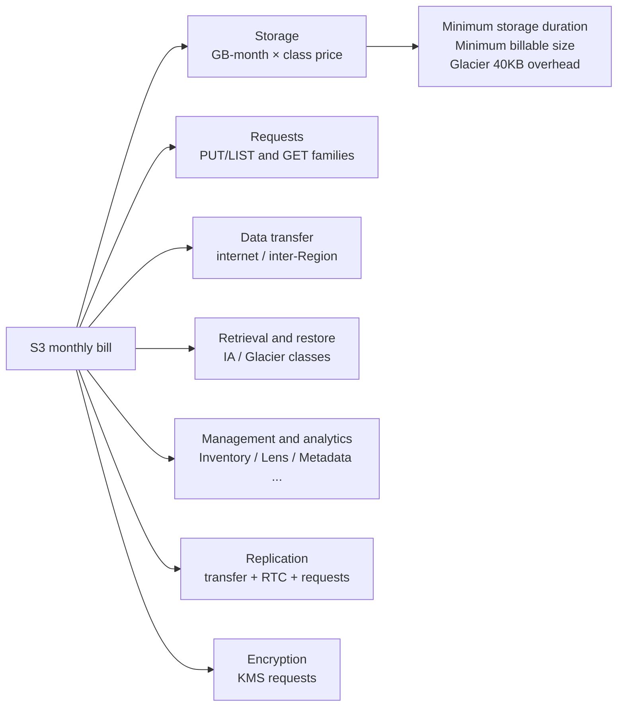

# The complete guide to the S3 pricing model

_Last verified: 2026-10-03_

An S3 bill is not just "capacity × unit price". Seven categories stack up: **storage, requests, data transfer, retrieval, management features, replication, and encryption (KMS)**. This chapter covers the unit prices and billing mechanics for each, the traps, concrete cost estimates, and an optimization checklist.

Pricing assumptions:

- Region is **us-east-1 (N. Virginia)**, currency is USD
- Verified on **2026-10-03**
- Main sources are the AWS Price List API (`AmazonS3` offer publicationDate 2026-09-28, `AWSDataTransfer`, `AmazonS3GlacierDeepArchive`, `AmazonGlacier`, `awskms`, `AmazonVPC`) plus the S3 pricing page, FAQs, and What's New
- Prices change. Always re-check production estimates against the AWS Pricing Calculator and the latest pricing pages

Machine-readable prices are in `data/storage-classes.json` (by class) and `data/s3-pricing.json` (transfer).

## 1. The big picture of the bill



| Category | What is billed | What is free |
| --- | --- | --- |
| Storage | Amount stored (GB-month, byte-hours averaged over the month) | — |
| Requests | Number of API calls | DELETE / CANCEL, 403s from outside your account or organization |
| Data transfer | Bytes leaving S3 | Inbound (IN), to AWS services in the same Region, to CloudFront, internet egress up to 100 GB/month |
| Retrieval | Bytes read from IA / Glacier classes | Standard / Intelligent-Tiering, Glacier Flexible Bulk |
| Management features | Monitored objects, processed items, and so on | Storage Lens free metrics |
| Replication | Transfer, destination PUTs and storage, RTC | — |
| Encryption | KMS API calls for SSE-KMS | SSE-S3 (free) |

## 2. Storage pricing

### 2.1 Price table (GB-month)

| Class | Price |
| --- | --- |
| Standard (first 50 TB) | $0.023 |
| Standard (next 450 TB) | $0.022 |
| Standard (over 500 TB) | $0.021 |
| Intelligent-Tiering Frequent Access | Same tiers as Standard ($0.023 / $0.022 / $0.021) |
| Intelligent-Tiering Infrequent Access | $0.0125 |
| Intelligent-Tiering Archive Instant Access | $0.004 |
| Intelligent-Tiering Archive Access | $0.0036 |
| Intelligent-Tiering Deep Archive Access | $0.00099 |
| Express One Zone | $0.11 |
| Standard-IA | $0.0125 |
| One Zone-IA | $0.01 |
| Glacier Instant Retrieval | $0.004 |
| Glacier Flexible Retrieval | $0.0036 |
| Glacier Deep Archive | $0.00099 |
| Reduced Redundancy (legacy, first 1 TB) | $0.024 |
| S3 Tables (first 50 TB) | $0.0265 |
| S3 Vectors | $0.06 |
| Annotations | $0.023 |
| S3 Files (file system storage) | $0.30 |

### 2.2 How GB-month is calculated

S3 accumulates byte-hours and converts them to GB-months at the end of the month.

```text
Example: in a 30-day month,
  100 GB stored for the first 15 days,
  300 GB stored for the remaining 15 days

  GB-month = (100 GB × 15 days × 24 h + 300 GB × 15 days × 24 h) / (30 days × 24 h)
           = 200 GB-month
  Standard charge = 200 × $0.023 = $4.60
```

Tiered pricing applies to the **Regional total for the account (or the whole family under Organizations consolidated billing)**. Splitting data across buckets does not reset the tiers.

### 2.3 What "hides" on top of storage charges

| Item | Details |
| --- | --- |
| Minimum billable size | Standard-IA / One Zone-IA / Glacier IR bill objects under 128 KB as 128 KB |
| Minimum storage duration | Standard-IA / One Zone-IA 30 days, Glacier IR / Glacier Flexible 90 days, Deep Archive 180 days. Deleting, overwriting, or transitioning early bills the remaining period |
| Glacier overhead | Glacier Flexible / Deep Archive add 8 KB (Standard rate) + 32 KB (Glacier rate) per object |
| Restored copies | A temporary copy restored from Glacier is billed at the Standard rate for the specified days (on top of the archive itself) |
| Noncurrent versions | With versioning enabled, older versions are billed in full |
| Delete markers | Nearly zero size, but a large buildup slows down LIST |
| Incomplete multipart uploads | Uploaded parts keep being billed until you Complete or Abort |
| Intelligent-Tiering monitoring fee | $0.0025 per 1,000 objects of 128 KB or larger per month |

## 3. Request pricing

### 3.1 The two request tiers

S3 requests fall into two broad tiers with different prices.

| Tier | APIs included | Standard price |
| --- | --- | --- |
| Tier 1 (write and list) | PUT, COPY, POST, LIST (ListObjectsV2, ListObjectVersions, ListBuckets, and so on), CreateMultipartUpload / UploadPart / CompleteMultipartUpload | $0.005 / 1,000 |
| Tier 2 (read) | GET, SELECT, HEAD, others | $0.0004 / 1,000 |
| Free | DELETE, CANCEL (AbortMultipartUpload) | $0 |

The key point: **LIST is billed at the higher PUT rate, not the GET rate**. LIST costs 12.5x as much as GET.

### 3.2 Request prices by class

| Class | Tier 1 (per 1,000) | Tier 2 (per 1,000) |
| --- | --- | --- |
| Standard | $0.005 | $0.0004 |
| Intelligent-Tiering | $0.005 | $0.0004 |
| Express One Zone | $0.00113 | $0.00003 |
| Standard-IA | $0.01 | $0.001 |
| One Zone-IA | $0.01 | $0.001 |
| Glacier Instant Retrieval | $0.02 | $0.01 |
| Glacier Flexible Retrieval | $0.03 | $0.0004 |
| Glacier Deep Archive | $0.05 | $0.0004 |
| S3 Tables | $0.005 | $0.0004 |

### 3.3 Request counts for multipart uploads

With multipart, one object is not one PUT.

```text
Multipart upload of a 1 GB file in 100 MB parts
  CreateMultipartUpload  1 request
  UploadPart            11 requests (100 MB × 10 + 24 MB × 1)
  CompleteMultipartUpload 1 request
  Total                 13 requests (Tier 1)
```

When uploading directly to Glacier Deep Archive with multipart, the price list splits the rates: UploadPart / CreateMultipartUpload are $0.005 / 1,000, while CompleteMultipartUpload and PutObject / CopyObject are $0.05 / 1,000.

### 3.4 2024 change: unauthorized 403 requests are no longer billed

Previously, even when strangers sent indiscriminate requests to your bucket name, the bucket owner paid for the requests that returned `403 AccessDenied`. In 2024, after a widely discussed case of a huge bill caused by a flood of PUTs to an empty bucket, AWS changed the billing.

| Item | Details |
| --- | --- |
| Announced | 2024-05-13 |
| Rollout | Rolled out to most S3 APIs within weeks (completion announced 2024-08) |
| Applies to | **Requests originating outside your account or AWS Organization that are rejected with HTTP 403 (Access Denied)** |
| No longer billed | Request charges and bandwidth (transfer) charges |
| Scope | All S3 buckets in all Regions (including GovCloud and China Regions) |
| Action required | None |

Note: 403s on requests from within your own account or organization are still billed as before. Errors other than 403 (404 and so on) are handled separately.

## 4. Data transfer pricing

### 4.1 Transfer directions and prices

```text
                         ┌─────────────── us-east-1 ────────────────┐
  Internet ──IN free───▶ │  S3 ◀────── free ──────▶ EC2 / Lambda   │
  Internet ◀─OUT billed─ │   │         (same Region)                 │
                         │   │──▶ CloudFront free (origin fetch)     │
                         │   │──▶ other Regions billed ($0.01–$0.02/GB) │
                         └───┴──────────────────────────────────────┘
```

| Path | Price (from us-east-1) |
| --- | --- |
| Internet to S3 (IN) | Free |
| S3 to EC2 / Lambda and others in the same Region | Free |
| S3 to CloudFront | Free |
| S3 to us-east-2 (Ohio) | $0.01 / GB |
| S3 to other Regions (for example, us-west-2, eu-west-1, ap-northeast-1) | $0.02 / GB |
| S3 to the internet (OUT) | Tiered (next table) |

### 4.2 Tiered pricing for internet egress (DTO)

| Monthly transfer | Price |
| --- | --- |
| First 100 GB | Free (100 GB/month total across all AWS services and Regions) |
| First 10 TB (beyond the free allowance) | $0.09 / GB |
| Next 40 TB | $0.085 / GB |
| Next 100 TB | $0.07 / GB |
| Over 150 TB | $0.05 / GB |

The 100 GB/month free allowance dates from 2021-12 (it was 1 GB before that). Delivery through CloudFront has its own free allowance (1 TB/month) and pricing model (CloudFront pricing is out of scope for this guide).

### 4.3 Free transfer when leaving AWS (2024-03)

In 2024-03, AWS announced it would **waive internet egress charges for customers migrating from AWS to another cloud or on premises** (in line with the direction of the EU Data Act, and applied worldwide in all Regions).

| Item | Details |
| --- | --- |
| How to apply | Request it from AWS Support as "free data transfer to move off AWS" |
| Review | Per account. Once approved, credits are granted for the migrated data |
| Deadline | Originally, migration had to complete within 60 days. A 2025-09-30 update extended this to 90 days (reportedly, the S3 FAQ and other pages still say 60 days) |
| Excluded | Transfer from specialized services such as CloudFront, Direct Connect, Snow Family, and Global Accelerator |
| Other conditions | Active account in good standing. Accounts storing less than 100 GB are not eligible for additional credits |
| Caution | If AWS judges the usage to be for purposes other than migration, it may bill you for the credits |

You do not need to close your account, and you can move only some workloads while continuing your relationship with AWS.

### 4.4 Transfer Acceleration

A feature that speeds up long-distance uploads/downloads through CloudFront edge locations. It is billed **on top of the normal transfer charges**.

| Direction | Price (surcharge) |
| --- | --- |
| Internet → S3 (via edges in the US, Europe, Japan) | $0.04 / GB |
| Internet → S3 (via other edges) | $0.08 / GB |
| S3 → internet | $0.04 / GB |
| S3 ↔ other Regions (via acceleration) | $0.04 / GB (some Regions differ, for example $0.10 / GB to Jakarta) |

The Transfer Acceleration product page states "you pay only for transfers that are accelerated".

### 4.5 Access paths from a VPC: NAT Gateway vs gateway endpoint

The path from EC2 in a private subnet to S3 changes the cost dramatically.

| Path | Hourly charge | Data processing charge | Notes |
| --- | --- | --- | --- |
| Via NAT Gateway | $0.045 / hour | $0.045 / GB | Values from the VPC pricing page example (us-east-2) |
| Gateway VPC endpoint | Free | Free | Routes S3 traffic via route tables. Same Region only |
| Interface VPC endpoint (PrivateLink) | $0.01 / hour / AZ | $0.01 / GB (first 1 PB) | For private connectivity from on premises or other Regions |

For S3 in the same Region, **simply creating a gateway endpoint brings NAT processing charges to zero**. It is one of the most cost-effective S3 optimizations there is.

## 5. Retrieval and restore pricing

| Class | Option | Per GB | Requests |
| --- | --- | --- | --- |
| Standard-IA / One Zone-IA | — | $0.01 | (normal GET charges) |
| Glacier Instant Retrieval | — | $0.03 | (GET $0.01 / 1,000) |
| Glacier Flexible Retrieval | Expedited (1–5 minutes) | $0.03 | $10 / 1,000 |
| Glacier Flexible Retrieval | Standard (3–5 hours) | $0.01 | $0.05 / 1,000 |
| Glacier Flexible Retrieval | Bulk (5–12 hours) | Free | Free |
| Glacier Deep Archive | Standard (within 12 hours) | $0.02 | $0.10 / 1,000 |
| Glacier Deep Archive | Bulk (within 48 hours) | $0.0025 | $0.025 / 1,000 |
| Intelligent-Tiering Archive Access | Expedited | $0.03 | $0.01 each |
| Intelligent-Tiering Archive / Deep Archive Access | Standard / Bulk | Free | Free |
| Express One Zone | upload / retrieval | upload $0.0032, retrieval $0.0006 | (normal request charges) |
| Glacier Flexible Provisioned Capacity | — | $100 / unit / month | — |

A restore costs the retrieval fee + the Standard charge for the restored copy (for the specified days) + any subsequent GETs and data transfer.

## 6. Management and analytics feature pricing

| Feature | Price | Billed on |
| --- | --- | --- |
| S3 Inventory | $0.0025 / million objects | Objects listed (per report) |
| S3 Storage Lens free metrics | Free | Default dashboard |
| S3 Storage Lens advanced metrics | First 25 billion: $0.20 / million objects / month, 25–100 billion: $0.16, over 100 billion: $0.12 | Monitored objects |
| Storage Class Analysis (S3 Analytics) | $0.10 / million objects / month | Monitored objects |
| Object tags | $0.0065 / 10,000 tags / month (Price List API value) | Tags applied |
| Batch Operations | $0.25 per job + $1.00 per million object operations | Jobs and operations (+ the cost of the APIs it runs) |
| Batch Operations automatic manifest generation | $0.015 / million objects (in the source bucket) | |
| S3 Metadata (journal table) | $0.30 / million updates | Change events recorded (value after the 33% price cut in 2025-07) |
| S3 Metadata (live inventory table) | One-time backfill charge + $0.10 / million objects / month for buckets over 1 billion objects | |
| S3 Metadata (annotation table) | $0.002 / GB processed | |
| Annotations | Storage $0.023 / GB-month, requests Tier1 $0.005 / 1,000, Tier2 $0.0004 / 1,000 | |
| Intelligent-Tiering monitoring and automation | $0.0025 / 1,000 objects / month | Objects of 128 KB or larger |
| Access Grants | $0.03 / 1,000 requests | APIs such as GetDataAccess |
| Additional checksum calculation (for example, adding them to existing objects with Batch) | $0.004 / GB processed | |
| S3 Select | Scanned $0.002 / GB, returned $0.0007 / GB (Standard) | No longer offered to new customers (existing customers can keep using it) |

## 7. Replication pricing

S3 Replication (Same-Region SRR / Cross-Region CRR) stacks up the following.

| Item | Details |
| --- | --- |
| Destination storage | Price of the class specified for the destination bucket |
| PUT requests to the destination | Tier 1 price of the destination class (per object) |
| Inter-Region transfer (CRR only) | us-east-1 → us-east-2 is $0.01 / GB; other Regions are $0.02 / GB |
| Replication Time Control (RTC) | Adds $0.015 / GB of transfer (with an SLA to replicate 99.99% within 15 minutes) |
| Replication metrics / notifications | Billed as CloudWatch metrics |
| Batch Replication | Batch Operations pricing (job + operations + manifest generation) |
| KMS | For SSE-KMS objects, KMS requests for decryption at the source and encryption at the destination |
| Multi-Region Access Points | Data routing charge of $0.0033 / GB (basic inter-Region transfer; example for pairs with us-east-1) |

## 8. Encryption (KMS) costs and S3 Bucket Keys

| Method | Additional charge |
| --- | --- |
| SSE-S3 (default for all new objects since 2023-01) | Free |
| SSE-KMS (AWS managed key `aws/s3`) | KMS request charges |
| SSE-KMS (customer managed key) | $1 / month per key (per key version) + KMS request charges |
| DSSE-KMS (dual-layer encryption) | KMS charges + $0.003 / GB of decrypted data |
| SSE-C | No additional S3 charge (disabled by default for new buckets since 2026-04) |

KMS request pricing is **$0.03 / 10,000 requests** (symmetric keys, free tier of 20,000 requests per month).

With SSE-KMS, **every object PUT calls GenerateDataKey and every GET calls Decrypt** on KMS. For heavily accessed buckets, KMS charges can exceed the S3 charges themselves. KMS also has per-API request rate quotas, which can cause throttling.

Enabling **S3 Bucket Keys** has S3 fetch a short-lived bucket-level key from KMS and reuse it, which drastically reduces requests to KMS and **cuts KMS request costs by up to 99%** (AWS's own wording).

```text
Example: 100 million PUTs + 1 billion GETs per month on an SSE-KMS bucket

Without Bucket Keys: (100M + 1B) / 10,000 × $0.03 = $3,300 / month
With Bucket Keys:    up to 99% reduction → could drop to about $33 / month
```

Note: Bucket Keys cannot be used with DSSE-KMS. Also, the encryption context of KMS events recorded in CloudTrail becomes the bucket ARN instead of the object ARN, so any policies relying on per-object encryption context need review.

## 9. Free Tier

The AWS Free Tier changed significantly on 2025-07-15.

| Category | Details |
| --- | --- |
| Accounts created before 2025-07-15 (legacy) | For 12 months: 5 GB of S3 Standard, 20,000 GETs, and 2,000 PUTs per month (plus 100 GB/month of internet egress shared across all services) |
| Accounts created on or after 2025-07-15 (new model) | $100 in credits at sign-up, plus up to another $100 for using services such as EC2 and Bedrock (up to $200 total). The "free plan" lasts 6 months or until the credits run out, after which you must upgrade to a paid plan |
| Common | Internet egress is free up to 100 GB/month across all services (a permanent allowance separate from the Free Tier) |

The S3 FAQ describes the S3-specific "5 GB / 20,000 GET / 2,000 PUT" allowance as lasting "for one year", which makes it a 12-months-free offer. The AWS Free Tier page says 12-months-free offers "are only available to Legacy Free Tier AWS customers", and the Legacy Free Tier FAQ defines Legacy as accounts created before 2025-07-15. So new-model accounts do not get this S3 allowance, and their S3 usage is paid from credits. The S3 pricing page says new customers get up to $200 in Free Tier credits, the free plan lasts 6 months after account creation, and all credits must be used within 12 months of account creation.

## 10. Cost estimate examples

All of the following are rough estimates for us-east-1 assuming a 30-day month. Figures are rounded.

### 10.1 Example 1: serving 10 TB of static assets

Assumptions: 10 TB (10,240 GB) stored in Standard, 100 million GETs per month, 50 TB delivered to the internet.

**Pattern A: serve directly from S3**

| Item | Calculation | Monthly |
| --- | --- | --- |
| Storage | 10,240 GB × $0.023 | $235.52 |
| GET | 100,000,000 / 1,000 × $0.0004 | $40.00 |
| Transfer (50 TB = 51,200 GB) | 100 GB free, 10,240 GB × $0.09, remaining 40,860 GB × $0.085 | $4,394.70 |
| Total | | **About $4,670** |

**Pattern B: serve through CloudFront** (assuming a 95% cache hit rate)

| Item | Calculation | Monthly |
| --- | --- | --- |
| Storage | Same as above | $235.52 |
| GET (origin fetches only) | 5,000,000 / 1,000 × $0.0004 | $2.00 |
| S3 → CloudFront transfer | Free | $0 |
| CloudFront delivery charges | Per the CloudFront price list (out of scope) | Separate |

Lesson: for high-volume delivery workloads, **transfer charges can be more than 18x storage charges**. Putting CloudFront in front to cut S3 GETs and DTO pays off more than shaving S3's own costs.

### 10.2 Example 2: a 1 PB archive

Assumptions: 1 PB (1,048,576 GB), about 1.05 million objects averaging 1 GB. Once a year, 10% of the total (100 TB) is restored.

| Destination | Monthly storage | Annual storage |
| --- | --- | --- |
| Standard (tiered pricing) | $22,583.30 | About $271,000 |
| Glacier Instant Retrieval | $4,194.30 | About $50,300 |
| Glacier Flexible Retrieval | $3,774.87 | About $45,300 |
| Glacier Deep Archive | $1,038.09 | About $12,460 |

Associated costs when choosing Deep Archive:

| Item | Calculation | Amount |
| --- | --- | --- |
| Initial load (PUT directly to Deep Archive) | 1,048,576 / 1,000 × $0.05 | About $52 (multipart adds the cost of the parts) |
| 40 KB overhead | 1.05M × 8 KB ≈ 8 GB at Standard, 1.05M × 32 KB ≈ 32 GB at Deep Archive | About $0.2/month (negligible) |
| Yearly Bulk restore (100 TB) | 102,400 GB × $0.0025 + requests | About $256 |
| Keeping the restored copy for 7 days | 102,400 GB × $0.023 × 7/30 | About $550 |
| Using Standard retrieval for the restore instead | 102,400 GB × $0.02 | About $2,048 (8x Bulk) |

Lesson: archive costs come down to two things: **bundle objects into large units** (at a 1 GB average, the 40 KB overhead is noise) and **use Bulk for restores that are not urgent**. If you instead had 10 billion objects averaging 100 KB, the overhead alone would be 8 KB × 10 billion ≈ 75 TB billed at the Standard rate (about $1,700/month).

### 10.3 Example 3: a LIST-heavy data lake

Assumptions: 100 TB stored in Standard. 200 million small Parquet files. Athena / Spark issue 500 million GETs and 50 million LIST + PUT requests per month.

| Item | Calculation | Monthly |
| --- | --- | --- |
| Storage | 51,200 GB × $0.023 + 51,200 GB × $0.022 | $2,304.00 |
| GET | 500,000,000 / 1,000 × $0.0004 | $200.00 |
| LIST + PUT | 50,000,000 / 1,000 × $0.005 | $250.00 |
| Total | | **About $2,754** |

Now consider "would moving everything to Intelligent-Tiering make it cheaper?":

| Item | Calculation | Monthly |
| --- | --- | --- |
| Monitoring fee (if all 200 million objects are 128 KB or larger) | 200,000,000 / 1,000 × $0.0025 | $500.00 |
| Savings if half (50 TB) drops to the IA tier | Roughly 51,200 GB × ($0.022 - $0.0125) | About -$486 |

With many small files, the monitoring fee eats up the savings. Doing **compaction (merging small files into units of hundreds of MB)** first to cut the object count to 1/100 lowers LIST, GET, and monitoring charges all at once. Another option is S3 Tables (with automatic compaction) (S3 Tables storage is $0.0265 / GB-month, higher than Standard, plus a monitoring fee of $0.025 / 1,000 objects / month and compaction at $0.002 / 1,000 objects + $0.005 / GB processed).

### 10.4 Example 4: S3 access through a NAT Gateway

Assumptions: EC2 in a private subnet exchanges 10 TB per month with S3 in the same Region.

| Path | Calculation | Monthly |
| --- | --- | --- |
| NAT Gateway (1) | 730 hours × $0.045 + 10,240 GB × $0.045 | About $494 |
| Interface endpoint (2 AZs) | 730 hours × $0.01 × 2 + 10,240 GB × $0.01 | About $117 |
| Gateway endpoint | Free | **$0** |

Even with identical S3 charges, the path alone makes a $494/month difference.

### 10.5 Example 5: Cross-Region Replication

Assumptions: CRR of 10 TB of new data per month from us-east-1 to us-west-2. Destination is Standard-IA, average object size 10 MB (about 1 million objects).

| Item | Calculation | Monthly |
| --- | --- | --- |
| Inter-Region transfer | 10,240 GB × $0.02 | $204.80 |
| RTC (if used) | 10,240 GB × $0.015 | $153.60 |
| Destination PUTs (Standard-IA) | 1,048,576 / 1,000 × $0.01 | About $10.49 |
| Destination storage | Destination Region's Standard-IA price × amount stored | Per the destination Region's price list |

## 11. Cost pitfalls

| Pitfall | What happens | Typical magnitude | Mitigation |
| --- | --- | --- | --- |
| Putting small objects in IA / Glacier IR | 128 KB minimum billing makes it more expensive than Standard | 1 million 4 KB objects: Standard $0.09/month → Standard-IA $1.53/month | Size filters, aggregation, stay in Standard |
| Transitioning small objects to Glacier classes | Transition fees + 40 KB overhead are never recovered | 10 million 10 KB objects to Deep Archive: $500 transition fee vs almost zero savings | Keep the post-2024-09 default (no transitions under 128 KB) |
| Overlooking the number of lifecycle transitions | Transitions are billed per object | 100 million objects to Glacier IR: $2,000 | Know your object count first (Storage Lens / Inventory) |
| Incomplete multipart uploads | Invisible parts keep being billed | Failed batches can leave TBs behind | `AbortIncompleteMultipartUpload` rule (for example, 7 days) |
| Old versions with versioning | Every overwrite piles up another old version | A bucket fully overwritten daily grows about 30x in 30 days | `NoncurrentVersionExpiration` / `NewerNoncurrentVersions` |
| Delete marker buildup | LIST slows down | — | Clean up with `ExpiredObjectDeleteMarker` |
| S3 access through a NAT Gateway | $0.045 / GB processing charge | About $460/month for 10 TB | Gateway VPC endpoint |
| SSE-KMS without Bucket Keys | KMS request charges exceed S3 itself | $3,300/month for 1.1 billion requests | S3 Bucket Keys |
| Full scans with LIST | LIST is billed at the Tier 1 rate (12.5x GET) | One full scan of 1 billion objects = 1 million LISTs = $5 ($3,600/month if hourly) | S3 Inventory / S3 Metadata |
| Heavy use of Glacier Standard / Expedited restores | Several to over ten times the cost of Bulk | Standard restore of 100 TB from Deep Archive: $2,048 vs Bulk $256 | Use Bulk for anything not urgent |
| Early deletion | Deleting before the minimum duration bills the remaining period | Deep Archive bills up to 180 days | Match retention period to class |
| Huge numbers of small-to-medium objects in Intelligent-Tiering | Monitoring fee exceeds the savings | $500/month for 200 million objects | Aggregate, or manage explicitly with Standard / lifecycle |
| Cross-Region access | Even cross-Region GETs incur transfer charges | $0.02 / GB | Put compute and buckets in the same Region |
| Public datasets without Requester Pays | You pay for other people's downloads | — | Requester Pays bucket |
| 403 attacks from outside | Not billed since 2024 (403s from within your organization are billed) | — | Fix misconfigured apps inside your organization yourself |

## 12. Cost optimization checklist

### 12.1 Start with visibility

- [ ] In the **S3 Storage Lens** dashboard, check capacity by bucket, class, and prefix, the share of noncurrent versions, and bytes in incomplete multipart uploads
- [ ] In **Cost Explorer**, break down S3 charges by usage type (TimedStorage, Requests-Tier1, DataTransfer-Out, and so on)
- [ ] Apply **cost allocation tags** to buckets to split costs by team / project
- [ ] Understand object counts and size distribution with **S3 Inventory** or the **S3 Metadata live inventory table** (what share is under 128 KB)
- [ ] Use **Storage Class Analysis** to estimate the age at which data can move from Standard to Standard-IA

### 12.2 Storage

- [ ] Set `AbortIncompleteMultipartUpload` (for example, 7 days) on every bucket
- [ ] Set `NoncurrentVersionExpiration` (and `NewerNoncurrentVersions` if needed) on versioning-enabled buckets
- [ ] Clean up expired delete markers with `ExpiredObjectDeleteMarker`
- [ ] Make Intelligent-Tiering the default class for data with unknown access patterns (but run the numbers first if there are huge numbers of small objects)
- [ ] Transition data with clear access patterns explicitly with lifecycle rules
- [ ] Aggregate small files (tar, Parquet compaction, S3 Tables) before tiering
- [ ] Compare minimum storage durations against data retention periods (do not put data deleted after 30 days in IA)
- [ ] Move any remaining Reduced Redundancy data to Standard or Intelligent-Tiering
- [ ] Delete buckets, prefixes, and test data you no longer need with Expiration

### 12.3 Requests

- [ ] Replace processes that do full scans with LIST with Inventory / S3 Metadata
- [ ] Reduce large volumes of small-object PUTs by batching or aggregating
- [ ] Cache frequently read data with CloudFront or similar to reduce S3 GETs
- [ ] For extremely hot data, compare against Express One Zone request prices (GET $0.00003 / 1,000)

### 12.4 Transfer

- [ ] Use a **gateway VPC endpoint** from VPCs to S3 instead of going through a NAT Gateway
- [ ] Put CloudFront in front for internet delivery (S3 → CloudFront is free)
- [ ] Keep compute and buckets in the same Region
- [ ] Consider Requester Pays for public datasets or data provided to other companies
- [ ] Use Transfer Acceleration only after confirming the benefit with a speed test
- [ ] If you are migrating off AWS, apply to Support for the transfer fee waiver

### 12.5 Encryption and other

- [ ] Enable **S3 Bucket Keys** on SSE-KMS buckets
- [ ] Use SSE-S3 (free) unless requirements dictate otherwise
- [ ] Use Bulk for Glacier restores wherever possible, and keep restored copies for as few days as possible
- [ ] Enable Storage Lens advanced metrics and Storage Class Analysis only on the buckets / prefixes that need them (they are billed by monitored object count)
- [ ] Add RTC to CRR only for rules that truly need the SLA

## References

- [Amazon S3 pricing](https://aws.amazon.com/s3/pricing/)
- [AWS Price List API: AmazonS3 offer (us-east-1)](https://pricing.us-east-1.amazonaws.com/offers/v1.0/aws/AmazonS3/current/us-east-1/index.json)
- [AWS Price List API: AWSDataTransfer offer (us-east-1)](https://pricing.us-east-1.amazonaws.com/offers/v1.0/aws/AWSDataTransfer/current/us-east-1/index.json)
- [AWS Price List API: AmazonS3GlacierDeepArchive offer (us-east-1)](https://pricing.us-east-1.amazonaws.com/offers/v1.0/aws/AmazonS3GlacierDeepArchive/current/us-east-1/index.json)
- [AWS Price List API: AmazonGlacier offer (us-east-1)](https://pricing.us-east-1.amazonaws.com/offers/v1.0/aws/AmazonGlacier/current/us-east-1/index.json)
- [AWS Price List API: awskms offer (us-east-1)](https://pricing.us-east-1.amazonaws.com/offers/v1.0/aws/awskms/current/us-east-1/index.json)
- [AWS Price List API: AmazonVPC offer (us-east-1)](https://pricing.us-east-1.amazonaws.com/offers/v1.0/aws/AmazonVPC/current/us-east-1/index.json)
- [Amazon S3 FAQs](https://aws.amazon.com/s3/faqs/)
- [Amazon S3 will no longer charge for several HTTP error codes (What's New, 2024-05)](https://aws.amazon.com/about-aws/whats-new/2024/05/amazon-s3-no-charge-http-error-codes/)
- [Amazon S3 no longer charges for several HTTP error codes (What's New, 2024-08)](https://aws.amazon.com/about-aws/whats-new/2024/08/amazon-s3-no-charges-several-http-error-codes/)
- [Free data transfer out to internet when moving out of AWS (AWS News Blog, 2024-03)](https://aws.amazon.com/blogs/aws/free-data-transfer-out-to-internet-when-moving-out-of-aws/)
- [AWS Global Network FAQs](https://aws.amazon.com/about-aws/global-infrastructure/global-network/faqs/)
- [AWS price reduction for data transfers out to the internet (What's New, 2021-11)](https://aws.amazon.com/about-aws/whats-new/2021/11/aws-price-reduction-data-transfers-internet/)
- [AWS Free Tier now offers $200 in credits and 6-month free plan (What's New, 2025-07)](https://aws.amazon.com/about-aws/whats-new/2025/07/aws-free-tier-credits-month-free-plan/)
- [AWS Free Tier](https://aws.amazon.com/free/)
- [Legacy AWS Free Tier FAQs](https://aws.amazon.com/free/legacy/free-tier-faqs/)
- [Reducing the cost of SSE-KMS with Amazon S3 Bucket Keys](https://docs.aws.amazon.com/AmazonS3/latest/userguide/bucket-key.html)
- [Amazon S3 Transfer Acceleration](https://aws.amazon.com/s3/transfer-acceleration/)
- [Querying data in place with Amazon S3 Select](https://docs.aws.amazon.com/AmazonS3/latest/userguide/selecting-content-from-objects.html)
- [Amazon VPC pricing (NAT Gateway)](https://aws.amazon.com/vpc/pricing/)
- [Gateway endpoints for Amazon S3](https://docs.aws.amazon.com/vpc/latest/privatelink/vpc-endpoints-s3.html)
- [Transitioning objects using Amazon S3 Lifecycle](https://docs.aws.amazon.com/AmazonS3/latest/userguide/lifecycle-transition-general-considerations.html)
- [Amazon S3 Metadata now supports existing objects and reduces price by up to 33% (What's New, 2025-07)](https://aws.amazon.com/about-aws/whats-new/2025/07/amazon-s3-metadata-existing-objects-reduces-price/)
- [Announcing up to 85% price reductions for Amazon S3 Express One Zone (AWS News Blog, 2025-04)](https://aws.amazon.com/blogs/aws/up-to-85-price-reductions-for-amazon-s3-express-one-zone/)
- [Amazon S3 starts rolling out new default security setting (SSE-C) (What's New, 2026-04)](https://aws.amazon.com/about-aws/whats-new/2026/04/s3-default-bucket-security-setting/)
