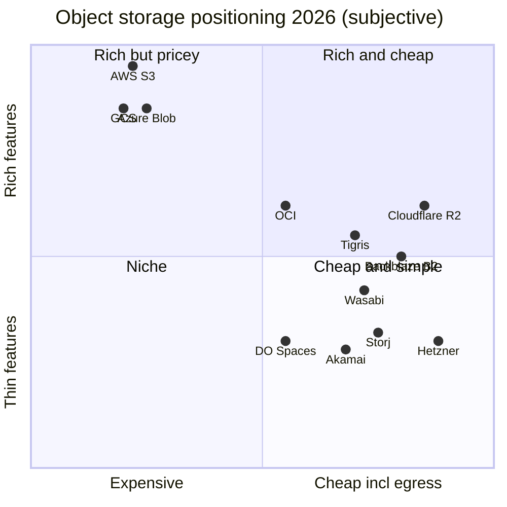
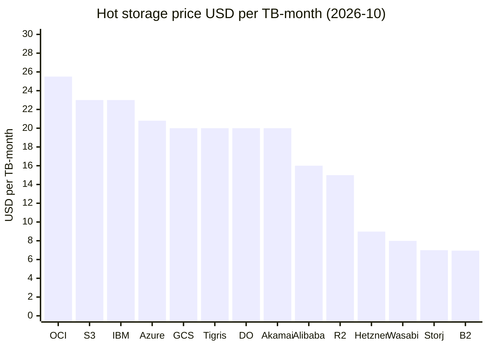
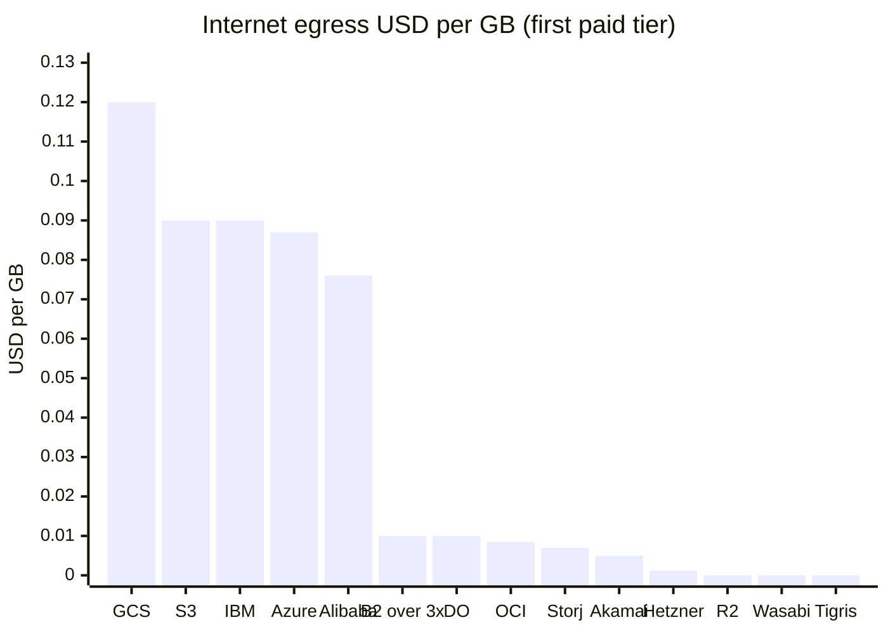
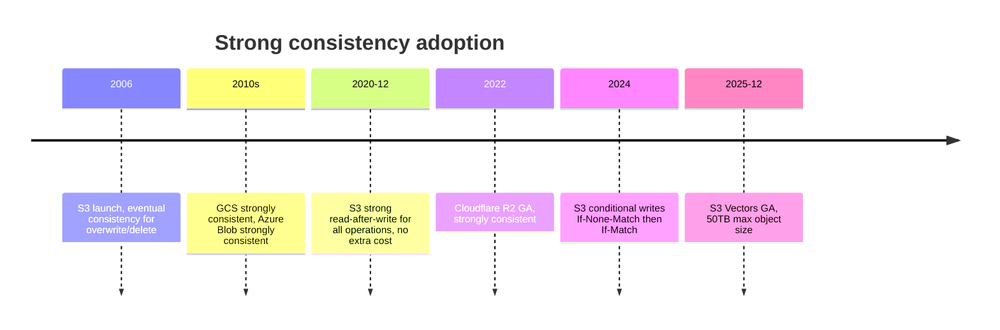
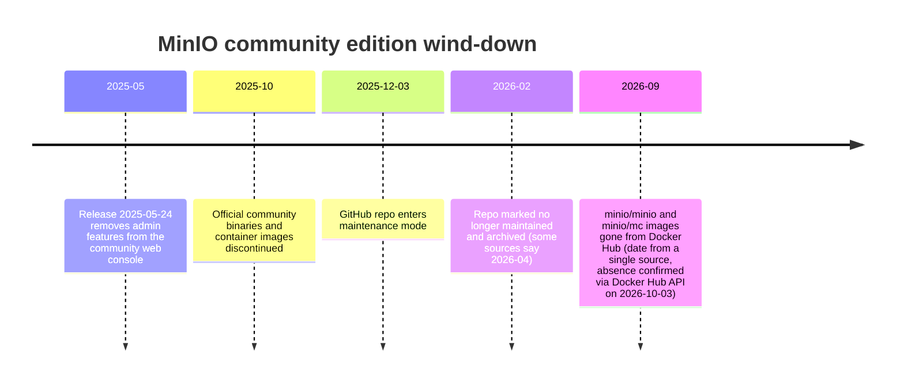
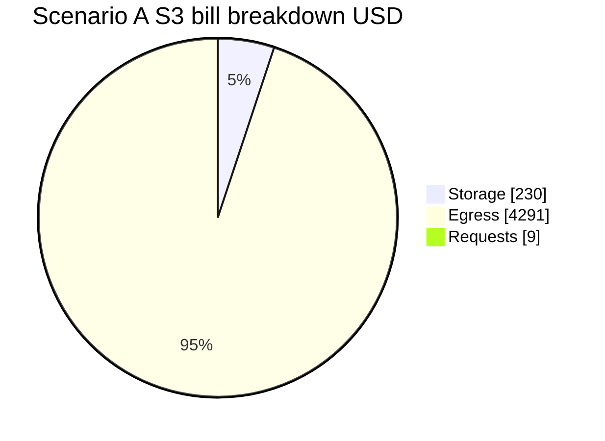
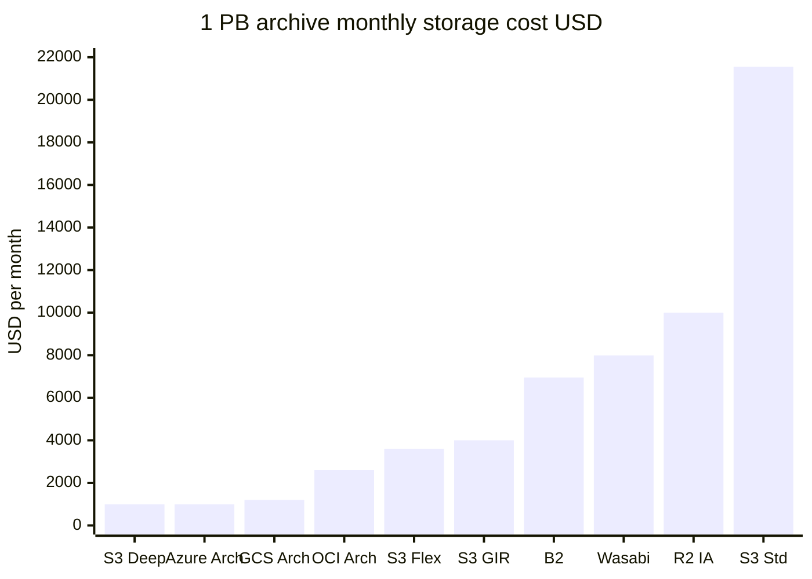
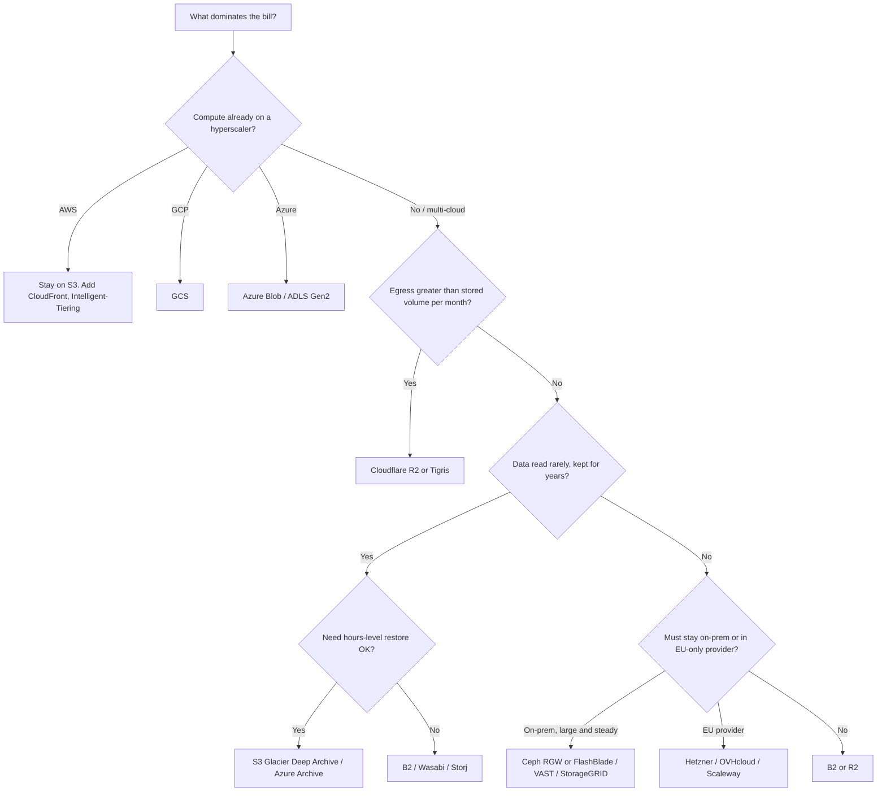
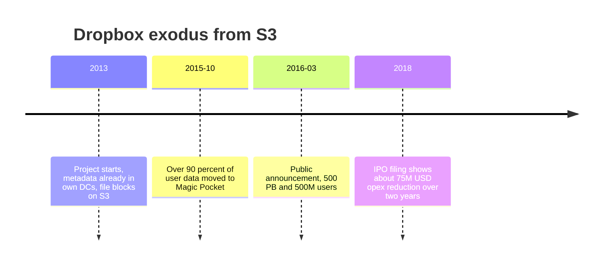
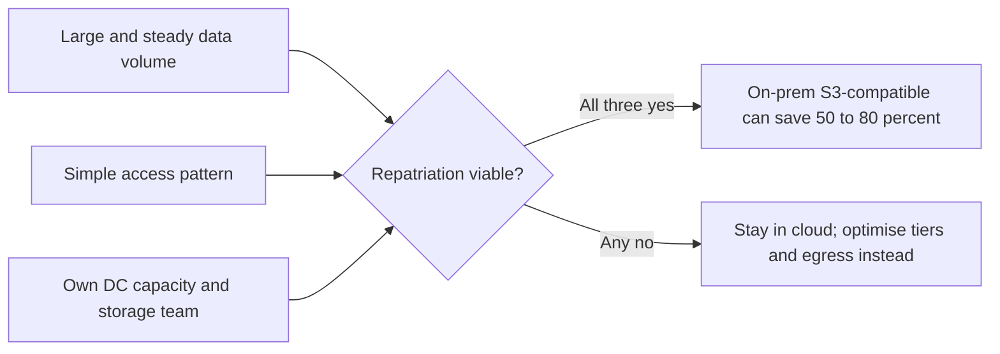

# Competitor comparison: S3 and the "S3-compatible" object storage landscape

_Last verified: 2026-10-03_

> Goal of this chapter: be able to judge "what exists besides S3, what each costs, and when to stop using S3" along three axes: price, features, and operational risk.
> Prices are **public list prices as of 2026-10-03 (representative US region, pay-as-you-go, excluding tax)**. Discounts, EDP, and commitment contracts are not included. Sources for the numbers are collected in the references at the end. Unit prices for the major providers were checked on 2026-10-03 against each official pricing page (rendered in a browser where the page uses JavaScript) or an official price API. Values available only from third parties are marked "third-party information".

## TL;DR

- **S3's weaknesses boil down to two things: egress ($0.09/GB) and pricing complexity**. The storage price of $0.023/GB-month is standard for a hyperscaler in 2026, but roughly 3x that of the alt-clouds (B2 / Wasabi / Hetzner / Storj).
- **If you serve a lot of data, Cloudflare R2 (free egress) is the first thing to compare against**. In a scenario of 10TB stored + 50TB served per month, S3 costs about $4,530 versus about $150 for R2, a **30x** difference (calculation below).
- **For long-term retention, S3 Glacier Deep Archive ($0.00099/GB) and Azure Archive ($0.00099/GB) are in the cheapest class**. The alt-cloud model of "a single hot tier only" is actually more expensive for archival use.
- **2026 is the year storage prices went up**. AI data center demand has tightened HDD/NAND supply, and Backblaze B2 ($6 → $6.95/TB, 2026-05-01), Wasabi ($6.99 → $7.99/TB, 2026-07-01), and Hetzner (about 30% on 2026-04-01) raised prices one after another. The hyperscalers have kept list prices for their standard tiers unchanged.
- **The self-hosted landscape has been upended**. In 2025 the MinIO community edition lost its admin UI, then stopped binary distribution, then entered maintenance mode, and in 2026 it was archived. For new deployments, the choice is now Ceph RGW / Garage / SeaweedFS or a commercial product (AIStor, etc.).
- **S3 API compatibility is a gradient of quality**. Everyone can do PUT/GET/multipart, but differences show up in versioning, Object Lock, replication, events, and conditional writes.

## 1. Competitor map

### 1.1 Categories

| Category | Representatives | Revenue model | Main battleground against S3 |
| --- | --- | --- | --- |
| Hyperscalers | Google Cloud Storage, Azure Blob, OCI, IBM COS, Alibaba OSS | Lock-in of compute + data | As "the data store inside the same cloud" |
| Edge / CDN | Cloudflare R2, Akamai Object Storage | Added value for the network business | Win delivery workloads with free or cheap egress |
| Low-cost specialists (alt-cloud) | Backblaze B2, Wasabi, Hetzner, DigitalOcean Spaces | Low price per unit of capacity | Backup / archive / small and mid-sized apps |
| Emerging globally distributed | Tigris, Storj | Architectural differentiation | Multi-region delivery, AI inference |
| Self-hosted OSS | MinIO (AIStor), Ceph RGW, SeaweedFS, Garage | Support / commercial edition | On-prem, edge, development environments |
| Commercial on-prem | VAST Data, Everpure (formerly Pure Storage) FlashBlade, NetApp StorageGRID, Dell ObjectScale/ECS | Hardware + subscription | Repatriation, AI training infrastructure |

### 1.2 Positioning (subjective assessment)

The vertical axis is "feature depth (S3 compatibility + managed features)" and the horizontal axis is "low total cost (including egress)". The values are the author's subjective scores based on the comparison tables in this chapter, not measurements.



How to read it:

- **The empty upper-right quadrant** is the essence of this market. No player yet combines "S3-level features" with "free egress". R2 comes closest, but it lacks versioning and replication.
- **The upper left (hyperscalers) is something you buy together with compute**. Compared as standalone storage, they always lose.
- The alt-clouds in the lower right specialize in "storing capacity cheaply" and are weak at putting data to use (tables, vectors, event-driven processing).

## 2. Price comparison (hot tier)

### 2.1 Overview table

Units are USD. `Storage` is per GB-month, `egress` is the first paid internet-egress tier, and requests are per 1,000.

| Service | Storage $/GB-month | Egress $/GB | PUT $/1k | GET $/1k | Minimum storage duration | Free egress condition |
| --- | --- | --- | --- | --- | --- | --- |
| AWS S3 Standard (us-east-1) | 0.023 (0.022 above 50TB, 0.021 above 500TB) | 0.09 (first 10TB) | 0.005 | 0.0004 | None | 100GB/month (aggregated across all services), free to CloudFront |
| Google Cloud Storage Standard (us-central1) | 0.020 | 0.12 (0 to 10TiB) | 0.005 | 0.0004 | None | 100GB/month (from North America, Always Free) |
| Azure Blob Hot LRS (East US) | 0.0208 | 0.087 (100GB to 10TB) | 0.005 | 0.0004 | None | 100GB/month |
| Cloudflare R2 Standard | 0.015 | 0 | 0.0045 | 0.00036 | None | Always free |
| Backblaze B2 | 0.00695 | 0.01 (overage) | 0 | 0 | None | Up to 3x average stored volume |
| Wasabi | 0.00799 | 0 | 0 | 0 | 90 days | Monthly egress ≤ stored volume (fair use) |
| OCI Object Storage Standard | 0.0255 | 0.0085 | 0.00034 | 0.00034 | None | 10TB/month |
| IBM COS Standard (Regional, us-south) | 0.023 (0.0209 at 500TB+) | 0.09 (0 to 50TB) | 0.0052 | 0.00042 | None | None |
| Alibaba OSS Standard LRS (US Virginia) | 0.016 (first 5GB free) | 0.076 (100GB to 10TB) | 0.0014 (free up to 100 million) | 0.0001 (free up to 500 million) | None | 100GB/month |
| DigitalOcean Spaces | 250GiB included in $5/month, 0.02 overage | 0.01 (above 1TiB) | 0 | 0 | None | 1TiB/month included |
| Akamai Object Storage | 250GB included in $5/month, 0.02 overage | 0.005 (above 1TB) | 0 | 0 | None | 1TB/month included (transfer pool) |
| Hetzner Object Storage | 1TB included in base $7.99 (EUR 6.49)/month, $0.0123/TB-hour overage (≈ 0.00898/GB-month) | 0.0012 (overage $1.20/TB, EUR 1.00/TB) | 0 | 0 | None | 1TB/month included |
| Tigris Standard | 0.02 | 0 | 0.005 | 0.0005 | None | Always free |
| Storj Standard | 0.007 | 0.007 | 0 | 0 | 30 days | None |

Caveats:

- GCS values were read from the official pricing page rendered in a browser. Storage is an hourly rate of $0.000027397/GiB-hour, × 730 hours ≈ $0.020/GiB-month. Egress is $0.12/GiB for 0 to 10TiB, $0.11 for 10 to 150TiB, and $0.08 above 150TiB. GCS bills in GiB/TiB. Some sites claim "GCS raised prices in 2026", but Google's official pricing-change announcement page shows that those changes **took effect in 2022-10 / 2023-04**; they are not a new change in 2026.
- Azure values were taken directly from the Retail Prices API (`prices.azure.com`). Requests are priced per 10,000 ($0.05 / $0.004) and were converted to per 1,000.
- OCI values come from Oracle's official price API (`apexapps.oracle.com/pls/apex/cetools/api/v1/products`), IBM values from the pricing tab of the IBM Cloud catalog (Standard plan, Regional, us-south), and Alibaba values from the official pricing page with the region switched to US (Virginia). IBM Class B ($0.0042 per 10,000) and Alibaba requests (write $0.014, read $0.001 per 10,000) were converted to per 1,000.
- Hetzner values are the **USD list prices** from the official price API that the product page reads (a separate USD price list, not an exchange-rate conversion). The EUR list prices are base EUR 6.49, storage overage EUR 0.0087/TB-hour, and egress overage EUR 1.00/TB.
- Storj changed its pricing structure several times in 2025 to 2026. The official pricing page (checked 2026-10-03) states a minimum monthly fee of **$5** (if usage is under $5 you are charged $5; accounts paying with USDC are exempt). The "$50 from 2026-07" figure seen in forum posts is not reflected on the official page.

### 2.2 Visualizing storage prices



The Hetzner value is calculated from the official USD overage rate ($0.0123/TB-hour × 730 hours ≈ $8.98/TB). The first 1TB is included in the $7.99 base price.

### 2.3 Visualizing egress prices



**Egress at the three hyperscalers costs 10 to 100 times that of the alt-clouds**. In its 2025 final decision, the UK CMA pointed out that the major providers' egress fees are at a level "well above average cost" (see Chapter 10).

### 2.4 Hyperscaler archive tiers

| Service | Tier | Storage $/GB-month | Minimum storage duration | Retrieval |
| --- | --- | --- | --- | --- |
| AWS | S3 Standard-IA | 0.0125 | 30 days | $0.01/GB |
| AWS | S3 Glacier Instant Retrieval | 0.004 | 90 days | Milliseconds, $0.03/GB |
| AWS | S3 Glacier Flexible Retrieval | 0.0036 | 90 days | Minutes to hours |
| AWS | S3 Glacier Deep Archive | 0.00099 | 180 days | 12 to 48 hours |
| Google | Nearline / Coldline / Archive (us-central1) | 0.010 / 0.004 / 0.0012 | 30 / 90 / 365 days | Immediate (retrieval fees apply) |
| Azure | Archive LRS (East US) | 0.00099 | 180 days | Rehydration takes hours, $0.02/GB (priority $0.10/GB) |
| OCI | Archive | 0.0026 | 90 days | Restore required; at most 1 hour from the restore request to the first byte (Oracle docs) |
| Cloudflare R2 | Infrequent Access | 0.01 | 30 days | $0.01/GB |
| Tigris | Archive | 0.004 | 90 days | Restore-based |
| DigitalOcean | Spaces Cold | 0.007/GiB | Early deletion charges apply | $0.01/GiB |

AWS Glacier prices are known list prices confirmed on the S3 pricing page (us-east-1). GCS Nearline/Coldline/Archive values are the official pricing page's hourly rates ($0.000013699 / $0.000005479 / $0.000001644 per GiB-hour) × 730 hours, and the 30 / 90 / 365-day minimum durations were confirmed on the same page. The OCI Archive price is from the Oracle price API (B91633).

## 3. Feature comparison

### 3.1 Key feature matrix

Legend: ○ = supported / △ = partial, preview, or via a separate first-party product / × = not supported, or absent from the official API/feature list / ? = the official documentation does not say. Every cell was checked against official documentation on 2026-10-03; the only cells left as ? are strong consistency for Backblaze B2, DigitalOcean Spaces, and Hetzner, whose docs make no statement about read-after-write consistency. In `data/competitors.json`, ○ and △ map to `true`, × to `false`, and ? to `null`.

| Service | S3 compatibility | Strong consistency | Versioning | Object Lock | Lifecycle | Replication | Events | Iceberg/tables | Vector | CDN integration |
| --- | --- | --- | --- | --- | --- | --- | --- | --- | --- | --- |
| AWS S3 | Native | ○ (since 2020-12) | ○ | ○ | ○ | ○ (CRR/SRR) | ○ (EventBridge/SNS/SQS/Lambda) | ○ S3 Tables | ○ S3 Vectors | ○ CloudFront |
| GCS | △ (XML API + HMAC) | ○ | ○ | ○ Bucket Lock / Object Retention | ○ | ○ dual/multi-region | ○ Pub/Sub | ○ BigLake | × (Vertex AI is a separate product) | ○ Cloud CDN |
| Azure Blob / ADLS Gen2 | × (proprietary API) | ○ | ○ | ○ Immutable storage | ○ | ○ Object replication / GRS | ○ Event Grid | △ via Fabric OneLake (Iceberg metadata virtualization) | × | ○ Front Door |
| Cloudflare R2 | High | ○ | × | △ bucket lock (proprietary) | ○ | × | ○ via Queues | ○ Basin Catalog | × (Vectorize is a separate product) | ○ |
| Backblaze B2 | High | ? (not stated in the docs) | ○ | ○ | ○ | ○ Cloud Replication | ○ (paid, access on request) | × | × | × (partner CDNs only) |
| Wasabi | High | ○ ("immediate consistency") | ○ | ○ | ○ | ○ | ○ (delivered via AWS SNS) | × | × | × (partners only) |
| OCI | △ | ○ | ○ | ○ Retention rules | ○ | ○ | ○ OCI Events | × (Autonomous AI Lakehouse queries Iceberg; no managed catalog documented) | × | × |
| IBM COS | High | ○ | ○ | ○ | ○ | ○ | ○ | △ watsonx.data (Iceberg REST catalog) | × | △ via IBM Cloud Internet Services |
| Alibaba OSS | △ | ○ | ○ | ○ WORM | ○ | ○ CRR | ○ | △ OSS Tables (invitational preview) | △ OSS Vectors (public preview) | ○ |
| DO Spaces | High | ? (not stated in the docs) | ○ (API only) | × | △ (expiration only) | × | × | × | × | ○ |
| Akamai | High | ○ | ○ | ○ (Governance/Compliance) | △ (expiration only) | × | × | × | × | ○ (origin for Akamai CDN) |
| Hetzner | High | ? (not stated in the docs) | ○ | ○ | △ (expiry-based deletion) | × | × | × | × | × |
| Tigris | High | ○ (scope set by bucket location type) | △ (via snapshots; no PutBucketVersioning) | × | ○ | ○ automatic global distribution | ○ (webhooks) | × | × | ○ (distributed cache) |
| Storj | High | ○ | ○ | ○ | × (per-object TTL only) | Not needed (distributed) | × | × | × | × |
| MinIO / AIStor | High | ○ | ○ | ○ | ○ | ○ | ○ | ○ AIStor Tables | × | × |
| Ceph RGW | High | ○ (within a site) | ○ | ○ | ○ | ○ multisite (asynchronous) | ○ | × | × | × |
| SeaweedFS | △ | ○ (replica writes W=N) | ○ | ○ | △ (expiration only) | ○ | △ (filer webhook/Kafka, no S3 bucket notifications) | ○ S3 Table Buckets + Iceberg REST catalog | △ Lance table buckets | × |
| Garage | △ | ○ (default `consistency_mode`) | × | × | △ (expiration, etc.) | ○ (built in) | × | × | × | × |
| VAST Data | High | ○ | ○ | ○ | △ (expiration rules per view) | ○ | ○ (Kafka) | × (VAST DataBase; no Iceberg catalog documented) | ○ vector indexing | × |
| Everpure FlashBlade | High | ○ | ○ | ○ | △ (expiration) | ○ | × (not in the supported S3 operations) | × | × | × |
| NetApp StorageGRID | High | ○ | ○ | ○ | ○ (ILM) | ○ CloudMirror | ○ (Kafka/webhook/SNS) | × | × | × |
| Dell ObjectScale / ECS | High | ○ | ○ | ○ | ○ | ○ geo-replication | ○ (webhook; Kafka from 4.4) | ○ S3 Tables (GA in 4.4) | × | × |

R2's S3 API implementation status was confirmed in the official documentation. `GetBucketVersioning`, `PutBucketReplication`, the notification configuration APIs, ACLs, and object tagging are **not implemented**. On the other hand, SSE-C and conditional headers (`If-Match`, etc.) are implemented.

### 3.2 The four levels of "S3-compatible"

S3 compatibility is not binary. The author looks at it in the following four levels.

| Level | What it covers | Representatives | Migration caveats |
| --- | --- | --- | --- |
| L1: CRUD | PUT/GET/DELETE/List, Signature v4 | Almost everyone | Up to this level, swapping the endpoint is enough |
| L2: Large objects | Multipart, Range GET, presigned URLs, SSE | Almost everyone | Watch for part size limits and differences in ETag calculation |
| L3: Data protection | Versioning, Object Lock (Compliance/Governance), Lifecycle, Replication | B2, Wasabi, Ceph, MinIO, StorageGRID, FlashBlade | Backup software immutability features depend on this level |
| L4: New-generation APIs | Conditional writes (`If-None-Match` / `If-Match`), checksums (CRC64NVME, etc.), S3 Express, S3 Tables/Vectors | AWS (all), R2 (conditional writes), Tigris and others (partial) | OSS that "uses S3 as a database" (Chapter 10) assumes L4 |

**L4 is the new axis of differentiation**. Since S3 added conditional writes in 2024, "systems built on top of S3" such as WarpStream / SlateDB / turbopuffer have been designed around CAS (compare-and-swap). If a compatible store does not implement this, such OSS will not run on it.

### 3.3 Consistency models



Before 2020, "S3 is eventually consistent" was common knowledge, and layers that compensated for consistency, such as Netflix's S3mper and EMRFS consistent view, were needed. Today every major cloud is strongly consistent. **Self-hosted multi-site setups (such as Ceph multisite) are eventually consistent across sites**, which makes this the biggest pitfall.

## 4. Service deep dives

### 4.1 Google Cloud Storage

- **Positioning**: The foundation of Google's data/AI platform (BigQuery, Vertex AI, Dataflow). Rather than being chosen on its own, it is mostly a case of "we use BigQuery, so GCS".
- **Pricing**: Standard us-central1 $0.020/GiB-month. Internet egress is $0.12/GiB for 0 to 10TiB, $0.11 for 10 to 150TiB, and $0.08 above 150TiB (official pricing page). Class A $0.005/1k, Class B $0.0004/1k (flat namespace; hierarchical namespace is $0.0065 / $0.0005).
- **Storage classes**: Standard / Nearline (30 days) / Coldline (90 days) / Archive (365 days). **Even Archive can be read in milliseconds**, which is a major difference from S3 Glacier Deep Archive. Autoclass handles automatic tiering.
- **Unique features**: Dual-region / multi-region buckets (geo-redundancy under a single namespace), Turbo Replication (15-minute RPO), strongly consistent list.
- **Weaknesses**: S3 compatibility is via "XML API + HMAC keys", so pointing the AWS SDK at it as-is runs into problems with details (some headers, differences in the versioning API). Its egress is the most expensive of the three. The 2023 pricing change doubled the Class A operation price for multi/dual-region.
- **For the EU**: With the EU Data Act in mind, it offers Data Transfer Essentials, which makes multi-cloud transfers within the same organization free.

### 4.2 Azure Blob Storage / ADLS Gen2

- **Positioning**: The standard data store for Microsoft enterprises. ADLS Gen2 (Blob with the hierarchical namespace enabled) is the foundation of Fabric / Synapse / Azure Databricks.
- **Pricing**: Hot LRS East US $0.0208/GB ($0.019968 above 50TB, $0.019136 above 500TB). Write $0.05/10k, Read $0.004/10k. Egress: 100GB free, then $0.087 for the next 10TB, $0.083 for the next 40TB, and $0.07 for the next 100TB.
- **Storage classes**: Hot / Cool / Cold / Archive. Archive LRS is $0.00099/GB-month, the same as Deep Archive. Price varies by redundancy: LRS / ZRS / GRS / RA-GRS / GZRS.
- **Unique features**: Atomic directory rename and POSIX ACLs via the hierarchical namespace (an advantage for Hadoop-style commit protocols), Blob index tags, Entra ID integration.
- **Weaknesses**: **There is no S3 API**. Using S3-oriented tools requires a gateway (such as a self-run S3 proxy). The pricing matrix is complex.
- **For the EU**: Starting in late August 2025, it began offering EU customers at-cost data transfer to and from other clouds (via a support request).

### 4.3 Cloudflare R2

- **Positioning**: The head-on challenger to the "egress tax". Announced in 2021, GA in 2022. Cloudflare absorbs egress with its network revenue.
- **Pricing**: Standard $0.015/GB, Infrequent Access $0.01/GB (30-day minimum, $0.01/GB retrieval). Class A $4.50/million, Class B $0.36/million. Free egress. Free tier of 10GB + 1 million Class A + 10 million Class B. Deletes and MPU aborts are free.
- **Unique features**: Bindings from Workers, Sippy (incremental migration from S3), Super Slurper (bulk migration), event notifications (via Queues), bucket lock (retention rules), Basin Catalog (formerly R2 Data Catalog, an Iceberg REST catalog, GA), jurisdictions (EU / FedRAMP).
- **Weaknesses**: No versioning, no replication, and a proprietary bucket lock rather than the S3 Object Lock API. **Deleted data cannot be recovered, so using it as the final destination for backups takes some extra work**.
- **Good fit for**: Public asset delivery, multi-cloud sharing of ML datasets, Workers apps.

### 4.4 Backblaze B2

- **Positioning**: The long-established low-cost specialist. As a public company (NASDAQ: BLZE), its financials are public, which is reassuring.
- **Pricing**: $6.95/TB-month (raised from $6.00 on 2026-05-01). At the same time, **API calls became free** (except Event Notifications). Egress is free up to 3x the average stored volume, with $0.01/GB overage. No minimum storage duration. The high-throughput B2 Overdrive is $15/TB with unlimited egress.
- **Unique features**: Cloud Replication, Object Lock, free egress to partner CDNs (Cloudflare, Fastly, etc.) and compute providers (Vultr, etc.).
- **Weaknesses**: Few regions, no managed analytics or AI features.
- **Good fit for**: Backup (Veeam / restic / rclone), media archives, CDN origins.

### 4.5 Wasabi

- **Positioning**: "Flat-rate hot storage with free egress and free API calls". It has strong partnerships with backup vendors.
- **Pricing**: $7.99/TB-month (raised from $6.99 on 2026-07-01, citing storage hardware, power, and data center costs). Free egress and API calls.
- **Pitfalls**: **90-day minimum storage duration** (per object), **1TB minimum charge**, and **monthly egress exceeding stored volume can violate the fair use policy**. Not suited for delivery workloads.
- **Good fit for**: Backups that, once written, are kept for 90 days or more and are rarely read.

### 4.6 Oracle OCI Object Storage

- **Positioning**: The only hyperscaler that is seriously making egress cheap.
- **Pricing**: Standard $0.0255/GB-month (same in all regions, first 10GB free), Infrequent Access $0.01, Archive $0.0026. Egress is **free for the first 10TB per month**, then $0.0085/GB (originating in North America/Europe). Requests $0.0034 per 10,000 (first 50,000 free). Values were confirmed with Oracle's official price API (part numbers B91628 / B93000 / B91633 / B88327 / B91627).
- **Weaknesses**: The S3 Compatibility API is a subset. The hot storage price is higher than S3.
- **Good fit for**: Oracle DB / OCI workloads, and companies with fairly high egress that cannot move to an alt-cloud.

### 4.7 IBM Cloud Object Storage

- **Positioning**: Originates from the distributed erasure coding of Cleversafe, acquired in 2015. Offered both as a cloud service and as on-prem software.
- **Pricing**: The pricing tab of the IBM Cloud catalog (Standard plan, Regional, us-south) lists the Standard class at $0.0230/GB-month ($0.0209 at 500TB and above) and Smart Tier Hot at $0.0219. Class A $0.0052 per 1,000, Class B $0.0042 per 10,000. **Public egress is $0.09/GB for 0 to 50TB, $0.07 for the next 100TB, and $0.05 for the next 350TB**, with no free allowance. Prices vary by location and resiliency. There is also a One-Rate plan from USD 10/TB including egress and API calls (IBM announcement; the catalog labels it a limited-time offer).
- **Good fit for**: Regulated industries using IBM Cloud / watsonx.

### 4.8 Alibaba Cloud OSS

- **Positioning**: One of the largest in mainland China and APAC. The native API is the OSS API, and S3 compatibility is partial.
- **Pricing**: The official pricing page (US Virginia) lists Standard LRS at $0.0160/GB-month (first 5GB free, GB = GiB) and Standard ZRS at $0.02. Internet egress is free for the first 100GB, then $0.076/GB for 100GB to 10TB, $0.069 for 10 to 50TB, $0.060 for 50 to 150TB, and $0.043 above 150TB. Standard API calls are free up to 100 million writes and 500 million reads, then $0.014 / $0.001 per 10,000. Prices differ by region (for example, Hong Kong is $0.017 for storage and $0.118 for egress). Outside mainland China, transfer from OSS to Alibaba CDN is free.
- **Good fit for**: Practically the only choice when serving users in mainland China.

### 4.9 DigitalOcean Spaces

- **Pricing**: $5/month for 250GiB of storage + 1TiB of transfer. Storage overage $0.02/GiB, transfer overage $0.01/GiB. Cold tier $0.007/GiB (128KiB minimum billable size, early deletion charges apply). CDN included.
- **Weaknesses**: Per-bucket rate limits, no replication or event notifications.
- **Good fit for**: Asset storage for apps running on DigitalOcean.

### 4.10 Akamai Object Storage (formerly Linode)

- **Pricing**: $5/month for 250GB of storage, with 1TB of transfer added to the account's transfer pool. Storage overage $0.02/GB, **transfer overage $0.005/GB** (Jakarta $0.015, São Paulo $0.007). There are currently no API request charges. The official documentation states that request charges for E3 endpoints **will not be introduced before 2027-10-01**.
- **Weaknesses**: Per-account/per-bucket capacity and rate limits that vary by endpoint type (E0 to E3).
- **Good fit for**: Download delivery where transfer volume dominates.

### 4.11 Hetzner Object Storage

- **Pricing**: Base $7.99 / EUR 6.49 (monthly cap on hourly billing; the EUR price was revised from EUR 4.99 on 2026-04-01) for 1TB of storage + 1TB of egress. Storage overage is $0.0123 / EUR 0.0087 per TB-hour (EUR previously 0.0067). Egress overage is $1.20 / EUR 1.00 per TB (confirmed via the official price API). API calls and ingress are free. The base price applies as long as at least one bucket exists, even an empty one.
- **Constraints**: Only Germany (FSN1 / NBG1) and Finland (HEL1). 100TB / 50 million objects per bucket, up to 100 buckets.
- **Good fit for**: Cost-sensitive EU workloads co-located with Hetzner servers.

### 4.12 Tigris

- **Positioning**: "One bucket, globally". Data is automatically cached/moved to the regions where it is read. Partnered with Fly.io.
- **Pricing**: Standard $0.02, Infrequent Access $0.01 (30 days), Archive $0.004 (90 days). Class A $0.005/1k, Class B $0.0005/1k. **Free egress and the same price in every region**.
- **Weaknesses**: It is young, so its long-term durability track record is limited. Coverage of less common APIs is still maturing.
- **Good fit for**: Distributing model weights, user assets for multi-region apps.

### 4.13 Storj

- **Positioning**: Decentralized (DePIN-style). Data is split into fragments with erasure coding and spread across disks run by node operators around the world.
- **Pricing**: Standard storage $7/TB, egress $7/TB. Advanced (formerly Regional Workflows, US SOC2 data centers) $10/TB. 30-day minimum retention, 50KB minimum object size. Segment fees have been abolished.
- **Weaknesses**: The pricing structure changed several times in 2025 to 2026 (three tiers including Global Collaboration at $15/TB → the current two tiers). Latency for small objects.
- **Good fit for**: Parallel downloads of large files, backups.

### 4.14 Self-hosted OSS

#### MinIO (the upheaval of 2025 to 2026)

For years, "self-hosted S3-compatible" meant MinIO, but in 2025 it changed direction.



- The license (AGPLv3) itself has not changed. What ended was **maintenance and distribution**. The code can be forked, and community forks that restore the console have appeared.
- Development of the commercial edition **AIStor** continues, but it requires a paid license.
- **Lesson**: OSS controlled by a single company can be effectively closed without changing the license, simply by "stopping distribution and maintenance". The more data-heavy the infrastructure (storage being the prime example), the larger this dependency risk.

#### Ceph RGW

- An S3/Swift gateway on top of RADOS (a distributed object store). Proven at exabyte scale at CERN and in OpenStack-based clouds.
- It has Versioning / Object Lock / Lifecycle / bucket notifications / multisite replication, and its S3 compatibility is high.
- The downside is the operational burden. **Organizations without dedicated storage engineers should not choose it**.

#### SeaweedFS

- Its design derives from Facebook's Haystack paper and it handles large numbers of small files well. Apache 2.0.
- It provides S3 / WebDAV / FUSE via the Filer. Its S3 API coverage is narrower than MinIO / Ceph.

#### Garage

- Built by Deuxfleurs (a French non-profit). Designed for geo-distribution that ties together low-spec machines over the internet. CRDT-based metadata. AGPLv3.
- **No** Versioning / Object Lock. Aimed at home labs and small services. Adoption as a migration target for those leaving MinIO has grown since late 2025.

### 4.15 Commercial on-prem

| Product | Characteristics | Typical use cases |
| --- | --- | --- |
| VAST Data | All-flash disaggregated (DASE) architecture. The same data is accessible as file/object/table. Also has built-in vector and DB features | GPU clouds, AI training data and checkpoints |
| Everpure (formerly Pure Storage) FlashBlade | Renamed to Everpure in February 2026. High-speed file + object. S3-compatible API | Where 37signals moved after leaving S3. Analytics and backup |
| NetApp StorageGRID | Policy-driven ILM, multi-site distribution, tiering to cloud pools | Archives for existing NetApp customers |
| Dell ObjectScale / ECS | For long-running enterprise operations. Geo-replication | Backup/analytics for companies standardized on Dell |

Gartner's evaluation framework: In 2025, Gartner **merged** its two MQs, "Primary Storage" and "Distributed File Systems and Object Storage (File and Object Storage Platforms)", **into the "Enterprise Storage Platforms" MQ** (published 2025-09-02). The Leaders are six companies: Dell, HPE, Huawei, IBM, NetApp, and Pure Storage. In the last standalone edition (2024 File and Object Storage Platforms), Dell, Pure, VAST, and others were Leaders. **Public cloud storage such as AWS S3 is out of scope for this MQ**; AWS is evaluated under "Strategic Cloud Platform Services" instead.

## 5. Cost scenario comparison (with calculations)

### 5.1 Assumptions

- Calculated with 1TB = 1,000GB in decimal units (AWS/Azure treat 1TB as either 1,000GB or 1,024GB depending on the service, which introduces an error of a few percent).
- Pay-as-you-go list prices, representative US region, excluding tax; free tiers are deducted only where stated.
- Only scenario A includes requests (1 million PUT / 10 million GET). B / C cover storage + egress only.
- Hetzner is calculated with its official USD list prices, with the result at its EUR list prices shown alongside (no exchange-rate conversion).
- GCS bills in GiB/TiB; here GiB ≈ GB, except that the tier boundary follows the official 10TiB = 10,240GB.

### 5.2 Scenario A: 10TB stored + 50TB/month egress (delivery-oriented SaaS)

**AWS S3 Standard**:

```text
Storage 10,000 GB x $0.023                         = $230.00
Egress  first 100 GB free
        9,900 GB x $0.09   (up-to-10TB tier)       = $891.00
        40,000 GB x $0.085 (next 40TB tier)        = $3,400.00
PUT     1,000,000 / 1,000 x $0.005                 = $5.00
GET     10,000,000 / 1,000 x $0.0004               = $4.00
Total                                              ≈ $4,530
```

**Google Cloud Storage**:

```text
Storage 10,000 GB x $0.020                         = $200.00
Egress  first 100 GB free (Always Free)
        10,140 GB x $0.12  (up to 10TiB tier)      = $1,216.80
        39,760 GB x $0.11  (10 to 150TiB tier)     = $4,373.60
PUT/GET (same unit prices as S3)                   = $9.00
Total                                              ≈ $5,799
```

**Azure Blob Hot LRS**:

```text
Storage 10,000 GB x $0.0208                        = $208.00
Egress  100 GB free, 10,000 GB x $0.087 + 39,900 GB x $0.083
        = 870 + 3,311.70                           = $4,181.70
Write   1,000,000 / 10,000 x $0.05                 = $5.00
Read    10,000,000 / 10,000 x $0.004               = $4.00
Total                                              ≈ $4,399
```

**Cloudflare R2**:

```text
Storage (10,000 - 10 free) GB x $0.015             = $149.85
Class A 1,000,000 ops -> within 1M free tier       = $0
Class B 10,000,000 ops -> within 10M free tier     = $0
Egress                                             = $0
Total                                              ≈ $150
```

**Backblaze B2**:

```text
Storage 10 TB x $6.95                              = $69.50
Egress  free allowance = 3x stored volume = 30 TB
        overage 20,000 GB x $0.01                  = $200.00
API     free                                       = $0
Total                                              ≈ $270
```

**OCI**:

```text
Storage  10,000 GB x $0.0255                       = $255.00
Egress   10 TB free, 40,000 GB x $0.0085           = $340.00
Requests 11,000,000 / 10,000 x $0.0034             ≈ $3.74
Total                                              ≈ $599
```

**Others**:

```text
Tigris       storage 10,000 x 0.02 = 200, PUT 1M x 0.005/1k = 5, GET 10M x 0.0005/1k = 5, egress 0      ≈ $210
Storj        storage 10 TB x $7 = 70, egress 50 TB x $7 = 350                                          ≈ $420
Akamai       base 5 + storage (10,000 - 250) x 0.02 = 195, egress (50,000 - 1,000) x 0.005 = 245      ≈ $445
DO Spaces    base 5 + storage (10,000 - 250) x 0.02 = 195, egress (50,000 - 1,024) x 0.01 ≈ 489.76    ≈ $690
Hetzner      base $7.99 + storage 9 TB x $0.0123 x 730 h ≈ 80.81, egress 49 TB x $1.20 = 58.80          ≈ $148
             (in EUR: 6.49 + 9 x 0.0087 x 730 ≈ 57.16 + 49 x 1.00 = 49                            ≈ EUR 113)
Wasabi       storage 10 TB x $7.99 = 79.90, but egress 50 TB > stored 10 TB violates fair use policy  -> not suitable
```

| Service | Monthly (approx.) | Ratio to S3 |
| --- | --- | --- |
| GCS | $5,799 | 1.28 |
| AWS S3 | $4,530 | 1.00 |
| Azure Blob | $4,399 | 0.97 |
| DO Spaces | $690 | 0.15 |
| OCI | $599 | 0.13 |
| Akamai | $445 | 0.10 |
| Storj | $420 | 0.09 |
| B2 | $270 | 0.06 |
| Tigris | $210 | 0.05 |
| R2 | $150 | 0.03 |
| Hetzner | $148 (EUR 113) | 0.03 |
| Wasabi | Not suitable | - |



**Conclusion A**: **95% of the S3 bill is egress**. Serving a delivery workload directly from S3 remains the most expensive choice even in 2026. At a minimum, put CloudFront in front (S3 → CloudFront transfer is free, CloudFront egress gets cheaper than direct S3 as volume grows, and its free tier is larger), or place a delivery copy on R2 or similar.

### 5.3 Scenario B: 1PB archive (almost never read)

1PB = 1,000,000GB. Retrieval is assumed to happen a few times a year, so only storage costs are compared.

```text
S3 Glacier Deep Archive   1,000,000 x 0.00099 = $990
Azure Archive LRS         1,000,000 x 0.00099 = $990
GCS Archive (us-central1) 1,000,000 x 0.0012  = $1,200
OCI Archive               1,000,000 x 0.0026  ≈ $2,600
S3 Glacier Flexible       1,000,000 x 0.0036  = $3,600
S3 Glacier Instant        1,000,000 x 0.004   = $4,000
Tigris Archive            1,000,000 x 0.004   = $4,000
Backblaze B2              1,000 TB x $6.95    = $6,950
Storj Standard            1,000 TB x $7       = $7,000
Wasabi                    1,000 TB x $7.99    = $7,990
Cloudflare R2 IA          1,000,000 x 0.01    = $10,000
S3 Standard (reference)   50,000 x 0.023 + 450,000 x 0.022 + 500,000 x 0.021
                          = 1,150 + 9,900 + 10,500 = $21,550
```



**Conclusion B**: For archives, **the hyperscalers' deep archive tiers are 7 to 8 times cheaper than the alt-clouds**. "S3 is expensive" applies only to "hot tier + egress". However, Deep Archive has a 180-day minimum storage duration, 12 to 48 hour retrieval, and retrieval fees, so always estimate "how many times a year, and how much, you will restore". Retrieving the full 1PB at once costs tens of times the monthly storage bill in retrieval fees + egress.

### 5.4 Scenario C: 100TB stored + 10TB/month egress (internal data platform, mid-sized media)

```text
AWS S3      storage 50,000 x 0.023 + 50,000 x 0.022 = 2,250   egress 9,900 x 0.09 = 891          ≈ $3,141
GCS         storage 100,000 x 0.020 = 2,000           egress (10,000 - 100 free) x 0.12 = 1,188  ≈ $3,188
Azure       storage 51,200 x 0.0208 + 48,800 x 0.019968 ≈ 2,039   egress 9,900 x 0.087 ≈ 861   ≈ $2,901
OCI         storage 100,000 x 0.0255 = 2,550          egress 10 TB free = 0                      ≈ $2,550
DO Spaces   5 + (100,000 - 250) x 0.02 = 2,000        egress (10,000 - 1,024) x 0.01 ≈ 90        ≈ $2,090
Akamai      5 + (100,000 - 250) x 0.02 = 2,000        egress 9,000 x 0.005 = 45                  ≈ $2,045
Tigris      storage 100,000 x 0.02 = 2,000            egress 0                                   ≈ $2,000
R2          storage 99,990 x 0.015 ≈ 1,500            egress 0                                   ≈ $1,500
Wasabi      storage 100 TB x 7.99 = 799               egress 10 TB ≤ 100 TB, free                ≈ $799
Storj       storage 100 TB x 7 = 700                  egress 10 TB x 7 = 70                      ≈ $770
B2          storage 100 TB x 6.95 = 695               egress 10 TB ≤ 300 TB, free                ≈ $695
Hetzner     $7.99 + 99 TB x 0.0123 x 730 ≈ 896.91      egress 9 TB x $1.20 = 10.80               ≈ $908
            (in EUR: 6.49 + 99 x 0.0087 x 730 ≈ 635.24   egress 9 x 1.00 = 9                  ≈ EUR 644)
```

**Conclusion C**: In a low-egress scenario, the gap between the hyperscalers and R2/Tigris narrows to about 1.5 to 2x, and **the true cheapest options are the "$7 to $8/TB" band of B2 / Storj / Wasabi** (about 1/4 to 1/4.5 of S3), followed by Hetzner (just under $9/TB, about $908). However, S3 can also use Intelligent-Tiering to automatically move unread data down to the IA tier ($0.0125) or below, so the effective gap shrinks further.

### 5.5 Scenario summary

| Scenario | Cheapest class | S3's relative position | Rational reasons to stay on S3 |
| --- | --- | --- | --- |
| A: Delivery (egress 5x) | R2 / Tigris / B2 | Most expensive group (30x) | Design built around CloudFront, most processing happens inside AWS |
| B: Archive | S3 Deep Archive / Azure Archive | Cheapest group | Go with S3 (or Azure) without hesitation |
| C: Storage-centric | B2 / Storj / Wasabi | about 4 to 4.5x | Analytics and ML run inside AWS, use of Intelligent-Tiering |

## 6. Selection guide

### 6.1 Decision flow



### 6.2 Recommendations by use case

| Use case | First choice | Second choice | Avoid | Reason |
| --- | --- | --- | --- | --- |
| Data lake / lakehouse on AWS | S3 (+ S3 Tables) | - | External storage | Free transfer within AWS, Athena/EMR/Glue integration |
| Public delivery of images and video | R2 | S3 + CloudFront | Serving directly from S3 | Egress is 90% of the cost |
| Backup (Veeam, etc.) | B2 / Wasabi | S3 Glacier IR | R2 (no versioning) | Object Lock + cheap capacity |
| Statutory retention for 7 to 10 years | S3 Glacier Deep Archive | Azure Archive | Alt-clouds with only a single hot tier | Around $1/TB-month |
| AI training data (GPUs in the cloud) | Storage in the same cloud | VAST (neocloud/on-prem) | Cross-cloud reads | Egress on every training run is fatal |
| Global distribution of model weights | Tigris / R2 | S3 + CloudFront | Direct single-region S3 | Geo-distribution + free egress |
| Shared data across multiple clouds | R2 | OCI | Direct transfer between hyperscalers | Neutral with zero egress |
| EU data sovereignty | Hetzner / European providers | Each provider's EU regions + sovereign clouds | - | The operator's jurisdiction is the key issue |
| Local S3 for development and CI | Garage / SeaweedFS / LocalStack | Ceph (large scale) | New adoption of MinIO community edition | Maintenance stopped in 2025 to 2026 |
| 10PB scale, stable, predictable growth | On-prem (FlashBlade / Ceph) | S3 with long-term commitment discounts | Pay-as-you-go S3 | 37signals-style repatriation |

### 6.3 Author's opinion

- **Think about "what not to put on S3" rather than "migrating off S3"**. S3 is still the strongest integration point for analytics, AI, and event-driven processing, and the savings from a full migration tend to be offset by operational costs and lost features. For many companies, the best answer is a hybrid that carves out only the high-egress "delivery surface" to R2 or similar.
- **Alt-cloud cheapness is not "structural" but "dependent on hardware prices"**. As the 2026 chain of price increases shows, providers that do not own their hardware or run on thin margins pass component price spikes straight through to their prices. When building a 3-year TCO, include a scenario of 10 to 15% annual price increases.
- **Make S3 compatibility up to L3 (Versioning / Object Lock) a requirement**. If you choose based on a single line saying "it's S3-compatible", you will find out later that you cannot build ransomware-resistant immutability or DR.
- **The MinIO case is a good example that "OSS" does not mean "safe"**. If you choose self-hosting, make it the top priority to check whether multiple companies are involved in development (Ceph is strong on this point).

## 7. Notable migration cases and lessons

### 7.1 Case list

| Year | Company | Direction | Scale | Outcome / numbers | Nature of sources |
| --- | --- | --- | --- | --- | --- |
| 2015 to 2016 | Dropbox | S3 → in-house (Magic Pocket) | Over 90% of about 500PB of user data moved (as of 2015-10) | Pre-IPO S-1 showed about $75M in opex reduction over two years | Dropbox tech blog, Wired, S-1 |
| 2023 | 37signals (Basecamp, HEY) | AWS compute/DB → own DC | - | Announced savings from a $3.2M/year cloud bill | DHH's blog |
| 2025 | 37signals | S3 → Pure Storage FlashBlade (18PB capacity across 2 sites) | About 10PB on S3, about 6PB moved | About $1.5M in hardware, under $200k/year to operate. Cut about $1.3 to 1.5M/year of S3 spend. AWS waived about $250k in egress. AWS account deleted on 2025-10-20 | DHH's blog/X, The Register, DCD |
| 2024 onward | Many | S3 → R2 (delivery surface) | - | Incremental migration with Sippy / Super Slurper | Cloudflare |
| 2025 to 2026 | MinIO users | MinIO → Garage / Ceph / SeaweedFS / fork | - | Triggered by the end of community edition maintenance | Personal blogs, Blocks & Files |

### 7.2 Dropbox Magic Pocket



- Dropbox had long kept **metadata in its own data centers and only the file contents (blocks) on S3**. In other words, S3 handled "the heaviest but simplest part".
- It built its own hardware (Diskotech) and software (Go, later partly Rust), and laid out its own network across three regions.
- **It was not a complete exit**. It kept using AWS in some areas, such as overseas data residency requirements.

**Lesson**: Repatriation works when (1) the scale is in the hundreds of petabytes, (2) access patterns are simple and predictable, and (3) storage itself is core to the product and the company can sustain a dedicated engineering team. Very few companies in the world meet all three.

### 7.3 37signals' S3 exit

- About 10PB stored (about 6PB to move after deduplication), migrated to coincide with the end of a 4-year contract (summer 2025).
- Pure FlashBlade has an S3-compatible API, so it was "nearly drop-in". The migration tool was built in a few days with Rails + Solid Queue, and data was transferred over a 40Gbps line.
- AWS applied the "egress waiver for customers moving to another provider" announced in 2024-03 and waived about $250k in egress.

**Lessons**:

1. **The egress waiver program worked in practice**. Since 2024, the "hostage fee" at migration time is no longer a barrier, at least for a full exit.
2. The savings estimate depends on the premise that **data center space, power, and network are already paid for** (DHH himself says so). These are not numbers a company renting a data center from scratch can replicate as-is.
3. 37signals is a SaaS whose data "grows but does not spike". Predictable capacity planning is a prerequisite.

### 7.4 Summary of lessons



## 8. Notes on 2026 market trends

- **A chain of price increases**: Driven by AI data center demand, NAND contract prices rose more than 30% quarter-over-quarter in Q1 2026 (TrendForce forecast, secondary reports), and the two major HDD makers were reported to have sold out their 2026 supply. B2, Wasabi, and Hetzner raised prices, and Everpure (formerly Pure) was also reported to have raised customer prices. **S3's standard-tier list price is unchanged**.
- **"Free egress" becoming the norm**: R2 / Tigris / Wasabi are free, B2 is free up to 3x, and OCI is free for 10TB. The hyperscalers have made partial concessions: "waivers only on exit" and "at cost in the EU". Under the EU Data Act, **from 2027-01-12, egress charges when EU customers switch providers are prohibited** (everyday egress is not covered).
- **The race to put analytics on top of storage**: S3 Tables (Iceberg), S3 Vectors, R2's Basin Catalog, GCS's BigLake. Storage is shifting from "a place to put things" to "a data platform".
- **S3-compatible APIs moving to L4**: Whether a compatible store can keep up with new S3 APIs such as conditional writes and new checksums has started to determine how compatible stores are rated.

## References

- AWS, Amazon S3 Pricing: <https://aws.amazon.com/s3/pricing/>
- AWS, Twenty years of Amazon S3 and building what's next (2026-03-13): <https://aws.amazon.com/blogs/aws/twenty-years-of-amazon-s3-and-building-whats-next/>
- AWS, Summary of the Amazon S3 Service Disruption in the Northern Virginia (US-EAST-1) Region (2017): <https://aws.amazon.com/message/41926/>
- Cloudflare, R2 pricing: <https://developers.cloudflare.com/r2/pricing/>
- Cloudflare, R2 S3 API compatibility: <https://developers.cloudflare.com/r2/api/s3/api/>
- Cloudflare, R2 event notifications: <https://developers.cloudflare.com/r2/buckets/event-notifications/>
- Cloudflare, R2 changelog (bucket locks, etc.): <https://developers.cloudflare.com/changelog/product/r2/>
- Cloudflare, Basin Catalog (formerly R2 Data Catalog): <https://developers.cloudflare.com/basin-catalog/>
- Google Cloud, Cloud Storage pricing: <https://cloud.google.com/storage/pricing>
- Google Cloud, Announcement of pricing changes for Cloud Storage: <https://cloud.google.com/storage/pricing-announce>
- nOps, Google Cloud Storage Pricing 2026: <https://www.nops.io/blog/google-cloud-storage-pricing/>
- Finout, Cloud & AI Storage Pricing Comparison 2026: <https://www.finout.io/blog/cloud-storage-pricing-comparison>
- CloudZero, GCP storage pricing: <https://www.cloudzero.com/blog/gcp-storage-pricing/>
- Microsoft, Azure Blob Storage pricing: <https://azure.microsoft.com/en-us/pricing/details/storage/blobs/>
- Microsoft, Azure Retail Prices API: <https://prices.azure.com/api/retail/prices>
- Microsoft, Bandwidth pricing: <https://azure.microsoft.com/en-us/pricing/details/bandwidth/>
- Backblaze, B2 pricing: <https://www.backblaze.com/cloud-storage/pricing>
- Backblaze, Pricing and Product Updates (2026-03, HN discussion): <https://news.ycombinator.com/item?id=47414632>
- Wasabi, Pricing: <https://wasabi.com/pricing>
- Wasabi, May 2026: Wasabi Pricing: <https://docs.wasabi.com/docs/may-2026-wasabi-pricing>
- Oracle, OCI Storage pricing: <https://www.oracle.com/cloud/storage/pricing/>
- Oracle, Cloud Price List API (B91628 / B91627 / B88327 / B91633 / B93000): <https://apexapps.oracle.com/pls/apex/cetools/api/v1/products/?currencyCode=USD>
- Finout, OCI costs overview: <https://www.finout.io/blog/oci-costs-overview>
- IBM Cloud, Cloud Object Storage catalog pricing tab: <https://cloud.ibm.com/objectstorage/create#pricing>
- IBM Cloud Docs, Cloud Object Storage billing (request classes): <https://cloud.ibm.com/docs/cloud-object-storage?topic=cloud-object-storage-billing>
- IBM, reduced pricing tier announcement: <https://www.ibm.com/new/announcements/ibm-cloud-object-storage-launches-reduced-pricing-tier-for-enterprise-scale-affordability>
- Alibaba Cloud, OSS pricing: <https://www.alibabacloud.com/en/product/oss/pricing>
- Alibaba Cloud, OSS traffic fees: <https://www.alibabacloud.com/help/en/oss/traffic-fees>
- DigitalOcean, Spaces pricing: <https://docs.digitalocean.com/products/spaces/details/pricing/>
- Akamai, Object Storage pricing: <https://techdocs.akamai.com/cloud-computing/docs/object-storage-pricing>
- Akamai, Object Storage limits: <https://techdocs.akamai.com/cloud-computing/docs/object-storage-product-limits>
- Hetzner, Object Storage: <https://www.hetzner.com/storage/object-storage/>
- Hetzner, website price API (CLOUD_84 base / CLOUD_85 storage overage / CLOUD_86 egress overage): <https://website-price-api.hetzner.com/api/v1/products/CLOUD_85>
- Hetzner, Statement on price adjustment as of April 1st 2026: <https://www.hetzner.com/pressroom/statement-price-adjustment/>
- Tigris, Pricing: <https://www.tigrisdata.com/pricing/>
- Storj, Pricing: <https://www.storj.io/pricing>
- Storj Docs, tiered pricing: <https://storj.dev/dcs/pricing/tiered>
- Blocks & Files, MinIO users complain after admin UI removed (2025-06-19): <https://www.blocksandfiles.com/ai-ml/2025/06/19/minio-users-complain-after-admin-ui-removed-from-community-edition/1610856>
- GitHub, minio/minio discussion #21326: <https://github.com/minio/minio/discussions/21326>
- Bizety, MinIO in Maintenance Mode (2025-12-06): <https://bizety.com/2025/12/06/minio-in-maintenance-mode-open-source-alternatives/>
- Vonng, MinIO Is Dead, Long Live MinIO: <https://blog.vonng.com/en/db/minio-resurrect/>
- Bex, MinIO Vanished From Docker Hub (2026-09-25, single source): <https://bex.co/blog/2026/09/25/minio-docker-hub-removal-quay-repoint>
- Docker Hub API, repositories in the minio namespace (minio/minio and minio/mc absent as of 2026-10-03): <https://hub.docker.com/v2/repositories/minio/?page_size=100>
- Matt Gerega, Migrating from MinIO to Garage: <https://www.mattgerega.com/2025/12/10/migrating-from-minio-to-garage-when-open-source-isnt-so-open-anymore/>
- Ceph, RADOS Gateway docs: <https://docs.ceph.com/en/latest/radosgw/>
- SeaweedFS: <https://github.com/seaweedfs/seaweedfs>
- Garage: <https://garagehq.deuxfleurs.fr/>
- Computer Weekly, Pure Storage rebrands to Everpure: <https://www.computerweekly.com/news/366639189/Pure-Storage-rebrands-to-Everpure-as-storage-makers-business-expands-focus-to-data-management>
- NetApp, Gartner Magic Quadrant leader 2025: <https://www.netapp.com/blog/gartner-magic-quadrant-leader-2025/>
- StorageNewsletter, New Enterprise Storage Platforms MQ from Gartner for 2025: <https://www.storagenewsletter.com/2025/09/18/new-enterprise-storage-platforms-mq-from-gartner-for-2025/>
- Pure Storage blog, Leader in Gartner MQ for File and Object Storage Platforms: <https://blog.purestorage.com/news-events/a-leader-again-in-the-gartner-magic-quadrant-for-file-and-object-storage-platforms/>
- DHH, It's five grand a day to miss our S3 exit: <https://world.hey.com/dhh/it-s-five-grand-a-day-to-miss-our-s3-exit-b8293563>
- DHH, Our cloud-exit savings will now top ten million over five years: <https://world.hey.com/dhh/our-cloud-exit-savings-will-now-top-ten-million-over-five-years-c7d9b5bd>
- The Register, 37signals on-prem migration (2025-05-09): <https://theregister.com/2025/05/09/37signals_cloud_repatriation_storage_savings>
- The Stack, AWS takes the egress hit as DHH actually exits the cloud: <https://www.thestack.technology/dhh-aws-egress-s3-pure/>
- 37signals Dev, Monitoring 10 Petabytes of data in Pure Storage: <https://dev.37signals.com/pure-storage-monitoring/>
- Dropbox Tech Blog, Scaling to exabytes and beyond (2016-03): <https://blogs.dropbox.com/tech/2016/03/magic-pocket-infrastructure/>
- Wired, The Epic Story of Dropbox's Exodus From the Amazon Cloud Empire (2016-03): <https://www.wired.com/2016/03/epic-story-dropboxs-exodus-amazon-cloud-empire>
- DCD, How Dropbox pulled off its hybrid cloud transition: <https://www.datacenterdynamics.com/en/analysis/how-dropbox-pulled-off-its-hybrid-cloud-transition/>
- Akave, The storage squeeze 2026 (a competing vendor's view): <https://akave.com/blog/the-storage-squeeze-why-wasabi-backblaze-and-everpure-are-all-raising-prices-in-2026>
- Tom's Hardware, storage costs driven up by AI demand: <https://www.tomshardware.com/pc-components/storage/perfect-storm-of-demand-and-supply-driving-up-storage-costs>
- Microsoft Learn, Use Iceberg tables with OneLake: <https://learn.microsoft.com/en-us/fabric/onelake/onelake-iceberg-tables>
- Microsoft Learn, Managing concurrency in Blob Storage (strong consistency): <https://learn.microsoft.com/en-us/azure/storage/blobs/concurrency-manage>
- Microsoft Learn, Integrate Azure Front Door with a storage account: <https://learn.microsoft.com/en-us/azure/frontdoor/integrate-storage-account>
- Backblaze Docs, Event Notifications: <https://www.backblaze.com/docs/cloud-storage-event-notifications>
- Backblaze Docs, Cloud Replication: <https://www.backblaze.com/docs/cloud-storage-cloud-replication>
- Backblaze Docs, Object Lock: <https://www.backblaze.com/docs/cloud-storage-object-lock>
- Backblaze Docs, S3-compatible API (no consistency statement): <https://www.backblaze.com/docs/cloud-storage-s3-compatible-api>
- Wasabi Docs, What data consistency model does Wasabi employ?: <https://docs.wasabi.com/docs/what-data-consistency-model-does-wasabi-employ>
- Wasabi Docs, Event Notifications: <https://docs.wasabi.com/docs/event-notifications-bucket>
- Wasabi Docs, Bucket Replication: <https://docs.wasabi.com/docs/bucket-replication>
- Oracle Docs, Object Storage overview (consistency): <https://docs.oracle.com/en-us/iaas/Content/Object/Concepts/objectstorageoverview.htm>
- Oracle Docs, Object Storage storage tiers (Archive restore time): <https://docs.oracle.com/en-us/iaas/Content/Object/Concepts/understandingstoragetiers.htm>
- Oracle Docs, Autonomous AI Database workload types (Autonomous AI Lakehouse and Iceberg): <https://docs.oracle.com/en-us/iaas/autonomous-database-serverless/doc/about-autonomous-database-workloads.html>
- IBM Cloud Docs, Cloud Object Storage FAQ (consistency): <https://cloud.ibm.com/docs/cloud-object-storage?topic=cloud-object-storage-faq>
- IBM Cloud Docs, CIS Resolve Override with COS: <https://cloud.ibm.com/docs/cis?topic=cis-resolve-override-cos>
- IBM Docs, watsonx.data Metadata Service (Iceberg REST Catalog APIs): <https://www.ibm.com/docs/en/watsonxdata/saas?topic=components-metadata-service>
- Alibaba Cloud, What is OSS (strong consistency): <https://www.alibabacloud.com/help/en/oss/product-overview/what-is-oss>
- Alibaba Cloud, OSS vector bucket: <https://www.alibabacloud.com/help/en/oss/user-guide/vector-bucket>
- Alibaba Cloud, OSS release notes (OSS Tables, OSS Vectors): <https://www.alibabacloud.com/help/en/oss/release-notes>
- Google Cloud, Cloud Storage product overview: <https://docs.cloud.google.com/storage/docs/introduction>
- DigitalOcean Docs, Spaces S3 compatibility: <https://docs.digitalocean.com/products/spaces/reference/s3-compatibility/>
- DigitalOcean Docs, Spaces features: <https://docs.digitalocean.com/products/spaces/details/features/>
- Akamai TechDocs, Object Storage (strong read-after-write consistency): <https://techdocs.akamai.com/cloud-computing/docs/object-storage>
- Akamai TechDocs, Object Storage data protection (versioning, Object Lock): <https://techdocs.akamai.com/cloud-computing/docs/data-protection>
- Akamai TechDocs, Object Storage lifecycle policies: <https://techdocs.akamai.com/cloud-computing/docs/lifecycle-policies>
- Akamai, Object Storage product page (CDN origin): <https://www.akamai.com/products/object-storage>
- Hetzner Docs, Object Storage FAQ (buckets and objects): <https://docs.hetzner.com/storage/object-storage/faq/buckets-objects/>
- Hetzner Docs, Object Storage supported actions: <https://docs.hetzner.com/storage/object-storage/supported-actions/>
- Tigris Docs, S3 API compatibility: <https://www.tigrisdata.com/docs/api/s3/>
- Tigris Docs, Snapshots and forks (object versions): <https://www.tigrisdata.com/docs/buckets/snapshots-and-forks/>
- Tigris Docs, Consistency: <https://www.tigrisdata.com/docs/concepts/consistency/>
- Tigris Docs, Object notifications: <https://www.tigrisdata.com/docs/buckets/object-notifications/>
- Storj Docs, Consistency: <https://storj.dev/learn/concepts/consistency>
- Storj Docs, S3 compatibility (lifecycle, object TTL): <https://storj.dev/dcs/api/s3/s3-compatibility>
- Storj Docs, Object Lock: <https://storj.dev/dcs/api/s3/object-lock>
- MinIO AIStor Docs, AIStor Tables: <https://docs.min.io/aistor/developers/aistor-tables/>
- SeaweedFS Wiki, Amazon S3 API: <https://github.com/seaweedfs/seaweedfs/wiki/Amazon-S3-API>
- SeaweedFS Wiki, S3 Object Lock and Retention: <https://github.com/seaweedfs/seaweedfs/wiki/S3-Object-Lock-and-Retention>
- SeaweedFS Wiki, S3 Lifecycle: <https://github.com/seaweedfs/seaweedfs/wiki/S3-Lifecycle>
- SeaweedFS Wiki, Filer Notification Webhook: <https://github.com/seaweedfs/seaweedfs/wiki/Filer-Notification-Webhook>
- SeaweedFS Wiki, Replication (W=N, R=1): <https://github.com/seaweedfs/seaweedfs/wiki/Replication>
- SeaweedFS Wiki, Iceberg Catalog: <https://github.com/seaweedfs/seaweedfs/wiki/SeaweedFS-Iceberg-Catalog>
- Garage, S3 compatibility status: <https://garagehq.deuxfleurs.fr/documentation/reference-manual/s3-compatibility/>
- Garage, Configuration file (`consistency_mode`): <https://garagehq.deuxfleurs.fr/documentation/reference-manual/configuration/>
- VAST Data KB, Overview of lifecycle rules (5.5): <https://kb.vastdata.com/documentation/docs/overview-of-lifecycle-rules-55>
- VAST Data KB, Publishing S3 bucket events to third-party event brokers (5.5): <https://kb.vastdata.com/documentation/docs/publishing-s3-bucket-events-to-third-party-event-brokers-55>
- VAST Data KB, VAST Cluster 5.5.0 release notes (vector indexing): <https://kb.vastdata.com/documentation/docs/vast-cluster-5-5-0-release-notes>
- Everpure, FlashBlade Object Store S3 REST API v2.5 (supported operations): <https://support.everpuredata.com/go/pdf/flashblade_object_store_s3_rest_api_2.5.pdf>
- NetApp StorageGRID docs, Understanding notifications for buckets: <https://docs.netapp.com/us-en/storagegrid/tenant/understanding-notifications-for-buckets.html>
- NetApp StorageGRID docs, CloudMirror replication service: <https://docs.netapp.com/us-en/storagegrid/tenant/understanding-cloudmirror-replication-service.html>
- Dell Info Hub, ObjectScale Overview and Architecture, S3 (event notifications, S3 Tables): <https://infohub.delltechnologies.com/en-us/l/dell-objectscale-overview-and-architecture-1/s3-260/>
