# Industry position: why S3 became the "standard" and where it is heading

_Last verified: 2026-10-03_

> Goal of this chapter: see S3 not as "one AWS service" but as "an industry infrastructure standard", and get a bird's-eye view of market data, history, regulation, architectural impact, and risks.
> Market share comes from Synergy Research Group, revenue from Amazon's earnings releases, and S3 scale from AWS's own published figures. Market size definitions differ between research firms, so always read a figure together with its source and definition. Numbers for the web app are collected in `data/market.json`.

## TL;DR

- **The S3 API is the de facto standard for object storage**. It is not a standards-body specification; it is a rare case of one company's proprietary spec becoming "standard because everyone implements it". GCS, R2, B2, Ceph, and on-prem products from many vendors all call themselves "S3-compatible".
- **Scale**: as of March 2026, **more than 500 trillion objects, more than 200 million requests per second, hundreds of EB, 39 Regions / 123 AZs** (published by AWS). At launch (2006) it was about 1 PB on 400 nodes.
- **AWS overall**: AWS revenue in Q2 2026 was **$42.2B (+37% YoY)**, an annualized run rate of **$169B**. Its cloud infrastructure market share is **28%** (Synergy, Q2 2026), still first, but slowly declining from over 32% in 2021. S3 revenue alone is not disclosed.
- **Center of gravity for data platforms**: Databricks, Snowflake, and the Iceberg/Delta/Hudi lakehouses, as well as AI training data, checkpoints, and vectors, all land first on S3 (and S3-compatible storage).
- **New trend, "S3 as database"**: WarpStream (Kafka), Neon (Postgres), turbopuffer (search), SlateDB (KV), Apache Kafka Diskless Topics (KIP-1150, accepted 2026-03), and others have made "put all state in S3, keep compute stateless" a mainstream design. S3 strong consistency (2020) and conditional writes (2024) made this possible.
- **Risks**: concentration in us-east-1 (the 2017 S3 outage, the 2025 DynamoDB DNS outage), egress regulation (the EU Data Act bans egress charges for switching from 2027-01-12; the UK CMA found in 2025 that "competition is not working well"), and wariness of "a standard whose spec AWS controls".

## 1. Why S3 became the standard

### 1.1 Timeline

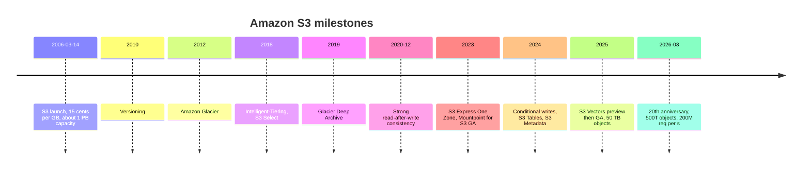

### 1.2 Five factors behind standardization

| Factor                        | Details                                                                                     | Why it worked                                                             |
| ----------------------------- | ------------------------------------------------------------------------------------------- | ------------------------------------------------------------------------- |
| First mover                   | 2006, earlier than GCS (2010) and Azure Blob (2008 preview / 2010 GA)                       | S3 became the first mental model of "a place for files in the cloud"      |
| Simple API                    | Bucket + key + HTTP verbs (PUT/GET/DELETE/LIST)                                             | Anyone can implement it, and anyone can write a client                    |
| Strict backward compatibility | AWS says "S3 code written in 2006 still runs today without changes"                         | Investment in tools and knowledge does not go stale                       |
| SDK and tooling ecosystem     | AWS SDKs for every language, boto3, rclone, s3fs, Hadoop S3A, Spark, DuckDB, Arrow, Iceberg | "Supports S3 = supports tools worldwide"                                  |
| An "S3-compatible" market     | Ceph RGW, MinIO, R2, B2, Wasabi, various on-prem products                                   | Network effect: the more compatible vendors, the more valuable the S3 API |

### 1.3 The "S3-compatible" category

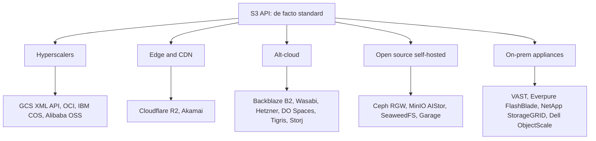

Interestingly, **Azure Blob alone sticks to its own API**. Microsoft's strategy is to keep things inside its own ecosystem (ADLS Gen2 + Fabric), and it sees no need to align with the S3 API.

**Author's assessment**: standardization of the S3 API has brought users a big benefit (portability), but **the authority over the spec belongs to AWS alone**. Every time AWS ships a new API (conditional writes, S3 Tables, S3 Vectors), compatible vendors are forced to follow. Germany's heise, in its 20th-anniversary commentary, described S3 as "an industry standard dominated by AWS = the golden cage of the cloud era". It is a textbook case of the standard's owner benefiting most.

### 1.4 The economic value of being the standard

Owning the standard API gives AWS the following structural advantages.

- **Monopoly on learning cost**: the first object storage new engineers learn is S3. `aws s3 cp` and boto3 are effectively the textbook.
- **Compatible vendors do AWS's sales work**: vendors that call themselves "S3-compatible" introduce S3 as the reference every time they explain their own product. S3 is always what comes to mind as the point of comparison.
- **First-mover advantage on new features**: new APIs such as conditional writes and S3 Tables are available on AWS first, and compatible vendors follow months to years later. The latest OSS (Iceberg commits, diskless Kafka, etc.) runs on AWS first.
- **Lock-in that is hard to see**: because the API is standardized, it feels like "you can leave any time", but in practice integration with IAM, event wiring, and analytics services, plus egress, become switching costs.

Conversely, the benefit to users is that **you can change where your data lives with almost no changes to application code**. 37signals was able to move about 6 PB to its own FlashBlade "almost drop-in" because the S3 API was the standard (Chapter 9).

## 2. Market data

### 2.1 Cloud infrastructure market share (Synergy Research Group)

Synergy's definition is IaaS + PaaS + hosted private cloud. It cannot be compared directly with the "cloud" revenue in each company's earnings (which may include SaaS).

| Quarter | Market size ($B) | AWS | Microsoft | Google | Others | Notes                                                    |
| ------- | ---------------- | --- | --------- | ------ | ------ | -------------------------------------------------------- |
| 2025 Q2 | 98.8             | 30% | 20%       | 13%    | 37%    | Per-company shares from secondary reports citing Synergy |
| 2025 Q3 | 106.9            | 29% | 20%       | 13%    | 38%    |                                                          |
| 2025 Q4 | 119.1            | 28% | 21%       | 14%    | 37%    | Some reports put Google at 15%                           |
| 2026 Q1 | 128.6            | 28% | 21%       | 14%    | 37%    | Oracle 4%, neoclouds combined 5%                         |
| 2026 Q2 | 143              | 28% | 20%       | 15%    | 37%    | +43% YoY, highest growth rate in 8 years                 |

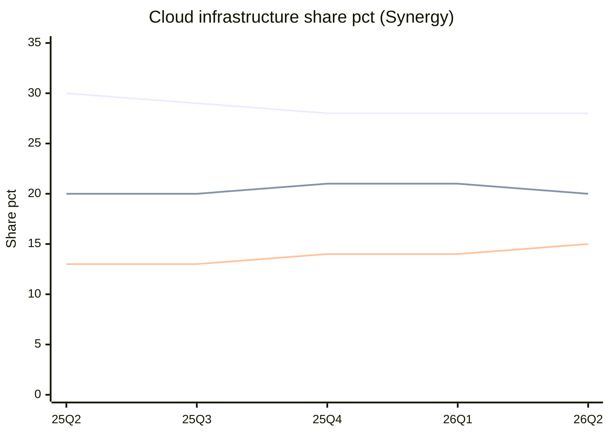

From top: AWS / Microsoft / Google.

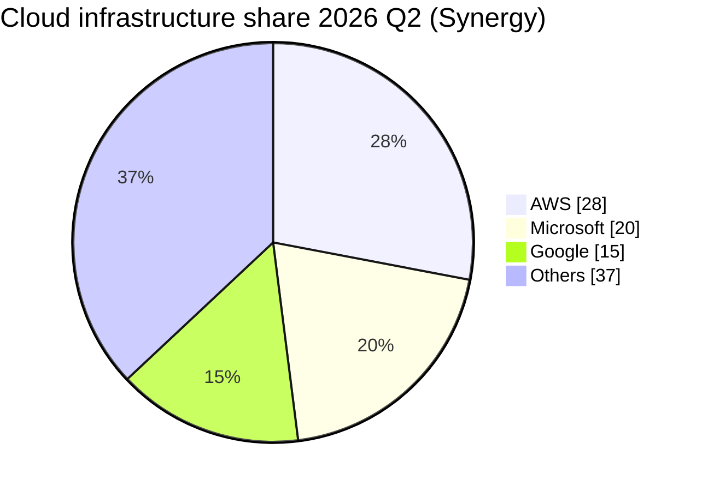

How to read it:

- **AWS is losing share while its revenue accelerates**. The overall market is growing more than 40% a year, so even 37% growth leaves AWS's share flat to slightly down.
- Within "Others", Synergy highlights the rapid growth of CoreWeave, OpenAI, Oracle, Crusoe, Nebius, Anthropic, and others. **The rise of GPU neoclouds** is reigniting the debate over "where to put" training data (see below).
- According to Synergy's John Dinsdale, AWS's share fell from over 32% in 2021 to just under 30% on average over the most recent four quarters (comment as of Q3 2025).

### 2.2 AWS revenue

| Quarter | AWS revenue ($B) | YoY    | AWS operating income ($B) |
| ------- | ---------------- | ------ | ------------------------- |
| 2025 Q2 | 30.9             | +17.5% | 10.2                      |
| 2025 Q3 | 33.0             | +20%   | 11.4                      |
| 2025 Q4 | 35.6             | +24%   | 12.5                      |
| 2026 Q1 | 37.6             | +28%   | 14.2                      |
| 2026 Q2 | 42.2             | +37%   | 16.6                      |

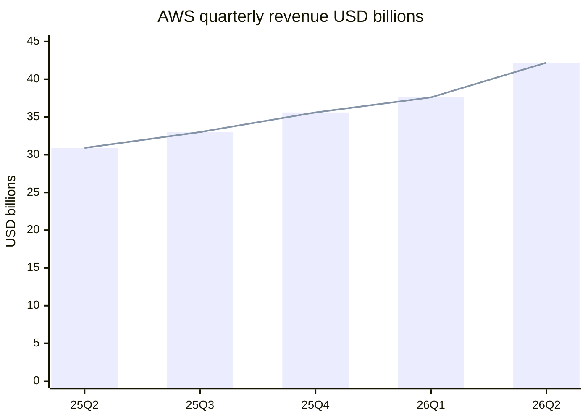

- Full-year 2025 AWS revenue was **$128.7B (+20%)**.
- As of Q2 2026, the **annualized run rate is $169B** and the backlog is $496B (Amazon earnings release / call). Operating margin is in the 39% range.
- **S3 revenue alone is not disclosed**. If you see a figure like "S3 revenue is X% of AWS", it is an estimate, so check the source.

### 2.3 Object storage market size (comparing estimates)

Each research firm uses a different definition (cloud services only / software / including hardware), so **estimates for the same year differ by more than 10x**.

| Source                    | Definition                    | Base-year value | Forecast                     | CAGR                |
| ------------------------- | ----------------------------- | --------------- | ---------------------------- | ------------------- |
| Research and Markets      | Cloud Object Storage          | 2025: $9.44B    | 2026: $10.97B, 2030: $18.79B | 14.4% for 2026-2030 |
| Strategic Market Research | Object-based storage          | 2024: $9.7B     | 2030: $19.8B                 | 12.4%               |
| Mordor Intelligence       | Object-based storage (narrow) | 2025: $1.67B    | 2030: $2.74B                 | 10.41%              |
| IndustryARC               | Object based storage          | 2023: $2.8B     | 2030: $7B                    | 12%                 |
| Market Data Forecast      | Object-based storage          | 2024: $7.60B    | 2033: $23.76B                | 13.5%               |

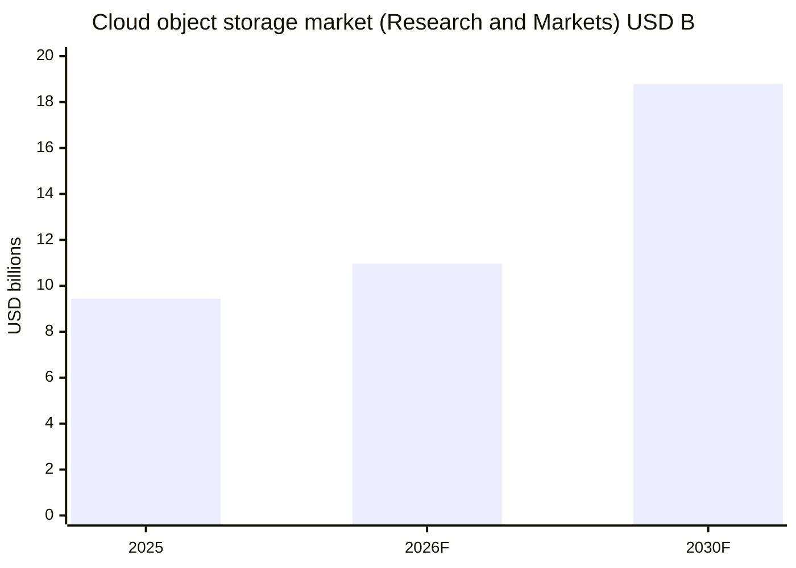

**Author's take**: none of these numbers capture "the huge reality that is S3" well. AWS does not disclose S3 revenue, so research firms have to rely on estimates. For a gut-level sense of scale: **S3 stores hundreds of EB**, and if, say, 300 EB were billed at an average of $0.01/GB-month (an assumed tier mix), that would be $3B a month, or about $36B a year. That is larger than any market size in the table above. This calculation is **the author's estimate based on assumptions**, not a well-founded figure, but it is worth pointing out that "the numbers in market research reports are likely underestimates".

### 2.4 S3 scale (AWS published figures)

| Metric                                               | Value                                                                                | As of       | Source                    |
| ---------------------------------------------------- | ------------------------------------------------------------------------------------ | ----------- | ------------------------- |
| Stored objects                                       | More than 500 trillion                                                               | 2026-03     | AWS 20th-anniversary blog |
| Requests                                             | More than 200 million per second                                                     | 2026-03     | Same as above             |
| Stored data                                          | Hundreds of EB                                                                       | 2026-03     | Same as above             |
| Footprint                                            | 39 Regions / 123 AZs                                                                 | 2026-03     | Same as above             |
| Maximum object size                                  | 50 TB (5 GB at launch)                                                               | 2025-12     | re:Invent 2025            |
| Unit price                                           | $0.15/GB → just over 2 cents (about 85% lower)                                       | 2006 → 2026 | AWS 20th-anniversary blog |
| Cumulative customer savings from Intelligent-Tiering | More than $6B                                                                        | 2026-03     | Same as above             |
| S3 Vectors (July-December 2025)                      | More than 250,000 indexes, more than 40 billion vectors, more than 1 billion queries | 2025        | Same as above             |
| Configuration at launch                              | About 1 PB, about 400 nodes, 15 racks, 3 DCs, 15 Gbps total bandwidth                | 2006        | Same as above             |

For reference, AWS cited "more than 350 trillion objects and more than 100 million requests per second" in its S3 Express One Zone GA press release (2023-11-28). The 100 million requests per second figure goes back to Pi Day 2022, and "more than 400 trillion objects" first appeared in 2024-12. From 2023-11 to 2026-03 (about 2 years and 4 months), objects grew about 1.4x and requests 2x, so growth has not slowed.

### 2.5 Analyst assessments

- **Gartner Magic Quadrant for Strategic Cloud Platform Services (2025-08-04)**: AWS has been a Leader for 15 consecutive years and is placed highest on Ability to Execute. The Leaders are AWS / Google / Microsoft / Oracle.
- **Gartner Enterprise Storage Platforms MQ (2025-09-02)**: from 2025, Primary Storage and File and Object Storage were merged. The Leaders are Dell / HPE / Huawei / IBM / NetApp / Pure Storage (now Everpure). **Public cloud S3 itself is out of scope**. In other words, S3 is not evaluated in "the MQ for object storage products"; it is treated as "part of a platform" beyond any product category.
- IDC sells file- and object-based storage market data and cloud storage service vendor share (split by file / block / object) only in paid reports and trackers. No public S3-only or object-storage-only share figures from IDC or Canalys were found, so those figures remain **unverified**. Canalys publishes overall cloud infrastructure share, but its definition differs from Synergy's (Synergy is part of TechInsights as of 2026).

## 3. S3 in data platforms

### 3.1 The "bottom" of the lakehouse

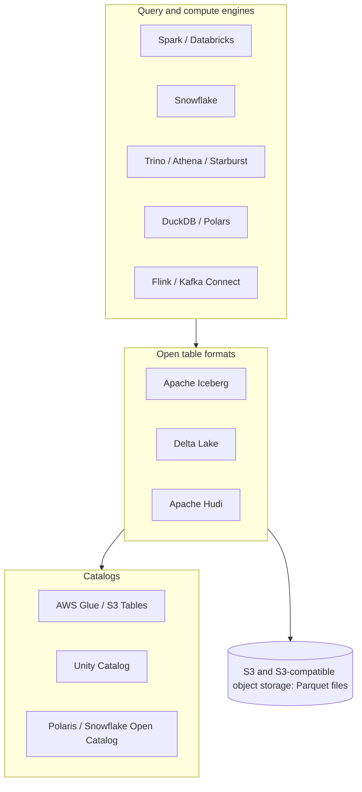

- **Databricks**: championed the lakehouse concept. On AWS, it stores data (Delta / Iceberg) in the customer's S3 buckets and separates compute. In 2024 it acquired Tabular, the company founded by Iceberg's creators, and is driving the convergence of Delta and Iceberg.
- **Snowflake**: traditionally stored data in a proprietary format in internal storage (actually S3, etc.), but now offers external stages (reading files on S3) and **Iceberg tables** (written as Iceberg into the customer's S3). This is a response to pressure for openness.
- **AWS S3 Tables (2024-12)**: S3 itself offers Iceberg tables as "a kind of bucket" and automates maintenance such as compaction. **A storage provider moving up into the table-format layer** is a major shift. Cloudflare (Basin Catalog) and Google (BigLake) are heading the same way.

**What it means**: Hadoop/HDFS in the 2010s put "compute and storage on the same nodes". S3 separated them, and in the 2020s "S3 + an open table format + any engine" became the standard shape. **The center of data gravity moved from DWH vendors to S3**.

### 3.2 S3 in AI/ML

| Use case                  | How S3 is used                                           | Related features                                                 |
| ------------------------- | -------------------------------------------------------- | ---------------------------------------------------------------- |
| Training datasets         | Massively parallel reads of Parquet / WebDataset / JSONL | Mountpoint for S3, S3 Connector for PyTorch, S3 Express One Zone |
| Checkpoints               | Periodic writes of hundreds of GB to TB                  | Multipart upload, Express One Zone (low latency)                 |
| Model weight distribution | Bulk download when inference nodes start                 | CloudFront; Tigris / R2 elsewhere                                |
| RAG / vectors             | Storing and searching embedding vectors                  | S3 Vectors (GA 2025-12, up to 2 billion vectors per index)       |
| Logs and evaluation data  | Accumulating inference logs and evaluation results       | Lifecycle, Intelligent-Tiering                                   |

**Tension with GPU neoclouds**: when you train on GPU clouds such as CoreWeave / Nebius, data that lives in S3 incurs egress every time. This is a tailwind for the neoclouds' own storage (S3-compatible, such as VAST) and for egress-free storage like R2. Backblaze entered a Master Strategic Agreement with CoreWeave effective 2026-06-16, with an estimated total contract value of about $335M over the initial order forms (5- and 7-year terms), per its 8-K.

### 3.3 Concepts S3 established in the industry

| Concept                       | Introduced in S3                | Industry spillover                                                                                                                        |
| ----------------------------- | ------------------------------- | ----------------------------------------------------------------------------------------------------------------------------------------- |
| Flat bucket + key namespace   | At launch in 2006               | The understanding that "directories are just prefixes" became common. Commit protocols such as Hadoop S3A were redesigned on this premise |
| Presigned URLs                | From the start                  | The standard design for direct uploads from browsers/mobile. R2 and GCS have equivalent features                                          |
| Storage classes and Lifecycle | From Glacier in 2012 onward     | Tiering that "prices by access frequency" became a standard menu item across cloud storage                                                |
| Eleven nines (99.999999999%)  | As the durability design target | Competitors adopted the same number, making it the industry's common language for durability                                              |
| Event-driven (S3 → Lambda)    | Around Lambda's launch in 2014  | The prototype of serverless "process a file when it lands". GCS → Pub/Sub and R2 → Queues follow the same pattern                         |
| Object Lock (WORM)            | 2018                            | Immutable backups against ransomware became a must-have for S3-compatible storage                                                         |
| Tables / vectors on storage   | 2024-2025                       | The starting point of competition where "storage providers offer up to the database layer"                                                |

**Key point**: new S3 features tend to become industry standards 2-5 years later. When reading a compatible vendor's feature list, a useful yardstick for maturity is "how many years behind S3 is the newest S3 feature it supports?"

## 4. "S3 as database": impact on architecture

### 4.1 What is happening

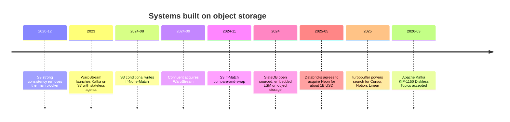

### 4.2 Representative systems

| System                                  | Type                        | How it uses S3                                                                               | Significance                                                                                                                        |
| --------------------------------------- | --------------------------- | -------------------------------------------------------------------------------------------- | ----------------------------------------------------------------------------------------------------------------------------------- |
| WarpStream                              | Kafka-compatible streaming  | Makes brokers stateless and writes all data directly to S3                                   | Cuts cross-AZ replication charges. Acquired by Confluent in 2024-09 (IBM reportedly completed its acquisition of Confluent in 2026) |
| Apache Kafka Diskless Topics (KIP-1150) | Kafka itself                | Writes messages directly to object storage; broker disks act as cache                        | Accepted on 2026-03-02. The implementation KIPs (1163/1164) are under discussion and not GA as of 2026-08                           |
| Neon                                    | Serverless Postgres         | Persists WAL via Safekeepers and pages via Pageservers to S3                                 | Separates storage and compute; branches are created instantly. Acquired by Databricks for about $1B                                 |
| turbopuffer                             | Vector + full-text search   | S3 as the primary store, NVMe and memory as cache tiers                                      | Over an order of magnitude cheaper than the "keep the whole vector DB in memory" model. Relies on S3 strong consistency and CAS     |
| SlateDB                                 | Embedded KV (LSM)           | Writes everything, including the WAL, to object storage                                      | "Bottomless" storage, Apache 2.0                                                                                                    |
| LanceDB / Lance                         | Vector DB / columnar format | Queries Lance files on S3 directly                                                           | Aimed at multimodal AI data                                                                                                         |
| Iceberg / Delta                         | Table formats               | Keeps all metadata and data on S3; commits are arbitrated by conditional writes or a catalog | Rebuilds the DWH on top of S3                                                                                                       |

### 4.3 Why now

1. **Strong consistency (2020-12)**: reads and lists right after a write became correct, so "metadata on S3" became trustworthy.
2. **Conditional writes (2024)**: `If-None-Match: *` (write only if absent) and `If-Match: <ETag>` (write only if unchanged) made leader election and commit arbitration possible without an external lock service (DynamoDB, etc.).
3. **Economics**: on AWS, cross-AZ transfer is billed, but writes to S3 incur no cross-AZ transfer charge. Writing once to S3 is often cheaper than Kafka replicating disks across 3 AZs.
4. **S3 Express One Zone**: single-digit millisecond latency loosened the constraint that "S3 is too slow for the hot path".

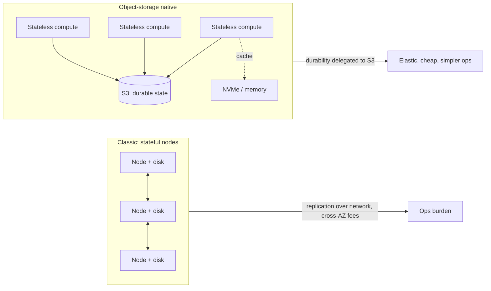

**Author's opinion**: this means more than "S3 became the cheapest disk". The hardest parts of a distributed system, durability (11 nines) and replication, are outsourced to S3, and you only need to build "cache and compute". The price is that you must design around **latency (tens of ms) and per-request charges**. At $0.005 per 1,000 PUTs, writing 1,000 objects per second costs close to $13,000 a month. "S3 as database" is an architecture that tests your skill at batching (grouping writes).

## 5. Outages and their industry impact

### 5.1 Major incidents

| Date             | Scope                               | Cause                                                                                                                                                              | Duration                                                                                         | Lesson for the industry                                                                                   |
| ---------------- | ----------------------------------- | ------------------------------------------------------------------------------------------------------------------------------------------------------------------ | ------------------------------------------------------------------------------------------------ | --------------------------------------------------------------------------------------------------------- |
| 2008-07-20       | S3 (US/EU)                          | Message corruption (a single-bit error) in server-to-server gossip polluted state propagation                                                                      | About 8 hours (contemporary reports)                                                             | Reliability issues of the early cloud; the importance of checksums                                        |
| 2017-02-28       | S3 us-east-1                        | While debugging the billing system, an operator mistyped a command input and removed more servers than intended. The index and placement subsystems had to restart | 9:37-13:54 PST, about 4 hours 17 minutes                                                         | "Half the internet went down". AWS's own Service Health Dashboard depended on S3 and could not be updated |
| 2025-10-19 to 20 | us-east-1 (originating in DynamoDB) | A race condition in DynamoDB's DNS automation (Planner/Enactor) left the endpoint's DNS record empty                                                               | DNS about 3 hours; full recovery about 14-15 hours due to knock-on effects on EC2/NLB and others | Not an S3 outage itself, but it exposed the chain of internal dependencies in us-east-1                   |

### 5.2 The 2017 S3 outage in detail

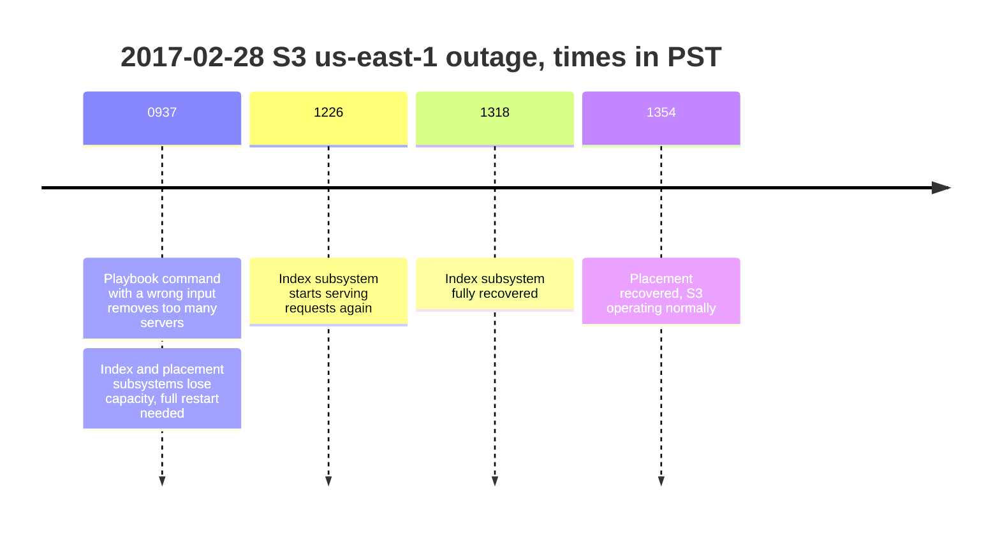

From AWS's post-event summary:

- "An authorized S3 team member using an established playbook executed a command... one of the inputs to the command was entered incorrectly and a larger set of servers was removed than intended."
- The index and placement subsystems **had not been fully restarted for many years**, and restarting took longer than expected.
- Remediation: slowed down capacity removal and added safeguards that refuse removals taking a subsystem below its minimum required capacity. Prioritized partitioning the index subsystem into smaller "cells". Changed the Service Health Dashboard to run across multiple Regions.

**Industry impact**: this outage made "multi-Region design" and "cell-based architecture" common sense in the industry. The lesson to **not host dashboards and status pages on the same platform they monitor** is still told in many SRE teams today.

### 5.3 The October 2025 us-east-1 outage

- It started with a race condition in DynamoDB's DNS management: a delayed Enactor applied a stale plan, and another Enactor's cleanup process deleted that plan, removing the IP addresses for `dynamodb.us-east-1.amazonaws.com` from Route 53.
- AWS internal services that depend on DynamoDB (such as DropletWorkflow Manager, which manages EC2 instances) degraded in a cascade, which spread all the way to NLB health check failures.
- Snapchat, Fortnite, Ring, Roblox, Coinbase, Signal, Slack, and others were reported as affected.
- **Relation to S3**: based on public information, S3 was not the primary cause. However, the structure of "us-east-1 as the concentration point of AWS's own control plane" is the same as in 2017, and the risk that **S3 users with single-Region designs get caught in the blast radius** has not changed.
- AWS disabled the DNS Planner/Enactor automation worldwide and committed to fixes and additional safeguards.

### 5.4 Lessons

1. **us-east-1 is a special Region**. It is the oldest and largest, and the control planes of global services are concentrated there. Do not put critical workloads only in us-east-1.
2. **S3 durability (11 nines) and availability (99.99% design for Standard) are different things**. Even if data is not lost, it can be unreadable for hours.
3. **Cross-Region Replication + application-side failover** is the only effective countermeasure. Multi-Region Access Points are also an option.

## 6. Regulation: data sovereignty and egress fees

### 6.1 Timeline

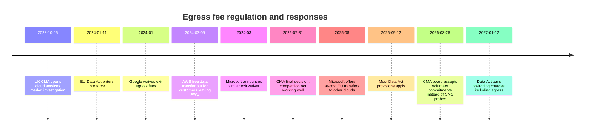

### 6.2 EU Data Act

| Period                   | Treatment of switching charges                                                                      |
| ------------------------ | --------------------------------------------------------------------------------------------------- |
| 2024-01-11 to 2027-01-12 | Allowed, but capped at the provider's direct costs (egress, etc.) and disclosed before the contract |
| From 2027-01-12          | Article 29 bans switching charges (including egress) for the switching process                      |

- It covers IaaS / PaaS / SaaS **provided to EU customers**. It can apply even if the Region is in the US, as long as the customer is in the EU.
- **Everyday egress (delivery to users, cross-Region replication) is out of scope**. Running multiple clouds in parallel is also generally interpreted as "operations" and out of scope.
- Standard service fees and early termination penalties remain. Note that **the remaining balance of committed-spend contracts remains a de facto lock-in**.

### 6.3 UK CMA

- It opened the market investigation on 2023-10-05 and issued its **final decision on 2025-07-31**: competition in the UK cloud market is not working well.
- In IaaS, Microsoft and AWS each hold a 30-40% share (2024), and Google 5-10%.
- **It identified egress fees as a major commercial barrier to switching and multi-cloud**. The impact is larger for smaller customers and customers with large volumes of data.
- It also found that Microsoft's licensing practices (Microsoft software costs more on other clouds) hinder competition.
- The recommendation was to "prioritize Strategic Market Status (SMS) investigations into AWS and Microsoft", but **on 2026-03-25 the CMA board decided not to open SMS investigations and instead accepted voluntary commitments from both companies (on egress fees and interoperability)** (announced 2026-03-31). These are non-binding promises, and industry groups have called for stronger monitoring.

### 6.4 AWS's response

- **2024-03-05**: AWS made internet egress free for customers moving from AWS to another IT provider (worldwide, all Regions). It applies when moving all data (or all data of a given service), requires a request to Support, and the migration must be completed within 60 days of the credit being granted. CloudFront / Direct Connect / Snow / Global Accelerator are excluded.
- 37signals has stated that in its 2025 exit from S3, this program waived about $250k in egress (Chapter 9).
- The regular free tier is 100 GB per month (aggregated across all services and Regions). The S3 pricing page states that "under the EU Data Act, EU customers can request discounted rates for eligible use cases".

**Author's opinion**: the regulation targets only the "exit", and **everyday egress, the real core, is untouched**. The structure of paying egress every month for delivery and analytics will not change after 2027. If anything, by standardizing "free when leaving", the regulation has made it easier for hyperscalers to argue "it is not lock-in because you can leave". It is realistic to see the practical benefit to users as roughly "more leverage in negotiations".

## 7. SWOT analysis (S3)

|          | Positive                                                                                                                                                                                                                                                                                          | Negative                                                                                                                                                                                                                                                   |
| -------- | ------------------------------------------------------------------------------------------------------------------------------------------------------------------------------------------------------------------------------------------------------------------------------------------------- | ---------------------------------------------------------------------------------------------------------------------------------------------------------------------------------------------------------------------------------------------------------- |
| Internal | **Strengths**: owner of the API standard / 20 years of backward compatibility / a track record of 500 trillion objects and an 11-nines design / the widest range of storage classes / integration with all AWS services / fast feature expansion through S3 Tables, Vectors, and Express          | **Weaknesses**: egress at $0.09/GB / complex billing dimensions / hot-tier unit price about 3x that of alt-clouds / structural concentration in us-east-1 / low transparency since S3 revenue alone is not disclosed                                       |
| External | **Opportunities**: the explosion of AI training and inference data / lakehouse standardization (Iceberg) / S3 becoming the primary store through "S3 as database" / generalization of vector search / economies of scale amid 2026 hardware price spikes (alt-clouds raise prices, S3 holds them) | **Threats**: egress regulation (EU Data Act, CMA) / zero-egress players such as R2 / GPU neoclouds' own storage / 37signals-style repatriation / data sovereignty (European demand for sovereign clouds) / lower switching costs thanks to compatible APIs |

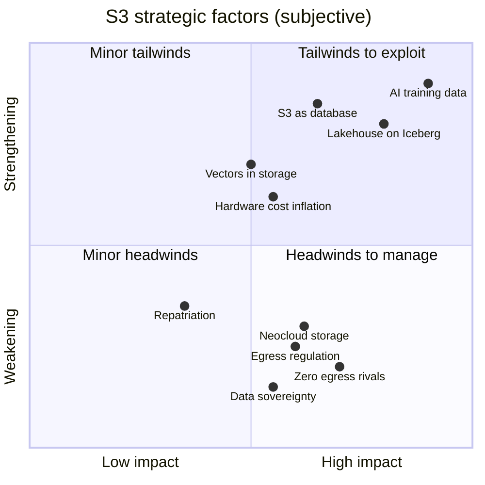

Coordinates are the author's subjective assessment.

## 8. Outlook (2026 and beyond)

### 8.1 Predictions

| Theme                             | Outlook                                                                                                                                                                                     | Confidence (author's view) |
| --------------------------------- | ------------------------------------------------------------------------------------------------------------------------------------------------------------------------------------------- | -------------------------- |
| Storage becoming a "database"     | S3 Tables / Vectors / Metadata keep expanding and the number of "bucket types" grows (general purpose, directory, table, vector...)                                                         | High                       |
| Egress fees                       | Free exit becomes the norm. List prices for everyday egress stay put, handled instead by "off-list price cuts" such as CloudFront bundles and EU discounts                                  | Medium                     |
| Pricing                           | With HDD/NAND price spikes in 2026-2027, alt-clouds raise prices further. Hyperscalers hold standard-tier prices and adjust through minimum storage durations, retrieval fees, and the like | Medium                     |
| Fragmentation of S3 compatibility | The ability to keep up with conditional writes and table/vector APIs makes the differences between compatible vendors clear                                                                 | High                       |
| Going diskless                    | "State in S3, stateless compute" becomes the standard design for Kafka (KIP-1150 implementation), Postgres, search, and time-series DBs                                                     | High                       |
| Self-hosting                      | Ceph, Garage, SeaweedFS, and MinIO forks split the gap left by MinIO. Commercial S3-compatible storage (VAST, Everpure, etc.) grows on AI demand                                            | Medium                     |
| Regulation                        | With the EU Data Act's 2027-01-12 provisions in effect, more "switching" cases originate in Europe. In the UK, the focus is on how well the voluntary commitments are honored               | Medium                     |
| Sovereign cloud                   | Models that place the operating entity inside the EU, such as the AWS European Sovereign Cloud, expand                                                                                      | Medium                     |

### 8.2 Author's conclusion

As of 2026, S3 is no longer an "object storage product" but **"the file system and data bus of the cloud era"**. Competitors may beat S3 on price (especially egress), but they have not caught up on ownership of the API standard, the ecosystem, or 20 years of operational track record.

At the same time, S3's weakness is clear, and it lies not in technology but in its **business model (lock-in through egress)**. Regulation and R2-style competitors are hitting exactly that point. The question for the next five years is "will AWS give up egress revenue to defend its position as the data platform?", and the author expects **AWS to keep everyday egress list prices unchanged and instead thicken the added value on top of S3 (Tables, Vectors, Express) to reduce the "reasons to leave"**.

## 9. Data for the web app

`data/market.json` contains the following (strings are bilingual `{ "en", "ja" }`).

| Key                   | Contents                                                                     | Recommended chart                          |
| --------------------- | ---------------------------------------------------------------------------- | ------------------------------------------ |
| `cloudShare`          | Synergy share and market size, 2025 Q2 to 2026 Q2                            | Line (share trend), donut (latest quarter) |
| `awsRevenue`          | AWS revenue, growth rate, and operating income for the same period           | Bar + line (growth rate)                   |
| `s3Stats`             | S3 scale metrics published by AWS                                            | KPI tiles                                  |
| `objectStorageMarket` | Market size estimates by research firm (`segment` distinguishes definitions) | Bars with a separate series per segment    |
| `notes`               | Caveats about the data                                                       | Footnotes                                  |

## References

- AWS, Twenty years of Amazon S3 and building what's next (2026-03-13): <https://aws.amazon.com/blogs/aws/twenty-years-of-amazon-s3-and-building-whats-next/>
- The Register, AWS S3 turns 20 and reaches hundreds of exabytes (2026-03-16): <https://www.theregister.com/off-prem/2026/03/16/aws-s3-turns-20-and-reaches-hundreds-of-exabytes/5219872>
- heise, 20 Years of Amazon S3: The Golden Cage of the Cloud Era: <https://www.heise.de/en/opinion/20-Years-of-Amazon-S3-The-Golden-Cage-of-the-Cloud-Era-11210907.html>
- ByteByteGo, How Amazon S3 Stores 350 Trillion Objects: <https://blog.bytebytego.com/p/how-amazon-s3-stores-350-trillion>
- AWS, Amazon S3 pricing: <https://aws.amazon.com/s3/pricing/>
- Blocks & Files, AWS piles on S3 upgrades from vector search to 50 TB objects (2025-12-03): <https://blocksandfiles.com/2025/12/03/aws-s3/>
- StorageNewsletter, Amazon S3 Vectors is now generally available (2025-12-05): <https://www.storagenewsletter.com/2025/12/05/aws-reinvent-2025-amazon-s3-vectors-is-now-generally-available-with-40-times-the-scale-of-preview/>
- AWS, Top announcements of AWS re:Invent 2025: <https://aws.amazon.com/blogs/aws/top-announcements-of-aws-reinvent-2025/>
- Synergy Research Group, Q2 Cloud Market Passes $143 Billion (2026-07-30): <https://www.srgresearch.com/articles/q2-cloud-market-passes-143-billion-highest-growth-rate-in-eight-years>
- Synergy Research Group, Q2 Cloud Market Nears $100 Billion Milestone (2025): <https://www.srgresearch.com/articles/q2-cloud-market-nears-100-billion-milestone-and-its-still-growing-by-25-year-over-year>
- Synergy Research Group, Cloud Market Growth Rate Rises Again in Q3 (2025): <https://www.srgresearch.com/articles/cloud-market-growth-rate-rises-again-in-q3-biggest-ever-sequential-increase>
- Synergy Research Group, GenAI Helps Drive Quarterly Cloud Revenues to $119 Billion (Q4 2025): <https://www.srgresearch.com/articles/genai-helps-drive-quarterly-cloud-revenues-to-119-billion-as-growth-rate-jumped-yet-again-in-q4>
- DCD, Synergy: cloud spending hits $129bn in Q1 2026: <https://www.datacenterdynamics.com/en/news/synergy-research-cloud-spending-hits-129bn-in-q1-2026-ninth-consecutive-quarter-of-growth/>
- DCD, Neoclouds gradually increasing CIS market share, as Amazon declines: <https://www.datacenterdynamics.com/en/news/synergy-research-neoclouds-gradually-increasing-cis-market-share-as-amazon-declines/>
- Statista, Big Three Hold Dominant Lead in Accelerating Cloud Market: <https://www.statista.com/chart/18819/worldwide-market-share-of-leading-cloud-infrastructure-service-providers/>
- TechTarget, GenAI drives $119B cloud revenue in Q4: <https://www.techtarget.com/searchcloudcomputing/news/366638805/GenAI-drives-119B-cloud-revenue-in-Q4>
- The Register, AWS under pressure as big three battle (2025-11-20): <https://www.theregister.com/2025/11/20/aws_loses_market_share_azure_google/>
- Amazon, Q2 2026 earnings release: <https://www.aboutamazon.com/news/company-news/amazon-earnings-q2-2026-report>
- Amazon IR, Amazon.com Announces Second Quarter Results (2026): <https://ir.aboutamazon.com/news-release/news-release-details/2026/Amazon-com-Announces-Second-Quarter-Results/>
- Amazon, Q1 2026 earnings release: <https://www.aboutamazon.com/news/company-news/amazon-earnings-q1-2026-report>
- Amazon, Q4 2025 earnings release: <https://www.aboutamazon.com/news/company-news/amazon-earnings-q4-2025-report>
- CNBC, AWS earnings Q1 2026: <https://www.cnbc.com/2026/04/29/aws-earnings-q1-2026.html>
- Research and Markets, Cloud Object Storage Market: <https://www.researchandmarkets.com/report/global-cloud-oss-market>
- Mordor Intelligence, Object-Based Storage Market: <https://www.mordorintelligence.com/industry-reports/object-based-storage-market>
- Strategic Market Research, Object-Based Storage Market: <https://www.strategicmarketresearch.com/market-report/object-based-storage-market>
- IndustryARC, Object Based Storage Market: <https://www.industryarc.com/research/object-based-storage-research-800542>
- Market Data Forecast, Object-Based Storage Market: <https://www.marketdataforecast.com/market-reports/object-based-storage-market>
- AWS, AWS named as a Leader in 2025 Gartner MQ for Strategic Cloud Platform Services: <https://aws.amazon.com/blogs/aws/aws-named-as-a-leader-in-2025-gartner-magic-quadrant-for-strategic-cloud-platform-services-for-15-years-in-a-row/>
- StorageNewsletter, New Enterprise Storage Platforms MQ from Gartner for 2025: <https://www.storagenewsletter.com/2025/09/18/new-enterprise-storage-platforms-mq-from-gartner-for-2025/>
- NetApp, Gartner Magic Quadrant leader 2025: <https://www.netapp.com/blog/gartner-magic-quadrant-leader-2025/>
- AWS, Amazon S3 Availability Event: July 20, 2008: <https://web.archive.org/web/2008/http://status.aws.amazon.com/s3-20080720.html> (archived)
- AWS, Summary of the Amazon S3 Service Disruption (2017): <https://aws.amazon.com/message/41926/>
- The Register, A single DNS race condition brought AWS to its knees (2025-10-23): <https://www.theregister.com/2025/10/23/amazon_outage_postmortem/>
- ThousandEyes, AWS Outage Analysis: October 20, 2025: <https://www.thousandeyes.com/blog/aws-outage-analysis-october-20-2025>
- Forbes, AWS Outage Latest (2025-10-23): <https://www.forbes.com/sites/kateoflahertyuk/2025/10/23/aws-outage-new-analysis-explains-what-went-wrong-and-why/>
- GOV.UK, Cloud services market investigation (CMA case page): <https://www.gov.uk/cma-cases/cloud-services-market-investigation>
- CMA, Summary of final decision (2025-07-31): <https://assets.publishing.service.gov.uk/media/688b20e6ff8c05468cb7b120/summary_of_final_decision.pdf>
- CMA, Final decision report (2025-07-31): <https://assets.publishing.service.gov.uk/media/688b8891fdde2b8f73469544/final_decision_report.pdf>
- CMA, Appendix N: Egress fees: <https://assets.publishing.service.gov.uk/media/67976be7419bdbc8514fde5d/.Appendix_N.pdf>
- Tech Policy Press, UK Regulator Probes Microsoft While Backing Voluntary Cloud Rules: <https://www.techpolicy.press/uk-cloud-regulator-opts-for-voluntary-commitments-launches-microsoft-investigation/>
- Lindahl, New requirements for cloud portability in the EU Data Act: <https://www.lindahl.se/en/latest-news/knowledge/new-requirements-for-cloud-portability-in-the-eu-data-act-practical-implications-for-cloud-service-providers/>
- cloudmagazin, EU Data Act: When Cloud Switching Fees Are Abolished (2026-07-06): <https://www.cloudmagazin.com/en/2026/07/06/eu-data-act-when-cloud-switching-fees-are-abolished-what-cios-need-to-examine/>
- DCD, AWS removes some data transfer fees for customers exiting its cloud: <https://www.datacenterdynamics.com/en/news/aws-removes-some-data-transfer-fees-for-customers-exiting-its-cloud/>
- TechCrunch, Amazon follows Google in announcing free data transfers out of AWS (2024-03-05): <https://techcrunch.com/2024/03/05/amazon-follows-google-in-announcing-free-data-transfers-out-of-aws>
- Network World, Google waives multicloud egress fee in EU ahead of the Data Act deadline: <https://www.networkworld.com/article/4055548/google-waives-multicloud-egress-fee-in-eu-ahead-of-the-data-act-deadline.html>
- Confluent, Confluent acquires WarpStream (2024-09-09): <https://www.confluent.io/blog/confluent-acquires-warpstream/>
- Apache Kafka, KIP-1150: Diskless Topics: <https://cwiki.apache.org/confluence/display/KAFKA/KIP-1150:+Diskless+Topics>
- Aiven, KIP-1150 Accepted, and the Road Ahead: <https://aiven.io/blog/kip-1150-accepted-and-the-road-ahead>
- SoftwareMill, Diskless Kafka: Object Storage, KIP-1150, and Kafka's Future: <https://softwaremill.com/diskless-kafka-object-storage-kip-1150-and-kafkas-future/>
- Databricks, Databricks agrees to acquire Neon: <https://databricks.com/company/newsroom/press-releases/databricks-agrees-acquire-neon-help-developers-deliver-ai-systems>
- CNBC, Databricks is buying database startup Neon for about $1 billion (2025-05-14): <https://www.cnbc.com/2025/05/14/databricks-is-buying-database-startup-neon-for-about-1-billion.html>
- Jason Liu, TurboPuffer: Object Storage-First Vector Database Architecture: <https://jxnl.co/writing/2025/09/11/turbopuffer-object-storage-first-vector-database-architecture/>
- turbopuffer blog: <https://turbopuffer.com/blog/rip-vector-database>
- SlateDB: <https://slatedb.io/>
- SlateDB GitHub: <https://github.com/slatedb/slatedb>
- The New Stack, SlateDB: Bottomless Databases Built on Cloud Object Stores: <https://thenewstack.io/slatedb-bottomless-databases-built-on-cloud-object-stores/>
- Backblaze, Form 8-K (Master Strategic Agreement with CoreWeave, 2026-06-16): <https://www.sec.gov/Archives/edgar/data/0001462056/000162828026044804/blze-20260616.htm>
- Amazon IR, Amazon.com Announces Third Quarter Results (2025): <https://ir.aboutamazon.com/news-release/news-release-details/2025/Amazon-com-Announces-Third-Quarter-Results/default.aspx>
- Amazon, AWS announces general availability of Amazon S3 Express One Zone (2023-11-28): <https://press.aboutamazon.com/2023/11/aws-announces-the-general-availability-of-amazon-s3-express-one-zone>
- AWS, Welcome to AWS Pi Day 2022: <https://aws.amazon.com/blogs/aws/welcome-to-aws-pi-day-2022/>
- Amazon, Amazon S3 expands capabilities with managed Apache Iceberg tables (2024-12-03): <https://press.aboutamazon.com/2024/12/amazon-s3-expands-capabilities-with-managed-apache-iceberg-tables-for-faster-data-lake-analytics-and-automatic-metadata-generation-to-simplify-data-discovery-and-understanding>
- IDC, Storage Software and Cloud Services Tracker (paid): <https://www.idc.com/tracker/showproductinfo.jsp?containerId=IDC_P24761>
