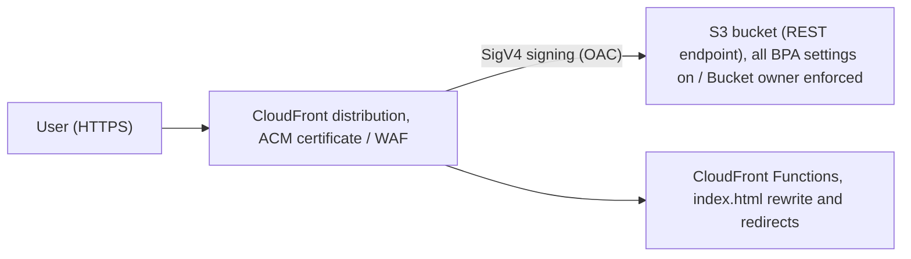
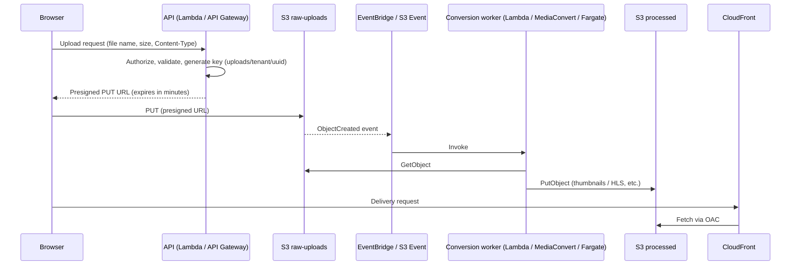
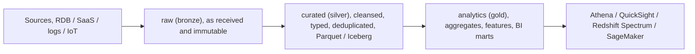
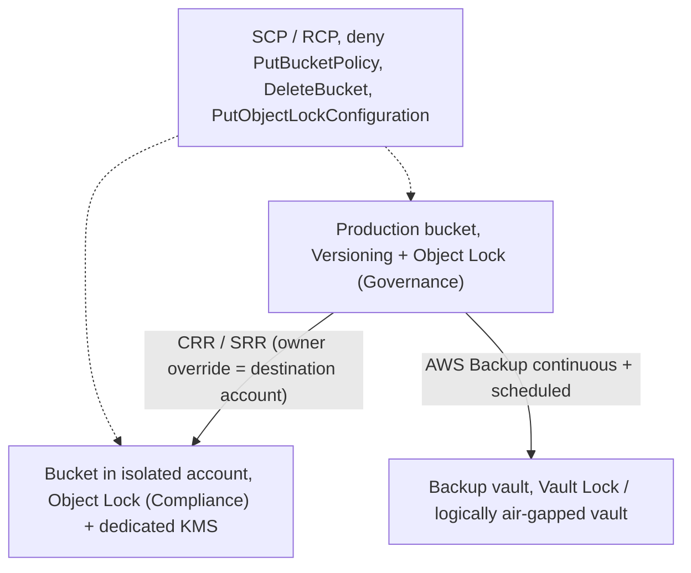
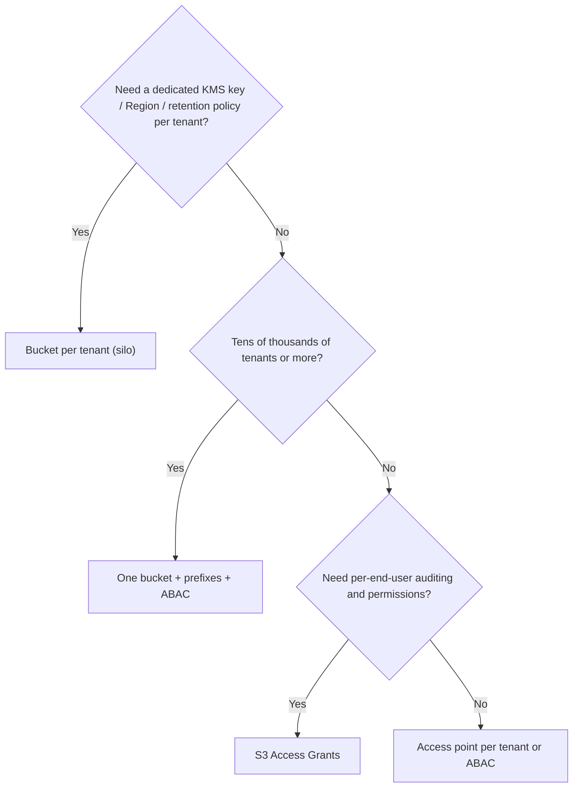
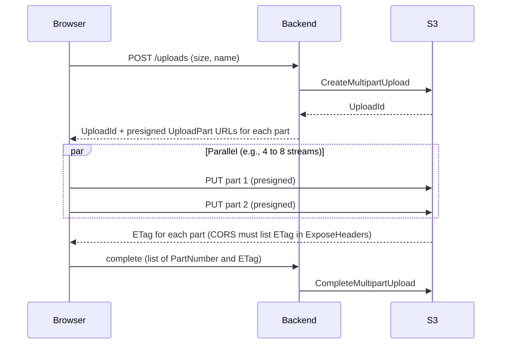

# Architecture patterns and best practices

_Last verified: 2026-10-03_

This chapter covers common architecture patterns that use S3 as a building block, best practices viewed through the AWS Well-Architected Framework, and anti-patterns that show up often in practice. For details on individual features (versioning, replication, lifecycle, and so on), see the relevant chapters. This chapter focuses on how to combine them.

## 0. Overview

Workloads built around S3 fall roughly into five categories.

| Category | Typical patterns                              | Key S3 features                                          |
| -------- | --------------------------------------------- | -------------------------------------------------------- |
| Delivery | Static sites, SPAs, media delivery            | CloudFront + OAC, Block Public Access, Cache-Control     |
| Ingest   | Direct browser uploads, IoT/log collection    | Presigned URLs, multipart upload, Transfer Acceleration  |
| Process  | Media conversion, event-driven ETL            | Event Notifications, EventBridge, Lambda, Step Functions |
| Analyze  | Data lakes, S3 Tables (Iceberg), ML training  | Partition design, Athena, Glue, S3 Express One Zone      |
| Protect  | Log archive, backup/DR, ransomware protection | Versioning, Object Lock, CRR/SRR, AWS Backup             |

```text
                 +-------------------+
   users ------> |  CloudFront (CDN) | --OAC--> [ S3: static assets ]
                 +-------------------+
   browser --(presigned PUT / MPU)--> [ S3: raw uploads ] --event--> Lambda/Step Functions
                                                                   |
                                                                   v
                                      [ S3: processed ] --> [ S3 data lake: raw/curated/analytics ]
                                                                   |
                                     Athena / Glue / EMR / SageMaker
   all accounts --CloudTrail/Config/VPC Flow Logs--> [ Log Archive account: S3 + Object Lock ]
   critical buckets --CRR / AWS Backup--> [ DR region / backup vault ]
```

## 1. Static website hosting

### 1.1 Two approaches

There are two main ways to serve a static site from S3.

| Item                     | Expose the S3 website endpoint directly                                               | CloudFront + OAC + S3 REST endpoint                                                         |
| ------------------------ | ------------------------------------------------------------------------------------- | ------------------------------------------------------------------------------------------- |
| Endpoint format          | `http://bucket.s3-website-region.amazonaws.com` (`s3-website.region` in some Regions) | `https://dxxxx.cloudfront.net` or a custom domain                                           |
| HTTPS                    | Not supported (the website endpoint is HTTP only)                                     | Supported (attach an ACM certificate to CloudFront)                                         |
| Public bucket            | Required (turn off Block Public Access and allow `s3:GetObject` to `Principal: "*"`)  | Not required (the bucket stays fully private)                                               |
| Automatic index.html     | Works in subdirectories too                                                           | Root only (default root object). Handle subdirectories with CloudFront Functions or similar |
| Redirect rules           | Supported via RoutingRules in the website configuration                               | Implement with CloudFront Functions / Lambda@Edge                                           |
| WAF / DDoS protection    | Not available                                                                         | AWS WAF, Shield Standard                                                                    |
| Caching / bandwidth cost | All DataTransfer-Out comes from S3                                                    | Cached at the edge. Data transfer from S3 to CloudFront is free                             |
| Recommendation           | Internal testing and temporary use only                                               | Production standard                                                                         |

As the CloudFront documentation states, when an S3 bucket is configured as a website endpoint, CloudFront cannot use HTTPS to reach the origin (S3 does not support HTTPS in that configuration). In production, the standard setup is to use the REST endpoint as the origin and sign requests with OAC (Origin Access Control).

### 1.2 Recommended OAC setup



The bucket policy grants the CloudFront service principal access only from a specific distribution.

```json
{
  "Version": "2012-10-17",
  "Statement": [
    {
      "Sid": "AllowCloudFrontServicePrincipalReadOnly",
      "Effect": "Allow",
      "Principal": { "Service": "cloudfront.amazonaws.com" },
      "Action": "s3:GetObject",
      "Resource": "arn:aws:s3:::example-site-bucket/*",
      "Condition": {
        "StringEquals": {
          "AWS:SourceArn": "arn:aws:cloudfront::111122223333:distribution/EDFDVBD6EXAMPLE"
        }
      }
    }
  ]
}
```

Key points:

- Keep all four Block Public Access (BPA) settings on. OAC is not public access.
- The legacy OAI (Origin Access Identity) has limits with SSE-KMS and with newer Regions and features, so use OAC for new builds.
- To serve objects encrypted with SSE-KMS, allow `kms:Decrypt` from `cloudfront.amazonaws.com` in the KMS key policy, with an `AWS:SourceArn` condition.
- Requests for keys that do not exist return 403 unless CloudFront has `s3:ListBucket`. To show a 404 page, use a CloudFront custom error response that maps 403/404 to `/404.html`.

### 1.3 SPA (single page application) hosting

In SPAs built with React, Vue, and similar frameworks, client-side routes such as `/users/42` have no matching object in S3. There are two fixes.

| Approach                              | How                                                              | Caveats                                                                              |
| ------------------------------------- | ---------------------------------------------------------------- | ------------------------------------------------------------------------------------ |
| Custom error response                 | In CloudFront, replace 403 and 404 with `/index.html` + HTTP 200 | Missing images and similar also return 200 + HTML, which confuses monitoring and SEO |
| URI rewrite with CloudFront Functions | Rewrite only paths without a file extension to `/index.html`     | Recommended. Missing assets still return a proper 404                                |

```javascript
// CloudFront Functions (viewer request)
function handler(event) {
  var req = event.request;
  // Treat paths without an extension as SPA routes
  if (!req.uri.includes('.')) {
    req.uri = '/index.html';
  }
  return req;
}
```

Standard caching strategy:

| Object                                      | Cache-Control                         | Reason                                                            |
| ------------------------------------------- | ------------------------------------- | ----------------------------------------------------------------- |
| `index.html`                                | `no-cache` or a short `max-age`       | Switch to the new asset references right after a deploy           |
| Hashed files such as `assets/app.3f9a1c.js` | `public, max-age=31536000, immutable` | The file name depends on the content, so it can be cached forever |
| Images and similar                          | Hours to days                         | Depends on how often they change                                  |

Example deploy steps:

1. Upload the hashed assets first (`aws s3 sync dist/assets s3://bucket/assets --cache-control "public,max-age=31536000,immutable"`).
2. Upload `index.html` last.
3. Create a CloudFront invalidation for `index.html` only (`/index.html`).

With this order, users who still have the old `index.html` can fetch the old assets, so they never see a broken page.

## 2. Media processing pipeline

### 2.1 Typical setup

In this pattern, users upload images or videos, and the system generates thumbnails or transcodes them.



### 2.2 Design points

| Topic                | Recommendation                                                                                                                                                                              |
| -------------------- | ------------------------------------------------------------------------------------------------------------------------------------------------------------------------------------------- |
| Key naming           | Generate a UUID or similar on the server. Do not use the user-supplied file name as the key (avoids path-traversal-like values, character encoding issues, and overwrite conflicts)         |
| Overwrite prevention | Use conditional writes based on `If-None-Match: *` when generating the presigned URL, or make keys unique                                                                                   |
| Bucket separation    | Use separate buckets for raw and processed. In a single bucket, "write -> event -> write to the same bucket" can cause an infinite recursive loop                                           |
| Size limits          | A presigned PUT allows up to 5 GiB per request. To enforce a size limit, use the `content-length-range` condition of a presigned POST                                                       |
| Enforce Content-Type | If you include `ContentType` in the signature when generating the presigned URL, the client must send the same header                                                                       |
| Malware protection   | Scan new objects with Amazon GuardDuty Malware Protection for S3 and branch downstream processing on the result tag                                                                         |
| Idempotency          | S3 events are delivered at least once. Make sure the same event delivered more than once produces the same result (for example, derive the output key deterministically from the input key) |
| Large files          | For jobs longer than 15 minutes, use MediaConvert, ECS/Fargate, or AWS Batch instead of Lambda. Routing by size with Step Functions is also common                                          |
| Incomplete MPUs      | Set `AbortIncompleteMultipartUpload` in lifecycle (for example, 7 days) to avoid paying for orphaned parts                                                                                  |

### 2.3 S3 Event Notifications vs. EventBridge

| Item                            | S3 Event Notifications                                                                                                  | Amazon EventBridge                                                                                                                                   |
| ------------------------------- | ----------------------------------------------------------------------------------------------------------------------- | ---------------------------------------------------------------------------------------------------------------------------------------------------- |
| Destinations                    | SNS, SQS (standard queues only), Lambda                                                                                 | Any EventBridge target (Step Functions, SQS, API destinations, etc.)                                                                                 |
| Filtering                       | Prefix / suffix only                                                                                                    | Advanced filters on object size, metadata, key wildcards, etc.                                                                                       |
| Multiple destinations per event | Cannot configure multiple destinations for the same event type with overlapping prefixes (work around with SNS fan-out) | Fan out freely by creating multiple rules                                                                                                            |
| Enabling                        | Per notification configuration                                                                                          | Turn on "Send to EventBridge" on the bucket to get all events                                                                                        |
| Redelivery / archive            | None                                                                                                                    | Archive and replay supported                                                                                                                         |
| Latency                         | Typically seconds, but can sometimes take a minute or longer (per the S3 User Guide; no numeric SLA)                    | No published numeric latency (adds a routing hop). End-to-end delivery latency can be observed with the `IngestionToInvocationSuccessLatency` metric |

## 3. Data lake (zone design)

### 3.1 Zone layout



| Zone               | Format                            | Retention                              | Access                            | Example storage class                     |
| ------------------ | --------------------------------- | -------------------------------------- | --------------------------------- | ----------------------------------------- |
| landing (optional) | Any                               | Days                                   | Ingest jobs only                  | Standard, deleted after a short time      |
| raw                | Original format (JSON, CSV, logs) | Long term (for audit and reprocessing) | Data engineers only               | Standard -> Intelligent-Tiering / Glacier |
| curated            | Parquet / ORC, Apache Iceberg     | Medium to long term                    | Analysts (through Lake Formation) | Standard / Intelligent-Tiering            |
| analytics          | Parquet, Iceberg, S3 Tables       | Depends on use                         | BI, applications                  | Standard                                  |

### 3.2 Implementation points

- Separate buckets per zone let you design bucket policies, encryption keys, lifecycle, and replication per zone. Prefix separation also works, but buckets give a clearer permission boundary.
- Hive-style partitions (`s3://lake-curated/sales/year=2026/month=10/day=03/`) work well with Athena and Glue.
- Avoid creating large numbers of small files. As a guideline, combine Parquet into files of tens to hundreds of MB each. For Iceberg tables, you can use the automatic compaction in S3 Tables.
- Apache Iceberg is the de facto standard table format. S3 Tables (table buckets) has S3 manage Iceberg maintenance (compaction, snapshot management, unreferenced file removal) for you.
- A common split is to enforce column- and row-level permissions with AWS Lake Formation, and on the S3 side allow only the Lake Formation service role.
- Use S3 Inventory or S3 Metadata (journal / live inventory tables) for object inventory and change history instead of repeated LIST calls.

## 4. Log archive (multi-account)

### 4.1 The Log Archive account in Control Tower / Landing Zone

AWS Control Tower creates an S3 bucket in a dedicated Log Archive account under Organizations to collect CloudTrail and AWS Config logs. The standard practice is to extend this and also collect VPC Flow Logs, ALB access logs, S3 server access logs, and so on in the same place.

```text
 Organization
 ├── Management account
 ├── Security (Audit) account  ── GuardDuty / Security Hub delegated administrator
 ├── Log Archive account
 │     └── S3: org-logs-<account>-<region>
 │           ├── AWSLogs/<org-id>/<account-id>/CloudTrail/...
 │           ├── AWSLogs/<account-id>/Config/...
 │           └── vpcflowlogs/ ...
 └── Workload accounts (dev / stg / prod)  ── write logs only
```

### 4.2 Recommended settings

| Setting             | Recommended value                                                                                                       | Reason                                                                         |
| ------------------- | ----------------------------------------------------------------------------------------------------------------------- | ------------------------------------------------------------------------------ |
| Versioning          | Enabled                                                                                                                 | Recover from overwrites and deletes                                            |
| Object Lock         | Compliance or Governance, with a default retention period                                                               | Prevent log tampering. Match audit requirements                                |
| Encryption          | SSE-KMS (dedicated CMK) + S3 Bucket Keys                                                                                | Limit who can decrypt via the key policy. Bucket Keys reduce KMS request costs |
| Bucket policy       | Restrict log sources with `aws:SourceOrgID` or `aws:SourceArn` conditions, and Deny when `aws:SecureTransport` is false | Reject writes from other organizations and plaintext traffic                   |
| Object Ownership    | Bucket owner enforced (ACLs disabled)                                                                                   | Make the bucket owner the object owner even for cross-account writes           |
| Lifecycle           | Glacier Instant/Flexible Retrieval after 90 days, Deep Archive after a few years, expire after the retention period     | Logs are rarely read                                                           |
| Access              | Writes only from service principals, reads only from the security team's role                                           | Least privilege                                                                |
| Deletion protection | Deny bucket policy changes, Object Lock configuration changes, and bucket deletion with SCPs / RCPs                     | Defense in depth against stolen admin credentials                              |

Log workloads produce many small objects. Note that objects smaller than 128 KB are excluded from lifecycle transitions by default (the default behavior since September 2024). Transition costs can exceed the storage savings, so consider aggregating (for example, batching writes with Firehose, or bundling with s3tar).

## 5. Backup and DR

### 5.1 Comparing options

| Option                                   | Protects against                                                            | Typical RPO                                                                      | Main cost                                       | Notes                                                                                             |
| ---------------------------------------- | --------------------------------------------------------------------------- | -------------------------------------------------------------------------------- | ----------------------------------------------- | ------------------------------------------------------------------------------------------------- |
| Versioning                               | Accidental overwrites and deletes                                           | 0 (within the same bucket)                                                       | Storage for old versions                        | Does not protect against bucket, Region, or account failure. Clean up old versions with lifecycle |
| SRR (Same-Region Replication)            | Copies to another account, log aggregation                                  | Seconds to minutes                                                               | Destination storage + requests                  | Delete marker replication is off by default (depends on configuration)                            |
| CRR (Cross-Region Replication)           | Region failure                                                              | Most objects usually within 15 minutes. With RTC, 99.99% within 15 minutes (SLA) | Storage + inter-Region transfer + RTC charges   | Existing objects require Batch Replication                                                        |
| Object Lock                              | Tampering, ransomware deletes or encrypting overwrites                      | —                                                                                | Storage that cannot be deleted during retention | In Compliance mode, not even root can shorten retention                                           |
| AWS Backup for S3                        | Logical corruption, account compromise (copy to a vault in another account) | Any point in time within 35 days with continuous backup (PITR)                   | Backup storage charges                          | Requires versioning. Relies on EventBridge notifications                                          |
| Replica in another account + Object Lock | Full compromise of the production account                                   | Seconds to minutes                                                               | Double storage                                  | Keep permissions for the destination account separate from production                             |

### 5.2 Defense in depth against ransomware



Key points:

1. Keep a copy somewhere an attacker cannot delete it even with admin rights in the production account (another account, Compliance mode, Vault Lock).
2. Deleting or disabling a KMS key has the same effect as destroying the data. Restrict `kms:ScheduleKeyDeletion` / `kms:DisableKey` in the key policy and protect them with SCPs.
3. With SSE-C, AWS does not hold the key, so attackers can use it to overwrite data encrypted with their own key. Since April 2026, AWS has been rolling out a change that disables SSE-C by default for new buckets and for existing buckets with no SSE-C objects. Block SSE-C explicitly with `BlockedEncryptionTypes` to be sure.
4. Use GuardDuty S3 Protection to detect abnormal spikes in `DeleteObject` / `PutObject`.

### 5.3 Multi-Region setups

| Setup                  | How it works                                            | Use case                                                    |
| ---------------------- | ------------------------------------------------------- | ----------------------------------------------------------- |
| Active-passive         | CRR + failover via DNS / application                    | Typical DR                                                  |
| Active-active          | Two-way replication + Multi-Region Access Points (MRAP) | Global low latency, automatic routing during Region failure |
| MRAP failover controls | Switch active/passive routing from the console or API   | Planned switchover, DR drills                               |

With two-way replication, enable "replica modification sync" so that changes to replicas (metadata and so on) are also synced. Write conflicts behave roughly as "last writer wins", so avoid concurrent writes to the same key in the application.

## 6. ML training data and checkpoints

| Challenge                                 | Pattern                                                                                                                                    |
| ----------------------------------------- | ------------------------------------------------------------------------------------------------------------------------------------------ |
| High-throughput reads of training data    | Mountpoint for Amazon S3, S3 Connector for PyTorch, combine data into shards of tens to hundreds of MB (WebDataset tar, TFRecord, Parquet) |
| Many small files (one image = one object) | Shard to cut the number of requests. If you really need per-file objects, use S3 Express One Zone (directory buckets)                      |
| Low latency with compute in the same AZ   | Place S3 Express One Zone in the same AZ as the GPU cluster                                                                                |
| Checkpoint writes                         | Asynchronous, parallel multipart writes (CRT-based client). Delete old checkpoints with lifecycle                                          |
| Existing tools that need a file system    | Amazon S3 Files (EFS-based, mounts an S3 bucket as a file system, GA in 2026) or FSx for Lustre S3 integration                             |
| Storing vector embeddings                 | Amazon S3 Vectors (vector buckets)                                                                                                         |
| Dataset lineage                           | Versioning + object tags, or Iceberg snapshots                                                                                             |

Example checkpoint key design:

```text
s3://ml-checkpoints/run=2026-10-01-llm-a/step=000120000/rank=0007.pt
s3://ml-checkpoints/run=2026-10-01-llm-a/step=000120000/_COMPLETE
```

Write the `_COMPLETE` marker last, and have readers treat the marker's presence as completion (S3 has strong read-after-write consistency, so once the marker is visible, the earlier writes are readable too).

## 7. Multi-tenant SaaS isolation

### 7.1 Comparing isolation models

| Model                           | Setup                                                               | Pros                                                                   | Cons                                                                                   | Best fit                                        |
| ------------------------------- | ------------------------------------------------------------------- | ---------------------------------------------------------------------- | -------------------------------------------------------------------------------------- | ----------------------------------------------- |
| Pool: prefix isolation          | One bucket, `tenants/<tenant-id>/...`                               | Simple, unaffected by bucket quotas                                    | A permission mistake leaks every tenant. Per-tenant KMS / lifecycle takes extra work   | Many small tenants                              |
| Pool + ABAC (session tags)      | One role + `aws:PrincipalTag/tenant` embedded in the resource ARN   | One policy covers all tenants                                          | The auth layer must tag sessions reliably                                              | Many tenants                                    |
| Bridge: access point per tenant | One bucket + an access point per tenant                             | Splits policy per tenant, can restrict to a VPC                        | Access point quota                                                                     | Medium scale                                    |
| Silo: bucket per tenant         | A bucket per tenant (+ dedicated KMS key)                           | Clear isolation, billing, and deletion                                 | Managing bucket count (default 10,000, can be raised), buckets beyond 2,000 are billed | A few large or regulated tenants                |
| Account per tenant              | An AWS account per tenant                                           | Strongest isolation                                                    | High operational cost                                                                  | Dedicated enterprise environments               |
| S3 Access Grants                | Grant prefix-level access to IdP (IAM Identity Center) users/groups | Fine-grained per-user grants, end-user identity recorded in CloudTrail | New concepts to learn, Requests-Tier8 charges                                          | Internal data sharing, per-end-user permissions |

### 7.2 ABAC example with session tags

When a tenant user logs in to the API, the backend calls `sts:AssumeRole` with `Tags=[{Key: tenant, Value: acme}]` to get temporary credentials. One role policy then works for every tenant.

```json
{
  "Version": "2012-10-17",
  "Statement": [
    {
      "Sid": "TenantObjectAccess",
      "Effect": "Allow",
      "Action": ["s3:GetObject", "s3:PutObject", "s3:DeleteObject"],
      "Resource": "arn:aws:s3:::saas-data/tenants/${aws:PrincipalTag/tenant}/*"
    },
    {
      "Sid": "TenantList",
      "Effect": "Allow",
      "Action": "s3:ListBucket",
      "Resource": "arn:aws:s3:::saas-data",
      "Condition": {
        "StringLike": { "s3:prefix": "tenants/${aws:PrincipalTag/tenant}/*" }
      }
    }
  ]
}
```

Notes:

- Allow `sts:TagSession` in the trust policy and validate `aws:RequestTag/tenant` (so the role cannot be assumed with an arbitrary tag value).
- Since November 2025, S3 general purpose buckets also support ABAC themselves (bucket tags evaluated through `aws:ResourceTag`). Enable it with `PutBucketAbac`, then manage bucket tags with `TagResource` / `UntagResource`. In the silo model, you can write a policy that allows access only to buckets whose tenant tag matches.
- For per-tenant cost allocation, use bucket cost allocation tags in the silo model, and S3 Storage Lens prefix aggregation or S3 Inventory / Metadata in the pool model.

### 7.3 Decision flow



## 8. Large uploads from the browser

A single PUT allows up to 5 GiB, and the maximum object size has been 50 TB (48.8 TiB) since December 2025. To send files larger than a few hundred MB from a browser, the standard approach is multipart upload with a presigned URL per part.



Checklist:

| Item                 | Details                                                                                                                                                   |
| -------------------- | --------------------------------------------------------------------------------------------------------------------------------------------------------- |
| Part size            | 5 MiB to 5 GiB (no minimum for the last part). Up to 10,000 parts. On poor connections, use about 8 to 16 MiB to keep retry costs low                     |
| CORS                 | `AllowedMethods: PUT`, `AllowedOrigins` limited to your own site, and `ExposeHeaders: ["ETag"]` is required (without it, browser JS cannot read the ETag) |
| Presigned URL expiry | Keep it short (minutes to 1 hour). If the credentials used for signing expire first, the URL also stops working                                           |
| Resume               | Use `ListParts` to check which parts are already uploaded, then send only the rest                                                                        |
| Integrity            | Use checksums such as `x-amz-checksum-crc32` to detect corruption (include them in the signature for presigned URLs)                                      |
| Cleanup              | Always set `AbortIncompleteMultipartUpload` in lifecycle                                                                                                  |
| Distant users        | Route through CloudFront edges with S3 Transfer Acceleration (you are not charged if it does not speed things up)                                         |

## 9. Event-driven architecture practices

| Practice                         | Reason                                                                                                                                                                                                                         |
| -------------------------------- | ------------------------------------------------------------------------------------------------------------------------------------------------------------------------------------------------------------------------------ |
| S3 -> SQS -> Lambda (or worker)  | Gives you buffering, retries, a DLQ, and concurrency control. Wiring S3 directly to Lambda is simple, but you then need Lambda's async retry settings and a DLQ to cover the risk of losing events to throttling during spikes |
| Idempotent processing            | S3 events are at least once, and duplicates or reordering occasionally happen. Use the `sequencer` field to order events for the same key                                                                                      |
| Prevent recursive loops          | Separate input and output buckets (or prefixes + filters). Lambda also has recursive loop detection, but prevent loops by design                                                                                               |
| Processing many existing objects | Use S3 Batch Operations (Inventory manifest + Lambda invocation) instead of events                                                                                                                                             |
| Analyzing change history         | Query the S3 Metadata journal table with Athena instead of processing individual events                                                                                                                                        |
| Workflows                        | Use Step Functions for multi-step jobs (Distributed Map can process millions of objects in parallel)                                                                                                                           |

## 10. Mapping to the Well-Architected pillars

### 10.1 Security

| Best practice                  | S3 implementation                                                                                                                                    |
| ------------------------------ | ---------------------------------------------------------------------------------------------------------------------------------------------------- |
| Block public access by default | Turn on account-level BPA (new buckets have BPA on by default)                                                                                       |
| Do not use ACLs                | Object Ownership = Bucket owner enforced (the default for new buckets since April 2023)                                                              |
| Encryption                     | SSE-S3 by default (all new objects since January 2023). SSE-KMS + Bucket Keys or DSSE-KMS as required. Block SSE-C                                   |
| Encryption in transit          | Deny when `aws:SecureTransport` = false. Set a minimum TLS version with `s3:TlsVersion` if needed                                                    |
| Least privilege                | Use IAM Access Analyzer to detect external sharing of buckets, analyze unused access, and generate policies                                          |
| Network perimeter              | VPC endpoints (Gateway / Interface) + `aws:SourceVpce`, and data perimeters (`aws:PrincipalOrgID`, `aws:ResourceOrgID`) with SCPs/RCPs/VPCE policies |
| Detection                      | CloudTrail data events, GuardDuty S3 Protection, sensitive data discovery with Macie, AWS Config rules                                               |

### 10.2 Reliability

| Best practice                | S3 implementation                                                                                          |
| ---------------------------- | ---------------------------------------------------------------------------------------------------------- |
| Data protection              | Versioning, Object Lock, AWS Backup                                                                        |
| Region failure               | CRR, MRAP                                                                                                  |
| Retries                      | Use the SDK standard/adaptive retry modes (exponential backoff on 503 SlowDown and 500 InternalError)      |
| Understand single-AZ storage | One Zone-IA and Express One Zone can lose data in an AZ failure. Use them only for data you can regenerate |

### 10.3 Performance efficiency

| Best practice                     | S3 implementation                                                                                                                             |
| --------------------------------- | --------------------------------------------------------------------------------------------------------------------------------------------- |
| Spread request rates horizontally | 3,500 PUT/COPY/POST/DELETE and 5,500 GET/HEAD requests per second per prefix. There is no limit on the number of prefixes, so spread the load |
| Parallelize large objects         | Multipart upload, range GETs, CRT-based SDK / Transfer Manager                                                                                |
| Low latency                       | S3 Express One Zone, CloudFront caching                                                                                                       |
| Long-distance transfer            | Transfer Acceleration                                                                                                                         |
| Scale gradually                   | Ramp up gradually before a sharp traffic increase (gives S3 time to split internal partitions)                                                |

### 10.4 Cost optimization

| Best practice           | S3 implementation                                                                                                                 |
| ----------------------- | --------------------------------------------------------------------------------------------------------------------------------- |
| Unknown access patterns | S3 Intelligent-Tiering (objects under 128 KB are not monitored and always pay the Frequent Access rate)                           |
| Data that clearly ages  | Lifecycle transitions: Standard-IA -> Glacier Instant Retrieval -> Glacier Flexible Retrieval -> Deep Archive                     |
| Delete unneeded data    | Expire noncurrent versions, remove expired delete markers, abort incomplete MPUs                                                  |
| Visibility              | S3 Storage Lens, Cost Explorer (by usage type), CUR 2.0 + Athena                                                                  |
| Data transfer           | Deliver through CloudFront, process within the same Region, use Gateway VPC endpoints (avoid NAT Gateway data processing charges) |
| KMS costs               | Reduce KMS API calls with S3 Bucket Keys                                                                                          |

### 10.5 Operational excellence

| Best practice     | S3 implementation                                                                             |
| ----------------- | --------------------------------------------------------------------------------------------- |
| IaC               | Manage bucket settings declaratively with CloudFormation / CDK / Terraform                    |
| Monitoring        | CloudWatch request metrics (paid, per filter), Storage Lens, DLQs for failed events           |
| Auditing          | CloudTrail (management events by default, data events must be configured), server access logs |
| Change management | Detect configuration drift with AWS Config, Security Hub S3 controls                          |

### 10.6 Sustainability

| Best practice             | S3 implementation                                                                                                                                                                                                                                                                |
| ------------------------- | -------------------------------------------------------------------------------------------------------------------------------------------------------------------------------------------------------------------------------------------------------------------------------- |
| Do not keep unneeded data | Lifecycle expiration, deduplication                                                                                                                                                                                                                                              |
| Right storage class       | The Well-Architected Sustainability pillar (SUS 4) recommends moving data to "more efficient, less performant storage" as requirements decrease (lifecycle to IA / Glacier tiers). Per-storage-class energy figures are unverified: no AWS publication of such numbers was found |
| Efficient formats         | Compression and columnar formats (Parquet) reduce scan and storage volume                                                                                                                                                                                                        |
| Reduce transfer           | Caching, same-Region processing                                                                                                                                                                                                                                                  |

## 11. Naming and tagging conventions

### 11.1 Bucket names

Bucket names live in a global namespace (unique within a partition) and must be 3 to 63 characters of lowercase letters, numbers, hyphens, and dots. Since March 2026, the account regional namespace is available: if you create a bucket with an account-specific suffix such as `mybucket-123456789012-us-east-1-an`, no other account can take that name (`x-amz-bucket-namespace: account-regional` header, or the `bucketNamespace` property in CDK / CloudFormation).

| Recommendation                                                 | Reason                                                                                                                              |
| -------------------------------------------------------------- | ----------------------------------------------------------------------------------------------------------------------------------- |
| A convention such as `<org>-<env>-<system>-<purpose>-<region>` | The purpose is clear at a glance                                                                                                    |
| Use the account regional namespace                             | Avoids name squatting (bucket squatting) and third parties re-creating the same name after you delete a bucket                      |
| Do not use dots                                                | With virtual-hosted style + HTTPS, the wildcard certificate does not match and TLS fails. Transfer Acceleration is also unavailable |
| Do not include sensitive information                           | Bucket names can be exposed externally through DNS and similar                                                                      |

### 11.2 Object keys

| Recommendation                                                                     | Reason                                                                          |
| ---------------------------------------------------------------------------------- | ------------------------------------------------------------------------------- |
| Organize hierarchically by date or tenant (`app/tenant=acme/2026/10/03/uuid.json`) | Useful as filters for lifecycle, permissions, and analytics                     |
| Spread at the top level for high throughput                                        | Avoids the per-prefix request rate limit                                        |
| Stick to safe ASCII characters                                                     | `&`, `$`, `@`, `=`, `;`, `+`, spaces, and non-ASCII cause URL encoding problems |
| Do not rely on zero-byte objects ending in `/`                                     | Console "folders" are just a way of displaying key delimiters                   |

### 11.3 Tags

| Type                          | Example                                           | Use                                                                                                  |
| ----------------------------- | ------------------------------------------------- | ---------------------------------------------------------------------------------------------------- |
| Bucket tags (cost allocation) | `CostCenter=1234`, `Project=atlas`, `Env=prod`    | Cost allocation in Cost Explorer. Must be activated as cost allocation tags                          |
| Bucket tags (ABAC)            | `tenant=acme`, `data-classification=confidential` | Permission control with `aws:ResourceTag` conditions                                                 |
| Object tags                   | `retention=7y`, `malware-scan=clean`              | Lifecycle filters, `s3:ExistingObjectTag` conditions (up to 10 per object, TagStorage charges apply) |

## 12. IaC baseline

To avoid rethinking every new bucket, package the organization's "standard bucket" as an IaC module. Here is a CDK (TypeScript) example.

```typescript
import { Duration, RemovalPolicy } from 'aws-cdk-lib';
import * as s3 from 'aws-cdk-lib/aws-s3';
import * as kms from 'aws-cdk-lib/aws-kms';
import { Construct } from 'constructs';

export class BaselineBucket extends Construct {
  public readonly bucket: s3.Bucket;
  constructor(scope: Construct, id: string, props: { key?: kms.IKey; logBucket: s3.IBucket }) {
    super(scope, id);
    this.bucket = new s3.Bucket(this, 'Bucket', {
      blockPublicAccess: s3.BlockPublicAccess.BLOCK_ALL,
      objectOwnership: s3.ObjectOwnership.BUCKET_OWNER_ENFORCED,
      encryption: props.key ? s3.BucketEncryption.KMS : s3.BucketEncryption.S3_MANAGED,
      encryptionKey: props.key,
      bucketKeyEnabled: !!props.key,
      enforceSSL: true,
      minimumTLSVersion: 1.2,
      versioned: true,
      serverAccessLogsBucket: props.logBucket,
      lifecycleRules: [
        { abortIncompleteMultipartUploadAfter: Duration.days(7) },
        { noncurrentVersionExpiration: Duration.days(90) },
      ],
      removalPolicy: RemovalPolicy.RETAIN,
    });
  }
}
```

Items to include in the baseline:

| Item                | Default                                                         | When to allow exceptions                        |
| ------------------- | --------------------------------------------------------------- | ----------------------------------------------- |
| Block Public Access | All four settings on                                            | Never (serve public content through CloudFront) |
| Object Ownership    | Bucket owner enforced                                           | Only legacy integrations that require ACLs      |
| Encryption          | SSE-S3 or SSE-KMS + Bucket Keys, block SSE-C                    | —                                               |
| Enforce TLS         | Deny on `aws:SecureTransport`, TLS 1.2 or later                 | —                                               |
| Versioning          | Enabled                                                         | Temporary or regenerable data                   |
| Lifecycle           | Abort incomplete MPUs, expire noncurrent versions               | —                                               |
| Logging             | Server access logs or CloudTrail data events                    | Only critical buckets when cost is a constraint |
| Removal policy      | Do not delete the bucket when the IaC stack is deleted (RETAIN) | Temporary development stacks                    |
| Tags                | Owner, CostCenter, DataClassification required                  | —                                               |

At the organization level, use SCPs / RCPs, AWS Config conformance packs, and Security Hub (the S3 controls in AWS Foundational Security Best Practices) to detect and deny buckets that deviate from the baseline.

## 13. Anti-patterns

| #   | Anti-pattern                                                                       | What goes wrong                                                                                                     | Alternative                                                                                                                    |
| --- | ---------------------------------------------------------------------------------- | ------------------------------------------------------------------------------------------------------------------- | ------------------------------------------------------------------------------------------------------------------------------ |
| 1   | Using S3 as a queue (poll with LIST and delete processed objects)                  | LIST costs money (Tier1 pricing) and offers no ordering or locking. Multiple workers process the same item          | SQS, EventBridge, Kinesis. Store the payload in S3 and send only the key through the queue                                     |
| 2   | Billions of tiny objects of a few KB                                               | Request charges dominate, IA classes bill a 128 KB minimum, lifecycle transition charges pile up, analytics is slow | Batch writes (Firehose, Parquet, tar), or a KV store such as DynamoDB                                                          |
| 3   | Designs that depend on LIST (LIST every time to "find the latest file")            | Slow paging 1,000 entries at a time, high cost                                                                      | Make keys deterministic, index in DynamoDB, use S3 Inventory / Metadata tables                                                 |
| 4   | Serving the website endpoint in production without a CDN                           | No HTTPS, no WAF, the bucket must be public, high DataTransfer-Out                                                  | CloudFront + OAC                                                                                                               |
| 5   | Permission design that relies on ACLs                                              | ACLs are coarse and hard to audit. Different owners per object complicate permissions                               | Bucket owner enforced + bucket policy / IAM / access points                                                                    |
| 6   | Granting `"Action": "s3:*", "Resource": "*"`                                       | Allows deleting buckets, changing policies, even changing Object Lock settings                                      | Limit to the needed actions and buckets/prefixes. Use Access Analyzer policy generation                                        |
| 7   | Writing an Allow for `Principal: "*"` with no conditions                           | Public to the world (BPA blocks it while on, but data leaks the moment BPA is turned off)                           | `aws:PrincipalOrgID` condition, CloudFront service principal                                                                   |
| 8   | Embedding long-term access keys in applications                                    | Large impact if leaked                                                                                              | IAM roles, IRSA / EKS Pod Identity, IAM Roles Anywhere                                                                         |
| 9   | Versioning enabled with no lifecycle                                               | Noncurrent versions pile up forever and the bill grows                                                              | `NoncurrentVersionExpiration`, `NewerNoncurrentVersions`                                                                       |
| 10  | Leaving incomplete multipart uploads                                               | Storage charges for invisible parts                                                                                 | `AbortIncompleteMultipartUpload`                                                                                               |
| 11  | A Lambda that triggers itself by writing to the same bucket                        | Infinite loop and a huge bill                                                                                       | Separate input/output buckets, prefix filters                                                                                  |
| 12  | Very high request rates concentrated on a sequential or date-only top-level prefix | 503 SlowDown                                                                                                        | Spread top-level prefixes, ramp up, retry                                                                                      |
| 13  | Large transfers to S3 through a NAT Gateway                                        | NAT data processing charges                                                                                         | Gateway VPC endpoint (free)                                                                                                    |
| 14  | Routine large cross-Region reads                                                   | Inter-Region transfer charges                                                                                       | Run compute in the same Region, keep a local copy with CRR                                                                     |
| 15  | Dots or sensitive words in bucket names                                            | TLS certificate mismatch, information exposure                                                                      | Hyphen-separated names, account regional namespace                                                                             |
| 16  | External references to a bucket name you deleted                                   | A third party creates a bucket with the same name and takes it over (bucket sniping)                                | Remove references first, use the account regional namespace, `aws:ResourceAccount` condition / `ExpectedBucketOwner` parameter |
| 17  | Issuing and distributing presigned URLs with long expiry (7 days)                  | Hard to revoke if leaked                                                                                            | Short expiry, CloudFront signed URLs/cookies, and if needed revoke the sessions of the role used for signing                   |
| 18  | Keeping the only copy in a One Zone class                                          | Lost if the AZ is lost                                                                                              | Regenerable data only, or copy to another AZ / Region                                                                          |

## 14. Design review checklist

1. Have you classified the data (public / internal / confidential / regulated) and split buckets accordingly?
2. Do BPA, Object Ownership, encryption, and TLS enforcement match the baseline?
3. Have you diagrammed who (which principals) access the data and through which paths (VPC endpoints, CloudFront, internet)?
4. Does the key design fit request rates, lifecycle, permissions, and analytics?
5. Have you defined recovery measures against deletion, overwrites, and ransomware (versioning, Object Lock, copies in another account, AWS Backup) along with RPO/RTO?
6. Have you configured lifecycle (transitions, noncurrent versions, delete markers, incomplete MPUs)?
7. Is event processing idempotent, with a DLQ and a reprocessing procedure?
8. Do you have cost visibility (tags, Storage Lens, CUR) and budget alerts?
9. Have you decided where audit logs (CloudTrail data events / server access logs) are stored and how long they are kept?
10. Is everything managed with IaC, with drift detection?

## References

- Hosting a static website using Amazon S3: <https://docs.aws.amazon.com/AmazonS3/latest/userguide/WebsiteHosting.html>
- Restrict access to an Amazon S3 origin (OAC): <https://docs.aws.amazon.com/AmazonCloudFront/latest/DeveloperGuide/private-content-restricting-access-to-s3.html>
- Request and response behavior for Amazon S3 origins (website endpoints do not support HTTPS): <https://docs.aws.amazon.com/AmazonCloudFront/latest/DeveloperGuide/RequestAndResponseBehaviorS3Origin.html>
- Uploading objects with presigned URLs: <https://docs.aws.amazon.com/AmazonS3/latest/userguide/PresignedUrlUploadObject.html>
- Amazon S3 multipart upload limits: <https://docs.aws.amazon.com/AmazonS3/latest/userguide/qfacts.html>
- Amazon S3 increases the maximum object size to 50 TB (2025-12): <https://aws.amazon.com/about-aws/whats-new/2025/12/amazon-s3-maximum-object-size-50-tb/>
- Amazon S3 Event Notifications: <https://docs.aws.amazon.com/AmazonS3/latest/userguide/EventNotifications.html>
- Using EventBridge with S3: <https://docs.aws.amazon.com/AmazonS3/latest/userguide/EventBridge.html>
- Performance design patterns for Amazon S3: <https://docs.aws.amazon.com/AmazonS3/latest/userguide/optimizing-performance-design-patterns.html>
- How to prevent object overwrites with conditional writes: <https://docs.aws.amazon.com/AmazonS3/latest/userguide/conditional-writes.html>
- AWS Control Tower: Log Archive account: <https://docs.aws.amazon.com/controltower/latest/userguide/accounts.html>
- AWS Backup: Continuous backups and PITR: <https://docs.aws.amazon.com/aws-backup/latest/devguide/point-in-time-recovery.html>
- AWS Backup FAQs (S3 backup options): <https://aws.amazon.com/backup/faqs/>
- Locking objects with Object Lock: <https://docs.aws.amazon.com/AmazonS3/latest/userguide/object-lock.html>
- Replicating objects: <https://docs.aws.amazon.com/AmazonS3/latest/userguide/replication.html>
- Multi-Region Access Points: <https://docs.aws.amazon.com/AmazonS3/latest/userguide/MultiRegionAccessPoints.html>
- S3 Access Grants: <https://docs.aws.amazon.com/AmazonS3/latest/userguide/access-grants.html>
- Amazon S3 now supports attribute-based access control (2025-11): <https://aws.amazon.com/about-aws/whats-new/2025/11/amazon-s3-attribute-based-access-control/>
- Introducing account regional namespaces for Amazon S3 general purpose buckets (2026-03): <https://aws.amazon.com/blogs/aws/introducing-account-regional-namespaces-for-amazon-s3-general-purpose-buckets/>
- Amazon S3 starts rolling out new security best practice (SSE-C disabled by default, 2026-04): <https://aws.amazon.com/about-aws/whats-new/2026/04/s3-default-bucket-security-setting/>
- Announcing Amazon S3 Files (2026-04): <https://aws.amazon.com/about-aws/whats-new/2026/04/amazon-s3-files/>
- General purpose bucket quotas: <https://docs.aws.amazon.com/AmazonS3/latest/userguide/BucketRestrictions.html>
- Cost-optimized log aggregation and archival in Amazon S3 using s3tar: <https://aws.amazon.com/blogs/storage/cost-optimized-log-aggregation-and-archival-in-amazon-s3-using-s3tar/>
- AWS Well-Architected Framework: <https://docs.aws.amazon.com/wellarchitected/latest/framework/welcome.html>
- Security best practices for Amazon S3: <https://docs.aws.amazon.com/AmazonS3/latest/userguide/security-best-practices.html>
- Amazon S3 Event Notifications (delivery timing): <https://docs.aws.amazon.com/AmazonS3/latest/userguide/EventNotifications.html>
- Best practices for monitoring event delivery in Amazon EventBridge: <https://docs.aws.amazon.com/eventbridge/latest/userguide/eb-monitoring-events-best-practices.html>
- Well-Architected Sustainability pillar, SUS 4 (data management): <https://docs.aws.amazon.com/wellarchitected/latest/framework/sus-04.html>
