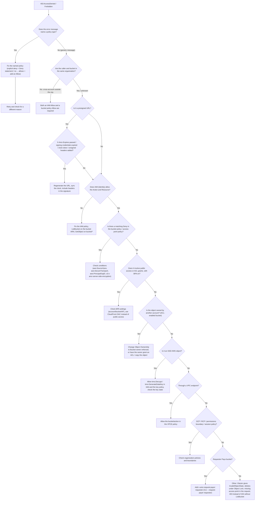
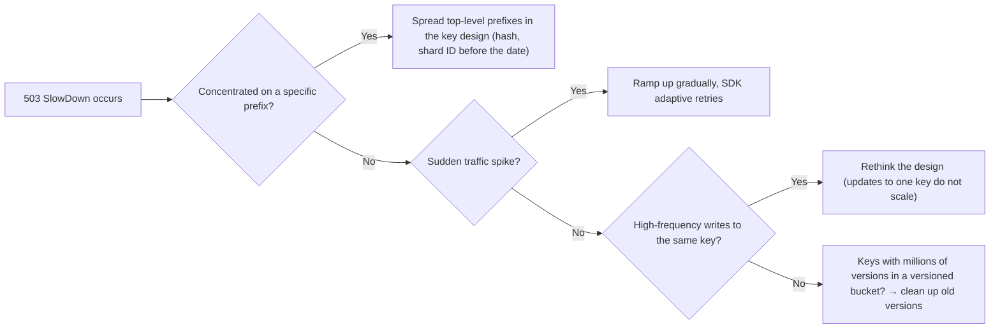

# Troubleshooting

_Last verified: 2026-10-03_

About 80% of S3 problems fall into one of these buckets: permissions (403), location (301/404), signatures and clock, throttling (503), or unexpected charges. This chapter starts with a full error code table to narrow down the cause, then gives step-by-step diagnosis by symptom.

## 0. Basic diagnosis steps

1. Capture the exact error code and message. With the CLI, use `--debug`. With an SDK, record the response `Code` / `Message` / `x-amz-request-id` / `x-amz-id-2` (AWS Support needs these).
2. Pin down who called which API, on which endpoint, against which resource. Use `aws sts get-caller-identity` to confirm the actual principal.
3. Check `errorCode` / `errorMessage` in CloudTrail (management events, plus object operations if data events are enabled). Enhanced AccessDenied messages are also recorded in CloudTrail.
4. Errors on HEAD requests have no body, so they return only a generic status code (400/403/404/412, etc.). To see the detailed cause, try a GET with the same conditions.
5. Minimize the reproduction (try a different principal, a different key, a different network path).

```bash
# Check who you are
aws sts get-caller-identity

# Detailed debug output (shows the canonical request used for signing and the endpoint)
aws s3api get-object --bucket amzn-s3-demo-bucket --key path/to/key out.bin --debug 2>&1 | less

# Check the bucket's Region
aws s3api get-bucket-location --bucket amzn-s3-demo-bucket
aws s3api head-bucket --bucket amzn-s3-demo-bucket   # returns the x-amz-bucket-region header
```

## 1. Error code quick reference

The S3 REST API returns XML in the form `<Error><Code>...</Code><Message>...</Message></Error>`. The main codes are grouped by HTTP status below.

### 1.1 3xx / 4xx (client side)

| Code | HTTP | Common cause | Fix |
| --- | --- | --- | --- |
| `PermanentRedirect` | 301 | The bucket is in one Region but the request went to another Region's endpoint | Specify the correct Region (`--region`, SDK region). Check `Endpoint` / `x-amz-bucket-region` in the response |
| `TemporaryRedirect` | 307 | A newly created bucket was accessed through an old endpoint before DNS propagated | Wait, or use a Regional endpoint |
| `AuthorizationHeaderMalformed` | 400 | The request was signed for the wrong Region (for example, signed for `us-east-1` but sent to a bucket in `ap-northeast-1`) | Set the client Region to match the bucket. The message includes the expected Region |
| `BadDigest` | 400 | `Content-MD5` / checksum does not match the received data | Check the sent data and checksum calculation. Retry if the network corrupted it |
| `InvalidDigest` | 400 | `Content-MD5` is malformed (not Base64, etc.) | Send a Base64-encoded 128-bit MD5 |
| `XAmzContentSHA256Mismatch` | 400 | `x-amz-content-sha256` does not match the body hash | Check that the stream is not modified midway and that no proxy transforms it |
| `EntityTooSmall` | 400 | In a multipart upload, a part other than the last is smaller than 5 MiB | Use parts of at least 5 MiB |
| `EntityTooLarge` | 400 | A single PUT exceeds 5 GiB, or exceeds a presigned POST `content-length-range` | Use multipart upload, or revisit the policy limit |
| `ExpiredToken` | 400 | STS temporary credentials (session token) have expired | Get new credentials. A presigned URL stops working when the token used to sign it expires |
| `InvalidToken` | 400 | The session token is malformed or does not match | Check the token and key pair |
| `IllegalLocationConstraintException` | 400 | The `CreateBucket` LocationConstraint does not match the endpoint Region | Make them match. Do not specify LocationConstraint in `us-east-1` |
| `InvalidArgument` | 400 | Invalid parameter value (header value, combination of encryption settings, etc.) | Check `ArgumentName` in the message |
| `InvalidBucketName` | 400 | Violates naming rules (uppercase, underscores, more than 63 characters, etc.) | 3 to 63 lowercase letters, numbers, hyphens, and dots |
| `InvalidPart` | 400 | A part listed at Complete does not exist / ETag mismatch | Use `ListParts` to check the existing parts and ETags |
| `InvalidPartOrder` | 400 | The part list at Complete is not in ascending order | Sort by PartNumber ascending |
| `InvalidRequest` | 400 | Invalid combination of features (for example, Transfer Acceleration on a bucket with dots, or requesting SigV2) | Check the message details |
| `KeyTooLongError` | 400 | The key exceeds 1,024 bytes (UTF-8) | Shorten the key |
| `MalformedXML` / `MalformedPolicy` | 400 | Syntax error in the XML / JSON policy, or a principal ARN that does not exist | Run it through a validator (IAM Access Analyzer policy validation) |
| `MaxMessageLengthExceeded` | 400 | The request is too large (for example, more than 1,000 keys in DeleteObjects) | Split the request |
| `RequestTimeout` | 400 | Writing to the socket did not finish within the timeout | The network or client stalled while sending. Retry, use smaller parts |
| `TooManyBuckets` | 400 | Bucket quota (default 10,000) exceeded | Request an increase through Service Quotas |
| `AccessDenied` | 403 | Insufficient permissions (details in section 2) | Narrow it down with the 403 decision tree |
| `AccountProblem` | 403 | Account billing problem, suspension, etc. | AWS Support / Billing dashboard |
| `AllAccessDisabled` | 403 | All access to this bucket/object has been disabled (account suspension, action by AWS, etc.) | Contact AWS Support |
| `InvalidAccessKeyId` | 403 | The access key ID does not exist (deleted, key from another partition, typo) | Check profile / environment variable precedence (is `AWS_ACCESS_KEY_ID` still set?) |
| `InvalidObjectState` | 403 | GET on an object in Glacier Flexible Retrieval / Deep Archive / an Intelligent-Tiering archive tier without restoring it | Run `RestoreObject` and wait for it to finish |
| `RequestTimeTooSkewed` | 403 | The client and server clocks differ by more than 15 minutes | Sync the clock with NTP (chrony, Amazon Time Sync Service) |
| `SignatureDoesNotMatch` | 403 | Signature mismatch (wrong secret key, modified headers, encoding differences, unsigned headers added to a presigned URL) | See section 6 |
| `NoSuchBucket` | 404 | The bucket does not exist (wrong name, deleted) | Check the name and partition |
| `NoSuchKey` | 404 | The key does not exist (404 only if the caller has `s3:ListBucket`, otherwise 403) | Check the key encoding (spaces, `+`, Unicode normalization) |
| `NoSuchVersion` | 404 | The specified versionId does not exist | Check with `ListObjectVersions` |
| `NoSuchUpload` | 404 | The UploadId does not exist (already completed / aborted, or aborted by lifecycle) | Start a new multipart upload |
| `NoSuchBucketPolicy` / `NoSuchLifecycleConfiguration` / `NoSuchCORSConfiguration` / `NoSuchTagSet` | 404 | The configuration is not set | Treat as the normal "not configured" case |
| `ServerSideEncryptionConfigurationNotFoundError` / `ObjectLockConfigurationNotFoundError` / `ReplicationConfigurationNotFoundError` | 404 | The configuration is not set | Same as above |
| `MethodNotAllowed` | 405 | The method is not allowed on the resource (for example, GET on a delete marker) | Check the target version |
| `MissingContentLength` | 411 | No `Content-Length` header | For chunked transfer, use SigV4 streaming or multipart |
| `PreconditionFailed` | 412 | A condition such as `If-Match` / `If-None-Match` / `If-Unmodified-Since` failed. With conditional writes: the object already exists, or the ETag does not match | Re-read the latest state and retry (optimistic locking) |
| `InvalidRange` | 416 | The range is outside the object size | Check the size with HEAD |
| `BucketAlreadyExists` | 409 | Another account already uses the name (global namespace) | Use another name, or the account regional namespace |
| `BucketAlreadyOwnedByYou` | 409 | Your account already owns a bucket with that name (the legacy us-east-1 behavior returns 200 OK and can reset ACLs) | Check for existing buckets with idempotent IaC |
| `BucketNotEmpty` | 409 | Deleting a bucket that is not empty (including old versions, delete markers, incomplete MPUs) | See section 11 |
| `ConditionalRequestConflict` | 409 | A conflicting operation on the same key during a conditional write (for example, a concurrent delete succeeded) | `PutObject` can be retried. For `CompleteMultipartUpload`, restart the MPU from the beginning |
| `InvalidBucketState` | 409 | The request conflicts with the bucket state (for example, suspending versioning on a bucket with Object Lock) | Check the configuration prerequisites |
| `OperationAborted` | 409 | A conflicting conditional operation on the same resource is in progress | Wait a moment and retry |
| `RestoreAlreadyInProgress` | 409 | A restore is already in progress | Check progress with `x-amz-restore` in `HeadObject` |

### 1.2 5xx (server side and throttling)

| Code | HTTP | Meaning | Fix |
| --- | --- | --- | --- |
| `InternalError` | 500 | Internal S3 error | Retry with exponential backoff (the SDK default). If it persists, contact Support with the request ID |
| `NotImplemented` | 501 | Unimplemented feature / header (for example, an unsupported `Transfer-Encoding`) | Review the headers |
| `ServiceUnavailable` | 503 | Temporarily unable to process | Retry |
| `SlowDown` | 503 | Request rate too high (S3 is still scaling the prefix; not KMS) | See section 7 |

The bucket owner is not charged for 5xx errors. 4xx errors are generally charged, but the bucket owner is not charged for 403s that come from outside the organization / account (a 2024 change).

### 1.3 KMS-related errors

When reading and writing SSE-KMS objects, S3 calls KMS on behalf of the caller. KMS failures come back as S3 errors (usually `AccessDenied`, but you can tell them apart from the message and the KMS events in CloudTrail).

| Symptom / KMS error | Cause | Fix |
| --- | --- | --- |
| `AccessDenied` (on PUT) | The caller lacks `kms:GenerateDataKey` | Allow it in both IAM and the key policy |
| `AccessDenied` (on GET) | The caller lacks `kms:Decrypt` | Same as above. For cross-account, allow the other account in the key policy |
| `AccessDenied` (multipart) | `CreateMultipartUpload` / `UploadPart` need `kms:GenerateDataKey`, and `CompleteMultipartUpload` needs `kms:Decrypt` | Grant both |
| `KMS.DisabledException` | The key is disabled | Enable the key |
| `KMS.KMSInvalidStateException` | The key is in a state such as pending deletion | If pending deletion, cancel it |
| `KMS.NotFoundException` | The key does not exist (deleted, or a key ARN from another Region) | Specify a key in the same Region. If deleted, the data cannot be decrypted |
| `KMS.ThrottlingException` / 503 | KMS request quota exceeded | Enable S3 Bucket Keys to reduce KMS calls, request a quota increase |
| Cross-account not possible with the AWS managed key (`aws/s3`) | The key policy of an AWS managed key cannot be edited | Use a customer managed key |
| Denied by encryption context | The key policy conditions on `kms:EncryptionContext:aws:s3:arn`, but with Bucket Keys enabled the context is the bucket ARN | Change the condition to use the bucket ARN |

The S3 API Reference error code list includes `KMS.`-prefixed codes such as `KMS.DisabledException`, `KMS.KMSInvalidStateException`, and `KMS.NotFoundException` (KMS exceptions passed through by S3). Other APIs name them differently (S3 Vectors, for example, uses `KmsDisabledException`), and a KMS permission failure on S3 usually surfaces as `AccessDenied`. The reliable approach is to check `errorCode` in the KMS events in CloudTrail (`Decrypt`, `GenerateDataKey`).

## 2. Systematic diagnosis of 403 AccessDenied

### 2.1 Enhanced error messages since 2024

For requests from the same account or the same AWS Organizations organization, AccessDenied messages state which type of policy denied the request and whether it was an explicit or implicit deny. For explicit denies (Deny statements) from SCPs / RCPs / identity-based policies / session policies / permissions boundaries, the message even includes the ARN of the denying policy.

```text
User: arn:aws:iam::777788889999:user/MaryMajor is not authorized to perform:
s3:GetObject on resource: "arn:aws:s3:::amzn-s3-demo-bucket1/object-name"
with an explicit deny in a resource control policy, with policy ARN:
arn:aws:organizations::777788889999:policy/o-exampleorgid/resource_control_policy/p-examplepolicyid
```

```text
User: arn:aws:iam::123456789012:user/MaryMajor is not authorized to perform:
s3:GetObject because no VPC endpoint policy allows the s3:GetObject action
```

How to read the message:

| Phrase | Meaning | Where to look |
| --- | --- | --- |
| `with an explicit deny in a service control policy` | Deny in an SCP | Organizations SCPs (ARN included) |
| `with an explicit deny in a resource control policy` | Deny in an RCP | Organizations RCPs (ARN included) |
| `with an explicit deny in a resource-based policy` | Deny in a bucket policy / access point policy | Bucket policy |
| `with an explicit deny in an identity-based policy` | Deny in an IAM policy | IAM (ARN included) |
| `with an explicit deny in a VPC endpoint policy` | Deny in a VPCE policy | VPC endpoint |
| `with an explicit deny in a permissions boundary` / `session policy` | Deny in a boundary / session policy | IAM / the Policy parameter at AssumeRole |
| `because no identity-based policy allows the ... action` | No Allow in IAM (implicit deny) | Add an Allow to the IAM policy |
| `because no resource-based policy allows ...` | No Allow in the bucket policy, for cross-account and similar cases | Bucket policy |
| `because no service control policy allows ...` | Not in the SCP allow list | SCP |
| BPA messages such as `because public access control lists (ACLs) are blocked by the BlockPublicAcls block public access setting` | Denied by Block Public Access | Account / bucket / access point BPA |
| `because this bucket has blocked upload requests that specify Server Side Encryption with Customer provided keys (SSE-C)` | SSE-C is blocked | Bucket default encryption settings (`BlockedEncryptionTypes`) |

Limitations (from the official documentation):

- Cross-account requests from outside the organization get only a generic `Access Denied`.
- Even within the same organization, denies from VPC endpoint policies do not return enhanced messages.
- Directory buckets do not have enhanced messages.
- If a request is denied by multiple policy types or for multiple reasons, the message shows only one. After you fix one, the request may be denied again for a different reason.

### 2.2 Decision tree



### 2.3 Checklist by cause

| Area | Common mistake | Command / method to check |
| --- | --- | --- |
| IAM | `s3:ListBucket` Resource set to `arn:aws:s3:::bucket/*` (correct: `arn:aws:s3:::bucket`) | IAM Policy Simulator, `aws iam simulate-principal-policy` |
| IAM | `s3:GetObject` attached to `arn:aws:s3:::bucket` (correct: `bucket/*`) | Same as above |
| Bucket policy | A Deny conditioned on `aws:SourceVpce` also blocks console access (over the internet) | `aws s3api get-bucket-policy` |
| Bucket policy | `NotPrincipal` + Deny did not account for role session ARNs and locked you out too | Delete the policy as the root user (there is an official procedure for when you accidentally deny everyone) |
| BPA | BPA is on even though you want public access | `aws s3api get-public-access-block`, `aws s3control get-public-access-block` |
| Object Ownership / ACL | In an ACL-enabled bucket, the bucket owner cannot read objects written by another account | `aws s3api get-object-acl`, `get-bucket-ownership-controls` |
| Object Ownership | With Bucket owner enforced, a PUT specifies `x-amz-acl: public-read` or similar -> `AccessControlListNotSupported` (400) | Remove the ACL header (`bucket-owner-full-control` is accepted) |
| KMS | The key policy does not include the cross-account principal | `aws kms get-key-policy` |
| VPCE | The endpoint policy allows only specific buckets and the new bucket is missing | `aws ec2 describe-vpc-endpoints` |
| SCP / RCP | A Region-restricting SCP (`aws:RequestedRegion`) denies global S3 operations | Organizations console |
| Requester Pays | The requester did not send the header agreeing to pay | `aws s3api get-bucket-request-payment` |
| Objects owned by another account | `bucket-owner-full-control` was not set on upload to an ACL-enabled bucket | Setting Object Ownership to enforced also makes the bucket owner the owner of existing objects |
| Presigned URL | Expired, `ExpiredToken`, or the session of the signing role (up to 12 hours, etc.) is shorter than the URL | `X-Amz-Date`, `X-Amz-Expires`, and `X-Amz-Security-Token` in the URL |
| Presigned URL | The creator lacks permission (a presigned URL runs with the creator's permissions) | Call the API directly with the creator's role to check |
| Clock skew | Client clock off by 15 minutes or more -> `RequestTimeTooSkewed`. Presigned URLs fail with an `X-Amz-Date` in the future | `date -u`, `chronyc tracking` |
| Missing key | Without `s3:ListBucket`, you get 403 instead of 404 | Check whether the key exists using other permissions |
| Object Lock | Deleting or overwriting a version under retention (delete with a version ID) | `aws s3api get-object-retention`, `get-object-legal-hold` |
| Access point | Both the access point policy and the bucket policy (delegating to access points) are required | Delegate in the bucket policy with an `s3:DataAccessPointAccount` condition |
| CloudFront OAC | `AWS:SourceArn` in the bucket policy does not match the distribution ARN, or CloudFront is missing from the KMS key policy | Compare with the CloudFront origin settings |

### 2.4 IAM Access Analyzer and Policy Simulator

```bash
# Simulate whether a role can GetObject (taking the resource policy into account)
aws iam simulate-principal-policy \
  --policy-source-arn arn:aws:iam::111122223333:role/app-role \
  --action-names s3:GetObject \
  --resource-arns arn:aws:s3:::amzn-s3-demo-bucket/path/key \
  --resource-policy file://bucket-policy.json

# Validate policy grammar and security warnings
aws accessanalyzer validate-policy --policy-type RESOURCE_POLICY \
  --policy-document file://bucket-policy.json \
  --validate-policy-resource-type AWS::S3::Bucket
```

## 3. Debugging CORS

What to check when the browser console shows `No 'Access-Control-Allow-Origin' header is present`.

| Symptom | Cause | Fix |
| --- | --- | --- |
| Preflight (OPTIONS) returns 403 | No CORS configuration, or the request does not match `AllowedOrigins` / `AllowedMethods` / `AllowedHeaders` | Add a CORS rule. Allow every header in the request's `Access-Control-Request-Headers` |
| GET succeeds but JS cannot read it | No `Access-Control-Allow-Origin` in the response (the request had no `Origin` header, or CloudFront served a cached response from a request without Origin) | In CloudFront, include the `Origin` header in the cache key / origin request policy (managed policy `CORS-S3Origin`) |
| ETag is `null` when completing a multipart upload | `ETag` is not in `ExposeHeaders` | `ExposeHeaders: ["ETag"]` |
| CORS does not work on the website endpoint | Behavior differences between the REST and website endpoints, redirects | Use the REST endpoint + CloudFront |
| Looks like a CORS error but is actually a 403 | It is really a permission error. If the error response lacks CORS headers, the browser reports it as a CORS error | Check the real status with `curl -v` |

```bash
# Reproduce the preflight manually
curl -i -X OPTIONS "https://amzn-s3-demo-bucket.s3.ap-northeast-1.amazonaws.com/uploads/a.png" \
  -H "Origin: https://app.example.com" \
  -H "Access-Control-Request-Method: PUT" \
  -H "Access-Control-Request-Headers: content-type"
```

```json
[
  {
    "AllowedOrigins": ["https://app.example.com"],
    "AllowedMethods": ["GET", "PUT", "HEAD"],
    "AllowedHeaders": ["*"],
    "ExposeHeaders": ["ETag", "x-amz-version-id"],
    "MaxAgeSeconds": 3000
  }
]
```

## 4. Slow uploads or downloads

| Cause | Diagnosis | Fix |
| --- | --- | --- |
| Large file over a single stream | Stuck at the throughput limit of one connection | Parallel multipart upload, parallel range GET downloads, AWS CRT-based SDK / CLI (`aws configure set default.s3.preferred_transfer_client crt`) |
| Distant Region | High latency (RTT) | A closer Region, Transfer Acceleration (check the benefit with the Speed Comparison tool), CloudFront |
| Through a NAT Gateway | NAT bandwidth and cost | Gateway VPC endpoint |
| EC2 instance network bandwidth | Network performance limit of the instance type | An instance type with higher network performance. ENA Express does not help here: it applies only to traffic between EC2 instances that both have it enabled, not to S3 |
| Many small files | Per-request overhead dominates | Increase parallelism, combine files, S3 Express One Zone |
| KMS throttling with SSE-KMS | KMS `ThrottlingException` | S3 Bucket Keys |
| Client CPU (TLS / checksums) | CPU at 100% | CRT client, appropriate parallelism |
| `aws s3 sync` is slow | Many key comparisons (LIST) | Revisit `--size-only` / `--exact-timestamps`, S3 Batch Operations, DataSync |

Tuning CLI parallelism:

```bash
aws configure set default.s3.max_concurrent_requests 32
aws configure set default.s3.multipart_threshold 64MB
aws configure set default.s3.multipart_chunksize 16MB
```

## 5. 503 SlowDown (throttling)

S3 supports at least 3,500 PUT/COPY/POST/DELETE and 5,500 GET/HEAD requests per second per prefix, and scales automatically by splitting partitions as load grows. While a split is in progress, it can temporarily return 503 SlowDown.



| Fix | Details |
| --- | --- |
| Retries | Use SDK `retry_mode = adaptive` or `standard`, and increase `max_attempts` |
| Spread prefixes | Change `logs/2026/10/03/...` to something like `logs/a7/2026/10/03/...` |
| Monitoring | CloudWatch request metrics (`5xxErrors`), Storage Lens activity metrics |
| 503s are not billed | But requests that succeed on retry are billed |
| Many versions | The official docs note that keys with millions of versions are more likely to get 503s. Delete noncurrent versions with lifecycle |

## 6. SignatureDoesNotMatch

| Common cause | Fix |
| --- | --- |
| Wrong secret access key / leading or trailing whitespace | Reconfigure the credentials |
| After a presigned URL was created, the client added unsigned headers (`Content-Type`, etc.) | Send the same header values specified at generation, or do not send them |
| Key encoding mismatch (spaces, `+`, Unicode) | Let the SDK handle it. Do not URL-encode yourself |
| A proxy / CDN rewrote headers or the query string | Reproduce over a direct connection |
| Signing Region mismatch | Often appears together with `AuthorizationHeaderMalformed` |
| Using SigV2 | Migrate to SigV4 (new buckets do not support SigV2) |

Compare `<StringToSign>` and `<CanonicalRequest>` in the error response with the client's `--debug` output to find the difference.

## 7. Unexpected charges

### 7.1 Investigation steps

1. In Cost Explorer, set Service = S3 and Group by = Usage Type to find which usage type increased.
2. Depending on the usage type, use Storage Lens (by bucket / prefix), CloudWatch request metrics, and server access logs / CloudTrail data events to find which bucket and who.
3. For details, query CUR 2.0 (Data Exports) with Athena and aggregate by `line_item_resource_id` (bucket name), `line_item_usage_type`, and `line_item_operation`.

```sql
-- Aggregate CUR 2.0 by bucket x Usage Type x Operation
SELECT line_item_resource_id AS bucket,
       line_item_usage_type,
       line_item_operation,
       SUM(line_item_usage_amount) AS usage,
       SUM(line_item_unblended_cost) AS cost
FROM cur2
WHERE line_item_product_code = 'AmazonS3'
  AND billing_period = '2026-09'
GROUP BY 1, 2, 3
ORDER BY cost DESC
LIMIT 50;
```

### 7.2 Typical causes by usage type

Usage types carry a Region prefix, as in `APN1-TimedStorage-ByteHrs` (omitted for us-east-1).

| Usage type (without the Region prefix) | Meaning | Common cause | Fix |
| --- | --- | --- | --- |
| `TimedStorage-ByteHrs` | Standard storage (GB-month) | Accumulated noncurrent versions, incomplete MPUs, logs kept forever | Lifecycle. Check "noncurrent version bytes" and "incomplete MPU bytes" in Storage Lens |
| `TimedStorage-SIA-ByteHrs` / `TimedStorage-SIA-SmObjects` | Standard-IA storage / minimum charge for objects under 128 KB | Small objects transitioned to IA | Keep objects under 128 KB in Standard |
| `TimedStorage-GlacierByteHrs` / `TimedStorage-GDA-ByteHrs` | Glacier Flexible / Deep Archive | Fine if expected. Each archived object adds about 40 KB of billed metadata | Combine small files before archiving |
| `EarlyDelete-*` | Deleted, overwritten, or transitioned before the minimum storage duration (30 days for IA classes, 90 days for GIR/GFR, 180 days for GDA) | Frequently overwritten data placed in IA/Glacier | Revisit access patterns |
| `Requests-Tier1` | PUT/COPY/POST/LIST | LIST loops, many writes of small objects, heavy use of `aws s3 sync` | Reduce LIST calls, batch writes |
| `Requests-Tier2` | GET/HEAD, etc. | Crawlers, CDN cache misses, polling | CloudFront caching, stop polling |
| `Requests-Tier3` / `Tier4` | Transitions to Glacier and standard restores / transitions to IA, GIR, INT | Lifecycle transitions of many small objects | Set a minimum size for transitions, aggregate |
| `Retrieval-SIA` / `Retrieval-GIR` | Retrieval from IA / GIR (GB) | The "infrequent access" assumption no longer holds | Move to Standard / Intelligent-Tiering |
| `Monitoring-Automation-INT` | Intelligent-Tiering monitoring fee (object count) | Many small objects (objects under 128 KB are not monitored and not charged) | Check the average object size |
| `DataTransfer-Out-Bytes` | Transfer to the internet | Public buckets, direct delivery from the website endpoint, external downloads | CloudFront, Requester Pays, access restrictions |
| `region1-region2-AWS-Out-Bytes` | Inter-Region transfer | CRR, reads from compute in another Region | Move compute to the same Region |
| `C3DataTransfer-Out-Bytes` | Transfer to EC2 in the same Region | Normally free (line items with zero cost) | — |
| `TagStorage-TagHrs` | Object tags | Tags on every object | Tag only what you need |
| `Inventory-ObjectsListed` / `StorageLens-ObjCount` | Inventory / Storage Lens advanced metrics | Unneeded daily Inventory | Revisit frequency and scope |
| `Global-Bucket-Hrs` | Buckets beyond the free 2,000 | Mass creation, such as a bucket per tenant | Delete unneeded buckets, rethink the design |
| `KMS` (separate service) | SSE-KMS API calls | Bucket Keys not used | S3 Bucket Keys |

Commonly overlooked "hidden storage":

```bash
# List incomplete multipart uploads
aws s3api list-multipart-uploads --bucket amzn-s3-demo-bucket

# Roughly count noncurrent versions and delete markers (use Inventory for large buckets)
aws s3api list-object-versions --bucket amzn-s3-demo-bucket \
  --query '{versions: length(Versions[?IsLatest==`false`]), markers: length(DeleteMarkers)}'
```

`aws s3 ls --summarize --recursive` counts only current versions, so it may not match the billed storage.

### 7.3 Unknown parties sent PUTs / charged for 403s

In May 2024, AWS changed billing so that bucket owners are not charged for unauthorized requests (403) that come from outside the bucket owner's account or organization. If you still see many unexpected requests, check whether the bucket name is exposed externally (for example, in OSS configuration files), and use a harder-to-guess name, such as one in the account regional namespace.

## 8. Lifecycle not working

| Cause | Explanation | Fix |
| --- | --- | --- |
| Pending | Rules are evaluated asynchronously once a day, and taking effect can take several days. Expiration dates are rounded to 00:00 UTC on the day after "creation date + days" | Wait. Billing stops once the object becomes eligible |
| Filter mismatch | Trailing `/` on the prefix, tag case sensitivity, AND conditions | `aws s3api get-bucket-lifecycle-configuration` |
| Under 128 KB | Since September 2024, objects under 128 KB are not transitioned by default | Explicitly set a small value with `ObjectSizeGreaterThan` (watch the cost) |
| Transition constraints | Objects must be at least 30 days old before moving to Standard-IA / One Zone-IA, and upward transitions in the waterfall are not allowed | Revisit the days and classes |
| Versioning | Expiration only adds a delete marker to the current version, and the data remains as a noncurrent version | Use `NoncurrentVersionExpiration` together with `ExpiredObjectDeleteMarker` |
| Object Lock | Versions under retention are not deleted | Wait for retention to end |
| Replication pending | Objects with replication status `PENDING` are not transitioned | Fix the replication problem |
| Status is Disabled | The rule's `Status` is `Disabled` | Set it to `Enabled` |
| How to check | — | The `x-amz-expiration` header in `HeadObject`, Storage Lens, `S3.EXPIRE.OBJECT` / `S3.TRANSITION...` operations in server access logs |

## 9. Replication not working

```bash
# Check per-object status (PENDING / COMPLETED / FAILED / REPLICA)
aws s3api head-object --bucket src-bucket --key path/key --query ReplicationStatus
```

| Cause | Check | Fix |
| --- | --- | --- |
| Existing objects | Objects created before the rule are not replicated | S3 Batch Replication |
| Versioning | Must be enabled on both source and destination | Enable on both |
| IAM role | `s3:GetObjectVersionForReplication`, `s3:GetObjectVersionAcl`, `s3:GetObjectVersionTagging` (source), `s3:ReplicateObject`, `s3:ReplicateDelete`, `s3:ReplicateTags` (destination) | The role's policy and trust policy (`s3.amazonaws.com`) |
| Destination bucket policy (cross-account) | Does not allow the source replication role | Allow it in the destination bucket policy. To change ownership to the destination, add `s3:ObjectOwnerOverrideToBucketOwner` |
| KMS | "Replicate KMS-encrypted objects" not selected in the rule, the role lacks `kms:Decrypt` on the source key or `kms:Encrypt` on the destination key, or the AWS managed key (`aws/s3`) is used cross-account | Customer managed keys and both key policies |
| SSE-C | S3 Replication supports SSE-C objects and configures them the same way as unencrypted objects, with no additional permissions. Only newly uploaded SSE-C objects are replicated automatically | Use S3 Batch Replication for existing SSE-C objects. Switch to SSE-KMS if possible |
| Object Lock | The destination also needs Object Lock | Enable it on the destination |
| Deletes | Delete marker replication is off by default (V2 configuration), and deletes with a version ID are not replicated (designed to protect against malicious deletes) | Enable `DeleteMarkerReplication` if needed |
| Re-replicating replicas | Replicas are not chain-replicated (with A->B->C, objects from A do not reach C) | Create rules from each source |
| Objects created by lifecycle | Lifecycle transitions and deletes are not replicated | Configure lifecycle on the destination too |
| Monitoring | — | S3 Replication metrics (with RTC enabled, or enabled separately), `OperationsFailedReplication`, and the `s3:Replication:OperationFailedReplication` event to get the failure reason |

## 10. Event notifications not arriving

| Cause | Fix |
| --- | --- |
| The destination's resource policy does not allow S3 to send (SNS topic policy, SQS queue policy, Lambda resource-based policy) | Allow `s3.amazonaws.com` with `aws:SourceArn` / `aws:SourceAccount` conditions |
| The SQS queue is FIFO | S3 Event Notifications do not support FIFO queues. Go through EventBridge |
| The encrypted SQS / SNS uses an AWS managed key | So S3 can use the key, allow `kms:GenerateDataKey` and `kms:Decrypt` for `s3.amazonaws.com` in a customer managed key's key policy |
| Prefix / suffix mismatch | Note that matching uses the URL-encoded key (spaces become `+`) |
| Configuration error from defining multiple notifications for the same event type with overlapping prefixes | One destination (SNS fan-out) or EventBridge |
| Event type mismatch | Multipart uploads emit `s3:ObjectCreated:CompleteMultipartUpload`. `ObjectCreated:*` is recommended |
| Not reaching EventBridge | Check that EventBridge delivery is enabled on the bucket and the rule pattern (`detail.bucket.name`) |
| Deletes by lifecycle | Subscribe to `s3:LifecycleExpiration:*` |
| Test event | `s3:TestEvent` is sent right after configuration. Skip it in your code |

## 11. Restoring from Glacier

| Item | Glacier Flexible Retrieval | Glacier Deep Archive | Intelligent-Tiering archive tiers |
| --- | --- | --- | --- |
| Expedited | Usually 1 to 5 minutes (guideline: under 250 MB, guaranteed with provisioned capacity) | Not available | Archive Access tier only |
| Standard | Usually 3 to 5 hours (improved to start within minutes through Batch Operations) | Usually within 12 hours | 3 to 5 hours / 12 hours |
| Bulk | Usually 5 to 12 hours (free) | Usually within 48 hours | Same as left |
| After restore | Temporary copy for the specified number of days (billed at Standard rates) | Same as left | Restored objects move back to the Frequent Access tier (no day count) |

Common pitfalls:

1. GET without restoring -> `InvalidObjectState` (403).
2. To check whether a restore finished, look at the `x-amz-restore` header in `HeadObject` (`ongoing-request="false", expiry-date="..."`).
3. Running a restore again while one is running -> `RestoreAlreadyInProgress` (409).
4. For bulk restores, use an S3 Batch Operations "Restore" job + the `s3:ObjectRestore:Completed` event to detect completion.
5. To change the class back permanently, run `CopyObject` to the same key (with a storage class) after restoring.
6. Glacier Instant Retrieval does not need a restore (millisecond access, with retrieval charges).

```bash
aws s3api restore-object --bucket amzn-s3-demo-bucket --key archive/2019/data.tar \
  --restore-request '{"Days":7,"GlacierJobParameters":{"Tier":"Bulk"}}'
aws s3api head-object --bucket amzn-s3-demo-bucket --key archive/2019/data.tar --query Restore
```

## 12. Deleting a bucket with millions of versions

To delete a bucket, you must empty it by removing every object version, delete marker, and incomplete multipart upload (`BucketNotEmpty`).

| Method | Pros | Cons |
| --- | --- | --- |
| Console "Empty" | Easy | At scale, the browser must stay open for a long time. Costs are DELETE requests (free) and LIST |
| Expire everything with lifecycle | No API calls needed, DELETE is free, scales regardless of object count | Evaluated once a day, takes several days |
| `DeleteObjects` script | Immediate | 1,000 keys per request, LIST charges, needs throttling handling |
| S3 Batch Operations | Managed parallel processing | Batch Operations charges, plus Lambda. Batch Operations has no built-in delete operation, so delete via the "Invoke AWS Lambda function" operation |

Lifecycle configuration to empty a bucket (equivalent to the Knowledge Center article's procedure):

```json
{
  "Rules": [
    {
      "ID": "empty-current-and-noncurrent",
      "Status": "Enabled",
      "Filter": {},
      "Expiration": { "Days": 1 },
      "NoncurrentVersionExpiration": { "NoncurrentDays": 1 },
      "AbortIncompleteMultipartUpload": { "DaysAfterInitiation": 1 }
    },
    {
      "ID": "remove-expired-delete-markers",
      "Status": "Enabled",
      "Filter": {},
      "Expiration": { "ExpiredObjectDeleteMarker": true }
    }
  ]
}
```

Notes:

1. Versions under Object Lock retention cannot be deleted (in Compliance mode, you can only wait for retention to end).
2. Lifecycle cannot be used when MFA Delete is enabled (you cannot configure lifecycle on a bucket with MFA Delete). Disable MFA Delete as root first.
3. If replication is configured, delete markers may be replicated to the destination. Remove the replication configuration first.
4. Once empty, run `aws s3api delete-bucket`. After deletion, a third party can re-create the same name (remove external references first).

## 13. Other common symptoms

| Symptom | Cause | Fix |
| --- | --- | --- |
| Deleted a folder in the console but storage did not decrease | Versioning is enabled, so only delete markers were added | Delete noncurrent versions with "Show versions", or use lifecycle |
| Object does not show up in LIST right after upload | Since December 2020, S3 has strong read-after-write consistency (including LIST). If it does not appear, suspect a different key / Region / cache (CloudFront) | Check the key and endpoint |
| CloudFront serves old files | Edge cache | Invalidation, hashed file names |
| `aws s3 cp` sets `Content-Type` to `binary/octet-stream` | Cannot infer from the extension | Specify `--content-type` |
| ETag does not match the MD5 | Multipart (the ETag is "MD5 of part MD5s-part count"), SSE-KMS / SSE-C | Use additional checksums (CRC64NVME / CRC32C / SHA256) for integrity checks |
| Japanese keys are garbled / not found | Unicode normalization differences between NFC and NFD (macOS uses NFD) | Normalize to NFC before uploading |
| `HeadBucket` returns 403 / 404 | 403 means it exists but you lack permission (someone else's bucket), 404 means it does not exist | Check the name |
| `AccessControlListNotSupported` (400) | PUT with an ACL to a Bucket owner enforced bucket | Remove the ACL header |
| `InvalidRequest: ... SSE-C` | The bucket blocks SSE-C (the default since April 2026) | Use SSE-KMS / SSE-S3, or change `BlockedEncryptionTypes` if needed |

## References

- Troubleshoot access denied (403 Forbidden) errors in Amazon S3: <https://docs.aws.amazon.com/AmazonS3/latest/userguide/troubleshoot-403-errors.html>
- Amazon S3 Error Responses (Error code list): <https://docs.aws.amazon.com/AmazonS3/latest/API/ErrorResponses.html>
- Amazon S3 error best practices: <https://docs.aws.amazon.com/AmazonS3/latest/developerguide/ErrorBestPractices.html>
- How do I troubleshoot explicit deny error messages: <https://repost.aws/knowledge-center/iam-explicit-deny-errors>
- Why am I getting a 403 Forbidden error when I try to upload files: <https://repost.aws/knowledge-center/s3-403-forbidden-error>
- How to prevent object overwrites with conditional writes: <https://docs.aws.amazon.com/AmazonS3/latest/userguide/conditional-writes.html>
- Performance design patterns for Amazon S3: <https://docs.aws.amazon.com/AmazonS3/latest/userguide/optimizing-performance-design-patterns.html>
- Understanding your AWS billing and usage reports for Amazon S3: <https://docs.aws.amazon.com/AmazonS3/latest/userguide/aws-usage-report-understand.html>
- Billing for Amazon S3 error responses: <https://docs.aws.amazon.com/AmazonS3/latest/userguide/ErrorCodeBilling.html>
- Amazon S3 multipart upload limits: <https://docs.aws.amazon.com/AmazonS3/latest/userguide/qfacts.html>
- How do I troubleshoot lifecycle configuration rule issues: <https://repost.aws/knowledge-center/s3-lifecycle-configuration-rule>
- How do I use a lifecycle configuration rule to empty an S3 bucket: <https://repost.aws/knowledge-center/s3-empty-bucket-lifecycle-rule>
- Why don't my Amazon S3 objects replicate: <https://repost.aws/knowledge-center/s3-troubleshoot-replication>
- Troubleshooting replication: <https://docs.aws.amazon.com/AmazonS3/latest/userguide/replication-troubleshoot.html>
- Amazon S3 Glacier storage classes (retrieval times): <https://aws.amazon.com/s3/storage-classes/glacier/>
- Restoring an archived object: <https://docs.aws.amazon.com/AmazonS3/latest/userguide/restoring-objects.html>
- Using CORS: <https://docs.aws.amazon.com/AmazonS3/latest/userguide/cors.html>
- Amazon S3 Event Notifications: <https://docs.aws.amazon.com/AmazonS3/latest/userguide/EventNotifications.html>
- Amazon S3 starts rolling out new security best practice (SSE-C, 2026-04): <https://aws.amazon.com/about-aws/whats-new/2026/04/s3-default-bucket-security-setting/>
- General purpose bucket quotas: <https://docs.aws.amazon.com/AmazonS3/latest/userguide/BucketRestrictions.html>
- ENA Express (requirements: traffic between EC2 instances): <https://docs.aws.amazon.com/AWSEC2/latest/UserGuide/ena-express.html>
- Replicating encrypted objects (SSE-S3, SSE-KMS, DSSE-KMS, SSE-C): <https://docs.aws.amazon.com/AmazonS3/latest/userguide/replication-config-for-kms-objects.html>
- Operations supported by S3 Batch Operations: <https://docs.aws.amazon.com/AmazonS3/latest/userguide/batch-ops-operations.html>
