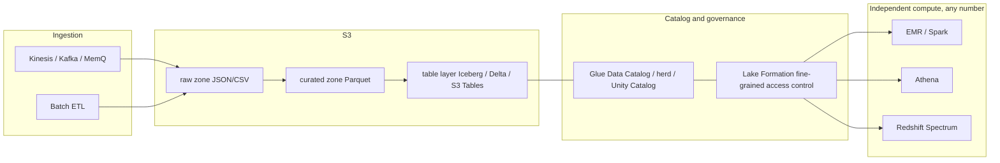
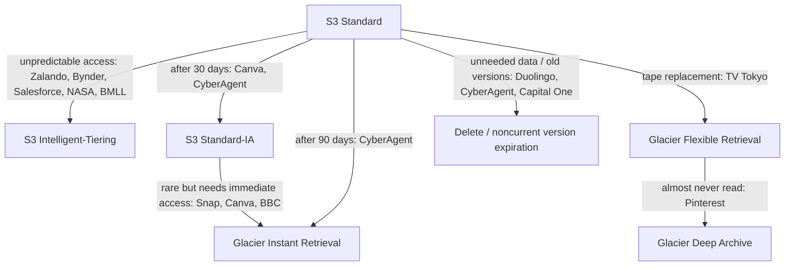
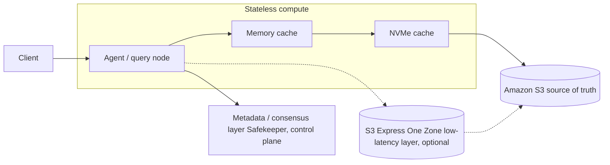
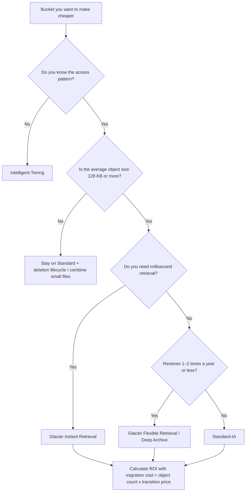

# Case studies — who uses S3, how, and what they learned

_Last verified: 2026-10-03_

This chapter organizes, by industry, public case studies from real companies that use Amazon S3 (or built a product on top of S3, or moved away from S3). Every number here comes **only from public sources**. Source URLs are listed at the end of each case and in "References".

## Rules for this chapter

- Numbers are "as of publication". The year is always given. S3 usage keeps growing, so read old numbers as a lower bound
- Sources are labeled as "AWS case study", "company engineering blog", "re:Invent talk", or "press coverage". Vendor claims (such as WarpStream's cost comparison) are marked as such
- Anything the sources do not confirm is marked **unverified**. Gaps are not filled with guesses
- Cases fall into three types
  - **adopter**: uses S3 as storage for its own systems
  - **built-on-s3**: builds the product or service itself on top of S3
  - **migrated-away**: moved from S3 to self-managed storage (counterexamples)
- A machine-readable version is in `data/cases.json` (English and Japanese). The JSON `year` field is the source's publication year. Where the page itself shows no date, the year comes from the PDF version's copyright and metadata (Ancestry 2023, TV Tokyo 2020), from AWS's case study index (Bynder 2024), or from a dated AWS post that cites it (BMLL 2025). BMW Group's AWS innovators page (the source of its 20 PB figure) shows no date, so its `year` is the year it was checked (2026)

## Background: the scale of S3 in 2026

According to the AWS News Blog post for S3's 20th anniversary (2026-03-13), S3 stores **more than 500 trillion objects**, handles **more than 200 million requests per second**, and holds **hundreds of exabytes** of data. At launch in 2006, total capacity was about 1 PB, and the price has dropped about 85%, from 15 cents/GB to just over 2 cents today. S3 Intelligent-Tiering is said to have saved customers **more than $6 billion** in total.

The cases below are concrete examples of what companies put where on this huge platform, which storage classes they moved data into, and where they went wrong.

## 1. Media and consumer

Media companies share one access pattern: content is viewed heavily right after creation, then goes cold quickly, but must still come back instantly when someone wants it. S3 Glacier Instant Retrieval (Glacier IR below) plays the lead role here.

### 1.1 Netflix — unifying an exabyte-scale data lake on Iceberg

- **Industry**: Video streaming
- **What is stored**: Table data for the analytics data warehouse / data lake
- **Scale**: The AWS re:Invent 2023 talk (NFX306) describes it as an "exabyte-scale data warehouse". The talk's description on the official AWS Events YouTube upload says Netflix operates a data lake of "approximately one exabyte", and that about 300 PB of it remained in the legacy Apache Hive table format
- **Architecture**:
  - Data on S3 is managed with **Apache Iceberg**, the table format Netflix itself created
  - To move from Hive to an "Iceberg-only" setup, Netflix built its own migration tools, secure Iceberg tables, and an Iceberg REST catalog
  - The approach minimized physical data movement and impact on users
- **Results**: ACID transactions, a rich metadata layer, and better query performance (from the talk summary on the AWS video page). Neither description gives cost or savings figures
- **Lessons**: S3 is "the place to put files"; the table format handles table-level consistency and schema evolution. Netflix created Iceberg and started the trend that led to "managed Iceberg" offerings such as S3 Tables (announced 2024)
- **Sources**: [AWS re:Invent 2023 NFX306 (YouTube, AWS Events)](https://www.youtube.com/watch?v=jMFMEk8jFu8), [AWS re:Invent 2023 NFX306 (AWS video page)](https://aws.amazon.com/video/watch/3db41488539/)

### 1.2 Snap — 2 EB moved to Glacier IR in 3 months

- **Industry**: Social media (Snapchat)
- **What is stored**: Photos and videos that users save (Memories)
- **Scale**: About **1.5 trillion** media files, **2 exabytes** (2022). 363 million daily active users
- **Architecture**:
  - Saved media originally lived in S3 Standard-IA
  - To match the pattern "viewed for a few days, then not viewed for months or years", Snap moved all existing content to Glacier IR between March and June 2022, and started storing new content in Glacier IR as well
- **Results**: Storage savings of "**tens of millions of dollars**". Download latency improved 20–30% in some Regions, with availability above 99.99%
- **Lessons**: Glacier IR returns data in milliseconds, so you can drop to a cheaper class without changing the user experience. A Snap engineer said that "the fact that no customer noticed this major migration to Amazon S3 Glacier Instant Retrieval was a big win for us"
- **Source**: [AWS case study: Snap](https://aws.amazon.com/solutions/case-studies/snap-case-study/)

### 1.3 Canva — 130 PB of 230 PB moved to Glacier IR, saving $3.6M a year

- **Industry**: Design SaaS
- **What is stored**: User-created designs and uploaded assets
- **Scale**: **230 PB** across S3, **more than 300 billion objects**. The largest bucket is 45 PB (as of May 2023)
- **Architecture**:
  - The setup used lifecycle rules: S3 Standard, then Standard-IA after 30 days
  - Canva studied access patterns with S3 Storage Class Analysis and moved 130 PB (56% of the total) to Glacier IR. About 80 billion objects were migrated in about 2 days
- **Results**: Savings of **$300,000 per month**, **$3.6 million per year**. The one-time migration cost was **$1.6 million**, recovered within a few months
- **Lessons** (one of the most practical lessons in this chapter):
  - Migration cost scales with **object count** (transition to Glacier IR costs $0.02 per 1,000 objects). Moving all 300 billion objects was estimated to cost about $6 million
  - Standard-IA and Glacier IR have a minimum billable object size of **128 KB**. Moving small objects down does not pay off
  - Starting with buckets whose average object size is **400 KB or more** pays back fastest. For objects under 20 KB, S3 Standard can be cheaper
- **Sources**: [Canva Engineering Blog: How Canva saves millions annually in Amazon S3 costs](https://www.canva.dev/blog/engineering/optimising-s3-savings/), [Canva quote on the Glacier IR product page](https://aws.amazon.com/s3/storage-classes/glacier/instant-retrieval/)

### 1.4 Pinterest — access analysis of about 1 EB for Deep Archive, and MemQ as a Kafka replacement

- **Industry**: Social media / visual discovery
- **What is stored**: Images, ML training data, logs, and more
- **Scale**: More than 300 billion Pins, **about 1 exabyte** across multiple Regions, billions of objects (December 2021)
- **Architecture (cost optimization)**:
  - Built a "storage insights" pipeline that aggregates S3 Server Access Logs and S3 Inventory with Hadoop/Spark, and visualizes usage per prefix with S3 Storage Lens and object tags
  - For example, one dataset had objects two years old, a maximum of 6 days between creation and last access, and only 0.009% of objects ever accessed. It became a Deep Archive candidate
  - Migration used S3 Lifecycle transition rules, with S3 Batch Operations for large object sets
- **Architecture (MemQ)**:
  - MemQ, Pinterest's in-house pub/sub system for streaming ML training data, uses S3 as its storage. It is **more than 90% cheaper** than Pinterest's Kafka setup (AWS Storage Blog, February 2022)
  - To avoid S3 hot spots, it spreads data across 256 prefixes using a 2-byte hex hash (salted prefix)
  - In the 2023 GA announcement for S3 Express One Zone, Pinterest said it tested Express One Zone with MemQ and saw **more than 10x lower latency**
- **Results**: Deep Archive brought "millions of dollars in annual savings" (exact amount not disclosed)
- **Lessons**: "Frequent restores wipe out Deep Archive savings." Always check actual access history before archiving. Standardize the restore process to prevent wasteful retrievals
- **Sources**: [AWS Storage Blog: Pinterest and Glacier Deep Archive](https://aws.amazon.com/blogs/storage/how-pinterest-uses-amazon-s3-glacier-deep-archive-to-manage-storage-for-its-visual-discovery-engine/), [AWS Storage Blog: MemQ](https://aws.amazon.com/blogs/storage/memq-by-pinterest-an-efficient-scalable-cloud-native-publish-subscribe-system/), [S3 Express One Zone GA press release](https://press.aboutamazon.com/2023/11/aws-announces-the-general-availability-of-amazon-s3-express-one-zone)

### 1.5 BBC — 25 PB from a century of archives migrated in 10 months

- **Industry**: Public broadcasting
- **What is stored**: A century of archives (16 million assets, from historic film to modern digital material)
- **Scale**: **25 PB** migrated at a peak of **120 TB/day**. Started November 2022, finished in 10 months
- **Architecture**: Combines Glacier IR and S3 Intelligent-Tiering. Breaking news and program production can suddenly need archive material, so millisecond retrieval was a requirement
- **Results**: Retired half of the physical archive infrastructure and lowered overall infrastructure cost (reduction rate not disclosed)
- **Lessons**: "Archive means slow retrieval" is a thing of the past. Glacier IR works even for archives that need immediate access, like a broadcaster's
- **Source**: [AWS case study: BBC](https://aws.amazon.com/solutions/case-studies/bbc-s3-case-study/)

### 1.6 Twitch — "Tahoe", an analytics data lake of more than 100 PB

- **Industry**: Live streaming
- **What is stored**: Segments, thumbnails, and playlists of recorded broadcasts (VOD), plus analytics data
- **Scale**: The Tahoe data lake is **more than 100 PB** (September 2023, after daily compaction and deletion of unneeded data)
- **Architecture**:
  - For broadcasts with recording enabled, the generated segments, thumbnails, and playlists are stored in an S3 bucket, and Highlights are cut from there
  - In Tahoe, a central batch ingestion API transforms data and stores it in S3
- **Lessons**: A 2014 Twitch blog post said "80% of our storage capacity was taken up by past broadcasts that were never watched", and Twitch stopped keeping them indefinitely. Retention policy is a product decision, not a technical one. The 2014 post only says past broadcasts were saved "in 30-minute chunks across multiple media servers" and does not name S3. A December 2015 Twitch engineering overview says Twitch "has been moving an increasing amount of our services to Amazon Web Services" but does not say whether VOD storage was among them, so whether the 2014 storage was S3 is still unverified
- **Sources**: [Twitch State of Engineering 2023](https://blog.twitch.tv/en/2023/09/28/twitch-state-of-engineering-2023/), [Twitch: Update: Changes To VODs (2014)](https://blog.twitch.tv/en/2014/08/06/update-changes-to-vods-on-twitch-169cd8bda850/), [Twitch Engineering: An Introduction and Overview (2015)](https://blog.twitch.tv/en/2015/12/18/twitch-engineering-an-introduction-and-overview-a23917b71a25/)

### 1.7 Epic Games — Fortnite telemetry into an S3 data lake

- **Industry**: Gaming
- **What is stored**: Event data from Fortnite clients
- **Scale**: **14 PB** on S3 as of 2018, growing at **2 PB per month**
- **Architecture**:
  - Kinesis with about 5,000 shards receives 92 million events per minute (about 54 billion per day)
  - 22 production EMR clusters (more than 4,000 EC2 instances) run more than 8,000 batch ETL jobs per day and aggregate into Hive tables
  - S3 is the foundation of the data warehouse; the real-time path uses Spark + DynamoDB
- **Lessons**: Because both streaming (Kinesis) and batch (EMR) land in the same S3, the system copes with game load swings where peak traffic is 10x the minimum
- **Source**: [BigDATAwire (formerly Datanami): Inside Fortnite's Massive Data Analytics Pipeline (2018)](https://hpcwire.com/bigdatawire/2018/07/31/inside-fortnites-massive-data-analytics-pipeline/)

### 1.8 Duolingo — adding lifecycle rules to versioned buckets

- **Industry**: Language learning app
- **What is stored**: Application data (details not disclosed)
- **Scale**: Not disclosed
- **Architecture**: Duolingo noticed it was paying to "keep every revision ever" in S3 buckets in use, and added lifecycle rules to its largest buckets
- **Results**: Cut total cloud spend by **20% annualized** within a few months (October 2024). S3-only savings were not disclosed
- **Lessons**: "We love backups, but we don't need them from the beginning of time." When you enable versioning, always design noncurrent version expiration alongside it
- **Source**: [Duolingo Blog: Reducing Cloud Spending](https://blog.duolingo.com/reducing-cloud-spending/)

## 2. Finance, exchanges, and regulators

Finance needs to keep all trade data for a long time and still query it at any moment for regulation and audits. Separating storage from compute pays off here.

### 2.1 FINRA — 37 billion records a day into S3

- **Industry**: US financial regulator
- **What is stored**: All trade data from US equity and options markets
- **Scale**: **6 TB / 37 billion records** on an average day, more than 75 billion records on busy days. Manages **more than 300 million objects** on S3 (2017)
- **Architecture**:
  - All data lives in S3, with EMR / HBase / Redshift and others layered on top per use case
  - Design principles: "run multiple analytics workloads at the same time against a single copy of the data" and "scale compute independently of storage"
  - An archive copy of each dataset is kept in S3, protected by encryption and access policies
  - To track 300 million objects, FINRA built its own data catalog and orchestration tool, **herd**, and open-sourced it
- **Lessons**: Once object counts pass hundreds of millions, knowing "what is where" becomes the main problem. Catalog and lineage are audit requirements in themselves
- **Source**: [AWS Public Sector Blog: Analytics without limits — FINRA](https://aws.amazon.com/blogs/publicsector/analytics-without-limits-finras-scalable-and-secure-big-data-architecture-part-1/)

### 2.2 Nasdaq — from a Redshift cluster to an S3 data lake

- **Industry**: Stock exchange
- **What is stored**: Data for trading, billing, and reporting
- **Scale**: Loads up to 60 billion records every night before the market opens the next morning. Daily record count grew from 30 billion to 70 billion (2018–2019)
- **Architecture**:
  - Moved to Redshift in 2014 and grew to 70 nodes (ds2.8xlarge, 1.12 PB total) by 2018
  - In 2018, made S3 the foundation of a new data lake and switched ingestion to write to S3. Queries read S3 directly with Redshift Spectrum
- **Results**: 15 TB is queryable as soon as it is written to S3, with no load step. The cluster shrank from 70 nodes to 20 (dc2.8xlarge), cutting reserved instance cost by 75% (the talk also notes that Spectrum scan charges offset part of this)
- **Lessons**: If writes and reads must not interfere with each other, moving storage to S3 and separating compute works well
- **Sources**: [AWS case study: Nasdaq data lake](https://aws.amazon.com/solutions/case-studies/nasdaq-data-lake/), [re:Invent 2019 FSI304 slides](https://d1.awsstatic.com/events/reinvent/2019/Nasdaq_From_data_warehouse_to_data_lake_FSI304.pdf)

### 2.3 Capital One — "one lifecycle policy cannot cover every bucket"

- **Industry**: Banking
- **What is stored**: Application data, backups, and analytics data in the internal data lake
- **Scale**: Hundreds of buckets, **more than 90% with versioning enabled** (October 2021). In 2020, Capital One became the first major US financial institution to close all its on-premises data centers, moving from 8 data centers to AWS
- **Architecture**: Uses Standard / Intelligent-Tiering / Standard-IA / Glacier / Deep Archive together. Current versions stay in Standard, and noncurrent versions move to cheaper classes after a retention period. Policies differ per prefix even within the same bucket
- **Results**: Savings not disclosed. The blog says the analytics data migration made up "a large portion of total storage"
- **Lessons** (from the blog):
  - Moving to Glacier has high ROI when objects stay there for months or years
  - Glacier / Deep Archive suits data that needs only 1–2 restores a year
  - With "many small old versions", watch out for per-object transition charges
  - One lifecycle policy cannot cover every bucket and use case
- **Note**: In 2019, Capital One had an incident in which customer data on S3 was leaked. It is also known as a case showing the importance of S3 access control design (see the security chapter for details)
- **Sources**: [AWS Storage Blog: Capital One and S3 Glacier](https://aws.amazon.com/blogs/storage/how-capital-one-uses-amazon-s3-glacier-to-optimize-data-storage-costs-and-maximize-resources/), [AWS case study: Capital One all in](https://aws.amazon.com/solutions/case-studies/capital-one-all-in-on-aws/)

### 2.4 BMLL Technologies — $3.5M a year saved on 20 PB of historical trade data

- **Industry**: Financial data / analytics
- **What is stored**: Historical order book and trade data
- **Scale**: **More than 20 PB**, expected to reach 50 PB by 2030 (2025 AWS case study. The page shows no date; AWS's "Cloud Adoption Update for Financial Market Infrastructure Providers 2H25", published 2026-02-02, cites it as a case study BMLL published)
- **Architecture**: S3, Intelligent-Tiering, Replication, Glacier, Access Points, Object Lock. S3 Tables is also mentioned as under consideration
- **Results**: **$500,000 per year** from Intelligent-Tiering and **$3 million per year** from Glacier for archives and backups, **$3.5 million per year** in total
- **Lessons**: Split data by its nature: Intelligent-Tiering for "active data with unpredictable access" and Glacier for "clearly cold backups". You get savings from both
- **Sources**: [AWS case study: BMLL](https://aws.amazon.com/solutions/case-studies/bmll-case-study/), [AWS for Industries Blog: Cloud Adoption Update for Financial Market Infrastructure Providers 2H25 (2026)](https://aws.amazon.com/blogs/industries/cloud-adoption-update-for-financial-market-infrastructure-providers-2h25/)

## 3. Healthcare, life sciences, and public sector

### 3.1 NASA Earthdata — a 170 PB Earth science archive, about 60% saved with Intelligent-Tiering

- **Industry**: Government / space and Earth science
- **What is stored**: Earth observation satellite data (EOSDIS)
- **Scale**: The archive is **more than 170 PB**, with **more than 90%** of it on S3. Delivers more than 450 TB per day to more than 8 million users a year (June 2026)
- **Architecture**: S3 Intelligent-Tiering moves data between tiers automatically based on usage. More than 6,000 Earth science collections are published through the Registry of Open Data on AWS
- **Results**: Intelligent-Tiering cut storage cost by an **estimated 60%**
- **Lessons**: Public data is the classic case where you cannot predict who reads what and when. Intelligent-Tiering works best on data like this. NASA's Earthdata Cloud is designed around users computing in the same Region (bringing compute to the data instead of moving the data)
- **Source**: [AWS Public Sector Blog: NASA Earth science data archive (2026)](https://aws.amazon.com/blogs/publicsector/providing-equitable-access-to-nasas-earth-science-data-archive/)

### 3.2 Moderna — consolidating real-world data in an S3 data lake

- **Industry**: Biotechnology / pharmaceuticals
- **What is stored**: Real-world data used for clinical trial planning and more
- **Scale**: Not disclosed
- **Architecture**: Data subscribed through AWS Data Exchange is ingested into the S3 data lake with specified partitioning and layout, then analyzed in Redshift. In a 2017 case study, job data and backups from the mRNA design tool (Drug Design Studio) were also kept in S3
- **Results**: Data extraction and analysis became **70% faster**, and onboarding a data source dropped from 8–10 days to **3 days** (2023)
- **Lessons**: Stop building custom ingestion for each data source and standardize on "land it in S3 in a standard format". This shortens the lead time to get data
- **Source**: [AWS case study: Moderna](https://aws.amazon.com/solutions/case-studies/moderna-case-study/)

### 3.3 Ancestry — bulk restores from Glacier go from days to hours

- **Industry**: Genealogy and family history
- **What is stored**: Images of handwritten historical documents (for training handwriting recognition AI)
- **Scale**: Hundreds of TB of images stored in S3 Glacier (AWS PDF case study, © 2023; the PDF was created 2023-03-21)
- **Architecture**: Source images for training data are kept in Glacier and restored at training time
- **Results**: "Restoring hundreds of TB of images takes hours instead of days." The background is the November 2022 improvement of up to 10x in S3 Glacier restore throughput (up to 1,000 TPS of restore requests per account per Region)
- **Lessons**: Data that is "read in bulk once in a while", like ML training data, can live in Glacier Flexible Retrieval / Deep Archive. The bottleneck is restore throughput, and AWS-side improvements have changed that
- **Sources**: [AWS: Ancestry uses Amazon S3 Glacier (PDF)](https://d1.awsstatic.com/AWS%20Cloud%20Storage/Ancestry-uses-Amazon-S3-Glacier-to-restore-terabytes-of-images-in-mere-hours-instead-of-days.pdf), [What's New: Glacier restore throughput 10x (2022)](https://aws.amazon.com/about-aws/whats-new/2022/11/amazon-s3-glacier-restore-throughput-10x-large-volumes-archived-data)

## 4. Automotive and manufacturing

### 4.1 BMW Group — Cloud Data Hub (more than 20 PB)

- **Industry**: Automotive
- **What is stored**: Data from development, production, sales, and vehicle operation
- **Scale**: The AWS case study says BMW Group processes **10 TB of data daily from 1.2 million vehicles** (the page is undated). An AWS Big Data Blog post from October 2024 cited more than 10 PB, 1,500 data assets, and more than 9,000 users, and says the CDH was built with AWS starting in 2020. BMW's AWS innovators page, as checked in 2026, says the Cloud Data Hub can handle **more than 20 PB** and takes data from **more than 20 million connected vehicles**
- **Architecture**:
  - "Cloud Data Hub (CDH)", a company-wide data lake on S3
  - AWS Glue for the technical metadata catalog, Athena for exploration, QuickSight for BI
  - At first, access control was only coarse, per data asset, so BMW adopted AWS Lake Formation and moved to fine-grained access control
- **Lessons**: With a data lake, the problem that shows up later is not "storing" but "who gets to see what". Build fine-grained access control into the design from the start
- **Sources**: [AWS case study: BMW Group](https://aws.amazon.com/solutions/case-studies/bmw-group-case-study/) (10 TB/day, 1.2 million vehicles), [AWS innovators: BMW Group](https://aws.amazon.com/solutions/case-studies/innovators/bmw/) (20 PB, 20 million vehicles), [AWS Big Data Blog: BMW and Lake Formation](https://aws.amazon.com/blogs/big-data/how-bmw-streamlined-data-access-using-aws-lake-formation-fine-grained-access-control/)

### 4.2 Toyota Connected — the small-Parquet problem across millions of partitions

- **Industry**: Automotive (connected cars)
- **What is stored**: Data ingested from millions of connected cars
- **Scale**: "Petabyte scale", with millions of partitions in the S3 data lake. Each partition holds small Parquet files of 3–5 MB (May 2022)
- **Architecture**: EMR shapes the data, and Athena analyzes S3 directly. S3 is used instead of HDFS
- **Results**: Filtering 65,000 S3 prefixes became **540% faster**, and processing time dropped from 27 minutes to **30 seconds**
- **Lessons**: Partitioning too finely makes files small, and prefix listing and request counts become the bottleneck. It is the same structural problem as the Grab case below
- **Source**: [AWS for Industries Blog: Toyota Connected and EMR](https://aws.amazon.com/blogs/industries/toyota-connected-optimizes-emr-costs-and-improves-resiliency-of-batch-jobs/)

## 5. E-commerce, SaaS, and HR tech

### 5.1 Zalando — 37% saved with Intelligent-Tiering on a 15 PB data lake

- **Industry**: Fashion e-commerce (Europe)
- **What is stored**: Company-wide data lake (web tracking data and more)
- **Scale**: **15 PB** (early 2020), more than 8,000 buckets, more than 32 million active customers
- **Architecture**: S3 is the foundation layer of the central data lake. Intelligent-Tiering automatically moves objects not accessed for 30 days to an infrequent access tier
- **Results**: Intelligent-Tiering cut storage cost by **37% per year**
- **Lessons**:
  - Managing storage classes by hand only works "when you know the data and use cases precisely". If you don't, leave it to Intelligent-Tiering
  - With hundreds of teams and thousands of buckets, manage access with IAM roles, not bucket policies
  - When terabytes of web tracking data were deleted by mistake, **versioning let them recover within a day**
- **Source**: [AWS Storage Blog: How Zalando built its data lake on Amazon S3 (2020)](https://aws.amazon.com/blogs/storage/how-zalando-built-its-data-lake-on-amazon-s3/)

### 5.2 Bynder — 65% saved on 175 million assets with Intelligent-Tiering

- **Industry**: Digital asset management SaaS
- **What is stored**: Customers' digital assets (images, videos, and more)
- **Scale**: **18 PB**, **175 million** assets, about 4,000 customer companies (2024 AWS case study; AWS's case study index dates the page 2024-03-22)
- **Architecture**: Runs fully on S3 Intelligent-Tiering. Also uses AWS Transfer Family
- **Results**: Cut storage cost by **65%**
- **Lessons**: In SaaS, where each customer has a different access pattern, Intelligent-Tiering beats manual access analysis on both operational effort and cost
- **Sources**: [AWS case study: Bynder](https://aws.amazon.com/solutions/case-studies/bynder-amazon-s3-case-study/), [AWS case study index entry for Bynder (JSON)](https://aws.amazon.com/api/dirs/items/search?item.directoryId=customer-references&item.locale=en_US&q=Bynder&size=10)

### 5.3 Salesforce — Intelligent-Tiering on an internal data lake of more than 100 PB

- **Industry**: SaaS (CRM)
- **What is stored**: Logs from many applications (the internal data lake, Unified Intelligence Platform = UIP)
- **Scale**: **More than 100 PB**, ingesting **more than 250 TB** per day, more than 1 trillion events. More than 100 internal teams and more than 1,000 internal users (2023)
- **Architecture**: Moved to AWS to fix the scaling problems and slow retrieval of the on-premises data lake. S3 + EMR, with Intelligent-Tiering as the storage class
- **Results**: **Millions of dollars** saved per year, plus better data lake performance and elasticity
- **Lessons**: Log analytics data follows a "recent data is hot, old data is read occasionally" pattern, but which data gets read is hard to predict. Intelligent-Tiering is the choice here too
- **Source**: [AWS case study: Salesforce and S3 Intelligent-Tiering (Wayback Machine snapshot of 2024-06-18; the original URL now redirects to the AWS case study index)](https://web.archive.org/web/20240618113547/https://aws.amazon.com/solutions/case-studies/salesforce-amazons3-intelligent-tiering-case-study/)

### 5.4 Indeed — a 101 PB Hive data lake moved to S3 Tables

- **Industry**: Job search (part of Recruit Holdings)
- **What is stored**: All datasets on the data platform
- **Scale**: First announced as 85 PB; at re:Invent 2025 (STG210), 87 PB (68 PB Hive + 19 PB Iceberg) and more than 15,000 tables. The 2026 AWS case study says **101 PB**, **18,000** datasets, **190,000 queries per day**, and **530 million** S3 objects
- **Architecture**:
  - Hive's "write once" model meant even a single-row update required rewriting a whole partition, and data science teams rewrote years of data several times a day
  - Moved to **S3 Tables** (managed Apache Iceberg). Compaction and snapshot management are automated, and access is controlled with per-table resource policies
  - Indeed used to run a complex backup process that "copied to Glacier Deep Archive every time a partition was rewritten". S3 Tables' automatic replication replaced it with a live replica that keeps 30 days of noncurrent snapshots
  - Integrates with Intelligent-Tiering, Glue Data Catalog, Athena, and EMR (Spark)
- **Results**: **10% lower cost** than the previous data lake, **more than 1,000 hours** of engineering effort saved per year, and data onboarding cut from a full day to minutes
- **Lessons**: Once a table format (Iceberg) enables "row-level updates", "schema changes", and "point-in-time recovery", backup and data-fix operations become much simpler overall
- **Sources**: [AWS case study: Indeed and S3 Tables](https://aws.amazon.com/solutions/case-studies/indeed-s3-tables-case-study/), [S3 Tables product page](https://aws.amazon.com/s3/features/tables/)

### 5.5 Grab — up to 95% lower S3 API cost with Iceberg

- **Industry**: Super app (ride-hailing, food delivery, payments; Southeast Asia)
- **What is stored**: Data lake (operational tables, navigation, funnel analysis, and more)
- **Scale**: Petabytes of data across billions of S3 objects (July 2026)
- **Architecture**: Moved from Hive + Parquet to Apache Iceberg. In the Hive setup, the latency of S3 object listing and metadata requests drove up API cost and slowed scans
- **Results**:
  - For frequently queried operational tables, **daily S3 API cost dropped by up to 95%** (with no query changes). The main reasons were larger file sizes and removing expensive object listing during query planning
  - Query time for a navigation dataset went from 70 seconds to 6 seconds (about 10x)
  - Cluster resource usage for a funnel analysis dataset dropped by about half
- **Lessons**: Reading historical data to generate Iceberg metadata causes a temporary cost spike from S3 storage tiers. Prioritize the migration by scan frequency and API cost, and avoid migrating everything at once
- **Source**: [Grab Engineering: Our journey to Apache Iceberg adoption](https://engineering.grab.com/our-journey-to-apache-iceberg-adoption)

## 6. AI / ML

### 6.1 Anthropic — managing hundreds of PB of training data on S3

- **Industry**: AI (foundation model development)
- **What is stored**: Training data for AI models
- **Scale**: "Hundreds of PB" (from the re:Invent 2023 talk abstract)
- **Architecture**: Anthropic's Nova DasSarma spoke at AWS re:Invent 2023 "Optimizing storage price and performance with Amazon S3" (STG211). The talk covered visibility with S3 Storage Lens, cost optimization with Intelligent-Tiering, and best practices for maximizing throughput
- **Results**: The talk description gives no savings figure. The recording's transcript could not be retrieved for this check, so whether the talk itself gave figures is unverified
- **Note**: Amazon's Project Rainier article (the Trainium2 cluster) covers chips, servers, networking, and sustainability, but says nothing about how training data is stored, on S3 or otherwise. No other public material stating this was found, so it remains unverified
- **Lessons**: Training data is "huge, lives or dies by read throughput, and reuse of old data is hard to predict". The basic order is visibility, then automatic tiering, then optimizing parallel reads
- **Sources**: [AWS re:Invent 2023 STG211 (AWS video)](https://aws.amazon.com/video/watch/70d82a08dd0/), [YouTube: STG211](https://www.youtube.com/watch?v=RxgYNrXPOLw), [About Amazon: Project Rainier](https://www.aboutamazon.com/news/aws/aws-project-rainier-ai-trainium-chips-compute-cluster)

### 6.2 Hugging Face — Hub models and datasets on S3, chunk-level deduplication with Xet

- **Industry**: AI platform (hosting models / datasets)
- **What is stored**: Model weights, datasets
- **Scale**: In the 6 months up to July 2025, **500,000 repositories / 20 PB** were migrated to Xet. The largest single users moved 6.1 PB (42,000 repos) and 1.7 PB (25,000 repos). The total size of the S3-backed Git LFS store is **unverified** (the Hub storage docs give no figure)
- **Architecture**:
  - Previously, Git LFS stored files in S3 keyed by their SHA hash
  - Xet splits files into chunks with content-defined chunking and stores the chunks in S3 through a content addressed store (CAS). On download, the client fetches the needed chunk ranges from S3 and reassembles the file
  - For older clients, a Git LFS Bridge that returns presigned URLs keeps compatibility
- **Results**: CAS throughput peaked at about 300 Gb/s (while handling a normal load of about 40 Gb/s)
- **Lessons**: Building a "deduplication layer" on top of S3 means a small update to a multi-GB file does not require re-uploading the whole file. S3 serves purely as the chunk store, and the smarts live in the layer above
- **Sources**: [Hugging Face Blog: Migrating the Hub from Git LFS to Xet](https://huggingface.co/blog/migrating-the-hub-to-xet), [Hugging Face Docs: Xet, our Storage Backend](https://huggingface.co/docs/hub/xet/index)

### 6.3 March Networks — video search with S3 Vectors and Glacier

- **Industry**: Video surveillance (for banks and retail)
- **What is stored**: Surveillance video and vector embeddings of its snapshots
- **Scale**: Billions of vector embeddings, video snapshots from hundreds of stores (2025)
- **Architecture**: "AI Smart Search", natural-language video search, runs on S3 Vectors, and long-term video archives are tiered into Glacier
- **Results**: Long-term video storage cost cut by **up to 80%** over 5 years (March Networks announcement, December 2025). Note that S3 Vectors' "up to 90% lower cost" is a general AWS product claim, not a March Networks figure
- **Note**: The S3 20th anniversary blog says that within 5 months of preview launch, S3 Vectors reached more than 250,000 indexes, more than 40 billion vectors, and more than 1 billion queries
- **Sources**: [March Networks press release](https://www.marchnetworks.com/news/march-networks-reduces-long-term-video-storage-cost-by-up-to-80-with-amazon-s3/), [S3 Vectors product page](https://aws.amazon.com/s3/features/vectors/)

## 7. Japanese companies

Japanese cases were selected only from AWS case studies (aws.amazon.com/jp) and company engineering blogs that describe concretely how they use S3.

### 7.1 TV Tokyo — a 13 PB video archive moved from tape to S3 / Glacier

- **Industry**: Broadcasting
- **What is stored**: Video archives since the station opened (including material never aired)
- **Scale**: **13 PB**, about **220,000** HDCAM / XDCAM tapes, growing **about 600 TB** per year (2020 AWS case study; the PDF version is © 2020 and was created 2020-03-25)
- **Architecture**: Head office and archive center connected with AWS Direct Connect. MXF files go into S3, and Lambda automates metadata tagging. Lifecycle rules move data to S3 Glacier for long-term storage
- **Results**: "Direct cost reductions of tens of millions of yen per year." The purchase of more than 10,000 tapes per year is no longer needed
- **Lessons**: A broadcaster's archive hides costs in buying, storing, and protecting tapes from degradation. Moving to S3 replaces these with pay-as-you-go pricing
- **Sources**: [AWS case study: TV Tokyo](https://aws.amazon.com/jp/solutions/case-studies/tv-tokyo/), [AWS case study: TV Tokyo (PDF, 2020)](https://d1.awsstatic.com/case-studies/jp/pdf/tvtokyo.pdf)

### 7.2 NTT DOCOMO — an analytics platform for about 90 million members moved to AWS in 7 months

- **Industry**: Telecommunications
- **What is stored**: Analytics platform data, including member data
- **Scale**: About 90 million members (d POINT CLUB had 89.08 million members at the end of FY2021). The platform was built from January 2021 and launched in July 2021 (AWS PDF case study, © 2023; the PDF was created 2023-03-14)
- **Architecture**: Moved the on-premises data platform to AWS in about 7 months. Replaced a one-size-fits-all analytics environment with per-organization analytics environments, and built out a data catalog. Main services are Amazon S3, SageMaker, QuickSight, and PrivateLink
- **Results**: Within a year of launch, analytics environment accounts grew **13x**, environments built grew **10x**, and data catalog MAU grew **2.4x**
- **Lessons**: Once data is collected in S3, letting each organization carve out its own analytics environment makes usage jump. The design for "making data usable" mattered more than "storing data"
- **Source**: [AWS case study: NTT DOCOMO (PDF)](https://d1.awsstatic.com/case-studies/jp/pdf/AWS322_docomo_0314_4.pdf)

### 7.3 Cookpad — an "unlimited capacity" log platform with Redshift Spectrum

- **Industry**: Recipe service
- **What is stored**: Application logs
- **Scale**: About 300 log tables moved from inside Redshift to S3 (Spectrum) (2017–2020)
- **Architecture**:
  - Logs land in S3 as JSON every minute, and an in-house tool (Prism) converts them to Parquet and registers them as Redshift Spectrum external tables
  - Data on S3 can be joined with tables inside Redshift. Partitions are used to speed up queries
- **Results**: Redshift disk usage fell below 50%, and the old load system was retired. Spectrum query speed was "at most about +10% even when slower", which was acceptable
- **Lessons**: Verifying 186 jobs and 284 tables one by one was grinding work, and the migration took **a full 3 years**. The effort of a storage migration is driven by "verifying existing jobs" more than by technology
- **Sources**: [Cookpad Developers' Blog: a log platform with Redshift Spectrum (2018)](https://techlife.cookpad.com/entry/2018/11/21/121500), [Everything about Cookpad's data platform 2020](https://techlife.cookpad.com/entry/2020/12/29/004145), [The current data platform (2019)](https://techlife.cookpad.com/entry/2019/10/18/090000)

### 7.4 CyberAgent — about ¥12 million a year saved with lifecycle rules and storage class changes

- **Industry**: Internet advertising (AI business division)
- **What is stored**: Data for advertising and AI services (see the article for details)
- **Scale**: 100 TB removed as unneeded data, about 168 TB (168,529 GB) targeted for class changes, and more (December 2022)
- **Architecture**:
  - Lifecycle rules delete unneeded objects
  - S3 Standard-IA 30 days after creation, Glacier IR after 90 days, deletion after 1 year
  - Intelligent-Tiering is not used (see the article for the reason)
- **Results**: About ¥310,000 per month from capacity reduction, an immediate effect of about ¥530,000 per month and an ongoing effect of about ¥70,000 per month from class changes, and more, for **about ¥12 million per year** in total
- **Lessons**: The first move is "delete". Lifecycle rules that combine deletion and class changes deliver results without major rework
- **Source**: [CyberAgent Developers Blog: Every step I took to cut Amazon S3 costs](https://developers.cyberagent.co.jp/blog/archives/38950/)

### 7.5 NAVITIME JAPAN — moving to Glacier raised costs (a cautionary tale)

- **Industry**: Navigation services
- **What is stored**: Data made up mostly of small, kilobyte-sized files
- **Scale**: Not disclosed
- **Architecture**: Moved from S3 Standard to S3 Glacier Deep Archive to cut costs (article from March 2023)
- **Results**: Instead of savings, costs rose **by more than ¥1 million** in one month, and did not improve afterward
- **Cause**: Glacier Flexible Retrieval / Deep Archive add **40 KB of billable overhead** per object (8 KB at Standard rates, 32 KB at Glacier rates). On top of that, migration incurs a PUT (transition) request charge for every object. For kilobyte-sized files, these two outweighed the savings
- **Lessons**: Before migrating, always check not just "total bucket size" but "file size distribution and file count". It is the same point as Canva starting with buckets averaging 400 KB or more
- **Source**: [NAVITIME Tech: The big lesson we learned from moving data to S3 Glacier](https://note.com/navitime_tech/n/n13e8badc0c4c)

## 8. Products built on S3 (built-on-s3)

From here on are products that do not just "use S3" but "could not exist without S3". The common design is to **hand durability and replication entirely to S3 and focus on stateless compute and caching**.

### 8.1 Snowflake — pioneer of separating storage and compute

- **Industry**: Cloud data warehouse
- **How it uses S3**: Snowflake on AWS stores all persistent data (tables) in S3. Tables are split into immutable micro-partitions written in Snowflake's own columnar, compressed format. Metadata such as per-partition min/max values drives pruning
- **Architecture**: Three layers: storage (S3) / compute (virtual warehouses = EC2) / cloud services (metadata, optimization, authentication). The design was published in the 2016 SIGMOD paper "The Snowflake Elastic Data Warehouse"
- **Lessons**: The model of "one copy of the data in S3, with any number of independent compute clusters" can be seen as a managed product version of what FINRA and Nasdaq built themselves
- **Source**: [The Snowflake Elastic Data Warehouse (SIGMOD 2016)](https://dl.acm.org/doi/10.1145/2882903.2903741)

### 8.2 Databricks — data stays in the customer's S3 bucket

- **Industry**: Data / AI platform (lakehouse)
- **How it uses S3**: Delta Lake tables are stored in S3 as Parquet files plus a transaction log. Unity Catalog managed tables can also be stored in a customer-owned S3 bucket (serverless setups can also use default storage in a Databricks-owned account)
- **Architecture**: A managed location (S3 path) is set per Unity Catalog metastore / catalog / schema, and Unity Catalog accesses the bucket through a cross-account IAM role
- **Caveats (from Databricks docs)**:
  - For buckets holding Delta Lake data, Databricks recommends **not enabling S3 versioning**. Files removed by VACUUM remain as old versions and keep incurring charges
  - Guarantees for concurrent writes from multiple clusters on S3 are limited to a single workspace
- **Sources**: [Databricks Blog: Your data, your storage, your rules (2026)](https://www.databricks.com/blog/your-data-your-storage-your-rules-2026-guide-storing-unity-catalog-managed-tables), [Databricks Docs: Delta Lake limitations on S3](https://docs.databricks.com/aws/en/delta/s3-limitations)

### 8.3 WarpStream — diskless, Kafka-compatible streaming

- **Industry**: Data streaming (acquired by Confluent in 2024)
- **How it uses S3**: Stateless agents compatible with the Kafka protocol write data received from producers directly to S3, and read from S3 to serve consumers. There are no local disks, no broker rebalancing, and no ZooKeeper
- **Vendor claims (WarpStream's own numbers)**:
  - Standard Kafka generates cross-AZ traffic for replication, and in high-throughput clusters 70–90% of the cost is cross-AZ bandwidth charges
  - Claims a 5–10x lower total cost of ownership than self-hosted Kafka for typical workloads (2023 launch post)
  - Claims to be 87% cheaper than MSK at 1 GiB/s with 7-day retention and 8,192 partitions (about $25,966 vs. $205,502 per month, WarpStream's AI info page as checked in October 2026)
  - Keeping S3 API charges down requires combining buffers from multiple agents
- **Trade-offs**: The default settings favor throughput and cost, at a produce latency of about p50 250 ms / p99 500 ms (2023 posts: P99 write latency of about 400 ms). Combining S3 Express One Zone with Lightning Topics brings it down to p50 under 35 ms / p99 under 50 ms (WarpStream docs), at the cost of relaxed consistency guarantees
- **Lessons**: Treating S3's 3-AZ redundancy as "free replication" structurally eliminates cloud cross-AZ transfer charges. In exchange, the design has to absorb latency and request charges
- **Sources**: [WarpStream Blog: Kafka Is Dead, Long Live Kafka (2023-07-25)](https://www.warpstream.com/blog/kafka-is-dead-long-live-kafka), [WarpStream Blog: Minimizing S3 API Costs with Distributed mmap (2023-10-09)](https://www.warpstream.com/blog/minimizing-s3-api-costs-with-distributed-mmap), [WarpStream: AI info page (MSK comparison)](https://www.warpstream.com/ai-info), [WarpStream Docs: Low latency clusters](https://docs.warpstream.com/warpstream/kafka/advanced-agent-deployment-options/low-latency-clusters)

### 8.4 turbopuffer — a vector / full-text search DB with S3 as the source of truth

- **Industry**: Search database (vector + full-text search)
- **How it uses S3**: Object storage is the only source of truth. Writes return to the client only after they are committed to a WAL on S3. Each namespace has its own S3 prefix
- **Architecture**: A multi-tier cache: memory, then NVMe SSD, then S3. The vector index uses SPFresh, optimized for S3
- **Performance (official docs)**: With 1 million documents, cold query p50 = 874 ms and cached p50 = 14 ms. A cold query takes 3–4 round trips to S3 (about 100 ms each)
- **Lessons**: The founder says S3 strong consistency (2020) and cheaper NVMe made "object storage as the source of truth" databases practical (interview article by Jason Liu). Whether you can accept slow cold starts decides adoption
- **Sources**: [turbopuffer Docs: Architecture](https://turbopuffer.com/docs/architecture), [Jason Liu: TurboPuffer: Object Storage-First Vector Database Architecture](https://jxnl.co/writing/2025/09/11/turbopuffer-object-storage-first-vector-database-architecture/)

### 8.5 Neon — Postgres storage separated into S3

- **Industry**: Serverless PostgreSQL
- **How it uses S3**: Postgres compute is stateless. The WAL is written to Safekeepers across multiple AZs (Paxos-style consensus), and the Pageserver organizes the WAL into per-page layer files stored in S3
- **Architecture**: Compute (Postgres + local file cache), then Pageserver (cache), then S3 (long-term storage). WAL is applied to S3 asynchronously after commit
- **Lessons**: Splitting roles as "recent WAL in a low-latency consensus layer, older history in S3" enabled scale-to-zero and branching. The Pageserver adds one more hop compared with a local disk
- **Sources**: [GitHub: neondatabase/neon](https://github.com/neondatabase/neon), [Jack Vanlightly: Neon - Serverless PostgreSQL (2023)](https://jack-vanlightly.com/analyses/2023/11/15/neon-serverless-postgresql-asds-chapter-3)

## 9. Moving away from S3 (migrated-away)

Counterexamples matter just as much. In both cases, the premise was not that "S3 was bad" but that "scale and growth were large and predictable enough, and the company could run its own storage".

### 9.1 Dropbox — Magic Pocket (2016)

- **Industry**: Cloud storage
- **What they did**: Moved most user data from S3 to "Magic Pocket", in-house storage. Development started in summer 2013, more than 90% of user data was stored and served from in-house infrastructure by October 2015, and it was announced in March 2016
- **Scale**: Customer data grew from 40 PB in 2012 to 500 PB (as of 2016, with 500 million users). A later talk cited 3 Regions, more than 600,000 drives, and 12 nines of durability
- **Reasons**: Performance (they could tune the whole stack themselves) and better unit economics from customizing both hardware and software
- **Afterward**: Dropbox did not leave AWS entirely and kept using AWS, especially for customers outside the US (2016 press coverage). It also kept a mechanism to move data in both directions between S3 and Magic Pocket
- **Lessons**: Dropbox's own engineers said it "only pays off at exabyte scale". For most companies, the lesson is "don't copy this"
- **Sources**: [Dropbox Tech Blog: Scaling to exabytes and beyond (2016)](https://dropbox.tech/infrastructure/magic-pocket-infrastructure), [DCD: How Dropbox pulled off its hybrid cloud transition](https://www.datacenterdynamics.com/en/analysis/how-dropbox-pulled-off-its-hybrid-cloud-transition/)

### 9.2 37signals — from S3 to on-premises Pure Storage (2025)

- **Industry**: SaaS (Basecamp, HEY)
- **What they did**: After moving compute, databases, and caches from AWS to their own hardware in 2023, they left S3 on June 30, 2025, when their 4-year contract ended
- **Scale and cost** (from DHH's blog):
  - S3 cost just under $1.5 million per year (at this price under a 4-year contract)
  - The destination is **18 PB** of Pure Storage in total across two data centers (replicated about 1,600 km apart). About $1.5 million in hardware, and just under $1 million for 5 years of support
  - **About 6 PB** had to be moved out of S3. A later DHH post reportedly puts the move at about 5 billion objects (**unverified**: not in the linked sources)
  - Under its policy for departing customers (a free 60-day egress window, per DHH), AWS waived about $250,000 in egress fees (The Register)
- **Results**: Expected savings of almost $5 million over 5 years (blog). Numbers vary: press coverage said $1.3 million per year, and a later DHH post reportedly puts it at close to $1 million per year (**unverified**: not in the linked sources)
- **Caveat**: Press coverage (DCD) points out that the comparison focuses on upfront hardware cost and may not include operational staffing costs
- **Lessons**:
  - Pure Storage has an S3-compatible API, so the apps needed almost no changes. **The S3 API is the de facto standard**, and that also makes it easier to leave
  - If data volume is fairly predictable and you have a team that can run hardware, self-hosting can be cheaper than S3 on a long-term contract
- **Sources**: [DHH: It's five grand a day to miss our S3 exit](https://world.hey.com/dhh/it-s-five-grand-a-day-to-miss-our-s3-exit-b8293563), [The Register (2025-05)](https://www.theregister.com/2025/05/09/37signals_cloud_repatriation_storage_savings), [DCD: 37signals begins exiting AWS storage service](https://www.datacenterdynamics.com/en/news/37signals-begins-exiting-aws-storage-service/)

## 10. Cross-case analysis

### 10.1 Patterns by industry

| Industry | Typical data | Common S3 features | Representative cases |
| --- | --- | --- | --- |
| Media and social | Photos, videos, UGC; hot only right after creation | Glacier IR, lifecycle, Storage Class Analysis | Snap, Canva, BBC, TV Tokyo |
| Finance and regulation | Long-term retention of all trade data plus audit queries | Data lake, Glacier, Object Lock, Intelligent-Tiering | FINRA, Nasdaq, BMLL, Capital One |
| Public sector and science | Open data; unpredictable readers | Intelligent-Tiering, Open Data | NASA |
| Life sciences | Research and real-world data, read in bulk occasionally | Data lake, Glacier | Moderna, Ancestry |
| Automotive and manufacturing | Vehicle telemetry, 10 TB per day or more | Data lake + Glue/Athena/Lake Formation | BMW, Toyota Connected |
| E-commerce and SaaS | Logs and customer assets | Intelligent-Tiering, Iceberg / S3 Tables | Zalando, Bynder, Salesforce, Indeed, Grab |
| AI | Training data, model weights, vectors | Storage Lens, Intelligent-Tiering, Express One Zone, S3 Vectors | Anthropic, Hugging Face, Pinterest, March Networks |
| Data platform products | The product's own storage layer | Standard S3, conditional writes, Express One Zone | Snowflake, Databricks, WarpStream, turbopuffer, Neon |

### 10.2 Common architecture A: S3 data lake / lakehouse

FINRA, Nasdaq, Epic Games, BMW, Indeed, Grab, and Netflix have converged on almost the same shape. The only difference is the generation of their table format and catalog.

Differences by generation:

1. First generation (around 2014–2018): Hive tables + S3. FINRA, Nasdaq, Epic Games, Cookpad
2. Second generation (2018 onward): open table formats (Iceberg / Delta). Netflix, Grab, Databricks
3. Third generation (2024 onward): managed Iceberg (S3 Tables). Indeed

### 10.3 Common architecture B: tiering by access pattern

Almost every cost-saving case maps to one of the arrows in this diagram.

### 10.4 Common architecture C: S3-native systems (diskless)

WarpStream, turbopuffer, Neon, Hugging Face Xet, and Pinterest MemQ use different names for their layers, but share the same structure.

Benefits and costs of this structure:

| Aspect | Benefit | Cost |
| --- | --- | --- |
| Durability | Uses S3's 11 nines and multi-AZ redundancy as is | None (left to S3) |
| Cost | Removes triple-replicated local disks and cross-AZ transfer charges | Request charges rise, so batching is required |
| Operations | Nodes are stateless, so there is no rebalancing | The metadata layer is hard to design |
| Latency | Milliseconds on a cache hit | Cold starts take hundreds of ms (p50 874 ms for turbopuffer) |

### 10.5 Adoption by feature

| Feature | Cases | Typical results |
| --- | --- | --- |
| Intelligent-Tiering | Zalando, Bynder, Salesforce, NASA, BMLL, BBC, Indeed, Anthropic, Capital One | 37–65% storage savings (Zalando 37%, Bynder 65%, NASA estimated 60%) |
| Glacier Instant Retrieval | Snap, Canva, BBC, CyberAgent | Snap tens of millions of dollars, Canva $3.6M per year |
| Glacier Flexible Retrieval / Deep Archive | Pinterest, Capital One, Ancestry, TV Tokyo, BMLL, NAVITIME (failure) | Pinterest millions of dollars per year, BMLL $3M per year |
| Lifecycle (deletion and version cleanup) | Duolingo, CyberAgent, Capital One, Canva | CyberAgent about ¥12M per year |
| Storage Lens / Storage Class Analysis / Inventory | Pinterest, Canva, Anthropic | Evidence for migration decisions |
| Open table formats (Iceberg) | Netflix, Grab, Indeed | Grab cut S3 API cost by up to 95% |
| S3 Tables | Indeed | 10% cost reduction, more than 1,000 engineering hours saved per year |
| Express One Zone | Pinterest (MemQ), WarpStream (Lightning Topics) | More than 10x lower latency at Pinterest |
| S3 Vectors | March Networks | Up to 80% lower long-term video storage cost (combined with Glacier) |
| Versioning | Zalando (recovered from accidental deletion), Capital One (enabled on more than 90% of buckets) | Recovery from accidental deletion, but noncurrent versions must be managed |

### 10.6 Patterns of failures and pitfalls

The same pitfalls show up again and again across cases.

1. **The small-object trap**: Glacier IR / Standard-IA have a 128 KB minimum billable size, Glacier Flexible / Deep Archive add 40 KB of overhead per object, and transition charges scale with object count. This raised NAVITIME's costs, and Canva avoided it by limiting the move to buckets averaging 400 KB or more
2. **Small files and over-partitioning**: Toyota Connected (millions of partitions of 3–5 MB Parquet files) and Grab (Hive listing cost) are examples where request counts and listing hurt performance and cost. Table formats and compaction are the fix
3. **Neglected versioning**: Duolingo was paying for "revisions from the beginning of time". Databricks recommends disabling versioning on Delta buckets. If you enable it, pair it with noncurrent version expiration
4. **Frequent restores from archive**: Pinterest says outright that "frequent restores wipe out Deep Archive savings". Capital One also uses "1–2 restores a year" as a guideline
5. **One-time migration cost**: Canva's $1.6 million, and Grab's read cost from storage tiers during the Iceberg migration. Calculate ROI as "migration cost ÷ monthly savings" up front
6. **Access control added after the fact**: BMW moved from coarse control to Lake Formation, and Zalando moved from bucket policies to IAM roles. Capital One's 2019 incident showed that a misconfiguration can lead to a large-scale leak

The migration decision flow looks like this.

### 10.7 On deciding to leave S3

Dropbox and 37signals share three conditions.

1. Data volume is large and its growth is predictable (Dropbox at 500 PB; 37signals moved about 6 PB into an 18 PB installation)
2. They have a team that can run hardware and storage software themselves (Dropbox built Magic Pocket; 37signals adopted a commercial S3-compatible product)
3. They have used up their room to negotiate S3 pricing (long-term contracts)

Put the other way, if any of these three is missing, staying on S3 is usually the more rational choice. Also, since March 2024 AWS has waived egress fees for departing customers, and 37signals actually had about $250,000 waived. Lock-in of the "you can't take your data out" kind has weakened, at least in terms of transfer charges.

## 11. Summary of all cases

| Company | Industry | Type | Scale (year) | Main features | Results |
| --- | --- | --- | --- | --- | --- |
| Netflix | Video streaming | adopter | About 1 EB data lake (2023) | Iceberg, data lake | About 300 PB still in Hive, migrated to Iceberg |
| Snap | Social media | adopter | 2 EB / 1.5 trillion files (2022) | Glacier IR | Tens of millions of dollars saved |
| Canva | Design SaaS | adopter | 230 PB / 300 billion objects (2023) | Glacier IR, lifecycle, Storage Class Analysis | $3.6M saved per year |
| Pinterest | Social media | adopter | About 1 EB (2021) | Deep Archive, Storage Lens, Inventory, Batch Operations | Millions of dollars saved per year |
| Pinterest (MemQ) | Social media | adopter | GB/s-class pub/sub (2022) | S3 Standard, Express One Zone | More than 90% cheaper than Kafka |
| BBC | Broadcasting | adopter | 25 PB (2023) | Glacier IR, Intelligent-Tiering | Physical infrastructure halved |
| Twitch | Live streaming | adopter | More than 100 PB (2023) | Data lake | Not disclosed |
| Epic Games | Gaming | adopter | 14 PB, growing 2 PB per month (2018) | Data lake, Kinesis, EMR | Not disclosed |
| Duolingo | Education | adopter | Not disclosed (2024) | Lifecycle, versioning | Cloud spend cut 20% annualized |
| FINRA | Financial regulation | adopter | 37 billion records per day, 300 million objects (2017) | Data lake, EMR | Multiple workloads on the same data |
| Nasdaq | Exchange | adopter | 70 billion records per day (2019) | Data lake, Redshift Spectrum | RI cost cut 75% |
| Capital One | Banking | adopter | Hundreds of buckets (2021) | Lifecycle, Glacier, Deep Archive, versioning | Not disclosed |
| BMLL | Financial data | adopter | More than 20 PB (2025) | Intelligent-Tiering, Glacier, Object Lock, Replication | $3.5M saved per year |
| NASA Earthdata | Public sector and science | adopter | More than 170 PB (2026) | Intelligent-Tiering, Open Data | Estimated 60% saved |
| Moderna | Biotech | adopter | Not disclosed (2023) | Data lake | Extraction and analysis 70% faster |
| Ancestry | Genealogy | adopter | Hundreds of TB (2023) | Glacier | Restores went from days to hours |
| BMW Group | Automotive | adopter | More than 20 PB, 20M+ vehicles (2026) | Data lake, Lake Formation | Company-wide data platform |
| Toyota Connected | Automotive | adopter | PB scale (2022) | Data lake, EMR, Athena | Processing from 27 minutes to 30 seconds |
| Zalando | E-commerce | adopter | 15 PB (2020) | Intelligent-Tiering, versioning | 37% saved per year |
| Bynder | SaaS | adopter | 18 PB / 175 million assets (2024) | Intelligent-Tiering | 65% saved |
| Salesforce | SaaS | adopter | More than 100 PB (2023) | Intelligent-Tiering, EMR | Millions of dollars saved per year |
| Indeed | HR tech | adopter | 101 PB (2026) | S3 Tables, Replication, Intelligent-Tiering | 10% saved, more than 1,000 hours per year |
| Grab | Super app | adopter | PB scale / billions of objects (2026) | Iceberg | S3 API cost cut by up to 95% |
| Anthropic | AI | adopter | Hundreds of PB (2023) | Storage Lens, Intelligent-Tiering | Not given in the talk description |
| Hugging Face | AI | adopter | 20 PB / 500,000 repos moved to Xet (2025) | S3 Standard, presigned URLs | Chunk-level deduplication |
| March Networks | Video surveillance | adopter | Billions of vectors (2025) | S3 Vectors, Glacier | Up to 80% saved (5 years) |
| TV Tokyo | Broadcasting | adopter | 13 PB (2020) | S3, Glacier, lifecycle, Direct Connect | Tens of millions of yen saved per year |
| NTT DOCOMO | Telecommunications | adopter | About 90 million members (2023) | Data lake | 13x more user accounts |
| Cookpad | Recipes | adopter | About 300 log tables (2020) | Redshift Spectrum, Parquet | Disk usage below 50% |
| CyberAgent | Advertising | adopter | More than 100 TB deleted or moved (2022) | Lifecycle, Standard-IA, Glacier IR | About ¥12M saved per year |
| NAVITIME JAPAN | Navigation | adopter | Not disclosed (2023) | Deep Archive | Cost rose more than ¥1M per month (cautionary tale) |
| Snowflake | Data platform product | built-on-s3 | — (2016 paper) | S3 Standard | Storage and compute separation |
| Databricks | Data platform product | built-on-s3 | — (2026) | S3 Standard, IAM | Data kept in customer buckets |
| WarpStream | Streaming | built-on-s3 | — (2023) | S3 Standard, Express One Zone | 5–10x cheaper than self-hosted Kafka (vendor claim) |
| turbopuffer | Search DB | built-on-s3 | — (2025) | S3 Standard | p50 14 ms when cached |
| Neon | Serverless Postgres | built-on-s3 | — (2023) | S3 Standard | Scale-to-zero, branching |
| Dropbox | Cloud storage | migrated-away | 500 PB (2016) | — | More than 90% moved to in-house infrastructure |
| 37signals | SaaS | migrated-away | About 6 PB moved (2025) | — | About $5M expected savings over 5 years |

## 12. Companies researched but not included

The following came up as candidates but were left out of the main text because no primary source (official case study, engineering blog, or talk) showing concretely how they use S3 was found, or the information was too old.

| Company | Reason for exclusion |
| --- | --- |
| Airbnb | There is an AWS case study, but it only has an early figure of 10 TB of user photos on S3, with no year |
| Zoom | There are integration samples that send recordings to S3, but no AWS case study or Zoom publication describing Zoom's own storage platform was found (AWS's case study index has no Zoom entry), so this is unverified |
| Shopify | No primary source on S3 found. Shopify Engineering (March 2018) says Shopify was moving from its own data centers to Google Cloud and had migrated over 50% of its data center workloads |
| Riot Games | Only a mention (in an Alation case study) that its Databricks lakehouse runs on S3, with no numbers or year |
| Woven by Toyota | Only a mention of writing Step Functions results to S3. No AWS case study or Woven by Toyota publication giving data lake scale was found, so scale is unverified |
| Peloton, Pfizer, Nintendo | No public case study specific to S3 found |
| Sony (aibo) | S3 is one of the components, but there is no S3-specific scale or result |
| Mercari | A 2019 blog post says S3 is used for product images and backups, but gives no scale figures |
| SmartNews, freee, Nikkei | They mention using S3, but there is no S3-specific scale or result, or the material is old |

## References

All checked on 2026-10-03.

1. [AWS News Blog: Twenty years of Amazon S3 and building what's next (2026)](https://aws.amazon.com/blogs/aws/twenty-years-of-amazon-s3-and-building-whats-next/)
2. [Amazon S3 customers](https://aws.amazon.com/s3/customers/)
3. [AWS re:Invent 2023 NFX306: Netflix's journey to an Apache Iceberg-only data lake](https://aws.amazon.com/video/watch/3db41488539/) ([YouTube](https://www.youtube.com/watch?v=jMFMEk8jFu8))
4. [AWS case study: Snap](https://aws.amazon.com/solutions/case-studies/snap-case-study/)
5. [Canva Engineering Blog: How Canva saves millions annually in Amazon S3 costs (2023)](https://www.canva.dev/blog/engineering/optimising-s3-savings/)
6. [Amazon S3 Glacier Instant Retrieval](https://aws.amazon.com/s3/storage-classes/glacier/instant-retrieval/)
7. [AWS Storage Blog: How Pinterest uses Amazon S3 Glacier Deep Archive (2021)](https://aws.amazon.com/blogs/storage/how-pinterest-uses-amazon-s3-glacier-deep-archive-to-manage-storage-for-its-visual-discovery-engine/)
8. [AWS Storage Blog: MemQ by Pinterest (2022)](https://aws.amazon.com/blogs/storage/memq-by-pinterest-an-efficient-scalable-cloud-native-publish-subscribe-system/)
9. [Amazon Press: AWS Announces the General Availability of Amazon S3 Express One Zone (2023)](https://press.aboutamazon.com/2023/11/aws-announces-the-general-availability-of-amazon-s3-express-one-zone)
10. [AWS case study: BBC](https://aws.amazon.com/solutions/case-studies/bbc-s3-case-study/)
11. [Twitch Blog: State of Engineering 2023](https://blog.twitch.tv/en/2023/09/28/twitch-state-of-engineering-2023/)
12. [Twitch Blog: Update: Changes To VODs On Twitch (2014)](https://blog.twitch.tv/en/2014/08/06/update-changes-to-vods-on-twitch-169cd8bda850/)
13. [BigDATAwire (formerly Datanami): Inside Fortnite's Massive Data Analytics Pipeline (2018)](https://hpcwire.com/bigdatawire/2018/07/31/inside-fortnites-massive-data-analytics-pipeline/)
14. [Duolingo Blog: Reducing Cloud Spending (2024)](https://blog.duolingo.com/reducing-cloud-spending/)
15. [AWS Public Sector Blog: Analytics without limits — FINRA (2017)](https://aws.amazon.com/blogs/publicsector/analytics-without-limits-finras-scalable-and-secure-big-data-architecture-part-1/)
16. [AWS case study: Nasdaq Migrates to a More Modern Data Lake Architecture](https://aws.amazon.com/solutions/case-studies/nasdaq-data-lake/)
17. [AWS re:Invent 2019 FSI304: Nasdaq — From data warehouse to data lake (PDF)](https://d1.awsstatic.com/events/reinvent/2019/Nasdaq_From_data_warehouse_to_data_lake_FSI304.pdf)
18. [AWS Storage Blog: How Capital One uses Amazon S3 Glacier (2021)](https://aws.amazon.com/blogs/storage/how-capital-one-uses-amazon-s3-glacier-to-optimize-data-storage-costs-and-maximize-resources/)
19. [AWS case study: Capital One All In](https://aws.amazon.com/solutions/case-studies/capital-one-all-in-on-aws/)
20. [AWS case study: BMLL](https://aws.amazon.com/solutions/case-studies/bmll-case-study/)
21. [AWS Public Sector Blog: Providing equitable access to NASA's Earth science data archive (2026)](https://aws.amazon.com/blogs/publicsector/providing-equitable-access-to-nasas-earth-science-data-archive/)
22. [AWS case study: Moderna](https://aws.amazon.com/solutions/case-studies/moderna-case-study/)
23. [AWS: Ancestry uses Amazon S3 Glacier (PDF)](https://d1.awsstatic.com/AWS%20Cloud%20Storage/Ancestry-uses-Amazon-S3-Glacier-to-restore-terabytes-of-images-in-mere-hours-instead-of-days.pdf)
24. [AWS What's New: Amazon S3 Glacier improves restore throughput by up to 10x (2022)](https://aws.amazon.com/about-aws/whats-new/2022/11/amazon-s3-glacier-restore-throughput-10x-large-volumes-archived-data)
25. [AWS case study: BMW Group](https://aws.amazon.com/solutions/case-studies/bmw-group-case-study/) ([innovators page](https://aws.amazon.com/solutions/case-studies/innovators/bmw/))
26. [AWS Big Data Blog: How BMW streamlined data access using AWS Lake Formation](https://aws.amazon.com/blogs/big-data/how-bmw-streamlined-data-access-using-aws-lake-formation-fine-grained-access-control/)
27. [AWS for Industries Blog: Toyota Connected optimizes EMR costs (2022)](https://aws.amazon.com/blogs/industries/toyota-connected-optimizes-emr-costs-and-improves-resiliency-of-batch-jobs/)
28. [AWS Storage Blog: How Zalando built its data lake on Amazon S3 (2020)](https://aws.amazon.com/blogs/storage/how-zalando-built-its-data-lake-on-amazon-s3/)
29. [AWS case study: Bynder](https://aws.amazon.com/solutions/case-studies/bynder-amazon-s3-case-study/)
30. [AWS case study: Salesforce and S3 Intelligent-Tiering (Wayback Machine, 2024-06-18)](https://web.archive.org/web/20240618113547/https://aws.amazon.com/solutions/case-studies/salesforce-amazons3-intelligent-tiering-case-study/)
31. [AWS case study: Indeed and Amazon S3 Tables](https://aws.amazon.com/solutions/case-studies/indeed-s3-tables-case-study/)
32. [Amazon S3 Tables](https://aws.amazon.com/s3/features/tables/)
33. [Grab Engineering: Scaling Grab's Data Lake: Our journey to Apache Iceberg adoption (2026)](https://engineering.grab.com/our-journey-to-apache-iceberg-adoption)
34. [AWS re:Invent 2023 STG211: Optimizing storage price and performance with Amazon S3](https://aws.amazon.com/video/watch/70d82a08dd0/)
35. [Hugging Face Blog: Migrating the Hub from Git LFS to Xet (2025)](https://huggingface.co/blog/migrating-the-hub-to-xet)
36. [Hugging Face Docs: Xet, our Storage Backend](https://huggingface.co/docs/hub/xet/index)
37. [March Networks: Reduces Long-Term Video Storage Cost By Up To 80% With Amazon S3 (2025)](https://www.marchnetworks.com/news/march-networks-reduces-long-term-video-storage-cost-by-up-to-80-with-amazon-s3/)
38. [Amazon S3 Vectors](https://aws.amazon.com/s3/features/vectors/)
39. [AWS case study: TV Tokyo (Japanese)](https://aws.amazon.com/jp/solutions/case-studies/tv-tokyo/)
40. [AWS case study: NTT DOCOMO (PDF, Japanese)](https://d1.awsstatic.com/case-studies/jp/pdf/AWS322_docomo_0314_4.pdf)
41. [Cookpad Developers' Blog: Building the ultimate fast, unlimited-capacity log platform with Redshift Spectrum, where even the latest logs are queryable right away (2018)](https://techlife.cookpad.com/entry/2018/11/21/121500)
42. [Cookpad Developers' Blog: The data platform today — a DWH overview (2019)](https://techlife.cookpad.com/entry/2019/10/18/090000)
43. [Cookpad Developers' Blog: Everything about Cookpad's data platform 2020](https://techlife.cookpad.com/entry/2020/12/29/004145)
44. [CyberAgent Developers Blog: Every step I took to cut Amazon S3 costs (2022)](https://developers.cyberagent.co.jp/blog/archives/38950/)
45. [NAVITIME Tech: The big lesson we learned from moving data to S3 Glacier (2023)](https://note.com/navitime_tech/n/n13e8badc0c4c)
46. [Dageville et al., The Snowflake Elastic Data Warehouse, SIGMOD 2016](https://dl.acm.org/doi/10.1145/2882903.2903741)
47. [Databricks Blog: Your data, your storage, your rules (2026)](https://www.databricks.com/blog/your-data-your-storage-your-rules-2026-guide-storing-unity-catalog-managed-tables)
48. [Databricks Docs: Delta Lake limitations on S3](https://docs.databricks.com/aws/en/delta/s3-limitations)
49. [WarpStream Blog: Kafka Is Dead, Long Live Kafka](https://www.warpstream.com/blog/kafka-is-dead-long-live-kafka)
50. [WarpStream Blog: Minimizing S3 API Costs with Distributed mmap](https://www.warpstream.com/blog/minimizing-s3-api-costs-with-distributed-mmap) (see also [AI info page](https://www.warpstream.com/ai-info), [low latency clusters](https://docs.warpstream.com/warpstream/kafka/advanced-agent-deployment-options/low-latency-clusters))
51. [turbopuffer Docs: Architecture](https://turbopuffer.com/docs/architecture)
52. [Jason Liu: TurboPuffer: Object Storage-First Vector Database Architecture (2025)](https://jxnl.co/writing/2025/09/11/turbopuffer-object-storage-first-vector-database-architecture/)
53. [GitHub: neondatabase/neon](https://github.com/neondatabase/neon)
54. [Jack Vanlightly: Neon - Serverless PostgreSQL (2023)](https://jack-vanlightly.com/analyses/2023/11/15/neon-serverless-postgresql-asds-chapter-3)
55. [Dropbox Tech Blog: Scaling to exabytes and beyond (2016)](https://dropbox.tech/infrastructure/magic-pocket-infrastructure)
56. [DCD: How Dropbox pulled off its hybrid cloud transition](https://www.datacenterdynamics.com/en/analysis/how-dropbox-pulled-off-its-hybrid-cloud-transition/)
57. [DHH: It's five grand a day to miss our S3 exit (2025)](https://world.hey.com/dhh/it-s-five-grand-a-day-to-miss-our-s3-exit-b8293563)
58. [The Register: 37signals is completing its on-prem move (2025)](https://www.theregister.com/2025/05/09/37signals_cloud_repatriation_storage_savings)
59. [DCD: 37signals begins exiting AWS storage service](https://www.datacenterdynamics.com/en/news/37signals-begins-exiting-aws-storage-service/)
60. [AWS case study: TV Tokyo (PDF, Japanese, 2020)](https://d1.awsstatic.com/case-studies/jp/pdf/tvtokyo.pdf)
61. [AWS for Industries Blog: Cloud Adoption Update for Financial Market Infrastructure Providers 2H25 (2026)](https://aws.amazon.com/blogs/industries/cloud-adoption-update-for-financial-market-infrastructure-providers-2h25/)
62. [AWS case study index entry for Bynder (JSON)](https://aws.amazon.com/api/dirs/items/search?item.directoryId=customer-references&item.locale=en_US&q=Bynder&size=10)
63. [Twitch Blog: Twitch Engineering: An Introduction and Overview (2015)](https://blog.twitch.tv/en/2015/12/18/twitch-engineering-an-introduction-and-overview-a23917b71a25/)
64. [About Amazon: Project Rainier](https://www.aboutamazon.com/news/aws/aws-project-rainier-ai-trainium-chips-compute-cluster)
65. [Shopify Engineering: Shopify's Infrastructure Collaboration with Google (2018)](https://shopify.engineering/shopify-infrastructure-collaboration-with-google)
