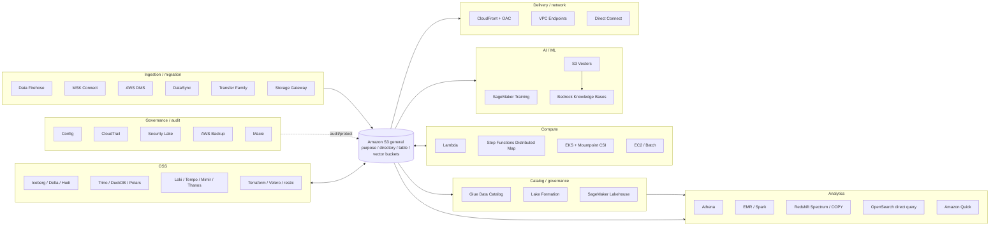
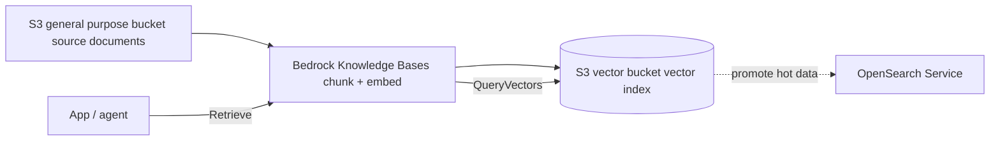
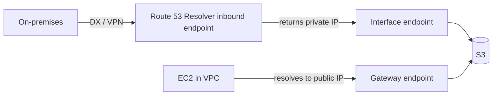
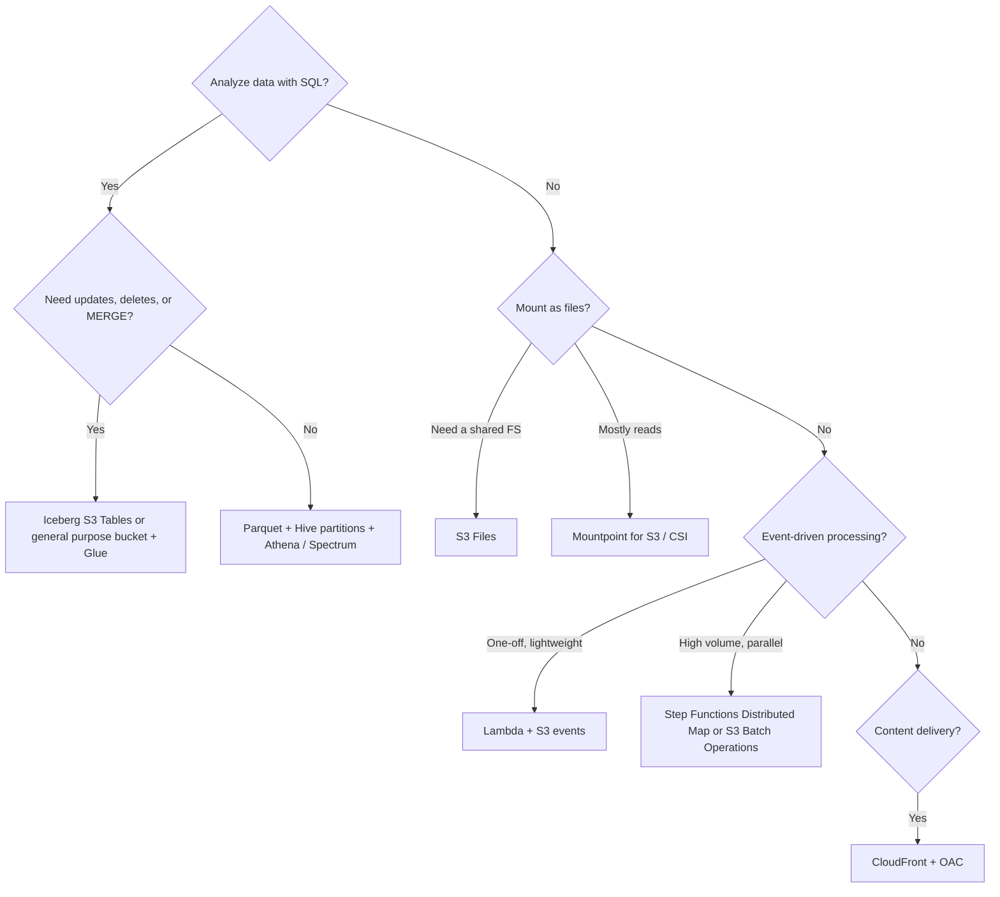

# The ecosystem around S3

_Last verified: 2026-10-03_

S3 is not "just object storage". Almost every AWS data service, and many open source projects, use it as their **shared persistence layer (system of record)**. This chapter looks across the ecosystem at who uses S3 and how, which settings matter, and where people get stuck.

Scope of this chapter:

- Integration with AWS services (analytics / compute / AI/ML / delivery / network / governance / migration)
- Integration with OSS and third parties (table formats, query engines, observability, backup, IaC, MLOps)
- File formats and partitioning strategy
- Ready-to-use snippets (Athena CTAS, Redshift COPY/UNLOAD, DuckDB, Spark, Terraform backend)

A machine-readable list is in `data/ecosystem.json` (built from the same sources as this document).

## 1. Overall map



Three ideas to keep in mind:

1. **Storage and compute are separate**: Data lives in exactly one place in S3, and multiple engines such as Athena / EMR / Redshift / Trino / DuckDB read the same files.
2. **The metadata layer is separate**: "Which files belong to which table" is held not by S3 but by the Glue Data Catalog / Iceberg metadata / Hive Metastore. S3 only holds bytes.
3. **Permissions are two-layered**: On top of S3 IAM / bucket policies sits Lake Formation (table-, column-, and row-level). Troubleshooting starts with figuring out which layer is denying access.

## 2. Analytics

### 2.1 Integration table

| Service | How it uses S3 | Key settings | Pitfalls |
| --- | --- | --- | --- |
| Amazon Athena | Serverless SQL over files on S3 through the Glue Data Catalog. Results are also written to S3 | Workgroup query result location, `partitioned_by`, partition projection | CTAS / INSERT INTO can write at most 100 partitions per query (`HIVE_TOO_MANY_OPEN_PARTITIONS`). Billing is per data scanned, so columnar formats + partitioning are a must |
| Glue Data Catalog | Table definitions for data on S3 (Hive-compatible metastore / Iceberg REST) | Database / table `LOCATION`, SerDe, partitions | Drift between the catalog and actual files (unregistered partitions return 0 rows) |
| Glue crawler | Scans S3 prefixes to infer and register schemas and partitions | Include path, exclude patterns, schema change policy | Slow and expensive with many small files. Inconsistent folder structure splits data into separate tables |
| Glue ETL | Spark jobs that read and write S3 | Job bookmark, `--enable-s3-parquet-optimized-committer`, etc. | Prevent the small-file problem yourself by using coalesce / repartition on output |
| Lake Formation | Registers S3 locations and centralizes column-, row-, and cell-level permissions per catalog | Data lake location registration, hybrid access mode, LF-Tags | Roles that can read S3 directly through IAM bypass LF. Watch out for managing both the registration role and IAM permissions |
| Amazon EMR | Reads and writes S3 from Spark / Hive / Trino / Presto (EMRFS / S3A) | Instance profile, EMRFS settings, S3-optimized committer | On EMR, the `s3://` scheme means EMRFS. In OSS Spark, use `s3a://` |
| Redshift Spectrum | Queries S3 directly through an external schema (Glue Data Catalog) | `CREATE EXTERNAL SCHEMA ... FROM DATA CATALOG`, IAM role | The Redshift cluster and the S3 bucket must be in the same Region |
| Redshift COPY / UNLOAD | Bulk loads from S3 into Redshift; exports from Redshift to S3 as Parquet / CSV / JSON | `IAM_ROLE`, `FORMAT AS PARQUET`, `PARTITION BY`, `MAXFILESIZE` | UNLOAD defaults to `PARALLEL ON` and produces many small files, one set per slice |
| Redshift auto-copy | Automatically COPYs new files through an S3 event integration (COPY JOB) | `COPY ... JOB CREATE <name> AUTO ON` | It tracks files already loaded, so design on the assumption that overwrites to the same key are not reloaded |
| SageMaker Lakehouse (lakehouse architecture of Amazon SageMaker) | Handles the S3 data lake and Redshift in a single catalog (Iceberg-compatible) | Managed catalog (S3 / RMS), federated catalog, Iceberg REST endpoint | Lake Formation makes the permission decisions. External engines use vended credentials |
| SageMaker Unified Studio | Integrated studio for using the Lakehouse above from a UI / notebooks | Roles per domain / project | First check that the project role has S3 permissions |
| Amazon Quick (formerly QuickSight) | Uses S3 manifests / Athena / S3 Tables as BI data sources | Data source settings, SPICE | Became Quick Suite in 2025-10 and is labeled Amazon Quick in 2026. Older articles use the QuickSight name |
| OpenSearch direct query | Queries data on S3 with SQL / PPL from OpenSearch Dashboards without ingesting it | Data source (Amazon S3 with Glue Data Catalog), checkpoint bucket | Tables must be created in the Glue Data Catalog by hand (automatic for Security Lake) |
| OpenSearch Ingestion | Pipeline that ingests from S3 (SQS notifications or scan) into OpenSearch | Pipeline `s3` source | With SQS notifications, assume no deduplication and no ordering guarantee |
| Amazon Data Firehose | Buffers streams and PUTs to S3. Parquet/ORC conversion, dynamic partitioning, Iceberg destinations | Buffer size 1–128 MB / interval 0–900 seconds, prefix, dynamic partitioning | With Parquet conversion / dynamic partitioning enabled, the buffer is 64–128 MB. Small buffer = lots of small files |
| MSK Connect | Kafka Connect S3 sink connector (Confluent, etc.) from topic to S3 | `connector.class=io.confluent.connect.s3.S3SinkConnector`, `flush.size`, `partitioner.class` | A small `flush.size` produces small files. You upload the plugin yourself as a custom plugin |
| AWS DMS | Outputs a database full load + CDC to S3 as CSV / Parquet | `DataFormat=parquet`, `ParquetVersion`, `CdcPath`, `DatePartitionEnabled` | CDC is an append-only log with an `Op` column (I/U/D). It is not a table as is, so MERGE it with Iceberg or similar |

### 2.2 Athena CTAS: converting CSV to Parquet + partitions

```sql
CREATE TABLE analytics.events_parquet
WITH (
  format = 'PARQUET',
  write_compression = 'ZSTD',
  external_location = 's3://amzn-s3-demo-bucket/curated/events/',
  partitioned_by = ARRAY['dt']
) AS
SELECT
  event_id,
  user_id,
  event_type,
  payload,
  date_format(event_time, '%Y-%m-%d') AS dt   -- partition column goes last in SELECT
FROM raw.events_csv
WHERE event_time >= TIMESTAMP '2026-09-01 00:00:00';
```

Key points:

- Put partition columns **last in the SELECT list** (Athena requirement).
- One CTAS can create at most 100 partitions. If you need more, split the work into CTAS + several `INSERT INTO` statements.
- Point `external_location` at an empty prefix. It fails if objects already exist there.

To create it as an Iceberg table:

```sql
CREATE TABLE analytics.events_iceberg
WITH (
  table_type = 'ICEBERG',
  is_external = false,
  location = 's3://amzn-s3-demo-bucket/iceberg/events/',
  format = 'PARQUET',
  partitioning = ARRAY['day(event_time)']
) AS
SELECT * FROM raw.events_csv;
```

Iceberg supports hidden partitioning (transforms such as `day(event_time)`), so queries do not need to know about partition columns.

### 2.3 Athena partition projection

For tables with many partitions (daily × several years × tenants, and so on), partition projection works well: instead of registering partitions in Glue, you declare the rules in table properties.

```sql
ALTER TABLE raw.access_logs SET TBLPROPERTIES (
  'projection.enabled' = 'true',
  'projection.dt.type' = 'date',
  'projection.dt.format' = 'yyyy/MM/dd',
  'projection.dt.range' = '2024/01/01,NOW',
  'projection.dt.interval' = '1',
  'projection.dt.interval.unit' = 'DAYS',
  'storage.location.template' = 's3://amzn-s3-demo-bucket/logs/${dt}/'
);
```

- You no longer need a crawler or `MSCK REPAIR TABLE`.
- Projection is Athena-only. Note that Redshift Spectrum and EMR do not interpret these settings.

### 2.4 Redshift COPY / UNLOAD

```sql
-- Load Parquet from S3
COPY sales.orders
FROM 's3://amzn-s3-demo-bucket/curated/orders/'
IAM_ROLE 'arn:aws:iam::111122223333:role/RedshiftS3Read'
FORMAT AS PARQUET;

-- Load CSV (gzip)
COPY sales.orders_staging
FROM 's3://amzn-s3-demo-bucket/raw/orders/2026/10/'
IAM_ROLE 'arn:aws:iam::111122223333:role/RedshiftS3Read'
CSV GZIP IGNOREHEADER 1
REGION 'ap-northeast-1';

-- Auto-copy (create the S3 event integration first)
COPY sales.orders
FROM 's3://amzn-s3-demo-bucket/landing/orders/'
IAM_ROLE 'arn:aws:iam::111122223333:role/RedshiftS3Read'
FORMAT AS PARQUET
JOB CREATE orders_autocopy AUTO ON;

-- Redshift to S3 (export to the data lake)
UNLOAD ('SELECT * FROM sales.orders WHERE order_date < ''2025-01-01''')
TO 's3://amzn-s3-demo-bucket/archive/orders/'
IAM_ROLE 'arn:aws:iam::111122223333:role/RedshiftS3Write'
FORMAT AS PARQUET
PARTITION BY (order_date)
MAXFILESIZE 256 MB;
```

- COPY makes the most of parallelism when the **file count is a multiple of the slice count**.
- AWS blog posts also recommend keeping UNLOAD output around 128–512 MB per file.
- `REGION` is required (for COPY) when the bucket and cluster are in different Regions.

### 2.5 Designing Data Firehose to S3

- The buffer flushes on "size (1–128 MB)" or "time (0–900 seconds)", whichever comes first.
- With Parquet / ORC conversion or dynamic partitioning enabled, the buffer size is 64–128 MB (default 128 MB).
- You can write prefixes like `!{partitionKeyFromQuery:tenant}/!{timestamp:yyyy/MM/dd}/`. Dynamic partitioning keys are extracted from JSON with jq.
- Send errors to a separate `errorOutputPrefix`. Without it, error records are hard to find.
- Iceberg tables (including S3 Tables) can be a direct destination too. Table-side compaction absorbs small files.

## 3. Compute

### 3.1 Integration table

| Service | How it uses S3 | Key settings | Pitfalls |
| --- | --- | --- | --- |
| AWS Lambda (S3 trigger) | S3 event notifications (direct / SNS / SQS / EventBridge) invoke functions | Event type (`s3:ObjectCreated:*`), prefix / suffix filters | Writing back to the same bucket causes an infinite loop. Lambda recursive loop detection catches loops involving S3, but separating prefixes or using another bucket is the baseline |
| Lambda + S3 Files | Mounts an S3 bucket as a file system from Lambda (announced 2026-04) | Function file system settings | Not supported for functions that use a capacity provider |
| Step Functions Distributed Map | `ItemReader` reads S3 object lists / CSV / JSON / JSONL / S3 Inventory manifests and runs child workflows in massive parallel | `ItemReader`, `ItemBatcher`, `ResultWriter`, `MaxConcurrency` | "Folder" objects created in the console count as items too, causing extra child executions |
| Amazon EKS + Mountpoint CSI driver | Mounts an S3 bucket into Pods as a PersistentVolume via `s3.csi.aws.com` | EKS add-on `aws-mountpoint-s3-csi-driver`, IRSA / Pod Identity, `mountOptions` | Static provisioning only. No Fargate, Windows, or Hybrid Nodes. Not fully POSIX-compatible (append and rename restrictions) |
| Amazon ECS | SDK access with a task role. For file access, use S3 Files / your own Mountpoint | Task role, VPC endpoint | ECS has a native S3 Files volume type (`s3filesVolumeConfiguration`; Fargate, ECS Managed Instances, and EC2 as of 2026-09). There is no native Mountpoint volume type for ECS (unlike the EKS Mountpoint CSI driver) |
| Amazon EC2 | SDK / CLI / Mountpoint with temporary credentials from an instance profile (IAM role) | Instance profile, IMDSv2 | Don't bake credentials into AMIs or user data. The IMDSv2 hop limit is a common reason containers can't see credentials |
| AWS Batch | Job inputs and outputs on S3. At large scale, choose between it and S3 Batch Operations | Job role, container input/output prefixes | If you "just call an API per S3 object", S3 Batch Operations is cheaper and simpler |
| Amazon S3 Files | Exposes an S3 bucket as an EFS-based file system (GA 2026-04) | File system creation, mount targets | Check the consistency model separately when using the file API and object API at the same time (details in another chapter) |

### 3.2 Step Functions Distributed Map (excerpt)

```json
{
  "Type": "Map",
  "ItemReader": {
    "Resource": "arn:aws:states:::s3:listObjectsV2",
    "Parameters": {
      "Bucket": "amzn-s3-demo-bucket",
      "Prefix": "incoming/images/"
    }
  },
  "ItemBatcher": {
    "MaxItemsPerBatch": 100
  },
  "MaxConcurrency": 1000,
  "ItemProcessor": {
    "ProcessorConfig": {
      "Mode": "DISTRIBUTED",
      "ExecutionType": "EXPRESS"
    },
    "StartAt": "Process",
    "States": {
      "Process": {
        "Type": "Task",
        "Resource": "arn:aws:states:::lambda:invoke",
        "Parameters": {
          "FunctionName": "arn:aws:lambda:ap-northeast-1:111122223333:function:resize",
          "Payload.$": "$"
        },
        "End": true
      }
    }
  },
  "ResultWriter": {
    "Resource": "arn:aws:states:::s3:putObject",
    "Parameters": {
      "Bucket": "amzn-s3-demo-bucket",
      "Prefix": "map-results/"
    }
  },
  "End": true
}
```

- Besides object lists, `ItemReader` accepts CSV / JSON / JSONL / S3 Inventory manifests as input.
- Specifying a prefix with the `LOAD_AND_FLATTEN` transformation reads the contents of multiple objects directly as items.
- Lower `MaxConcurrency` to match downstream limits (Lambda concurrency, request rate per S3 prefix).

### 3.3 Mountpoint CSI driver (EKS) PV example

```yaml
apiVersion: v1
kind: PersistentVolume
metadata:
  name: s3-pv
spec:
  capacity:
    storage: 1200Gi          # value is ignored but the field is required
  accessModes:
    - ReadWriteMany
  storageClassName: ""
  mountOptions:
    - allow-delete
    - region ap-northeast-1
  csi:
    driver: s3.csi.aws.com
    volumeHandle: s3-csi-driver-volume
    volumeAttributes:
      bucketName: amzn-s3-demo-bucket
---
apiVersion: v1
kind: PersistentVolumeClaim
metadata:
  name: s3-pvc
spec:
  accessModes:
    - ReadWriteMany
  storageClassName: ""
  resources:
    requests:
      storage: 1200Gi
  volumeName: s3-pv
```

- v2 runs Mountpoint in dedicated Pods, so multiple Pods can share a volume with the same configuration (pod sharing). It also supports EKS Pod Identity and SELinux.
- POSIX operations such as overwriting or renaming existing files are limited. Its strengths are reading ML training data and writing new files rather than appending to logs.

## 4. AI / ML

### 4.1 Integration table

| Service | How it uses S3 | Key settings | Pitfalls |
| --- | --- | --- | --- |
| SageMaker Training (File mode) | Downloads the S3 prefix to the instance's EBS before training starts | `TrainingInputMode=File`, `S3DataDistributionType` (`FullyReplicated` / `ShardedByS3Key`) | Needs enough local capacity for the whole dataset. Training does not start until the download finishes |
| SageMaker Training (FastFile mode) | Exposes S3 as a read-only FUSE mount at `/opt/ml/data/<channel>` and streams on demand | `TrainingInputMode=FastFile` | S3 prefixes only (no manifest / augmented manifest). Throughput drops with random access and small files |
| SageMaker Training (Pipe mode) | Streams from S3 into the training container through named pipes | `TrainingInputMode=Pipe` | Assumes sequential reads. For new work, FastFile is the first choice |
| SageMaker model artifacts | Stores `model.tar.gz` and checkpoints in S3 | `OutputDataConfig`, `CheckpointConfig` | Align KMS keys and VPC endpoint policies with the training role |
| Bedrock Knowledge Bases | Syncs S3 as a RAG data source (ingest, chunk, embed) | Data source S3 URI, `<file>.metadata.json` sidecar | S3 changes are not reflected until you run a sync explicitly. The metadata file name is the original file name + `.metadata.json` |
| Amazon S3 Vectors | Stores embeddings in vector buckets / vector indexes and runs nearest-neighbor search with `QueryVectors` (GA 2025-12) | Dimensions, distance (cosine / euclidean), non-filterable metadata keys | Up to 2 billion vectors per index. Filterable metadata is 2 KB per vector. For high-QPS use cases, OpenSearch is recommended |
| Bedrock KB + S3 Vectors | Choose S3 Vectors as the KB vector store | Vector store settings | Through KB, custom metadata is limited to 1 KB / 35 keys. Hierarchical chunking easily exceeds the limit |
| OpenSearch + S3 Vectors | Keeps infrequently used vectors in S3 Vectors and runs hybrid search with OpenSearch | Engine settings | Configuration details change between versions, so check them |
| Amazon Q Business | Indexes documents with the S3 connector | Data source settings | Stopped accepting new customers on 2026-07-31 (maintenance). For new work, consider Amazon Quick or similar |
| Bedrock batch inference | Reads input JSONL from S3 and writes output to S3 | `inputDataConfig` / `outputDataConfig` | Pairs well with the Step Functions Distributed Map JSONL ItemReader for processing results |

### 4.2 Guidelines for laying out training data

- **Many small files are an anti-pattern**: A layout like one image = one object is slow with both FastFile and Mountpoint. Pack data into shards of 100 MB or more with WebDataset (tar shards), TFRecord, Parquet, and so on.
- **Shard for distributed training**: Use File mode's `ShardedByS3Key` to assign different files to each instance.
- **Same Region**: Keep the training job and the S3 bucket in the same Region. Cross-Region hurts on both transfer charges and latency.
- **S3 Express One Zone (directory bucket)**: Used as a low-latency layer for frequent reads during training and for saving checkpoints (details in another chapter).

### 4.3 Where S3 Vectors fits



- S3 Vectors is strongest at "storing a lot cheaply, with low to moderate query rates".
- If you need to sustain hundreds to thousands of QPS, put OpenSearch in front. That is the division of roles AWS has in mind.

## 5. Content delivery

| Feature | How it uses S3 | Key settings | Pitfalls |
| --- | --- | --- | --- |
| CloudFront + OAC | Uses the S3 REST endpoint as the origin, and only CloudFront fetches with SigV4 | Origin Access Control, bucket policy with `cloudfront.amazonaws.com` + `AWS:SourceArn` condition | OAI is legacy. With SSE-KMS, also allow CloudFront in the KMS key policy. OAC does not work with the S3 website endpoint |
| CloudFront signed URLs / cookies | Delivers private content for a limited time | Key group (public keys), trusted key groups | Not the same as S3 presigned URLs. CloudFront signatures are verified at the edge, and CloudFront fetches from S3 with OAC |
| S3 presigned URL | Direct GET / PUT from clients to S3 | Expiration, signer's permissions | If the signer's credentials (STS) expire first, the URL stops working too |
| Lambda@Edge / CloudFront Functions | Rewrites origin requests (for example, `/` to `/index.html`, image resizing) | Viewer / origin request triggers | Create Lambda@Edge in us-east-1. CloudFront Functions are for lightweight processing and cannot access S3 |
| S3 Object Lambda | Transforms objects with Lambda on GET | Object Lambda Access Point | Closed to new customers from 2025-11-07 (maintenance). For new designs, use CloudFront + Lambda@Edge or similar instead |

A typical bucket policy for OAC:

```json
{
  "Version": "2012-10-17",
  "Statement": [
    {
      "Sid": "AllowCloudFrontServicePrincipalReadOnly",
      "Effect": "Allow",
      "Principal": { "Service": "cloudfront.amazonaws.com" },
      "Action": "s3:GetObject",
      "Resource": "arn:aws:s3:::amzn-s3-demo-bucket/*",
      "Condition": {
        "StringEquals": {
          "AWS:SourceArn": "arn:aws:cloudfront::111122223333:distribution/EDFDVBD6EXAMPLE"
        }
      }
    }
  ]
}
```

## 6. Network

| Path | Characteristics | Pricing | Pitfalls |
| --- | --- | --- | --- |
| Gateway endpoint | Adds the S3 prefix list to route tables. For access from inside a VPC | No extra charge | Same Region only. Not usable from on-premises or peered VPCs |
| Interface endpoint (PrivateLink) | Creates ENIs in subnets and reaches S3 over private IPs | Hourly + per-GB data processed | Enabling private DNS sends in-VPC traffic down the paid path too. The standard approach is "private DNS for the inbound endpoint only", combined with a gateway endpoint |
| Direct Connect / Site-to-Site VPN | On-premises to an interface endpoint, or to the S3 public endpoint over a public VIF | DX port / transfer charges | Use a Route 53 Resolver inbound endpoint so on-premises DNS resolves S3 to private IPs |
| VPC endpoint policy | Restricts which buckets are reachable through the endpoint (data exfiltration control) | None | Can also block AWS-owned buckets used by AWS managed services (for example, repositories) and break package downloads |
| Bucket policy `aws:SourceVpce` | Denies access except through specific endpoints | None | Also blocks console operations. Always add an exception for admin roles |

Combining gateway + interface endpoints (cost-optimal):



## 7. Governance / security

| Service | Relationship to S3 | Key settings | Pitfalls |
| --- | --- | --- | --- |
| AWS Organizations | Guards S3 operations across accounts with SCPs / RCPs (for example, blocking Block Public Access from being disabled) | SCP, RCP, organization-level S3 Block Public Access policy | SCPs cap the principal side and RCPs cap the resource side. Neither grants permissions |
| AWS Control Tower | Creates a central log bucket in the Log Archive account of the landing zone. Provides S3-related controls | Landing zone, controls (preventive / detective / proactive) | Changing Control Tower–managed buckets by hand counts as drift |
| AWS Config | Records S3 configuration and evaluates it with managed rules | For example, `s3-bucket-public-read-prohibited`, `s3-bucket-ssl-requests-only`, `s3-bucket-server-side-encryption-enabled` | Config itself also delivers to S3. Rule names come and go, so check the list in the documentation |
| AWS CloudTrail | Delivers management events and S3 data events (GetObject / PutObject, etc.) to an S3 bucket | Trail, advanced event selectors | Data events are high-volume and get expensive. Narrow down target buckets and operations |
| CloudTrail Lake | Managed SQL store for CloudTrail events | Event data store | Closed to new customers on 2026-05-31 (maintenance). AWS recommends moving to CloudWatch |
| Amazon Security Lake | Normalizes security logs to OCSF and stores them as Parquet + Iceberg in S3 in your own account | One bucket per Region, rollup Region, subscribers | Custom sources must be written as OCSF + Parquet. Don't touch the buckets from anything other than the Security Lake managed role |
| AWS Backup | S3 continuous backup (35-day PITR) and periodic backup (up to 99 years) | Backup plan, vault | Requires bucket versioning. Disabling EventBridge notifications stops continuous backup |
| Amazon Macie | Detects sensitive data in S3 objects with machine learning + patterns. Also evaluates bucket public exposure | Automated sensitive data discovery, classification jobs | Jobs are billed by data scanned. Without narrowing the scope, it gets expensive |
| IAM Access Analyzer for S3 | Detects buckets shared externally | Analyzer | Whether something counts as outside the account / organization depends on the analyzer's zone of trust |
| Amazon GuardDuty S3 Protection / Malware Protection for S3 | Anomaly detection on data events, malware scanning of uploaded objects | Protection plan | Malware scan results come back as object tags. If you build access control on tags, design ABAC first |

## 8. Migration

| Service | How it uses S3 | Key settings | Pitfalls / status |
| --- | --- | --- | --- |
| AWS DataSync | Online transfer from NFS / SMB / HDFS / other clouds to S3, and between S3 and S3 / EFS / FSx | Agent (on-premises), task, transfer mode, filter | Verify mode adds time. You can set the S3 storage class at the destination |
| AWS Transfer Family (SFTP / FTPS / FTP / AS2) | S3 is the backend for protocol servers | Server, user, logical directory, IAM role | Directories are a pseudo-representation of prefixes. A rename is CopyObject + DeleteObject |
| Transfer Family web apps | Managed portal for browsing, uploading, and downloading S3 from a browser | IAM Identity Center, S3 Access Grants, CORS | Supports private access through VPC endpoints since 2025-11. Permissions are expressed with S3 Access Grants |
| Storage Gateway - S3 File Gateway | Files written over NFS / SMB become S3 objects | File share, cache disk, refresh cache | If you change S3 directly, you need RefreshCache |
| Storage Gateway - FSx File Gateway | Local cache for FSx for Windows | - | Closed to new customers since 2024-10-28 |
| Storage Gateway - Volume Gateway | iSCSI block volumes. Snapshots are EBS snapshots | Cached / stored volume | The data is on S3 but not directly visible through the S3 API |
| Storage Gateway - Tape Gateway | VTL. Stores virtual tapes in S3 / S3 Glacier classes | Tape pool | Tape Gateway on Snowball Edge was discontinued in 2024-03 |
| AWS Snowball Edge | Offline transfer with physical devices | - | Closed to new customers since 2025-11-07. For new work, use DataSync / AWS Data Transfer Terminal / partners |
| AWS Data Transfer Terminal | Bring devices to a physical site for high-speed upload | Reservation | Locations are limited. See the official page for details |
| S3 Batch Operations / S3 Replication | Copying and migrating large numbers of objects, cross-Region replication | Manifest (Inventory), replication rule | Replicating existing objects requires Batch Replication |

## 9. Open source / third party

### 9.1 Table formats and query engines

| OSS | How it uses S3 | Key settings | Pitfalls |
| --- | --- | --- | --- |
| Apache Iceberg | Stores metadata (metadata.json / manifest list / manifest) and data files in S3. Commits are atomic through the catalog | Catalog (Glue / REST / S3 Tables), `S3FileIO` | Small files and snapshots pile up. Compaction, expire snapshots, and orphan file removal are required operations (automatic with S3 Tables) |
| Delta Lake | JSON commit log in `_delta_log/` + Parquet | `S3DynamoDBLogStore` (when writing from multiple clusters) | The official storage docs say concurrent writes from multiple clusters need DynamoDB-based locking (`S3DynamoDBLogStore`). Native S3 conditional-write support has not shipped as of Delta 4.4.0 (2026-08): the feature request was closed as not planned and the prototype PRs were closed unmerged |
| Apache Hudi | Timeline (`.hoodie/`) + Parquet / log files. CoW / MoR | Table type, lock provider (DynamoDB, etc.) | Concurrent writes need a lock provider. In versioned buckets the cleaner piles up delete markers, so clean them up with lifecycle rules |
| Apache Spark (S3A) | Uses `s3a://` through the Hadoop S3A connector | `fs.s3a.*`, S3A committer | The default committer is `file` (rename-based) and is a poor fit for S3. Specify `magic` / `directory` / `partitioned` |
| Trino / Presto | Reads S3 through Hive / Iceberg / Delta connectors | `fs.s3.enabled=true` (as of Trino 483), `s3.region`, metastore | Native S3 file system settings and the old Hadoop-based (legacy) settings use different keys. Check the docs for your version |
| DuckDB | Reads and writes `s3://` directly with the `httpfs` extension | `CREATE SECRET (TYPE s3, PROVIDER credential_chain)` | Globs LIST many objects, so narrow the prefix. Use `hive_partitioning` for Hive partitions |
| Polars | Lazy evaluation + predicate pushdown with `scan_parquet("s3://...")` | `storage_options` (region, etc.) | Credential resolution order depends on environment variables / profiles. Setting it explicitly is safer |
| Apache Arrow (PyArrow) | `pyarrow.fs.S3FileSystem` and `pyarrow.dataset` | `region`, `endpoint_override` | Relying on automatic region detection is slow or fails across Regions |
| ClickHouse | `s3()` table function, `S3` table engine, `S3Queue`, S3 disks for MergeTree | `ENGINE = S3(path, format)`, partition strategy | The S3 engine can write partitions, but reading with partitions is not implemented (per the official docs) |
| Kafka tiered storage (KIP-405) | Offloads old log segments to remote storage (S3, etc.) | `remote.log.storage.system.enable=true`, topic `remote.storage.enable=true`, `local.retention.ms` | Production ready in Apache Kafka 3.9. No S3 implementation is bundled, so you need a plugin such as Aiven's. Compacted topics are not supported |

### 9.2 Observability (Grafana / Prometheus family)

| OSS | What it stores in S3 | Key settings | Pitfalls |
| --- | --- | --- | --- |
| Grafana Loki | Log chunks and TSDB index | `storage_config.aws` (`bucketnames`, `region`), `schema_config` (`store: tsdb`, `object_store: s3`, `schema: v13`) | For schema changes, don't edit existing entries; add a new entry with a future `from` |
| Grafana Tempo | Trace blocks | `storage.trace.backend: s3` | It produces many small blocks, so always run the compactor |
| Grafana Mimir | Metrics TSDB blocks, ruler, alertmanager state | `common.storage.backend: s3` | Use separate buckets or prefixes for blocks / ruler / alertmanager |
| Thanos | The sidecar uploads Prometheus 2-hour blocks, and the store gateway reads them | Objstore config (`type: S3`) | Run only one compactor instance per bucket |
| Cortex | Block storage in the same family as Mimir | `blocks_storage.backend: s3` | For new deployments, many teams consider Mimir instead (your call) |

Minimal Loki configuration example:

```yaml
schema_config:
  configs:
    - from: 2024-04-01
      store: tsdb
      object_store: s3
      schema: v13
      index:
        prefix: index_
        period: 24h

storage_config:
  tsdb_shipper:
    active_index_directory: /loki/index
    cache_location: /loki/index_cache
  aws:
    region: ap-northeast-1
    bucketnames: amzn-s3-demo-loki-chunks
    s3forcepathstyle: false
```

### 9.3 Backup / IaC / DevOps / MLOps

| OSS | How it uses S3 | Key settings | Pitfalls |
| --- | --- | --- | --- |
| Terraform S3 backend | Stores state files in S3. S3-native locking with `use_lockfile` | `bucket`, `key`, `region`, `encrypt`, `use_lockfile = true` | Introduced as experimental in 1.10, GA in 1.11. `dynamodb_table` and related settings are deprecated. Enabling versioning is recommended |
| OpenTofu S3 backend | Supports S3 lockfiles like Terraform | `use_lockfile` | Added in 1.10.0 (2025-06), not marked experimental. Unlike Terraform, `dynamodb_table` is not deprecated: both locking mechanisms are supported, and you can migrate by enabling both first |
| Velero | Backs up Kubernetes resources to S3; PVs via snapshots or file-level backup | `velero-plugin-for-aws`, BackupStorageLocation | Don't share a bucket prefix across multiple clusters |
| restic | Deduplicated, encrypted repositories on S3 | `restic -r s3:s3.ap-northeast-1.amazonaws.com/bucket_name init` (path-style with a Regional endpoint) | Watch the interaction between prune and Object Lock or lifecycle deletion of noncurrent versions |
| Docker Registry (CNCF Distribution) | Image layers / manifests on S3 | `storage.s3` (`region`, `bucket`, `encrypt`, `rootdirectory`, `chunksize`) | `chunksize` must be over 5 MB (default 10 MB). Switch to read-only mode while GC runs |
| Git LFS | Uses S3 as the backend of an LFS server (GitLab / Gitea, etc.) | Each server's object storage settings | By default the Git LFS client does not talk to S3 directly; it needs a server that implements the LFS Batch API. The exception is a standalone custom transfer agent (e.g. `git-lfs-s3` from awslabs/git-remote-s3) |
| MLflow | `s3://` as the artifact store | `--artifacts-destination s3://...` (proxy) / `--default-artifact-root` | Proxy mode (default, `--artifacts-destination`): the server holds the S3 credentials. Direct mode (`--default-artifact-root` + `--no-serve-artifacts`): clients need S3 credentials |
| DVC | Remote for versioning data / models | `dvc remote add -d storage s3://bucket/path` | It is content-addressed, so object counts grow. Deleting with lifecycle rules breaks past versions |
| rclone / s5cmd | Fast copy / sync CLIs | Remote settings, parallelism | Too much parallelism triggers 503 SlowDown |

## 10. Snippets

### 10.1 Querying s3:// directly with DuckDB

```sql
INSTALL httpfs;
LOAD httpfs;

-- Authenticate with the standard AWS resolution order: env vars / ~/.aws / IMDS, etc.
CREATE OR REPLACE SECRET s3_default (
    TYPE s3,
    PROVIDER credential_chain,
    REGION 'ap-northeast-1'
);

-- glob + Hive partitions
SELECT dt, count(*) AS events
FROM read_parquet(
    's3://amzn-s3-demo-bucket/curated/events/*/*.parquet',
    hive_partitioning = true
)
WHERE dt >= '2026-09-01'
GROUP BY dt
ORDER BY dt;

-- Write results back to S3 with partitions
COPY (
    SELECT * FROM read_parquet('s3://amzn-s3-demo-bucket/curated/events/*/*.parquet', hive_partitioning = true)
    WHERE event_type = 'purchase'
) TO 's3://amzn-s3-demo-bucket/marts/purchases' (
    FORMAT parquet,
    PARTITION_BY (dt),
    OVERWRITE_OR_IGNORE true
);
```

### 10.2 Spark (S3A + Iceberg + Glue Catalog)

```properties
# S3A basics
spark.hadoop.fs.s3a.aws.credentials.provider=software.amazon.awssdk.auth.credentials.DefaultCredentialsProvider
spark.hadoop.fs.s3a.endpoint.region=ap-northeast-1
spark.hadoop.fs.s3a.connection.maximum=200
spark.hadoop.fs.s3a.fast.upload=true

# S3A committer (avoid the rename-based file committer)
spark.hadoop.fs.s3a.committer.name=magic
spark.hadoop.fs.s3a.committer.magic.enabled=true
spark.sql.sources.commitProtocolClass=org.apache.spark.internal.io.cloud.PathOutputCommitProtocol
spark.sql.parquet.output.committer.class=org.apache.spark.internal.io.cloud.BindingParquetOutputCommitter

# Iceberg + Glue Data Catalog
spark.sql.extensions=org.apache.iceberg.spark.extensions.IcebergSparkSessionExtensions
spark.sql.catalog.glue=org.apache.iceberg.spark.SparkCatalog
spark.sql.catalog.glue.catalog-impl=org.apache.iceberg.aws.glue.GlueCatalog
spark.sql.catalog.glue.io-impl=org.apache.iceberg.aws.s3.S3FileIO
spark.sql.catalog.glue.warehouse=s3://amzn-s3-demo-bucket/warehouse/
```

Notes:

- `PathOutputCommitProtocol` / `BindingParquetOutputCommitter` need the `spark-hadoop-cloud` module on the classpath.
- The class name for `fs.s3a.aws.credentials.provider` differs by Hadoop version (AWS SDK v1 / v2). Hadoop 3.4.x uses SDK v2.
- On EMR, `s3://` (EMRFS) and EMR's S3-optimized committer are available by default, so the S3A settings above are often unnecessary.
- Iceberg does not rely on rename, so S3A committer issues do not occur when writing to Iceberg tables.

### 10.3 Terraform backend (S3-native locking)

```hcl
terraform {
  required_version = ">= 1.11.0"

  backend "s3" {
    bucket       = "amzn-s3-demo-tfstate"
    key          = "prod/network/terraform.tfstate"
    region       = "ap-northeast-1"
    encrypt      = true
    use_lockfile = true
    # dynamodb_table = "tf-locks"  # deprecated in 1.11. Use both only during migration
  }
}
```

- The lock is a `<key>.tflock` object created next to the state with an S3 conditional write (`If-None-Match`).
- `use_lockfile` defaults to `false`. Set it to `true` explicitly.
- Using it together with `dynamodb_table` takes the lock in both places, so a gradual migration is safe. After migrating, run `terraform init -reconfigure`.
- IAM needs `s3:GetObject` / `s3:PutObject` / `s3:DeleteObject` on the `.tflock` object.
- The standard setup for the state bucket is versioning + SSE-KMS + Block Public Access + enforced `aws:SecureTransport`.

IAM excerpt for the state bucket:

```json
{
  "Version": "2012-10-17",
  "Statement": [
    {
      "Effect": "Allow",
      "Action": "s3:ListBucket",
      "Resource": "arn:aws:s3:::amzn-s3-demo-tfstate",
      "Condition": { "StringLike": { "s3:prefix": ["prod/network/*"] } }
    },
    {
      "Effect": "Allow",
      "Action": ["s3:GetObject", "s3:PutObject"],
      "Resource": "arn:aws:s3:::amzn-s3-demo-tfstate/prod/network/terraform.tfstate"
    },
    {
      "Effect": "Allow",
      "Action": ["s3:GetObject", "s3:PutObject", "s3:DeleteObject"],
      "Resource": "arn:aws:s3:::amzn-s3-demo-tfstate/prod/network/terraform.tfstate.tflock"
    }
  ]
}
```

### 10.4 Polars / PyArrow

```python
import polars as pl
import pyarrow.dataset as ds
import pyarrow.fs as pafs

# Polars: predicate / projection pushdown with lazy evaluation
lf = pl.scan_parquet(
    "s3://amzn-s3-demo-bucket/curated/events/**/*.parquet",
    storage_options={"aws_region": "ap-northeast-1"},
    hive_partitioning=True,
)
daily = (
    lf.filter(pl.col("dt") >= "2026-09-01")
    .group_by("dt")
    .agg(pl.len().alias("events"))
    .collect()
)

# PyArrow: S3FileSystem + dataset
s3 = pafs.S3FileSystem(region="ap-northeast-1")
dataset = ds.dataset(
    "amzn-s3-demo-bucket/curated/events/",
    filesystem=s3,
    format="parquet",
    partitioning="hive",
)
table = dataset.to_table(columns=["event_id", "dt"], filter=ds.field("dt") >= "2026-09-01")
```

### 10.5 ClickHouse

```sql
-- One-off read (table function)
SELECT count()
FROM s3('https://amzn-s3-demo-bucket.s3.ap-northeast-1.amazonaws.com/curated/events/*/*.parquet', 'Parquet');

-- Table engine
CREATE TABLE events_s3
(
    event_id String,
    user_id  UInt64,
    dt       Date
)
ENGINE = S3('https://amzn-s3-demo-bucket.s3.ap-northeast-1.amazonaws.com/exports/events/*.parquet', 'Parquet');
```

### 10.6 Kafka tiered storage (broker / topic)

```properties
# broker
remote.log.storage.system.enable=true
remote.log.storage.manager.class.name=io.aiven.kafka.tieredstorage.RemoteStorageManager
remote.log.storage.manager.class.path=/opt/kafka/tiered-storage/*
rsm.config.storage.backend.class=io.aiven.kafka.tieredstorage.storage.s3.S3Storage
rsm.config.storage.s3.bucket.name=amzn-s3-demo-kafka-tiered
rsm.config.storage.s3.region=ap-northeast-1

# topic (set with kafka-configs)
remote.storage.enable=true
local.retention.ms=86400000
retention.ms=2592000000
```

Key names under `rsm.config.*` are specific to the plugin (Aiven here). Always check the documentation of the plugin you adopt.

## 11. File formats

| Format | Type | Good for | Notes on S3 |
| --- | --- | --- | --- |
| Parquet | Columnar, compressed, with statistics | General analytics. First choice for Athena / Spark / Redshift / DuckDB | Row group min/max statistics enable skipping. Sorting before writing makes a big difference |
| ORC | Columnar | Hive ecosystem | Same role as Parquet. For new work, Parquet is the safe choice |
| Avro | Row-oriented, schema embedded | Kafka / streaming, schema evolution | Poor fit for analytic queries. Suited to the ingestion layer (bronze) |
| JSON / JSONL | Row-oriented text | Logs, API dumps, Bedrock batch input/output | Compression (gzip / zstd) is a must. gzip is not splittable, so keep file sizes down |
| CSV | Row-oriented text | External integrations, legacy | Inconsistent types, escaping, and headers. Convert to Parquet early |
| Iceberg / Delta / Hudi | Table formats (a metadata layer on top of Parquet) | ACID, time travel, schema evolution, MERGE | Metadata and snapshots need maintenance |
| WebDataset / TFRecord | Sharded containers | ML training data | Pack into shards of about 100 MB to 1 GB each |

Parquet best practices:

1. **Aim for files of about 128 MB to 1 GB**. Large numbers of small files (a few KB to a few MB) blow up LIST / GET request counts and engine task counts.
2. **Compress with ZSTD or Snappy**. Choose ZSTD for compression ratio and Snappy for low CPU load.
3. **Sort / cluster by frequently filtered columns** before writing. This makes row group statistics skipping effective.
4. **Row group size** of around 128 MB is common (following the engine's default is fine).
5. **Schema evolution** is safe on every engine if you limit it to adding columns. Leave type changes and renames to a table format (Iceberg).
6. **Deeply nested structures** are supported differently by each engine. Flatten them reasonably for analytics.

## 12. Partitioning strategy

### 12.1 Hive-style layout and S3 key design

```text
s3://amzn-s3-demo-bucket/curated/events/dt=2026-10-01/part-00000.parquet
s3://amzn-s3-demo-bucket/curated/events/dt=2026-10-01/part-00001.parquet
s3://amzn-s3-demo-bucket/curated/events/dt=2026-10-02/part-00000.parquet
```

- The `key=value/` format is a common language that Athena / Glue / Spark / Trino / DuckDB / Polars all understand.
- S3 request rates scale per prefix (a guideline is 3,500 PUT / 5,500 GET req/s per prefix). Splitting prefixes by date spreads the load naturally.

### 12.2 Choosing the granularity

| Situation | Recommendation |
| --- | --- |
| Several GB or more of data per day | `dt=` (daily). Add `hour=` if needed |
| Tens of MB of data per day | Roll up to monthly (`month=`), or use no partitions with Iceberg hidden partitioning |
| Many tenants (thousands or more) | Don't use the tenant as a partition key. Make it a sort column or use Iceberg's bucket transform |
| Queries always target the last N days | Daily + partition projection, or Iceberg |
| High-cardinality columns (user_id, etc.) | Sorting / bucketing instead of partitioning |

Anti-patterns:

1. **Too many partitions**: Each partition holds only a few MB of files. Metadata and request counts dominate.
2. **Splitting year/month/day into separate levels that don't sort as strings**: Without zero padding, as in `year=2026/month=9/`, range filters become hard. A single `dt=2026-09-01` column is easier to work with.
3. **Duplicating the partition column inside data files with mismatched values**: Engines differ in which one they trust.
4. **Partitions not registered in Glue**: The data is there, but queries return 0 rows. Fix it at the root with projection or Iceberg.

### 12.3 Hive partitions vs Iceberg

| Aspect | Hive style (directories) | Apache Iceberg |
| --- | --- | --- |
| Where partitions live | S3 paths + catalog registration | Iceberg metadata (manifests) |
| Changing partitions | Requires rewriting | Old and new coexist with partition evolution |
| What queries must know | WHERE on the partition column is required | Hidden partitioning prunes automatically from conditions on regular columns |
| Need for LIST | The engine LISTs prefixes | File list comes straight from manifests (no LIST needed) |
| Concurrent writes | Basically no protection | Optimistic concurrency control through the catalog |
| Operations | Handle small files yourself | Needs compaction / snapshot expiration (automatic with S3 Tables) |

## 13. Choosing (summary)



- When in doubt: "one copy of the data in S3, metadata in a catalog, permissions in IAM + Lake Formation, and pick engines by use case".
- In new designs, don't depend on services that have entered maintenance (S3 Object Lambda, Snowball Edge, CloudTrail Lake, Amazon Q Business, FSx File Gateway).

## 14. Service status changes (2024–2026)

| Item | Change | When |
| --- | --- | --- |
| Amazon FSx File Gateway | Closed to new customers | 2024-10-28 |
| Terraform S3 backend `use_lockfile` | Experimental in 1.10, GA in 1.11, DynamoDB-related arguments deprecated | 1.10 / 1.11 |
| Amazon S3 Vectors | Preview (2025-07), then GA (2025-12) | 2025 |
| Amazon QuickSight | Became Amazon Quick Suite (2025-10), now labeled Amazon Quick | 2025-10 onward |
| AWS Snowball Edge / S3 Object Lambda / Amazon Glacier (vault) | Maintenance (closed to new customers) | 2025-11-07 |
| Transfer Family web apps | VPC endpoint support | 2025-11 |
| Amazon S3 Files | GA (EFS-based file system for S3), also mountable from Lambda | 2026-04 |
| AWS CloudTrail Lake | Maintenance (closed to new customers on 2026-05-31) | Announced 2026-03 |
| Amazon Q Business | Maintenance (closed to new customers on 2026-07-31) | Announced 2026-06 |
| Apache Kafka tiered storage | Production ready in 3.9 | 2024-11 |

## References

- [Amazon S3 Vectors is now generally available](https://aws.amazon.com/about-aws/whats-new/2025/12/amazon-s3-vectors-generally-available/)
- [Amazon S3 Vectors: Limitations and restrictions](https://docs.aws.amazon.com/AmazonS3/latest/userguide/s3-vectors-limitations.html)
- [Bedrock: Prerequisites for using a vector store you created for a knowledge base](https://docs.aws.amazon.com/bedrock/latest/userguide/knowledge-base-setup.html)
- [Bedrock: Include metadata in a data source](https://docs.aws.amazon.com/bedrock/latest/userguide/kb-metadata.html)
- [AWS Service Availability Updates (2025-10)](https://aws.amazon.com/about-aws/whats-new/2025/10/aws-service-availability/)
- [AWS Service Availability Updates (2026-03)](https://aws.amazon.com/about-aws/whats-new/2026/03/aws-service-availability/)
- [AWS Service Availability Updates (2026-06)](https://aws.amazon.com/about-aws/whats-new/2026/06/aws-service-availability/)
- [CloudTrail Lake availability change](https://docs.aws.amazon.com/awscloudtrail/latest/userguide/cloudtrail-lake-service-availability-change.html)
- [AWS Snowball Edge availability change](https://docs.aws.amazon.com/snowball/latest/developer-guide/snowball-edge-availability-change.html)
- [Storage Gateway Volume Gateway document history](https://docs.aws.amazon.com/storagegateway/latest/vgw/DocumentHistory.html)
- [Announcing Amazon S3 Files](https://aws.amazon.com/about-aws/whats-new/2026/04/amazon-s3-files/)
- [AWS Lambda functions can now mount Amazon S3 buckets as file systems with S3 Files](https://aws.amazon.com/about-aws/whats-new/2026/04/aws-lambda-amazon-s3/)
- [AWS Transfer Family web apps now support VPC endpoints](https://aws.amazon.com/about-aws/whats-new/2025/11/transfer-family-web-apps-vpc-endpoints/)
- [AWS Transfer Family Terraform module now supports web apps](https://aws.amazon.com/about-aws/whats-new/2026/01/aws-transfer-family-terraform-webapps/)
- [Directly querying Amazon S3 data in OpenSearch Service](https://docs.aws.amazon.com/opensearch-service/latest/developerguide/direct-query-s3-overview.html)
- [Working with Amazon OpenSearch Service direct queries](https://docs.aws.amazon.com/opensearch-service/latest/developerguide/direct-query.html)
- [Step Functions ItemReader (Map)](https://docs.aws.amazon.com/step-functions/latest/dg/input-output-itemreader.html)
- [Processing Amazon S3 objects at scale with Step Functions Distributed Map S3 prefix](https://aws.amazon.com/blogs/compute/processing-amazon-s3-objects-at-scale-with-aws-step-functions-distributed-map-s3-prefix/)
- [Access Amazon S3 objects with Mountpoint for Amazon S3 CSI driver](https://docs.aws.amazon.com/eks/latest/userguide/s3-csi.html)
- [Mountpoint for Amazon S3 CSI driver v2](https://aws.amazon.com/blogs/storage/mountpoint-for-amazon-s3-csi-driver-v2-accelerated-performance-and-improved-resource-usage-for-kubernetes-workloads/)
- [SageMaker: Setting up training jobs to access datasets](https://docs.aws.amazon.com/sagemaker/latest/dg/model-access-training-data.html)
- [Choose the best data source for your Amazon SageMaker training job](https://aws.amazon.com/blogs/machine-learning/choose-the-best-data-source-for-your-amazon-sagemaker-training-job/)
- [What is the lakehouse architecture of Amazon SageMaker?](https://docs.aws.amazon.com/sagemaker-lakehouse-architecture/latest/userguide/what-is-smlh.html)
- [Key components of the lakehouse architecture of Amazon SageMaker](https://docs.aws.amazon.com/sagemaker-lakehouse-architecture/latest/userguide/lakehouse-components.html)
- [Open Cybersecurity Schema Framework (OCSF) in Security Lake](https://docs.aws.amazon.com/security-lake/latest/userguide/open-cybersecurity-schema-framework.html)
- [Source management in Security Lake](https://docs.aws.amazon.com/security-lake/latest/userguide/source-management.html)
- [Amazon Data Firehose FAQs](https://aws.amazon.com/firehose/faqs/)
- [Athena: Use CTAS and INSERT INTO to work around the 100 partition limit](https://docs.aws.amazon.com/athena/latest/ug/ctas-insert-into.html)
- [Athena: INSERT INTO](https://docs.aws.amazon.com/athena/latest/ug/insert-into.html)
- [Redshift: Unloading semi-structured data](https://docs.aws.amazon.com/redshift/latest/dg/unload-super.html)
- [Redshift: Create an S3 event integration to automatically copy files](https://docs.aws.amazon.com/redshift/latest/dg/loading-data-copy-job.html)
- [Extend your Amazon Redshift Data Warehouse to your Data Lake](https://aws.amazon.com/blogs/big-data/extend-your-amazon-redshift-data-warehouse-to-your-data-lake/)
- [MSK Connect: Set up Amazon S3 sink connector](https://docs.aws.amazon.com/msk/latest/developerguide/mkc-S3sink-connector-example.html)
- [How can I use AWS DMS to migrate data to Amazon S3 in Parquet format?](https://repost.aws/knowledge-center/dms-s3-parquet-format)
- [AWS PrivateLink for Amazon S3](https://docs.aws.amazon.com/AmazonS3/latest/userguide/privatelink-interface-endpoints.html)
- [Gateway endpoints for Amazon S3](https://docs.aws.amazon.com/vpc/latest/privatelink/vpc-endpoints-s3.html)
- [How do I use my CloudFront distribution to restrict access to an Amazon S3 bucket?](https://repost.aws/knowledge-center/cloudfront-access-to-amazon-s3)
- [Lambda recursive loop detection](https://docs.aws.amazon.com/lambda/latest/dg/invocation-recursion.html)
- [AWS Backup: Amazon S3 backups](https://docs.aws.amazon.com/aws-backup/latest/devguide/s3-backups.html)
- [Amazon Quick now supports S3 tables bucket as a data source](https://aws.amazon.com/about-aws/whats-new/2026/05/quick-direct-query-s3-tables/)
- [Reimagine business intelligence: Amazon QuickSight evolves to Amazon Quick Suite](https://aws.amazon.com/blogs/business-intelligence/reimagine-business-intelligence-amazon-quicksight-evolves-to-amazon-quick-suite/)
- [S3 native state locking (Terraform)](https://www.bschaatsbergen.com/s3-native-state-locking)
- [Terraform S3 backend documentation](https://developer.hashicorp.com/terraform/language/backend/s3)
- [Hadoop S3A committers](https://hadoop.apache.org/docs/stable/hadoop-aws/tools/hadoop-aws/committers.html)
- [DuckDB S3 API support](https://duckdb.org/docs/current/core_extensions/httpfs/s3api)
- [ClickHouse S3 table engine](https://clickhouse.com/docs/engines/table-engines/integrations/s3)
- [KIP-405: Kafka Tiered Storage](https://cwiki.apache.org/confluence/spaces/KAFKA/pages/97554472/KIP-405+Kafka+Tiered+Storage)
- [Aiven tiered-storage-for-apache-kafka](https://github.com/Aiven-Open/tiered-storage-for-apache-kafka)
- [Grafana Loki storage](https://grafana.com/docs/loki/latest/configure/storage/)
- [CNCF Distribution S3 storage driver](https://distribution.github.io/distribution/storage-drivers/s3/)
- [Apache Iceberg AWS integration](https://iceberg.apache.org/docs/latest/aws/)
- [Delta Lake storage configuration](https://docs.delta.io/latest/delta-storage.html)
- [Velero plugin for AWS](https://github.com/vmware-tanzu/velero-plugin-for-aws)
- [restic: Amazon S3 repository](https://restic.readthedocs.io/en/stable/030_preparing_a_new_repo.html#amazon-s3)
- [MLflow artifact stores](https://mlflow.org/docs/latest/self-hosting/architecture/artifact-store/)
- [Apache Hudi: AWS S3](https://hudi.apache.org/docs/s3_hoodie/)
- [Trino: S3 file system support](https://trino.io/docs/current/object-storage/file-system-s3.html)
- [Polars: Cloud storage](https://docs.pola.rs/user-guide/io/cloud-storage/)
- [PyArrow: Filesystem Interface](https://arrow.apache.org/docs/python/filesystems.html)
- [Grafana Tempo: Amazon S3](https://grafana.com/docs/tempo/latest/configuration/hosted-storage/s3/)
- [Grafana Mimir: Configure object storage](https://grafana.com/docs/mimir/latest/configure/configure-object-storage-backend/)
- [Thanos: Object Storage](https://thanos.io/tip/thanos/storage.md/)
- [DVC remote: Amazon S3](https://doc.dvc.org/user-guide/data-management/remote-storage/amazon-s3)
- [Amazon ECS: Amazon S3 Files volumes](https://docs.aws.amazon.com/AmazonECS/latest/developerguide/s3files-volumes.html)
- [Amazon ECS extends Amazon S3 Files support to the Amazon EC2 compute type (2026-09)](https://aws.amazon.com/about-aws/whats-new/2026/09/amazon-ecs-s3-files-ec2/)
- [delta-io/delta #3596: S3 Conditional Writes (closed, not planned)](https://github.com/delta-io/delta/issues/3596)
- [Delta Lake v4.4.0 release](https://github.com/delta-io/delta/releases/tag/v4.4.0)
- [OpenTofu v1.10.0 release (native S3 locking)](https://github.com/opentofu/opentofu/releases/tag/v1.10.0)
- [OpenTofu S3 backend](https://opentofu.org/docs/language/settings/backends/s3/)
- [Git LFS custom transfer agents](https://github.com/git-lfs/git-lfs/blob/main/docs/custom-transfers.md)
- [awslabs/git-remote-s3](https://github.com/awslabs/git-remote-s3)
- [MLflow tracking server architecture](https://github.com/mlflow/mlflow/blob/master/docs/docs/self-hosting/architecture/tracking-server.mdx)
- [ClickHouse S3Queue table engine](https://clickhouse.com/docs/engines/table-engines/integrations/s3queue)
- [ClickHouse external disks for storing data](https://clickhouse.com/docs/operations/storing-data)
