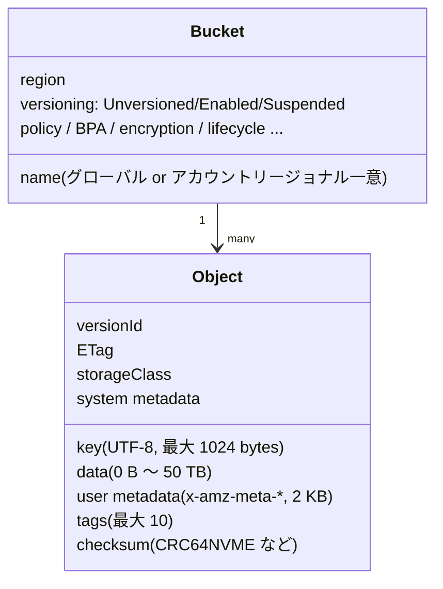
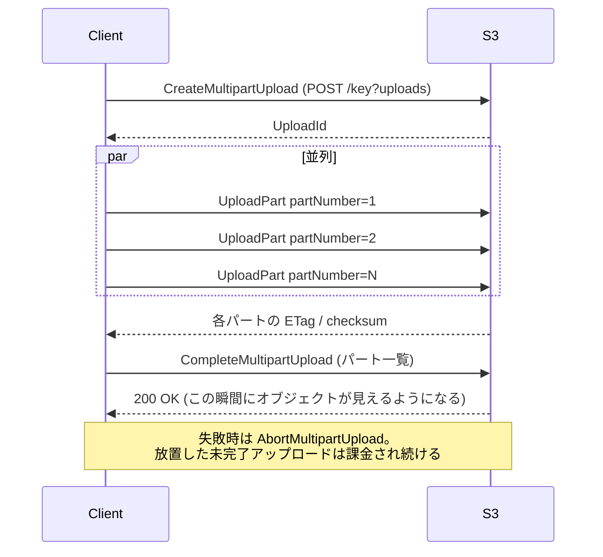
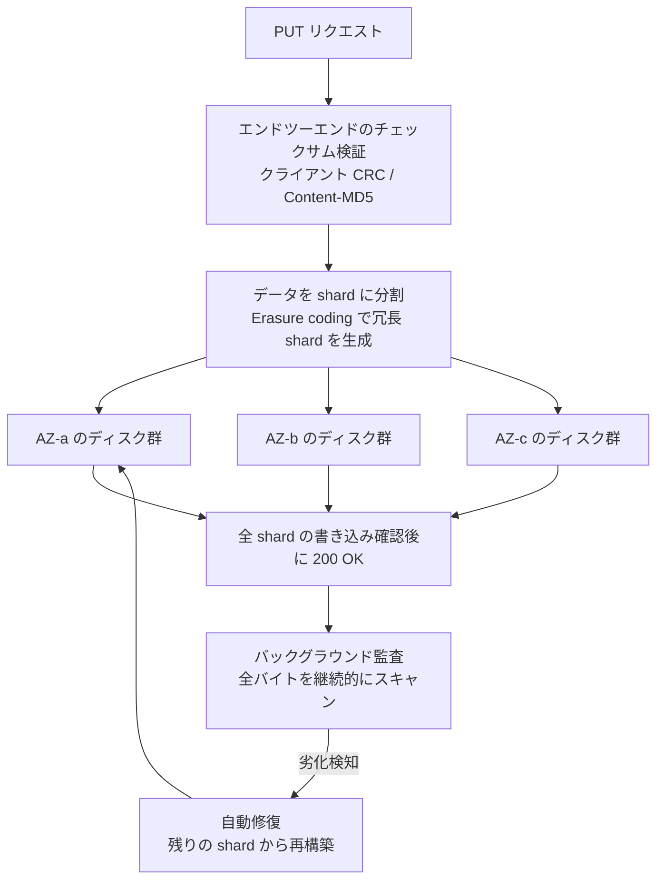
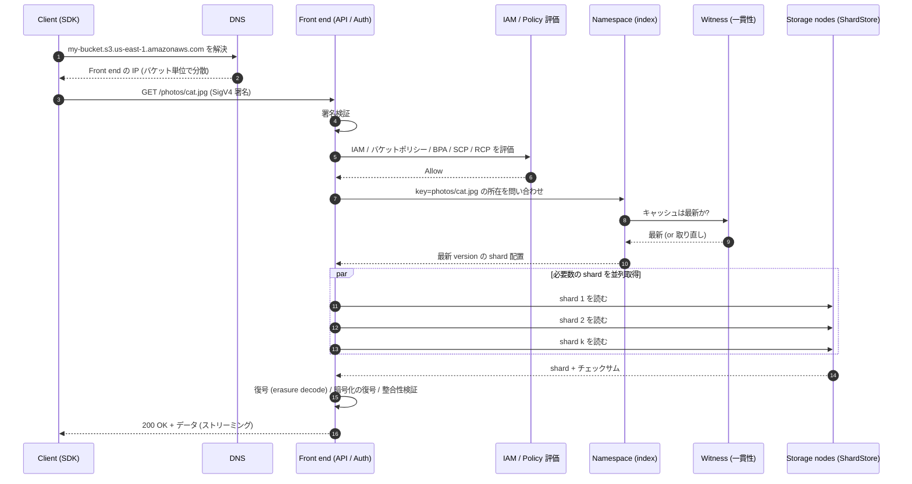

# Amazon S3 とは何か — 全体像・データモデル・内部アーキテクチャ

_最終確認: 2026-10-03_

この章は s3-atlas の入口。S3 (Amazon Simple Storage Service) が「何で」「どういう形をしていて」「どう動いていて」「どこまでスケールするのか」を一通り押さえる。個別機能 (ストレージクラス、セキュリティ、料金など) は後続の章で深掘りする。

数字は原則として AWS 公式ドキュメント / AWS News Blog / What's New / 公開論文で確認したもの。二次情報 (インタビュー記事など) に頼る数字は「二次情報」、一次情報で確認できなかったものは「未確認」と明記する。

## 目次

- 第1節: S3 を一言で言うと
- 第2節: 歴史: 2006 年から 2026 年まで
- 第3節: データモデル: bucket / object / key / prefix / metadata / version ID / ETag
- 第4節: バケットの種類: general purpose / directory / table / vector
- 第5節: 命名規則
- 第6節: リージョンとエンドポイント
- 第7節: REST API の形
- 第8節: 一貫性モデル
- 第9節: 耐久性 11 nines はどう作られているか
- 第10節: 制限とクォータ
- 第11節: 公開されているスケール統計
- 第12節: 内部アーキテクチャ (公開情報ベース)
- 第13節: リクエストの通り道 (図解)
- 第14節: よくある誤解
- 参考文献

## 1. S3 を一言で言うと

S3 は **HTTP(S) の REST API でアクセスする、リージョン単位のフルマネージド・オブジェクトストレージ** である。

- 「ファイルシステム」ではない。ディレクトリツリーも inode もロックも (基本的には) ない
- 「ブロックストレージ」でもない。オブジェクトは基本的に **丸ごと置く / 丸ごと (または Range で部分的に) 読む / 丸ごと消す** 単位
- 容量を事前に確保しない。使った分 (GB-月) とリクエスト数と転送量で課金される
- 設計上の耐久性は 99.999999999% (11 nines)。S3 Standard の可用性設計値は 99.99%

```text
          ┌──────────────── AWS Region (例: us-east-1) ────────────────┐
          │                                                             │
 Client ──┼──HTTPS──▶  bucket "my-app-logs"                             │
 (SDK /   │              ├── object  key="2026/10/03/app.log"  (bytes + metadata)
  CLI /   │              ├── object  key="2026/10/03/app.log.1"
  curl)   │              └── object  key="index.html"
          │                                                             │
          │   データは複数 AZ (>=3) に分散して保存される (One Zone 系除く)  │
          └─────────────────────────────────────────────────────────────┘
```

S3 の位置付けを他の AWS ストレージと比べると次のとおり。

| 観点 | S3 (オブジェクト) | EBS (ブロック) | EFS / FSx (ファイル) |
| --- | --- | --- | --- |
| アクセス方法 | HTTP REST API / SDK | OS のブロックデバイス | NFS / SMB / POSIX |
| 単位 | オブジェクト (最大 50 TB) | ブロック (ボリューム) | ファイル / ディレクトリ |
| 部分更新 | 不可 (上書き。Express One Zone のみ append 可) | 可 | 可 |
| スコープ | リージョン (AZ 冗長) | 単一 AZ | リージョン or AZ |
| 容量確保 | 不要 (無制限) | 事前にサイズ指定 | 自動拡張 (EFS) |
| 同時アクセス | 事実上無制限のクライアント | 基本 1 インスタンス (Multi-Attach 例外) | 多数クライアント |

なお 2026-04 に **S3 Files** (S3 バケットを POSIX ファイルシステムとしてマウントできる EFS ベースのサービス) が GA になり、「S3 はファイルシステムではない」という境界は少しずつ曖昧になりつつある。ただし S3 そのもののセマンティクス (オブジェクト API) は変わっていない。

## 2. 歴史: 2006 年から 2026 年まで

S3 は **2006-03-14** (Pi Day) に米国で一般提供された、AWS で最初期の一般提供サービスの一つ。2026-03 には 20 周年を迎え、AWS News Blog に記念記事が出ている。

### 2.1 ローンチ時 (2006) の姿

20 周年記事 (2026-03-13 公開) によると、ローンチ時の S3 は次の規模だった。

| 項目 | 2006 年ローンチ時 | 2026 年 |
| --- | --- | --- |
| 総容量 | 約 1 PB | 数百 EB (hundreds of exabytes) |
| ストレージノード | 約 400 ノード / 15 ラック / 3 データセンター | 公表値なし (数千万台規模の HDD とされる) |
| 総帯域 | 15 Gbps | ピーク約 1 PB/s とされる (後述、出典注意) |
| 最大オブジェクトサイズ | 5 GB | 50 TB (10,000 倍) |
| ストレージ単価 | 15 セント / GB-月 | 2 セント強 / GB-月 (約 85% 減) |
| 規模 | — | 500 兆超オブジェクト、2 億 req/s 超、39 リージョン 123 AZ |

### 2.2 主要マイルストーン

詳細な年表 (日付・URL つき) は `data/timeline.json` にある。ここでは「S3 の性格を変えた」転換点だけ抜き出す。

| 年 | 出来事 | 意味 |
| --- | --- | --- |
| 2006 | S3 ローンチ | シンプルな PUT/GET/DELETE/LIST のオブジェクトストア |
| 2010 | Versioning、Reduced Redundancy Storage、Multipart Upload | データ保護と大容量アップロードの基盤 |
| 2011 | 静的 Web サイトホスティング、SSE (サーバー側暗号化) | Web 配信と暗号化 |
| 2012 | Amazon Glacier、ライフサイクルによる Glacier アーカイブ | ホット/コールドの階層化が始まる |
| 2014 | イベント通知 | S3 がイベント駆動アーキテクチャの起点に |
| 2015 | Standard-IA、クロスリージョンレプリケーション、VPC エンドポイント | ストレージクラスの多様化 |
| 2017 | us-east-1 大規模障害 (2017-02-28) | 運用ツールの安全装置強化のきっかけ |
| 2018 | Block Public Access、Intelligent-Tiering、Object Lock、One Zone-IA | 「バケット公開事故」対策と自動階層化 |
| 2019 | Glacier Deep Archive、Batch Operations、Access Points | テープ代替価格帯、大規模一括操作 |
| 2020 | **強い一貫性 (strong read-after-write)**、Storage Lens、Bucket Keys | 「結果整合性の S3」が終わった年 |
| 2021 | Object Lambda、Multi-Region Access Points、Glacier Instant Retrieval、ACL 無効化 | アクセス制御の簡素化 |
| 2023 | 全新規オブジェクトの既定暗号化 (SSE-S3)、新規バケット既定で BPA + ACL 無効、**Express One Zone**、Mountpoint | セキュア・バイ・デフォルト、低レイテンシ層 |
| 2024 | 無許可 403 リクエストの非課金化、**条件付き書き込み**、バケット上限 10,000、**S3 Tables**、S3 Metadata (preview) | S3 が「分析・データ基盤」へ |
| 2025 | S3 Metadata GA、Express One Zone 大幅値下げ、**S3 Vectors** (preview → GA)、**最大オブジェクト 50 TB** | AI 時代のストレージへ |
| 2026 | アカウントリージョナル名前空間、**S3 Files**、SSE-C 既定無効化、Annotations、IA 遷移の 30 日要件撤廃、Iceberg V3 | バケット名衝突問題の解消、ファイル/AI 連携 |

### 2.3 2017-02-28 us-east-1 障害の要点

S3 の歴史で最も有名な障害。AWS の公式事後報告 (Summary of the Amazon S3 Service Disruption in the Northern Virginia (US-EAST-1) Region) の要点は次のとおり。

- S3 課金システムのデバッグ作業中、運用者が想定より多くのサーバーを削除するコマンドを入力した
- 削除されたサーバー群に、**index サブシステム** (リージョン内の全オブジェクトのメタデータと位置を管理) と **placement サブシステム** (新規オブジェクトの格納先を決める) を支えるものが含まれていた
- 両サブシステムの完全再起動が必要になり、長年フル再起動していなかったため想定より時間がかかった
- 対策: ツールがキャパシティを最小値以下に減らせないようにする安全装置、サブシステムを小さな「セル」に分割して復旧時間を短縮する取り組み

この「index (メタデータ) と placement / storage (データ) の分離」は、後述の内部アーキテクチャ理解に直結する。

## 3. データモデル

### 3.1 基本要素



| 要素 | 説明 | 主な制約 |
| --- | --- | --- |
| Bucket | オブジェクトのコンテナ。リージョンに属する | 名前 3〜63 文字。作成後に名前・リージョン変更不可 |
| Object | データ本体 + メタデータ | 0 B〜約 50 TB (48.8 TiB) |
| Key | バケット内でオブジェクトを一意に識別する文字列 | UTF-8 で最大 1,024 bytes |
| Prefix | key の先頭部分。LIST の絞り込み・性能分割の単位 | 論理的な概念 (実体はない) |
| Metadata | system-defined (Content-Type 等) と user-defined (`x-amz-meta-*`) | user-defined は 2 KB まで (PUT ヘッダ全体は 8 KB) |
| Tags | key-value。IAM 条件・ライフサイクル・コスト配分に使える | 1 オブジェクト 10 個まで |
| Version ID | バージョニング有効時にオブジェクトの各版を識別 | 無効時は `null` |
| ETag | オブジェクト内容のハッシュ的な識別子 | MD5 とは限らない (後述) |
| Annotations | 2026-06 追加。オブジェクトに後付けする JSON/XML/YAML の文脈データ | ドキュメント上 1 annotation 最大 1 MB、発表では 1 オブジェクト最大 1 GB |

オブジェクトの「住所」は **bucket + key (+ versionId)** の組で一意に決まる。

```text
s3://my-bucket/photos/2026/10/cat.jpg
     ^^^^^^^^^ ^^^^^^^^^^^^^^^^^^^^^^^
      bucket            key
```

### 3.2 フラットな名前空間と「フォルダ」の正体

S3 の名前空間は **フラット**。`photos/2026/10/cat.jpg` は「photos フォルダの中の 2026 フォルダの…」ではなく、`photos/2026/10/cat.jpg` という **1 つの文字列 key** でしかない。

コンソールがフォルダのように見せているのは、`ListObjectsV2` に `delimiter=/` を渡すと、区切り文字までの共通部分を `CommonPrefixes` としてまとめて返してくれるから。

```text
バケット内の実際の key 一覧 (フラット):
  photos/2026/10/cat.jpg
  photos/2026/10/dog.jpg
  photos/2026/11/bird.jpg
  readme.txt

ListObjectsV2(prefix="photos/", delimiter="/") の結果:
  Contents:       (なし)
  CommonPrefixes: ["photos/2026/"]

ListObjectsV2(prefix="photos/2026/", delimiter="/") の結果:
  CommonPrefixes: ["photos/2026/10/", "photos/2026/11/"]
```

フラットであることから来る帰結:

- **「フォルダのリネーム」は存在しない**。prefix 配下の全オブジェクトを CopyObject + DeleteObject する必要がある (N 個のオブジェクトなら N 回のコピー)
- コンソールで「フォルダを作成」すると、末尾が `/` の 0 バイトオブジェクト (`photos/`) が作られるだけ
- 空の「フォルダ」は概念上存在しない (0 バイトのマーカーオブジェクトを除く)
- ただし **directory bucket (Express One Zone)** は例外で、本当に階層的なディレクトリ構造で key を管理する。LIST の順序保証なども異なる

### 3.3 Prefix は性能の単位でもある

general purpose バケットでは、**パーティション化された prefix あたり少なくとも 3,500 PUT/COPY/POST/DELETE req/s、5,500 GET/HEAD req/s** を処理できる。prefix 数に上限はないので、prefix を分散させれば水平にスケールする (例: 10 prefix に分ければ読み取り 55,000 req/s)。

負荷が急増すると S3 は自動で prefix を再パーティションするが、その最中は一時的に `503 Slow Down` が返る。クライアントは指数バックオフ付きリトライで吸収する前提。

### 3.4 メタデータの種類

| 種類 | 例 | 変更可否 |
| --- | --- | --- |
| system-defined (システム制御) | `Date`, `Last-Modified`, `Content-Length`, `x-amz-version-id` | 不可 |
| system-defined (ユーザー制御) | `Content-Type`, `Cache-Control`, `x-amz-storage-class`, `x-amz-server-side-encryption`, `x-amz-website-redirect-location` | アップロード時に指定。後から変えるにはコピー |
| user-defined | `x-amz-meta-author: alice` | アップロード時のみ。変更はコピーで新オブジェクト扱い |
| object tags | `project=atlas` | 後から PutObjectTagging で変更可 |
| annotations (2026-) | 要約・分類・AI 生成の説明 | 後から作成・更新・削除可 |

ユーザー定義メタデータは **オブジェクト作成後に変更できない** (コピーして作り直す)。頻繁に変わる属性はタグか annotations、もしくは外部 DB / S3 Metadata テーブルで持つのが定石。

### 3.5 Version ID とバージョニング

バケットのバージョニング状態は 3 つ。

| 状態 | 挙動 |
| --- | --- |
| Unversioned (既定) | 同じ key への PUT は上書き。DELETE で即消える。version ID は `null` |
| Enabled | PUT のたびに新しい version ID が付与され、旧版は noncurrent version として残る。DELETE は **delete marker** を積むだけ |
| Suspended | 新規 PUT は version ID `null` で作られ、既存の `null` 版を上書き。過去の版は残る |

一度 Enabled にしたバケットは Unversioned に戻せない (Suspended にはできる)。

```text
Versioning=Enabled のバケットで key="a.txt" を操作した例

PUT a.txt (v1)          → [v1]
PUT a.txt (v2)          → [v2 (current), v1]
DELETE a.txt            → [DeleteMarker (current), v2, v1]   ← GET a.txt は 404
DELETE a.txt?versionId=<DeleteMarker> → [v2 (current), v1]   ← 復活
DELETE a.txt?versionId=v1             → [v2]                 ← 物理削除
```

noncurrent version も課金対象。ライフサイクルの `NoncurrentVersionExpiration` を設定しないと、ストレージが静かに膨らむ (料金の章で扱う)。

### 3.6 ETag の本当の意味

ETag は「オブジェクトの MD5」と説明されがちだが、正確には条件つき。

| オブジェクトの作り方 | ETag |
| --- | --- |
| PutObject / POST / Copy で作成、暗号化なし or SSE-S3 | オブジェクトデータの MD5 ダイジェスト |
| SSE-C または SSE-KMS で暗号化 | MD5 ではない |
| Multipart Upload や Part Copy で作成 | 暗号化方式に関係なく MD5 ではない (各パートの MD5 を連結してハッシュしたもの + `-パート数` という形が知られているが、仕様としては保証されない) |

整合性チェックには ETag ではなく **追加チェックサム** (CRC64NVME, CRC32, CRC32C, SHA-1, SHA-256、さらに 2026-04 に MD5, XXHash3/64/128, SHA-512 が追加され計 10 種) を使うのが現在の推奨。2024-12 以降、最新 SDK はアップロード時に既定で CRC 系チェックサムを計算・送信し、S3 が検証して保存する。

ETag は **条件付きリクエスト** (`If-Match` / `If-None-Match`) の比較対象として重要。2024 年に書き込み側でも使えるようになった (第 7 節)。

## 4. バケットの種類

2026 年時点で、S3 には **4 種類のバケット** がある。名前は同じ「バケット」でも、API・名前空間・内部構造がかなり違う。

| 種類 | 登場 | 用途 | 名前の例 / 識別 | API 名前空間 | 冗長性 |
| --- | --- | --- | --- | --- | --- |
| General purpose bucket | 2006 | 汎用。ほぼすべてのユースケース | `my-bucket` / `my-bucket-111122223333-us-east-1-an` | `s3` | 複数 AZ (One Zone-IA は 1 AZ) |
| Directory bucket | 2023-11 | S3 Express One Zone (低レイテンシ)、Local Zones でのデータレジデンシー | `name--use1-az4--x-s3` | `s3` (Zonal / Regional エンドポイント) | 単一 AZ (または Local Zone) |
| Table bucket | 2024-12 | Apache Iceberg テーブル (S3 Tables) | ARN で識別。`--table-s3` は予約サフィックス | `s3tables` | 複数 AZ |
| Vector bucket | 2025-07 (preview) / 2025-12 (GA) | ベクトル埋め込みの保存と類似検索 (S3 Vectors) | ARN で識別 | `s3vectors` | S3 と同等の耐久性・可用性をうたう |

### 4.1 General purpose bucket

- 従来からある普通の S3 バケット
- 名前は **パーティション内でグローバル一意** (aws / aws-cn / aws-us-gov / aws-eusc の 4 パーティション)
- 2026-03 からは **アカウントリージョナル名前空間** で作ることもでき、その場合は `<prefix>-<12桁アカウントID>-<リージョン>-an` 形式で、他アカウントに取られる心配がない
- 既定上限は **アカウントあたり 10,000 バケット** (2024-11 に 100 から引き上げ)。Service Quotas で最大 100 万まで申請可能
- 10,000 を超える上限が承認されたアカウントでは、ページングなしの `ListBuckets` は拒否される

### 4.2 Directory bucket

- S3 Express One Zone ストレージクラス専用 (Local Zones では One Zone-IA も可)
- 単一 AZ にデータを置き、一桁ミリ秒の一貫したレイテンシを狙う
- 認証は `CreateSession` で得るセッションベース (リクエストごとの IAM 評価コストを省くため)
- key が本当の階層ディレクトリとして管理される。LIST の結果は辞書順が保証されない
- ディレクトリバケットあたり最大 200 万 GET TPS / 20 万 PUT TPS (AWS News Blog の記述)
- 既定上限はアカウントあたり 100 (調整可能)
- append (既存オブジェクト末尾への追記) をサポート (general purpose では不可)

### 4.3 Table bucket (S3 Tables)

- Apache Iceberg 形式の表形式データを格納する専用バケット
- コンパクション、スナップショット管理、未参照ファイル削除を自動で行う
- テーブル単位でアクセス制御
- 2025-12 に Intelligent-Tiering とレプリケーション、2026-09 に Iceberg V3 対応、2026-10 にリージョンあたりのテーブルバケット上限が 10 から 100 に引き上げ

### 4.4 Vector bucket (S3 Vectors)

- ベクトル埋め込みを保存し、類似検索 (k-NN) クエリを投げられる専用バケット
- GA 時点の公表値: インデックスあたり最大 20 億ベクトル、バケットあたり 10,000 インデックス、低頻度クエリでサブ秒・高頻度クエリで約 100 ms
- Bedrock Knowledge Bases、OpenSearch Service と連携
- 2026 年にメタデータの事前フィルタ (pre-filtering) に対応

## 5. 命名規則

### 5.1 General purpose bucket の名前

- 3〜63 文字
- 小文字英字・数字・ピリオド `.`・ハイフン `-` のみ
- 英字か数字で始まり、英字か数字で終わる
- 連続するピリオド禁止、IP アドレス形式 (`192.168.5.4`) 禁止
- 予約プレフィックス: `xn--`, `sthree-`, `amzn-s3-demo-`
- 予約サフィックス: `-s3alias` (アクセスポイントエイリアス), `--ol-s3` (Object Lambda), `.mrap` (Multi-Region Access Point), `--x-s3` (directory bucket), `--table-s3` (table bucket)
- `-an` で終わる名前はアカウントリージョナル名前空間でのみ使用可
- Transfer Acceleration を使うバケットはピリオド不可
- ピリオド入りの名前は virtual-hosted style + HTTPS で証明書が合わないため非推奨 (静的サイト用途を除く)
- 2018-03-01 以前の us-east-1 では 255 文字・大文字・アンダースコアも許されていた (レガシー)

**バケット名の「乗っ取り」問題**: 共有グローバル名前空間のバケットを削除すると、その名前を別アカウントが再作成できる。古いバケット名を参照し続けているアプリ・ドキュメント・CloudFormation があると、第三者のバケットにデータを送ってしまう / 第三者のデータを読んでしまうリスクがある。AWS は「削除せず空にして残す」か「アカウントリージョナル名前空間を使う」ことを推奨している。

### 5.2 Directory bucket の名前

```text
base-name--zoneid--x-s3
例: my-cache--use1-az4--x-s3
```

- 選んだ Zone (AZ または Local Zone) 内で一意
- サフィックス込みで 3〜63 文字

### 5.3 Object key の名前

- UTF-8 で最大 1,024 bytes (文字数ではなくバイト数。日本語は 1 文字 3 bytes なので約 341 文字)
- 任意の UTF-8 が使えるが、安全な文字は英数字と `! - _ . * ' ( )` と `/`
- `&`, `$`, `@`, `=`, `;`, `:`, `+`, スペース, `,`, `?` などは URL エンコードが必要で、ツールによって扱いが崩れやすい
- `\`, `{`, `}`, `^`, `%`, `` ` ``, `]`, `"`, `>`, `[`, `~`, `<`, `#`, `|` や制御文字は避けるべき
- `./` や `../` を含む key は、コンソールやツールでパス解決されてしまい事故の元

## 6. リージョンとエンドポイント

### 6.1 リージョン

バケットは作成時にリージョンを決め、以後変更できない。データは明示的にレプリケーションしない限りそのリージョンから出ない。2026-03 時点で S3 は 39 リージョン 123 AZ で稼働 (20 周年記事)。

### 6.2 URL の 2 方式

| 方式 | 形式 | 状態 |
| --- | --- | --- |
| Virtual-hosted style | `https://BUCKET.s3.REGION.amazonaws.com/KEY` | 推奨 |
| Path style | `https://s3.REGION.amazonaws.com/BUCKET/KEY` | 非推奨。2019-05 に「2020-09-30 以降作成のバケットで廃止」と発表されたが延期され、現在も利用可能 |
| レガシーグローバル | `https://BUCKET.s3.amazonaws.com/KEY` | us-east-1 にルーティング。2019-03-20 以降に開設されたリージョンのバケットへはリダイレクトされない |

```text
virtual-hosted:  https://my-bucket.s3.ap-northeast-1.amazonaws.com/photos/cat.jpg
                         ^^^^^^^^^    ^^^^^^^^^^^^^^               ^^^^^^^^^^^^^^
                          bucket          region                        key

path-style:      https://s3.ap-northeast-1.amazonaws.com/my-bucket/photos/cat.jpg
```

virtual-hosted が推奨される理由は、バケット名が DNS ホスト名に入るので、S3 がバケット単位で DNS レベルの振り分けを行えるため (path-style はリージョン共通のホスト名にすべてのリクエストが集中する)。

### 6.3 その他のエンドポイント

| エンドポイント | 形式例 | 用途 |
| --- | --- | --- |
| Dualstack (IPv4 + IPv6) | `BUCKET.s3.dualstack.REGION.amazonaws.com` | IPv6 クライアント |
| FIPS | `BUCKET.s3-fips.REGION.amazonaws.com` (dualstack 版は `s3-fips.dualstack`) | FIPS 140 検証済み暗号モジュールが必要な米国政府系ワークロード |
| Transfer Acceleration | `BUCKET.s3-accelerate.amazonaws.com` (`s3-accelerate.dualstack` もあり) | CloudFront エッジ経由の長距離高速転送 |
| 静的 Web サイト | `BUCKET.s3-website-REGION.amazonaws.com` または `BUCKET.s3-website.REGION.amazonaws.com` (リージョンにより異なる) | HTTP のみ、index/error ドキュメント、リダイレクト |
| Access Point | `ACCESSPOINT-ACCOUNTID.s3-accesspoint.REGION.amazonaws.com` | アプリ別のアクセス制御 |
| Multi-Region Access Point | `ALIAS.accesspoint.s3-global.amazonaws.com` | 複数リージョンへの近接ルーティング |
| Directory bucket (Zonal) | `BUCKET.s3express-use1-az4.us-east-1.amazonaws.com` | Express One Zone のデータプレーン |
| Directory bucket (Regional) | `s3express-control.us-east-1.amazonaws.com` | CreateBucket など制御プレーン |
| Gateway VPC endpoint | (DNS は通常の S3 名のまま、ルートテーブルで誘導) | VPC 内から無料で S3 に到達 |
| Interface VPC endpoint (PrivateLink) | `bucket.vpce-xxxx.s3.REGION.vpce.amazonaws.com` | オンプレミスや他 VPC からプライベート IP で到達 (有料) |

## 7. REST API の形

### 7.1 HTTP 動詞と操作

S3 の API は HTTP の動詞にほぼ素直にマッピングされている。

| HTTP | 対象 | 主な操作 |
| --- | --- | --- |
| `PUT` | `/key` | PutObject (単一 PUT は最大 5 GB)、CopyObject (`x-amz-copy-source`)、UploadPart |
| `GET` | `/key` | GetObject (Range ヘッダで部分取得可) |
| `HEAD` | `/key` | HeadObject (メタデータのみ) |
| `DELETE` | `/key` | DeleteObject |
| `POST` | `/?delete` | DeleteObjects (最大 1,000 key を一括削除) |
| `POST` | `/key?uploads` | CreateMultipartUpload |
| `POST` | `/key?uploadId=...` | CompleteMultipartUpload |
| `POST` | `/key?restore` | RestoreObject (Glacier 系から一時復元) |
| `POST` | `/` (フォーム) | ブラウザからの POST Object (署名付きポリシー) |
| `GET` | `/?list-type=2` | ListObjectsV2 |
| `GET` | `/?versions` | ListObjectVersions |
| `PUT` / `GET` / `DELETE` | `/?policy`, `/?lifecycle`, `/?versioning` ... | バケットのサブリソース設定 |

例: 素の HTTP で見た PutObject。

```http
PUT /photos/cat.jpg HTTP/1.1
Host: my-bucket.s3.ap-northeast-1.amazonaws.com
Content-Type: image/jpeg
Content-Length: 48213
x-amz-meta-author: alice
x-amz-storage-class: STANDARD_IA
x-amz-checksum-crc64nvme: <base64>
x-amz-content-sha256: <hex or UNSIGNED-PAYLOAD>
x-amz-date: 20261003T010203Z
Authorization: AWS4-HMAC-SHA256 Credential=AKIA.../20261003/ap-northeast-1/s3/aws4_request, SignedHeaders=..., Signature=...

<48213 bytes of JPEG>
```

```http
HTTP/1.1 200 OK
ETag: "9b2cf535f27731c974343645a3985328"
x-amz-version-id: 3HL4kqtJlcpXroDTDmJ.rmSpXd3dIbrHY
x-amz-server-side-encryption: AES256
x-amz-checksum-crc64nvme: <base64>
```

認証は **SigV4** (AWS Signature Version 4)。SigV2 は新規バケットでは使えない (段階的に廃止済み)。

### 7.2 ListObjectsV2

`ListObjectsV2` は 1 リクエストで最大 1,000 key を返し、続きは `ContinuationToken` でページングする。

```bash
aws s3api list-objects-v2 \
  --bucket my-bucket \
  --prefix "logs/2026/10/" \
  --delimiter "/" \
  --max-keys 1000
```

| パラメータ | 意味 |
| --- | --- |
| `prefix` | この文字列で始まる key だけ |
| `delimiter` | 区切り文字。これより後ろは `CommonPrefixes` にまとめる |
| `max-keys` | 1 ページの最大件数 (上限 1,000) |
| `continuation-token` | 前ページの `NextContinuationToken` |
| `start-after` | この key より後ろから列挙 |
| `fetch-owner` | Owner 情報を含めるか |

性質:

- general purpose バケットでは **key の UTF-8 バイナリ順 (辞書順)** で返る
- directory bucket では順序は保証されない
- V1 (`ListObjects`) は `Marker` 方式。新規実装は V2 を使う
- 数十億オブジェクトを LIST で全走査するのは遅く高い (1,000 件ごとに 1 リクエスト = Standard で $0.005/1,000 req)。全件把握には **S3 Inventory** や **S3 Metadata の live inventory テーブル** を使う

### 7.3 Multipart Upload

大きいオブジェクトはパートに分けて並列アップロードする。



- パート番号 1〜10,000
- パートサイズ 5 MiB〜5 GiB (最後のパートは下限なし)
- 100 MB を超えたら multipart を検討するのが目安
- 未完了の multipart upload のパートはストレージ料金がかかり続ける。ライフサイクルの `AbortIncompleteMultipartUpload` で自動掃除するのが定石

### 7.4 条件付きリクエスト

| ヘッダ | 読み取り (GET/HEAD) | 書き込み (PUT / CompleteMultipartUpload) |
| --- | --- | --- |
| `If-Match: <ETag>` | ETag が一致すれば返す | 2024-11 から対応。一致しなければ `412 Precondition Failed` (楽観ロック) |
| `If-None-Match: *` | — | 2024-08 から対応。同じ key が既に存在すれば `412` (create-if-not-exists) |
| `If-None-Match: <ETag>` | 一致しなければ返す (一致なら 304) | — |
| `If-Modified-Since` / `If-Unmodified-Since` | 日時で条件分岐 | — |

条件付き書き込みにより、S3 単体で「排他的な作成」「Compare-And-Swap 的な更新」ができるようになった。Iceberg / Delta Lake のコミットや分散ロックの実装で外部 DB (DynamoDB 等) が不要になるケースが増えた。2024-11 にはバケットポリシーで条件付き書き込みを **強制** することもできるようになった。

### 7.5 主なエラー

| ステータス | コード例 | 意味 |
| --- | --- | --- |
| 301 / 307 | `PermanentRedirect` / `TemporaryRedirect` | 別リージョンのエンドポイントに投げている |
| 400 | `InvalidRequest`, `EntityTooLarge` | パラメータ不正 / 単一 PUT で 5 GB 超など |
| 403 | `AccessDenied` | 権限なし (アカウント/組織外からの 403 は 2024 年以降非課金) |
| 404 | `NoSuchKey`, `NoSuchBucket` | 存在しない |
| 409 | `BucketAlreadyExists`, `OperationAborted` | 名前衝突 / 競合中 |
| 412 | `PreconditionFailed` | 条件付きリクエストの条件不一致 |
| 416 | `InvalidRange` | Range 不正 |
| 503 | `SlowDown` | リクエストレート超過。バックオフしてリトライ |

## 8. 一貫性モデル

### 8.1 2020-12 以前と以後

| 時期 | 新規 PUT 後の GET | 上書き/削除後の GET | LIST |
| --- | --- | --- | --- |
| 〜2020-11 | read-after-write (ただし事前に 404 を GET していると結果整合) | 結果整合 (古いデータが返り得る) | 結果整合 |
| 2020-12-01〜 | **強い一貫性** | **強い一貫性** | **強い一貫性** |

2020-12 の re:Invent で、S3 は **全リージョン・全オブジェクト (既存含む) で追加料金・性能劣化なしに strong read-after-write consistency** を提供開始した。

- 書き込み (新規 PUT・上書き PUT・DELETE) が成功応答を返した後の GET / HEAD / LIST は、必ずその書き込みを反映する
- タグ・ACL・メタデータの変更も強い一貫性
- これにより EMRFS Consistent View や S3Guard のような「S3 の結果整合性を補う外部メタデータストア」が不要になった

### 8.2 それでも強い一貫性ではないもの

- **バケット設定** (バケットポリシー、ライフサイクル、バージョニング設定など) は結果整合。設定変更が全体に反映されるまで時間がかかることがある (ライフサイクルは最大 15 分程度と記載がある箇所もある)
- バケットの作成・削除直後の挙動
- **同一 key への並行書き込み** は last-writer-wins。どちらが勝つかはクライアント側からは予測できない。順序制御が必要なら条件付き書き込み (`If-Match`) を使う
- **クロスリージョンレプリケーション** は非同期 (RTC を使えば 99.99% を 15 分以内に複製する SLA つき)
- オブジェクトロック (排他) の機構はない

### 8.3 どうやって実現したか (公開情報)

Werner Vogels の記事 "Diving Deep on S3 Consistency" (2021) によると、S3 のメタデータサブシステムにキャッシュ層があり、これが結果整合性の原因だった。強い一貫性化にあたっては、メタデータの更新順序を追跡する新しい **witness (証人) コンポーネント** を導入し、読み取り時にキャッシュが古いかどうかを判定できるようにした。正しさの検証には自動推論 (形式手法) を活用したと説明されている。

```text
           書き込み                         読み取り
Client ──PUT──▶ Front end ──▶ Metadata     Client ──GET──▶ Front end
                     │         (index)                           │
                     │           ▲                               ▼
                     └──通知──▶ Witness ◀──── "このキャッシュは最新?" ─ Cache
                                (順序を追跡)     古ければ index から取り直す
```

## 9. 耐久性 11 nines はどう作られているか

### 9.1 11 nines の意味

99.999999999% (11 nines) の年間耐久性とは、AWS の説明では「1,000 万オブジェクトを保存すると、平均して 1 万年に 1 個失う程度」という設計目標。**SLA ではなく設計値** であり、SLA が保証するのは可用性 (月間稼働率) の方。

| 指標 | 意味 | S3 Standard |
| --- | --- | --- |
| 耐久性 (durability) | データが失われない確率 | 99.999999999% (設計値) |
| 可用性 (availability) | リクエストに応答できる確率 | 99.99% (設計値) / 99.9% (SLA) |

注意: 耐久性は **AWS 側のハードウェア故障などからの保護** であって、利用者自身の誤削除・上書き・ランサムウェアからは守ってくれない。それはバージョニング、Object Lock、レプリケーション、AWS Backup の役割。

### 9.2 耐久性を支える仕組み (公開情報ベース)



| 仕組み | 内容 | 出典 |
| --- | --- | --- |
| 複数 AZ への分散 | Standard 等は 3 つ以上の AZ に冗長保存。AZ 1 つの喪失に耐える | ストレージクラス比較表 |
| Erasure coding | Reed-Solomon 系の符号化で、複製より少ない容量オーバーヘッドで冗長性を確保。複製と併用 | Warfield (FAST '23 基調講演の記事) |
| 書き込み確認後に成功応答 | 冗長に保存し終わってから 200 を返す | S3 FAQ |
| チェックサム | 転送中・保存時のデータをチェックサムで検証。2024-12 から SDK が既定で CRC を送る | What's New 2024-12 |
| 継続的監査と自動修復 | 全バイトを継続的に検査するマイクロサービス群、劣化を見つけると自動修復 | 20 周年記事 |
| 形式手法 | ShardStore (ストレージノードの KV ストア) を lightweight formal methods で検証 | SOSP 2021 論文 |
| Rust | 性能クリティカルなコードを 8 年かけて段階的に Rust で書き直し | 20 周年記事 |
| Durability review | 変更ごとに「データを失う可能性」を脅威モデリング的にレビューする文化 | Warfield 記事 |

### 9.3 ShardStore と lightweight formal methods

S3 のストレージノード上で shard (データ片) を管理するキーバリューストアは **ShardStore** と呼ばれ、Rust で書かれている。SOSP 2021 の論文 "Using Lightweight Formal Methods to Validate a Key-Value Storage Node in Amazon S3" (Bornholt ほか) で手法が公開された。

- 本体と同じ Rust で書いた **実行可能な参照モデル (executable specification)** を用意
- 本番コードと参照モデルに同じ操作列を与え、結果が一致するかを **プロパティベーステスト** で大量に検証
- クラッシュ一貫性 (電源断・クラッシュ後の回復の正しさ) や並行性のバグも、モデルチェック的手法で探索
- 「完全な形式証明」ではなく、エンジニアが日常的に回せる軽量な形で形式手法を取り入れたのがポイント

この論文と Warfield の講演は、「11 nines」がハードウェア冗長性だけでなく **ソフトウェアの正しさ** に強く依存していることを示している。

## 10. 制限とクォータ

2026-10 時点の主な値。数値は AWS General Reference の S3 クォータ表と User Guide による。

### 10.1 オブジェクト

| 項目 | 値 | 備考 |
| --- | --- | --- |
| 最大オブジェクトサイズ | **50 TB** (クォータ表では 48.828125 TB、User Guide では 48.8 TiB) | 2025-12 に 5 TB から 10 倍に拡大。全リージョン・全ストレージクラス |
| 単一 PUT の最大サイズ | 5 GB | これを超えるなら Multipart Upload 必須 |
| コンソールからのアップロード上限 | 160 GB | |
| Multipart のパート数 | 最大 10,000 | パート番号 1〜10,000 |
| パートサイズ | 5 MiB〜5 GiB | 最後のパートは下限なし。5 GiB × 10,000 ≒ 48.8 TiB が最大サイズの根拠 |
| ListParts / ListMultipartUploads の 1 応答 | 最大 1,000 | |
| Key の長さ | 1,024 bytes (UTF-8) | |
| ユーザー定義メタデータ | 2 KB | PUT リクエストヘッダ全体は 8 KB |
| オブジェクトタグ | 10 個 | |
| Annotations | 1 annotation 最大 1 MB (User Guide) / 1 オブジェクト最大 1 GB (発表) | 2026-06 追加 |
| DeleteObjects 1 回の key 数 | 1,000 | |

### 10.2 バケット・アカウント

| 項目 | 既定値 | 調整可否 |
| --- | --- | --- |
| General purpose バケット数 | 10,000 / アカウント | 可 (最大 100 万) |
| Directory バケット数 | 100 / アカウント | 可 |
| Table バケット数 | 100 / リージョン / アカウント (2026-10 に 10 から引き上げ) | サポートに依頼 |
| バケットあたりのオブジェクト数 | 無制限 | — |
| バケットあたりの容量 | 無制限 | — |
| バケットポリシーのサイズ | 20 KB | 不可 |
| バケットタグ | 50 | 不可 |
| ライフサイクルルール | 1,000 / バケット | 不可 |
| イベント通知設定 | 100 / バケット | 不可 |
| Access Points | 10,000 / リージョン / アカウント | 可 |
| Multi-Region Access Points | 100 / アカウント、1 MRAP あたり 20 リージョン | 不可 |

### 10.3 性能

| 項目 | 値 |
| --- | --- |
| prefix あたり書き込み | 少なくとも 3,500 PUT/COPY/POST/DELETE req/s |
| prefix あたり読み取り | 少なくとも 5,500 GET/HEAD req/s |
| prefix の数 | 無制限 |
| Directory bucket あたり | 最大 200 万 GET TPS / 20 万 PUT TPS |
| Glacier 復元リクエスト | 1,000 TPS / アカウント |
| Glacier 復元スループット | 1〜2 PB/日 / アカウント |

## 11. 公開されているスケール統計

S3 の規模は AWS が節目ごとに公表している。年と出典を必ずセットで扱うこと。

| 時点 | オブジェクト数 | リクエスト | データ量 | 出典 |
| --- | --- | --- | --- | --- |
| 2006 (ローンチ) | — | — | 約 1 PB の総容量 | AWS News Blog 20 周年記事 (2026-03-13) |
| 2022-03 | 200 兆超 | 平均 1 億 req/s 超 | — | AWS News Blog (Pi Day 2022) |
| 2023-07 | 280 兆超 | 平均 1 億 req/s 超 | 数百万台のドライブ | Werner Vogels, All Things Distributed (Warfield 寄稿, 2023-07-27) |
| 2025 | 500 兆超 | 数億 TPS (hundreds of millions) | 数百 EB | Pragmatic Engineer の Mai-Lan Tomsen Bukovec インタビュー (二次情報) |
| 2026-03 | **500 兆超** | **2 億 req/s 超** | **数百 EB** | AWS News Blog 20 周年記事 |

補足:

- 2023-07 の行は All Things Distributed 記事内の表画像「S3 by the numbers」(2023-07-24 時点) による。表には「280 兆超のオブジェクト、平均 1 億 req/s 超」とあり、AWS News Blog の Pi Day 2023 記事 (2023-03-14) も同じ数字を載せている
- 「数千万台の HDD」は AWS News Blog 20 周年記事 (2026-03) に「S3 の数千万台のハードドライブを積み重ねると国際宇宙ステーションに届いてほぼ戻ってくる」と明記されている
- 「ピーク約 1 PB/s の帯域」は re:Invent での S3 セッションの発言として二次情報 (ブログ・ニュースレター) で広く引用されているが、AWS の文書 (ドキュメント / News Blog / What's New / All Things Distributed) には本調査で見つからなかった。一次情報は講演動画のみと思われ、本書では文字起こしで確認できていない (未確認)
- S3 Vectors は GA までの 5 か月 (2025-07〜12) で 25 万超のインデックス、400 億超のベクトル取り込み、10 億超のクエリ (20 周年記事)

## 12. 内部アーキテクチャ (公開情報ベース)

S3 の内部構造は非公開部分が多いが、Andy Warfield (Amazon の VP / Distinguished Engineer) の FAST '23 基調講演と、それをまとめた All Things Distributed の記事 "Building and operating a pretty big storage system called S3" (2023-07-27)、2017 年の障害報告、SOSP 2021 論文などからおおまかな姿がわかる。

### 12.1 大きな構成要素

```text
┌───────────────────────────────────────────────────────────────────────┐
│                          S3 (1 リージョン)                             │
│                                                                       │
│  ┌──────────────┐   ┌──────────────────────┐   ┌────────────────────┐ │
│  │  Front end   │   │  Namespace / Index   │   │   Storage fleet    │ │
│  │  fleet       │──▶│  (メタデータ: key →  │   │  (数千万台規模の   │ │
│  │  DNS, LB,    │   │   データの位置)       │   │   HDD + ShardStore)│ │
│  │  REST API,   │──────────────────────────────▶│  erasure-coded     │ │
│  │  認証/認可   │   └──────────────────────┘   │  shards            │ │
│  └──────────────┘            ▲                 └────────────────────┘ │
│                              │                          ▲             │
│                   ┌──────────┴──────────────────────────┴──────────┐  │
│                   │  Background services                           │  │
│                   │  (監査・修復, レプリケーション, ライフサイクル/ │  │
│                   │   階層化, placement, 課金・メータリング ...)    │  │
│                   └────────────────────────────────────────────────┘  │
│                                                                       │
│   ※ S3 全体は「数百のマイクロサービス」で構成 (Warfield, 2023)        │
└───────────────────────────────────────────────────────────────────────┘
```

| 層 | 役割 | 補足 |
| --- | --- | --- |
| Front end | HTTP 受付、SigV4 認証、IAM/バケットポリシー評価、リクエストのルーティング | DNS でバケット単位に振り分けるため virtual-hosted が推奨 |
| Namespace (index) | key からデータの所在へのマッピング、バージョン、メタデータ | 2017 年障害報告で言う「index subsystem」。強い一貫性の witness もここに関わる |
| Placement | 新しいデータをどのディスクに置くか決める | 2017 年障害報告の「placement subsystem」 |
| Storage fleet | 実データ (shard) を HDD 上に保存。ノード上の KV ストアが ShardStore | Rust 製。lightweight formal methods で検証 |
| Background | 監査・修復、レプリケーション、ライフサイクル、ストレージクラス移行など | 利用者からは見えない |

組織面でも、これらの構成要素ごとにチームがあり「独立したビジネスのように」運営されている (Warfield)。

### 12.2 ヒート管理: HDD の物理限界とどう付き合うか

Warfield の講演で特に有名なのが **heat management** の話。

- HDD は容量こそ年々増えるが、1 台あたりの IOPS (シーク性能) はほぼ増えない。容量あたりの I/O 性能はむしろ下がっていく
- 個々の顧客のワークロードは非常にバースト的 (ある瞬間に特定データへ集中する)
- しかし **数百万のワークロードを集約すると需要は平滑化** され、予測可能になる
- S3 は 1 つのオブジェクトの shard を非常に多くのディスクにばらまく (データ配置の分散)。これにより、1 顧客のバーストが特定ディスクのホットスポットにならず、フリート全体に薄く広がる
- erasure coding は耐久性だけでなく、「どの shard の組み合わせからでも復元できる」性質によって、混んでいるディスクを避けて読むなど I/O の分散にも使える

つまり S3 の性能特性 (1 リクエストのレイテンシは数十 ms 程度だが、並列化すると事実上無限にスループットが伸びる) は、この「巨大な HDD フリートへの薄く広い分散」から来ている。

### 12.3 ソフトウェアの正しさへの投資

- **ShardStore** の lightweight formal methods (第 9.3 節)
- 強い一貫性導入時の自動推論による検証 (第 8.3 節)
- アクセスポリシーの正しさ検証 (Zelkova 系の自動推論。IAM Access Analyzer や Block Public Access の判定の基盤)
- 性能クリティカルなコードの Rust への段階的書き換え (8 年がかり)
- **durability review**: 変更を入れる前に「この変更でデータを失いうるシナリオ」を洗い出すレビュー

### 12.4 2017 年障害からの教訓 (構造面)

- index / placement のような中核サブシステムを **セル** に分割し、障害時の影響範囲と再起動時間を縮める
- 運用ツールが「最低限必要なキャパシティ」を割り込む操作をできないようにする
- AWS Service Health Dashboard 自体が S3 に依存していたため更新できなかった反省から、ダッシュボードを複数リージョンで動かすよう変更

## 13. リクエストの通り道 (図解)

GetObject を例に、クライアントからディスクまでの流れを公開情報ベースで描くと次のようになる。内部の細部 (コンポーネント名や順序) は推定を含むので、概念図として読むこと。



PUT の場合は逆向きで、

1. Front end が認証・認可
2. 受信データのチェックサムを検証
3. placement がどのディスク群に置くかを決め、erasure coding した shard を複数 AZ のストレージノードへ書き込む
4. 必要な冗長度で永続化されたことを確認
5. namespace (index) にメタデータを記録 (この時点で強い一貫性のもと読み取り可能になる)
6. 200 OK を返す
7. 必要ならイベント通知・レプリケーション・S3 Metadata ジャーナルへの記録などが非同期に走る

## 14. よくある誤解

| 誤解 | 実際 |
| --- | --- |
| S3 にはフォルダがある | 名前空間はフラット。フォルダは prefix と delimiter による見せ方 (directory bucket を除く) |
| S3 は結果整合性 | 2020-12 以降は強い一貫性。ただしバケット設定とレプリケーションは非同期 |
| 最大オブジェクトは 5 TB | 2025-12 以降は 50 TB。単一 PUT は今も 5 GB まで |
| バケットはアカウントあたり 100 個まで | 2024-11 以降の既定は 10,000、申請で 100 万 |
| ETag は MD5 | multipart や SSE-KMS/SSE-C では MD5 ではない |
| 11 nines だからバックアップ不要 | 誤削除・上書き・悪意ある削除には無力。バージョニング / Object Lock / レプリケーションが必要 |
| バケット名はグローバル一意 | 基本はそうだが、2026-03 以降はアカウントリージョナル名前空間も選べる |
| 403 を返す攻撃的リクエストでも課金される | 2024 年以降、アカウント / 組織外からの 403 はリクエスト料金・転送料金とも非課金 |
| S3 はファイルシステムとしてマウントできない | Mountpoint for S3 (2023) や S3 Files (2026) で可能。ただしセマンティクスの違いに注意 |

## 参考文献

- [What is Amazon S3? (User Guide)](https://docs.aws.amazon.com/AmazonS3/latest/userguide/Welcome.html)
- [Amazon S3 endpoints and quotas (AWS General Reference)](https://docs.aws.amazon.com/general/latest/gr/s3.html)
- [General purpose bucket quotas, limitations, and restrictions](https://docs.aws.amazon.com/AmazonS3/latest/userguide/BucketRestrictions.html)
- [General purpose bucket naming rules](https://docs.aws.amazon.com/AmazonS3/latest/userguide/bucketnamingrules.html)
- [Directory bucket naming rules](https://docs.aws.amazon.com/AmazonS3/latest/userguide/directory-bucket-naming-rules.html)
- [Regional and Zonal endpoints for directory buckets](https://docs.aws.amazon.com/AmazonS3/latest/userguide/endpoint-directory-buckets-AZ.html)
- [Working with object metadata](https://docs.aws.amazon.com/AmazonS3/latest/userguide/UsingMetadata.html)
- [Amazon S3 multipart upload limits](https://docs.aws.amazon.com/AmazonS3/latest/userguide/qfacts.html)
- [Understanding and managing Amazon S3 storage classes](https://docs.aws.amazon.com/AmazonS3/latest/userguide/storage-class-intro.html)
- [Amazon S3 Strong Consistency](https://aws.amazon.com/s3/consistency/)
- [Amazon S3 now delivers strong read-after-write consistency (What's New, 2020-12)](https://aws.amazon.com/about-aws/whats-new/2020/12/amazon-s3-now-delivers-strong-read-after-write-consistency-automatically-for-all-applications/)
- [Werner Vogels: Diving Deep on S3 Consistency (2021)](https://www.allthingsdistributed.com/2021/04/s3-strong-consistency.html)
- [Building and operating a pretty big storage system called S3 (All Things Distributed, 2023-07-27)](https://www.allthingsdistributed.com/2023/07/building-and-operating-a-pretty-big-storage-system.html)
- [Using Lightweight Formal Methods to Validate a Key-Value Storage Node in Amazon S3 (SOSP 2021)](https://www.amazon.science/publications/using-lightweight-formal-methods-to-validate-a-key-value-storage-node-in-amazon-s3)
- [Twenty years of Amazon S3 and building what's next (AWS News Blog, 2026-03)](https://aws.amazon.com/blogs/aws/twenty-years-of-amazon-s3-and-building-whats-next/)
- [Celebrate Amazon S3's 17th birthday at AWS Pi Day 2023 (AWS News Blog, 2023-03-14)](https://aws.amazon.com/blogs/aws/celebrate-amazon-s3s-17th-birthday-at-aws-pi-day-2023/)
- [Summary of the Amazon S3 Service Disruption in US-EAST-1 (2017)](https://aws.amazon.com/message/41926/)
- [Amazon S3 increases the maximum object size to 50 TB (What's New, 2025-12)](https://aws.amazon.com/about-aws/whats-new/2025/12/amazon-s3-maximum-object-size-50-tb/)
- [Amazon S3 Vectors is now generally available (What's New, 2025-12)](https://aws.amazon.com/about-aws/whats-new/2025/12/amazon-s3-vectors-generally-available/)
- [Amazon S3 introduces account regional namespaces (What's New, 2026-03)](https://aws.amazon.com/about-aws/whats-new/2026/03/amazon-s3-account-regional-namespaces/)
- [Announcing Amazon S3 Files (What's New, 2026-04)](https://aws.amazon.com/about-aws/whats-new/2026/04/amazon-s3-files/)
- [Amazon S3 adds annotations (What's New, 2026-06)](https://aws.amazon.com/about-aws/whats-new/2026/06/amazon-s3-annotations-business-context/)
- [Amazon S3 Tables now support up to 100 table buckets per Region (What's New, 2026-10)](https://aws.amazon.com/about-aws/whats-new/2026/10/amazon-s3-tables-table-bucket-increase/)
- [Amazon S3 now supports conditional writes (What's New, 2024-08)](https://aws.amazon.com/about-aws/whats-new/2024/08/amazon-s3-conditional-writes/)
- [Amazon S3 adds new functionality for conditional writes (What's New, 2024-11)](https://aws.amazon.com/about-aws/whats-new/2024/11/amazon-s3-functionality-conditional-writes/)
- [Amazon S3 adds new default data integrity protections (What's New, 2024-12)](https://aws.amazon.com/about-aws/whats-new/2024/12/amazon-s3-default-data-integrity-protections/)
- [Amazon S3 now supports five additional checksum algorithms (What's New, 2026-04)](https://aws.amazon.com/about-aws/whats-new/2026/04/s3-five-additional-checksum-algorithms/)
- [Update to Amazon S3 Path Deprecation Plan (AWS Storage Blog)](https://aws.amazon.com/blogs/storage/update-to-amazon-s3-path-deprecation-plan/)
- [How do I scale my request rate to Amazon S3? (re:Post Knowledge Center)](https://repost.aws/knowledge-center/s3-object-key-naming-pattern)
- [Announcing up to 85% price reductions for Amazon S3 Express One Zone (AWS News Blog, 2025-04)](https://aws.amazon.com/blogs/aws/up-to-85-price-reductions-for-amazon-s3-express-one-zone/)
- [How S3 is built (The Pragmatic Engineer)](https://newsletter.pragmaticengineer.com/p/how-aws-s3-is-built)
