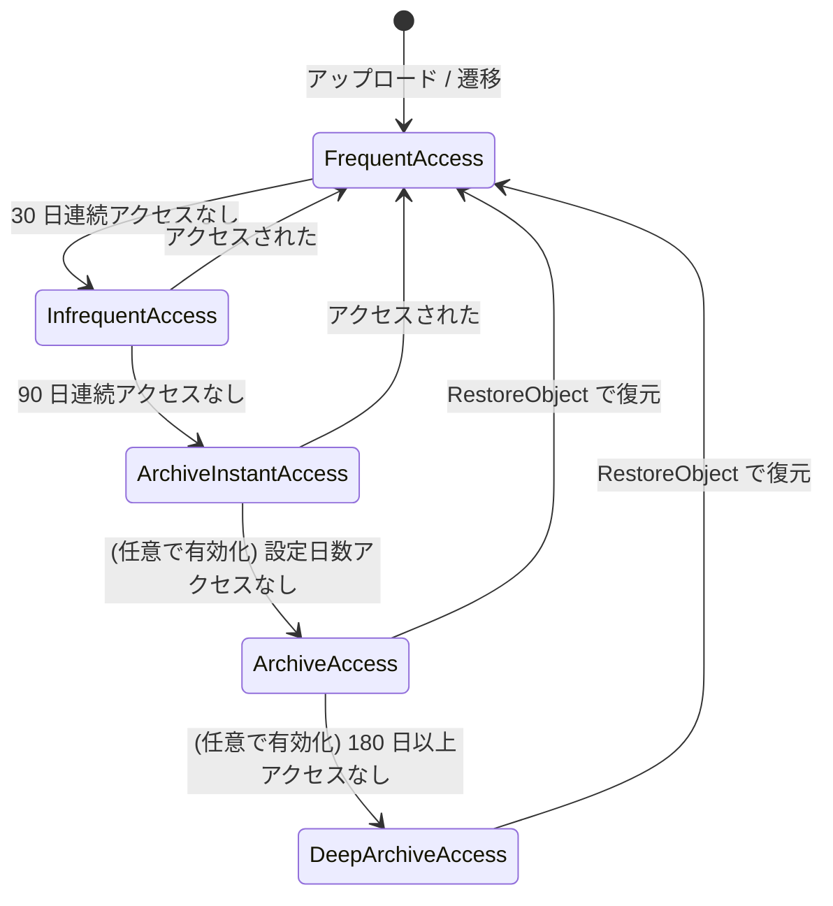
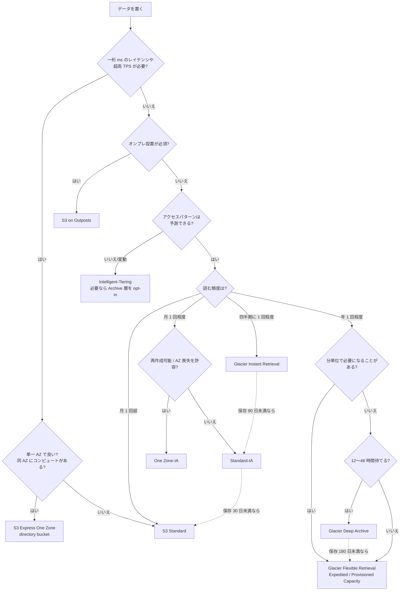
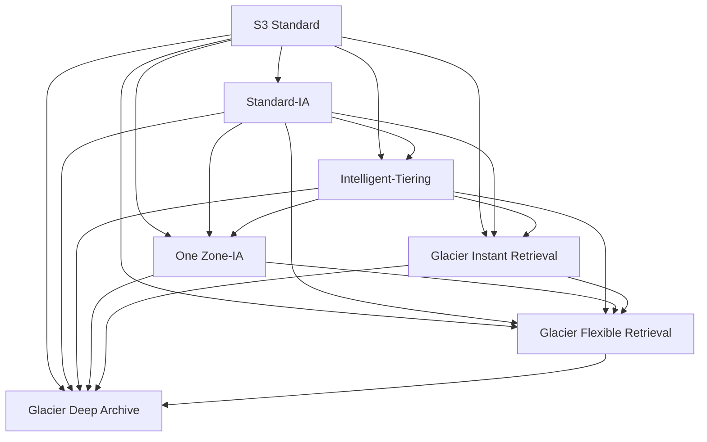

# S3 ストレージクラス完全ガイド

_最終確認: 2026-10-03_

S3 のすべてのオブジェクトは、何らかの **ストレージクラス** に属する。ストレージクラスは「耐久性・可用性・レイテンシ・料金体系」のセットで、同じバケット内でもオブジェクトごとに違うクラスを持てる。この章では全クラスを網羅し、数値と選び方、ライフサイクルでの遷移ルールまでを扱う。

価格はすべて **us-east-1 (バージニア北部)、USD、2026-10-03 確認**。出典は AWS Price List API (`AmazonS3` / `AmazonS3GlacierDeepArchive` / `AmazonGlacier` オファー、publicationDate 2026-09-28) と S3 料金ページ。機械可読データは `data/storage-classes.json` にある。

## 1. 全体マップ

```text
アクセス頻度 高 ◀──────────────────────────────────────────────────────▶ 低
レイテンシ   短 ◀──────────────────────────────────────────────────────▶ 長
ストレージ単価 高 ◀────────────────────────────────────────────────────▶ 安

 Express One Zone   Standard   Intelligent-Tiering   Standard-IA   Glacier IR   Glacier Flexible   Deep Archive
   $0.11            $0.023     $0.023〜$0.00099       $0.0125       $0.004       $0.0036            $0.00099
   1桁 ms           ms         ms (archive 層は分〜時間)  ms           ms           分〜時間           時間
   1 AZ             >=3 AZ     >=3 AZ                 >=3 AZ        >=3 AZ       >=3 AZ             >=3 AZ
                                                      One Zone-IA ($0.01, 1 AZ)

 別枠: Reduced Redundancy (レガシー, 非推奨) / S3 on Outposts (OUTPOSTS, オンプレ)
```

API で指定するときの値 (`x-amz-storage-class` ヘッダ):

| クラス | API 値 |
| --- | --- |
| S3 Standard | `STANDARD` |
| S3 Express One Zone | `EXPRESS_ONEZONE` |
| S3 Intelligent-Tiering | `INTELLIGENT_TIERING` |
| S3 Standard-IA | `STANDARD_IA` |
| S3 One Zone-IA | `ONEZONE_IA` |
| S3 Glacier Instant Retrieval | `GLACIER_IR` |
| S3 Glacier Flexible Retrieval | `GLACIER` |
| S3 Glacier Deep Archive | `DEEP_ARCHIVE` |
| Reduced Redundancy Storage | `REDUCED_REDUNDANCY` |
| S3 on Outposts | `OUTPOSTS` |

`GLACIER` という API 値は歴史的経緯 (旧名 S3 Glacier) で、現在の正式名称は S3 Glacier Flexible Retrieval。

## 2. 比較表 (設計値)

User Guide の比較表 (Comparing the Amazon S3 storage classes) による設計値。

| クラス | 想定アクセス | 耐久性 (設計) | 可用性 (設計) | AZ 数 | 最低保存期間 | 最小課金サイズ | 取り出し料金 |
| --- | --- | --- | --- | --- | --- | --- | --- |
| Standard | 月 1 回超 | 99.999999999% | 99.99% | >= 3 | なし | なし | なし |
| Express One Zone | 一桁 ms が必要 | 99.999999999% | 99.95% | 1 | なし | なし | GB 単位の upload / retrieval 料金 (少額) |
| Intelligent-Tiering | 不明・変動 | 99.999999999% | 99.9% | >= 3 | なし | なし (128 KB 未満は監視対象外) | なし (監視料金あり) |
| Standard-IA | 月 1 回程度 | 99.999999999% | 99.9% | >= 3 | 30 日 | 128 KB | あり |
| One Zone-IA | 月 1 回程度・再作成可能 | 99.999999999% | 99.5% | 1 | 30 日 | 128 KB | あり |
| Glacier Instant Retrieval | 四半期 1 回程度 | 99.999999999% | 99.9% | >= 3 | 90 日 | 128 KB | あり |
| Glacier Flexible Retrieval | 年 1 回程度 | 99.999999999% | 99.99% (復元後) | >= 3 | 90 日 | なし (ただし 1 オブジェクト 40 KB のオーバーヘッド) | あり (Bulk は無料) |
| Glacier Deep Archive | 年 1 回未満 | 99.999999999% | 99.99% (復元後) | >= 3 | 180 日 | なし (同 40 KB オーバーヘッド) | あり |
| Reduced Redundancy (非推奨) | 再作成可能な頻繁アクセスデータ | 99.99% | 99.99% | >= 3 | なし | なし | なし |

注意点:

- **One Zone-IA と Express One Zone 以外は、AZ 1 つの物理的喪失に耐える** ように設計されている
- One Zone-IA と Express One Zone の 11 nines は「AZ が健在である限り」の話。地震・洪水などで AZ ごと失われればデータも失われる
- Glacier Flexible / Deep Archive の可用性 99.99% は「復元した後のコピーに対する」値

## 3. SLA (サービスレベル契約)

設計値とは別に、**SLA** は月間稼働率を下回ったときにサービスクレジット (返金) を受けられる契約上の値。S3 SLA (最終更新 2023-11-28) はクラスを 2 グループに分ける。

| グループ | 対象クラス | 10% クレジット | 25% クレジット | 100% クレジット |
| --- | --- | --- | --- | --- |
| グループ 1 | Standard, Express One Zone, Glacier Flexible Retrieval, Glacier Deep Archive ほか | 99.0% 以上 99.9% 未満 | 95.0% 以上 99.0% 未満 | 95.0% 未満 |
| グループ 2 | Intelligent-Tiering, Standard-IA, One Zone-IA, Glacier Instant Retrieval | 98.0% 以上 99.0% 未満 | 95.0% 以上 98.0% 未満 | 95.0% 未満 |

つまり SLA のしきい値は、グループ 1 が **99.9%**、グループ 2 が **99%**。設計値 (99.99% など) よりかなり低いが、これは「契約で約束する下限」だからで、普段の実効可用性とは別物。耐久性 (11 nines) には SLA はない。

## 4. 料金一覧 (us-east-1)

### 4.1 ストレージ単価

| クラス | GB-月あたり | 備考 |
| --- | --- | --- |
| Standard | 最初の 50 TB: $0.023 / 次の 450 TB: $0.022 / 500 TB 超: $0.021 | 段階制 |
| Express One Zone | $0.11 | 2025-04-10 に $0.16 から 31% 値下げ |
| Intelligent-Tiering Frequent Access | $0.023 / $0.022 / $0.021 (Standard と同じ段階) | |
| Intelligent-Tiering Infrequent Access | $0.0125 | |
| Intelligent-Tiering Archive Instant Access | $0.004 | |
| Intelligent-Tiering Archive Access (任意) | $0.0036 | |
| Intelligent-Tiering Deep Archive Access (任意) | $0.00099 | |
| Intelligent-Tiering 監視・自動化料金 | $0.0025 / 1,000 オブジェクト / 月 | 128 KB 以上のオブジェクトのみ |
| Standard-IA | $0.0125 | |
| One Zone-IA | $0.01 | |
| Glacier Instant Retrieval | $0.004 | |
| Glacier Flexible Retrieval | $0.0036 | |
| Glacier Deep Archive | $0.00099 | |
| Reduced Redundancy | 最初の 1 TB: $0.024 / 次の 49 TB: $0.0236 / ... / 5,000 TB 超: $0.022 | Standard より高い |

1 TB (1,024 GB) あたり月額に直すと次のとおり (Standard は最初の段階)。

| クラス | 1 TB-月 |
| --- | --- |
| Express One Zone | 約 $112.64 |
| Standard | 約 $23.55 |
| Standard-IA | 約 $12.80 |
| One Zone-IA | 約 $10.24 |
| Glacier Instant Retrieval | 約 $4.10 |
| Glacier Flexible Retrieval | 約 $3.69 |
| Glacier Deep Archive | 約 $1.01 |

### 4.2 リクエスト料金

| クラス | PUT / COPY / POST / LIST (1,000 件) | GET / SELECT / その他 (1,000 件) |
| --- | --- | --- |
| Standard | $0.005 | $0.0004 |
| Express One Zone | $0.00113 | $0.00003 |
| Intelligent-Tiering | $0.005 | $0.0004 |
| Standard-IA | $0.01 | $0.001 |
| One Zone-IA | $0.01 | $0.001 |
| Glacier Instant Retrieval | $0.02 | $0.01 |
| Glacier Flexible Retrieval | $0.03 | $0.0004 |
| Glacier Deep Archive | $0.05 | $0.0004 |

DELETE と CANCEL は無料。Glacier Flexible / Deep Archive の GET 料金は「アーカイブ状態のオブジェクトへの GET 以外の操作 (HEAD 等) や復元後コピーの GET」に適用される (アーカイブ中のデータは GET できない)。

### 4.3 取り出し (retrieval) 料金

| クラス | 取り出しオプション | 典型的な所要時間 | GB あたり | リクエストあたり |
| --- | --- | --- | --- | --- |
| Standard / Intelligent-Tiering (FA/IA/AIA) | — | ms | なし | なし |
| Express One Zone | upload / retrieval | 一桁 ms | upload $0.0032、retrieval $0.0006 | — |
| Standard-IA | — | ms | $0.01 | — |
| One Zone-IA | — | ms | $0.01 | — |
| Glacier Instant Retrieval | — | ms | $0.03 | — |
| Glacier Flexible Retrieval | Expedited | 1〜5 分 | $0.03 | $10 / 1,000 ($0.01/件) |
| Glacier Flexible Retrieval | Standard | 3〜5 時間 (Batch Operations 経由なら数分〜5 時間) | $0.01 | $0.05 / 1,000 |
| Glacier Flexible Retrieval | Bulk | 5〜12 時間 | 無料 | 無料 |
| Glacier Deep Archive | Standard | 12 時間以内 (Batch Operations 経由で 9〜12 時間) | $0.02 | $0.10 / 1,000 |
| Glacier Deep Archive | Bulk | 48 時間以内 | $0.0025 | $0.025 / 1,000 |
| Intelligent-Tiering Archive Access | Expedited | 1〜5 分 | $0.03 | $0.01/件 |
| Intelligent-Tiering Archive Access | Standard / Bulk | 3〜5 時間 / 5〜12 時間 | 無料 | 無料 |
| Intelligent-Tiering Deep Archive Access | Standard / Bulk | 12 時間以内 / 48 時間以内 | 無料 | 無料 |

補足:

- Glacier Flexible の Expedited は需要が高いと受け付けられないことがある。確実に使いたい場合は **Provisioned Capacity** ($100 / ユニット / 月。1 ユニットで 5 分ごとに少なくとも 3 件の Expedited 取り出し、最大 300 MB/s) を購入する
- Expedited で 250 MB 未満のオブジェクトは通常 1〜5 分、250 MB 以上は最大 300 MB/s のスループットで取り出される
- 復元したコピーは指定日数だけ存在し、その間は **Standard 料金でも課金** される (アーカイブ本体の料金と二重)
- アカウントあたり復元リクエストは 1,000 TPS、スループットは 1〜2 PB/日が目安
- 5 TB を超える巨大オブジェクトは最大 300 MB/s で復元されるため時間がかかる (例: 50 TB の Glacier Flexible オブジェクトは最大 48 時間)

### 4.4 ライフサイクル遷移リクエスト料金

ライフサイクルでクラスを移すと、**オブジェクト 1 個につき 1 遷移リクエスト** が課金される。

| 遷移先 | 1,000 件あたり |
| --- | --- |
| Standard-IA / One Zone-IA / Intelligent-Tiering | $0.01 |
| Glacier Instant Retrieval | $0.02 |
| Glacier Flexible Retrieval | $0.03 |
| Glacier Deep Archive | $0.05 |

## 5. 各クラスの詳細

### 5.1 S3 Standard (`STANDARD`)

既定のストレージクラス。迷ったらここから始める。

- ms 単位のレイテンシ、高スループット
- 最低保存期間・最小課金サイズ・取り出し料金がすべてない。「いつ消しても、どれだけ小さくても、何度読んでも」ストレージ料金とリクエスト料金だけ
- 3 つ以上の AZ に冗長保存
- 典型用途: Web/モバイルの静的アセット、頻繁に読むアプリデータ、データレイクのホットゾーン、ログの直近分

### 5.2 S3 Express One Zone (`EXPRESS_ONEZONE`)

2023-11-28 (re:Invent 2023) に登場した、**単一 AZ・一桁ミリ秒** の高性能クラス。

- **directory bucket** にしか置けない。general purpose バケットでは指定できない
- Standard 比で最大 10 倍速いデータアクセス、リクエスト料金は Standard より大幅に安い (GET は約 1/13)
- ストレージ単価は $0.11/GB-月で、Standard の約 4.8 倍
- 2025-04-10 の値下げで、ストレージ 31%、PUT 55%、GET 85% 値下げ。upload / retrieval の GB 料金も 60% 下がり、「512 KB を超える部分だけ」ではなく **全バイト** に課金される方式になった
- ディレクトリバケットあたり最大 200 万 GET TPS / 20 万 PUT TPS
- `CreateSession` によるセッション認証
- オブジェクト末尾への **append** が可能
- 計算資源 (EC2, EKS, SageMaker など) を同じ AZ に置くと効果が最大化する
- 典型用途: ML 学習データの高速読み込み、インタラクティブ分析、HPC のスクラッチ、メディアのレンダリング中間データ、Spark のシャッフル

コスト感の例 (FAQ の例): 10 GB を 30 日保存、100 万 PUT と 900 万 GET (各 10 KB)、最後に 100 万件削除 → ストレージ $1.10 + PUT $1.13 + GET $0.27 + upload $0.03 + retrieval $0.05 = **$2.58**。

### 5.3 S3 Intelligent-Tiering (`INTELLIGENT_TIERING`)

アクセスパターンが **不明・変動する** データ向けに、オブジェクト単位でアクセス層を自動移動するクラス (2018-11 登場)。



| 層 | 移動条件 | 単価 (GB-月) | アクセス |
| --- | --- | --- | --- |
| Frequent Access | 既定 | $0.023〜$0.021 | ms |
| Infrequent Access | 30 日連続アクセスなし | $0.0125 | ms |
| Archive Instant Access | 90 日連続アクセスなし | $0.004 | ms |
| Archive Access (opt-in) | 90 日以上 (設定可能) アクセスなし | $0.0036 | 復元が必要 (分〜時間) |
| Deep Archive Access (opt-in) | 180 日以上 (設定可能) アクセスなし | $0.00099 | 復元が必要 (時間) |

ポイント:

- **取り出し料金なし**。アクセスされた瞬間に Frequent Access 層へ戻るだけ (archive 系 opt-in 層の Expedited 復元は除く)
- 層間の自動移動にも遷移料金はかからない
- 代わりに **監視・自動化料金 $0.0025 / 1,000 オブジェクト / 月** がかかる
- **128 KB 未満のオブジェクトは監視されず、常に Frequent Access 層** に置かれる。その代わり監視料金もかからない (2021-09 の変更)
- 2021-09 に **最低保存期間 (以前は 30 日) が撤廃** された
- Archive Access / Deep Archive Access は `PutBucketIntelligentTieringConfiguration` で明示的に有効化したときだけ使われる。アプリが非同期の復元を扱えないなら有効化してはいけない
- 「90 日で Archive Access」を有効化すると Archive Instant Access を飛ばして直接 Archive Access に入る
- 可用性設計 99.9%、SLA はグループ 2 (99%)

監視料金の損益分岐の目安: 監視料金は 1 オブジェクトあたり月 $0.0000025。Frequent → Infrequent に落ちると 1 GB あたり月 $0.0105 安くなるので、**オブジェクトが大きいほど得**。例えば 1 MB のオブジェクト 100 万個 (約 1 TB) なら監視料金は月 $2.50 で、半分が IA 層に落ちるだけで月 $5 程度のストレージ削減になる。逆に 128 KB ちょうどくらいの小さいオブジェクトが大量にある場合は、監視料金が削減額を上回りうる。

### 5.4 S3 Standard-IA (`STANDARD_IA`)

「あまり読まないが、読むときはすぐ欲しい」データ向け。

- ストレージは Standard の約半額 ($0.0125)
- **取り出し $0.01/GB**、PUT は Standard の 2 倍、GET は 2.5 倍
- **最低保存期間 30 日** (それより前に削除・上書き・遷移すると残り日数分を課金)
- **最小課金サイズ 128 KB** (1 KB のオブジェクトも 128 KB として課金)
- 3 AZ 以上、可用性設計 99.9%
- 典型用途: バックアップ、DR 用コピー、古いログ・ドキュメント、ユーザーが稀に開く過去データ

損益分岐: Standard との差額は 1 GB あたり月 $0.0105。取り出し $0.01/GB なので、**月に 1 回丸ごと読むとほぼトントン**。月 1 回以上読むなら Standard の方が安い。

### 5.5 S3 One Zone-IA (`ONEZONE_IA`)

Standard-IA の単一 AZ 版。

- ストレージ $0.01/GB-月 (Standard-IA より 20% 安い)
- 取り出し・最低保存期間・最小課金サイズは Standard-IA と同じ
- 可用性設計 99.5%。**AZ の喪失でデータを失う**
- 典型用途: 再作成可能なデータ (サムネイル、トランスコード済みメディア)、CRR のレプリカ先 (元データが別リージョンにある)、オンプレミスにもマスターがあるデータの二次コピー
- Local Zones の directory bucket でデータレジデンシー目的にも使える

### 5.6 S3 Glacier Instant Retrieval (`GLACIER_IR`)

2021-11 (re:Invent 2021) 登場。**アーカイブ価格帯なのに ms で読める** クラス。

- ストレージ $0.004/GB-月 (Standard の約 1/6)
- 取り出し **$0.03/GB**、GET $0.01/1,000 件 (Standard の 25 倍)
- **最低保存期間 90 日**、最小課金サイズ 128 KB
- 復元操作は不要。通常の GET で読める
- 典型用途: 医療画像、ニュースメディアのアーカイブ、ユーザー生成コンテンツの古い分、四半期に 1 回程度読まれるデータ

損益分岐: Standard-IA との差額は 1 GB あたり月 $0.0085、取り出し料金差は $0.02/GB。四半期 (3 か月) に 1 回丸ごと読むなら 3 × $0.0085 = $0.0255 の節約に対し追加取り出し $0.02 なので GIR が得。月 1 回読むなら IA の方が得。

### 5.7 S3 Glacier Flexible Retrieval (`GLACIER`)

旧 S3 Glacier。**復元してから読む** アーカイブクラス。

- ストレージ $0.0036/GB-月
- 取り出しは Expedited / Standard / Bulk の 3 種類 (第 4.3 節)。**Bulk は無料**
- **最低保存期間 90 日**
- 最小課金サイズはないが、**オブジェクトごとに 40 KB のオーバーヘッド** (32 KB は Glacier 料金、8 KB は Standard 料金) がかかる。小さいオブジェクトを大量に置くと割高
- 復元したコピーは一時的に存在し、オブジェクトのストレージクラス表示は `GLACIER` のまま
- 典型用途: バックアップの長期保管、メディアアセットのアーカイブ、年に 1〜2 回の監査用データ

### 5.8 S3 Glacier Deep Archive (`DEEP_ARCHIVE`)

最安のクラス (2019-03 GA)。テープの置き換えを想定。

- ストレージ **$0.00099/GB-月** (1 TB で月約 $1)
- 取り出しは Standard (12 時間以内) か Bulk (48 時間以内)。Expedited はない
- **最低保存期間 180 日**
- オブジェクトごとに 40 KB のオーバーヘッド (Flexible と同じ構造)
- 典型用途: 規制対応で 7〜10 年保管する記録、金融・医療・公共のコンプライアンスアーカイブ、二度と読まないかもしれない生データ

### 5.9 Reduced Redundancy Storage (`REDUCED_REDUNDANCY`) — レガシー

2010-05 に登場した、冗長度を下げて安くしたクラス。

- 耐久性 99.99% (年間で平均 0.01% のオブジェクトを失う想定)。失われたオブジェクトへのリクエストには **405** が返る
- 現在は **Standard の方が安い** ($0.024 vs $0.023) ため、AWS 自身が「使うべきでない」と明記
- ライフサイクルで RRS へ遷移させることはできない
- 既存の RRS データは Standard か Intelligent-Tiering にコピーし直すのが推奨

### 5.10 S3 on Outposts (`OUTPOSTS`)

AWS Outposts (オンプレミスに設置する AWS ラック) 上に S3 バケットを作るためのクラス。

- Outposts 上のバケットでしか使えず、逆に Outposts バケットでは他のクラスを使えない (使うと `InvalidStorageClass`)
- 常に SSE-S3 で暗号化 (SSE-C は選択可、SSE-KMS は非対応)
- 料金は Outposts のキャパシティ購入に含まれる形で、通常の GB-月の公開単価とは体系が異なる (本書では単価を扱わない)
- 典型用途: データレジデンシー要件、ローカル処理が必要な工場・病院・金融拠点

## 6. 選び方フローチャート



フローチャートの前提チェック:

- **オブジェクトサイズが 128 KB 未満** が多いなら、IA / GIR は最小課金サイズで割高。Glacier Flexible / Deep Archive も 40 KB オーバーヘッドで割高。Standard のまま (Intelligent-Tiering でも 128 KB 未満は Frequent 層に固定) が無難。あるいは tar / Parquet などで集約してから置く
- **保存期間が最低保存期間より短い** なら、そのクラスは使わない
- **読み取り量 (GB)** が多いなら取り出し料金を試算する。ストレージ単価だけで選ぶと事故る

## 7. ライフサイクル遷移のルール

### 7.1 ウォーターフォールモデル

ライフサイクルによる遷移は **下方向 (より安い・冷たい方向) にしか行けない**。



| 遷移元 | 遷移可能な先 |
| --- | --- |
| Standard | Standard-IA, Intelligent-Tiering, One Zone-IA, Glacier IR, Glacier Flexible, Deep Archive |
| Standard-IA | Intelligent-Tiering, One Zone-IA, Glacier IR, Glacier Flexible, Deep Archive |
| Intelligent-Tiering (Frequent / Infrequent 層) | One Zone-IA, Glacier IR, Glacier Flexible, Deep Archive |
| Intelligent-Tiering (Archive Instant Access 層) | Glacier IR, Glacier Flexible, Deep Archive |
| Intelligent-Tiering (Archive Access 層) | Glacier Flexible, Deep Archive |
| Intelligent-Tiering (Deep Archive Access 層) | Deep Archive |
| One Zone-IA | Glacier Flexible, Deep Archive |
| Glacier Instant Retrieval | Glacier Flexible, Deep Archive |
| Glacier Flexible Retrieval | Deep Archive |
| Glacier Deep Archive | (なし) |

できないこと:

- 上方向の遷移 (例: Standard-IA → Standard、Glacier → Standard)。必要なら **復元 (Glacier 系の場合) してから CopyObject でクラスを指定して上書き** する
- One Zone-IA → Standard-IA / Intelligent-Tiering / Glacier IR
- どのクラスからも Reduced Redundancy への遷移
- **Express One Zone (directory bucket) はライフサイクルの遷移対象外**。directory bucket のライフサイクルは expiration (期限切れ削除) のみ対応
- バージョニング有効バケットで、レプリケーション状態が `Pending` / `Failed` のオブジェクトの遷移

### 7.2 30 日ルール (2026-07-16 に撤廃)

| 時期 | Standard-IA / One Zone-IA への遷移 |
| --- | --- |
| 2026-07-16 より前 | 作成から **30 日以上** 経ったオブジェクトしか遷移できなかった (`Days` を 30 未満にした IA 向け遷移ルールは作れなかった) |
| 2026-07-16 以降 | **作成当日 (0 日後) から遷移可能** (全リージョン) |

- 旧ルールの理由は、作成直後のデータはアクセスされやすく、IA の取り出し料金で損をしやすいためだった
- 撤廃後も、IA 側の **最低保存期間 30 日** と **最小課金サイズ 128 KB** はそのまま残る。「早く移せる」ようになっただけで、移した後 30 日以内に消せば早期削除料金がかかる
- 古い記事 (re:Post Knowledge Center など) にはまだ 30 日ルールが書かれていることがあるので注意
- Intelligent-Tiering や Glacier 系への遷移には、もともとこの制限はない (Day 0 遷移も可能)

### 7.3 128 KB ルール (2024-09 に変更)

| 時期 | 既定の挙動 |
| --- | --- |
| 2024-09 より前 | 128 KB 未満のオブジェクトは IA / Intelligent-Tiering / Glacier IR へは遷移しないが、**Glacier Flexible / Deep Archive へは遷移した** |
| 2024-09 以降 | **128 KB 未満のオブジェクトはどのクラスへも遷移しない** のが既定 |

- 2024-09 より前に作られたライフサイクル設定は、編集しない限り旧挙動のまま。ルールを作成・編集・削除すると新挙動に切り替わる
- 小さいオブジェクトも遷移させたい場合は、ルールのフィルタに `ObjectSizeGreaterThan` (例: 1 byte) や `ObjectSizeLessThan` を明示する
- 旧挙動 (128 KB 未満も Glacier Flexible / Deep Archive へは遷移) に戻したい場合は、`PutBucketLifecycleConfiguration` に `x-amz-transition-default-minimum-object-size` ヘッダを付ける (値は `varies_by_storage_class`。既定の新挙動は `all_storage_classes_128K`)
- なぜ変えたか: 遷移はオブジェクト 1 個ごとに課金されるので、小さいオブジェクトは遷移料金がストレージ削減額を上回りやすい。さらに Glacier 系では 40 KB のオーバーヘッドがつく

例: 10 KB のオブジェクト 1,000 万個 (約 95 GB) を Deep Archive に遷移させると、

```text
遷移料金:     10,000,000 / 1,000 × $0.05             = $500 (一回)
ストレージ削減: 95 GB × ($0.023 - $0.00099)           ≒ $2.09 / 月
オーバーヘッド: 1,000 万 × 8 KB を Standard 料金で    ≒ 76 GB × $0.023 ≒ $1.75 / 月
               1,000 万 × 32 KB を Deep Archive 料金で ≒ 305 GB × $0.00099 ≒ $0.30 / 月
→ 実質の削減はほぼゼロ。遷移料金 $500 は永遠に回収できない
```

### 7.4 最低保存期間とルール設計

- 1 つのルールの中で、最低保存期間を満たさないうちに次の遷移を入れることはできない。例: 4 日目に Glacier IR (最低 90 日) へ移し、20 日目に Deep Archive へ移すルールは作れない。Deep Archive への遷移は少なくとも 94 日目以降にする必要がある
- 別々の 2 ルールに分ければ設定はできるが、最低保存期間分の料金 (early delete fee 相当) を払うことになる
- Glacier Flexible / Deep Archive への遷移は非同期で、ルールの条件を満たした日から遷移先の料金・最低保存期間・40 KB オーバーヘッドの課金が始まる (物理的な移動がまだでも)。例外は Intelligent-Tiering への遷移で、こちらは物理的な遷移完了後に課金が変わる

### 7.5 典型的なライフサイクル設定例

ログを「30 日 Standard → 120 日まで Standard-IA → 1 年まで Glacier Flexible → 7 年まで Deep Archive → 削除」、さらに未完了 multipart と古いバージョンを掃除する設定:

```json
{
  "Rules": [
    {
      "ID": "logs-tiering",
      "Status": "Enabled",
      "Filter": {
        "And": {
          "Prefix": "logs/",
          "ObjectSizeGreaterThan": 131072
        }
      },
      "Transitions": [
        { "Days": 30, "StorageClass": "STANDARD_IA" },
        { "Days": 120, "StorageClass": "GLACIER" },
        { "Days": 365, "StorageClass": "DEEP_ARCHIVE" }
      ],
      "Expiration": { "Days": 2555 },
      "NoncurrentVersionExpiration": { "NoncurrentDays": 30 }
    },
    {
      "ID": "abort-mpu",
      "Status": "Enabled",
      "Filter": {},
      "AbortIncompleteMultipartUpload": { "DaysAfterInitiation": 7 }
    }
  ]
}
```

この例で Standard-IA の滞在は 30〜120 日目の 90 日間 (最低 30 日を満たす)、Glacier Flexible は 120〜365 日目の 245 日間 (最低 90 日を満たす)、Deep Archive は 365〜2,555 日目 (最低 180 日を満たす) なので、early delete fee は発生しない。

## 8. 最低保存期間・最小サイズの課金の仕組み

### 8.1 早期削除料金 (early delete fee)

最低保存期間のあるクラスで、期間満了前に **削除・上書き・別クラスへの遷移** をすると、残りの日数分のストレージ料金が日割りで請求される。

| クラス | 最低保存期間 | 早期削除の単価 (GB-月, 日割り) |
| --- | --- | --- |
| Standard-IA | 30 日 | $0.0125 |
| One Zone-IA | 30 日 | $0.01 |
| Glacier Instant Retrieval | 90 日 | $0.004 |
| Glacier Flexible Retrieval | 90 日 | $0.0036 |
| Glacier Deep Archive | 180 日 | $0.00099 |

例: Standard-IA に 100 GB を置き、10 日目に削除した場合 → 実際の 10 日分に加え、残り 20 日分 (100 GB × $0.0125 × 20/30 ≒ $0.83) が早期削除料金として請求される。

### 8.2 最小課金サイズ

Standard-IA / One Zone-IA / Glacier IR は **128 KB 未満のオブジェクトを 128 KB として課金** する。例えば 4 KB のオブジェクト 100 万個 (実データ約 3.8 GB) を Standard-IA に置くと、課金上は約 122 GB 扱いになり、ストレージ料金は Standard に置くより高くなる。

```text
Standard:    3.8 GB × $0.023   ≒ $0.09 / 月
Standard-IA: 122 GB × $0.0125  ≒ $1.53 / 月   ← 17 倍高い
```

### 8.3 Glacier 系の 40 KB オーバーヘッド

Glacier Flexible / Deep Archive では、オブジェクトごとに

- 8 KB: オブジェクト名とメタデータ (LIST でリアルタイムに見えるようにするため) → **Standard 料金**
- 32 KB: インデックスと関連メタデータ (復元に必要) → **Glacier / Deep Archive 料金**

が追加される。小さいオブジェクトを大量にアーカイブするなら、tar や zip で数百 MB〜数 GB 単位に固めてから置くのが鉄則。

## 9. ユースケース別の推奨

| ユースケース | 推奨クラス | 理由 |
| --- | --- | --- |
| Web の静的アセット (CloudFront の origin) | Standard | 頻繁なアクセス、取り出し料金なし |
| アクセス傾向不明のデータレイク | Intelligent-Tiering | 自動で IA / AIA へ落ちる。取り出し料金なし |
| ML 学習データの高速読み込み | Express One Zone | 一桁 ms、低リクエスト料金、同 AZ の GPU と組む |
| DB バックアップ (日次、30 日保持) | Standard-IA (ただし 30 日未満で消すなら Standard) | 稀に読む、最低 30 日 |
| サムネイル・トランスコード済み動画 | One Zone-IA | 再作成可能 |
| 医療画像・過去ニュース写真 | Glacier Instant Retrieval | 稀だが即時に必要 |
| 年 1 回の監査用バックアップ | Glacier Flexible Retrieval | 分〜時間で取り出せればよい |
| 規制による 7〜10 年保管 | Glacier Deep Archive (+ Object Lock) | 最安、12〜48 時間待てる |
| CRR のレプリカ (DR 用) | One Zone-IA か Glacier 系 | 本番コピーが別リージョンにある |
| オンプレ工場の局所データ | S3 on Outposts | データレジデンシー |

## 10. よくある落とし穴

| 落とし穴 | 何が起きるか | 対策 |
| --- | --- | --- |
| 小さいオブジェクトを IA / GIR に入れる | 128 KB 課金で Standard より高くなる | サイズフィルタ、集約、Intelligent-Tiering |
| 小さいオブジェクトを Glacier 系へ遷移 | 遷移料金 + 40 KB オーバーヘッドで赤字 | 2024-09 以降の既定 (128 KB 未満は遷移しない) を維持 |
| 30 日以内に消すデータを IA に置く | 早期削除料金 | 保存期間を把握してからクラスを決める |
| Glacier に入れたデータをアプリが GET | `InvalidObjectState` エラー | 復元フローを実装、または Glacier IR を使う |
| Intelligent-Tiering の Archive 層を安易に有効化 | 読みたいときに即時に読めない | 非同期復元を扱えるアプリだけ有効化 |
| Expedited 復元に頼り切る | 需要が高いと受け付けられない | Provisioned Capacity か Glacier IR |
| One Zone-IA にマスターデータ | AZ 喪失でデータ消失 | マスターは複数 AZ のクラスに |
| RRS を使い続ける | Standard より高くて耐久性も低い | Standard / Intelligent-Tiering へ移行 |
| 復元コピーの期間を長く取りすぎる | Standard 料金が二重にかかる | 必要日数だけ指定 |

## 参考文献

- [Understanding and managing Amazon S3 storage classes (User Guide)](https://docs.aws.amazon.com/AmazonS3/latest/userguide/storage-class-intro.html)
- [Transitioning objects using Amazon S3 Lifecycle](https://docs.aws.amazon.com/AmazonS3/latest/userguide/lifecycle-transition-general-considerations.html)
- [Lifecycle configuration examples (small objects)](https://docs.aws.amazon.com/AmazonS3/latest/userguide/lifecycle-configuration-examples.html)
- [Understanding archive retrieval options](https://docs.aws.amazon.com/AmazonS3/latest/userguide/restoring-objects-retrieval-options.html)
- [How S3 Intelligent-Tiering works](https://docs.aws.amazon.com/AmazonS3/latest/userguide/intelligent-tiering-overview.html)
- [Amazon S3 pricing](https://aws.amazon.com/s3/pricing/)
- [AWS Price List API: AmazonS3 offer (us-east-1)](https://pricing.us-east-1.amazonaws.com/offers/v1.0/aws/AmazonS3/current/us-east-1/index.json)
- [AWS Price List API: AmazonS3GlacierDeepArchive offer (us-east-1)](https://pricing.us-east-1.amazonaws.com/offers/v1.0/aws/AmazonS3GlacierDeepArchive/current/us-east-1/index.json)
- [Amazon S3 Service Level Agreement](https://aws.amazon.com/s3/sla/)
- [Amazon S3 FAQs](https://aws.amazon.com/s3/faqs/)
- [How do I troubleshoot S3 Lifecycle rules that didn't transition? (re:Post)](https://repost.aws/knowledge-center/s3-lifecycle-configuration-rule)
- [Amazon S3 removes 30-day minimum for transitions to S3 Standard-IA and S3 One Zone-IA (What's New, 2026-07-16)](https://aws.amazon.com/about-aws/whats-new/2026/07/s3-removes-30-day-transitions-standard-ia-one-zone-ia/)
- [Announcing up to 85% price reductions for Amazon S3 Express One Zone (AWS News Blog, 2025-04)](https://aws.amazon.com/blogs/aws/up-to-85-price-reductions-for-amazon-s3-express-one-zone/)
- [S3 Intelligent-Tiering removes minimum storage duration and small-object monitoring charge (What's New, 2021-09)](https://aws.amazon.com/about-aws/whats-new/2021/09/amazon-s3-intelligent-tiering-automates-storage-savings/)
- [What is S3 on Outposts?](https://docs.aws.amazon.com/AmazonS3/latest/s3-outposts/S3onOutposts.html)
