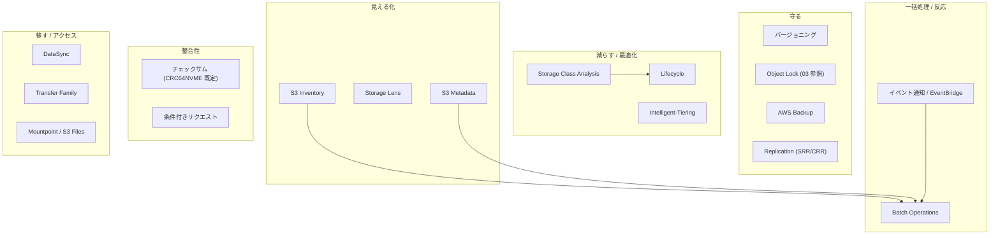
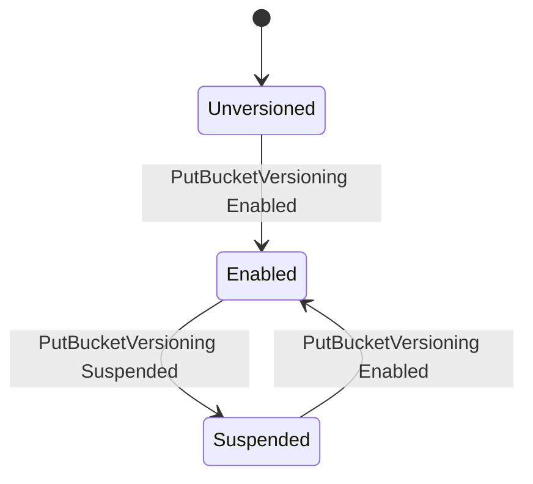
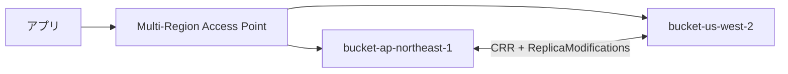
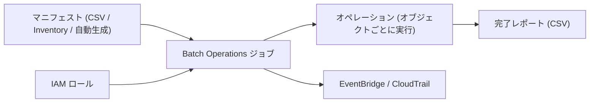
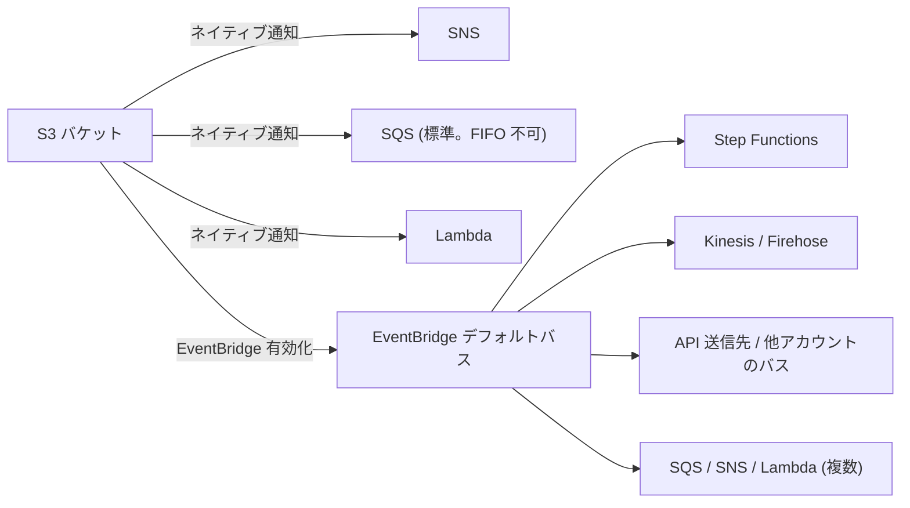
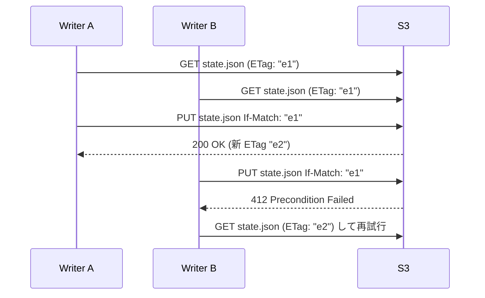
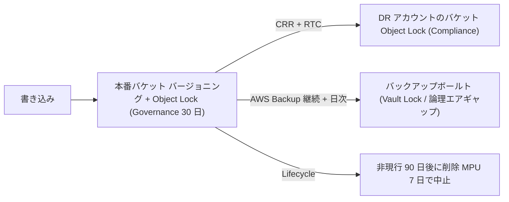

# Amazon S3 データ管理完全ガイド

_最終確認: 2026-10-03_

このドキュメントは、S3 に置いたデータを「守る・減らす・複製する・一括処理する・見える化する・反応する・整合性を保つ・移す」ための機能群を体系的に解説する。バージョニング、Lifecycle、Replication、Batch Operations、Inventory、Storage Lens、S3 Metadata、イベント通知、チェックサム、条件付きリクエスト、ファイルアクセス (Mountpoint / S3 Files)、そして AWS Backup・DataSync・Transfer Family といった周辺サービスまでを扱う。

日付つきの事実は 2026-10-03 時点で AWS 公式ドキュメント / What's New / AWS News Blog で確認したもの。確認できなかった項目は「未確認」と明記する。

## 目次

- 第1章 全体マップ
- 第2章 バージョニング
- 第3章 Lifecycle
- 第4章 Replication
- 第5章 S3 Batch Operations
- 第6章 S3 Inventory
- 第7章 S3 Storage Lens と Storage Class Analysis
- 第8章 S3 Metadata (journal / live inventory / annotation テーブル)
- 第9章 オブジェクトタグ・メタデータ・アノテーション
- 第10章 イベント通知と EventBridge
- 第11章 S3 Object Lambda と S3 Select (提供状況)
- 第12章 チェックサムとデータ整合性
- 第13章 条件付きリクエスト
- 第14章 コピー・リネーム・大容量オブジェクト
- 第15章 ファイルアクセス: Mountpoint for Amazon S3 と Amazon S3 Files
- 第16章 周辺サービス: AWS Backup / DataSync / Snow / Transfer Family
- 第17章 設計パターンとチェックリスト
- 参考文献

## 1. 全体マップ



| 目的 | 第一選択 | 補助 |
| --- | --- | --- |
| 誤削除・上書きからの復旧 | バージョニング | AWS Backup (PITR 35 日)、Object Lock |
| コスト削減 | Lifecycle、Intelligent-Tiering | Storage Lens、Storage Class Analysis |
| DR / リージョン冗長 | CRR (+ RTC) | MRAP、AWS Backup クロスリージョンコピー |
| 数十億オブジェクトへの一括操作 | Batch Operations | Inventory / Metadata でマニフェスト生成 |
| オブジェクト一覧の把握 | S3 Metadata live inventory、Inventory | ListObjectsV2 (小規模のみ) |
| 変更検知 | イベント通知 / EventBridge | S3 Metadata journal テーブル |
| データ整合性 | チェックサム | Batch Operations の Compute checksums |
| 楽観的排他 | 条件付き書き込み / 削除 | バージョン ID |
| ファイル API が必要 | S3 Files (NFS)、Mountpoint | Storage Gateway、FSx |

## 2. バージョニング

### 2.1 3 つの状態

バケットのバージョニングは 3 状態を取る。一度 Enabled にすると **Unversioned には戻せない** (Suspended にしかできない)。



| 状態 | 新規 PUT のバージョン ID | 上書き時 | DELETE (バージョン ID なし) |
| --- | --- | --- | --- |
| Unversioned | `null` | 旧データは消える | オブジェクトが消える |
| Enabled | 一意な ID を採番 | 旧バージョンは非現行 (noncurrent) として残る | 削除マーカーを作る (データは残る) |
| Suspended | `null` | `null` バージョンを上書き (他のバージョンは残る) | `null` バージョンの削除マーカーを作る |

### 2.2 バージョンスタックと削除マーカー

```text
キー: reports/2026-q3.csv

  [現行]   v3  削除マーカー (DeleteMarker=true)   <- GET すると 404 (x-amz-delete-marker: true)
  [非現行] v2  12 MB  2026-09-30
  [非現行] v1  11 MB  2026-09-01

  GET ?versionId=v2  -> v2 のデータを返す
  DELETE ?versionId=v3 (削除マーカーを削除) -> v2 が現行に戻る = 「削除の取り消し」
  DELETE ?versionId=v1 -> v1 を完全削除 (取り消し不可)
```

ポイント。

- 削除マーカーにはデータがなく、キー名のサイズ分だけ課金される。
- 現行バージョンが削除マーカーで、非現行バージョンが 0 個になった状態を「期限切れオブジェクト削除マーカー (expired object delete marker)」と呼ぶ。Lifecycle で掃除できる。
- 非現行バージョンもフル料金で課金される。バージョニング有効時は **必ず非現行バージョンの Lifecycle を設定** する (Security Hub S3.10)。
- ListObjectsV2 は現行バージョンのみ、ListObjectVersions は全バージョンと削除マーカーを返す。

```bash
aws s3api put-bucket-versioning --bucket amzn-s3-demo-bucket \
  --versioning-configuration Status=Enabled

aws s3api list-object-versions --bucket amzn-s3-demo-bucket --prefix reports/

# 削除の取り消し: 削除マーカーのバージョンを削除
aws s3api delete-object --bucket amzn-s3-demo-bucket \
  --key reports/2026-q3.csv --version-id "3HL4kqtJlcpXroDTDmJ+rmSpXd3dIbrHY"
```

### 2.3 MFA Delete

バージョニング設定に付加され、「バージョニング状態の変更」と「バージョンの完全削除」に MFA を要求する。ルートユーザーのみ CLI / API から有効化でき、Lifecycle 設定と併用できない。詳細は 03-security.md の第8章を参照。

### 2.4 バージョニングの性能・コスト上の注意

- 同一キーへの大量上書きは非現行バージョンを無限に積み上げる。数百万バージョンを持つキーは ListObjectVersions が遅くなり、503 Slow Down を誘発することがある。
- Replication と Object Lock はバージョニング必須。
- ディレクトリバケット (S3 Express One Zone) はバージョニング非対応。

## 3. Lifecycle

### 3.1 Lifecycle ルールの構成要素

| 要素 | 説明 |
| --- | --- |
| Filter | Prefix、Tag (複数は And)、ObjectSizeGreaterThan / ObjectSizeLessThan。空フィルタはバケット全体 |
| Status | Enabled / Disabled |
| Transitions | 現行バージョンを N 日後 (または日付) に別ストレージクラスへ |
| Expiration | 現行バージョンを N 日後に期限切れ (バージョニング有効時は削除マーカー化) |
| NoncurrentVersionTransitions | 非現行になってから N 日後に遷移。NewerNoncurrentVersions で「最新 N 個は残す」 |
| NoncurrentVersionExpiration | 非現行になってから N 日後に完全削除 |
| ExpiredObjectDeleteMarker | 期限切れオブジェクト削除マーカーを削除 |
| AbortIncompleteMultipartUpload | 開始から N 日経った未完了 MPU を中止 (パートの料金を止める) |

1 バケットあたり最大 1,000 ルール。ルールは非同期に (通常 1 日 1 回程度) 評価され、期限到来から実際の削除・遷移までタイムラグがある。ただし期限到来以降は課金が止まる (Expiration の場合)。

### 3.2 遷移の「滝 (waterfall)」

```text
S3 Standard
   |
   v
S3 Standard-IA / S3 Intelligent-Tiering / S3 One Zone-IA
   |
   v
S3 Glacier Instant Retrieval
   |
   v
S3 Glacier Flexible Retrieval
   |
   v
S3 Glacier Deep Archive
```

- 下方向にしか遷移できない (上方向はコピーが必要)。
- Standard-IA / One Zone-IA へは作成から 30 日以上経ったものしか遷移できない。
- 最低保存期間 (IA 系 30 日、Glacier Instant / Flexible 90 日、Deep Archive 180 日) 前に削除・遷移すると残り期間分が課金される。
- 小さいオブジェクトの遷移は遷移リクエスト料金で割に合わないことが多い。

### 3.3 128 KB 未満の既定挙動 (2024-09)

2024-09 以降、Lifecycle 設定の既定値は `TransitionDefaultMinimumObjectSize = all_storage_classes_128K` で、**128 KB 未満のオブジェクトはどのストレージクラスにも遷移しない**。`varies_by_storage_class` を指定すると、旧来どおり Glacier Flexible Retrieval / Deep Archive へは 128 KB 未満も遷移する。カスタムの `ObjectSizeGreaterThan` / `ObjectSizeLessThan` フィルタは既定より優先される。

### 3.4 実例 JSON

ログバケット向けの典型的な設定。

```json
{
  "TransitionDefaultMinimumObjectSize": "all_storage_classes_128K",
  "Rules": [
    {
      "ID": "logs-tiering-and-expire",
      "Status": "Enabled",
      "Filter": { "Prefix": "logs/" },
      "Transitions": [
        { "Days": 30, "StorageClass": "STANDARD_IA" },
        { "Days": 90, "StorageClass": "GLACIER_IR" },
        { "Days": 365, "StorageClass": "DEEP_ARCHIVE" }
      ],
      "Expiration": { "Days": 2555 }
    },
    {
      "ID": "noncurrent-cleanup",
      "Status": "Enabled",
      "Filter": {},
      "NoncurrentVersionTransitions": [
        { "NoncurrentDays": 30, "StorageClass": "GLACIER_IR", "NewerNoncurrentVersions": 3 }
      ],
      "NoncurrentVersionExpiration": { "NoncurrentDays": 90, "NewerNoncurrentVersions": 3 }
    },
    {
      "ID": "delete-expired-markers",
      "Status": "Enabled",
      "Filter": {},
      "Expiration": { "ExpiredObjectDeleteMarker": true }
    },
    {
      "ID": "abort-mpu",
      "Status": "Enabled",
      "Filter": {},
      "AbortIncompleteMultipartUpload": { "DaysAfterInitiation": 7 }
    }
  ]
}
```

タグ + サイズでフィルタする例 (1 MB 以上の `class=archive` タグ付きのみ Deep Archive へ)。

```json
{
  "Rules": [
    {
      "ID": "archive-large-tagged",
      "Status": "Enabled",
      "Filter": {
        "And": {
          "Prefix": "media/",
          "Tags": [ { "Key": "class", "Value": "archive" } ],
          "ObjectSizeGreaterThan": 1048576
        }
      },
      "Transitions": [ { "Days": 0, "StorageClass": "DEEP_ARCHIVE" } ]
    }
  ]
}
```

すべてを Intelligent-Tiering に寄せる例 (アクセスパターン不明な汎用データ向け)。

```json
{
  "Rules": [
    {
      "ID": "to-intelligent-tiering",
      "Status": "Enabled",
      "Filter": { "ObjectSizeGreaterThan": 131072 },
      "Transitions": [ { "Days": 0, "StorageClass": "INTELLIGENT_TIERING" } ]
    }
  ]
}
```

```bash
aws s3api put-bucket-lifecycle-configuration \
  --bucket amzn-s3-demo-bucket \
  --lifecycle-configuration file://lifecycle.json

aws s3api get-bucket-lifecycle-configuration --bucket amzn-s3-demo-bucket
```

`put-bucket-lifecycle-configuration` は **全置換**。既存ルールを残したい場合は get → 編集 → put する。

### 3.5 Lifecycle の重要な挙動

- 同一オブジェクトに複数ルールが該当した場合: Expiration が Transition より優先、遷移先が競合したらより安いクラスが優先。
- Lifecycle による削除・遷移はイベント通知 (`s3:LifecycleExpiration:*`, `s3:LifecycleTransition`) で検知できる。サーバーアクセスログにも記録されるが、CloudTrail データイベントには記録されない。
- 2026-03 以降、**レプリケーションに失敗したオブジェクトは Lifecycle の遷移・期限切れの対象から一時的に外れる**。権限や設定を直して Batch Replication で再複製すると、その後 Lifecycle が通常どおり処理する。
- ディレクトリバケットでも Lifecycle (期限切れ・MPU 中止) が使える (Security Hub S3.25)。遷移はない。
- MFA Delete が有効なバケットには Lifecycle を設定できない。

## 4. Replication

### 4.1 種類

| 種類 | 説明 |
| --- | --- |
| SRR (Same-Region Replication) | 同一リージョン内の別バケットへ。ログ集約、本番/検証の分離、アカウント分離 |
| CRR (Cross-Region Replication) | 別リージョンへ。DR、レイテンシ、データ主権要件 |
| Live replication | 設定後の新規・更新オブジェクトを非同期に複製 |
| Batch Replication | 既存オブジェクト、過去に失敗したオブジェクト、レプリカの再複製 (Batch Operations ジョブ) |
| 双方向 (two-way) | 2 バケット間で相互に複製 + replica modification sync。MRAP の Active-Active 構成で使う |
| マルチデスティネーション | 1 ソースから複数宛先へ (ルールごとに宛先) |

前提条件。

1. ソース・宛先ともにバージョニング有効。
2. S3 が引き受ける IAM ロール (ソース読み取り + 宛先書き込み)。
3. クロスアカウントなら宛先バケットポリシーで許可 (+ Object Ownership で所有者を宛先に)。
4. SSE-KMS オブジェクトを複製するならルールで `SseKmsEncryptedObjects` を有効化し、ロールに KMS 権限。
5. Object Lock 有効のソースは、宛先も Object Lock 有効が必要。

### 4.2 何が複製され、何が複製されないか

| 対象 | 既定 | 備考 |
| --- | --- | --- |
| 設定後の新規オブジェクト | 複製 | |
| 設定前の既存オブジェクト | 複製しない | Batch Replication を使う |
| メタデータ、タグ、ACL、Object Lock 保持情報 | 複製 | |
| 削除マーカー | 既定で複製しない | `DeleteMarkerReplication` で有効化 (タグベースフィルタのルールでは不可) |
| バージョン ID 指定の削除 (完全削除) | 複製しない | 悪意ある削除の伝播を防ぐ設計 |
| レプリカの変更 (メタデータ等) | 複製しない | `ReplicaModifications` で双方向同期 |
| Lifecycle によるアクション | 複製しない | 宛先側にも Lifecycle を設定 |
| SSE-C オブジェクト | 複製 (対応済み) | 宛先で SSE-C がブロックされていると 403 で失敗 (2026-04 以降の既定に注意) |
| すでにレプリカであるオブジェクト | 複製しない (チェーンしない) | A→B→C は B のレプリカを C に送らない。Batch Replication なら可 |
| Glacier / Deep Archive のオブジェクト | Live は可、Batch では復元が必要な場合あり | |

### 4.3 S3 Replication Time Control (RTC)

- 大半のオブジェクトを数秒で、**99.99% を 15 分以内** に複製するよう設計。
- **SLA は「請求月ごと、リージョンペアごとに 99.9% のオブジェクトを 15 分以内」**。
- RTC を有効化すると Replication メトリクス (保留中の操作数・バイト数、最大レプリケーション遅延) と、15 分しきい値超過イベント (`s3:Replication:OperationMissedThreshold` 等) が自動で有効になる。
- 追加料金 (GB 単位) がかかる。

### 4.4 設定例

```json
{
  "Role": "arn:aws:iam::111122223333:role/s3-replication-role",
  "Rules": [
    {
      "ID": "crr-all-to-dr",
      "Priority": 1,
      "Status": "Enabled",
      "Filter": {},
      "DeleteMarkerReplication": { "Status": "Enabled" },
      "SourceSelectionCriteria": {
        "SseKmsEncryptedObjects": { "Status": "Enabled" },
        "ReplicaModifications": { "Status": "Enabled" }
      },
      "Destination": {
        "Bucket": "arn:aws:s3:::amzn-s3-demo-dr-bucket",
        "Account": "444455556666",
        "StorageClass": "STANDARD_IA",
        "AccessControlTranslation": { "Owner": "Destination" },
        "EncryptionConfiguration": {
          "ReplicaKmsKeyID": "arn:aws:kms:us-west-2:444455556666:key/abcd1234-ab12-cd34-ef56-abcdef123456"
        },
        "ReplicationTime": { "Status": "Enabled", "Time": { "Minutes": 15 } },
        "Metrics": { "Status": "Enabled", "EventThreshold": { "Minutes": 15 } }
      }
    }
  ]
}
```

```bash
aws s3api put-bucket-replication \
  --bucket amzn-s3-demo-bucket \
  --replication-configuration file://replication.json

# オブジェクトの複製状態を確認 (PENDING / COMPLETED / FAILED / REPLICA)
aws s3api head-object --bucket amzn-s3-demo-bucket --key data/file.parquet \
  --query ReplicationStatus
```

レプリケーションロールの信頼ポリシーと権限ポリシー。

```json
{
  "Version": "2012-10-17",
  "Statement": [
    {
      "Effect": "Allow",
      "Principal": { "Service": "s3.amazonaws.com" },
      "Action": "sts:AssumeRole"
    }
  ]
}
```

```json
{
  "Version": "2012-10-17",
  "Statement": [
    {
      "Effect": "Allow",
      "Action": ["s3:GetReplicationConfiguration", "s3:ListBucket"],
      "Resource": "arn:aws:s3:::amzn-s3-demo-bucket"
    },
    {
      "Effect": "Allow",
      "Action": [
        "s3:GetObjectVersionForReplication",
        "s3:GetObjectVersionAcl",
        "s3:GetObjectVersionTagging"
      ],
      "Resource": "arn:aws:s3:::amzn-s3-demo-bucket/*"
    },
    {
      "Effect": "Allow",
      "Action": [
        "s3:ReplicateObject",
        "s3:ReplicateDelete",
        "s3:ReplicateTags",
        "s3:ObjectOwnerOverrideToBucketOwner"
      ],
      "Resource": "arn:aws:s3:::amzn-s3-demo-dr-bucket/*"
    }
  ]
}
```

### 4.5 双方向レプリケーションと MRAP



双方向の場合、同一キーへの同時書き込みは「最後に複製が到着したもの勝ち」になりうる。強い一貫性が必要な更新は片側リージョンに寄せる設計が安全。

### 4.6 Batch Replication

既存オブジェクトや失敗オブジェクトを複製するための Batch Operations ジョブ。マニフェストは S3 生成 (レプリケーション設定に基づきフィルタ: 「未複製」「失敗」「レプリカ」など) か、Inventory / CSV で指定する。

```bash
aws s3control create-job \
  --account-id 111122223333 \
  --operation '{"S3ReplicateObject":{}}' \
  --report '{"Bucket":"arn:aws:s3:::amzn-s3-demo-reports","Prefix":"batch-replication","Format":"Report_CSV_20180820","Enabled":true,"ReportScope":"AllTasks"}' \
  --manifest-generator '{"S3JobManifestGenerator":{"SourceBucket":"arn:aws:s3:::amzn-s3-demo-bucket","EnableManifestOutput":false,"Filter":{"EligibleForReplication":true,"ObjectReplicationStatuses":["NONE","FAILED"]}}}' \
  --priority 1 \
  --role-arn arn:aws:iam::111122223333:role/batch-replication-role \
  --no-confirmation-required
```

## 5. S3 Batch Operations

### 5.1 構成



1 ジョブで数十億オブジェクト・エクサバイト規模を処理でき、進捗追跡・リトライ・完了レポートが付く。

### 5.2 サポートされるオペレーション (2026-10 時点)

| オペレーション | 内容 | 備考 |
| --- | --- | --- |
| Copy | オブジェクトをコピー (メタデータ・ストレージクラス・暗号化の変更も可) | ディレクトリバケットでも可 |
| Compute checksums (2025-08) | 保存済みオブジェクトのチェックサムを、復元やダウンロードなしに計算しレポート | SHA-1 / SHA-256 / CRC32 / CRC32C / CRC64NVME / MD5 等 |
| Delete all object tags | タグを全削除 | |
| Invoke AWS Lambda function | 任意処理 | ディレクトリバケットでも可 |
| Replace all object tags | タグを一括置換 | |
| Replace access control list (ACL) | ACL を置換 | ACL 無効バケットでは不要 |
| Restore | Glacier Flexible / Deep Archive / Intelligent-Tiering アーカイブ層からの復元 | |
| Update object encryption (2026-01) | データ移動なしで SSE タイプ / KMS キー / Bucket Key を変更 | 1 ジョブ最大 200 億オブジェクト |
| Replicate (Batch Replication) | 既存・失敗オブジェクトの複製 | |
| Object Lock retention | 保持期限・モードを設定 | |
| Object Lock legal hold | リーガルホールドの設定・解除 | |

ディレクトリバケットのオブジェクトでは Copy と Invoke Lambda のみサポート。

Compute checksums は 2025-08 の発表時点で SHA-1 / SHA-256 / CRC32 / CRC32C / CRC64NVME / MD5 をサポートしていた。2026-04 に追加された SHA-512・XXHash 系にも対応しており、現行 API リファレンス (`S3ComputeObjectChecksumOperation`) の `ChecksumAlgorithm` の有効値は `CRC32` / `CRC32C` / `CRC64NVME` / `MD5` / `SHA1` / `SHA256` / `SHA512` / `XXHASH64` / `XXHASH3` / `XXHASH128` の 10 種類 (`ChecksumType` は `FULL_OBJECT` / `COMPOSITE`)。

### 5.3 マニフェスト

| 方式 | 説明 |
| --- | --- |
| CSV | `bucket,key[,versionId]` の行。キーは URL エンコード |
| S3 Inventory レポート | `manifest.json` を指定 |
| 自動生成 (S3JobManifestGenerator) | ソースバケット + フィルタ (作成日、キーのプレフィックス / サフィックス / 部分一致、サイズ、ストレージクラス、暗号化タイプ `MatchAnyObjectEncryption` 等) から S3 がリストを作る |

### 5.4 ジョブのライフサイクル

```text
New -> Preparing -> Suspended (確認待ち: --confirmation-required の場合)
    -> Ready -> Active -> Completing -> Complete
                      \-> Failing -> Failed   (タスク失敗率がしきい値超過)
                      \-> Cancelling -> Cancelled
```

### 5.5 CLI 例: タグ一括置換

```bash
aws s3control create-job \
  --account-id 111122223333 \
  --operation '{"S3PutObjectTagging":{"TagSet":[{"Key":"retention","Value":"7y"}]}}' \
  --manifest '{"Spec":{"Format":"S3BatchOperations_CSV_20180820","Fields":["Bucket","Key"]},"Location":{"ObjectArn":"arn:aws:s3:::amzn-s3-demo-manifests/tags.csv","ETag":"60e460c9d1046e73f7dde5043ac3ae85"}}' \
  --report '{"Bucket":"arn:aws:s3:::amzn-s3-demo-reports","Prefix":"tagging","Format":"Report_CSV_20180820","Enabled":true,"ReportScope":"FailedTasksOnly"}' \
  --priority 10 \
  --role-arn arn:aws:iam::111122223333:role/batch-ops-role \
  --client-request-token "$(uuidgen)"

aws s3control describe-job --account-id 111122223333 --job-id 00e123a4-c0d8-41f4-a0eb-b46f9ba5b07c
aws s3control update-job-status --account-id 111122223333 \
  --job-id 00e123a4-c0d8-41f4-a0eb-b46f9ba5b07c --requested-job-status Ready
```

### 5.6 完了レポート

レポートは CSV で、タスクごとに `Bucket, Key, VersionId, TaskStatus, ErrorCode, HTTPStatusCode, ResultMessage` 等が出る。`ReportScope` は `AllTasks` か `FailedTasksOnly`。失敗分のレポートをそのまま次のジョブのマニフェストに使える。

## 6. S3 Inventory

S3 Inventory はバケット (またはプレフィックス) のオブジェクト一覧と属性を、日次または週次で CSV / ORC / Parquet として出力する。数十億オブジェクトのバケットで ListObjects を回すより圧倒的に安く速い。

| 項目 | 内容 |
| --- | --- |
| 頻度 | Daily / Weekly |
| 形式 | CSV、Apache ORC、Apache Parquet |
| 対象 | 現行バージョンのみ / 全バージョン |
| 出力先 | 同一リージョンの宛先バケット (クロスアカウント可)。SSE-S3 / SSE-KMS で暗号化可 |
| 選択可能フィールド例 | Size、LastModifiedDate、StorageClass、ETag、IsMultipartUploaded、ReplicationStatus、EncryptionStatus、BucketKeyStatus、ObjectLockRetainUntilDate / Mode / LegalHoldStatus、IntelligentTieringAccessTier、ChecksumAlgorithm、ObjectOwner、ObjectAccessControlList など |
| 一貫性 | 結果整合 (レポート生成時点のスナップショット。直近の変更は含まれないことがある) |

```bash
aws s3api put-bucket-inventory-configuration \
  --bucket amzn-s3-demo-bucket \
  --id daily-parquet \
  --inventory-configuration '{
    "Id": "daily-parquet",
    "IsEnabled": true,
    "IncludedObjectVersions": "All",
    "Schedule": {"Frequency": "Daily"},
    "Destination": {
      "S3BucketDestination": {
        "Bucket": "arn:aws:s3:::amzn-s3-demo-inventory",
        "Format": "Parquet",
        "Prefix": "inventory",
        "Encryption": {"SSES3": {}}
      }
    },
    "OptionalFields": ["Size","LastModifiedDate","StorageClass","EncryptionStatus","ReplicationStatus","ChecksumAlgorithm","ObjectOwner"]
  }'
```

宛先バケットには `s3.amazonaws.com` サービスプリンシパルからの PutObject を、`aws:SourceArn` (ソースバケット) と `aws:SourceAccount` 条件付きで許可するバケットポリシーが必要。

Athena での典型クエリ (SSE-C オブジェクトや未暗号化オブジェクトの洗い出し)。

```sql
SELECT encryption_status, count(*) AS objects, sum(size) AS bytes
FROM s3_inventory_db.amzn_s3_demo_bucket_daily
WHERE dt = '2026-10-02-01-00'
GROUP BY encryption_status;
```

## 7. S3 Storage Lens と Storage Class Analysis

### 7.1 Storage Lens

組織全体 (Organizations 統合時) / アカウント / リージョン / バケット / プレフィックスの各レベルで、ストレージ使用量とアクティビティを可視化するダッシュボード。メトリクスは合計 198 種類 (ユニーク + 派生) と FAQ にある。

| 項目 | 無料 (Free tier) | 有料 (Advanced metrics and recommendations) |
| --- | --- | --- |
| メトリクス | 使用量系 (コスト最適化、データ保護、アクセス管理、パフォーマンス、イベントの各カテゴリの使用量メトリクス) | 無料分 + アクティビティ (リクエスト数等)、詳細ステータスコード (403 等)、高度なコスト最適化・データ保護 (Lifecycle / Replication ルール数等)、高度なパフォーマンスメトリクス |
| 履歴 | 14 日 | 15 か月 |
| プレフィックス集計 | なし | あり (2025-12 以降、バケットあたり数十億プレフィックスまで拡張) |
| CloudWatch 発行 | なし | あり |
| レコメンデーション | なし | あり |
| エクスポート | S3 (CSV / Parquet) または S3 Tables (Parquet) | 同左 |
| Storage Lens groups | 利用不可 | 利用可 (オブジェクトタグ・サイズ・経過日数・プレフィックス等でカスタムグループを定義して集計) |

2025-12 のアップデートで以下が追加された (AWS China / GovCloud を除く。GovCloud には 2026-01 に Storage Lens 自体が提供開始)。

1. パフォーマンスメトリクス: アクセスパターン、リクエスト元 (クロスリージョンアクセス等)、オブジェクトアクセス回数など。非効率なアクセスパターンの検出に使う。
2. プレフィックス分析の拡張: バケットあたり数十億のプレフィックスを分析。
3. S3 Tables へのエクスポート: マネージドな S3 Tables (Apache Iceberg) に直接エクスポートし、Athena / QuickSight 等で SQL 分析。

```bash
aws s3control put-storage-lens-configuration \
  --account-id 111122223333 \
  --config-id org-advanced \
  --storage-lens-configuration file://storage-lens.json
```

```json
{
  "Id": "org-advanced",
  "IsEnabled": true,
  "AccountLevel": {
    "ActivityMetrics": { "IsEnabled": true },
    "AdvancedCostOptimizationMetrics": { "IsEnabled": true },
    "AdvancedDataProtectionMetrics": { "IsEnabled": true },
    "DetailedStatusCodesMetrics": { "IsEnabled": true },
    "BucketLevel": {
      "ActivityMetrics": { "IsEnabled": true },
      "PrefixLevel": {
        "StorageMetrics": {
          "IsEnabled": true,
          "SelectionCriteria": { "Delimiter": "/", "MaxDepth": 5, "MinStorageBytesPercentage": 1.0 }
        }
      }
    }
  },
  "AwsOrg": { "Arn": "arn:aws:organizations::111122223333:organization/o-exampleorgid" }
}
```

2025-12 の追加機能に対応する設定キーは `StorageLensConfiguration` API リファレンス (および `aws s3control put-storage-lens-configuration help`) で確認できる。パフォーマンスメトリクスは `AccountLevel` / `BucketLevel` 配下の `AdvancedPerformanceMetrics` (`IsEnabled`)、S3 Tables へのエクスポートは `DataExport` 配下の `StorageLensTableDestination` (`IsEnabled` と任意の `Encryption`)、拡張プレフィックスのメトリクスレポートはトップレベルの `ExpandedPrefixesDataExport` (`S3BucketDestination` / `StorageLensTableDestination`) で設定する。プレフィックス深さを数える区切り文字はトップレベルの `PrefixDelimiter` (1 文字、未指定時は `/`) で指定する。

### 7.2 Storage Class Analysis

バケット (またはプレフィックス / タグ) のアクセスパターンを観察し、「何日経つと読まれなくなるか」を分析して Standard-IA への遷移タイミングを提案する。30 日以上の観測が推奨される。結果を CSV でエクスポートできる。現在は Intelligent-Tiering を使えば自動化できるため、用途は「Lifecycle の日数を決めたい」「IT の監視料金を避けたい (小さいオブジェクトが多い等)」場合に限られる。

```bash
aws s3api put-bucket-analytics-configuration \
  --bucket amzn-s3-demo-bucket --id logs-analysis \
  --analytics-configuration '{
    "Id": "logs-analysis",
    "Filter": {"Prefix": "logs/"},
    "StorageClassAnalysis": {
      "DataExport": {
        "OutputSchemaVersion": "V_1",
        "Destination": {"S3BucketDestination": {"Format": "CSV", "Bucket": "arn:aws:s3:::amzn-s3-demo-reports", "Prefix": "sca/"}}
      }
    }
  }'
```

## 8. S3 Metadata

### 8.1 概要

S3 Metadata は、汎用バケットのオブジェクトメタデータを自動的に収集し、**読み取り専用のフルマネージド Apache Iceberg テーブル** (AWS マネージドなテーブルバケット `aws-s3` 内) に格納する機能。Athena、EMR、Redshift、DuckDB、PyIceberg など Iceberg 対応エンジンから SQL で問い合わせられる。2024-12 の re:Invent でプレビューとして発表され、2025-01-27 に GA (米国 3 リージョン: バージニア北部・オハイオ・オレゴン)。2025-10 にフランクフルト・アイルランド・東京が追加されて 6 リージョン、2025-11 にさらに 22 リージョンが追加されて 28 リージョン、2026-08 に AWS GovCloud (US-East / US-West) で提供開始 (annotations と同時)。最新の提供リージョンは S3 User Guide の S3 Metadata リージョン一覧を参照のこと。

### 8.2 3 種類のテーブル

| テーブル | 必須 | 内容 | 更新頻度 |
| --- | --- | --- | --- |
| Journal テーブル | 必須 | オブジェクトの変更イベント (アップロード、削除、メタデータ更新、Lifecycle 遷移等) を記録。設定作成以降の変更のみ。レコード有効期限 (最小 7 日) を設定可能 | ほぼリアルタイム |
| Live inventory テーブル (2025-07) | 任意 | バケット内の全オブジェクトと全バージョンの最新状態。有効化時に既存オブジェクトのバックフィル (最低 15 分、大規模なら数時間) | 通常 1 時間以内 |
| Annotation テーブル (2026-06) | 任意 | オブジェクトのアノテーション (後述) の最新状態。1 行 = 1 オブジェクトバージョン上の 1 アノテーション。有効化時に既存アノテーションのバックフィル (数分〜数時間、課金あり) | バックフィル完了後、通常 1 時間以内 |

初期リリースでは journal テーブルは単に「metadata table」と呼ばれていた。2025-07 の拡張で既存オブジェクト対応 (live inventory) と journal の 33% 値下げが行われた。料金は journal の記録件数ベース + live inventory のバックフィル (オブジェクト数ベース) + 10 億オブジェクト超のバケットは月額。

### 8.3 Inventory / Storage Lens / Metadata の使い分け

| 観点 | S3 Inventory | Storage Lens | S3 Metadata |
| --- | --- | --- | --- |
| 粒度 | オブジェクト単位 | 集計値 | オブジェクト単位 + 変更イベント |
| 鮮度 | 日次 / 週次 | 日次 | journal はほぼリアルタイム、live inventory は約 1 時間 |
| クエリ | Athena で外部テーブル定義が必要 | ダッシュボード / エクスポート | Iceberg テーブルとしてそのまま SQL |
| 主用途 | 監査、Batch マニフェスト | コスト・傾向分析 | データ発見、変更監査、AI/分析向けカタログ |

### 8.4 設定例

```bash
aws s3api create-bucket-metadata-configuration \
  --bucket amzn-s3-demo-bucket \
  --region us-east-2 \
  --metadata-configuration '{
    "JournalTableConfiguration": {
      "RecordExpiration": {"Expiration": "ENABLED", "Days": 30}
    },
    "InventoryTableConfiguration": {"ConfigurationState": "ENABLED"}
  }'
```

`Days` の指定形式は API リファレンスで最終確認すること (本書では journal のレコード有効期限の最小値 7 日のみ一次資料で確認)。

Athena クエリ例 (直近 7 日に削除されたオブジェクト)。

```sql
SELECT key, version_id, requester, record_timestamp
FROM "s3tablescatalog/aws-s3"."b_amzn-s3-demo-bucket"."journal"
WHERE record_type = 'DELETE'
  AND record_timestamp > current_timestamp - interval '7' day
ORDER BY record_timestamp DESC
LIMIT 100;
```

カタログ名・名前空間名 (`b_` + バケット名) はマネージドテーブルバケットの命名規則に基づく例であり、環境により異なる可能性がある。

## 9. オブジェクトタグ・メタデータ・アノテーション

### 9.1 4 種類の「オブジェクトを説明する情報」

| 種類 | 上限 | 変更 | 用途 |
| --- | --- | --- | --- |
| システム定義メタデータ | - | S3 が管理 (一部は変更可: Content-Type 等はコピーで) | サイズ、作成日時、ストレージクラス、暗号化状態、チェックサム |
| ユーザー定義メタデータ (`x-amz-meta-*`) | 合計 2 KB | 不変 (変更にはコピーが必要) | アップロード時に決まる属性 |
| オブジェクトタグ | 10 個 / オブジェクト、キー 128 文字・値 256 文字 | いつでも変更可 (PutObjectTagging) | IAM 条件、Lifecycle / Replication フィルタ、ABAC |
| アノテーション (2026-06) | 1 オブジェクトあたり最大 1 GB | いつでも変更・削除可 | AI エージェントや分析ツールに渡す業務コンテキスト (JSON / XML / YAML) |

### 9.2 オブジェクトタグ

```bash
aws s3api put-object-tagging --bucket amzn-s3-demo-bucket --key data/a.csv \
  --tagging 'TagSet=[{Key=project,Value=atlas},{Key=classification,Value=internal}]'

aws s3api get-object-tagging --bucket amzn-s3-demo-bucket --key data/a.csv
```

タグを使った IAM 条件 (ABAC) の例。

```json
{
  "Version": "2012-10-17",
  "Statement": [
    {
      "Effect": "Allow",
      "Action": "s3:GetObject",
      "Resource": "arn:aws:s3:::amzn-s3-demo-bucket/*",
      "Condition": {
        "StringEquals": {
          "s3:ExistingObjectTag/project": "${aws:PrincipalTag/project}"
        }
      }
    }
  ]
}
```

タグの付与・変更は PUT リクエストとして課金され、タグ自体にも月額料金 (1 万タグあたり) がかかる。

### 9.3 アノテーション (2026-06)

2026-06 に追加された、オブジェクトに大規模な業務コンテキストを付与する機能。

- JSON / XML / YAML 形式、1 オブジェクトあたり最大 1 GB。
- いつでも変更・削除可能。オブジェクトと同じ耐久性・一貫性を持ち、コピーとレプリケーションでオブジェクトと一緒に移動し、オブジェクト削除時に削除される。
- S3 Metadata の annotation テーブルで大規模にクエリでき、SageMaker Unified Studio のエージェントや S3 Tables MCP サーバーからも検索可能。
- 全リージョン (China 含む) で提供。annotation テーブルは S3 Metadata 提供リージョンで利用可能。
- API: 書き込み系は `PutObjectAnnotation` / `DeleteObjectAnnotation`、読み取り系は `GetObjectAnnotation` / `ListObjectAnnotations`。対応する IAM アクションは `s3:PutObjectAnnotation` / `s3:DeleteObjectAnnotation` / `s3:GetObjectAnnotation` / `s3:ListObjectAnnotations` (annotation テーブル用ロールの権限例では `s3:GetObjectVersionAnnotation` も付与)。1 アノテーションのペイロードは 1 バイト〜1 MiB、1 オブジェクトあたり最大 1,000 個。annotation テーブルの有効化・無効化は `UpdateBucketMetadataAnnotationTableConfiguration` で行う。

## 10. イベント通知と EventBridge

### 10.1 2 つの方式



| 観点 | ネイティブ通知 | EventBridge |
| --- | --- | --- |
| 宛先 | SNS / SQS (標準) / Lambda | 20 以上のターゲット、他アカウント・他リージョンのバス |
| フィルタ | プレフィックス / サフィックスのみ | キー、サイズ、リクエスト元、メタデータ等の高度なパターン |
| 同一イベント種別 × 重複プレフィックスの複数宛先 | 不可 (重複する設定は拒否) | 何本でもルールを書ける |
| アーカイブ / リプレイ | なし | あり |
| 料金 | 無料 (宛先側の料金のみ) | EventBridge のイベント料金 |
| 有効化 | `NotificationConfiguration` | `EventBridgeConfiguration: {}` |

AWS Backup の S3 継続的バックアップは EventBridge 通知に依存しているため、EventBridge 連携を無効化すると継続的バックアップが停止する点に注意。

### 10.2 イベントタイプ

| カテゴリ | イベント名 (ネイティブ) | EventBridge の detail-type |
| --- | --- | --- |
| 作成 | `s3:ObjectCreated:Put` / `Post` / `Copy` / `CompleteMultipartUpload` / `*` | Object Created |
| 削除 | `s3:ObjectRemoved:Delete` / `DeleteMarkerCreated` / `*` | Object Deleted |
| 復元 | `s3:ObjectRestore:Post` / `Completed` / `Delete` | Object Restore Initiated / Completed / Expired |
| レプリケーション | `s3:Replication:OperationFailedReplication` / `OperationMissedThreshold` / `OperationReplicatedAfterThreshold` / `OperationNotTracked` | (同等のイベント) |
| Lifecycle | `s3:LifecycleExpiration:Delete` / `DeleteMarkerCreated`、`s3:LifecycleTransition` | Object Deleted / Object Storage Class Changed |
| Intelligent-Tiering | `s3:IntelligentTiering` | Object Access Tier Changed |
| タグ | `s3:ObjectTagging:Put` / `Delete` | Object Tags Added / Deleted |
| ACL | `s3:ObjectAcl:Put` | Object ACL Updated |
| 低冗長性 | `s3:ReducedRedundancyLostObject` | - |

### 10.3 配信保証・順序・重複

- **少なくとも 1 回 (at-least-once)** 配信。まれにリトライで重複する。
- **順序は保証されない**。同一キーのイベント順序は `sequencer` (16 進文字列) で判定する。長さが違う場合は短い方を右ゼロ埋めして辞書順比較。異なるキー間の順序比較には使えない。
- 重複イベントは キー + versionId + 操作 + sequencer が同一。
- 通常は数秒で配信されるが、まれに 1 分以上かかることがある。
- 同じバケットに出力する Lambda をトリガーすると **無限ループ** になる。出力先を別バケット / 別プレフィックスにする。

冪等な処理の例 (DynamoDB に sequencer を保存して古いイベントを捨てる)。

```python
import boto3

table = boto3.resource("dynamodb").Table("s3-object-state")

def handler(event, context):
    for rec in event["Records"]:
        key = rec["s3"]["object"]["key"]
        seq = rec["s3"]["object"]["sequencer"]
        try:
            table.put_item(
                Item={"key": key, "sequencer": seq},
                ConditionExpression="attribute_not_exists(sequencer) OR sequencer < :s",
                ExpressionAttributeValues={":s": seq},
            )
        except table.meta.client.exceptions.ConditionalCheckFailedException:
            continue  # 重複 or 古いイベント
        process(key)
```

文字列比較のため、実運用では sequencer を固定長に右ゼロ埋めしてから保存すること。

### 10.4 設定例

```json
{
  "LambdaFunctionConfigurations": [
    {
      "Id": "thumbnail",
      "LambdaFunctionArn": "arn:aws:lambda:ap-northeast-1:111122223333:function:make-thumbnail",
      "Events": ["s3:ObjectCreated:*"],
      "Filter": {
        "Key": { "FilterRules": [ { "Name": "prefix", "Value": "uploads/" }, { "Name": "suffix", "Value": ".jpg" } ] }
      }
    }
  ],
  "EventBridgeConfiguration": {}
}
```

```bash
aws s3api put-bucket-notification-configuration \
  --bucket amzn-s3-demo-bucket \
  --notification-configuration file://notification.json
```

EventBridge ルールのパターン例 (1 GB 超の PUT のみ)。

```json
{
  "source": ["aws.s3"],
  "detail-type": ["Object Created"],
  "detail": {
    "bucket": { "name": ["amzn-s3-demo-bucket"] },
    "object": { "size": [{ "numeric": [">", 1073741824] }], "key": [{ "prefix": "ingest/" }] }
  }
}
```

## 11. S3 Object Lambda と S3 Select (提供状況)

### 11.1 S3 Object Lambda

GET / HEAD / LIST リクエストに Lambda を挟み、返却データを変換する機能 (Object Lambda アクセスポイント経由)。

**2025-11-07 以降、S3 Object Lambda は既存利用者と一部の APN パートナーのみ利用可能** で、新規顧客は利用できない (AWS の 2025-10 のサービス提供状況アップデートで「メンテナンスへ移行」に分類)。既存利用者は通常どおり使えるが、新機能の追加予定はない。

AWS が示す代替。

| 用途 | 代替 |
| --- | --- |
| 画像変換 | Dynamic Image Transformation for Amazon CloudFront (AWS Solution) |
| PII マスキング、形式変換 | CloudFront / API Gateway / Lambda 関数 URL 経由で Lambda を直接呼ぶ |
| 単純なフィルタ | クライアント側処理 |

### 11.2 S3 Select

単一オブジェクト (CSV / JSON / Parquet) に SQL サブセットを投げて必要部分だけ取り出す機能。**新規顧客には提供されていない** (既存顧客は継続利用可)。新規の停止は 2024-07 頃に公表された。代替は Amazon Athena、S3 Tables / Iceberg、クライアント側フィルタ (例: DuckDB の httpfs、PyArrow での列選択)。

### 11.3 同時期にメンテナンス移行したストレージ関連サービス

2025-11-07 から新規顧客が利用できなくなったサービスには、Amazon Glacier (S3 ストレージクラスではなく、旧来の Vault ベースの独立サービス)、AWS Snowball Edge (Compute Optimized / Storage Optimized) なども含まれる。S3 Glacier 系ストレージクラス (Instant / Flexible / Deep Archive) は影響を受けない。

## 12. チェックサムとデータ整合性

### 12.1 既定のデータ整合性保護 (2024-12)

2024-12 以降、S3 と最新の AWS SDK は **既定のデータ整合性保護** を提供する。

- 最新 SDK はアップロード時に自動で CRC ベースのチェックサム (既定 CRC64NVME) を計算して送る。
- チェックサムなしでアップロードされた場合も、S3 がオブジェクト全体の CRC64NVME を計算して付与する (マルチパートでも)。
- チェックサムはオブジェクトメタデータとして保存され、HeadObject / GetObjectAttributes / Inventory で確認できる。

### 12.2 サポートアルゴリズム (2026-04 に 10 種へ拡張)

| アルゴリズム | フルオブジェクト型 (MPU) | コンポジット型 (MPU) | 備考 |
| --- | --- | --- | --- |
| CRC64NVME | 対応 (唯一の形式) | 非対応 | 既定 |
| CRC32 | 対応 | 対応 | |
| CRC32C | 対応 | 対応 | |
| SHA-1 | 非対応 | 対応 | |
| SHA-256 | 非対応 | 対応 | |
| SHA-512 | 非対応 | 対応 | 2026-04 追加 |
| MD5 | 非対応 | 対応 | 2026-04 追加 (Content-MD5 ヘッダとは別) |
| XXHash3 / XXHash64 / XXHash128 | 非対応 | 対応 | 2026-04 追加 |

2026-04 追加のアルゴリズムでマルチパートアップロードする場合、`CreateMultipartUpload` で `x-amz-checksum-algorithm` を必ず指定する必要がある。フル / コンポジット対応の割り当ては「フルオブジェクトは CRC 系のみ」という公式記述に基づき、新規アルゴリズムのコンポジット対応は What's New の「パートレベルチェックサムからコンポジットを計算」の記述に基づく。

### 12.3 フルオブジェクト vs コンポジット

```text
フルオブジェクト型 (CRC のみ):
  part1 CRC, part2 CRC, part3 CRC --(線形結合)--> オブジェクト全体の CRC
  => ダウンロードしたファイル全体の CRC と直接比較できる。パート境界を覚えなくてよい。

コンポジット型:
  checksum( part1_hash || part2_hash || part3_hash ) + "-3"
  => 比較するには同じパート分割で再計算が必要。
```

CRC は線形性があるため、パートの CRC からオブジェクト全体の CRC を合成でき、並列アップロードでもフルオブジェクトのチェックサムが得られる。SHA / MD5 にはその性質がない。

### 12.4 CLI 例

```bash
# アップロード時にアルゴリズムを指定
aws s3api put-object --bucket amzn-s3-demo-bucket --key big.bin \
  --body big.bin --checksum-algorithm SHA256

# 保存済みチェックサムを取得
aws s3api get-object-attributes --bucket amzn-s3-demo-bucket --key big.bin \
  --object-attributes Checksum ObjectParts ObjectSize

# ダウンロード時に検証
aws s3api get-object --bucket amzn-s3-demo-bucket --key big.bin \
  --checksum-mode ENABLED out.bin
```

### 12.5 ETag はチェックサムではない

ETag はシングルパート・SSE-S3 (または非暗号化) のときだけ MD5 と一致する。SSE-KMS / SSE-C、マルチパートでは MD5 ではない (`-N` サフィックス付き等)。整合性検証には ETag ではなく追加チェックサムを使う。

### 12.6 保存済みデータの検証: Compute checksums (2025-08)

Batch Operations の Compute checksums オペレーションで、復元やダウンロードなしに、任意のストレージクラス・サイズのオブジェクトのチェックサムを計算し、整合性レポートを生成できる。コンプライアンス監査や移行後検証に使う。

## 13. 条件付きリクエスト

### 13.1 タイムライン

| 時期 | 機能 |
| --- | --- |
| 従来 | GET / HEAD / CopyObject のソース側の If-Match / If-None-Match / If-Modified-Since / If-Unmodified-Since |
| 2024-08 | 条件付き書き込み: PutObject / CompleteMultipartUpload の `If-None-Match: *` (キーが存在しなければ書く) |
| 2024-11 | 条件付き書き込み: `If-Match` に ETag を指定 (一致すれば上書き = 楽観的ロック)。同月、`s3:if-none-match` / `s3:if-match` 条件キーによるバケットポリシーでの強制にも対応 |
| 2025-06 | RenameObject で `If-None-Match: *` (ディレクトリバケット) |
| 2025-09 | 汎用バケットの条件付き削除: DeleteObject / DeleteObjects の `If-Match` (ETag 指定または `*`) |
| 2025-10 | 条件付きコピー: CopyObject の宛先に対する If-None-Match / If-Match (汎用・ディレクトリ両方) |

条件付き削除はディレクトリバケット (S3 Express One Zone) では 2024-11-25 に先行して提供されていた。DeleteObject / DeleteObjects で `If-Match` (ETag)、`x-amz-if-match-last-modified-time`、`x-amz-if-match-size` を単独または組み合わせて指定できる。

### 13.2 動作



| ヘッダ | 成功条件 | 失敗時 |
| --- | --- | --- |
| `If-None-Match: *` | キーが存在しない | 412 Precondition Failed |
| `If-Match: "etag"` | 現在の ETag が一致 | 412。キーが存在しなければ 404 |
| `If-Match: *` (削除) | キーが存在する | 412 / 404 |
| 同時の競合 | - | 409 Conflict が返る場合があり、リトライする |

条件付き削除は **現行バージョンにのみ** 評価される。

### 13.3 CLI 例

```bash
# 存在しない場合のみ作成 (分散ロック・冪等な初回書き込み)
aws s3api put-object --bucket amzn-s3-demo-bucket --key locks/job-42 \
  --body lock.json --if-none-match '*'

# 楽観的ロックで更新
aws s3api put-object --bucket amzn-s3-demo-bucket --key state.json \
  --body state.json --if-match '"e1b2c3d4e5f6"'

# 変更されていなければ削除
aws s3api delete-object --bucket amzn-s3-demo-bucket --key state.json \
  --if-match '"e1b2c3d4e5f6"'
```

### 13.4 バケットポリシーで条件付き書き込みを強制

```json
{
  "Version": "2012-10-17",
  "Statement": [
    {
      "Sid": "RequireConditionalPut",
      "Effect": "Deny",
      "Principal": "*",
      "Action": "s3:PutObject",
      "Resource": "arn:aws:s3:::amzn-s3-demo-bucket/state/*",
      "Condition": {
        "Null": { "s3:if-none-match": "true", "s3:if-match": "true" }
      }
    }
  ]
}
```

`Null` 条件に複数キーを並べると AND 評価になるため、「If-None-Match も If-Match も付いていない PUT」を拒否する。マルチパートの場合は CompleteMultipartUpload 側にヘッダを付ける点に注意 (UploadPart にはない)。

条件付き削除の強制例 (公式ドキュメントの例をベースにしたもの)。

```json
{
  "Version": "2012-10-17",
  "Statement": [
    {
      "Sid": "AllowOnlyConditionalDeletes",
      "Effect": "Allow",
      "Principal": { "AWS": "arn:aws:iam::111122223333:user/Alice" },
      "Action": "s3:DeleteObject",
      "Resource": "arn:aws:s3:::amzn-s3-demo-bucket/*",
      "Condition": {
        "Null": { "s3:if-match": "false" }
      }
    }
  ]
}
```

## 14. コピー・リネーム・大容量オブジェクト

### 14.1 オブジェクトサイズの上限 (2025-12 に 50 TB へ)

| 項目 | 上限 |
| --- | --- |
| 単一オブジェクト | 50 TB (2025-12 に 5 TB から引き上げ。全ストレージクラス・全リージョン) |
| 単一 PUT | 5 GB |
| マルチパートのパート数 | 10,000 |
| パートサイズ | 5 MiB〜5 GiB (最終パートを除く) |
| CopyObject (単一リクエスト) | 5 GB。それ以上は UploadPartCopy によるマルチパートコピー |

50 TB 級のオブジェクトを扱うには AWS CRT ベースの S3 Transfer Manager の利用が推奨されている。パートサイズの上限は 5 GiB のまま変わっておらず (5 MiB〜5 GiB、最大 10,000 パート)、S3 User Guide のマルチパートアップロード上限表では最大オブジェクトサイズを 48.8 TiB と記載している。10,000 パート × 5 GiB = 50,000 GiB ≒ 48.8 TiB なので、最大サイズのオブジェクトは 10,000 パートすべてを上限の 5 GiB にしてちょうど収まる。AWS が「50 TB」と打ち出しているのは 50,000 GiB を 1 TB = 1,000 GB と見なして丸めた呼び方で、正確な上限は 5 GiB × 10,000 = 50,000 GiB ÷ 1,024 = 48.828125 TiB (≒ 48.8 TiB) である (10 進バイトでは 53,687,091,200,000 バイト ≒ 53.7 TB)。

### 14.2 「リネーム」は本来存在しない

汎用バケットにはリネーム API がない。`aws s3 mv` は CopyObject + DeleteObject。

```text
mv s3://b/a.txt s3://b/b.txt
  = CopyObject (b.txt <- a.txt)   ※ 5 GB 超はマルチパートコピー
  + DeleteObject (a.txt)          ※ バージョニング有効なら削除マーカー
```

副作用: 新しいオブジェクトとして作られるため、LastModified の更新、ストレージクラスの最低保存期間のリセット、Lifecycle 日数のリセット、コピーのリクエスト料金、Glacier 系からのコピーは復元が必要、など。

### 14.3 RenameObject (ディレクトリバケット, 2025-06)

S3 Express One Zone のディレクトリバケットでは `RenameObject` API で **データ移動なしの原子的リネーム** ができる。

- 同一ディレクトリバケット内のみ。サイズに関わらず通常ミリ秒で完了 (1 TB のログでも)。
- ストレージクラス、暗号化、作成日、最終更新日、チェックサム等のメタデータを保持。
- 末尾が `/` のキーには使えない。
- `If-None-Match: *` で上書き防止 (既存なら 412)。
- 認可は `s3express:CreateSession` (ReadWrite セッション) 経由。
- Mountpoint for Amazon S3 1.19.0 以上がファイルのリネームに利用。

```bash
aws s3api rename-object \
  --bucket amzn-s3-demo-bucket--usw2-az1--x-s3 \
  --key logs/current.log \
  --rename-source logs/tmp-current.log
```

CLI のパラメータ名は AWS CLI v2 (2.37.7) の `aws s3api rename-object help` で確認済み。必須は `--bucket` / `--key` (新しい名前) / `--rename-source` (既存の名前) で、条件付きリネーム用に `--destination-if-none-match` / `--destination-if-match` / `--source-if-match` などと冪等性用の `--client-token` がある。

### 14.4 Copy の便利機能

- `--metadata-directive REPLACE` でメタデータ変更 (Content-Type 修正など)。
- `--storage-class` でストレージクラス変更 (Lifecycle を待たない)。
- `--tagging-directive`、`--server-side-encryption` の変更。
- 暗号化の変更だけならコピーではなく UpdateObjectEncryption (2026-01) を使うとタイマーがリセットされない。

## 15. ファイルアクセス: Mountpoint for Amazon S3 と Amazon S3 Files

### 15.1 選択肢の比較

| 方式 | プロトコル | 書き込み | POSIX 互換 | キャッシュ | 典型用途 |
| --- | --- | --- | --- | --- | --- |
| Mountpoint for Amazon S3 | FUSE (クライアント) | 新規ファイルの逐次書き込み、(設定により) 追記 / 上書き。ランダム書き込み不可 | 限定的 (ディレクトリ rename 不可、シンボリックリンク不可等) | ローカルキャッシュ / S3 Express One Zone キャッシュ | 大規模並列読み取り (ML 学習、ゲノミクス、ログ処理) |
| Mountpoint CSI ドライバ | Kubernetes CSI | 同上 | 同上 | 同上 | EKS のポッドから S3 をマウント |
| Amazon S3 Files (2026-04 GA) | NFS v4.1+ | フル (作成・読み取り・更新・削除) | フルファイルシステムセマンティクス | 高性能ストレージ層に自動キャッシュ | 既存のファイルベースアプリ、共有ファイルシステム、エージェント AI |
| Storage Gateway (S3 File Gateway) | NFS / SMB (オンプレ VM) | フル | ゲートウェイ依存 | ローカルキャッシュ | オンプレからの S3 利用 |
| FSx for Lustre (S3 連携) | Lustre | フル | フル | ファイルシステムそのもの | HPC、S3 データのインポート / エクスポート |

### 15.2 Mountpoint for Amazon S3

2023-08 に GA したオープンソースのファイルクライアント (Rust 製、AWS CRT ベース)。

```bash
# Amazon Linux / RHEL 系
sudo yum install -y ./mount-s3.rpm

mkdir -p /mnt/data
mount-s3 amzn-s3-demo-bucket /mnt/data \
  --prefix datasets/ \
  --cache /var/cache/mountpoint --max-cache-size 10240 \
  --allow-overwrite

umount /mnt/data
```

向いていないこと: 既存ファイルのランダム書き込み、ファイルロック、ハードリンク、多数クライアントからの同時編集。これらが必要なら S3 Files か FSx を使う。

### 15.3 Amazon S3 Files (2026-04)

2026-04 に GA した新サービスで、**汎用 S3 バケットをそのままファイルシステムとしてアクセス可能にする**。AWS News Blog は「S3 はフル機能かつ高性能なファイルシステムアクセスを提供する最初で唯一のクラウドオブジェクトストア」と表現している。

| 特徴 | 内容 |
| --- | --- |
| 基盤 | Amazon EFS の技術で構築 |
| プロトコル | NFS v4.1+ の全操作 (作成・読み取り・更新・削除) |
| 対象 | 新規・既存の任意の汎用バケット (データ移行不要)。プレフィックスでスコープ指定可 |
| 同期 | ファイルシステム上の変更は自動的に S3 バケットへ反映。同期の細かい制御が可能 |
| 性能 | よく使うファイルのメタデータ・内容は高性能ストレージ層に配置して低レイテンシ。大きな逐次読み取りは S3 から直接配信。集約読み取りスループットは最大で毎秒数 TB |
| 同時接続 | 数千のコンピュートリソースから同時マウント |
| コンピュート | EC2、ECS、EKS、Lambda |
| 併用 | ファイルシステムと S3 API の同時アクセスをサポート |
| リージョン | GA 時点で 34 リージョン |
| ネットワーク | マウントターゲット経由。セキュリティグループで NFS (TCP 2049) を許可 |

```text
 [EC2] [ECS] [EKS] [Lambda]
     \     |     |    /
      NFS v4.1+ (TCP 2049)
            |
   +---------------------+
   |  S3 Files           |
   |  高性能ストレージ層 |  <- アクティブなファイル / メタデータ
   +---------------------+
            |  自動同期
            v
   +---------------------+
   |  S3 汎用バケット     |  <- 全データの正本 (S3 API からも同時アクセス可)
   +---------------------+
```

料金は、高性能ストレージ層に置かれているアクティブデータ分のストレージ料金と、その層への読み書きに対するファイルシステムアクセス料金からなる。1 MiB 以上の読み取りはデータが高性能層にあっても S3 から直接配信され、S3 の GET リクエスト料金のみ (ファイル読み取り料金なし) となる。同期にも料金がかかり、S3 から高性能層へのインポートは書き込み料金、S3 へのエクスポートは読み取り料金の対象 (単価は S3 Files 料金ページを参照)。整合性: S3 側でのオブジェクトの追加・変更は通常数秒以内にファイルシステムへ反映される。ファイル側の書き込みは 60 秒間の書き込み停止を待ってまとめられ、その後 S3 に新しいオブジェクト (またはバージョン) としてコピーされる (FAQ では既定で「数分以内」)。同じデータがファイルシステムと S3 で同時に変更されて競合した場合は S3 バケットを正とし、ファイル側は lost and found ディレクトリに移される。リンク先バケットには S3 バージョニングが必須。

## 16. 周辺サービス

### 16.1 AWS Backup for Amazon S3

| 項目 | 継続的バックアップ | 定期バックアップ (スナップショット) |
| --- | --- | --- |
| 復元粒度 | 過去 35 日以内の任意の時点 (PITR) | スナップショット時点 |
| 保持 | 最大 35 日 | 最大 99 年 |
| 頻度 | 継続 | 1 時間 / 12 時間 / 1 日 / 1 週 / 1 か月 / オンデマンド |
| 前提 | バージョニング必須、EventBridge 通知に依存 | バージョニング必須 |
| コピー | クロスアカウント / クロスリージョン可 (コピーは PITR 不可) | 可 |

- 対象はオブジェクトデータ、タグ、ACL、ユーザー定義メタデータ。
- 初回はフル、以降はオブジェクトレベルの増分。
- 60 日以上経過したバックアップデータは低コストのウォームストレージ層に移せる (最大 30% 削減)。
- 継続的バックアップとスナップショットは同じバックアップボールトに置く必要がある。
- バックアップボールトの Vault Lock (Compliance モード) や論理エアギャップボールトで、ランサムウェア対策を強化できる。

```bash
aws backup start-backup-job \
  --backup-vault-name s3-vault \
  --resource-arn arn:aws:s3:::amzn-s3-demo-bucket \
  --iam-role-arn arn:aws:iam::111122223333:role/service-role/AWSBackupDefaultServiceRole
```

バージョニング + Replication と AWS Backup の違い: Replication は「最新状態の複製」で、論理的な破壊 (誤削除・暗号化攻撃) も伝播しうる。AWS Backup は別ボールト・別アカウントに時点データを保持する。両者は補完関係。

### 16.2 AWS DataSync

オンライン転送のマネージドサービス。

- ソース / 宛先: NFS、SMB、HDFS、オブジェクトストレージ (S3 互換)、他クラウド (Azure Blob、Google Cloud Storage 等)、S3、EFS、FSx 各種。
- エージェント (オンプレ VM) が必要なケースと、エージェントレス (AWS 内やクラウド間の一部) のケースがある。
- 転送中・転送後の整合性検証、帯域制御、スケジュール、フィルタ、タスクレポート。
- S3 宛先ではストレージクラスを直接指定できるが、小さいファイルを IA / Glacier に直接書くと最低課金サイズ・最低保存期間のコストに注意。
- Enhanced モード: 2024-10 に S3 ロケーション間の転送向けに導入され、事実上無制限のオブジェクト数、リスト・準備・転送・検証の並列実行、追加のメトリクス、構造化 (JSON) ログを提供する (検証は転送したデータのみ)。対応範囲は 2025-05 に他クラウド (Google Cloud Storage、Azure Blob Storage、Oracle Cloud Object Storage) と S3 間のエージェントレス転送、2025-12 にオンプレ NFS / SMB と S3 間、2026-07 に Amazon EFS / FSx for Lustre と、エージェント経由の HDFS / Azure Blob / セルフマネージドオブジェクトストレージへ拡大した。Basic モードはファイル数クォータの対象で、処理は逐次。

### 16.3 AWS Snow Family (提供状況)

- **AWS Snowball Edge は新規顧客には提供されていない** (2025-11-07 以降、既存顧客のみ)。これにより AWS は新規顧客向けに Snow Family デバイスを一切提供しなくなった。Snowcone、Snowmobile はそれ以前に提供終了している。
- AWS が推奨する代替: オンライン転送は DataSync、物理的な持ち込みは **AWS Data Transfer Terminal** (AWS の拠点に自前のストレージを持ち込み高速回線でアップロード)、またはパートナーソリューション。エッジコンピューティングは AWS Outposts。

### 16.4 AWS Transfer Family

S3 (または EFS) をバックエンドにしたマネージドなファイル転送サービス。

| 機能 | 内容 |
| --- | --- |
| サーバー | SFTP、FTPS、FTP (VPC 内のみ)、AS2 |
| 認証 | サービス管理ユーザー (SSH 鍵)、AWS Directory Service、カスタム IdP (Lambda / API Gateway) |
| SFTP コネクタ | AWS から外部の SFTP サーバーへ送受信 |
| マネージドワークフロー | アップロード後のコピー・タグ付け・復号 (PGP)・Lambda 処理 |
| Web アプリ | ブラウザから S3 にファイル操作できるマネージド Web UI (S3 Access Grants + IAM Identity Center と統合) |
| 論理ディレクトリ | ユーザーごとに S3 のプレフィックスを仮想ルートにマッピング (chroot 相当) |

```bash
aws transfer create-server \
  --protocols SFTP \
  --identity-provider-type SERVICE_MANAGED \
  --endpoint-type VPC \
  --endpoint-details VpcId=vpc-0abc1234def567890,SubnetIds=subnet-0123456789abcdef0
```

## 17. 設計パターンとチェックリスト

### 17.1 パターン: 誤削除・ランサムウェアに強いバケット



### 17.2 パターン: データレイク取り込み

```text
1. Producer -> PUT (If-None-Match: * で重複取り込みを防止, CRC64NVME 既定)
2. S3 -> EventBridge (Object Created, prefix=raw/) -> Step Functions
3. Step Functions -> Glue / EMR で変換 -> curated/ (Parquet / Iceberg)
4. S3 Metadata journal で取り込み監査、live inventory でデータセット発見
5. Lifecycle: raw/ は 30 日で GLACIER_IR、365 日で削除
6. Storage Lens (advanced) でプレフィックス別コスト・アクセスを監視
```

### 17.3 パターン: 大規模な既存データの一括修正

1. S3 Metadata live inventory または Inventory (Parquet) を Athena でクエリし、対象 (例: 暗号化タイプが SSE-S3 のもの、特定タグがないもの) を抽出する。
2. 抽出結果を CSV マニフェストとして出力する (または Batch Operations のマニフェスト自動生成フィルタを使う)。
3. Batch Operations で Update object encryption / Replace tags / Copy / Restore などを実行する。
4. 完了レポート (FailedTasksOnly) を確認し、失敗分を再実行する。
5. Compute checksums ジョブで整合性を検証する。

### 17.4 データ管理チェックリスト

- [ ] 重要バケットはバージョニング有効
- [ ] バージョニング有効バケットに NoncurrentVersionExpiration (+ NewerNoncurrentVersions)
- [ ] 全バケットに AbortIncompleteMultipartUpload (7 日程度)
- [ ] ExpiredObjectDeleteMarker の掃除ルール
- [ ] 小さいオブジェクトの遷移コストを考慮 (128 KB 既定を理解)
- [ ] アクセスパターン不明なら Intelligent-Tiering
- [ ] DR 要件があれば CRR + RTC、既存データは Batch Replication
- [ ] 削除マーカーレプリケーションの要否を判断 (伝播させるか)
- [ ] Replication 失敗の監視 (OperationFailedReplication イベント)
- [ ] Inventory (Parquet) または S3 Metadata live inventory を有効化
- [ ] Storage Lens を組織レベルで有効化 (必要なら advanced)
- [ ] イベント処理は冪等 + sequencer で順序制御
- [ ] 同時更新されるキーは条件付き書き込み / 削除
- [ ] チェックサムは SDK 既定 (CRC64NVME) を維持、移行時は Compute checksums で検証
- [ ] 新規設計で S3 Select / Object Lambda に依存しない
- [ ] AWS Backup で別アカウント・別リージョンに時点バックアップ
- [ ] ファイル API が必要なワークロードは S3 Files / Mountpoint / FSx を比較検討

## 参考文献

- [Retaining multiple versions of objects with S3 Versioning](https://docs.aws.amazon.com/AmazonS3/latest/userguide/Versioning.html)
- [Working with delete markers](https://docs.aws.amazon.com/AmazonS3/latest/userguide/DeleteMarker.html)
- [Configuring MFA delete](https://docs.aws.amazon.com/AmazonS3/latest/userguide/MultiFactorAuthenticationDelete.html)
- [Managing the lifecycle of objects](https://docs.aws.amazon.com/AmazonS3/latest/userguide/object-lifecycle-mgmt.html)
- [Transitioning objects using Amazon S3 Lifecycle](https://docs.aws.amazon.com/AmazonS3/latest/userguide/lifecycle-transition-general-considerations.html)
- [Examples of S3 Lifecycle configurations](https://docs.aws.amazon.com/AmazonS3/latest/userguide/lifecycle-configuration-examples.html)
- [How do I troubleshoot Amazon S3 Lifecycle configuration rule issues? (re:Post)](https://repost.aws/knowledge-center/s3-lifecycle-configuration-rule)
- [Amazon S3 Lifecycle pauses actions on objects that are unable to replicate (2026-03)](https://aws.amazon.com/about-aws/whats-new/2026/03/s3-lifecycle-pauses-actions-on-objects/)
- [Replicating objects within and across Regions](https://docs.aws.amazon.com/AmazonS3/latest/userguide/replication.html)
- [Meeting compliance requirements with S3 Replication Time Control](https://docs.aws.amazon.com/AmazonS3/latest/userguide/replication-time-control.html)
- [Amazon S3 Replication features page](https://aws.amazon.com/s3/features/replication/)
- [Replicating existing objects with Batch Replication](https://docs.aws.amazon.com/AmazonS3/latest/userguide/s3-batch-replication-batch.html)
- [Operations supported by S3 Batch Operations](https://docs.aws.amazon.com/AmazonS3/latest/userguide/batch-ops-operations.html)
- [Update object encryption (Batch Operations)](https://docs.aws.amazon.com/AmazonS3/latest/userguide/batch-ops-update-encryption.html)
- [Change the server-side encryption type of Amazon S3 objects (2026-01)](https://aws.amazon.com/about-aws/whats-new/2026/01/change-the-server-side-encryption-type-of-s3-objects/)
- [Amazon S3 adds new feature to verify content of stored datasets (2025-08)](https://aws.amazon.com/about-aws/whats-new/2025/08/amazon-s3-verify-content-stored-datasets/)
- [S3ComputeObjectChecksumOperation (Amazon S3 API Reference)](https://docs.aws.amazon.com/AmazonS3/latest/API/API_control_S3ComputeObjectChecksumOperation.html)
- [Cataloging and analyzing your data with S3 Inventory](https://docs.aws.amazon.com/AmazonS3/latest/userguide/storage-inventory.html)
- [Understanding Amazon S3 Storage Lens](https://docs.aws.amazon.com/AmazonS3/latest/userguide/storage_lens_basics_metrics_recommendations.html)
- [Amazon S3 Storage Lens adds performance metrics, support for billions of prefixes, and export to S3 Tables (2025-12)](https://aws.amazon.com/about-aws/whats-new/2025/12/amazon-s3-storage-lens-performance-metrics-prefixes-export-tables/)
- [Amazon S3 Storage Lens is now available in AWS GovCloud (US) Regions (2026-01)](https://aws.amazon.com/about-aws/whats-new/2026/01/s3-storage-lens-aws-govcloud-us-regions/)
- [StorageLensConfiguration (Amazon S3 API Reference)](https://docs.aws.amazon.com/AmazonS3/latest/API/API_control_StorageLensConfiguration.html)
- [BucketLevel (Amazon S3 API Reference)](https://docs.aws.amazon.com/AmazonS3/latest/API/API_control_BucketLevel.html)
- [Amazon S3 analytics - Storage Class Analysis](https://docs.aws.amazon.com/AmazonS3/latest/userguide/analytics-storage-class.html)
- [Creating metadata table configurations](https://docs.aws.amazon.com/AmazonS3/latest/userguide/metadata-tables-create-configuration.html)
- [Discovering your data with S3 Metadata tables](https://docs.aws.amazon.com/AmazonS3/latest/userguide/metadata-tables-overview.html)
- [Enabling or disabling annotation tables](https://docs.aws.amazon.com/AmazonS3/latest/userguide/metadata-tables-enable-disable-annotation-tables.html)
- [S3 Metadata annotation table schema](https://docs.aws.amazon.com/AmazonS3/latest/userguide/metadata-tables-annotation-schema.html)
- [Amazon S3 Metadata is now generally available (2025-01)](https://aws.amazon.com/about-aws/whats-new/2025/01/amazon-s3-metadata-generally-available/)
- [Amazon S3 Metadata now supports existing objects and reduces price by up to 33% (2025-07)](https://aws.amazon.com/about-aws/whats-new/2025/07/amazon-s3-metadata-existing-objects-reduces-price/)
- [Amazon S3 Metadata is now available in three additional AWS Regions (2025-10)](https://aws.amazon.com/about-aws/whats-new/2025/10/amazon-s3-metadata-three-additional-regions/)
- [Amazon S3 Metadata expands to 22 additional AWS Regions (2025-11)](https://aws.amazon.com/about-aws/whats-new/2025/11/amazon-s3-metadata-expands-22-regions/)
- [Amazon S3 adds annotations to provide AI agents and analytics tools with context (2026-06)](https://aws.amazon.com/about-aws/whats-new/2026/06/amazon-s3-annotations-business-context/)
- [Amazon S3 Metadata and annotations are now available in AWS GovCloud (US) Regions (2026-08)](https://aws.amazon.com/about-aws/whats-new/2026/08/amazon-s3-metadata-annotations-govcloud-regions/)
- [Analyze Amazon S3 annotations at scale with materialized views (AWS Storage Blog)](https://aws.amazon.com/blogs/storage/analyze-amazon-s3-annotations-at-scale-with-materialized-views/)
- [How Vanderbilt University scales digital archive discovery with Amazon S3 Metadata (AWS Storage Blog)](https://aws.amazon.com/blogs/storage/how-vanderbilt-university-scales-digital-archive-discovery-with-s3-metadata/)
- [Amazon S3 FAQs](https://aws.amazon.com/s3/faqs/)
- [Categorizing your storage using tags](https://docs.aws.amazon.com/AmazonS3/latest/userguide/object-tagging.html)
- [Amazon S3 Event Notifications](https://docs.aws.amazon.com/AmazonS3/latest/userguide/EventNotifications.html)
- [Event notification types and destinations](https://docs.aws.amazon.com/AmazonS3/latest/userguide/notification-how-to-event-types-and-destinations.html)
- [Using EventBridge with Amazon S3](https://docs.aws.amazon.com/AmazonS3/latest/userguide/EventBridge.html)
- [Manage event ordering and duplicate events with Amazon S3 Event Notifications (AWS Storage Blog)](https://aws.amazon.com/blogs/storage/manage-event-ordering-and-duplicate-events-with-amazon-s3-event-notifications/)
- [Why do I see duplicate messages in Amazon SQS for the same Amazon S3 event? (re:Post)](https://repost.aws/knowledge-center/s3-duplicate-sqs-messages)
- [Amazon S3 Object Lambda availability change](https://docs.aws.amazon.com/AmazonS3/latest/userguide/amazons3-ol-change.html)
- [AWS Service Availability Updates (2025-10)](https://aws.amazon.com/about-aws/whats-new/2025/10/aws-service-availability/)
- [Querying data in place with Amazon S3 Select](https://docs.aws.amazon.com/AmazonS3/latest/userguide/selecting-content-from-objects.html)
- [Checking object integrity for data uploads in Amazon S3](https://docs.aws.amazon.com/AmazonS3/latest/userguide/checking-object-integrity-upload.html)
- [Amazon S3 now supports five additional checksum algorithms (2026-04)](https://aws.amazon.com/about-aws/whats-new/2026/04/s3-five-additional-checksum-algorithms/)
- [Add preconditions to S3 operations with conditional requests](https://docs.aws.amazon.com/AmazonS3/latest/userguide/conditional-requests.html)
- [How to perform conditional deletes](https://docs.aws.amazon.com/AmazonS3/latest/userguide/conditional-deletes.html)
- [Enforce conditional deletes on Amazon S3 buckets](https://docs.aws.amazon.com/AmazonS3/latest/userguide/conditional-delete-enforce.html)
- [Amazon S3 introduces conditional deletes in general purpose buckets (2025-09)](https://aws.amazon.com/about-aws/whats-new/2025/09/amazon-s3-conditional-deletes-s3-general-purpose-buckets/)
- [Amazon S3 Express One Zone now supports conditional deletes (2024-11)](https://aws.amazon.com/about-aws/whats-new/2024/11/amazon-s3-express-one-zone-conditional-deletes/)
- [Amazon S3 adds conditional write functionality to copy operations (2025-10)](https://aws.amazon.com/about-aws/whats-new/2025/10/amazon-s3-conditional-write-functionality-copy-operations/)
- [Amazon S3 increases the maximum object size to 50 TB (2025-12)](https://aws.amazon.com/about-aws/whats-new/2025/12/amazon-s3-maximum-object-size-50-tb/)
- [Amazon S3 multipart upload limits](https://docs.aws.amazon.com/AmazonS3/latest/userguide/qfacts.html)
- [Renaming objects in directory buckets](https://docs.aws.amazon.com/AmazonS3/latest/userguide/directory-buckets-objects-rename.html)
- [Amazon S3 Express One Zone now supports atomic renaming of objects (2025-06)](https://aws.amazon.com/about-aws/whats-new/2025/06/amazon-s3-express-one-zone-atomic-renaming-objects-api/)
- [rename-object (AWS CLI Command Reference)](https://docs.aws.amazon.com/cli/latest/reference/s3api/rename-object.html)
- [Mountpoint for Amazon S3](https://docs.aws.amazon.com/AmazonS3/latest/userguide/mountpoint.html)
- [Launching S3 Files, making S3 buckets accessible as file systems (AWS News Blog)](https://aws.amazon.com/blogs/aws/launching-s3-files-making-s3-buckets-accessible-as-file-systems/)
- [Announcing Amazon S3 Files (2026-04)](https://aws.amazon.com/about-aws/whats-new/2026/04/amazon-s3-files/)
- [Amazon S3 Files feature page](https://aws.amazon.com/s3/features/files/)
- [Working with Amazon S3 Files](https://docs.aws.amazon.com/AmazonS3/latest/userguide/s3-files.html)
- [How S3 Files is metered](https://docs.aws.amazon.com/AmazonS3/latest/userguide/s3-files-metering.html)
- [Understanding how synchronization works (S3 Files)](https://docs.aws.amazon.com/AmazonS3/latest/userguide/s3-files-synchronization.html)
- [S3 Files performance specifications](https://docs.aws.amazon.com/AmazonS3/latest/userguide/s3-files-performance.html)
- [S3 Files best practices](https://docs.aws.amazon.com/AmazonS3/latest/userguide/s3-files-best-practices.html)
- [Use Amazon S3 with Amazon EC2 instances (S3 Files mount)](https://docs.aws.amazon.com/AWSEC2/latest/UserGuide/AmazonS3.html)
- [Amazon S3 backups (AWS Backup Developer Guide)](https://docs.aws.amazon.com/aws-backup/latest/devguide/s3-backups.html)
- [AWS Backup FAQs](https://aws.amazon.com/backup/faqs/)
- [AWS DataSync User Guide](https://docs.aws.amazon.com/datasync/latest/userguide/what-is-datasync.html)
- [Choosing a task mode for your data transfer (AWS DataSync)](https://docs.aws.amazon.com/datasync/latest/userguide/choosing-task-mode.html)
- [AWS DataSync increases performance and scalability for data transfers (2024-10)](https://aws.amazon.com/about-aws/whats-new/2024/10/aws-datasync-performance-scalability-data-transfers/)
- [AWS DataSync simplifies and accelerates cross-cloud data transfers (2025-05)](https://aws.amazon.com/about-aws/whats-new/2025/05/aws-datasync-accelerates-cross-cloud-data-transfers/)
- [AWS DataSync increases scalability and performance for on-premises file transfers (2025-12)](https://aws.amazon.com/about-aws/whats-new/2025/12/aws-datasync-scalability-performance-on-premises-file-transfers/)
- [AWS DataSync Enhanced mode now supports Amazon EFS and Amazon FSx for Lustre (2026-07)](https://aws.amazon.com/about-aws/whats-new/2026/07/aws-datasync-amazon-efs-fsx-lustre/)
- [AWS DataSync Enhanced mode adds HDFS, Azure Blob, and object storage locations with Hyper-V agent support (2026-07)](https://aws.amazon.com/about-aws/whats-new/2026/07/aws-datasync-hdfs-azure-blob-hyper-v/)
- [AWS Snowball Edge availability change](https://docs.aws.amazon.com/snowball/latest/developer-guide/snowball-edge-availability-change.html)
- [AWS Transfer Family User Guide](https://docs.aws.amazon.com/transfer/latest/userguide/what-is-aws-transfer-family.html)
