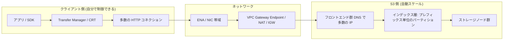
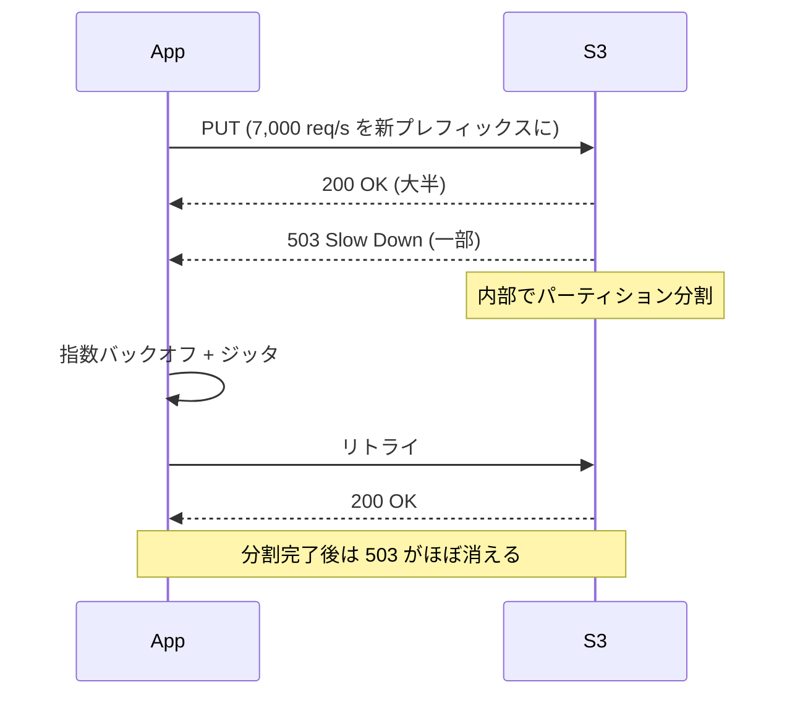
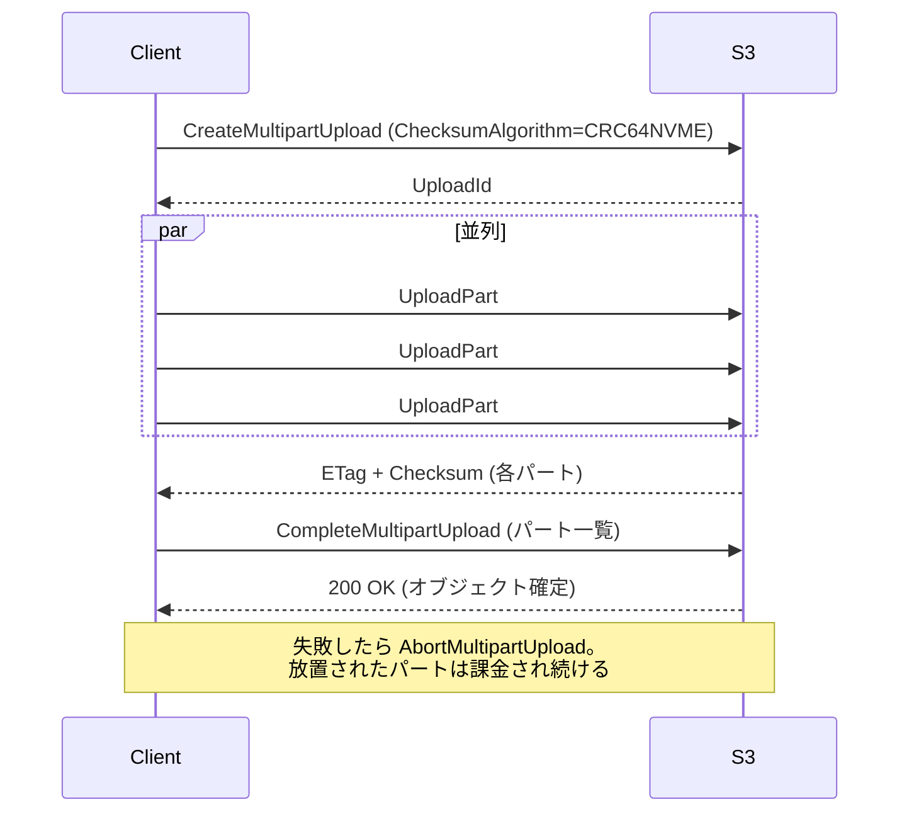
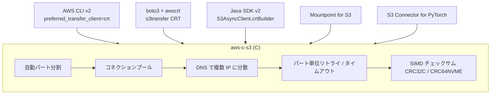
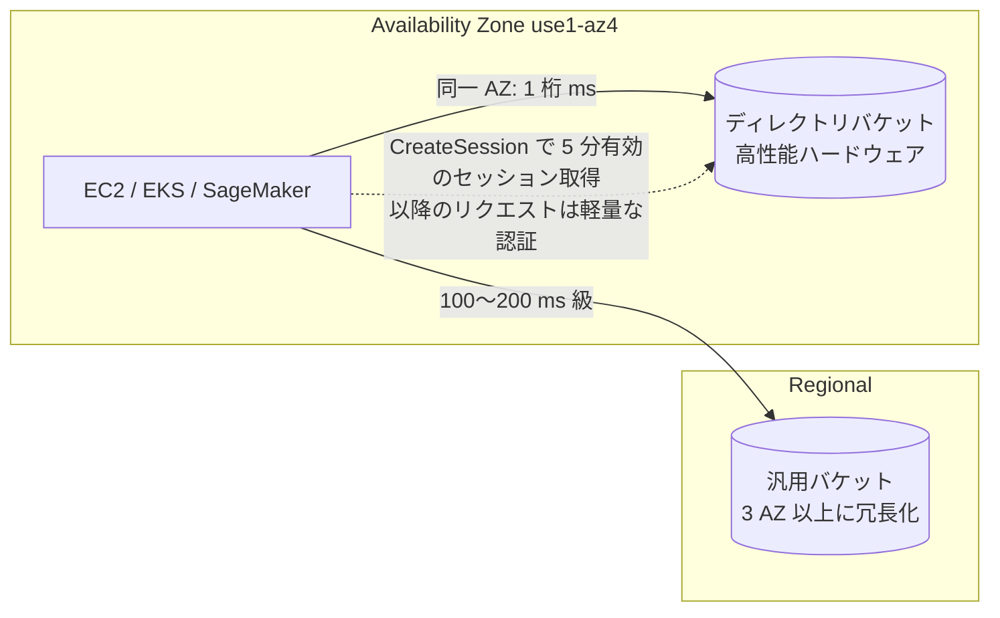
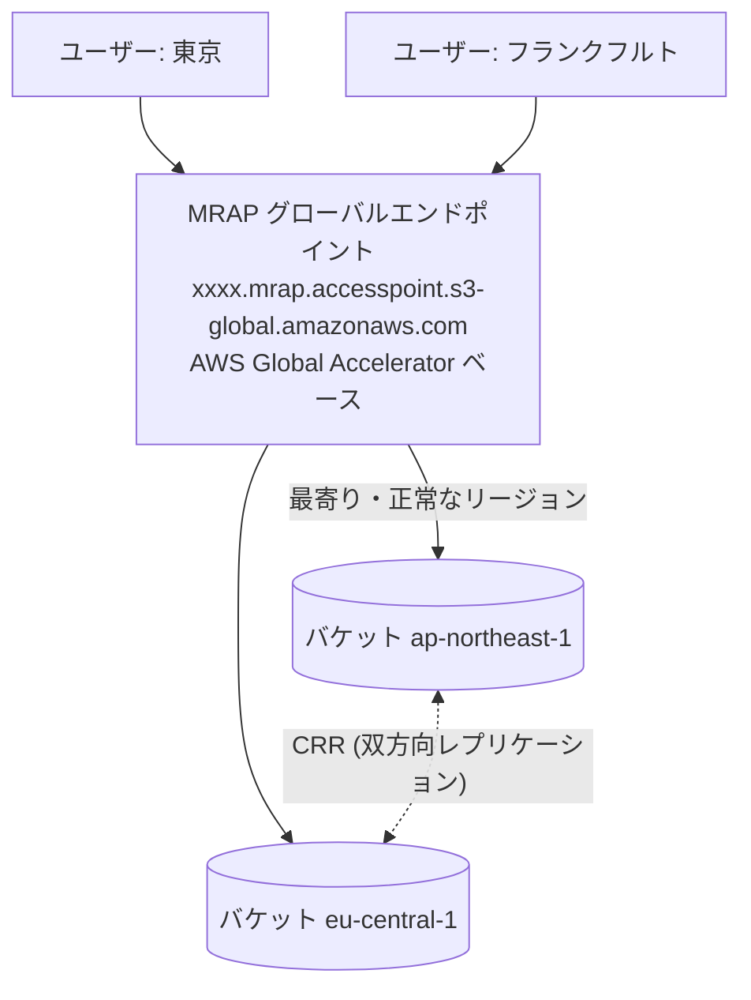

# S3 パフォーマンス完全ガイド

_最終確認: 2026-10-03_

S3 は「1 台の速いストレージ」じゃない。**巨大な分散システム**として扱うと、どこまでも速くなる。逆に「1 本の TCP コネクションで 1 つのキーを叩き続ける」みたいな使い方をすると、どれだけ良い EC2 を使っても遅い。この章では、リクエストレートの上限がどう決まるのか、503 SlowDown の正体、マルチパートと Range GET による並列化、CRT クライアント、Mountpoint、S3 Express One Zone、そして 100 Gbps を出すための設計までを一気に整理する。

## 0. まず全体像



パフォーマンスのボトルネックは大きく 4 つに分かれる。

| 層                                | 典型的な症状                                  | 主な対策                                                                    |
| --------------------------------- | --------------------------------------------- | --------------------------------------------------------------------------- |
| リクエストレート (インデックス層) | `503 Slow Down` が出る                        | プレフィックス分散、ゆっくりランプアップ、指数バックオフ                    |
| 単一コネクションのスループット    | 1 ファイルの転送が数十〜100 MB/s 付近で頭打ち | マルチパート、Range GET、並列コネクション                                   |
| クライアント資源                  | CPU 100%、メモリ不足、GC                      | CRT クライアント、チェックサム計算の最適化、インスタンス選定                |
| ネットワーク                      | NIC 帯域いっぱい、NAT GW 課金、レイテンシ     | Gateway Endpoint、同一リージョン配置、ENA Express 等、Transfer Acceleration |

## 1. リクエストレートとプレフィックス

### 1.1 公式の数字

AWS 公式ドキュメントの記述 (2026-10 時点) はこう。

- **パーティション化されたプレフィックスごとに**、少なくとも **3,500 PUT/COPY/POST/DELETE** と **5,500 GET/HEAD** リクエスト/秒
- バケット内のプレフィックス数に上限はない
- 10 プレフィックスに分ければ読み取りは 55,000 req/s まで伸ばせる (公式例)
- スケーリングは **段階的** であって即時ではない。スケール中は 503 Slow Down が返ることがある

ここで重要なのは「プレフィックス」という言葉の意味。S3 は「フォルダ」という概念を持たない。キーはただの文字列で、S3 の内部インデックスがキー空間を **辞書順のレンジ** で区切ってパーティションに割り当てる。トラフィックが増えると S3 が自動でパーティションを **分割** していく。ドキュメントで言う「partitioned prefix」とは、この内部パーティションの単位のことで、必ずしも `/` 区切りと一致しない。

```text
キー空間 (辞書順)
├─────────────── partition A ───────────────┤
logs/2026/10/01/...  logs/2026/10/02/...  logs/2026/10/03/...

負荷が上がると S3 が自動分割:
├── partition A1 ──┤├── partition A2 ──┤├── partition A3 ──┤
logs/2026/10/01/   logs/2026/10/02/    logs/2026/10/03/
   3,500 PUT/s        3,500 PUT/s         3,500 PUT/s
```

### 1.2 「ランダムハッシュ接頭辞」はもう不要? — 半分正解

2018 年 7 月に S3 はリクエストレート性能を大幅に引き上げ、「キー名の先頭をランダム化しろ」という旧ガイダンスを撤回した。それ以前は `a1b2/` みたいなハッシュ接頭辞が定番だった。

今でも覚えておくべきポイント:

1. **普通のワークロードではハッシュ不要**。S3 は自動分割するので、日付ベースのキーでも徐々に追従する。
2. **ただし分割は「後追い」**。新しいプレフィックスにいきなり数万 req/s をぶつけると、分割が追いつくまで 503 が出る。
3. **ホットスポットは常に「辞書順の端」に集中しがち**。`logs/2026-10-03T12:00:00` のように時刻が単調増加するキーに大量 PUT すると、常に最新レンジ (= 1 パーティション) に書き込みが集中する。
4. 公式の「高リクエストレートワークロード向け」設計パターンには今も「ランダム化またはシーケンシャルなプレフィックスパターンで複数パーティションに分散させる」という記述が残っている。

つまり **「ハッシュは必須ではないが、超高レートなら分散を設計しておくと 503 を避けやすい」** が正しい理解。

### 1.3 プレフィックス設計パターン

| パターン           | 例                             | 長所                                                           | 短所                                           |
| ------------------ | ------------------------------ | -------------------------------------------------------------- | ---------------------------------------------- |
| 日付階層           | `logs/2026/10/03/host-a.gz`    | Athena/Glue のパーティションと相性良い、ライフサイクルしやすい | 書き込みが最新日付に集中                       |
| 先頭にシャード番号 | `logs/shard=07/2026/10/03/...` | 書き込みを N 分割で並列化                                      | 読み取り側が N プレフィックスを走査            |
| 先頭に短いハッシュ | `a3f/2026/10/03/object.bin`    | 最大の分散                                                     | 人間に読めない、ListObjects でまとめて見にくい |
| テナント ID 先頭   | `tenant=123/...`               | マルチテナントで自然に分散                                     | 巨大テナントがホットスポット化                 |
| 逆順タイムスタンプ | `9999999999-epoch/...`         | 単調増加を回避                                                 | 可読性が落ちる                                 |

おすすめは「**分析しやすい階層を基本にして、書き込みレートが 1 プレフィックス 3,500 PUT/s を恒常的に超えそうなら、上位にシャード番号を足す**」。

### 1.4 ランプアップ戦略

新しいプレフィックスに大量のリクエストを流す場合、公式は次を推奨している。

- いきなりピークにせず **徐々に上げる** (S3 に先回りで分割させる)
- CloudWatch のリクエストメトリクス (`5xxErrors`) と Storage Lens の 503 エラー数を監視
- サーバーアクセスログで 503 のキー・プレフィックスを特定 (2026-06 以降は CloudWatch Logs / S3 Tables に直接配信可能)

## 2. 503 Slow Down とリトライ

### 2.1 503 の意味

`503 Slow Down` は「S3 が壊れた」ではなく「**このパーティションはまだそのレートに最適化されていない**」という信号。正しくリトライすればいずれ消える。



### 2.2 SDK のリトライモード

AWS SDK と CLI には 3 つのリトライモードがある。

| モード     | 挙動                                                                           | デフォルト最大試行 |
| ---------- | ------------------------------------------------------------------------------ | ------------------ |
| `legacy`   | 旧来の SDK ごとの実装                                                          | SDK により異なる   |
| `standard` | 指数バックオフ + ジッタ、リトライクォータ (トークンバケット)                   | 3 回               |
| `adaptive` | standard + クライアント側レート制限 (スロットリング検知で送信レート自体を絞る) | 3 回               |

```bash
# ~/.aws/config に設定
aws configure set retry_mode standard
aws configure set max_attempts 10

# 環境変数でも可
export AWS_RETRY_MODE=adaptive
export AWS_MAX_ATTEMPTS=10
```

注意: CLI の CRT 転送クライアントは `max_attempts` を 2〜64 の範囲でのみ尊重し、`retry_mode = adaptive` だと (CRT 最適化対象インスタンス以外では) classic クライアントにフォールバックする (`aws help s3-config` で確認)。

### 2.3 レイテンシ重視のリトライ (テールレイテンシ対策)

公式設計パターンに具体的な数字がある。

- 128 MB を超えるような大きくて可変サイズのリクエスト: 実効スループットを追跡し、**遅い方から 5%** をリトライ
- 512 KB 未満の小さいリクエスト (中央値が数十 ms): **2 秒** 経ったら GET/PUT をリトライ、さらに必要なら 4 秒後にもう 1 回
- 固定サイズのリクエスト: **遅い方の 1%** をリトライするだけでも効く
- リトライするときは **新しいコネクション** を使い、**DNS を引き直す** (別のフロントエンドに当たる確率を上げる)

```python
# 低レイテンシ用 boto3 設定例
import boto3
from botocore.config import Config

cfg = Config(
    retries={"mode": "standard", "max_attempts": 5},
    connect_timeout=1,
    read_timeout=2,          # 小オブジェクト前提。大きなオブジェクトでは伸ばす
    max_pool_connections=128,
    tcp_keepalive=True,
)
s3 = boto3.client("s3", config=cfg)
```

### 2.4 503 以外の「遅い」原因

| 症状                             | 原因                                | 対処                                                                         |
| -------------------------------- | ----------------------------------- | ---------------------------------------------------------------------------- |
| SSE-KMS で `ThrottlingException` | KMS のリクエストクォータ            | **S3 Bucket Key** を有効化 (KMS 呼び出しを大幅削減)                          |
| 毎回 TLS ハンドシェイクが遅い    | コネクション再利用していない        | HTTP コネクションプール、Keep-Alive                                          |
| 単一 IP に集中                   | DNS キャッシュ、IP 固定             | 定期的に DNS を引き直す、CRT は自動で複数 IP に分散                          |
| `ListObjectsV2` が遅い           | 1 ページ 1,000 キー、逐次ページング | プレフィックスごとに並列 List、S3 Inventory / S3 Metadata テーブルに置き換え |

## 3. マルチパートアップロード

### 3.1 仕様 (2026-10 時点)

2025 年 12 月 (re:Invent 2025) に **最大オブジェクトサイズが 5 TB → 50 TB** に引き上げられた。User Guide の表記は以下。

| 項目                                  | 値                                    |
| ------------------------------------- | ------------------------------------- |
| 最大オブジェクトサイズ                | 48.8 TiB (= 約 50 TB)                 |
| 1 回の PUT で上げられる最大サイズ     | 5 GB (それ以上はマルチパート必須)     |
| パート数上限                          | 10,000                                |
| パート番号                            | 1〜10,000                             |
| パートサイズ                          | 5 MiB〜5 GiB (最後のパートは下限なし) |
| ListParts 1 回の最大返却数            | 1,000                                 |
| ListMultipartUploads 1 回の最大返却数 | 1,000                                 |
| 推奨                                  | 100 MB を超えたらマルチパートを検討   |

計算: 10,000 パート × 5 GiB = 48.8 TiB。つまり 50 TB 級のオブジェクトを作るには **パートサイズをほぼ最大の 5 GiB** にする必要がある。

### 3.2 フロー



ポイント:

- パートはどの順番でも、どのホストからでも、並列にアップロードできる
- 失敗したパートだけ再送すればよい (大きなファイルの耐障害性が上がる)
- **未完了のマルチパートアップロードのパートは保存料金がかかる**。ライフサイクルルール `AbortIncompleteMultipartUpload` (例: 7 日) は全バケットの定番設定
- 完了後の ETag は MD5 ではなく `<パートMD5連結のMD5>-<パート数>` 形式

### 3.3 パートサイズとチャンクサイズの選び方

| オブジェクトサイズ | パートサイズの目安          | 理由                                                                                   |
| ------------------ | --------------------------- | -------------------------------------------------------------------------------------- |
| 〜100 MB           | 単一 PUT か 8〜16 MiB       | オーバーヘッドが小さい                                                                 |
| 100 MB〜10 GB      | 8〜64 MiB                   | 並列度とリクエスト数のバランス (8 MiB × 10,000 ≒ 78 GiB)                               |
| 10 GB〜600 GiB     | 64〜256 MiB                 | 64 MiB × 10,000 = 625 GiB に収まる                                                     |
| 600 GiB〜4.8 TiB   | 512 MiB〜1 GiB              | 512 MiB × 10,000 = 5,000 GiB ≒ 4.88 TiB に収まる                                       |
| 4.8 TiB〜48.8 TiB  | `ceil(size / 10000)`〜5 GiB | 1 GiB × 10,000 ≒ 9.77 TiB、5 GiB × 10,000 ≒ 48.8 TiB。48.8 TiB ちょうどなら 5 GiB 必須 |

最小パートサイズは `ceil(object_size / 10000)`。例: 1 TiB なら 1,048,576 MiB / 10,000 ≒ 105 MiB 以上が必要で、64 MiB では 10,000 パートを超える。CLI はパート数が上限を超えそうなら `multipart_chunksize` を自動調整する。

### 3.4 チェックサムとマルチパート

2024 年 12 月以降、最新 SDK はデフォルトで CRC ベースのチェックサムを計算・送信し、S3 が検証する。デフォルトアルゴリズムは **CRC64NVME**。2026 年 4 月には MD5、XXHash3、XXHash64、XXHash128、SHA-512 が追加され、合計 10 アルゴリズムになった。

| 方式          | 説明                                                              | 対応アルゴリズム                            |
| ------------- | ----------------------------------------------------------------- | ------------------------------------------- |
| `FULL_OBJECT` | オブジェクト全体のチェックサム。パートの CRC を数学的に合成できる | CRC64NVME (常に full object)、CRC32、CRC32C |
| `COMPOSITE`   | パートごとのチェックサムのチェックサム。`xxxx-N` の形             | SHA-1、SHA-256、CRC32、CRC32C など          |

```bash
# マルチパート開始時にアルゴリズムと型を指定
aws s3api create-multipart-upload \
  --bucket amzn-s3-demo-bucket --key big.bin \
  --checksum-algorithm CRC64NVME --checksum-type FULL_OBJECT
```

CRC 系は CPU 負荷が低く、ハードウェア支援 (CRC32C は SSE4.2、CRC64NVME も CRT が SIMD 実装) が効くので、高スループット環境でも SHA-256 よりずっと軽い。

## 4. Byte-Range GET と並列ダウンロード

### 4.1 基本

`Range` ヘッダーでオブジェクトの一部分だけ取得できる。

```bash
# 先頭 1 MiB だけ
aws s3api get-object --bucket amzn-s3-demo-bucket --key big.bin \
  --range bytes=0-1048575 part0.bin

# マルチパートの第 3 パートだけ (パート境界にそろうので最速)
aws s3api get-object --bucket amzn-s3-demo-bucket --key big.bin \
  --part-number 3 part3.bin
```

公式ガイダンス:

- 並列コネクションで異なるレンジを同時取得すると、単一 GET より高い集約スループットになる
- マルチパートで上げたオブジェクトは **同じパートサイズ (パート境界)** で GET するのが最良
- 小さいレンジに分けるとリトライ時の再送量も小さくなる
- 旧ホワイトペーパーでは「8〜16 MB のレンジで並列 GET」が推奨されていた

### 4.2 Range GET が効く場面

| 用途                       | 効き方                                                       |
| -------------------------- | ------------------------------------------------------------ |
| 巨大ファイルのダウンロード | 並列化でスループットを NIC 上限まで                          |
| Parquet / ORC の分析       | フッター (メタデータ) だけ先に読み、必要な列チャンクだけ取得 |
| 動画のシーク               | 再生位置のバイトだけ取得                                     |
| ZIP / tar の中身の一部     | セントラルディレクトリだけ読む                               |
| ML のランダムアクセス      | シャードファイル内の 1 サンプルだけ取る                      |

## 5. 1 コネクションあたりのスループットと 100 Gbps への道

### 5.1 目安の数字

| 指標                                     | 値                                                                                                    | 出典・注意                           |
| ---------------------------------------- | ----------------------------------------------------------------------------------------------------- | ------------------------------------ |
| 1 コネクションのスループット             | 約 85〜90 MB/s (旧ホワイトペーパー)、re:Invent 2025 の講演では「1 コネクション約 100 MB/s」という概数 | 経験則であって SLA ではない          |
| 10 Gbps NIC を埋めるのに必要な並列数     | 約 15 リクエスト                                                                                      | 1,250 MB/s ÷ 85 MB/s                 |
| 単一 EC2 インスタンスの到達点            | 最大 100 Gb/s (公式 User Guide)                                                                       | 実際は 200 Gbps 級インスタンスもある |
| 小オブジェクトのレイテンシ (S3 Standard) | おおむね 100〜200 ms (公式)                                                                           | first-byte latency を含む            |
| S3 Express One Zone のレイテンシ         | 一貫した 1 桁 ms                                                                                      | 同一 AZ からアクセス時               |

計算式:

```text
必要並列数 ≈ 目標スループット(MB/s) / 1 コネクションあたり(≈85〜100 MB/s)

  10 Gbps  = 1,250 MB/s   → 約 13〜15 並列
  25 Gbps  = 3,125 MB/s   → 約 32〜37 並列
 100 Gbps  = 12,500 MB/s  → 約 125〜150 並列
 200 Gbps  = 25,000 MB/s  → 約 250〜300 並列
```

### 5.2 100 Gbps を出すためのチェックリスト

1. **ネットワーク帯域の大きいインスタンスを選ぶ** (例: c6in/c7gn/c8gn/m6in/p5 系など。インスタンスタイプごとの帯域は EC2 ドキュメントで確認)
2. **同一リージョン** に置く (クロスリージョンはレイテンシとデータ転送料金の両方で不利)
3. **VPC Gateway Endpoint** 経由にする (NAT Gateway を通すと NAT のスループット上限と処理料金がかかる)
4. **CRT ベースのクライアント** を使う (自動並列化、複数 IP への分散、パート単位のリトライ)
5. **ローカルディスクがボトルネックにならないか確認** (EBS gp3 のスループット上限、インスタンスストア NVMe の活用、またはメモリ上で処理)
6. **チェックサムは CRC 系** にする (SHA-256 は CPU を食う)
7. **ストリーム処理**: ダウンロードしたものをディスクに書かず、そのままパイプラインで処理すれば I/O を 1 つ減らせる
8. **単一インスタンスで頭打ちなら水平スケール** (Spark / Ray / Batch でインスタンスを並べてテラビット級)

### 5.3 EC2 ネットワークの注意点

| 項目                             | 内容                                                                                                                              |
| -------------------------------- | --------------------------------------------------------------------------------------------------------------------------------- |
| ENA                              | 全現行インスタンスで必須の拡張ネットワーキング。ドライバを最新に                                                                  |
| フロー単位の上限                 | EC2 では **1 フロー (5-tuple) あたりの帯域に上限** がある (同一 placement group 外では 5 Gbps 程度)。だから並列コネクションが必須 |
| バースト帯域                     | 小さいインスタンスの「最大 X Gbps」はバースト値。持続値はもっと低い                                                               |
| NAT Gateway                      | 1 つの NAT GW にも帯域上限あり。S3 なら Gateway Endpoint 一択                                                                     |
| Interface Endpoint (PrivateLink) | オンプレや他リージョンからのプライベートアクセス向け。時間・データ処理課金あり                                                    |
| DNS                              | S3 は DNS で大量の IP を返す。単一 IP をキャッシュし続けると負荷分散されない                                                      |

## 6. CRT ベースのクライアント

### 6.1 AWS Common Runtime (CRT) とは

AWS CRT は C で書かれた共通ライブラリ群 (`aws-c-s3`、`aws-c-http`、`aws-checksums` など)。S3 クライアントは **自動でマルチパート/Range GET に分割し、多数のコネクションを複数の S3 IP に分散し、パート単位でリトライ** する。Python・Java・CLI・Mountpoint・PyTorch Connector などがこれを共有している。



### 6.2 AWS CLI

```bash
# CRT を強制
aws configure set default.s3.preferred_transfer_client crt
# CRT 使用時のみ有効な目標帯域
aws configure set default.s3.target_bandwidth 100Gb/s

# classic に戻す
aws configure set default.s3.preferred_transfer_client classic
```

`aws help s3-config` (CLI v2.37 時点) による `auto` の判定条件:

- S3→S3 コピーではない (CRT はアップロード、ダウンロード、削除のみ)
- Linux の EC2 上で、CRT 最適化対象インスタンスタイプ (p4d.24xlarge、p5.48xlarge、p5en.48xlarge、p6-b200.48xlarge、trn1.32xlarge など) または対象ファミリー (c6i、c7g、c8g、m7i、r7i など多数) である
- 他に CRT を使っている CLI プロセスがない

それ以外は classic (Python 実装) に解決される。確実に CRT を使いたいなら `crt` を明示する。

### 6.3 boto3 (s3transfer の CRT 統合)

```bash
pip install "boto3[crt]"
```

```python
import boto3
from boto3.s3.transfer import TransferConfig

s3 = boto3.client("s3")
cfg = TransferConfig(preferred_transfer_client="crt")  # auto | classic | crt
s3.upload_file("/data/big.bin", "amzn-s3-demo-bucket", "big.bin", Config=cfg)
s3.download_file("amzn-s3-demo-bucket", "big.bin", "/data/big.copy", Config=cfg)
```

注意: CRT 使用時は `TransferConfig` の多くの値 (`max_concurrency`、`io_chunksize`、`use_threads`、`max_bandwidth` 等) が無視され、プロセス全体で帯域を自動配分する。プロセスあたり CRT クライアントは 1 つ (ロックで制御)。

### 6.4 Java SDK v2

```java
import software.amazon.awssdk.services.s3.S3AsyncClient;
import software.amazon.awssdk.transfer.s3.S3TransferManager;
import software.amazon.awssdk.transfer.s3.model.UploadFileRequest;
import java.nio.file.Paths;

S3AsyncClient s3 = S3AsyncClient.crtBuilder()
        .targetThroughputInGbps(50.0)
        .minimumPartSizeInBytes(16L * 1024 * 1024)
        .build();

S3TransferManager tm = S3TransferManager.builder().s3Client(s3).build();

tm.uploadFile(UploadFileRequest.builder()
        .putObjectRequest(b -> b.bucket("amzn-s3-demo-bucket").key("big.bin"))
        .source(Paths.get("/data/big.bin"))
        .build())
  .completionFuture().join();
```

### 6.5 Go SDK v2

Go は CRT ではなく純 Go 実装。2026 年 1 月 30 日に `feature/s3/transfermanager` が GA になり、旧 `feature/s3/manager` は deprecated。詳細は [07-cli-cookbook](07-cli-cookbook.md) の SDK 節を参照。

## 7. Mountpoint for Amazon S3

### 7.1 何者か

Mountpoint は CRT の上に作られた **オープンソースの FUSE ファイルクライアント** (Rust 製)。S3 バケットをローカルディレクトリとしてマウントし、`open`/`read` を S3 の GET (Range) に変換する。2026-10 時点の最新リリースは `mountpoint-s3-1.24.0` (GitHub で確認)。

```bash
# インストール (Amazon Linux / RHEL 系, x86_64)
wget https://s3.amazonaws.com/mountpoint-s3-release/latest/x86_64/mount-s3.rpm
sudo yum install -y ./mount-s3.rpm

mkdir -p ~/mnt
mount-s3 amzn-s3-demo-bucket ~/mnt
# アンマウント
umount ~/mnt
```

### 7.2 セマンティクス (POSIX 完全互換ではない)

Mountpoint の設計原則は「**S3 のオブジェクト API で効率的に実装できないファイル操作はサポートしない**」。

| 操作                               | 汎用バケット                                               | ディレクトリバケット (Express One Zone)                      |
| ---------------------------------- | ---------------------------------------------------------- | ------------------------------------------------------------ |
| 読み取り (シーケンシャル/ランダム) | ○                                                          | ○                                                            |
| 新規ファイル作成                   | ○ (先頭からシーケンシャル書き込みのみ)                     | ○                                                            |
| 既存ファイル上書き                 | `--allow-overwrite` + `O_TRUNC` のときのみ                 | 同左                                                         |
| 追記 (append)                      | ×                                                          | `--incremental-upload` で可 (末尾へのシーケンシャル書き込み) |
| ファイル rename                    | ×                                                          | ○ (RenameObject による原子的 rename)                         |
| ディレクトリ rename                | ×                                                          | ×                                                            |
| 削除                               | `--allow-delete` 指定時のみ                                | 同左                                                         |
| chmod/chown/シンボリックリンク     | × (`--uid`/`--gid`/`--file-mode` でマウント全体に一律設定) | ×                                                            |
| ランダム書き込み                   | ×                                                          | ×                                                            |

整合性: 新規アップロードは原子的で、`close` (または `fsync`) が成功した時点で他クライアントから全体が見える。`--incremental-upload` の場合は部分的な書き込みも途中で見える。

### 7.3 キャッシュ

```bash
# ローカルディスクキャッシュ (インスタンスストア推奨)
mount-s3 amzn-s3-demo-bucket ~/mnt \
  --cache /mnt/nvme/mp-cache --max-cache-size 102400 \
  --metadata-ttl 300

# 複数インスタンスで共有するキャッシュを Express One Zone に置く
mount-s3 amzn-s3-demo-bucket ~/mnt \
  --cache-xz amzn-s3-demo-bucket--usw2-az1--x-s3

# 中身が変わらない学習データなら最大限キャッシュ
mount-s3 amzn-s3-demo-bucket ~/mnt --cache /mnt/nvme/c --metadata-ttl indefinite
```

| フラグ                                     | 意味                                                                                        |
| ------------------------------------------ | ------------------------------------------------------------------------------------------- |
| `--metadata-ttl <秒\|minimal\|indefinite>` | メタデータ (存在、サイズ、ETag) のキャッシュ TTL。デフォルトは `minimal` (キャッシュ無効時) |
| `--cache <DIR>`                            | オブジェクト内容のローカルキャッシュ。有効にするとメタデータ TTL は既定 60 秒               |
| `--max-cache-size <MiB>`                   | ローカルキャッシュの上限                                                                    |
| `--cache-xz <directory-bucket>`            | Express One Zone の共有キャッシュ (小オブジェクトを多数インスタンスから繰り返し読む場合)    |
| `--maximum-throughput-gbps`                | 目標帯域。EC2 では既定でインスタンス帯域、それ以外は 10 Gbps                                |
| `--max-threads`                            | 同時ファイル操作数 (既定 16)                                                                |
| `--read-part-size` / `--write-part-size`   | パートサイズ (既定 8 MiB)。書き込み最大サイズは 10,000 × write-part-size。既定だと約 78 GiB |

共有キャッシュ (`--cache-xz`) は Mountpoint がキャッシュを削除しないので、ディレクトリバケットに **ライフサイクルの有効期限ルール** を必ず付ける。

### 7.4 Mountpoint と S3 Files の使い分け

2026 年 4 月に **Amazon S3 Files** (EFS ベースで S3 バケットをフル機能のファイルシステムとして見せるマネージドサービス) が GA した。詳しくは [06-new-frontiers](06-new-frontiers.md)。

| 観点           | Mountpoint                                                | S3 Files                                                               |
| -------------- | --------------------------------------------------------- | ---------------------------------------------------------------------- |
| 形態           | クライアント側 FUSE (OSS、無料)                           | マネージドなネットワークファイルシステム (有料)                        |
| POSIX 互換     | 限定的 (rename・ランダム書き込み不可)                     | フルのファイルシステムセマンティクス                                   |
| 向いている用途 | 大規模シーケンシャル読み取り、ML 学習データ、読み取り中心 | 既存のファイルベースアプリ、共有書き込み、エージェントのワークスペース |
| 書き戻し       | `close` 時に直接 S3 へ                                    | EFS キャッシュに溜めてまとめて S3 にコミット                           |

## 8. その他のコネクタ

### 8.1 Mountpoint for Amazon S3 CSI Driver

EKS で Pod に S3 を PersistentVolume としてマウントするための CSI ドライバ。Mountpoint を中で使う。EKS アドオンとして入る。

### 8.2 Amazon S3 Connector for PyTorch

```bash
pip install s3torchconnector
```

```python
from s3torchconnector import S3MapDataset, S3IterableDataset, S3Checkpoint
import torch

REGION = "us-east-1"
URI = "s3://amzn-s3-demo-bucket/train/"

# ランダムアクセス (map-style)
ds = S3MapDataset.from_prefix(URI, region=REGION)
# シーケンシャル (iterable-style; シャード化された大ファイル向け)
it = S3IterableDataset.from_prefix(URI, region=REGION)

# チェックポイントを S3 に直接保存/ロード
ckpt = S3Checkpoint(region=REGION)
with ckpt.writer("s3://amzn-s3-demo-bucket/ckpt/epoch1.pt") as w:
    torch.save({"step": 1}, w)
with ckpt.reader("s3://amzn-s3-demo-bucket/ckpt/epoch1.pt") as r:
    state = torch.load(r)
```

CRT を使うので素の boto3 で 1 サンプルずつ GET するよりはるかに速い。PyTorch Lightning 用の checkpoint IO や、Distributed Checkpoint (DCP) 統合も提供されている。

### 8.3 Hadoop S3A (Spark / Hive / Trino)

S3A は Apache Hadoop の S3 コネクタ (`s3a://`)。EMR では EMRFS (`s3://`) が既定。S3A のよく触るパラメータ:

| プロパティ                          | 意味                                                                   |
| ----------------------------------- | ---------------------------------------------------------------------- |
| `fs.s3a.connection.maximum`         | HTTP コネクションプール上限。並列度に合わせて増やす                    |
| `fs.s3a.threads.max`                | アップロード等のスレッド数                                             |
| `fs.s3a.multipart.size`             | マルチパートのパートサイズ                                             |
| `fs.s3a.fast.upload.buffer`         | `disk` / `array` / `bytebuffer`                                        |
| `fs.s3a.experimental.input.fadvise` | `random` (Parquet/ORC) / `sequential` / `normal`                       |
| `fs.s3a.committer.name`             | `magic` / `directory` / `partitioned` (rename を使わない S3A コミッタ) |

S3 の「rename は copy + delete」という性質のため、Hadoop の昔ながらの「一時ディレクトリに書いて rename でコミット」は遅く危険。**S3A コミッタ** (または Iceberg のようなテーブルフォーマット) を使う。

AWS は 2024 年 12 月に **Analytics Accelerator Library for Amazon S3** (Parquet 読み取りの先読み・キャッシュ最適化を行う Java ライブラリ) を発表した。S3A への初期統合は Hadoop 3.4.2 (2025-08-29 リリース) に入っており (HADOOP-19348)、`fs.s3a.input.stream.type=analytics` で有効化する。既定値は `classic` のままで、Hadoop のドキュメントでは `analytics` は「stabilization」段階と位置づけられ、追加ライブラリが必要。

### 8.4 s3fs という名前の 2 つのもの

| 名前          | 実体                                                    | 用途                                                                           |
| ------------- | ------------------------------------------------------- | ------------------------------------------------------------------------------ |
| `s3fs-fuse`   | C++ 製の FUSE ファイルシステム                          | 古くからある POSIX 寄りマウント。Mountpoint より遅いが rename 等をエミュレート |
| Python `s3fs` | fsspec ベースの Python ライブラリ (`s3fs.S3FileSystem`) | pandas / Dask / xarray で `s3://` を開く                                       |

```python
import pandas as pd
df = pd.read_parquet("s3://amzn-s3-demo-bucket/data/part-0000.parquet")  # 内部で s3fs を使う
```

## 9. Transfer Acceleration

CloudFront のエッジロケーションでデータを受け、AWS バックボーン経由でバケットのリージョンまで運ぶ機能。大陸をまたぐアップロードで効く。

```bash
# 有効化
aws s3api put-bucket-accelerate-configuration \
  --bucket amzn-s3-demo-bucket \
  --accelerate-configuration Status=Enabled

# CLI で accelerate エンドポイントを使う
aws configure set default.s3.use_accelerate_endpoint true
aws s3 cp big.bin s3://amzn-s3-demo-bucket/

# 単発なら --endpoint-url
aws s3 cp big.bin s3://amzn-s3-demo-bucket/ \
  --endpoint-url https://s3-accelerate.amazonaws.com
```

| 項目           | 内容                                                                                             |
| -------------- | ------------------------------------------------------------------------------------------------ |
| エンドポイント | `bucket.s3-accelerate.amazonaws.com` (デュアルスタック: `s3-accelerate.dualstack.amazonaws.com`) |
| 制約           | バケット名にドット不可 (DNS 互換)、有効化後の反映に最大 30 分程度                                |
| 料金           | 通常の転送料金に加算。高速化されなかった転送には加算料金なし                                     |
| 向く           | 遠隔地からの大きいファイルの定期アップロード、世界中からの集中アップロード                       |
| 向かない       | 同一リージョンの EC2 から、小さいファイル大量                                                    |

速度比較ツール (Speed Comparison tool) で事前に効果を測れる。

## 10. CloudFront を S3 の前に置く (OAC)

### 10.1 なぜ

- 頻繁に読まれる「ワーキングセット」をエッジにキャッシュ → レイテンシ低下、S3 の GET 回数・料金削減
- S3 から CloudFront へのデータ転送は無料 (CloudFront からインターネットへの転送は課金)
- 単一 HTTP コネクションでより高い転送レートが欲しいときにも有効 (公式ガイダンス)

### 10.2 OAC (Origin Access Control)

旧 OAI (Origin Access Identity) の後継。SigV4 で署名して S3 にアクセスするので、**SSE-KMS で暗号化されたオブジェクト**、全リージョン、PUT/DELETE などもサポートする。バケットはパブリックにせず、Block Public Access を有効にしたままでよい。

```json
{
  "Version": "2012-10-17",
  "Statement": [
    {
      "Sid": "AllowCloudFrontServicePrincipalReadOnly",
      "Effect": "Allow",
      "Principal": { "Service": "cloudfront.amazonaws.com" },
      "Action": "s3:GetObject",
      "Resource": "arn:aws:s3:::amzn-s3-demo-bucket/*",
      "Condition": {
        "StringEquals": {
          "AWS:SourceArn": "arn:aws:cloudfront::111122223333:distribution/EDFDVBD6EXAMPLE"
        }
      }
    }
  ]
}
```

SSE-KMS を使う場合は、KMS キーポリシーにも `cloudfront.amazonaws.com` に `kms:Decrypt` を許可する必要がある。

## 11. S3 Express One Zone (性能の観点)

### 11.1 要点

| 項目         | 値 / 内容                                                                                                                             |
| ------------ | ------------------------------------------------------------------------------------------------------------------------------------- |
| 発表         | re:Invent 2023                                                                                                                        |
| レイテンシ   | 一貫した 1 桁 ms (S3 Standard より最大 10 倍速い)                                                                                     |
| 冗長性       | 単一 AZ (AZ を自分で選ぶ。コンピュートと同一 AZ に置く)                                                                               |
| バケット種別 | **ディレクトリバケット** (`name--usw2-az1--x-s3` 形式の名前)                                                                          |
| TPS          | ディレクトリバケットあたり最大 200 万 GET/s、20 万 PUT/s。**既定は 20 万 read/s、10 万 write/s** で、それ以上はサポートに上限緩和申請 |
| 認証         | `CreateSession` によるセッションベース認証 (一時クレデンシャルは 5 分で失効、SDK が自動更新)                                          |
| 追記         | 既存オブジェクト末尾への append (2024 年 11 月〜。`--write-offset-bytes`)                                                             |
| rename       | `RenameObject` で原子的 rename (2025 年 6 月〜)                                                                                       |
| リージョン   | 2026 年 9 月に 7 リージョン追加で計 15 リージョン                                                                                     |

### 11.2 2025 年 4 月の値下げ (us-east-1)

AWS News Blog で 2025 年 4 月 10 日から有効と発表。

| 項目                    | 旧                    | 新       | 値下げ率 |
| ----------------------- | --------------------- | -------- | -------- |
| ストレージ (GB-月)      | $0.16                 | $0.11    | 31%      |
| PUT (1,000 リクエスト)  | $0.0025 (512 KB まで) | $0.00113 | 55%      |
| GET (1,000 リクエスト)  | $0.0002 (512 KB まで) | $0.00003 | 85%      |
| データアップロード (GB) | $0.008                | $0.0032  | 60%      |
| データ取得 (GB)         | $0.0015               | $0.0006  | 60%      |

あわせて、転送量課金は「512 KB を超えた部分だけ」ではなく **全バイト** に適用されるように変わった。

### 11.3 なぜ速いのか



- **同一 AZ 配置**: AZ 間ホップを消す
- **セッション認証**: リクエストごとの IAM 認可の重さを、セッション作成時にまとめて払う
- **ディレクトリ構造**: 汎用バケットのフラットなキー空間と違い、本物の階層 (ディレクトリ) を持つ。`ListObjectsV2` は辞書順でソートされない、プレフィックスは `/` 終端が必要などの差異がある
- **専用ハードウェア**: 高性能メディアに保存

### 11.4 ディレクトリバケットの操作

```bash
# 作成 (AZ ID を指定)
aws s3api create-bucket \
  --bucket amzn-s3-demo-bucket--usw2-az1--x-s3 \
  --region us-west-2 \
  --create-bucket-configuration \
  'Location={Type=AvailabilityZone,Name=usw2-az1},Bucket={DataRedundancy=SingleAvailabilityZone,Type=Directory}'

# 一覧
aws s3api list-directory-buckets --region us-west-2

# 普通の aws s3 コマンドがそのまま使える (セッションは CLI が自動管理)
aws s3 cp ./shard-0001.tar s3://amzn-s3-demo-bucket--usw2-az1--x-s3/train/

# 明示的にセッションを作る (デバッグ用)
aws s3api create-session --bucket amzn-s3-demo-bucket--usw2-az1--x-s3
```

使いどころ: ML 学習のデータローダー、Spark/Trino のシャッフルや中間データ、Mountpoint の共有キャッシュ、低レイテンシなキャッシュ層 (検索エンジンの KV キャッシュ等)、ログの append。

注意点: 単一 AZ なので **AZ 障害で一時的に読めなくなる / 物理的破壊で失われうる**。正本は汎用バケット (S3 Standard 等) に置き、Express One Zone は「速い作業領域」として使うのが基本。2025 年 8 月から AWS FIS で AZ 障害時の挙動をテストできる。

## 12. Multi-Region Access Points (MRAP) のルーティング



| 項目             | 内容                                                                                |
| ---------------- | ----------------------------------------------------------------------------------- |
| ルーティング     | 近接性ベース。AWS グローバルネットワーク上を通る                                    |
| フェイルオーバー | active-active または active-passive。フェイルオーバー制御で手動切り替え可能         |
| 署名             | **SigV4A** (マルチリージョン署名) が必要。SDK は CRT 依存のことが多い               |
| データ整合       | MRAP 自体は複製しない。**レプリケーションを別途設定** (RTC で 15 分以内の SLA も可) |
| 料金             | データルーティング料金 + (インターネット経由なら) 高速化料金                        |

性能面では「世界中のクライアントからのアクセスを最寄りリージョンに寄せる」ことでレイテンシを下げられる。書き込みが複数リージョンに入るとレプリケーション遅延の間は不整合になりうる点に注意。

## 13. ベンチマークツール

| ツール             | 特徴                                                              | 例                                                                                                    |
| ------------------ | ----------------------------------------------------------------- | ----------------------------------------------------------------------------------------------------- |
| `warp` (MinIO)     | S3 互換ベンチマーク。GET/PUT/mixed/list などのシナリオ、分散実行  | `warp get --host s3.us-east-1.amazonaws.com --tls --bucket b --obj.size 64MiB --concurrent 64`        |
| `s5cmd`            | Go 製の超高速 CLI。並列 `cp`/`rm`、ワイルドカード                 | `s5cmd --numworkers 256 cp 's3://b/data/*' /mnt/nvme/`                                                |
| `elbencho`         | 分散ストレージベンチ。ファイル・ブロック・S3 を同じツールで測れる | `elbencho --s3endpoints https://s3.us-east-1.amazonaws.com --s3key ... -w -t 32 -n 0 -N 100 -s 64M b` |
| AWS CLI + CRT      | 実運用に近い比較                                                  | `time aws s3 cp s3://b/50G.bin /dev/null`                                                             |
| `fio` + Mountpoint | ファイル I/O として測定                                           | `fio --filename=~/mnt/x --rw=read --bs=1M --numjobs=16`                                               |

ベンチマークの鉄則:

1. 1 リクエストから始めて、並列数を倍々にしながら NIC / CPU / ディスクのどれが先に飽和するか見る (公式推奨の手順)
2. **ディスク書き込みを外す** (`/dev/null` や tmpfs へ) と、ネットワーク単体の性能が分かる
3. ウォームアップを入れる (新プレフィックスは 503 が出うる)
4. 料金に注意 (GET/PUT 料金、転送料金)。小オブジェクトで秒間数万 PUT は普通に課金が積み上がる

warp の例:

```bash
# 64 並列で 16 MiB オブジェクトの PUT を 2 分間
warp put \
  --host s3.us-east-1.amazonaws.com --tls --region us-east-1 \
  --access-key "$AWS_ACCESS_KEY_ID" --secret-key "$AWS_SECRET_ACCESS_KEY" \
  --bucket amzn-s3-demo-bench --obj.size 16MiB --concurrent 64 --duration 2m
```

s5cmd の例:

```bash
# 100 万オブジェクトの並列コピー
s5cmd --numworkers 512 cp 's3://amzn-s3-demo-src/prefix/*' 's3://amzn-s3-demo-dst/prefix/'

# コマンドファイルでバッチ実行
cat > cmds.txt <<'EOF'
cp s3://amzn-s3-demo-bucket/a.bin /mnt/nvme/a.bin
cp s3://amzn-s3-demo-bucket/b.bin /mnt/nvme/b.bin
EOF
s5cmd run cmds.txt
```

## 14. 観測とトラブルシュート

| 道具                                                 | 見るもの                                                                                                                                                                      |
| ---------------------------------------------------- | ----------------------------------------------------------------------------------------------------------------------------------------------------------------------------- |
| CloudWatch リクエストメトリクス (有料、フィルタ単位) | `AllRequests`、`4xxErrors`、`5xxErrors`、`FirstByteLatency`、`TotalRequestLatency`、`BytesDownloaded`                                                                         |
| S3 Storage Lens 高度なメトリクス                     | 503 エラー数、リクエストの発信元、2025 年 12 月追加の **パフォーマンスメトリクス** (アクセスパターン、クロスリージョン要求、オブジェクトアクセス数)、数十億プレフィックス分析 |
| サーバーアクセスログ                                 | `Turn-Around Time`、`Total Time`、HTTP ステータス、キー。2026 年 2 月から送信元リージョン情報、2026 年 6 月から CloudWatch Logs / S3 Tables への配信                          |
| CloudTrail データイベント                            | 誰が何を呼んだか (性能分析よりは監査)                                                                                                                                         |
| SDK のメトリクス / ログ                              | リトライ回数、レイテンシ分布                                                                                                                                                  |

`FirstByteLatency` (S3 がリクエストを受けて最初のバイトを返すまで) と `TotalRequestLatency` の差が大きい → ネットワークかクライアント側の受信が遅い。`FirstByteLatency` 自体が高い → S3 側 (またはスロットリング) を疑う。

## 15. パフォーマンス設計パターン早見表

| やりたいこと                    | パターン                                                    | 使う機能・ツール                                 |
| ------------------------------- | ----------------------------------------------------------- | ------------------------------------------------ |
| 巨大ファイルを最速で上げる      | マルチパート並列、CRC64NVME                                 | CRT (CLI/boto3/Java)、s5cmd                      |
| 巨大ファイルを最速で落とす      | パート境界にそろえた Range GET 並列                         | CRT、`--part-number`                             |
| 秒間数万 PUT                    | プレフィックス分散 + ランプアップ + バックオフ              | シャード接頭辞、standard/adaptive リトライ       |
| 小オブジェクトを低レイテンシで  | 同一 AZ に Express One Zone、または CloudFront/ElastiCache  | ディレクトリバケット                             |
| 世界中に配信                    | CDN キャッシュ                                              | CloudFront + OAC                                 |
| 世界中からアップロード          | エッジで受ける                                              | Transfer Acceleration、MRAP                      |
| ML 学習データの読み込み         | シャード化 (tar/WebDataset/Parquet)、シーケンシャル読み     | PyTorch Connector、Mountpoint (+ キャッシュ)     |
| チェックポイント保存            | 並列マルチパート、Express One Zone に一次保存               | S3Checkpoint、DCP                                |
| 分析クエリを速く                | 列指向 + パーティション + 適正ファイルサイズ (128 MB〜1 GB) | Parquet、Iceberg、S3 Tables の自動コンパクション |
| 大量オブジェクトの一括処理      | List を使わずマニフェスト駆動                               | S3 Batch Operations、S3 Inventory、S3 Metadata   |
| 小ファイル地獄の解消            | まとめる (compaction)                                       | S3 Tables、Spark でリパーティション              |
| KMS スロットリング回避          | バケットキー                                                | S3 Bucket Key                                    |
| NAT 料金とボトルネック回避      | VPC Gateway Endpoint                                        | ルートテーブルに S3 プレフィックスリスト         |
| ファイル API が必須の既存アプリ | マネージドなファイルシステム                                | S3 Files、FSx for Lustre (S3 連携)               |

## 16. アンチパターン

- **1 スレッド 1 コネクションで巨大ファイルを `get_object().read()`** → 100 MB/s 付近で頭打ち
- **新規プレフィックスにいきなり最大レート** → 503 の嵐
- **リトライなしの自前 HTTP クライアント** → 503 でジョブ失敗
- **NAT Gateway 経由で S3 へ TB 単位** → 遅い上に処理料金が高い
- **数 KB の小ファイルを数十億個** → リクエスト料金と List コストが膨らむ。分析はまずファイルを大きく
- **Mountpoint で rename 前提のアプリ** (汎用バケットでは rename 不可)
- **Express One Zone だけに正本を置く** → 単一 AZ リスク
- **SSE-KMS + 高 TPS なのに Bucket Key 無効** → KMS スロットリング

## 参考文献

- [Best practices design patterns: optimizing Amazon S3 performance](https://docs.aws.amazon.com/AmazonS3/latest/userguide/optimizing-performance.html)
- [Performance guidelines for Amazon S3](https://docs.aws.amazon.com/AmazonS3/latest/userguide/optimizing-performance-guidelines.html)
- [Performance design patterns for Amazon S3](https://docs.aws.amazon.com/AmazonS3/latest/userguide/optimizing-performance-design-patterns.html)
- [Best Practices Design Patterns: Optimizing Amazon S3 Performance (whitepaper PDF)](https://docs.aws.amazon.com/pdfs/whitepapers/latest/s3-optimizing-performance-best-practices/s3-optimizing-performance-best-practices.pdf)
- [Amazon S3 multipart upload limits](https://docs.aws.amazon.com/AmazonS3/latest/userguide/qfacts.html)
- [Amazon S3 increases the maximum object size to 50 TB (2025-12)](https://aws.amazon.com/about-aws/whats-new/2025/12/amazon-s3-maximum-object-size-50-tb/)
- [Amazon S3 adds new default data integrity protections (2024-12)](https://aws.amazon.com/about-aws/whats-new/2024/12/amazon-s3-default-data-integrity-protections/)
- [Amazon S3 now supports five additional checksum algorithms (2026-04)](https://aws.amazon.com/about-aws/whats-new/2026/04/s3-five-additional-checksum-algorithms/)
- [Accelerate Amazon S3 throughput with the AWS Common Runtime](https://aws.amazon.com/blogs/storage/improving-amazon-s3-throughput-for-the-aws-cli-and-boto3-with-the-aws-common-runtime/)
- [Boto3 File transfer configuration](https://docs.aws.amazon.com/boto3/latest/guide/s3.html)
- AWS CLI v2.37.7 `aws help s3-config` (ローカルで確認)
- [S3 Transfer Manager v2 for Go GA (discussion #3306)](https://github.com/aws/aws-sdk-go-v2/discussions/3306)
- [Mountpoint for Amazon S3 (GitHub)](https://github.com/awslabs/mountpoint-s3)
- [Mountpoint file system behavior (SEMANTICS.md)](https://github.com/awslabs/mountpoint-s3/blob/main/doc/SEMANTICS.md)
- [Mountpoint configuration (CONFIGURATION.md)](https://github.com/awslabs/mountpoint-s3/blob/main/doc/CONFIGURATION.md)
- [Configuring and using Mountpoint](https://docs.aws.amazon.com/AmazonS3/latest/userguide/mountpoint-usage.html)
- [Amazon S3 Connector for PyTorch (GitHub)](https://github.com/awslabs/s3-connector-for-pytorch)
- [Hadoop-AWS module: Integration with Amazon Web Services (S3A)](https://hadoop.apache.org/docs/stable/hadoop-aws/tools/hadoop-aws/index.html)
- [Hadoop 3.4.2 S3A: Reading data from S3 (input stream types)](https://hadoop.apache.org/docs/r3.4.2/hadoop-aws/tools/hadoop-aws/reading.html)
- [Apache Hadoop 3.4.2 release (2025-08-29)](https://hadoop.apache.org/release/3.4.2.html)
- [HADOOP-19348: S3A: Add initial support for analytics-accelerator-s3 (ASF Jira)](https://issues.apache.org/jira/browse/HADOOP-19348)
- [Analytics Accelerator Library for Amazon S3 (GitHub)](https://github.com/awslabs/analytics-accelerator-s3)
- [Configuring fast, secure file transfers using Amazon S3 Transfer Acceleration](https://docs.aws.amazon.com/AmazonS3/latest/userguide/transfer-acceleration.html)
- [Restricting access to an Amazon S3 origin (CloudFront OAC)](https://docs.aws.amazon.com/AmazonCloudFront/latest/DeveloperGuide/private-content-restricting-access-to-s3.html)
- [Optimizing S3 Express One Zone performance](https://docs.aws.amazon.com/AmazonS3/latest/userguide/s3-express-performance.html)
- [Directory buckets: high performance workloads](https://docs.aws.amazon.com/AmazonS3/latest/userguide/directory-bucket-high-performance.html)
- [Announcing up to 85% price reductions for Amazon S3 Express One Zone](https://aws.amazon.com/blogs/aws/up-to-85-price-reductions-for-amazon-s3-express-one-zone/)
- [S3 Express One Zone atomic renaming (2025-06)](https://aws.amazon.com/about-aws/whats-new/2025/06/amazon-s3-express-one-zone-atomic-renaming-objects-api/)
- [S3 Express One Zone now available in 7 additional Regions (2026-09)](https://aws.amazon.com/about-aws/whats-new/2026/09/s3-express-one-zone-7-regions/)
- [Multi-Region Access Points in Amazon S3](https://docs.aws.amazon.com/AmazonS3/latest/userguide/MultiRegionAccessPoints.html)
- [S3 Storage Lens adds performance metrics (2025-12)](https://aws.amazon.com/about-aws/whats-new/2025/12/amazon-s3-storage-lens-performance-metrics-prefixes-export-tables/)
- [Amazon S3 server access logs to CloudWatch Logs and S3 Tables (2026-06)](https://aws.amazon.com/about-aws/whats-new/2026/06/amazon-s3-cloudwatch-logs-tables/)
- [Amazon EC2 instance network bandwidth](https://docs.aws.amazon.com/AWSEC2/latest/UserGuide/ec2-instance-network-bandwidth.html)
- [MinIO warp](https://github.com/minio/warp)
- [s5cmd](https://github.com/peak/s5cmd)
- [elbencho](https://github.com/breuner/elbencho)
