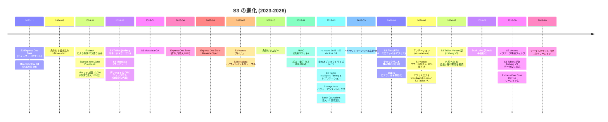
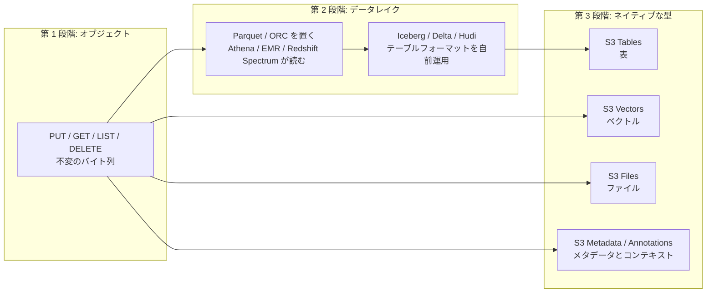
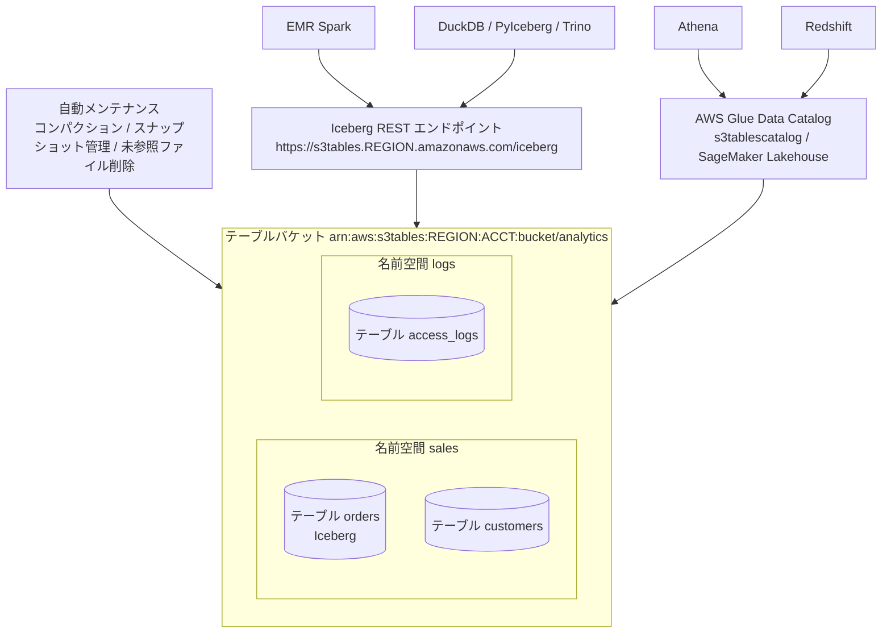
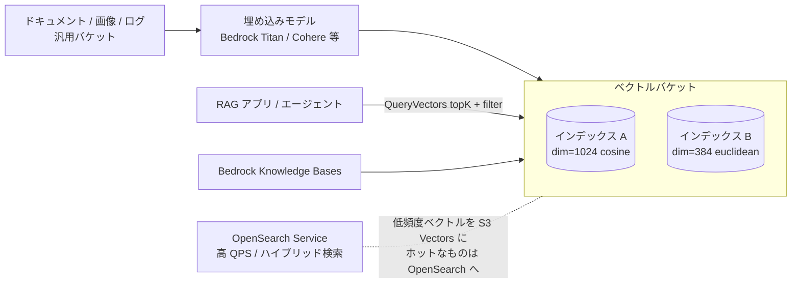
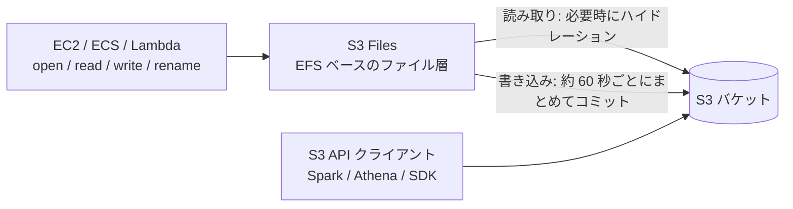
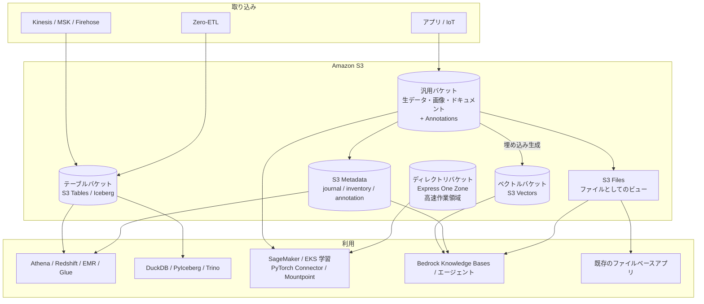

# S3 の最前線 (2023〜2026)

_最終確認: 2026-10-03_

2006 年に「インターネットのためのストレージ」として始まった S3 は、2023 年あたりから明らかに性格を変えている。**「ただのオブジェクトの置き場」から、「表 (テーブル)」「ベクトル」「ファイル」「メタデータ」を直接扱うデータ基盤へ**。この章では 2023〜2026 年の主要ローンチを技術的に整理し、なぜ AWS が S3 をこの方向に伸ばしているのかという戦略の話までまとめる。

## 0. タイムライン



## 1. なぜ S3 はデータベース / レイクハウス / AI 基盤になろうとしているのか

### 1.1 データの重力

S3 には数百兆オブジェクト級のデータが溜まっている (AWS 公式の発表では 2025 年時点で 400 兆オブジェクト超とされる。正確な最新値は未確認)。データを使うたびに別のシステムにコピーするのは、

- コピーのコスト (転送料金・二重保存)
- 鮮度のズレ (コピーは常に古い)
- ガバナンスの分散 (権限が二重管理になる)

という「データの摩擦」を生む。Andy Warfield (S3 の VP / Distinguished Engineer) は All Things Distributed への寄稿 (2026-04「S3 Files and the changing face of S3」) で、このデータ摩擦をなくす試みとして S3 Files を説明している。基本思想は **「データを動かすのではなく、データのある場所 (S3) に表現形式を足していく」**。

### 1.2 「単純さは最低条件」

2025 年 3 月の寄稿「In S3 simplicity is table stakes」で Warfield は、S3 Tables のような新機能に触れつつ、チームにとって最も手応えがあったのは **強い整合性・条件付き操作・アカウントあたりバケット上限の引き上げ** だったと書いている。これらは制限を取り除き、S3 を **よりシンプルに** したからだ。新機能が増えても「使う側から見た単純さ」を守る、というのが S3 チームの設計原則になっている。

### 1.3 3 段階の進化



Warfield は 2026-08 の寄稿「DuckDB and the changing physics of analytics」で、S3 Files・S3 Tables・S3 Vectors を並べ、分析が「どこか別の場所でやる独立した作業」から「作りながら継続的に行うもの」に変わりつつあると書いている。同じ記事で **DuckLabs (DuckDB の開発元) が AWS の子会社になり、DuckDB 自体は DuckDB Foundation のもとで OSS として継続** すると発表された。エンジンが「ライブラリ」になり、データが S3 に一元的にある世界、というのが AWS の描く将来像。

### 1.4 戦略の構図

| 層 | 以前 | 今 |
| --- | --- | --- |
| ストレージ | S3 (汎用) | S3 汎用 + Express One Zone + テーブル / ベクトルバケット |
| テーブル管理 | 自前の Iceberg + Glue + コンパクションジョブ | S3 Tables が管理 (コンパクション、スナップショット、GC) |
| カタログ | Hive Metastore / Glue | Iceberg REST エンドポイント (S3 Tables) + Glue / SageMaker Lakehouse |
| ベクトル | 専用ベクトル DB (OpenSearch、Pinecone 等) | 低頻度・大量は S3 Vectors、高 QPS は OpenSearch |
| ファイル | EFS / FSx にコピー | S3 Files で S3 のデータをそのままファイルとして |
| メタデータ | List + HEAD の総なめ、自前 DB | S3 Metadata (Iceberg テーブル) + Annotations |
| エンジン | Spark / Athena / Redshift | + DuckDB / PyIceberg / エージェント |

## 2. S3 Express One Zone

性能面の詳細は [05-performance](05-performance.md) の Express One Zone 節にある。ここでは「新しい S3 の形」として整理する。

| 項目 | 内容 |
| --- | --- |
| 発表 | 2023-11 (re:Invent 2023) |
| 本質 | 単一 AZ、高性能ハードウェア、**ディレクトリバケット** という新バケット種別 |
| 認証 | `CreateSession` で 5 分有効のセッションクレデンシャル |
| 性能 | 一貫した 1 桁 ms、バケットあたり最大 200 万 GET/s・20 万 PUT/s (既定は 20 万 / 10 万) |
| 2024 年の追加 | Lifecycle による有効期限、**append** (`PutObject` の `x-amz-write-offset-bytes`)、条件付き書き込み |
| 2025 年の追加 | **価格改定 (2025-04)**、Access Points、タグ (ABAC、コスト配分)、**RenameObject (2025-06)**、AWS FIS での AZ 障害テスト |
| 2026 年の追加 | S3 Inventory 対応 (2026-04)、7 リージョン追加で計 15 リージョン (2026-09) |

2025-04 の値下げ (us-east-1): ストレージ $0.16 → $0.11/GB-月、PUT $0.00113/1,000、GET $0.00003/1,000、アップロード $0.0032/GB、取得 $0.0006/GB。

```bash
# append: 既存オブジェクトの末尾 (現在サイズ) にデータを追加
SIZE=$(aws s3api head-object --bucket amzn-s3-demo-bucket--usw2-az1--x-s3 \
  --key logs/app.log --query ContentLength --output text)
aws s3api put-object --bucket amzn-s3-demo-bucket--usw2-az1--x-s3 \
  --key logs/app.log --body chunk.log --write-offset-bytes "$SIZE"

# 原子的 rename
aws s3api rename-object --bucket amzn-s3-demo-bucket--usw2-az1--x-s3 \
  --key logs/app.log.1 --rename-source logs/app.log
```

## 3. S3 Tables

### 3.1 何が問題だったか

Iceberg を汎用バケットで自前運用すると、

- ストリーミング取り込みで **小さいファイルが大量** にでき、クエリが遅くなる
- **コンパクション** ジョブを自分で書いて回す必要がある
- **スナップショットの期限切れ** と **孤立ファイルの削除** を忘れるとストレージが膨らむ
- カタログ (Glue / Hive / Nessie) の運用、権限管理がテーブル単位にならない (オブジェクトキー単位の IAM)

### 3.2 S3 Tables の構造

2024-12 (re:Invent 2024) に発表。「Iceberg をネイティブにサポートする初のクラウドオブジェクトストア」。自己管理の Iceberg テーブルと比べて **最大 3 倍速いクエリ、最大 10 倍高い TPS** (AWS 発表値)。



| 概念 | 説明 |
| --- | --- |
| テーブルバケット | 新しいバケット種別。ARN は `arn:aws:s3tables:...:bucket/<name>`。2026-10 からリージョンあたり既定 100 個 (従来 10)、最大 100 万テーブル/リージョン |
| 名前空間 (namespace) | テーブルの論理グループ (Iceberg の namespace / DB に相当) |
| テーブル | Iceberg テーブル。IAM のリソースとしてテーブル単位で権限付与可能 |
| メンテナンス | `icebergCompaction` (戦略: `auto` / `binpack` / `sort` / `z-order`、目標ファイルサイズ)、`icebergSnapshotManagement` (最小保持数、最大経過時間)、未参照ファイル削除 |
| レコード有効期限 | 一定日数を過ぎたレコードを自動で期限切れにする設定 (`put-table-record-expiration-configuration`) |
| ストレージクラス | `STANDARD` または `INTELLIGENT_TIERING` (2025-12〜) |
| レプリケーション | リージョン / アカウントをまたいだ読み取り専用レプリカ (2025-12〜) |
| 暗号化 | SSE-S3 / SSE-KMS (バケット・テーブル単位) |

既定のスナップショット管理は「最低 1 個保持、120 時間 (5 日) より古いものを期限切れ」(AWS Big Data Blog より)。

### 3.3 アクセスの 2 経路

1. **Iceberg REST エンドポイント (直接)**: `https://s3tables.<region>.amazonaws.com/iceberg`、warehouse にテーブルバケット ARN、SigV4 署名名 `s3tables`
2. **AWS Glue Data Catalog 経由 (統合)**: テーブルバケットを `s3tablescatalog` として Glue に統合し、Lake Formation で細かい権限、Athena / Redshift / EMR / QuickSight / SageMaker Unified Studio から使う。Glue の Iceberg REST エンドポイントは `https://glue.<region>.amazonaws.com/iceberg`、署名名 `glue`

```python
# PyIceberg から S3 Tables の Iceberg REST エンドポイントに接続
from pyiceberg.catalog import load_catalog

catalog = load_catalog(
    "s3tables",
    **{
        "type": "rest",
        "warehouse": "arn:aws:s3tables:us-east-1:111122223333:bucket/analytics",
        "uri": "https://s3tables.us-east-1.amazonaws.com/iceberg",
        "rest.sigv4-enabled": "true",
        "rest.signing-name": "s3tables",
        "rest.signing-region": "us-east-1",
    },
)
tbl = catalog.load_table("sales.orders")
print(tbl.scan(limit=10).to_pandas())
```

```bash
# Spark (EMR 等) の設定例
spark-sql \
  --conf spark.sql.extensions=org.apache.iceberg.spark.extensions.IcebergSparkSessionExtensions \
  --conf spark.sql.catalog.s3t=org.apache.iceberg.spark.SparkCatalog \
  --conf spark.sql.catalog.s3t.type=rest \
  --conf spark.sql.catalog.s3t.uri=https://s3tables.us-east-1.amazonaws.com/iceberg \
  --conf spark.sql.catalog.s3t.warehouse=arn:aws:s3tables:us-east-1:111122223333:bucket/analytics \
  --conf spark.sql.catalog.s3t.rest.sigv4-enabled=true \
  --conf spark.sql.catalog.s3t.rest.signing-name=s3tables \
  --conf spark.sql.catalog.s3t.rest.signing-region=us-east-1
```

### 3.4 CLI で作る

```bash
# テーブルバケット
aws s3tables create-table-bucket --name analytics --region us-east-1

# 名前空間
aws s3tables create-namespace \
  --table-bucket-arn arn:aws:s3tables:us-east-1:111122223333:bucket/analytics \
  --namespace sales

# テーブル (スキーマ付き)
aws s3tables create-table \
  --table-bucket-arn arn:aws:s3tables:us-east-1:111122223333:bucket/analytics \
  --namespace sales --name orders --format ICEBERG \
  --metadata '{"iceberg":{"schema":{"fields":[
     {"name":"order_id","type":"long","required":true},
     {"name":"amount","type":"decimal(10,2)"},
     {"name":"ts","type":"timestamp"}]}}}'

# コンパクション戦略を sort に
aws s3tables put-table-maintenance-configuration \
  --table-bucket-arn arn:aws:s3tables:us-east-1:111122223333:bucket/analytics \
  --namespace sales --name orders --type icebergCompaction \
  --value '{"status":"enabled","settings":{"icebergCompaction":{"targetFileSizeMB":512,"strategy":"sort"}}}'

# テーブルバケットの既定ストレージクラスを Intelligent-Tiering に
aws s3tables put-table-bucket-storage-class \
  --table-bucket-arn arn:aws:s3tables:us-east-1:111122223333:bucket/analytics \
  --storage-class-configuration storageClass=INTELLIGENT_TIERING
```

### 3.5 年表 (S3 Tables)

| 時期 | 出来事 |
| --- | --- |
| 2024-12 | 発表 (us-east-1 / us-east-2 / us-west-2 から)。Glue 統合はプレビュー |
| 2025 前半 | SageMaker Lakehouse / Glue 統合 GA、リージョン拡大 (日付の詳細は未確認) |
| 2025-07 | コンパクション料金を最大 90% 値下げ (2025-07-01 から有効) |
| 2025-09 | S3 コンソールでテーブルのプレビュー |
| 2025-12 | Intelligent-Tiering ストレージクラス、テーブルのレプリケーション |
| 2026-02 | GovCloud (US) で提供 |
| 2026-05 | 台北、ニュージーランドで提供 |
| 2026-06 | S3 サーバーアクセスログを S3 Tables に配信可能に |
| 2026-07 | Iceberg V3 の Variant 型 |
| 2026-09 | Iceberg V3 の全データ型 (geometry、geography、unknown、ナノ秒 timestamp、列のデフォルト値) |
| 2026-10 | テーブルバケット上限をリージョンあたり 10 → 100 に |

Intelligent-Tiering の階層: 30 日連続アクセスなしで Infrequent Access (Frequent より 40% 安い)、90 日で Archive Instant Access (68% 安い。AWS の What's New の表現では Frequent Access 比)。

### 3.6 料金 (us-east-1、2026-10 時点の料金ページ)

| 項目 | 料金 |
| --- | --- |
| ストレージ (最初の 50 TB) | $0.0265/GB-月 |
| PUT 系リクエスト | $0.005/1,000 |
| GET 系リクエスト | $0.0004/1,000 |
| オブジェクト監視 | $0.025/1,000 オブジェクト |
| コンパクション (オブジェクト) | $0.002/1,000 オブジェクト処理 |
| コンパクション (データ量、binpack) | $0.005/GB 処理 |

sort / z-order コンパクションの per-GB 料金は binpack と別建て (2025-07 に最大 80% 値下げ)。正確な現行値は料金ページで確認すること (本書では sort/z-order の現行単価は未確認)。

## 4. S3 Metadata と Annotations

### 4.1 S3 Metadata

「このバケットに何がある?」「誰が昨日このプレフィックスに書いた?」を List + HEAD の総なめではなく **SQL** で答えるための機能。2024-12 プレビュー、2025-01 GA。

| テーブル | 必須 | 内容 |
| --- | --- | --- |
| ジャーナルテーブル | 必須 | オブジェクトの作成・削除・メタデータ更新をほぼリアルタイムに記録。レコード期限 (最低 7 日) を設定可能 |
| ライブインベントリテーブル | 任意 (2025-07〜) | バケット内の全オブジェクト / バージョンの最新状態。有効化時に既存オブジェクトをバックフィル (最低 15 分、大規模なら数時間)。更新は通常 1 時間以内に反映 |
| アノテーションテーブル | 任意 (2026-06〜) | オブジェクトに付けたアノテーションの最新状態を SQL で検索可能に |

メタデータテーブルは AWS マネージドのテーブルバケット (`aws-s3`) に Iceberg として置かれ、Athena / EMR / DuckDB / PyIceberg 等で読める。

```bash
aws s3api create-bucket-metadata-configuration \
  --bucket amzn-s3-demo-bucket \
  --metadata-configuration '{
    "JournalTableConfiguration": {"RecordExpiration": {"Expiration": "ENABLED", "Days": 30}},
    "InventoryTableConfiguration": {"ConfigurationState": "ENABLED"}
  }'
```

```sql
-- Athena: 過去 24 時間に削除されたオブジェクト (ジャーナルテーブル)
SELECT key, version_id, requester, source_ip_address, record_timestamp
FROM "s3tablescatalog/aws-s3"."b_amzn-s3-demo-bucket"."journal"
WHERE record_type = 'DELETE'
  AND record_timestamp > current_timestamp - interval '1' day;
```

(カタログ名・名前空間・テーブル名の具体的な形式は環境によって違うので、Glue コンソールで確認すること。)

料金 (us-east-1): ジャーナル更新 $0.30/100 万更新、ライブインベントリのバックフィル $0.30/100 万。2025-07 にジャーナル料金が 33% 値下げされた。

### 4.2 Annotations (2026-06)

AI エージェントや分析ツールに「このデータは何か」という **ビジネス文脈** を渡すための新しいメタデータ種別。

| メタデータの種類 | サイズ | 変更 | 用途 |
| --- | --- | --- | --- |
| システム定義メタデータ | 固定 | 不可 | サイズ、作成日時、ストレージクラス |
| ユーザー定義メタデータ (`x-amz-meta-*`) | 2 KB まで | PUT 時のみ (変更は再コピー) | 小さな属性 |
| オブジェクトタグ | 10 個まで | いつでも | IAM、ライフサイクル、コスト配分 |
| **アノテーション** | **1 オブジェクトあたり最大 1 GB** (JSON / XML / YAML) | いつでも | AI エージェント向けの文脈、データカタログ情報 |

アノテーションはオブジェクトと同じ耐久性と整合性を持ち、コピーやレプリケーションで一緒に移動し、オブジェクト削除で消える。料金は S3 Standard のストレージ・リクエスト料金と同じ扱い。

```bash
aws s3api put-object-annotation \
  --bucket amzn-s3-demo-bucket --key datasets/claims-2026.parquet \
  --annotation-name catalog \
  --annotation-payload claims-annotation.json

aws s3api list-object-annotations --bucket amzn-s3-demo-bucket --key datasets/claims-2026.parquet
aws s3api get-object-annotation --bucket amzn-s3-demo-bucket \
  --key datasets/claims-2026.parquet --annotation-name catalog out.json
```

(`--annotation-payload` は `put-object --body` と同じくファイルパスをそのまま渡す。`fileb://` は付けない。CLI v2.37.7 でクライアント側の引数検証を通ることを確認済み。)

## 5. S3 Vectors

### 5.1 位置づけ

「クラウドオブジェクトストレージで初めてベクトルのネイティブ保存・検索をサポート」。2025-07 プレビュー、**2025-12 GA** (re:Invent 2025)。専用ベクトル DB に比べて **ベクトルの保存・クエリのコストを最大 90% 削減** (AWS 発表値)。



### 5.2 制限 (User Guide、2026-10 時点)

| 項目 | 上限 |
| --- | --- |
| ベクトルバケット / リージョン / アカウント | 10,000 |
| インデックス / ベクトルバケット | 10,000 |
| ベクトル / インデックス | 最大 20 億 (GA 時にプレビューの 40 倍) |
| 次元数 | 1〜4,096 |
| データ型 | `float32` |
| 距離 | `cosine` / `euclidean` |
| メタデータ合計 / ベクトル | 40 KB (うちフィルタ可能 2 KB) |
| メタデータキー数 / ベクトル | 50 |
| フィルタ不可キー / インデックス | 10 (作成時に固定) |
| PutVectors + DeleteVectors リクエスト / 秒 / インデックス | 1,000 |
| 挿入 + 削除ベクトル数 / 秒 / インデックス | 2,500 |
| PutVectors 1 回のベクトル数 | 500 |
| GetVectors 1 回 | 100 |
| QueryVectors の topK | **最大 10,000** (2026-06 に拡大。結果はページング、1 ページ最大 100) |
| ENHANCED インデックスでのフィルタ条件 / クエリ | 100 |
| リクエストペイロード | 20 MiB |

性能: 低頻度のクエリで 1 秒未満、頻繁なクエリで 100 ms 程度 (GA 発表)。数百〜数千 QPS を継続的に捌くなら OpenSearch の方が向く。

### 5.3 インデックスモード: CLASSIC と ENHANCED (2026-09)

2026-09 に **メタデータ事前フィルタ** が入った。

| モード | 挙動 | 特徴 |
| --- | --- | --- |
| `CLASSIC` | ベクトル検索 **中に** フィルタを適用 | 選択性の高いフィルタだと結果が topK に満たないことがある |
| `ENHANCED` | ベクトル検索の **前に** フィルタを適用 | 選択的なフィルタで最大 5 倍多くの一致を返す (= recall 向上)。`$startsWith` 演算子にも対応 |

CLI ヘルプ (v2.37.7) によれば、`CLASSIC` を指定できるのは **2026-09-30 より前に作られたベクトルバケット内のインデックスのみ**。既存インデックスは `update-index-mode` でその場で ENHANCED に切り替えられ、切り替え前に `query-vectors --query-mode` でクエリごとに比較できる。

### 5.4 CLI

```bash
aws s3vectors create-vector-bucket --vector-bucket-name kb-vectors

aws s3vectors create-index --vector-bucket-name kb-vectors \
  --index-name docs --data-type float32 --dimension 1024 \
  --distance-metric cosine \
  --metadata-configuration nonFilterableMetadataKeys=source_text

aws s3vectors put-vectors --vector-bucket-name kb-vectors --index-name docs \
  --vectors '[{"key":"doc-1#0","data":{"float32":[0.01,0.02,0.03]},
               "metadata":{"lang":"ja","path":"handbook/a.md"}}]'

aws s3vectors query-vectors --vector-bucket-name kb-vectors --index-name docs \
  --query-vector '{"float32":[0.01,0.02,0.03]}' --top-k 5 \
  --filter '{"lang":{"$eq":"ja"}}' --return-metadata --return-distance

aws s3vectors update-index-mode --vector-bucket-name kb-vectors \
  --index-name docs --index-mode ENHANCED
```

(上の例はベクトルを 3 次元に省略している。実際は `--dimension` と同じ長さが必要。)

### 5.5 統合

| 統合先 | 使い方 |
| --- | --- |
| Amazon Bedrock Knowledge Bases | ベクトルストアとして S3 Vectors を選ぶ。RAG のコストを下げる |
| Amazon OpenSearch Service | S3 Vectors を低コストな保管層として使い、ホットなものを OpenSearch に置くハイブリッド構成 / ハイブリッド検索 |
| SageMaker Unified Studio | エージェント・ノートブックからの利用 |

### 5.6 料金 (us-east-1、料金ページの記載)

| 項目 | 料金 |
| --- | --- |
| ストレージ | $0.06/GB-月 |
| PUT | $0.20/GB (1 リクエスト最低 128 KB 換算) |
| クエリ API | $2.5/100 万クエリ |
| クエリ処理データ | 規模で段階料金 (〜10 万ベクトル / 10 万〜1,000 万 / 1,000 万超)。1,000 万ベクトル超のインデックスは 2026-06 に最大 80% 値下げ |
| 返却データ | topK 拡大に伴い、1 クエリ 512 KB を超えた返却データに少額課金 |

クエリ処理データの単価は料金ページの表記 ($/TB) を本書では正確に再現できていないため **未確認** 扱い。見積もりは公式料金ページと料金計算ツールで行うこと。

## 6. S3 Files (2026-04)

### 6.1 概要

S3 バケット (またはプレフィックス) を **フルのファイルシステムセマンティクスを持つネットワークファイルシステム** としてマウントできるサービス。Amazon EFS をベースに作られ、データは S3 から出ない。34 リージョンで GA。

| 項目 | 内容 |
| --- | --- |
| 対象 | 既存・新規すべての S3 データ |
| 同時接続 | 数千のコンピュートリソースから同時アクセス |
| スループット | 集約で最大数 TB/s の読み取り |
| キャッシュ | アクティブなデータを低レイテンシ用にキャッシュ |
| 同時アクセス | ファイルシステム API と S3 API の両方から同じデータに |
| 対応コンピュート | EC2、コンテナ (ECS: Fargate / Managed Instances に加え 2026-09 から EC2 起動タイプ)、Lambda |

### 6.2 設計のポイント (Warfield の寄稿より)

- **Stage and commit**: ファイルシステム経由の変更は EFS 側に溜まり、まとめて S3 にコミットされる (約 60 秒ごと。第三者の計測では 63〜66 秒)
- **境界を見えなくするのではなく、明示的な機能にした**: ファイルとオブジェクトの境界を完全に隠そうとすると、どちらかの側で受け入れがたい妥協が生じたため
- **遅延ハイドレーション**: データは必要になったときに取り込む。大きいファイルは S3 から直接ストリーム (クライアントあたり約 3 GiB/s とされる)
- **名前空間の非互換**: `/` で終わるキー、POSIX で使えない文字を含むキー、255 バイトを超えるパス要素などは、黙って変換せずイベントを出す



### 6.3 AI エージェントとの関係

寄稿では、Kiro や Claude Code を使う AWS 社内のエンジニアリングチームが、エージェントのコンテキストウィンドウが圧縮されてセッション状態を失う問題にぶつかった例が紹介されている。S3 Files なら、エージェントは調査メモやタスクの要約を共有ディレクトリに書き、他のエージェントがそれを読める。セッションが終わっても状態はファイルシステムに残り、次のセッションで使える。

## 7. データ整合性と並行制御

### 7.1 条件付き書き込み

| 時期 | 機能 |
| --- | --- |
| 2020-12 | 強い read-after-write 整合性 (全リクエスト) |
| 2024-08 | `If-None-Match: *` (存在しなければ書く)。PutObject / CompleteMultipartUpload、汎用 / ディレクトリバケット |
| 2024-11 | `If-Match: <ETag>` (変わっていなければ書く) |
| 2024-11 | バケットポリシーで条件付き書き込みを **強制** (`s3:if-none-match` / `s3:if-match` 条件キー) |
| 2025-10 | 条件付きコピー (CopyObject の If-Match / If-None-Match) |

これで S3 単体で **楽観的ロック** と **一度だけ書き込み (create-only)** ができるようになった。Iceberg / Delta のコミット、分散ロック、リーダー選出、冪等な取り込みに直接使える。

```bash
# 存在しなければ作成 (既にあれば 412 Precondition Failed)
aws s3api put-object --bucket amzn-s3-demo-bucket --key locks/job-42 \
  --body owner.json --if-none-match '*'

# ETag が一致する場合だけ更新 (楽観的ロック)
ETAG=$(aws s3api head-object --bucket amzn-s3-demo-bucket --key state.json --query ETag --output text)
aws s3api put-object --bucket amzn-s3-demo-bucket --key state.json \
  --body new-state.json --if-match "$ETAG"
```

競合中に別の操作が走ると `409 ConditionalRequestConflict` が返ることがあり、その場合はリトライする。

### 7.2 チェックサム

| 時期 | 内容 |
| --- | --- |
| 2022-02 | 追加チェックサム (CRC32、CRC32C、SHA-1、SHA-256) |
| 2024-12 | **デフォルトのデータ整合性保護**: 最新 SDK が CRC ベースのチェックサムを自動計算・送信し、S3 が検証。オブジェクト全体の CRC をメタデータに保存。CRC64NVME 追加 (デフォルト) |
| 2025-08 | Batch Operations の compute checksum ジョブ (復元・ダウンロードなしで保存済みデータを検証) |
| 2026-04 | 5 アルゴリズム追加: MD5、XXHash3、XXHash64、XXHash128、SHA-512 (合計 10) |

### 7.3 その他の基盤的変更

| 時期 | 内容 |
| --- | --- |
| 2023-04 | 新規バケットは Block Public Access 有効・ACL 無効がデフォルト |
| 2023-01 | 新規オブジェクトは SSE-S3 でデフォルト暗号化 |
| 2024-11 | アカウントあたりの汎用バケット既定上限 100 → 10,000 (申請で最大 100 万) |
| 2025-10 | Email Grantee ACL のサポート終了 (CLI ヘルプに記載) |
| 2025-11 | ABAC (タグベースのアクセス制御、`PutBucketAbac`) |
| 2025-11 | ポスト量子 TLS 鍵交換 (ML-KEM) をリージョナル / S3 Tables / Express One Zone エンドポイントで |
| 2025-12 | Organizations ポリシーによる組織全体の Block Public Access |
| 2026-03 | **アカウントリージョナル名前空間** (`<prefix>-<accountId>-<region>-an` 形式の、自分のアカウントだけが作れるバケット名。`create-bucket --bucket-namespace account-regional`) |
| 2026-04 | 新規・既存バケットで SSE-C をデフォルト無効化 (SSE-C 使用実績のあるアカウントの既存バケットは除く) |
| 2026 | `UpdateObjectEncryption`: データ移動なしで既存オブジェクトの暗号化を SSE-S3 → SSE-KMS などに変更 (CLI で確認。発表日は未確認) |
| 2026-03 | レプリケーションに失敗したオブジェクトに対してライフサイクルの移行・期限切れを保留 |
| 2026-07 | Standard-IA / One Zone-IA への移行の 30 日最小期間を撤廃 |
| 2026-07 | イベント通知にシステム生成タグを含める |

## 8. re:Invent 2025 (2025-12-01〜05) の S3 まとめ

| 発表 | 要点 |
| --- | --- |
| S3 Vectors GA | インデックスあたり 20 億ベクトル (プレビューの 40 倍)、14 リージョン、SSE-KMS、タグ |
| 最大オブジェクトサイズ 50 TB | 5 TB から 10 倍。全ストレージクラス、全機能対応 |
| S3 Tables Intelligent-Tiering | アクセスパターンに応じて 3 階層を自動移動、最大 80% のコスト削減 |
| S3 Tables レプリケーション | リージョン / アカウント間で読み取り専用レプリカ |
| Storage Lens 強化 | パフォーマンスメトリクス、数十億プレフィックスの分析、S3 Tables へのエクスポート |
| Batch Operations 高速化 | 最大 200 億オブジェクトのジョブで最大 10 倍速く |
| FSx for NetApp ONTAP と S3 の統合 | ONTAP のデータを S3 API 経由で分析・ML サービスから使える |
| セキュリティ | ABAC (2025-11)、組織全体の BPA、SSE-C 無効化の予告 |

## 9. 2026 年 (〜10 月) の S3 まとめ

| 月 | 発表 |
| --- | --- |
| 01 | Storage Lens が GovCloud (US) に |
| 02 | サーバーアクセスログに送信元リージョン情報、S3 Tables が GovCloud に |
| 03 | アカウントリージョナル名前空間、レプリケーション失敗時のライフサイクル保留 |
| 04 | **S3 Files**、Lambda から S3 Files をマウント、チェックサム 5 種追加、SSE-C デフォルト無効化、Express One Zone の S3 Inventory |
| 05 | S3 Tables が台北・ニュージーランドに |
| 06 | **Annotations**、アクセスログを CloudWatch Logs / S3 Tables へ、S3 Vectors の topK 最大 10,000、S3 Vectors のクエリ料金最大 80% 値下げ |
| 07 | S3 Tables Variant 型、IA 系への 30 日最小移行期間撤廃、イベント通知のシステム生成タグ |
| 08 | DuckLabs が AWS 子会社に (Warfield の寄稿で発表) |
| 09 | S3 Vectors メタデータ事前フィルタ (ENHANCED)、S3 Tables が全 Iceberg V3 型、Express One Zone 7 リージョン追加、ECS on EC2 で S3 Files |
| 10 | テーブルバケット上限 100 / リージョン |

(網羅は目指したが、What's New の全件を機械的に確認したわけではない。漏れがありうる。)

## 10. 全体アーキテクチャ: 2026 年の「S3 中心」データ基盤



## 11. どれを使うべきか

| やりたいこと | 選択肢 |
| --- | --- |
| 構造化データを SQL で分析、更新・削除もしたい | S3 Tables (自前 Iceberg から移行も検討) |
| 汎用バケットの中身を SQL で棚卸し・監査 | S3 Metadata (journal + live inventory) |
| データの意味をエージェントに伝えたい | Annotations + アノテーションテーブル |
| 大量の埋め込みを安く保存して時々検索 | S3 Vectors |
| 埋め込みを常時高 QPS で検索 | OpenSearch (S3 Vectors と併用) |
| 1 桁 ms のオブジェクトアクセス、ML 学習 | Express One Zone |
| POSIX アプリをそのまま S3 データで動かす | S3 Files |
| 読み取り中心の大規模ファイルアクセスを安く | Mountpoint |
| 分散ロック / 冪等書き込み | 条件付き書き込み (If-None-Match / If-Match) |

## 12. まとめ

- S3 は「バイト列の置き場」から「**データの型 (表・ベクトル・ファイル・メタデータ) をネイティブに持つ基盤**」へ移行中
- その動機は **データの摩擦をなくす** こと。データを動かさず、表現を足す
- 一方で S3 チームは「単純さは最低条件」という原則を掲げ、整合性・条件付き操作・上限撤廃のような「制限を消す」改善を同じくらい重視している
- 2025〜2026 年の流れは、S3 Tables の成熟 (Intelligent-Tiering、レプリケーション、Iceberg V3)、S3 Vectors の GA と高機能化、S3 Files と Annotations の登場、そして DuckDB チームの合流

## 参考文献

- [In S3 simplicity is table stakes (Andy Warfield, All Things Distributed, 2025-03)](https://www.allthingsdistributed.com/2025/03/in-s3-simplicity-is-table-stakes.html)
- [S3 Files and the changing face of S3 (Andy Warfield, 2026-04)](https://www.allthingsdistributed.com/2026/04/s3-files-and-the-changing-face-of-s3.html)
- [DuckDB and the changing physics of analytics (Andy Warfield, 2026-08)](https://www.allthingsdistributed.com/2026/08/duckdb-and-the-changing-physics-of-analytics.html)
- [Building and operating a pretty big storage system called S3 (2023)](https://www.allthingsdistributed.com/2023/07/building-and-operating-a-pretty-big-storage-system.html)
- [Top announcements of AWS re:Invent 2025](https://aws.amazon.com/blogs/aws/top-announcements-of-aws-reinvent-2025/)
- [Amazon S3 Vectors is now generally available (2025-12)](https://aws.amazon.com/about-aws/whats-new/2025/12/amazon-s3-vectors-generally-available/)
- [Announcing Amazon S3 Vectors (Preview) (2025-07)](https://aws.amazon.com/about-aws/whats-new/2025/07/amazon-s3-vectors-preview-native-support-storing-querying-vectors/)
- [S3 Vectors limitations and restrictions](https://docs.aws.amazon.com/AmazonS3/latest/userguide/s3-vectors-limitations.html)
- [S3 Vectors supports up to 10,000 search results per query (2026-06)](https://aws.amazon.com/about-aws/whats-new/2026/06/s3-vectors-supports-10000-search-results-per-query/)
- [S3 Vectors reduces query charges by up to 80% (2026-06)](https://aws.amazon.com/about-aws/whats-new/2026/06/s3-vectors-reduces-query-charges-80-percent-large-indexes/)
- [S3 Vectors introduces metadata pre-filtering (2026-09)](https://aws.amazon.com/about-aws/whats-new/2026/09/s3-vectors-introduces-metadata-pre-filtering/)
- [Amazon S3 pricing](https://aws.amazon.com/s3/pricing/)
- [Top analytics announcements of AWS re:Invent 2024](https://aws.amazon.com/blogs/big-data/top-analytics-announcements-of-aws-reinvent-2024/)
- [Build a managed transactional data lake with Amazon S3 Tables](https://aws.amazon.com/blogs/storage/build-a-managed-transactional-data-lake-with-amazon-s3-tables/)
- [Accessing tables using the Amazon S3 Tables Iceberg REST endpoint](https://docs.aws.amazon.com/AmazonS3/latest/userguide/s3-tables-integrating-open-source.html)
- [Record expiration for tables](https://docs.aws.amazon.com/AmazonS3/latest/userguide/s3-tables-record-expiration.html)
- [Optimize Amazon S3 Tables queries with Amazon Redshift](https://aws.amazon.com/blogs/big-data/optimize-amazon-s3-tables-queries-with-amazon-redshift/)
- [S3 Tables reduce compaction costs by up to 90% (2025-07)](https://aws.amazon.com/about-aws/whats-new/2025/07/amazon-s3-tables-reduce-compaction-costs/)
- [S3 Tables Intelligent-Tiering (2025-12)](https://aws.amazon.com/about-aws/whats-new/2025/12/s3-tables-intelligent-tiering-storage-class/)
- [S3 Tables automatic replication (2025-12)](https://aws.amazon.com/about-aws/whats-new/2025/12/s3-tables-automatic-replication-apache-iceberg-tables/)
- [S3 Tables Variant data type (2026-07)](https://aws.amazon.com/about-aws/whats-new/2026/07/amazon-s3-tables-variant-iceberg-v3/)
- [S3 Tables all Iceberg V3 data types (2026-09)](https://aws.amazon.com/about-aws/whats-new/2026/09/amazon-s3-tables-iceberg-v3-data-types/)
- [S3 Tables up to 100 table buckets per Region (2026-10)](https://aws.amazon.com/about-aws/whats-new/2026/10/amazon-s3-tables-table-bucket-increase/)
- [S3 Metadata supports existing objects (2025-07)](https://aws.amazon.com/about-aws/whats-new/2025/07/amazon-s3-metadata-existing-objects-reduces-price/)
- [Amazon S3 adds annotations (2026-06)](https://aws.amazon.com/about-aws/whats-new/2026/06/amazon-s3-annotations-business-context/)
- [How Vanderbilt University scales digital archive discovery with Amazon S3 Metadata](https://aws.amazon.com/blogs/storage/how-vanderbilt-university-scales-digital-archive-discovery-with-s3-metadata/)
- [Analyze Amazon S3 annotations at scale with materialized views](https://aws.amazon.com/blogs/storage/analyze-amazon-s3-annotations-at-scale-with-materialized-views/)
- [Announcing Amazon S3 Files (2026-04)](https://aws.amazon.com/about-aws/whats-new/2026/04/amazon-s3-files/)
- [AWS Lambda can mount S3 buckets with S3 Files (2026-04)](https://aws.amazon.com/about-aws/whats-new/2026/04/aws-lambda-amazon-s3/)
- [Amazon ECS extends S3 Files support to EC2 (2026-09)](https://aws.amazon.com/about-aws/whats-new/2026/09/amazon-ecs-s3-files-ec2/)
- [Announcing up to 85% price reductions for S3 Express One Zone](https://aws.amazon.com/blogs/aws/up-to-85-price-reductions-for-amazon-s3-express-one-zone/)
- [S3 Express One Zone atomic renaming (2025-06)](https://aws.amazon.com/about-aws/whats-new/2025/06/amazon-s3-express-one-zone-atomic-renaming-objects-api/)
- [S3 Express One Zone supports S3 Inventory (2026-04)](https://aws.amazon.com/about-aws/whats-new/2026/04/s3-express-one-zone-supports-s3-inventory/)
- [S3 Express One Zone in 7 additional Regions (2026-09)](https://aws.amazon.com/about-aws/whats-new/2026/09/s3-express-one-zone-7-regions/)
- [Amazon S3 now supports conditional writes (2024-08)](https://aws.amazon.com/about-aws/whats-new/2024/08/amazon-s3-conditional-writes/)
- [Amazon S3 adds new functionality for conditional writes (2024-11)](https://aws.amazon.com/about-aws/whats-new/2024/11/amazon-s3-functionality-conditional-writes/)
- [Enforcement of conditional write operations (2024-11)](https://aws.amazon.com/about-aws/whats-new/2024/11/amazon-s3-enforcement-conditional-write-operations-general-purpose-buckets/)
- [Conditional write functionality for copy operations (2025-10)](https://aws.amazon.com/about-aws/whats-new/2025/10/amazon-s3-conditional-write-functionality-copy-operations/)
- [Amazon S3 adds new default data integrity protections (2024-12)](https://aws.amazon.com/about-aws/whats-new/2024/12/amazon-s3-default-data-integrity-protections/)
- [Amazon S3 supports five additional checksum algorithms (2026-04)](https://aws.amazon.com/about-aws/whats-new/2026/04/s3-five-additional-checksum-algorithms/)
- [Amazon S3 maximum object size 50 TB (2025-12)](https://aws.amazon.com/about-aws/whats-new/2025/12/amazon-s3-maximum-object-size-50-tb/)
- [Storage Lens performance metrics (2025-12)](https://aws.amazon.com/about-aws/whats-new/2025/12/amazon-s3-storage-lens-performance-metrics-prefixes-export-tables/)
- [S3 Batch Operations performance improvements (2025-12)](https://aws.amazon.com/about-aws/whats-new/2025/12/s3-batch-operations-performance-improvements/)
- [Amazon S3 attribute-based access control (2025-11)](https://aws.amazon.com/about-aws/whats-new/2025/11/amazon-s3-attribute-based-access-control/)
- [Post-quantum TLS on S3 endpoints (2025-11)](https://aws.amazon.com/about-aws/whats-new/2025/11/s3-post-quantum-tls-key-exchange-endpoints/)
- [Account regional namespaces (2026-03)](https://aws.amazon.com/about-aws/whats-new/2026/03/amazon-s3-account-regional-namespaces/)
- [S3 default bucket security setting (SSE-C) (2026-04)](https://aws.amazon.com/about-aws/whats-new/2026/04/s3-default-bucket-security-setting/)
- [S3 Lifecycle pauses actions on objects unable to replicate (2026-03)](https://aws.amazon.com/about-aws/whats-new/2026/03/s3-lifecycle-pauses-actions-on-objects/)
- [S3 removes 30-day minimum for IA transitions (2026-07)](https://aws.amazon.com/about-aws/whats-new/2026/07/s3-removes-30-day-transitions-standard-ia-one-zone-ia/)
- [S3 server access logs source region (2026-02)](https://aws.amazon.com/about-aws/whats-new/2026/02/amazon-s3-source-region-information/)
- [S3 server access logs to CloudWatch Logs and S3 Tables (2026-06)](https://aws.amazon.com/about-aws/whats-new/2026/06/amazon-s3-cloudwatch-logs-tables/)
- [S3 Event Notifications system-generated tags (2026-07)](https://aws.amazon.com/about-aws/whats-new/2026/07/amazon-s3-event-notifications-system-generated-tags/)
- [Data Engineering Podcast: S3 Tables and Vectors (Andy Warfield)](https://www.dataengineeringpodcast.com/episodepage/s3-tables-and-vectors-episode-475)
