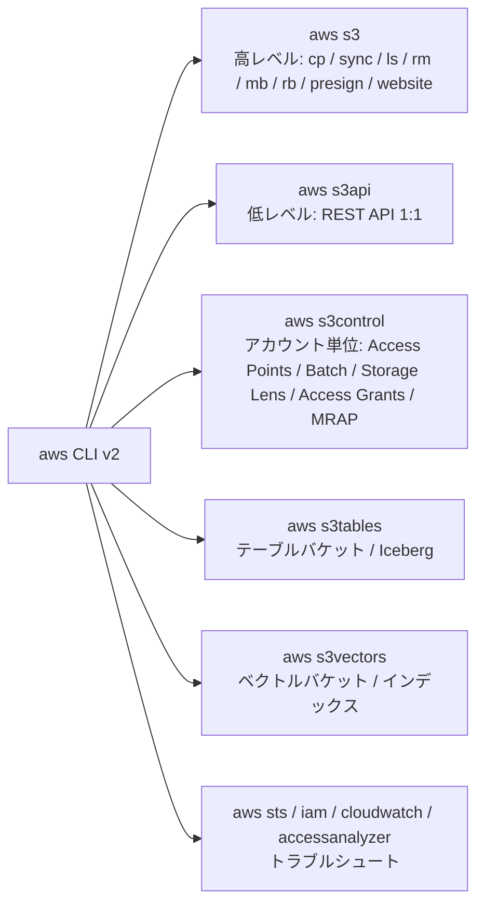
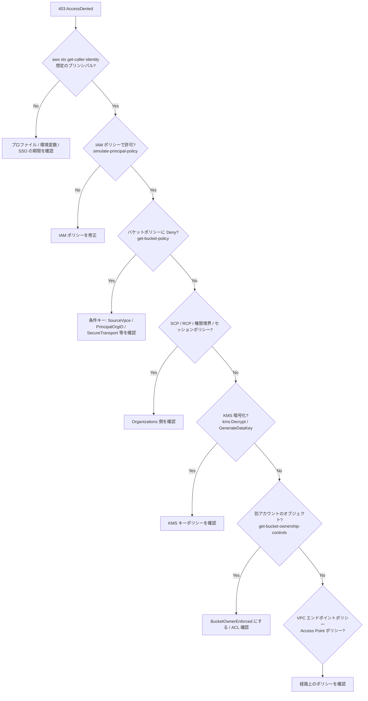

# S3 コマンド大全 (CLI / SDK / IaC / サードパーティ)

_最終確認: 2026-10-03_

この章は「手を動かすための辞書」。AWS CLI v2 (本書の確認環境は **aws-cli/2.37.7**) のフラグ名はローカルの `aws <service> <command> help` で照合している。バケット名は AWS ドキュメントの慣例に合わせて `amzn-s3-demo-bucket`、アカウント ID は `111122223333` を使う。

> 破壊的なコマンド (削除・上書き・ポリシー変更) には見出しか本文で **[危険]** と書いた。実行前に `--dryrun` や `--generate-cli-skeleton`、別アカウントでの検証を習慣にすること。

## 0. 目次の代わりに: コマンド体系



| 名前空間 | 使い分け |
| --- | --- |
| `aws s3` | ファイル転送の 9 割はこれ。マルチパート・並列化・再帰処理を自動でやる |
| `aws s3api` | API を 1 対 1 で叩く。設定変更、メタデータ、バージョン、条件付き書き込みなど |
| `aws s3control` | バケットではなく **アカウント** にぶら下がるリソース (`--account-id` 必須) |
| `aws s3tables` | S3 Tables (テーブルバケット、名前空間、テーブル、メンテナンス) |
| `aws s3vectors` | S3 Vectors (ベクトルバケット、インデックス、ベクトルの PUT / クエリ) |

## 1. セットアップ

### 1.1 インストールと確認

```bash
# macOS
brew install awscli
# Linux (x86_64)
curl "https://awscli.amazonaws.com/awscli-exe-linux-x86_64.zip" -o awscliv2.zip
unzip awscliv2.zip && sudo ./aws/install

aws --version
# aws-cli/2.37.7 Python/3.14.8 Darwin/25.4.0 source/arm64
```

### 1.2 アクセスキー (非推奨だが基本)

```bash
aws configure
# AWS Access Key ID [None]: AKIA...
# AWS Secret Access Key [None]: ...
# Default region name [None]: ap-northeast-1
# Default output format [None]: json
```

`~/.aws/credentials` と `~/.aws/config` に書かれる。長期アクセスキーは漏えいリスクが高いので、人間は SSO、マシンは IAM ロールを使う。

### 1.3 IAM Identity Center (SSO) プロファイル

```bash
aws configure sso
# SSO session name: my-sso
# SSO start URL: https://my-org.awsapps.com/start
# SSO region: ap-northeast-1
# (ブラウザで認可 → アカウントとロールを選ぶ)
# CLI profile name: dev-admin

aws sso login --profile dev-admin
aws s3 ls --profile dev-admin
```

生成される `~/.aws/config`:

```text
[profile dev-admin]
sso_session = my-sso
sso_account_id = 111122223333
sso_role_name = AdministratorAccess
region = ap-northeast-1
output = json

[sso-session my-sso]
sso_start_url = https://my-org.awsapps.com/start
sso_region = ap-northeast-1
sso_registration_scopes = sso:account:access
```

### 1.4 ロールの引き受け (AssumeRole) プロファイル

```text
[profile prod-readonly]
role_arn = arn:aws:iam::444455556666:role/ReadOnly
source_profile = dev-admin
region = ap-northeast-1
duration_seconds = 3600
```

### 1.5 環境変数

| 変数 | 意味 |
| --- | --- |
| `AWS_PROFILE` | 使うプロファイル |
| `AWS_REGION` / `AWS_DEFAULT_REGION` | リージョン (SDK は `AWS_REGION`、CLI は両方見る) |
| `AWS_ACCESS_KEY_ID` / `AWS_SECRET_ACCESS_KEY` / `AWS_SESSION_TOKEN` | 一時クレデンシャル直指定 |
| `AWS_ENDPOINT_URL_S3` | S3 だけエンドポイントを差し替え (MinIO、LocalStack 等) |
| `AWS_CA_BUNDLE` | 社内プロキシの CA |
| `AWS_RETRY_MODE` / `AWS_MAX_ATTEMPTS` | リトライ (`standard` / `adaptive`) |
| `AWS_PAGER` | `""` にするとページャ (less) を無効化 |
| `AWS_CLI_AUTO_PROMPT` | `on-partial` で対話補完 |

```bash
export AWS_PROFILE=dev-admin
export AWS_REGION=ap-northeast-1
export AWS_PAGER=""
aws sts get-caller-identity
```

### 1.6 CLI の S3 転送チューニング

```bash
aws configure set default.s3.max_concurrent_requests 64
aws configure set default.s3.max_queue_size 10000
aws configure set default.s3.multipart_threshold 64MB
aws configure set default.s3.multipart_chunksize 16MB
aws configure set default.s3.max_bandwidth 500MB/s          # classic のみ
aws configure set default.s3.preferred_transfer_client crt  # auto | classic | crt
aws configure set default.s3.target_bandwidth 25Gb/s        # crt のみ
aws configure set default.s3.use_accelerate_endpoint true
aws configure set default.s3.addressing_style virtual
```

`~/.aws/config` の形:

```text
[default]
region = ap-northeast-1
s3 =
  max_concurrent_requests = 64
  multipart_threshold = 64MB
  multipart_chunksize = 16MB
  preferred_transfer_client = crt
  target_bandwidth = 25Gb/s
```

| キー | 既定 | 対応クライアント | 説明 |
| --- | --- | --- | --- |
| `max_concurrent_requests` | 10 | classic | 同時リクエスト数 |
| `max_queue_size` | 1000 | classic | タスクキュー長 |
| `multipart_threshold` | 8MB | 両方 | この値以上でマルチパート |
| `multipart_chunksize` | 8MB | 両方 | パートサイズ (10,000 パートを超えるなら自動調整) |
| `max_bandwidth` | なし | classic | 帯域上限 |
| `preferred_transfer_client` | auto | — | `auto` / `classic` / `crt` |
| `target_bandwidth` | 自動検出 | crt | 目標帯域 |
| `use_accelerate_endpoint` | false | 両方 | Transfer Acceleration |
| `disable_s3_express_session_auth` | false | — | プロファイル直下に書く (s3 キーの下ではない) |

## 2. `aws s3` 高レベルコマンド

### 2.1 ls

```bash
aws s3 ls                                     # バケット一覧
aws s3 ls --bucket-name-prefix logs-          # 名前で絞り込み
aws s3 ls --bucket-region us-east-1           # リージョンで絞り込み
aws s3 ls s3://amzn-s3-demo-bucket/           # 1 階層 (PRE = 共通プレフィックス)
aws s3 ls s3://amzn-s3-demo-bucket/logs/ --recursive --human-readable --summarize
```

### 2.2 cp

```bash
# アップロード / ダウンロード
aws s3 cp ./report.pdf s3://amzn-s3-demo-bucket/docs/report.pdf
aws s3 cp s3://amzn-s3-demo-bucket/docs/report.pdf ./report.pdf

# ディレクトリごと
aws s3 cp ./site s3://amzn-s3-demo-bucket/site/ --recursive

# S3 → S3 (サーバーサイドコピー、リージョン跨ぎは --source-region)
aws s3 cp s3://src-bucket/a.bin s3://amzn-s3-demo-bucket/a.bin --source-region us-west-2

# 標準入力 / 標準出力
tar czf - ./data | aws s3 cp - s3://amzn-s3-demo-bucket/backup/data.tgz --expected-size 53687091200
aws s3 cp s3://amzn-s3-demo-bucket/logs/app.log - | grep ERROR

# ストレージクラス、暗号化、メタデータ
aws s3 cp big.iso s3://amzn-s3-demo-bucket/iso/ \
  --storage-class INTELLIGENT_TIERING \
  --sse aws:kms --sse-kms-key-id arn:aws:kms:ap-northeast-1:111122223333:key/1234abcd-12ab-34cd-56ef-1234567890ab \
  --metadata project=atlas,owner=kt \
  --content-type application/octet-stream \
  --checksum-algorithm CRC64NVME

# 既存ファイルを上書きしない
aws s3 cp ./data s3://amzn-s3-demo-bucket/data/ --recursive --no-overwrite

# 何が起きるかだけ見る
aws s3 cp ./data s3://amzn-s3-demo-bucket/data/ --recursive --dryrun
```

`--expected-size` は標準入力からの巨大ストリームでパート数が 10,000 を超えないように CLI に教えるためのもの。

### 2.3 mv

```bash
aws s3 mv s3://amzn-s3-demo-bucket/tmp/a.csv s3://amzn-s3-demo-bucket/archive/a.csv
aws s3 mv ./outbox s3://amzn-s3-demo-bucket/inbox/ --recursive
```

S3 に rename はない。`mv` は「コピーして元を削除」。大きいオブジェクトや大量オブジェクトでは時間と料金がかかる (Express One Zone なら `rename-object` が原子的)。

### 2.4 rm [危険]

```bash
aws s3 rm s3://amzn-s3-demo-bucket/tmp/a.csv
aws s3 rm s3://amzn-s3-demo-bucket/tmp/ --recursive --dryrun   # まず確認
aws s3 rm s3://amzn-s3-demo-bucket/tmp/ --recursive
aws s3 rm s3://amzn-s3-demo-bucket/ --recursive --exclude "*" --include "*.tmp"
```

バージョニング有効バケットでは `rm` は **削除マーカー** を置くだけで旧バージョンは残る (後述の全バージョン削除を参照)。

### 2.5 sync

```bash
# ローカル → S3 (新規・更新分だけ)
aws s3 sync ./site s3://amzn-s3-demo-bucket/site/

# [危険] 宛先にしかないファイルを削除 (ミラー)
aws s3 sync ./site s3://amzn-s3-demo-bucket/site/ --delete --dryrun
aws s3 sync ./site s3://amzn-s3-demo-bucket/site/ --delete

# フィルタ (後に書いたものが優先)
aws s3 sync ./logs s3://amzn-s3-demo-bucket/logs/ --exclude "*" --include "*.gz"
aws s3 sync . s3://amzn-s3-demo-bucket/repo/ --exclude ".git/*" --exclude "node_modules/*"

# サイズだけで比較 (タイムスタンプを無視)
aws s3 sync s3://amzn-s3-demo-bucket/data ./data --size-only

# S3 → ローカルで、同サイズでもタイムスタンプが厳密一致しないものは再取得
aws s3 sync s3://amzn-s3-demo-bucket/data ./data --exact-timestamps

# バケット間
aws s3 sync s3://src-bucket/prefix s3://amzn-s3-demo-bucket/prefix --source-region us-west-2
```

sync の比較ロジック:

| 条件 | 既定動作 |
| --- | --- |
| 宛先に存在しない | 転送 |
| サイズが違う | 転送 |
| サイズ同じ、ソースの更新時刻が新しい | 転送 |
| サイズ同じ、更新時刻が同じか古い | スキップ |
| `--size-only` | サイズだけで判定 |
| `--exact-timestamps` (S3→ローカル) | 同サイズでも時刻が完全一致しなければ転送 |
| `--delete` | ソースにないものを宛先から削除 |

`--exclude` / `--include` は **順番に評価され、後のフィルタが優先** する。`--exclude "*" --include "*.gz"` は「全部除外したあと .gz だけ戻す」。パスはソースディレクトリからの相対で評価される。

### 2.6 mb / rb

```bash
aws s3 mb s3://amzn-s3-demo-bucket --region ap-northeast-1
aws s3 mb s3://amzn-s3-demo-bucket --tags env dev --tags team data   # --tags <key> <value> を繰り返す

# [危険] 空なら削除
aws s3 rb s3://amzn-s3-demo-bucket
# [危険] 中身ごと削除 (バージョニング有効だと旧バージョンが残って失敗する)
aws s3 rb s3://amzn-s3-demo-bucket --force
```

### 2.7 presign

```bash
# GET 用の署名付き URL (既定 3600 秒、最大 604800 秒 = 7 日)
aws s3 presign s3://amzn-s3-demo-bucket/docs/report.pdf --expires-in 900
```

`aws s3 presign` は GET 専用。アップロード用 URL は SDK で作る (後述)。署名に使ったクレデンシャルが先に失効すると URL も無効になる (SSO / ロールの一時クレデンシャルは最大でもセッション有効期限まで)。

### 2.8 website

```bash
aws s3 website s3://amzn-s3-demo-bucket/ --index-document index.html --error-document error.html
```

静的サイトホスティングのエンドポイントは HTTP のみ。HTTPS とプライベートバケットを両立するなら CloudFront + OAC を使う。

## 3. `aws s3api` — バケット

### 3.1 create-bucket

```bash
# us-east-1 は LocationConstraint を付けない (付けるとエラー)
aws s3api create-bucket --bucket amzn-s3-demo-bucket --region us-east-1

# それ以外は LocationConstraint 必須
aws s3api create-bucket --bucket amzn-s3-demo-bucket --region ap-northeast-1 \
  --create-bucket-configuration LocationConstraint=ap-northeast-1

# Object Lock 付きで作成 (バージョニング有効な既存バケットに後から有効化することも可能)
aws s3api create-bucket --bucket amzn-s3-demo-worm --region ap-northeast-1 \
  --create-bucket-configuration LocationConstraint=ap-northeast-1 \
  --object-lock-enabled-for-bucket

# アカウントリージョナル名前空間 (2026-03〜)。名前は <prefix>-<accountId>-<region>-an
aws s3api create-bucket --bucket logs-111122223333-ap-northeast-1-an \
  --region ap-northeast-1 \
  --create-bucket-configuration LocationConstraint=ap-northeast-1 \
  --bucket-namespace account-regional
```

### 3.2 情報取得

```bash
aws s3api list-buckets --query 'Buckets[].[Name,CreationDate]' --output table
aws s3api get-bucket-location --bucket amzn-s3-demo-bucket    # us-east-1 は null
aws s3api head-bucket --bucket amzn-s3-demo-bucket            # 存在・権限チェック (BucketRegion も返る)
aws s3api get-bucket-versioning --bucket amzn-s3-demo-bucket
aws s3api get-bucket-encryption --bucket amzn-s3-demo-bucket
aws s3api get-bucket-ownership-controls --bucket amzn-s3-demo-bucket
aws s3api get-public-access-block --bucket amzn-s3-demo-bucket
aws s3api get-bucket-policy --bucket amzn-s3-demo-bucket --query Policy --output text | jq .
aws s3api get-bucket-policy-status --bucket amzn-s3-demo-bucket
```

### 3.3 Block Public Access と所有権

```bash
aws s3api put-public-access-block --bucket amzn-s3-demo-bucket \
  --public-access-block-configuration \
  BlockPublicAcls=true,IgnorePublicAcls=true,BlockPublicPolicy=true,RestrictPublicBuckets=true

# アカウント全体 (s3control)
aws s3control put-public-access-block --account-id 111122223333 \
  --public-access-block-configuration \
  BlockPublicAcls=true,IgnorePublicAcls=true,BlockPublicPolicy=true,RestrictPublicBuckets=true

# ACL を無効化 (バケット所有者が全オブジェクトを所有)
aws s3api put-bucket-ownership-controls --bucket amzn-s3-demo-bucket \
  --ownership-controls 'Rules=[{ObjectOwnership=BucketOwnerEnforced}]'
```

### 3.4 デフォルト暗号化

```bash
# SSE-KMS + バケットキー
aws s3api put-bucket-encryption --bucket amzn-s3-demo-bucket \
  --server-side-encryption-configuration '{
    "Rules": [{
      "ApplyServerSideEncryptionByDefault": {
        "SSEAlgorithm": "aws:kms",
        "KMSMasterKeyID": "arn:aws:kms:ap-northeast-1:111122223333:key/1234abcd-12ab-34cd-56ef-1234567890ab"
      },
      "BucketKeyEnabled": true
    }]
  }'

# 既存オブジェクトの暗号化をデータ移動なしで変更 (UpdateObjectEncryption)
aws s3api update-object-encryption --bucket amzn-s3-demo-bucket --key data/a.parquet \
  --object-encryption '{"SSEKMS":{"KMSKeyArn":"arn:aws:kms:ap-northeast-1:111122223333:key/1234abcd-12ab-34cd-56ef-1234567890ab","BucketKeyEnabled":true}}'
```

### 3.5 バケットポリシー [危険: 自分を締め出しうる]

```bash
cat > policy.json <<'EOF'
{
  "Version": "2012-10-17",
  "Statement": [
    {
      "Sid": "DenyInsecureTransport",
      "Effect": "Deny",
      "Principal": "*",
      "Action": "s3:*",
      "Resource": [
        "arn:aws:s3:::amzn-s3-demo-bucket",
        "arn:aws:s3:::amzn-s3-demo-bucket/*"
      ],
      "Condition": { "Bool": { "aws:SecureTransport": "false" } }
    },
    {
      "Sid": "DenyOutsideOrg",
      "Effect": "Deny",
      "Principal": "*",
      "Action": "s3:*",
      "Resource": [
        "arn:aws:s3:::amzn-s3-demo-bucket",
        "arn:aws:s3:::amzn-s3-demo-bucket/*"
      ],
      "Condition": { "StringNotEquals": { "aws:PrincipalOrgID": "o-exampleorgid" } }
    }
  ]
}
EOF
aws s3api put-bucket-policy --bucket amzn-s3-demo-bucket --policy file://policy.json
aws s3api delete-bucket-policy --bucket amzn-s3-demo-bucket
```

`Principal: "*"` の Deny でルートユーザーごと締め出した場合、復旧はルートユーザーで `delete-bucket-policy` するしかない。

### 3.6 ABAC (タグベースのアクセス制御)

```bash
aws s3api put-bucket-abac --bucket amzn-s3-demo-bucket --abac-status Status=Enabled
aws s3api get-bucket-abac --bucket amzn-s3-demo-bucket
```

### 3.7 CORS

```bash
aws s3api put-bucket-cors --bucket amzn-s3-demo-bucket --cors-configuration '{
  "CORSRules": [{
    "AllowedOrigins": ["https://app.example.com"],
    "AllowedMethods": ["GET", "PUT", "POST"],
    "AllowedHeaders": ["*"],
    "ExposeHeaders": ["ETag", "x-amz-request-id"],
    "MaxAgeSeconds": 3000
  }]
}'
aws s3api get-bucket-cors --bucket amzn-s3-demo-bucket
```

ブラウザから presigned URL で PUT するなら `ExposeHeaders` に `ETag` を入れておくとマルチパートの完了処理がフロントでできる。

### 3.8 ロギングとタグ

```bash
aws s3api put-bucket-logging --bucket amzn-s3-demo-bucket --bucket-logging-status '{
  "LoggingEnabled": {
    "TargetBucket": "amzn-s3-demo-logs",
    "TargetPrefix": "s3-access/amzn-s3-demo-bucket/",
    "TargetObjectKeyFormat": { "PartitionedPrefix": { "PartitionDateSource": "EventTime" } }
  }
}'

aws s3api put-bucket-tagging --bucket amzn-s3-demo-bucket \
  --tagging 'TagSet=[{Key=env,Value=prod},{Key=team,Value=data}]'
```

## 4. `aws s3api` — オブジェクト

### 4.1 put-object / get-object / head-object

```bash
aws s3api put-object --bucket amzn-s3-demo-bucket --key docs/a.txt --body a.txt \
  --content-type text/plain --metadata owner=kt \
  --checksum-algorithm CRC64NVME

aws s3api get-object --bucket amzn-s3-demo-bucket --key docs/a.txt a.txt
aws s3api get-object --bucket amzn-s3-demo-bucket --key big.bin --range bytes=0-1048575 head.bin
aws s3api get-object --bucket amzn-s3-demo-bucket --key big.bin --part-number 2 part2.bin
aws s3api get-object --bucket amzn-s3-demo-bucket --key docs/a.txt --checksum-mode ENABLED a.txt

aws s3api head-object --bucket amzn-s3-demo-bucket --key docs/a.txt
aws s3api head-object --bucket amzn-s3-demo-bucket --key docs/a.txt --checksum-mode ENABLED \
  --query '{Size:ContentLength,ETag:ETag,CRC64:ChecksumCRC64NVME,Class:StorageClass}'

aws s3api get-object-attributes --bucket amzn-s3-demo-bucket --key big.bin \
  --object-attributes ETag Checksum ObjectParts StorageClass ObjectSize
```

チェックサムフラグ (`put-object` / `upload-part`、CLI 2.37.7): `--checksum-algorithm`、`--checksum-crc32`、`--checksum-crc32-c`、`--checksum-crc64-nvme`、`--checksum-sha1`、`--checksum-sha256`、`--checksum-sha512`、`--checksum-md5`、`--checksum-xxhash3`、`--checksum-xxhash64`、`--checksum-xxhash128`。値は base64。

### 4.2 条件付き書き込み

```bash
# 作成専用 (既にあれば 412)
aws s3api put-object --bucket amzn-s3-demo-bucket --key locks/leader --body me.json --if-none-match '*'

# 楽観的ロック (ETag が一致すれば更新、違えば 412)
ETAG=$(aws s3api head-object --bucket amzn-s3-demo-bucket --key state.json --query ETag --output text)
aws s3api put-object --bucket amzn-s3-demo-bucket --key state.json --body state.json --if-match "$ETAG"

# 条件付き削除 (ETag 一致時のみ)
aws s3api delete-object --bucket amzn-s3-demo-bucket --key state.json --if-match "$ETAG"

# 条件付きコピー
aws s3api copy-object --bucket amzn-s3-demo-bucket --key dst.json \
  --copy-source amzn-s3-demo-bucket/src.json --if-none-match '*'
```

### 4.3 copy-object とメタデータ

```bash
# メタデータを差し替えつつコピー (自分自身へのコピーでメタデータ更新)
aws s3api copy-object --bucket amzn-s3-demo-bucket --key docs/a.txt \
  --copy-source amzn-s3-demo-bucket/docs/a.txt \
  --metadata-directive REPLACE --content-type "text/plain; charset=utf-8" \
  --metadata owner=team-a --cache-control "max-age=3600"

# ストレージクラスの変更 (5 GB まで。超えるなら aws s3 cp / マルチパートコピー)
aws s3api copy-object --bucket amzn-s3-demo-bucket --key old.bin \
  --copy-source amzn-s3-demo-bucket/old.bin --storage-class STANDARD_IA

# タグも差し替え
aws s3api copy-object --bucket amzn-s3-demo-bucket --key a.txt \
  --copy-source amzn-s3-demo-bucket/a.txt \
  --tagging-directive REPLACE --tagging "class=public"
```

`--metadata-directive`: `COPY` (既定、元のメタデータを引き継ぐ) / `REPLACE` (指定したもので置き換え)。

### 4.4 list-objects-v2 と JMESPath

```bash
# 一覧 (CLI は自動でページングして全件取る)
aws s3api list-objects-v2 --bucket amzn-s3-demo-bucket --prefix logs/2026/10/ \
  --query 'Contents[].[Key,Size,LastModified]' --output table

# 1 階層だけ (共通プレフィックス)
aws s3api list-objects-v2 --bucket amzn-s3-demo-bucket --prefix logs/ --delimiter / \
  --query 'CommonPrefixes[].Prefix' --output text

# 手動ページング
aws s3api list-objects-v2 --bucket amzn-s3-demo-bucket --max-items 1000 --page-size 1000
# 出力の NextToken を次回に渡す
aws s3api list-objects-v2 --bucket amzn-s3-demo-bucket --max-items 1000 --starting-token eyJDb250aW51YXRpb25Ub2tlbiI6IG51bGx9

# 最大サイズのオブジェクト TOP 10
aws s3api list-objects-v2 --bucket amzn-s3-demo-bucket \
  --query 'reverse(sort_by(Contents, &Size))[:10].[Key,Size]' --output table

# プレフィックスの合計サイズとオブジェクト数
aws s3api list-objects-v2 --bucket amzn-s3-demo-bucket --prefix logs/ \
  --query '{bytes: sum(Contents[].Size), count: length(Contents[])}'

# 指定日以降に更新されたもの
aws s3api list-objects-v2 --bucket amzn-s3-demo-bucket \
  --query "Contents[?LastModified>='2026-10-01'].Key" --output text

# ストレージクラスごとの件数 (jq で集計)
aws s3api list-objects-v2 --bucket amzn-s3-demo-bucket --output json \
  | jq -r '.Contents | group_by(.StorageClass) | map("\(.[0].StorageClass)\t\(length)") | .[]'

# 拡張子 .tmp だけ
aws s3api list-objects-v2 --bucket amzn-s3-demo-bucket \
  --query "Contents[?ends_with(Key, '.tmp')].Key" --output text
```

JMESPath の早見表:

| 書き方 | 意味 |
| --- | --- |
| `Contents[].Key` | 配列の各要素から Key |
| ``Contents[?Size > `1048576`]`` | フィルタ (数値リテラルはバッククォートで囲む) |
| `sort_by(Contents, &Size)` | ソート |
| `reverse(...)[:10]` | 降順上位 10 |
| `sum(Contents[].Size)` | 合計 |
| `length(Contents[])` | 件数 |
| `{a: x, b: y}` | 形を変える |
| `starts_with(Key, 'logs/')` / `ends_with(Key, '.gz')` / `contains(Key, 'tmp')` | 文字列関数 |

注意: 数百万オブジェクトを `list-objects-v2` で総なめするのは遅くて高い (1,000 件ごとに LIST 1 回)。定期的な棚卸しは **S3 Inventory** か **S3 Metadata のライブインベントリテーブル** を使う。

### 4.5 一括削除 delete-objects [危険]

```bash
cat > delete.json <<'EOF'
{
  "Objects": [
    { "Key": "tmp/a.txt" },
    { "Key": "tmp/b.txt", "VersionId": "3HL4kqtJlcpXroDTDmJ.rmSpXd3dIbrHY" }
  ],
  "Quiet": true
}
EOF
aws s3api delete-objects --bucket amzn-s3-demo-bucket --delete file://delete.json
```

1 リクエストあたり最大 1,000 キー。

### 4.6 タグ

```bash
aws s3api put-object-tagging --bucket amzn-s3-demo-bucket --key a.txt \
  --tagging 'TagSet=[{Key=class,Value=confidential}]'
aws s3api get-object-tagging --bucket amzn-s3-demo-bucket --key a.txt
aws s3api delete-object-tagging --bucket amzn-s3-demo-bucket --key a.txt
```

## 5. マルチパートアップロードを手で回す

```bash
B=amzn-s3-demo-bucket; K=big.bin
split -b 100M big.bin part-       # part-aa, part-ab, ...

UPLOAD_ID=$(aws s3api create-multipart-upload --bucket $B --key $K \
  --checksum-algorithm CRC32C --query UploadId --output text)

n=1; echo '{"Parts":[' > parts.json
for f in part-*; do
  out=$(aws s3api upload-part --bucket $B --key $K --upload-id "$UPLOAD_ID" \
        --part-number $n --body "$f" --checksum-algorithm CRC32C \
        --query '{ETag:ETag,ChecksumCRC32C:ChecksumCRC32C}' --output json)
  [ $n -gt 1 ] && echo ',' >> parts.json
  echo "$out" | jq --argjson n $n '. + {PartNumber:$n}' >> parts.json
  n=$((n+1))
done
echo ']}' >> parts.json

aws s3api list-parts --bucket $B --key $K --upload-id "$UPLOAD_ID" \
  --query 'Parts[].[PartNumber,Size]' --output table

aws s3api complete-multipart-upload --bucket $B --key $K --upload-id "$UPLOAD_ID" \
  --multipart-upload file://parts.json
```

```bash
# 未完了のアップロード一覧
aws s3api list-multipart-uploads --bucket amzn-s3-demo-bucket \
  --query 'Uploads[].[Key,UploadId,Initiated]' --output table

# [危険] 中止 (アップロード済みパートは削除される)
aws s3api abort-multipart-upload --bucket amzn-s3-demo-bucket --key big.bin --upload-id "$UPLOAD_ID"

# [危険] 全部中止
aws s3api list-multipart-uploads --bucket amzn-s3-demo-bucket \
  --query 'Uploads[].[Key,UploadId]' --output text |
while read -r key id; do
  aws s3api abort-multipart-upload --bucket amzn-s3-demo-bucket --key "$key" --upload-id "$id"
done
```

5 GB を超えるオブジェクトのコピーは `upload-part-copy` (`--copy-source`、`--copy-source-range bytes=0-...`) でパート単位に行う。`aws s3 cp` は自動でこれをやってくれる。

## 6. バージョニング

```bash
aws s3api put-bucket-versioning --bucket amzn-s3-demo-bucket \
  --versioning-configuration Status=Enabled
# 一時停止 (無効化はできない。Suspended のみ)
aws s3api put-bucket-versioning --bucket amzn-s3-demo-bucket \
  --versioning-configuration Status=Suspended

aws s3api list-object-versions --bucket amzn-s3-demo-bucket --prefix docs/a.txt \
  --query '{V: Versions[].[VersionId,IsLatest,LastModified,Size], D: DeleteMarkers[].[VersionId,IsLatest]}'

# 特定バージョンを取得
aws s3api get-object --bucket amzn-s3-demo-bucket --key docs/a.txt \
  --version-id 3HL4kqtJlcpXroDTDmJ.rmSpXd3dIbrHY a.old.txt

# 「削除」を取り消す = 最新の削除マーカーを消す
MARKER=$(aws s3api list-object-versions --bucket amzn-s3-demo-bucket --prefix docs/a.txt \
  --query 'DeleteMarkers[?IsLatest].VersionId' --output text)
aws s3api delete-object --bucket amzn-s3-demo-bucket --key docs/a.txt --version-id "$MARKER"

# 旧バージョンを最新に戻す = 旧バージョンを自分自身にコピー
aws s3api copy-object --bucket amzn-s3-demo-bucket --key docs/a.txt \
  --copy-source "amzn-s3-demo-bucket/docs/a.txt?versionId=3HL4kqtJlcpXroDTDmJ.rmSpXd3dIbrHY"
```

MFA Delete はルートユーザーの MFA で `put-bucket-versioning --mfa "arn:aws:iam::111122223333:mfa/root-account-mfa-device 123456" --versioning-configuration Status=Enabled,MFADelete=Enabled` として有効化する (CLI からのみ)。

### 6.1 バケットを全バージョンごと空にするスクリプト [危険]

```bash
#!/usr/bin/env bash
# usage: ./empty-bucket.sh amzn-s3-demo-bucket
set -euo pipefail
B="$1"
read -r -p "Delete ALL versions in s3://$B ? type the bucket name: " ans
[ "$ans" = "$B" ] || { echo "aborted"; exit 1; }

while :; do
  batch=$(aws s3api list-object-versions --bucket "$B" --max-items 500 --output json \
    --query '{Objects: [Versions, DeleteMarkers][].{Key: Key, VersionId: VersionId}}')
  count=$(echo "$batch" | jq '.Objects | length')
  [ "$count" -eq 0 ] && break
  echo "$batch" | jq '. + {Quiet: true}' > "$TMPDIR/del.json"
  aws s3api delete-objects --bucket "$B" --delete "file://$TMPDIR/del.json" > /dev/null
  echo "deleted $count"
done
echo "done. now: aws s3 rb s3://$B"
```

`--max-items 500` にしているのは、Versions と DeleteMarkers がそれぞれ最大 500 返り、合計で delete-objects の上限 1,000 に収まるようにするため。オブジェクトが数千万あるなら、ライフサイクルルール (期限切れ + 非現行バージョン期限切れ + 削除マーカー掃除) に任せた方が安くて速い。

Python 版 (boto3 のリソース API が内部でバッチ化する):

```python
import boto3
boto3.resource("s3").Bucket("amzn-s3-demo-bucket").object_versions.delete()
```

## 7. ライフサイクル

```bash
cat > lifecycle.json <<'EOF'
{
  "Rules": [
    {
      "ID": "logs-tiering",
      "Filter": { "Prefix": "logs/" },
      "Status": "Enabled",
      "Transitions": [
        { "Days": 30, "StorageClass": "STANDARD_IA" },
        { "Days": 90, "StorageClass": "GLACIER_IR" },
        { "Days": 365, "StorageClass": "DEEP_ARCHIVE" }
      ],
      "Expiration": { "Days": 2555 }
    },
    {
      "ID": "noncurrent-cleanup",
      "Filter": {},
      "Status": "Enabled",
      "NoncurrentVersionTransitions": [
        { "NoncurrentDays": 30, "StorageClass": "GLACIER_IR" }
      ],
      "NoncurrentVersionExpiration": { "NoncurrentDays": 90, "NewerNoncurrentVersions": 3 },
      "Expiration": { "ExpiredObjectDeleteMarker": true }
    },
    {
      "ID": "abort-mpu",
      "Filter": {},
      "Status": "Enabled",
      "AbortIncompleteMultipartUpload": { "DaysAfterInitiation": 7 }
    },
    {
      "ID": "tmp-small",
      "Filter": { "And": { "Prefix": "tmp/", "ObjectSizeLessThan": 131072 } },
      "Status": "Enabled",
      "Expiration": { "Days": 1 }
    }
  ]
}
EOF
aws s3api put-bucket-lifecycle-configuration --bucket amzn-s3-demo-bucket \
  --lifecycle-configuration file://lifecycle.json
aws s3api get-bucket-lifecycle-configuration --bucket amzn-s3-demo-bucket
# [危険] 全ルール削除
aws s3api delete-bucket-lifecycle --bucket amzn-s3-demo-bucket
```

`put-bucket-lifecycle-configuration` は **全置換**。既存ルールに追記したいときは get → 編集 → put。2026-07 以降、Standard-IA / One Zone-IA への移行は 30 日待たずに作成直後から設定できる。

## 8. Glacier からの復元

```bash
# Glacier Flexible Retrieval / Deep Archive から一時コピーを 7 日間作る
aws s3api restore-object --bucket amzn-s3-demo-bucket --key archive/2019.tar \
  --restore-request '{"Days":7,"GlacierJobParameters":{"Tier":"Standard"}}'
# Tier: Expedited (Flexible のみ、1〜5 分) / Standard / Bulk

# 復元状況
aws s3api head-object --bucket amzn-s3-demo-bucket --key archive/2019.tar --query Restore
# "ongoing-request=\"true\""  → 処理中
# "ongoing-request=\"false\", expiry-date=\"...\"" → 完了

# 恒久的に Standard へ戻すなら復元後にコピー
aws s3 cp s3://amzn-s3-demo-bucket/archive/2019.tar s3://amzn-s3-demo-bucket/archive/2019.tar \
  --storage-class STANDARD --force-glacier-transfer

# プレフィックス全体を復元要求
aws s3api list-objects-v2 --bucket amzn-s3-demo-bucket --prefix archive/ \
  --query "Contents[?StorageClass=='DEEP_ARCHIVE'].Key" --output text | tr '\t' '\n' |
while read -r k; do
  aws s3api restore-object --bucket amzn-s3-demo-bucket --key "$k" \
    --restore-request '{"Days":3,"GlacierJobParameters":{"Tier":"Bulk"}}'
done
```

| クラス | Expedited | Standard | Bulk |
| --- | --- | --- | --- |
| Glacier Flexible Retrieval | 1〜5 分 | 3〜5 時間 | 5〜12 時間 |
| Glacier Deep Archive | なし | 12 時間以内 | 48 時間以内 |
| Glacier Instant Retrieval | 復元不要 (ミリ秒で GET) | — | — |

大量なら S3 Batch Operations の `S3InitiateRestoreObject` を使う。

## 9. レプリケーション

```bash
# 前提: 送信元・宛先ともにバージョニング有効、IAM ロールあり
cat > replication.json <<'EOF'
{
  "Role": "arn:aws:iam::111122223333:role/s3-replication-role",
  "Rules": [
    {
      "ID": "all-to-dr",
      "Priority": 1,
      "Status": "Enabled",
      "Filter": {},
      "DeleteMarkerReplication": { "Status": "Enabled" },
      "Destination": {
        "Bucket": "arn:aws:s3:::amzn-s3-demo-dr",
        "StorageClass": "STANDARD_IA",
        "ReplicationTime": { "Status": "Enabled", "Time": { "Minutes": 15 } },
        "Metrics": { "Status": "Enabled", "EventThreshold": { "Minutes": 15 } }
      }
    }
  ]
}
EOF
aws s3api put-bucket-replication --bucket amzn-s3-demo-bucket \
  --replication-configuration file://replication.json
aws s3api get-bucket-replication --bucket amzn-s3-demo-bucket

# オブジェクトごとの状態 (PENDING / COMPLETED / FAILED / REPLICA)
aws s3api head-object --bucket amzn-s3-demo-bucket --key a.txt --query ReplicationStatus
```

既存オブジェクトは自動では複製されない。S3 Batch Replication (Batch Operations の `S3ReplicateObject`) で埋める。

## 10. Object Lock

```bash
# 既定の保持期間 (バケットは Object Lock 有効で作成済み、またはバージョニング有効の既存バケット)
aws s3api put-object-lock-configuration --bucket amzn-s3-demo-worm \
  --object-lock-configuration '{
    "ObjectLockEnabled": "Enabled",
    "Rule": { "DefaultRetention": { "Mode": "GOVERNANCE", "Days": 30 } }
  }'

# オブジェクト単位の保持 [危険: COMPLIANCE は誰も短縮・削除できない]
aws s3api put-object-retention --bucket amzn-s3-demo-worm --key ledger/2026-10.csv \
  --retention '{"Mode":"COMPLIANCE","RetainUntilDate":"2033-10-01T00:00:00Z"}'

aws s3api put-object-legal-hold --bucket amzn-s3-demo-worm --key ledger/2026-10.csv \
  --legal-hold Status=ON
aws s3api get-object-retention --bucket amzn-s3-demo-worm --key ledger/2026-10.csv

# GOVERNANCE を権限 (s3:BypassGovernanceRetention) で上書き削除
aws s3api delete-object --bucket amzn-s3-demo-worm --key tmp.csv \
  --version-id "$VID" --bypass-governance-retention
```

## 11. イベント通知

```bash
aws s3api put-bucket-notification-configuration --bucket amzn-s3-demo-bucket \
  --notification-configuration '{
    "QueueConfigurations": [{
      "Id": "csv-to-sqs",
      "QueueArn": "arn:aws:sqs:ap-northeast-1:111122223333:ingest",
      "Events": ["s3:ObjectCreated:*"],
      "Filter": { "Key": { "FilterRules": [
        { "Name": "prefix", "Value": "incoming/" },
        { "Name": "suffix", "Value": ".csv" }
      ] } }
    }],
    "LambdaFunctionConfigurations": [{
      "LambdaFunctionArn": "arn:aws:lambda:ap-northeast-1:111122223333:function:thumb",
      "Events": ["s3:ObjectCreated:Put"],
      "Filter": { "Key": { "FilterRules": [{ "Name": "suffix", "Value": ".jpg" }] } }
    }],
    "EventBridgeConfiguration": {}
  }'
aws s3api get-bucket-notification-configuration --bucket amzn-s3-demo-bucket
```

**全置換** なので、既存設定を消したくなければ get してからマージする。SQS / SNS / Lambda 側のリソースポリシーで `s3.amazonaws.com` に権限を与えておかないと PUT が失敗する。`EventBridgeConfiguration: {}` で全イベントが EventBridge に流れる。

## 12. Transfer Acceleration / リクエスタ支払い

```bash
aws s3api put-bucket-accelerate-configuration --bucket amzn-s3-demo-bucket \
  --accelerate-configuration Status=Enabled
aws s3 cp big.bin s3://amzn-s3-demo-bucket/ --endpoint-url https://s3-accelerate.amazonaws.com

aws s3api put-bucket-request-payment --bucket amzn-s3-demo-bucket \
  --request-payment-configuration Payer=Requester
aws s3 cp s3://amzn-s3-demo-bucket/data.csv . --request-payer requester
```

## 13. `aws s3control`

### 13.1 Access Points

```bash
ACCOUNT=111122223333
aws s3control create-access-point --account-id $ACCOUNT --name analytics-ro \
  --bucket amzn-s3-demo-bucket \
  --vpc-configuration VpcId=vpc-0abc1234def567890

aws s3control list-access-points --account-id $ACCOUNT --bucket amzn-s3-demo-bucket

# アクセスポイント経由のアクセス (ARN またはエイリアスをバケットの代わりに)
aws s3api list-objects-v2 \
  --bucket arn:aws:s3:ap-northeast-1:111122223333:accesspoint/analytics-ro --max-items 5
aws s3 ls s3://analytics-ro-abcdefghijklmnopqrstuvwxyz123-s3alias/

aws s3control put-access-point-policy --account-id $ACCOUNT --name analytics-ro \
  --policy file://ap-policy.json
```

### 13.2 Multi-Region Access Points

```bash
aws s3control create-multi-region-access-point --account-id $ACCOUNT --region us-west-2 \
  --details '{
    "Name": "global-assets",
    "Regions": [{ "Bucket": "assets-tokyo" }, { "Bucket": "assets-frankfurt" }]
  }'
aws s3control list-multi-region-access-points --account-id $ACCOUNT --region us-west-2
```

MRAP の制御プレーン API は us-west-2 で呼ぶ。データアクセスには SigV4A 対応 (多くの SDK で CRT が必要) が要る。

### 13.3 Batch Operations

```bash
# マニフェストを S3 に自動生成させて、プレフィックス配下全部にタグ付け
aws s3control create-job --account-id $ACCOUNT --region ap-northeast-1 \
  --no-confirmation-required --priority 10 \
  --role-arn arn:aws:iam::111122223333:role/s3-batch-role \
  --operation '{"S3PutObjectTagging":{"TagSet":[{"Key":"tier","Value":"cold"}]}}' \
  --manifest-generator '{
    "S3JobManifestGenerator": {
      "SourceBucket": "arn:aws:s3:::amzn-s3-demo-bucket",
      "EnableManifestOutput": false,
      "Filter": {
        "KeyNameConstraint": { "MatchAnyPrefix": ["logs/2024/"] },
        "CreatedBefore": "2025-01-01T00:00:00Z"
      }
    }
  }' \
  --report '{"Bucket":"arn:aws:s3:::amzn-s3-demo-reports","Format":"Report_CSV_20180820","Enabled":true,"Prefix":"batch","ReportScope":"FailedTasksOnly"}'

# チェックサム検証ジョブ (保存済みデータの整合性確認)
#   --operation '{"S3ComputeObjectChecksum":{"ChecksumAlgorithm":"CRC64NVME","ChecksumType":"FULL_OBJECT"}}'
# Glacier 一括復元
#   --operation '{"S3InitiateRestoreObject":{"ExpirationInDays":7,"GlacierJobTier":"BULK"}}'

aws s3control list-jobs --account-id $ACCOUNT --job-statuses Active Complete Failed
aws s3control describe-job --account-id $ACCOUNT --job-id 00e123a4-c0d8-41f4-a0eb-b46f9ba5b07c
aws s3control update-job-status --account-id $ACCOUNT \
  --job-id 00e123a4-c0d8-41f4-a0eb-b46f9ba5b07c --requested-job-status Cancelled
```

CLI 2.37.7 で確認できる Batch の操作: `LambdaInvoke`、`S3PutObjectCopy`、`S3PutObjectAcl`、`S3PutObjectTagging`、`S3DeleteObjectTagging`、`S3InitiateRestoreObject`、`S3PutObjectLegalHold`、`S3PutObjectRetention`、`S3ReplicateObject`、`S3ComputeObjectChecksum`、`S3UpdateObjectEncryption`。

### 13.4 Storage Lens

```bash
cat > lens.json <<'EOF'
{
  "Id": "org-dashboard",
  "IsEnabled": true,
  "AccountLevel": {
    "ActivityMetrics": { "IsEnabled": true },
    "BucketLevel": {
      "ActivityMetrics": { "IsEnabled": true },
      "PrefixLevel": { "StorageMetrics": { "IsEnabled": true,
        "SelectionCriteria": { "MaxDepth": 3, "MinStorageBytesPercentage": 1.0, "Delimiter": "/" } } }
    }
  }
}
EOF
aws s3control put-storage-lens-configuration --account-id $ACCOUNT \
  --config-id org-dashboard --storage-lens-configuration file://lens.json
aws s3control list-storage-lens-configurations --account-id $ACCOUNT
```

2025-12 追加の機能の設定キーは、CLI v2.37.7 の `put-storage-lens-configuration help` と API リファレンスで確認できる。パフォーマンスメトリクスは `AccountLevel.AdvancedPerformanceMetrics.IsEnabled` (バケット単位は `AccountLevel.BucketLevel.AdvancedPerformanceMetrics.IsEnabled`)、S3 Tables へのエクスポートは `DataExport.StorageLensTableDestination` (`IsEnabled` と任意の `Encryption`)。拡張プレフィックスのレポートは別の `ExpandedPrefixesDataExport` (`S3BucketDestination` / `StorageLensTableDestination`) で設定する。

### 13.5 Access Grants

```bash
aws s3control create-access-grants-instance --account-id $ACCOUNT \
  --identity-center-arn arn:aws:sso:::instance/ssoins-1234567890abcdef

aws s3control create-access-grants-location --account-id $ACCOUNT \
  --location-scope s3:// \
  --iam-role-arn arn:aws:iam::111122223333:role/access-grants-location-role

aws s3control create-access-grant --account-id $ACCOUNT \
  --access-grants-location-id default \
  --access-grants-location-configuration 'S3SubPrefix=amzn-s3-demo-bucket/projects/atlas/*' \
  --grantee GranteeType=IAM,GranteeIdentifier=arn:aws:iam::111122223333:role/analyst \
  --permission READ

# 利用者側: 一時クレデンシャルを取得
aws s3control get-data-access --account-id $ACCOUNT \
  --target 's3://amzn-s3-demo-bucket/projects/atlas/*' --permission READ
```

## 14. ディレクトリバケット (S3 Express One Zone)

```bash
aws s3api create-bucket --bucket amzn-s3-demo-bucket--apne1-az4--x-s3 --region ap-northeast-1 \
  --create-bucket-configuration \
  'Location={Type=AvailabilityZone,Name=apne1-az4},Bucket={DataRedundancy=SingleAvailabilityZone,Type=Directory}'

aws s3api list-directory-buckets --region ap-northeast-1
aws s3 cp ./shard.tar s3://amzn-s3-demo-bucket--apne1-az4--x-s3/train/
aws s3 ls s3://amzn-s3-demo-bucket--apne1-az4--x-s3/train/

# セッション (通常は CLI / SDK が自動で作る)
aws s3api create-session --bucket amzn-s3-demo-bucket--apne1-az4--x-s3

# append (現在サイズをオフセットに)
SIZE=$(aws s3api head-object --bucket amzn-s3-demo-bucket--apne1-az4--x-s3 --key logs/app.log \
  --query ContentLength --output text)
aws s3api put-object --bucket amzn-s3-demo-bucket--apne1-az4--x-s3 --key logs/app.log \
  --body more.log --write-offset-bytes "$SIZE"

# 原子的 rename
aws s3api rename-object --bucket amzn-s3-demo-bucket--apne1-az4--x-s3 \
  --key logs/app-2026-10-03.log --rename-source logs/app.log
```

AZ ID (`apne1-az4` など) はアカウントごとの AZ 名 (`ap-northeast-1a`) と対応が違う。`aws ec2 describe-availability-zones --query 'AvailabilityZones[].[ZoneName,ZoneId]'` で確認。

## 15. `aws s3tables`

```bash
TB=arn:aws:s3tables:us-east-1:111122223333:bucket/analytics

aws s3tables create-table-bucket --name analytics --region us-east-1
aws s3tables list-table-buckets
aws s3tables create-namespace --table-bucket-arn $TB --namespace sales
aws s3tables list-namespaces --table-bucket-arn $TB

aws s3tables create-table --table-bucket-arn $TB --namespace sales --name orders \
  --format ICEBERG \
  --metadata '{"iceberg":{"schema":{"fields":[
    {"name":"order_id","type":"long","required":true},
    {"name":"amount","type":"double"},
    {"name":"ts","type":"timestamp"}]}}}'

aws s3tables list-tables --table-bucket-arn $TB --namespace sales
aws s3tables get-table --table-bucket-arn $TB --namespace sales --name orders
aws s3tables get-table-metadata-location --table-bucket-arn $TB --namespace sales --name orders

# メンテナンス
aws s3tables put-table-maintenance-configuration --table-bucket-arn $TB \
  --namespace sales --name orders --type icebergSnapshotManagement \
  --value '{"status":"enabled","settings":{"icebergSnapshotManagement":{"minSnapshotsToKeep":5,"maxSnapshotAgeHours":168}}}'
aws s3tables get-table-maintenance-job-status --table-bucket-arn $TB --namespace sales --name orders

# ストレージクラス
aws s3tables put-table-bucket-storage-class --table-bucket-arn $TB \
  --storage-class-configuration storageClass=INTELLIGENT_TIERING

# リネーム
aws s3tables rename-table --table-bucket-arn $TB --namespace sales --name orders --new-name orders_v1

# [危険] 削除 (テーブル → 名前空間 → バケットの順)
aws s3tables delete-table --table-bucket-arn $TB --namespace sales --name orders_v1
aws s3tables delete-namespace --table-bucket-arn $TB --namespace sales
aws s3tables delete-table-bucket --table-bucket-arn $TB
```

CLI 2.37.7 にある主なサブコマンド: `create-table-bucket` / `create-namespace` / `create-table` / `get-table` / `list-tables` / `rename-table` / `update-table-metadata-location` / `put-table-maintenance-configuration` / `put-table-bucket-maintenance-configuration` / `put-table-bucket-encryption` / `put-table-bucket-policy` / `put-table-policy` / `put-table-bucket-replication` / `put-table-replication` / `put-table-bucket-storage-class` / `put-table-record-expiration-configuration` / `put-table-bucket-metrics-configuration` / `tag-resource` など。

## 16. `aws s3vectors`

```bash
aws s3vectors create-vector-bucket --vector-bucket-name kb-vectors
aws s3vectors list-vector-buckets

aws s3vectors create-index --vector-bucket-name kb-vectors --index-name docs \
  --data-type float32 --dimension 1024 --distance-metric cosine \
  --metadata-configuration nonFilterableMetadataKeys=source_text

aws s3vectors list-indexes --vector-bucket-name kb-vectors
aws s3vectors get-index --vector-bucket-name kb-vectors --index-name docs

aws s3vectors put-vectors --vector-bucket-name kb-vectors --index-name docs \
  --vectors file://vectors.json     # [{"key":..., "data":{"float32":[...]}, "metadata":{...}}] 最大 500 件

aws s3vectors query-vectors --vector-bucket-name kb-vectors --index-name docs \
  --query-vector file://q.json --top-k 10 \
  --filter '{"$and":[{"lang":{"$eq":"ja"}},{"path":{"$startsWith":"handbook/"}}]}' \
  --return-metadata --return-distance

aws s3vectors get-vectors --vector-bucket-name kb-vectors --index-name docs --keys doc-1#0 doc-1#1 --return-metadata
aws s3vectors list-vectors --vector-bucket-name kb-vectors --index-name docs --max-items 100

# 事前フィルタ (ENHANCED) へ切り替え / バケット既定モード
aws s3vectors update-index-mode --vector-bucket-name kb-vectors --index-name docs --index-mode ENHANCED
aws s3vectors put-vector-bucket-default-index-mode --vector-bucket-name kb-vectors --default-index-mode ENHANCED

# [危険]
aws s3vectors delete-vectors --vector-bucket-name kb-vectors --index-name docs --keys doc-1#0
aws s3vectors delete-index --vector-bucket-name kb-vectors --index-name docs
aws s3vectors delete-vector-bucket --vector-bucket-name kb-vectors
```

`$startsWith` 演算子は 2026-09 の事前フィルタ発表で追加された (ENHANCED インデックス向け)。`get-vectors --keys` はスペース区切りのリスト、`--default-index-mode` の値は `CLASSIC` / `ENHANCED` (CLI 2.37.7 のヘルプで確認)。

## 17. S3 Metadata / Annotations

```bash
aws s3api create-bucket-metadata-configuration --bucket amzn-s3-demo-bucket \
  --metadata-configuration '{
    "JournalTableConfiguration": {"RecordExpiration": {"Expiration": "ENABLED", "Days": 30}},
    "InventoryTableConfiguration": {"ConfigurationState": "ENABLED"}
  }'
aws s3api get-bucket-metadata-configuration --bucket amzn-s3-demo-bucket

aws s3api put-object-annotation --bucket amzn-s3-demo-bucket --key data/claims.parquet \
  --annotation-name catalog --annotation-payload catalog.json
aws s3api list-object-annotations --bucket amzn-s3-demo-bucket --key data/claims.parquet
```

## 18. ワンライナー集

```bash
# バケットサイズ (小〜中規模。全 LIST するので大規模バケットでは CloudWatch を使う)
aws s3 ls s3://amzn-s3-demo-bucket --recursive --summarize --human-readable | tail -2

# バケットサイズ (CloudWatch の日次メトリクス、無料)
aws cloudwatch get-metric-statistics --namespace AWS/S3 --metric-name BucketSizeBytes \
  --dimensions Name=BucketName,Value=amzn-s3-demo-bucket Name=StorageType,Value=StandardStorage \
  --start-time "$(date -u -v-2d +%Y-%m-%dT%H:%M:%SZ 2>/dev/null || date -u -d '2 days ago' +%Y-%m-%dT%H:%M:%SZ)" \
  --end-time "$(date -u +%Y-%m-%dT%H:%M:%SZ)" --period 86400 --statistics Average \
  --query 'Datapoints[].Average' --output text

# オブジェクト数
aws cloudwatch get-metric-statistics --namespace AWS/S3 --metric-name NumberOfObjects \
  --dimensions Name=BucketName,Value=amzn-s3-demo-bucket Name=StorageType,Value=AllStorageTypes \
  --start-time 2026-10-01T00:00:00Z --end-time 2026-10-03T00:00:00Z --period 86400 --statistics Average

# 全バケットのリージョン
for b in $(aws s3api list-buckets --query 'Buckets[].Name' --output text); do
  printf '%s\t%s\n' "$b" "$(aws s3api get-bucket-location --bucket "$b" --query LocationConstraint --output text)"
done

# パブリックになりうるバケットを探す
for b in $(aws s3api list-buckets --query 'Buckets[].Name' --output text); do
  pub=$(aws s3api get-bucket-policy-status --bucket "$b" --query PolicyStatus.IsPublic --output text 2>/dev/null || echo "no-policy")
  bpa=$(aws s3api get-public-access-block --bucket "$b" \
        --query 'PublicAccessBlockConfiguration.[BlockPublicAcls,IgnorePublicAcls,BlockPublicPolicy,RestrictPublicBuckets]' \
        --output text 2>/dev/null || echo "no-bpa")
  echo -e "$b\tpublic=$pub\tbpa=$bpa"
done

# IAM Access Analyzer で外部共有されているバケットを列挙
aws accessanalyzer list-findings-v2 \
  --analyzer-arn arn:aws:access-analyzer:ap-northeast-1:111122223333:analyzer/org \
  --filter '{"resourceType":{"eq":["AWS::S3::Bucket"]},"status":{"eq":["ACTIVE"]}}'

# 暗号化設定を一覧
for b in $(aws s3api list-buckets --query 'Buckets[].Name' --output text); do
  echo -e "$b\t$(aws s3api get-bucket-encryption --bucket "$b" \
    --query 'ServerSideEncryptionConfiguration.Rules[0].ApplyServerSideEncryptionByDefault.SSEAlgorithm' --output text 2>/dev/null)"
done

# 未完了マルチパートが残っているバケット
for b in $(aws s3api list-buckets --query 'Buckets[].Name' --output text); do
  n=$(aws s3api list-multipart-uploads --bucket "$b" --query 'length(Uploads || `[]`)' --output text 2>/dev/null)
  [ "${n:-0}" != "0" ] && echo -e "$b\t$n"
done

# 7 日前より古い tmp/ を削除 [危険]
aws s3api list-objects-v2 --bucket amzn-s3-demo-bucket --prefix tmp/ \
  --query "Contents[?LastModified<='$(date -u -v-7d +%Y-%m-%d 2>/dev/null || date -u -d '7 days ago' +%Y-%m-%d)'].Key" \
  --output text | tr '\t' '\n' | xargs -I{} aws s3 rm "s3://amzn-s3-demo-bucket/{}"

# アップロード用の署名付き URL (Python ワンライナー)
python3 -c 'import boto3;print(boto3.client("s3").generate_presigned_url("put_object",Params={"Bucket":"amzn-s3-demo-bucket","Key":"uploads/a.png","ContentType":"image/png"},ExpiresIn=600))'

# 署名付き URL でアップロード
curl -X PUT -H "Content-Type: image/png" --upload-file a.png "$URL"
```

## 19. SDK スニペット

### 19.1 Python (boto3)

```python
import boto3
from boto3.s3.transfer import TransferConfig
from botocore.exceptions import ClientError

s3 = boto3.client("s3", region_name="ap-northeast-1")

# アップロード (自動マルチパート)
cfg = TransferConfig(multipart_threshold=64 * 1024**2, multipart_chunksize=16 * 1024**2,
                     max_concurrency=32)
s3.upload_file("big.bin", "amzn-s3-demo-bucket", "data/big.bin", Config=cfg,
               ExtraArgs={"StorageClass": "INTELLIGENT_TIERING",
                          "ChecksumAlgorithm": "CRC64NVME"})
s3.download_file("amzn-s3-demo-bucket", "data/big.bin", "big.copy", Config=cfg)

# ページネータで全件
paginator = s3.get_paginator("list_objects_v2")
total = 0
for page in paginator.paginate(Bucket="amzn-s3-demo-bucket", Prefix="logs/"):
    for obj in page.get("Contents", []):
        total += obj["Size"]
print(total)

# JMESPath をページネータに
for key in paginator.paginate(Bucket="amzn-s3-demo-bucket").search("Contents[?Size > `1048576`].Key"):
    print(key)

# 署名付き URL (GET / PUT)
url_get = s3.generate_presigned_url("get_object",
            Params={"Bucket": "amzn-s3-demo-bucket", "Key": "docs/a.pdf"}, ExpiresIn=900)
url_put = s3.generate_presigned_url("put_object",
            Params={"Bucket": "amzn-s3-demo-bucket", "Key": "uploads/a.png",
                    "ContentType": "image/png"}, ExpiresIn=600)

# 署名付き POST (ブラウザフォームから、サイズ制限付き)
post = s3.generate_presigned_post(
    Bucket="amzn-s3-demo-bucket",
    Key="uploads/${filename}",
    Fields={"Content-Type": "image/png"},
    Conditions=[
        {"Content-Type": "image/png"},
        ["content-length-range", 1, 10 * 1024**2],
        ["starts-with", "$key", "uploads/"],
    ],
    ExpiresIn=600,
)
print(post["url"], post["fields"])

# 条件付き PUT (作成専用)
try:
    s3.put_object(Bucket="amzn-s3-demo-bucket", Key="locks/job-42", Body=b"me", IfNoneMatch="*")
except ClientError as e:
    if e.response["Error"]["Code"] in ("PreconditionFailed", "412"):
        print("someone else holds the lock")
    elif e.response["ResponseMetadata"]["HTTPStatusCode"] == 409:
        print("conflict, retry")
    else:
        raise

# 楽観的ロック
head = s3.head_object(Bucket="amzn-s3-demo-bucket", Key="state.json")
s3.put_object(Bucket="amzn-s3-demo-bucket", Key="state.json", Body=b"{}", IfMatch=head["ETag"])

# Range GET
part = s3.get_object(Bucket="amzn-s3-demo-bucket", Key="big.bin", Range="bytes=0-1023")["Body"].read()

# S3 Vectors
vec = boto3.client("s3vectors", region_name="us-east-1")
vec.put_vectors(vectorBucketName="kb-vectors", indexName="docs",
                vectors=[{"key": "d1", "data": {"float32": [0.1] * 1024},
                          "metadata": {"lang": "ja"}}])
res = vec.query_vectors(vectorBucketName="kb-vectors", indexName="docs",
                        queryVector={"float32": [0.1] * 1024}, topK=5,
                        filter={"lang": {"$eq": "ja"}}, returnMetadata=True, returnDistance=True)
```

### 19.2 JavaScript (AWS SDK for JavaScript v3)

```bash
npm i @aws-sdk/client-s3 @aws-sdk/s3-request-presigner @aws-sdk/lib-storage
```

```javascript
import { S3Client, PutObjectCommand, GetObjectCommand, ListObjectsV2Command,
         paginateListObjectsV2 } from "@aws-sdk/client-s3";
import { getSignedUrl } from "@aws-sdk/s3-request-presigner";
import { Upload } from "@aws-sdk/lib-storage";
import { createReadStream } from "node:fs";

const s3 = new S3Client({ region: "ap-northeast-1" });

// 単純な PUT (条件付き)
await s3.send(new PutObjectCommand({
  Bucket: "amzn-s3-demo-bucket",
  Key: "docs/a.txt",
  Body: "hello",
  ContentType: "text/plain",
  IfNoneMatch: "*",
}));

// 大きいファイルは lib-storage の Upload (自動マルチパート・並列)
const upload = new Upload({
  client: s3,
  params: { Bucket: "amzn-s3-demo-bucket", Key: "data/big.bin", Body: createReadStream("big.bin") },
  queueSize: 8,
  partSize: 16 * 1024 * 1024,
  leavePartsOnError: false,
});
upload.on("httpUploadProgress", (p) => console.log(p.loaded, p.total));
await upload.done();

// 署名付き URL
const getUrl = await getSignedUrl(s3,
  new GetObjectCommand({ Bucket: "amzn-s3-demo-bucket", Key: "docs/a.pdf" }), { expiresIn: 900 });
const putUrl = await getSignedUrl(s3,
  new PutObjectCommand({ Bucket: "amzn-s3-demo-bucket", Key: "uploads/a.png", ContentType: "image/png" }),
  { expiresIn: 600 });

// ページング
let bytes = 0;
for await (const page of paginateListObjectsV2({ client: s3 }, { Bucket: "amzn-s3-demo-bucket", Prefix: "logs/" })) {
  for (const o of page.Contents ?? []) bytes += o.Size ?? 0;
}
console.log(bytes);

// GET してテキストに
const res = await s3.send(new GetObjectCommand({ Bucket: "amzn-s3-demo-bucket", Key: "docs/a.txt" }));
console.log(await res.Body.transformToString());
```

### 19.3 Go (AWS SDK for Go v2)

2026-01-30 に新しい `feature/s3/transfermanager` が本番利用向けに GA となり、旧 `feature/s3/manager` は deprecated になった (pkg.go.dev 上の表記は "superceded by feature/s3/transfermanager")。ただしモジュールのバージョンは GA 後も v0.x のまま (2026-10-01 時点で v0.4.13)。Go の semver 慣習では v0 は API 互換性を保証しないので、マイナー更新でも破壊的変更がありうる前提でバージョンを固定し、更新時は CHANGELOG を確認する。旧 `feature/s3/manager` は v1.x (2026-09-30 時点で v1.23.11) で、deprecated だがリリースは続いている。

```go
package main

import (
    "context"
    "fmt"
    "log"
    "os"
    "time"

    "github.com/aws/aws-sdk-go-v2/aws"
    "github.com/aws/aws-sdk-go-v2/config"
    "github.com/aws/aws-sdk-go-v2/feature/s3/transfermanager"
    "github.com/aws/aws-sdk-go-v2/service/s3"
)

func main() {
    ctx := context.Background()
    cfg, err := config.LoadDefaultConfig(ctx, config.WithRegion("ap-northeast-1"))
    if err != nil {
        log.Fatal(err)
    }
    client := s3.NewFromConfig(cfg)

    // 大きいファイル: transfermanager
    tm := transfermanager.New(client, func(o *transfermanager.Options) {
        o.PartSizeBytes = 16 * 1024 * 1024
        o.Concurrency = 16
    })
    f, err := os.Open("big.bin")
    if err != nil {
        log.Fatal(err)
    }
    defer f.Close()
    if _, err := tm.UploadObject(ctx, &transfermanager.UploadObjectInput{
        Bucket: aws.String("amzn-s3-demo-bucket"),
        Key:    aws.String("data/big.bin"),
        Body:   f,
    }); err != nil {
        log.Fatal(err)
    }

    // ページング
    p := s3.NewListObjectsV2Paginator(client, &s3.ListObjectsV2Input{
        Bucket: aws.String("amzn-s3-demo-bucket"), Prefix: aws.String("logs/"),
    })
    var total int64
    for p.HasMorePages() {
        page, err := p.NextPage(ctx)
        if err != nil {
            log.Fatal(err)
        }
        for _, o := range page.Contents {
            total += aws.ToInt64(o.Size)
        }
    }
    fmt.Println(total)

    // 条件付き PUT と署名付き URL
    _, err = client.PutObject(ctx, &s3.PutObjectInput{
        Bucket: aws.String("amzn-s3-demo-bucket"), Key: aws.String("locks/job-42"),
        Body: nil, IfNoneMatch: aws.String("*"),
    })
    if err != nil {
        log.Println("lock not acquired:", err)
    }
    ps := s3.NewPresignClient(client)
    req, err := ps.PresignGetObject(ctx, &s3.GetObjectInput{
        Bucket: aws.String("amzn-s3-demo-bucket"), Key: aws.String("docs/a.pdf"),
    }, s3.WithPresignExpires(15*time.Minute))
    if err != nil {
        log.Fatal(err)
    }
    fmt.Println(req.URL)
}
```

## 20. サードパーティツール

### 20.1 s5cmd

```bash
brew install peak/tap/s5cmd        # または go install github.com/peak/s5cmd/v2@latest

s5cmd ls 's3://amzn-s3-demo-bucket/logs/*'
s5cmd --numworkers 256 cp 's3://amzn-s3-demo-bucket/train/*' /mnt/nvme/train/
s5cmd cp --concurrency 16 --part-size 64 big.bin s3://amzn-s3-demo-bucket/data/
s5cmd sync ./site/ s3://amzn-s3-demo-bucket/site/
s5cmd rm 's3://amzn-s3-demo-bucket/tmp/*'          # [危険]
s5cmd du --humanize 's3://amzn-s3-demo-bucket/logs/*'
s5cmd run commands.txt                              # 1 行 1 コマンドを並列実行
```

### 20.2 rclone

```bash
rclone config create aws s3 provider AWS env_auth true region ap-northeast-1
rclone lsd aws:
rclone copy ./data aws:amzn-s3-demo-bucket/data --transfers 32 --s3-chunk-size 64M --progress
rclone sync ./site aws:amzn-s3-demo-bucket/site --dry-run      # sync は宛先から削除する
rclone check ./data aws:amzn-s3-demo-bucket/data
rclone mount aws:amzn-s3-demo-bucket ~/mnt --vfs-cache-mode writes
```

### 20.3 MinIO Client (mc)

```bash
mc alias set aws https://s3.amazonaws.com "$AWS_ACCESS_KEY_ID" "$AWS_SECRET_ACCESS_KEY"
mc ls aws/amzn-s3-demo-bucket
mc cp --recursive ./data aws/amzn-s3-demo-bucket/data
mc mirror --overwrite ./site aws/amzn-s3-demo-bucket/site
mc du aws/amzn-s3-demo-bucket
mc find aws/amzn-s3-demo-bucket --name "*.log" --older-than 30d
```

### 20.4 s3cmd

```bash
s3cmd --configure
s3cmd ls s3://amzn-s3-demo-bucket
s3cmd put file.txt s3://amzn-s3-demo-bucket/
s3cmd sync ./site/ s3://amzn-s3-demo-bucket/site/ --delete-removed     # [危険]
s3cmd du -H s3://amzn-s3-demo-bucket
```

### 20.5 Mountpoint (`mount-s3`)

```bash
mount-s3 amzn-s3-demo-bucket ~/mnt                                  # 読み取り + 新規作成
mount-s3 amzn-s3-demo-bucket ~/mnt --read-only
mount-s3 amzn-s3-demo-bucket ~/mnt --prefix datasets/imagenet/ --cache /mnt/nvme/cache --metadata-ttl indefinite
mount-s3 amzn-s3-demo-bucket ~/mnt --allow-delete --allow-overwrite
mount-s3 amzn-s3-demo-bucket--apne1-az4--x-s3 ~/xz --incremental-upload   # Express One Zone で追記
umount ~/mnt
```

/etc/fstab の例 (Mountpoint ドキュメントの形式):

```text
s3://amzn-s3-demo-bucket/datasets/ /mnt/datasets mount-s3 _netdev,nosuid,nodev,nofail,rw,allow-other 0 0
```

### 20.6 ツール比較

| ツール | 速度 | 特徴 | 向く用途 |
| --- | --- | --- | --- |
| `aws s3` (CRT) | 速い | 公式、全機能 | 普段使い |
| `s5cmd` | 非常に速い | ワイルドカード、並列、バッチ実行 | 数百万オブジェクトの一括操作 |
| `rclone` | 速い | 70 以上のバックエンド、暗号化、マウント | クラウド間移行、バックアップ |
| `mc` | 速い | S3 互換全般、`mirror` / `find` | MinIO と AWS の両方を扱う |
| `s3cmd` | 普通 | 古くからある、設定が簡単 | レガシーなスクリプト |
| `mount-s3` | 読み取りが非常に速い | FUSE、POSIX 非完全 | ML 学習データ、ログ読み込み |

## 21. IaC: セキュアなバケットの雛形

### 21.1 Terraform (AWS provider v5 以降)

```hcl
resource "aws_s3_bucket" "secure" {
  bucket = "amzn-s3-demo-secure-111122223333"
}

resource "aws_s3_bucket_ownership_controls" "secure" {
  bucket = aws_s3_bucket.secure.id
  rule {
    object_ownership = "BucketOwnerEnforced"
  }
}

resource "aws_s3_bucket_public_access_block" "secure" {
  bucket                  = aws_s3_bucket.secure.id
  block_public_acls       = true
  block_public_policy     = true
  ignore_public_acls      = true
  restrict_public_buckets = true
}

resource "aws_s3_bucket_versioning" "secure" {
  bucket = aws_s3_bucket.secure.id
  versioning_configuration {
    status = "Enabled"
  }
}

resource "aws_kms_key" "s3" {
  description         = "S3 default encryption"
  enable_key_rotation = true
}

resource "aws_s3_bucket_server_side_encryption_configuration" "secure" {
  bucket = aws_s3_bucket.secure.id
  rule {
    apply_server_side_encryption_by_default {
      sse_algorithm     = "aws:kms"
      kms_master_key_id = aws_kms_key.s3.arn
    }
    bucket_key_enabled = true
  }
}

resource "aws_s3_bucket_lifecycle_configuration" "secure" {
  bucket = aws_s3_bucket.secure.id
  rule {
    id     = "abort-mpu-and-noncurrent"
    status = "Enabled"
    filter {}
    abort_incomplete_multipart_upload {
      days_after_initiation = 7
    }
    noncurrent_version_expiration {
      noncurrent_days = 90
    }
  }
}

data "aws_iam_policy_document" "tls_only" {
  statement {
    sid     = "DenyInsecureTransport"
    effect  = "Deny"
    actions = ["s3:*"]
    principals {
      type        = "*"
      identifiers = ["*"]
    }
    resources = [aws_s3_bucket.secure.arn, "${aws_s3_bucket.secure.arn}/*"]
    condition {
      test     = "Bool"
      variable = "aws:SecureTransport"
      values   = ["false"]
    }
  }
}

resource "aws_s3_bucket_policy" "secure" {
  bucket     = aws_s3_bucket.secure.id
  policy     = data.aws_iam_policy_document.tls_only.json
  depends_on = [aws_s3_bucket_public_access_block.secure]
}
```

### 21.2 CloudFormation (YAML)

```yaml
AWSTemplateFormatVersion: "2010-09-09"
Resources:
  SecureBucket:
    Type: AWS::S3::Bucket
    DeletionPolicy: Retain
    UpdateReplacePolicy: Retain
    Properties:
      BucketName: !Sub "amzn-s3-demo-secure-${AWS::AccountId}"
      OwnershipControls:
        Rules:
          - ObjectOwnership: BucketOwnerEnforced
      PublicAccessBlockConfiguration:
        BlockPublicAcls: true
        BlockPublicPolicy: true
        IgnorePublicAcls: true
        RestrictPublicBuckets: true
      VersioningConfiguration:
        Status: Enabled
      BucketEncryption:
        ServerSideEncryptionConfiguration:
          - ServerSideEncryptionByDefault:
              SSEAlgorithm: aws:kms
            BucketKeyEnabled: true
      LifecycleConfiguration:
        Rules:
          - Id: abort-mpu
            Status: Enabled
            AbortIncompleteMultipartUpload:
              DaysAfterInitiation: 7
          - Id: noncurrent
            Status: Enabled
            NoncurrentVersionExpiration:
              NoncurrentDays: 90
  SecureBucketPolicy:
    Type: AWS::S3::BucketPolicy
    Properties:
      Bucket: !Ref SecureBucket
      PolicyDocument:
        Version: "2012-10-17"
        Statement:
          - Sid: DenyInsecureTransport
            Effect: Deny
            Principal: "*"
            Action: "s3:*"
            Resource:
              - !GetAtt SecureBucket.Arn
              - !Sub "${SecureBucket.Arn}/*"
            Condition:
              Bool:
                aws:SecureTransport: "false"
```

`SSEAlgorithm: aws:kms` で `KMSMasterKeyID` を省略すると AWS マネージドキー (`aws/s3`) が使われる。

### 21.3 AWS CDK (TypeScript)

```typescript
import { Stack, StackProps, RemovalPolicy, Duration } from "aws-cdk-lib";
import * as s3 from "aws-cdk-lib/aws-s3";
import * as kms from "aws-cdk-lib/aws-kms";
import { Construct } from "constructs";

export class SecureBucketStack extends Stack {
  constructor(scope: Construct, id: string, props?: StackProps) {
    super(scope, id, props);
    const key = new kms.Key(this, "S3Key", { enableKeyRotation: true });

    new s3.Bucket(this, "SecureBucket", {
      encryption: s3.BucketEncryption.KMS,
      encryptionKey: key,
      bucketKeyEnabled: true,
      blockPublicAccess: s3.BlockPublicAccess.BLOCK_ALL,
      objectOwnership: s3.ObjectOwnership.BUCKET_OWNER_ENFORCED,
      enforceSSL: true,
      versioned: true,
      removalPolicy: RemovalPolicy.RETAIN,
      lifecycleRules: [
        { abortIncompleteMultipartUploadAfter: Duration.days(7) },
        { noncurrentVersionExpiration: Duration.days(90) },
      ],
    });
  }
}
```

`enforceSSL: true` で `aws:SecureTransport = false` を Deny するバケットポリシーが自動で付く。

## 22. トラブルシュート

### 22.1 403 Access Denied の切り分け



```bash
# 1. 誰として呼んでいるか
aws sts get-caller-identity

# 2. IAM ポリシーで許可されているか (アイデンティティベースのみ評価)
aws iam simulate-principal-policy \
  --policy-source-arn arn:aws:iam::111122223333:role/app-role \
  --action-names s3:GetObject s3:PutObject \
  --resource-arns arn:aws:s3:::amzn-s3-demo-bucket/data/a.txt \
  --query 'EvaluationResults[].[EvalActionName,EvalDecision]' --output table

# バケットポリシーも含めて評価したいとき
aws iam simulate-principal-policy \
  --policy-source-arn arn:aws:iam::111122223333:role/app-role \
  --action-names s3:GetObject \
  --resource-arns arn:aws:s3:::amzn-s3-demo-bucket/data/a.txt \
  --resource-policy "$(aws s3api get-bucket-policy --bucket amzn-s3-demo-bucket --query Policy --output text)"

# 3. バケット側
aws s3api get-bucket-policy --bucket amzn-s3-demo-bucket --query Policy --output text | jq .
aws s3api get-bucket-ownership-controls --bucket amzn-s3-demo-bucket
aws s3api get-public-access-block --bucket amzn-s3-demo-bucket
aws s3api get-bucket-encryption --bucket amzn-s3-demo-bucket

# 4. KMS
aws kms describe-key --key-id arn:aws:kms:ap-northeast-1:111122223333:key/1234abcd-12ab-34cd-56ef-1234567890ab
aws kms get-key-policy --key-id 1234abcd-12ab-34cd-56ef-1234567890ab --policy-name default --output text | jq .

# 5. オブジェクトが存在しないのに 403?
#    s3:ListBucket 権限がないと、存在しないキーへの GET は 404 ではなく 403 になる
aws s3api head-object --bucket amzn-s3-demo-bucket --key maybe-missing.txt
```

S3 の 403 エラーメッセージは、同一アカウント (または同一組織) 内のリクエストなら「どのポリシー種別で拒否されたか」(例: `explicit deny in a resource-based policy`、`no identity-based policy allows`) を含むようになっている。メッセージ全文を必ず読むこと。

### 22.2 よくあるエラー

| エラー | 原因 | 対処 |
| --- | --- | --- |
| `AccessDenied` | 上の切り分け参照 | — |
| `NoSuchBucket` | 名前間違い、別パーティション | `aws s3api head-bucket` |
| `PermanentRedirect` / `AuthorizationHeaderMalformed` | リージョン違い | `--region` をバケットのリージョンに |
| `IllegalLocationConstraintException` | us-east-1 に LocationConstraint を付けた / 付け忘れ | 3.1 節参照 |
| `BucketAlreadyExists` | グローバル名前空間で他人が使用中 | 別名、またはアカウントリージョナル名前空間 |
| `SlowDown` (503) | リクエストレート超過 | バックオフ、プレフィックス分散 |
| `PreconditionFailed` (412) | 条件付き書き込みの条件不成立 | 想定どおりなら正常系として扱う |
| `ConditionalRequestConflict` (409) | 条件付き書き込みの競合 | リトライ |
| `InvalidObjectState` | Glacier 系オブジェクトを復元せず GET | `restore-object` |
| `EntityTooLarge` | 単一 PUT で 5 GB 超 | マルチパート |
| `KMS.ThrottlingException` | KMS クォータ | バケットキー |
| `RequestTimeTooSkewed` | クライアントの時計ずれ (15 分超) | NTP 同期 |
| `SignatureDoesNotMatch` | キー違い、presigned URL の改変、Content-Type 不一致 | 署名時と同じヘッダーで送る |
| `ExpiredToken` | SSO / STS の期限切れ | `aws sso login` |

### 22.3 リクエスト ID を取る (AWS サポートに渡す)

```bash
# --debug で x-amz-request-id と x-amz-id-2 を見る
aws s3api head-object --bucket amzn-s3-demo-bucket --key a.txt --debug 2>&1 \
  | grep -iE 'x-amz-request-id|x-amz-id-2'

# curl で presigned URL を叩いてヘッダーを見る
curl -sI "$(aws s3 presign s3://amzn-s3-demo-bucket/a.txt --expires-in 60)" \
  | grep -iE 'x-amz-request-id|x-amz-id-2|HTTP/'
```

| ヘッダー | 意味 |
| --- | --- |
| `x-amz-request-id` | リクエスト固有 ID |
| `x-amz-id-2` | 拡張リクエスト ID (ホスト ID)。サポートには **両方** を渡す |

boto3 なら `response["ResponseMetadata"]["RequestId"]` と `response["ResponseMetadata"]["HostId"]`。CloudTrail データイベントやサーバーアクセスログにも同じ ID が記録される。

### 22.4 そのほか便利なデバッグ

```bash
aws s3 ls s3://amzn-s3-demo-bucket --debug 2>&1 | grep -E 'Endpoint|endpoint provider|Sending http request'
aws s3api list-objects-v2 --bucket amzn-s3-demo-bucket --max-items 1 --cli-read-timeout 5 --cli-connect-timeout 2
aws configure list                           # どこから設定が来ているか
aws configure list-profiles
aws configure get region --profile dev-admin
aws s3api put-object --generate-cli-skeleton  # 入力 JSON の雛形
```

## 参考文献

- AWS CLI v2.37.7 のローカルヘルプ (`aws s3 help`、`aws s3api <cmd> help`、`aws s3control <cmd> help`、`aws s3tables help`、`aws s3vectors help`、`aws help s3-config`)
- [AWS CLI Command Reference: s3](https://docs.aws.amazon.com/cli/latest/reference/s3/)
- [StorageLensConfiguration (Amazon S3 API Reference)](https://docs.aws.amazon.com/AmazonS3/latest/API/API_control_StorageLensConfiguration.html)
- [StorageLensDataExport (Amazon S3 API Reference)](https://docs.aws.amazon.com/AmazonS3/latest/API/API_control_StorageLensDataExport.html)
- [AWS CLI Command Reference: s3api](https://docs.aws.amazon.com/cli/latest/reference/s3api/)
- [AWS CLI Command Reference: s3control](https://docs.aws.amazon.com/cli/latest/reference/s3control/)
- [AWS CLI Command Reference: s3tables](https://docs.aws.amazon.com/cli/latest/reference/s3tables/)
- [AWS CLI Command Reference: s3vectors](https://docs.aws.amazon.com/cli/latest/reference/s3vectors/)
- [Configuring IAM Identity Center authentication with the AWS CLI](https://docs.aws.amazon.com/cli/latest/userguide/cli-configure-sso.html)
- [AWS CLI S3 configuration](https://docs.aws.amazon.com/cli/latest/topic/s3-config.html)
- [JMESPath specification](https://jmespath.org/specification.html)
- [Amazon S3 multipart upload limits](https://docs.aws.amazon.com/AmazonS3/latest/userguide/qfacts.html)
- [Add preconditions to S3 operations with conditional requests](https://docs.aws.amazon.com/AmazonS3/latest/userguide/conditional-requests.html)
- [Checking object integrity in Amazon S3](https://docs.aws.amazon.com/AmazonS3/latest/userguide/checking-object-integrity.html)
- [Managing the lifecycle of objects](https://docs.aws.amazon.com/AmazonS3/latest/userguide/object-lifecycle-mgmt.html)
- [Restoring an archived object](https://docs.aws.amazon.com/AmazonS3/latest/userguide/restoring-objects.html)
- [Replicating objects within and across Regions](https://docs.aws.amazon.com/AmazonS3/latest/userguide/replication.html)
- [Locking objects with Object Lock](https://docs.aws.amazon.com/AmazonS3/latest/userguide/object-lock.html)
- [Amazon S3 Event Notifications](https://docs.aws.amazon.com/AmazonS3/latest/userguide/EventNotifications.html)
- [S3 Batch Operations](https://docs.aws.amazon.com/AmazonS3/latest/userguide/batch-ops.html)
- [S3 Access Grants](https://docs.aws.amazon.com/AmazonS3/latest/userguide/access-grants.html)
- [Working with directory buckets](https://docs.aws.amazon.com/AmazonS3/latest/userguide/directory-buckets-overview.html)
- [Record expiration for tables (S3 Tables)](https://docs.aws.amazon.com/AmazonS3/latest/userguide/s3-tables-record-expiration.html)
- [S3 Vectors limitations and restrictions](https://docs.aws.amazon.com/AmazonS3/latest/userguide/s3-vectors-limitations.html)
- [S3 Metadata journal tables schema](https://docs.aws.amazon.com/AmazonS3/latest/userguide/metadata-tables-schema.html)
- [Account regional namespaces (2026-03)](https://aws.amazon.com/about-aws/whats-new/2026/03/amazon-s3-account-regional-namespaces/)
- [Troubleshoot access denied (403 Forbidden) errors in Amazon S3](https://docs.aws.amazon.com/AmazonS3/latest/userguide/troubleshoot-403-errors.html)
- [Boto3 S3 documentation](https://docs.aws.amazon.com/boto3/latest/guide/s3.html)
- [AWS SDK for JavaScript v3: @aws-sdk/lib-storage](https://github.com/aws/aws-sdk-js-v3/tree/main/lib/lib-storage)
- [AWS SDK for Go v2: feature/s3/transfermanager](https://pkg.go.dev/github.com/aws/aws-sdk-go-v2/feature/s3/transfermanager)
- [S3 Transfer Manager v2 for Go GA (discussion #3306)](https://github.com/aws/aws-sdk-go-v2/discussions/3306)
- [AWS SDK for Go v2: feature/s3/manager (deprecated)](https://pkg.go.dev/github.com/aws/aws-sdk-go-v2/feature/s3/manager)
- [Terraform AWS provider: aws_s3_bucket](https://registry.terraform.io/providers/hashicorp/aws/latest/docs/resources/s3_bucket)
- [AWS::S3::Bucket (CloudFormation)](https://docs.aws.amazon.com/AWSCloudFormation/latest/UserGuide/aws-resource-s3-bucket.html)
- [aws-cdk-lib.aws_s3.Bucket](https://docs.aws.amazon.com/cdk/api/v2/docs/aws-cdk-lib.aws_s3.Bucket.html)
- [s5cmd](https://github.com/peak/s5cmd)
- [rclone S3 backend](https://rclone.org/s3/)
- [MinIO Client (mc)](https://min.io/docs/minio/linux/reference/minio-mc.html)
- [s3cmd](https://s3tools.org/s3cmd)
- [Mountpoint for Amazon S3](https://github.com/awslabs/mountpoint-s3)
