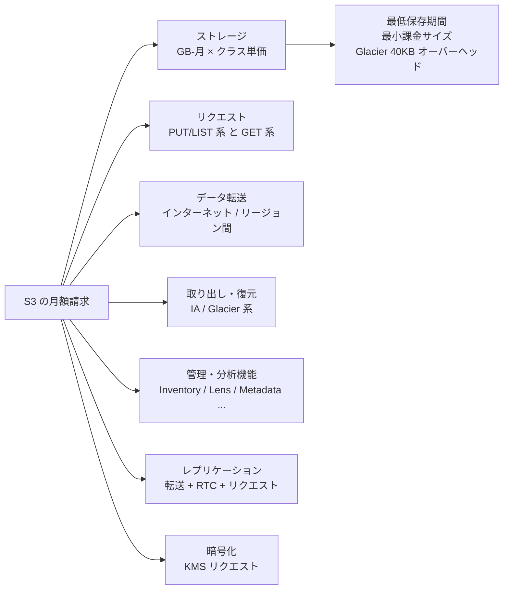

# S3 の料金モデル完全解説

_最終確認: 2026-10-03_

S3 の請求書は「容量 × 単価」だけでは決まらない。**ストレージ・リクエスト・データ転送・取り出し・管理機能・レプリケーション・暗号化 (KMS)** の 7 系統が積み上がる。この章ではそれぞれの単価と課金の仕組み、ハマりどころ、具体的な試算例、最適化チェックリストをまとめる。

価格の前提:

- リージョンは **us-east-1 (バージニア北部)**、通貨は USD
- 確認日は **2026-10-03**
- 主な出典は AWS Price List API (`AmazonS3` オファー publicationDate 2026-09-28、`AWSDataTransfer`、`AmazonS3GlacierDeepArchive`、`AmazonGlacier`、`awskms`、`AmazonVPC`) と S3 料金ページ・FAQ・What's New
- 料金は改定される。本番の見積もりは必ず AWS Pricing Calculator と最新の料金ページで再確認すること

機械可読な価格は `data/storage-classes.json` (クラス別) と `data/s3-pricing.json` (転送) にある。

## 1. 請求の全体像



| 系統             | 何に対して課金されるか                  | 無料になるもの                                                                                      |
| ---------------- | --------------------------------------- | --------------------------------------------------------------------------------------------------- |
| ストレージ       | 保存量 (バイト時間を月で平均した GB-月) | —                                                                                                   |
| リクエスト       | API 呼び出しの回数                      | DELETE / CANCEL、アカウント・組織外からの 403                                                       |
| データ転送       | S3 から出ていくバイト                   | 受信 (IN)、同一リージョン内の AWS サービス宛て、CloudFront 宛て、月 100 GB までのインターネット向け |
| 取り出し         | IA / Glacier 系から読み出したバイト     | Standard / Intelligent-Tiering、Glacier Flexible の Bulk                                            |
| 管理機能         | 監視対象オブジェクト数、処理件数など    | Storage Lens の無料メトリクス                                                                       |
| レプリケーション | 転送、宛先側の PUT とストレージ、RTC    | —                                                                                                   |
| 暗号化           | SSE-KMS の KMS API 呼び出し             | SSE-S3 (無料)                                                                                       |

## 2. ストレージ料金

### 2.1 単価表 (GB-月)

| クラス                                     | 単価                                           |
| ------------------------------------------ | ---------------------------------------------- |
| Standard (最初の 50 TB)                    | $0.023                                         |
| Standard (次の 450 TB)                     | $0.022                                         |
| Standard (500 TB 超)                       | $0.021                                         |
| Intelligent-Tiering Frequent Access        | Standard と同じ段階 ($0.023 / $0.022 / $0.021) |
| Intelligent-Tiering Infrequent Access      | $0.0125                                        |
| Intelligent-Tiering Archive Instant Access | $0.004                                         |
| Intelligent-Tiering Archive Access         | $0.0036                                        |
| Intelligent-Tiering Deep Archive Access    | $0.00099                                       |
| Express One Zone                           | $0.11                                          |
| Standard-IA                                | $0.0125                                        |
| One Zone-IA                                | $0.01                                          |
| Glacier Instant Retrieval                  | $0.004                                         |
| Glacier Flexible Retrieval                 | $0.0036                                        |
| Glacier Deep Archive                       | $0.00099                                       |
| Reduced Redundancy (レガシー, 最初の 1 TB) | $0.024                                         |
| S3 Tables (最初の 50 TB)                   | $0.0265                                        |
| S3 Vectors                                 | $0.06                                          |
| Annotations                                | $0.023                                         |
| S3 Files (ファイルシステム側のストレージ)  | $0.30                                          |

### 2.2 「GB-月」の計算方法

S3 はバイト時間 (byte-hours) を積算し、月末に GB-月に換算する。

```text
例: 30 日の月に、
  最初の 15 日間は 100 GB、
  残り 15 日間は 300 GB を保存した場合

  GB-月 = (100 GB × 15 日 × 24 h + 300 GB × 15 日 × 24 h) / (30 日 × 24 h)
        = 200 GB-月
  Standard の料金 = 200 × $0.023 = $4.60
```

段階料金は **アカウント (Organizations の一括請求ならファミリー全体) のリージョン合計** に対して適用される。バケットを分けても段階はリセットされない。

### 2.3 ストレージ料金に「隠れて」乗るもの

| 項目                         | 内容                                                                                                                                  |
| ---------------------------- | ------------------------------------------------------------------------------------------------------------------------------------- |
| 最小課金サイズ               | Standard-IA / One Zone-IA / Glacier IR は 128 KB 未満を 128 KB として課金                                                             |
| 最低保存期間                 | Standard-IA / One Zone-IA 30 日、Glacier IR / Glacier Flexible 90 日、Deep Archive 180 日。満了前の削除・上書き・遷移で残り期間を課金 |
| Glacier 系オーバーヘッド     | Glacier Flexible / Deep Archive はオブジェクトごとに 8 KB (Standard 料金) + 32 KB (Glacier 料金)                                      |
| 復元コピー                   | Glacier から復元した一時コピーは、指定日数の間 Standard 料金で課金 (アーカイブ本体と二重)                                             |
| noncurrent version           | バージョニング有効時の旧版もフルに課金                                                                                                |
| delete marker                | ほぼサイズゼロだが、大量に溜まると LIST が遅くなる                                                                                    |
| 未完了の multipart upload    | アップロード済みパートは Complete か Abort するまで課金され続ける                                                                     |
| Intelligent-Tiering 監視料金 | 128 KB 以上のオブジェクト 1,000 個あたり月 $0.0025                                                                                    |

## 3. リクエスト料金

### 3.1 リクエストの 2 系統

S3 のリクエストは大きく 2 系統で単価が違う。

| 系統                      | 含まれる API                                                                                                                              | Standard の単価    |
| ------------------------- | ----------------------------------------------------------------------------------------------------------------------------------------- | ------------------ |
| Tier 1 (書き込み・列挙系) | PUT, COPY, POST, LIST (ListObjectsV2, ListObjectVersions, ListBuckets など)、CreateMultipartUpload / UploadPart / CompleteMultipartUpload | $0.005 / 1,000 件  |
| Tier 2 (読み取り系)       | GET, SELECT, HEAD, その他                                                                                                                 | $0.0004 / 1,000 件 |
| 無料                      | DELETE, CANCEL (AbortMultipartUpload)                                                                                                     | $0                 |

**LIST は GET ではなく PUT と同じ高い方の単価** という点が重要。LIST は GET の 12.5 倍高い。

### 3.2 クラス別リクエスト単価

| クラス                     | Tier 1 (1,000 件) | Tier 2 (1,000 件) |
| -------------------------- | ----------------- | ----------------- |
| Standard                   | $0.005            | $0.0004           |
| Intelligent-Tiering        | $0.005            | $0.0004           |
| Express One Zone           | $0.00113          | $0.00003          |
| Standard-IA                | $0.01             | $0.001            |
| One Zone-IA                | $0.01             | $0.001            |
| Glacier Instant Retrieval  | $0.02             | $0.01             |
| Glacier Flexible Retrieval | $0.03             | $0.0004           |
| Glacier Deep Archive       | $0.05             | $0.0004           |
| S3 Tables                  | $0.005            | $0.0004           |

### 3.3 Multipart Upload のリクエスト数

multipart は「1 オブジェクト = 1 PUT」ではない。

```text
1 GB のファイルを 100 MB パートで multipart upload した場合
  CreateMultipartUpload  1 件
  UploadPart            11 件 (100 MB × 10 + 24 MB × 1)
  CompleteMultipartUpload 1 件
  合計                  13 件 (Tier 1)
```

Glacier Deep Archive に直接 multipart で入れる場合、価格表上 UploadPart / CreateMultipartUpload は $0.005 / 1,000 件、CompleteMultipartUpload と PutObject / CopyObject は $0.05 / 1,000 件と単価が分かれている。

### 3.4 2024 年の変更: 不正な 403 リクエストは非課金に

かつては、他人が自分のバケット名に対して無差別にリクエストを送ってきた場合でも、`403 AccessDenied` を返したリクエストの料金をバケット所有者が払っていた。2024 年に「空のバケットに大量の PUT が飛んできて高額請求」という事例が話題になったことを受け、AWS は課金を変更した。

| 項目             | 内容                                                                                                  |
| ---------------- | ----------------------------------------------------------------------------------------------------- |
| 発表             | 2024-05-13                                                                                            |
| 適用             | 数週間で大半の S3 API に展開完了 (2024-08 に完了を告知)                                               |
| 対象             | **アカウント外または AWS Organization 外から発生し、HTTP 403 (Access Denied) で拒否されたリクエスト** |
| 非課金になるもの | リクエスト料金と帯域 (転送) 料金                                                                      |
| 対象範囲         | 全リージョンの全 S3 バケット (GovCloud、中国リージョン含む)                                           |
| 利用者側の作業   | 不要                                                                                                  |

注意: 自分のアカウント・組織内からのリクエストが 403 になった場合は従来どおり課金対象。また 403 以外のエラー (404 など) の扱いは別。

## 4. データ転送料金

### 4.1 転送の向きと料金

```text
                         ┌─────────────── us-east-1 ────────────────┐
  Internet ──IN 無料──▶  │  S3 ◀────── 無料 ──────▶ EC2 / Lambda   │
  Internet ◀─OUT 課金──  │   │         (同一リージョン)               │
                         │   │──▶ CloudFront 無料 (origin fetch)     │
                         │   │──▶ 他リージョン 課金 ($0.01〜$0.02/GB) │
                         └───┴──────────────────────────────────────┘
```

| 経路                                                              | 単価 (us-east-1 発) |
| ----------------------------------------------------------------- | ------------------- |
| インターネットから S3 へ (IN)                                     | 無料                |
| S3 から同一リージョンの EC2 / Lambda などへ                       | 無料                |
| S3 から CloudFront へ                                             | 無料                |
| S3 から us-east-2 (オハイオ) へ                                   | $0.01 / GB          |
| S3 から他リージョン (例: us-west-2, eu-west-1, ap-northeast-1) へ | $0.02 / GB          |
| S3 からインターネットへ (OUT)                                     | 段階制 (次表)       |

### 4.2 インターネット向け (DTO) の段階料金

| 月間転送量                      | 単価                                                |
| ------------------------------- | --------------------------------------------------- |
| 最初の 100 GB                   | 無料 (全 AWS サービス・全リージョン合計で月 100 GB) |
| 最初の 10 TB (無料枠を超えた分) | $0.09 / GB                                          |
| 次の 40 TB                      | $0.085 / GB                                         |
| 次の 100 TB                     | $0.07 / GB                                          |
| 150 TB 超                       | $0.05 / GB                                          |

月 100 GB の無料枠は 2021-12 から (それ以前は 1 GB)。CloudFront からの配信には別途 CloudFront 側の無料枠 (月 1 TB) と料金体系がある (CloudFront の料金は本書の範囲外)。

### 4.3 「AWS から出ていく」ときの転送無料化 (2024-03)

2024-03 に AWS は、**AWS から別のクラウドやオンプレミスへ移行する顧客のインターネット向け転送料金を免除** すると発表した (欧州データ法の方向性に沿ったもので、全世界・全リージョンが対象)。

| 項目       | 内容                                                                                                          |
| ---------- | ------------------------------------------------------------------------------------------------------------- |
| 申請方法   | AWS サポートに「free data transfer to move off AWS」として申請                                                |
| 審査       | アカウント単位。承認されると移行データ分のクレジットが付与される                                              |
| 期限       | 当初は 60 日以内の移行完了。2025-09-30 の更新で 90 日に延長 (S3 FAQ などは 60 日のまま残っているとの指摘あり) |
| 対象外     | CloudFront, Direct Connect, Snow Family, Global Accelerator などの専用サービスからの転送                      |
| その他条件 | 良好な状態のアクティブアカウント。保存データが 100 GB 未満のアカウントは追加クレジットの対象外                |
| 注意       | 移行以外の目的と判断された場合、クレジット分を請求されうる                                                    |

アカウントを閉じる必要はなく、AWS との関係を続けたまま一部ワークロードを移すこともできる。

### 4.4 Transfer Acceleration

CloudFront のエッジロケーション経由で長距離のアップロード/ダウンロードを高速化する機能。**通常の転送料金に上乗せ** で課金される。

| 方向                                               | 単価 (上乗せ分)                                              |
| -------------------------------------------------- | ------------------------------------------------------------ |
| インターネット → S3 (米国・欧州・日本のエッジ経由) | $0.04 / GB                                                   |
| インターネット → S3 (その他のエッジ経由)           | $0.08 / GB                                                   |
| S3 → インターネット                                | $0.04 / GB                                                   |
| S3 ↔ 他リージョン (アクセラレーション経由)         | $0.04 / GB (一部リージョン、例: ジャカルタ宛ては $0.10 / GB) |

Transfer Acceleration の製品ページには「高速化された転送に対してのみ支払う (you pay only for transfers that are accelerated)」と記載されている。

### 4.5 VPC からのアクセス経路: NAT Gateway vs Gateway Endpoint

プライベートサブネットの EC2 から S3 に行く経路で料金が劇的に変わる。

| 経路                                       | 時間課金        | 処理データ課金           | 備考                                               |
| ------------------------------------------ | --------------- | ------------------------ | -------------------------------------------------- |
| NAT Gateway 経由                           | $0.045 / 時     | $0.045 / GB              | VPC 料金ページの例示 (us-east-2) の値              |
| Gateway VPC エンドポイント                 | 無料            | 無料                     | ルートテーブルで S3 宛てを誘導。同一リージョンのみ |
| Interface VPC エンドポイント (PrivateLink) | $0.01 / 時 / AZ | $0.01 / GB (最初の 1 PB) | オンプレや他リージョンからのプライベート接続向け   |

同一リージョンの S3 には **Gateway エンドポイントを作るだけで NAT の処理料金がゼロになる**。これは S3 コスト最適化で最も費用対効果が高い施策の一つ。

## 5. 取り出し・復元料金

| クラス                                            | オプション             | GB あたり                         | リクエスト             |
| ------------------------------------------------- | ---------------------- | --------------------------------- | ---------------------- |
| Standard-IA / One Zone-IA                         | —                      | $0.01                             | (通常の GET 料金)      |
| Glacier Instant Retrieval                         | —                      | $0.03                             | (GET $0.01 / 1,000)    |
| Glacier Flexible Retrieval                        | Expedited (1〜5 分)    | $0.03                             | $10 / 1,000            |
| Glacier Flexible Retrieval                        | Standard (3〜5 時間)   | $0.01                             | $0.05 / 1,000          |
| Glacier Flexible Retrieval                        | Bulk (5〜12 時間)      | 無料                              | 無料                   |
| Glacier Deep Archive                              | Standard (12 時間以内) | $0.02                             | $0.10 / 1,000          |
| Glacier Deep Archive                              | Bulk (48 時間以内)     | $0.0025                           | $0.025 / 1,000         |
| Intelligent-Tiering Archive Access                | Expedited              | $0.03                             | $0.01 / 件             |
| Intelligent-Tiering Archive / Deep Archive Access | Standard / Bulk        | 無料                              | 無料                   |
| Express One Zone                                  | upload / retrieval     | upload $0.0032、retrieval $0.0006 | (通常のリクエスト料金) |
| Glacier Flexible の Provisioned Capacity          | —                      | $100 / ユニット / 月              | —                      |

復元時は「取り出し料金」+「復元コピーの Standard 料金 (指定日数)」+「その後の GET とデータ転送」がかかる。

## 6. 管理・分析機能の料金

| 機能                                                      | 単価                                                                                       | 何に対して                                             |
| --------------------------------------------------------- | ------------------------------------------------------------------------------------------ | ------------------------------------------------------ |
| S3 Inventory                                              | $0.0025 / 100 万オブジェクト                                                               | リストされたオブジェクト数 (レポート 1 回ごと)         |
| S3 Storage Lens 無料メトリクス                            | 無料                                                                                       | 既定のダッシュボード                                   |
| S3 Storage Lens 高度なメトリクス                          | 最初の 250 億: $0.20 / 100 万オブジェクト / 月、250 億〜1,000 億: $0.16、1,000 億超: $0.12 | 監視対象オブジェクト数                                 |
| Storage Class Analysis (S3 Analytics)                     | $0.10 / 100 万オブジェクト / 月                                                            | 監視対象オブジェクト数                                 |
| オブジェクトタグ                                          | $0.0065 / 10,000 タグ / 月 (Price List API の値)                                           | 付与されたタグ数                                       |
| Batch Operations                                          | ジョブあたり $0.25 + 100 万オブジェクト操作あたり $1.00                                    | ジョブ数・操作数 (+ 実行される API 自体の料金)         |
| Batch Operations マニフェスト自動生成                     | $0.015 / 100 万オブジェクト (ソースバケット内)                                             |                                                        |
| S3 Metadata (ジャーナルテーブル)                          | $0.30 / 100 万更新                                                                         | 記録された変更イベント数 (2025-07 に 33% 値下げ後の値) |
| S3 Metadata (ライブインベントリテーブル)                  | 初回バックフィル課金 + 10 億オブジェクト超のバケットは $0.10 / 100 万オブジェクト / 月     |                                                        |
| S3 Metadata (annotation テーブル)                         | $0.002 / GB 処理                                                                           |                                                        |
| Annotations                                               | ストレージ $0.023 / GB-月、リクエスト Tier1 $0.005 / 1,000、Tier2 $0.0004 / 1,000          |                                                        |
| Intelligent-Tiering 監視・自動化                          | $0.0025 / 1,000 オブジェクト / 月                                                          | 128 KB 以上のオブジェクト                              |
| Access Grants                                             | $0.03 / 1,000 リクエスト                                                                   | GetDataAccess などの API                               |
| 追加チェックサム計算 (Batch で既存オブジェクトに付与など) | $0.004 / GB 処理                                                                           |                                                        |
| S3 Select                                                 | スキャン $0.002 / GB、返却 $0.0007 / GB (Standard)                                         | 新規顧客には提供終了 (既存顧客は継続利用可)            |

## 7. レプリケーションの料金

S3 Replication (同一リージョン SRR / クロスリージョン CRR) では次が積み上がる。

| 項目                           | 内容                                                                                       |
| ------------------------------ | ------------------------------------------------------------------------------------------ |
| 宛先のストレージ               | 宛先バケットで指定したクラスの単価                                                         |
| 宛先への PUT リクエスト        | 宛先クラスの Tier 1 単価 (オブジェクトごと)                                                |
| リージョン間転送 (CRR のみ)    | us-east-1 → us-east-2 は $0.01 / GB、他リージョンへは $0.02 / GB                           |
| Replication Time Control (RTC) | 転送量に $0.015 / GB を追加 (99.99% を 15 分以内に複製する SLA つき)                       |
| Replication metrics / 通知     | CloudWatch メトリクスとして課金                                                            |
| Batch Replication              | Batch Operations の料金 (ジョブ + 操作 + マニフェスト生成)                                 |
| KMS                            | SSE-KMS オブジェクトの場合、送信元での復号と宛先での暗号化の KMS リクエスト                |
| Multi-Region Access Points     | データルーティング料金 $0.0033 / GB (リージョン間の基本転送、us-east-1 との組み合わせの例) |

## 8. 暗号化 (KMS) のコストと S3 Bucket Keys

| 方式                                          | 追加料金                                                   |
| --------------------------------------------- | ---------------------------------------------------------- |
| SSE-S3 (2023-01 から全新規オブジェクトの既定) | 無料                                                       |
| SSE-KMS (AWS マネージドキー `aws/s3`)         | KMS リクエスト料金                                         |
| SSE-KMS (カスタマーマネージドキー)            | キー $1 / 月 (キーバージョンごと) + KMS リクエスト料金     |
| DSSE-KMS (二層暗号化)                         | KMS 料金 + 復号データ $0.003 / GB                          |
| SSE-C                                         | S3 側の追加料金なし (2026-04 から新規バケットで既定無効化) |

KMS リクエスト料金は **$0.03 / 10,000 リクエスト** (対称キー、月 20,000 リクエストまで無料枠)。

SSE-KMS では、**オブジェクトの PUT ごとに GenerateDataKey、GET ごとに Decrypt** が KMS に飛ぶ。高頻度アクセスのバケットでは KMS 料金が S3 本体より高くなることがある。さらに KMS には API ごとのリクエストレートクォータがあり、スロットリングの原因にもなる。

**S3 Bucket Keys** を有効にすると、S3 がバケット単位の短期キーを KMS から取得して使い回すため、KMS へのリクエストが大幅に減り、**KMS リクエスト料金を最大 99% 削減** できる (公式の表現)。

```text
例: SSE-KMS のバケットで月 1 億 PUT + 10 億 GET

Bucket Keys なし: (1 億 + 10 億) / 10,000 × $0.03 = $3,300 / 月
Bucket Keys あり: 最大 99% 削減 → $33 / 月 程度まで下がりうる
```

注意: Bucket Keys は DSSE-KMS では使えない。また、CloudTrail に記録される KMS イベントの暗号化コンテキストがオブジェクト ARN ではなくバケット ARN になるため、オブジェクト単位の暗号化コンテキストに依存したポリシーは見直しが必要。

## 9. 無料利用枠 (Free Tier)

AWS Free Tier は 2025-07-15 に大きく変わった。

| 区分                                           | 内容                                                                                                                                                                                              |
| ---------------------------------------------- | ------------------------------------------------------------------------------------------------------------------------------------------------------------------------------------------------- |
| 2025-07-15 より前に作成したアカウント (従来型) | 12 か月間、S3 Standard 5 GB、GET 20,000 件、PUT 2,000 件 / 月 (加えて全サービス共通のインターネット向け転送 100 GB / 月)                                                                          |
| 2025-07-15 以降に作成したアカウント (新方式)   | サインアップ時に $100 のクレジット、EC2 や Bedrock などの利用で最大さらに $100 (合計最大 $200)。「無料プラン」は 6 か月またはクレジットを使い切るまで。期間後は有料プランへのアップグレードが必要 |
| 共通                                           | インターネット向け転送は全サービス合計で月 100 GB まで無料 (これは Free Tier とは別の恒常的な枠)                                                                                                  |

S3 固有の「5 GB / 20,000 GET / 2,000 PUT」は S3 FAQ で「1 年間」の枠、つまり 12 か月無料の特典として説明されている。AWS Free Tier ページは 12 か月無料の特典を「Legacy Free Tier の顧客のみ」とし、Legacy Free Tier FAQ は Legacy を 2025-07-15 より前に作成したアカウント向けと定義している。したがって新方式のアカウントにはこの S3 の枠は無く、S3 の利用はクレジットから充当される。S3 料金ページの記載は「新規顧客は最大 $200 の Free Tier クレジット。無料プランはアカウント作成から 6 か月、クレジットは作成から 12 か月以内に使い切る必要がある」。

## 10. 試算例

以下はすべて us-east-1、30 日の月を想定した概算。端数は丸めている。

### 10.1 例 1: 10 TB の静的アセット配信

前提: 10 TB (10,240 GB) を Standard に保存、月 1 億 GET、インターネット向け 50 TB 配信。

**パターン A: S3 から直接配信**

| 項目                     | 計算                                                    | 月額          |
| ------------------------ | ------------------------------------------------------- | ------------- |
| ストレージ               | 10,240 GB × $0.023                                      | $235.52       |
| GET                      | 100,000,000 / 1,000 × $0.0004                           | $40.00        |
| 転送 (50 TB = 51,200 GB) | 100 GB 無料、10,240 GB × $0.09、残り 40,860 GB × $0.085 | $4,394.70     |
| 合計                     |                                                         | **約 $4,670** |

**パターン B: CloudFront 経由で配信** (キャッシュヒット率 95% と仮定)

| 項目                    | 計算                                   | 月額    |
| ----------------------- | -------------------------------------- | ------- |
| ストレージ              | 同上                                   | $235.52 |
| GET (origin fetch のみ) | 5,000,000 / 1,000 × $0.0004            | $2.00   |
| S3 → CloudFront 転送    | 無料                                   | $0      |
| CloudFront の配信料金   | CloudFront の料金表による (本書範囲外) | 別途    |

教訓: 配信量が大きいワークロードでは **転送料金がストレージ料金の 18 倍以上** になる。S3 単体のコストを下げるより、CloudFront を前段に置いて S3 の GET と DTO を減らす方が効く。

### 10.2 例 2: 1 PB のアーカイブ

前提: 1 PB (1,048,576 GB)、平均 1 GB のオブジェクト約 105 万個。年に 1 回、全体の 10% (100 TB) を復元する。

| 保存先                     | 月額ストレージ | 年額ストレージ |
| -------------------------- | -------------- | -------------- |
| Standard (段階料金)        | $22,583.30     | 約 $271,000    |
| Glacier Instant Retrieval  | $4,194.30      | 約 $50,300     |
| Glacier Flexible Retrieval | $3,774.87      | 約 $45,300     |
| Glacier Deep Archive       | $1,038.09      | 約 $12,460     |

Deep Archive を選んだ場合の付随コスト:

| 項目                                     | 計算                                                                     | 金額                                          |
| ---------------------------------------- | ------------------------------------------------------------------------ | --------------------------------------------- |
| 初回投入 (PUT を Deep Archive に直接)    | 1,048,576 / 1,000 × $0.05                                                | 約 $52 (multipart の場合パート数分の追加あり) |
| 40 KB オーバーヘッド                     | 105 万 × 8 KB ≒ 8 GB を Standard、105 万 × 32 KB ≒ 32 GB を Deep Archive | 月 $0.2 程度 (無視できる)                     |
| 年 1 回の Bulk 復元 (100 TB)             | 102,400 GB × $0.0025 + リクエスト                                        | 約 $256                                       |
| 復元コピーを 7 日保持                    | 102,400 GB × $0.023 × 7/30                                               | 約 $550                                       |
| 復元データを Standard 取り出しにした場合 | 102,400 GB × $0.02                                                       | 約 $2,048 (Bulk の 8 倍)                      |

教訓: アーカイブは **オブジェクトを大きくまとめる** (平均 1 GB なら 40 KB オーバーヘッドは誤差) と **急がない復元は Bulk** の 2 点で決まる。もし平均 100 KB のオブジェクトが 100 億個だったら、オーバーヘッドだけで (1) 8 KB × 100 億 ≒ 74.5 TiB (76,294 GB) を Standard 料金で 51,200 GB × $0.023 + 25,094 GB × $0.022 ≒ 月 $1,730、(2) 32 KB × 100 億 ≒ 298 TiB (305,176 GB) を Deep Archive 料金で 305,176 GB × $0.00099 ≒ 月 $302、合計で月約 $2,030 を払うことになる。

### 10.3 例 3: LIST が多いデータレイク

前提: 100 TB を Standard に保存。小さな Parquet ファイルが 2 億個。Athena / Spark で月 5 億 GET、5,000 万 LIST + PUT。

| 項目       | 計算                                    | 月額          |
| ---------- | --------------------------------------- | ------------- |
| ストレージ | 51,200 GB × $0.023 + 51,200 GB × $0.022 | $2,304.00     |
| GET        | 500,000,000 / 1,000 × $0.0004           | $200.00       |
| LIST + PUT | 50,000,000 / 1,000 × $0.005             | $250.00       |
| 合計       |                                         | **約 $2,754** |

ここで「全部 Intelligent-Tiering にすれば安くなる?」を検討すると、

| 項目                                                  | 計算                                | 月額     |
| ----------------------------------------------------- | ----------------------------------- | -------- |
| 監視料金 (2 億オブジェクトがすべて 128 KB 以上の場合) | 200,000,000 / 1,000 × $0.0025       | $500.00  |
| 半分 (50 TB) が IA 層に落ちた場合の削減               | 51,200 GB × ($0.022 - $0.0125) 程度 | 約 -$486 |

小さいファイルが多いと監視料金が削減分を食いつぶす。先に **コンパクション (小さなファイルを数百 MB 単位にまとめる)** をしてオブジェクト数を 1/100 にすれば、LIST・GET・監視料金がまとめて下がる。S3 Tables (自動コンパクション付き) を使う選択肢もある (S3 Tables のストレージは $0.0265 / GB-月と Standard より高く、監視料金 $0.025 / 1,000 オブジェクト / 月、コンパクション $0.002 / 1,000 オブジェクト + $0.005 / GB 処理がかかる)。

### 10.4 例 4: NAT Gateway 経由の S3 アクセス

前提: プライベートサブネットの EC2 が同一リージョンの S3 と月 10 TB やりとりする。

| 経路                            | 計算                                     | 月額    |
| ------------------------------- | ---------------------------------------- | ------- |
| NAT Gateway (1 台)              | 730 時間 × $0.045 + 10,240 GB × $0.045   | 約 $494 |
| Interface エンドポイント (2 AZ) | 730 時間 × $0.01 × 2 + 10,240 GB × $0.01 | 約 $117 |
| Gateway エンドポイント          | 無料                                     | **$0**  |

S3 本体の料金は同じでも、経路だけで月 $494 の差が出る。

### 10.5 例 5: クロスリージョンレプリケーション

前提: us-east-1 から us-west-2 へ、月 10 TB の新規データを CRR。宛先は Standard-IA、平均オブジェクト 10 MB (約 100 万オブジェクト)。

| 項目                   | 計算                                       | 月額                         |
| ---------------------- | ------------------------------------------ | ---------------------------- |
| リージョン間転送       | 10,240 GB × $0.02                          | $204.80                      |
| RTC (使う場合)         | 10,240 GB × $0.015                         | $153.60                      |
| 宛先 PUT (Standard-IA) | 1,048,576 / 1,000 × $0.01                  | 約 $10.49                    |
| 宛先ストレージ         | 宛先リージョンの Standard-IA 単価 × 保存量 | 宛先リージョンの料金表による |

## 11. コストの落とし穴

| 落とし穴                                             | 何が起きるか                                        | 典型的な金額感                                                        | 対策                                                      |
| ---------------------------------------------------- | --------------------------------------------------- | --------------------------------------------------------------------- | --------------------------------------------------------- |
| 小さいオブジェクトを IA / Glacier IR に置く          | 128 KB の最小課金で Standard より高くなる           | 4 KB × 100 万個: Standard 月 $0.09 → Standard-IA 月 $1.53             | サイズフィルタ、集約、Standard のまま                     |
| 小さいオブジェクトを Glacier 系へ遷移                | 遷移料金 + 40 KB オーバーヘッドで永遠に回収できない | 10 KB × 1,000 万個を Deep Archive: 遷移料金 $500 に対し削減ほぼゼロ   | 2024-09 以降の既定 (128 KB 未満は遷移しない) を維持       |
| ライフサイクル遷移の件数を見落とす                   | 遷移はオブジェクト 1 個ごとに課金                   | 1 億オブジェクトを Glacier IR へ: $2,000                              | オブジェクト数を先に把握 (Storage Lens / Inventory)       |
| 未完了の multipart upload                            | 見えないパートが課金され続ける                      | 失敗したバッチが TB 単位で残ることも                                  | `AbortIncompleteMultipartUpload` ルール (例: 7 日)        |
| バージョニングの旧版                                 | 上書きのたびに旧版が積み上がる                      | 毎日全上書きのバケットは 30 日で約 30 倍                              | `NoncurrentVersionExpiration` / `NewerNoncurrentVersions` |
| delete marker の蓄積                                 | LIST が遅くなる                                     | —                                                                     | `ExpiredObjectDeleteMarker` で掃除                        |
| NAT Gateway 経由の S3 アクセス                       | $0.045 / GB の処理料金                              | 10 TB で月約 $460                                                     | Gateway VPC エンドポイント                                |
| SSE-KMS で Bucket Keys なし                          | KMS リクエスト料金が S3 本体を超える                | 11 億リクエストで月 $3,300                                            | S3 Bucket Keys                                            |
| LIST で全件走査                                      | LIST は Tier 1 単価 (GET の 12.5 倍)                | 10 億オブジェクトの全走査 1 回 = 100 万 LIST = $5 (毎時なら月 $3,600) | S3 Inventory / S3 Metadata                                |
| Glacier の Standard / Expedited 復元を多用           | Bulk の数倍〜十数倍                                 | 100 TB を Deep Archive から Standard 復元: $2,048 vs Bulk $256        | 急がないものは Bulk                                       |
| 早期削除                                             | 最低保存期間前の削除で残り期間を課金                | Deep Archive は 180 日分                                              | 保存期間とクラスを合わせる                                |
| Intelligent-Tiering に小〜中サイズの大量オブジェクト | 監視料金が削減額を上回る                            | 2 億オブジェクトで月 $500                                             | 集約するか Standard / ライフサイクルで明示的に管理        |
| リージョン間アクセス                                 | クロスリージョン GET でも転送料金                   | $0.02 / GB                                                            | コンピュートとバケットを同じリージョンに                  |
| リクエスタ払いを使わない公開データセット             | 他人の DL 料金を自分が払う                          | —                                                                     | Requester Pays バケット                                   |
| 外部からの 403 攻撃                                  | 2024 年以降は非課金 (自組織内からの 403 は課金)     | —                                                                     | 組織内の誤設定アプリは自分で直す                          |

## 12. コスト最適化チェックリスト

### 12.1 まず可視化

- [ ] **S3 Storage Lens** のダッシュボードで、バケット別・クラス別・prefix 別の容量、noncurrent version の比率、未完了 multipart のバイト数を確認する
- [ ] **Cost Explorer** で S3 の請求を usage type 別 (TimedStorage, Requests-Tier1, DataTransfer-Out など) に分解する
- [ ] **コスト配分タグ** をバケットに付けて、チーム / プロジェクト別に按分する
- [ ] オブジェクト数とサイズ分布を **S3 Inventory** か **S3 Metadata の live inventory テーブル** で把握する (128 KB 未満が何割か)
- [ ] **Storage Class Analysis** で、Standard → Standard-IA に移せるデータの年齢を推定する

### 12.2 ストレージ

- [ ] すべてのバケットに `AbortIncompleteMultipartUpload` (例: 7 日) を設定する
- [ ] バージョニング有効バケットに `NoncurrentVersionExpiration` (と必要なら `NewerNoncurrentVersions`) を設定する
- [ ] 期限切れの delete marker を `ExpiredObjectDeleteMarker` で掃除する
- [ ] アクセスパターンが不明なデータは Intelligent-Tiering を既定クラスにする (ただし小さいオブジェクトが大量なら試算してから)
- [ ] アクセスパターンが明確なデータはライフサイクルで明示的に遷移させる
- [ ] 小さいファイルは集約 (tar、Parquet のコンパクション、S3 Tables) してから階層化する
- [ ] 最低保存期間とデータ保持期間を突き合わせる (30 日で消すデータを IA に置かない)
- [ ] Reduced Redundancy が残っていたら Standard か Intelligent-Tiering に移す
- [ ] 不要になったバケット・prefix・テストデータを Expiration で消す

### 12.3 リクエスト

- [ ] LIST で全件走査している処理を Inventory / S3 Metadata に置き換える
- [ ] 小さいオブジェクトの大量 PUT を、バッチ化や集約で減らす
- [ ] 頻繁に読むデータは CloudFront などでキャッシュし、S3 の GET を減らす
- [ ] 超高頻度アクセスのホットデータは Express One Zone のリクエスト単価 (GET $0.00003 / 1,000) と比較する

### 12.4 転送

- [ ] VPC から S3 へは **Gateway VPC エンドポイント** を使い、NAT Gateway を経由させない
- [ ] インターネット配信は CloudFront を前段に置く (S3 → CloudFront は無料)
- [ ] コンピュートとバケットのリージョンを揃える
- [ ] 公開データセットや他社への提供は Requester Pays を検討する
- [ ] Transfer Acceleration は速度テストで効果を確認してから使う
- [ ] AWS から移行で出ていく場合は、サポートに転送料金免除を申請する

### 12.5 暗号化・その他

- [ ] SSE-KMS のバケットでは **S3 Bucket Keys** を有効にする
- [ ] 要件がなければ SSE-S3 (無料) を使う
- [ ] Glacier 系の復元は可能な限り Bulk にし、復元コピーの保持日数を最小にする
- [ ] Storage Lens 高度なメトリクスや Storage Class Analysis は、必要なバケット / prefix に絞って有効化する (監視オブジェクト数で課金されるため)
- [ ] CRR の RTC は SLA が本当に必要なルールにだけ付ける

## 参考文献

- [Amazon S3 pricing](https://aws.amazon.com/s3/pricing/)
- [AWS Price List API: AmazonS3 offer (us-east-1)](https://pricing.us-east-1.amazonaws.com/offers/v1.0/aws/AmazonS3/current/us-east-1/index.json)
- [AWS Price List API: AWSDataTransfer offer (us-east-1)](https://pricing.us-east-1.amazonaws.com/offers/v1.0/aws/AWSDataTransfer/current/us-east-1/index.json)
- [AWS Price List API: AmazonS3GlacierDeepArchive offer (us-east-1)](https://pricing.us-east-1.amazonaws.com/offers/v1.0/aws/AmazonS3GlacierDeepArchive/current/us-east-1/index.json)
- [AWS Price List API: AmazonGlacier offer (us-east-1)](https://pricing.us-east-1.amazonaws.com/offers/v1.0/aws/AmazonGlacier/current/us-east-1/index.json)
- [AWS Price List API: awskms offer (us-east-1)](https://pricing.us-east-1.amazonaws.com/offers/v1.0/aws/awskms/current/us-east-1/index.json)
- [AWS Price List API: AmazonVPC offer (us-east-1)](https://pricing.us-east-1.amazonaws.com/offers/v1.0/aws/AmazonVPC/current/us-east-1/index.json)
- [Amazon S3 FAQs](https://aws.amazon.com/s3/faqs/)
- [Amazon S3 will no longer charge for several HTTP error codes (What's New, 2024-05)](https://aws.amazon.com/about-aws/whats-new/2024/05/amazon-s3-no-charge-http-error-codes/)
- [Amazon S3 no longer charges for several HTTP error codes (What's New, 2024-08)](https://aws.amazon.com/about-aws/whats-new/2024/08/amazon-s3-no-charges-several-http-error-codes/)
- [Free data transfer out to internet when moving out of AWS (AWS News Blog, 2024-03)](https://aws.amazon.com/blogs/aws/free-data-transfer-out-to-internet-when-moving-out-of-aws/)
- [AWS Global Network FAQs](https://aws.amazon.com/about-aws/global-infrastructure/global-network/faqs/)
- [AWS price reduction for data transfers out to the internet (What's New, 2021-11)](https://aws.amazon.com/about-aws/whats-new/2021/11/aws-price-reduction-data-transfers-internet/)
- [AWS Free Tier now offers $200 in credits and 6-month free plan (What's New, 2025-07)](https://aws.amazon.com/about-aws/whats-new/2025/07/aws-free-tier-credits-month-free-plan/)
- [AWS Free Tier](https://aws.amazon.com/free/)
- [Legacy AWS Free Tier FAQs](https://aws.amazon.com/free/legacy/free-tier-faqs/)
- [Reducing the cost of SSE-KMS with Amazon S3 Bucket Keys](https://docs.aws.amazon.com/AmazonS3/latest/userguide/bucket-key.html)
- [Amazon S3 Transfer Acceleration](https://aws.amazon.com/s3/transfer-acceleration/)
- [Querying data in place with Amazon S3 Select](https://docs.aws.amazon.com/AmazonS3/latest/userguide/selecting-content-from-objects.html)
- [Amazon VPC pricing (NAT Gateway)](https://aws.amazon.com/vpc/pricing/)
- [Gateway endpoints for Amazon S3](https://docs.aws.amazon.com/vpc/latest/privatelink/vpc-endpoints-s3.html)
- [Transitioning objects using Amazon S3 Lifecycle](https://docs.aws.amazon.com/AmazonS3/latest/userguide/lifecycle-transition-general-considerations.html)
- [Amazon S3 Metadata now supports existing objects and reduces price by up to 33% (What's New, 2025-07)](https://aws.amazon.com/about-aws/whats-new/2025/07/amazon-s3-metadata-existing-objects-reduces-price/)
- [Announcing up to 85% price reductions for Amazon S3 Express One Zone (AWS News Blog, 2025-04)](https://aws.amazon.com/blogs/aws/up-to-85-price-reductions-for-amazon-s3-express-one-zone/)
- [Amazon S3 starts rolling out new default security setting (SSE-C) (What's New, 2026-04)](https://aws.amazon.com/about-aws/whats-new/2026/04/s3-default-bucket-security-setting/)
