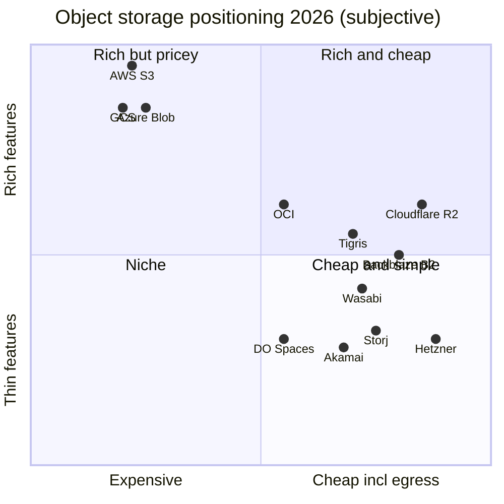
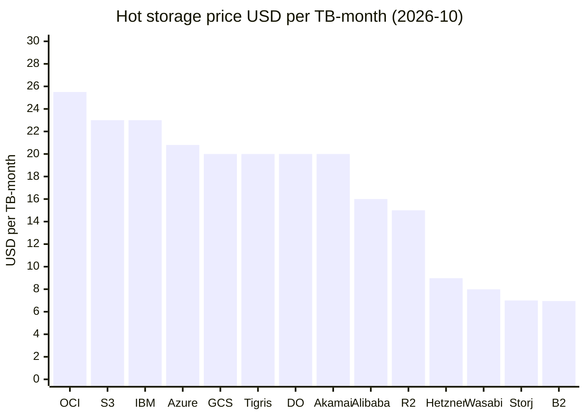
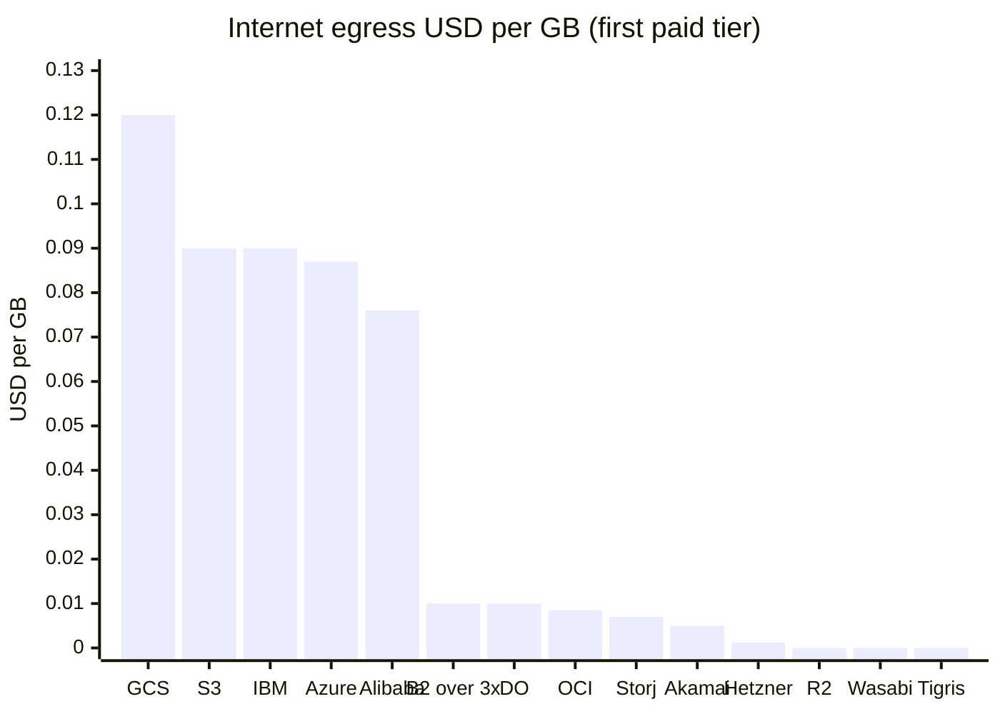
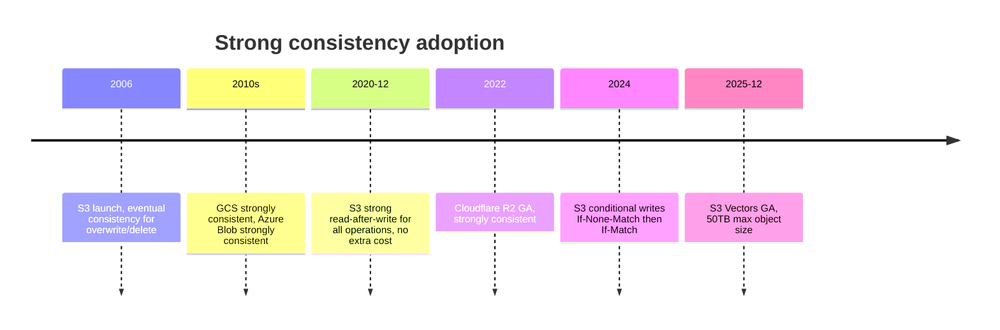
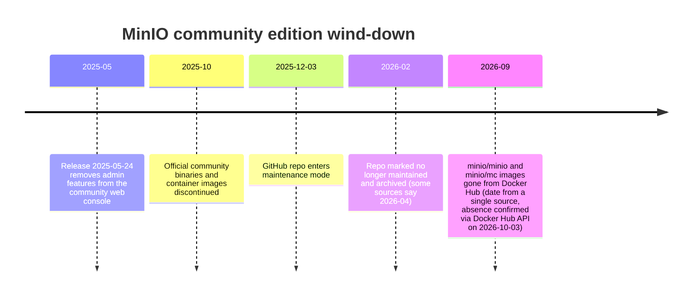
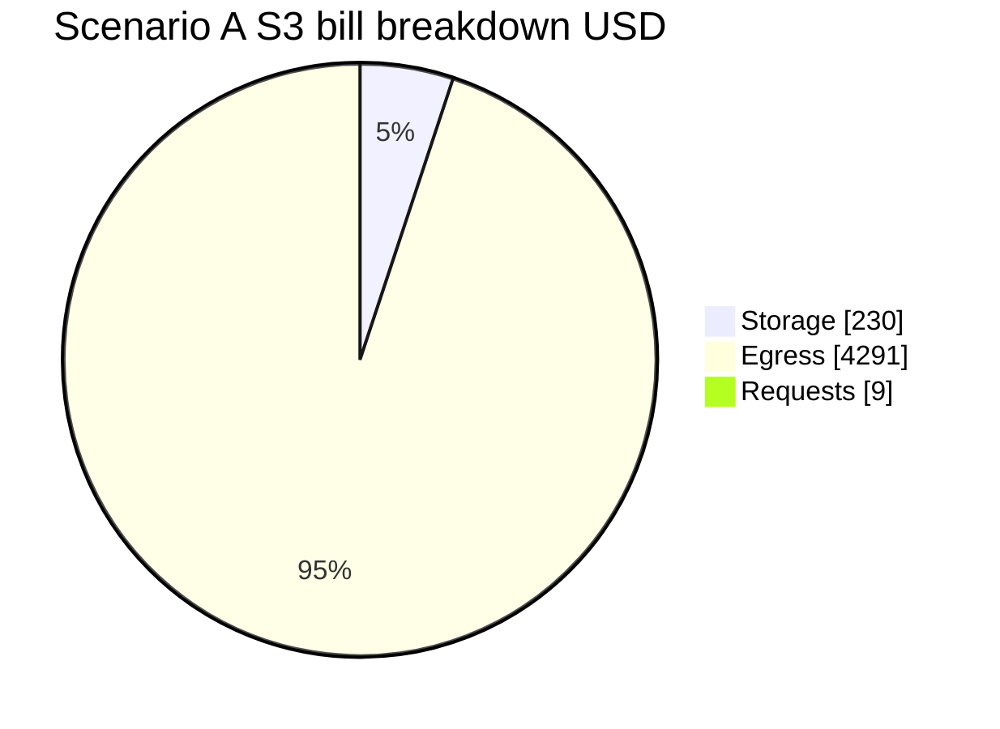
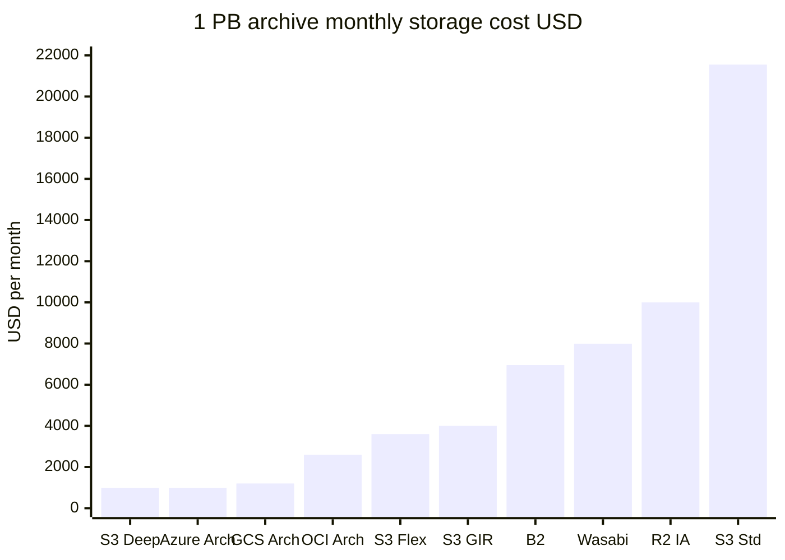
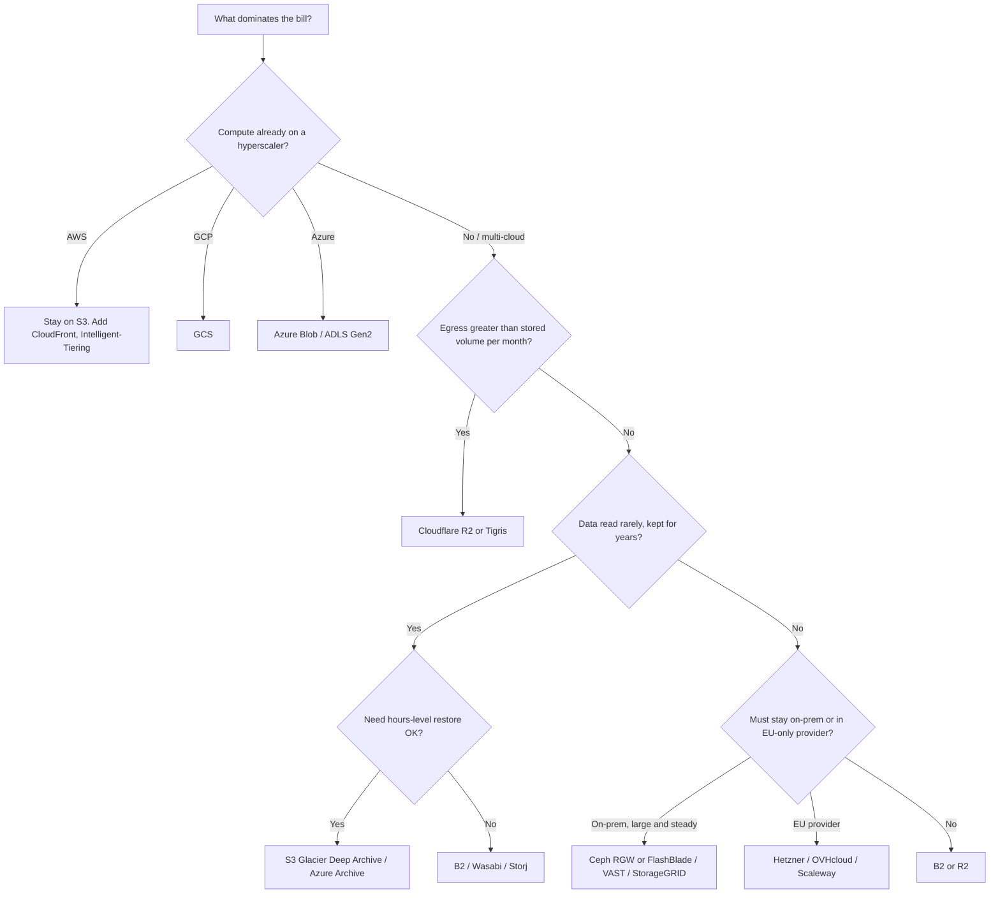
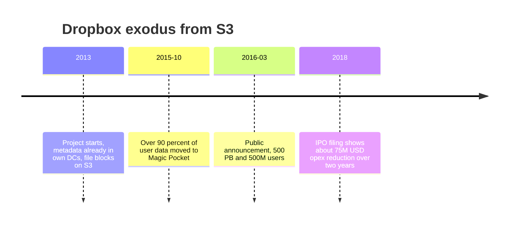
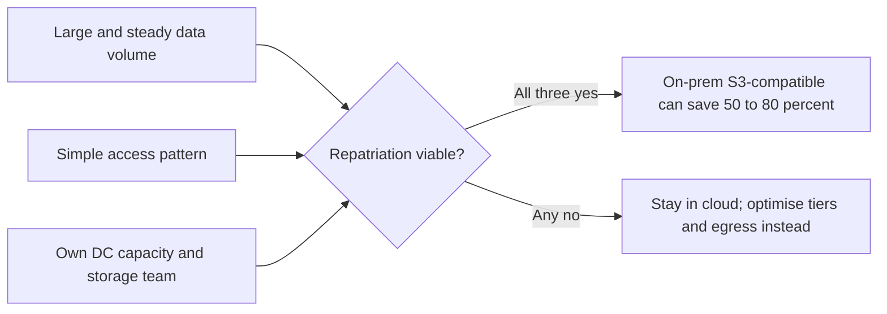

# 競合比較: S3 と「S3 互換」オブジェクトストレージ全景

_最終確認: 2026-10-03_

> この章のゴール: 「S3 以外に何があり、どれがいくらで、いつ S3 をやめるべきか」を、価格・機能・運用リスクの 3 軸で判断できるようになること。
> 価格は **2026-10-03 時点の公開定価 (US 系の代表リージョン、従量課金、税抜)**。値引き・EDP・コミット契約は含まない。数字の出典は末尾の参考文献にまとめた。主要プロバイダの単価は 2026-10-03 に各社の公式価格ページ (JavaScript 描画のページはブラウザで描画) または公式の価格 API で確認した。第三者情報しか取れなかった値は「第三者情報」と明記する。

## TL;DR

- **S3 の弱点はほぼ「egress ($0.09/GB)」と「料金の複雑さ」の 2 点に集約される**。保存単価 $0.023/GB-月は 2026 年時点でハイパースケーラーとしては標準的だが、alt-cloud (B2 / Wasabi / Hetzner / Storj) の 3 倍前後。
- **配信量が多いなら Cloudflare R2 (egress 無料) が最初の比較対象**。10TB 保存 + 50TB 配信/月のシナリオでは S3 約 $4,530 に対し R2 約 $150 と **30 倍** の差がつく (計算は後述)。
- **長期保存なら S3 Glacier Deep Archive ($0.00099/GB) と Azure Archive ($0.00099/GB) が最安クラス**。alt-cloud の「ホット 1 層しかない」モデルはアーカイブ用途では逆に高い。
- **2026 年は「ストレージ値上げの年」**。AI データセンター需要で HDD/NAND が逼迫し、Backblaze B2 ($6 → $6.95/TB, 2026-05-01)、Wasabi ($6.99 → $7.99/TB, 2026-07-01)、Hetzner (2026-04-01 に約 30%) が相次いで値上げ。ハイパースケーラーは標準層の定価を据え置いている。
- **セルフホストの勢力図が崩れた**。MinIO のコミュニティ版は 2025 年に管理 UI 削除 → バイナリ配布停止 → メンテナンスモード、2026 年にアーカイブ。新規なら Ceph RGW / Garage / SeaweedFS か商用 (AIStor 等) を選ぶ時代。
- **S3 API 互換は「品質のグラデーション」**。PUT/GET/マルチパートは誰でもできるが、バージョニング・Object Lock・レプリケーション・イベント・条件付き書き込みで差が出る。

## 1. 競合のマップ

### 1.1 カテゴリ分け

| カテゴリ | 代表 | 収益モデル | S3 に対する主戦場 |
| --- | --- | --- | --- |
| ハイパースケーラー | Google Cloud Storage, Azure Blob, OCI, IBM COS, Alibaba OSS | コンピュート + データの囲い込み | 「同じクラウド内のデータ置き場」として |
| エッジ / CDN 系 | Cloudflare R2, Akamai Object Storage | ネットワーク事業の付加価値 | egress 無料・格安で配信系を奪う |
| 低価格専業 (alt-cloud) | Backblaze B2, Wasabi, Hetzner, DigitalOcean Spaces | 容量単価の安さ | バックアップ / アーカイブ / 中小アプリ |
| 新興グローバル分散 | Tigris, Storj | アーキテクチャ差別化 | マルチリージョン配信、AI 推論 |
| セルフホスト OSS | MinIO (AIStor), Ceph RGW, SeaweedFS, Garage | サポート / 商用版 | オンプレ・エッジ・開発環境 |
| オンプレ商用 | VAST Data, Everpure (旧 Pure Storage) FlashBlade, NetApp StorageGRID, Dell ObjectScale/ECS | ハード + サブスク | リパトリエーション、AI 学習基盤 |

### 1.2 ポジショニング (主観的評価)

縦軸は「機能の厚さ (S3 互換度 + マネージド機能)」、横軸は「総コストの安さ (egress 込み)」。数値は本章の比較表をもとにした筆者の主観スコアで、計測値ではない。



読み方:

- **右上が空いている** のがこの市場の本質。「S3 並みの機能」と「egress 無料」を両立したプレイヤーはまだいない。R2 が最も近いが、バージョニングやレプリケーションがない。
- **左上 (ハイパースケーラー) はコンピュートとセットで買うもの**。ストレージ単体で比較すると必ず負ける。
- 右下の alt-cloud は「容量を安く置く」ことに特化し、データ活用 (テーブル、ベクトル、イベント駆動) は弱い。

## 2. 価格比較 (ホット層)

### 2.1 一覧表

単位は USD。`保存` は GB-月、`egress` はインターネット向け最初の課金ティア、リクエストは 1,000 件あたり。

| サービス | 保存 $/GB-月 | egress $/GB | PUT $/1k | GET $/1k | 最低保存期間 | 無料 egress の条件 |
| --- | --- | --- | --- | --- | --- | --- |
| AWS S3 Standard (us-east-1) | 0.023 (50TB 超で 0.022, 500TB 超で 0.021) | 0.09 (最初の 10TB) | 0.005 | 0.0004 | なし | 月 100GB (全サービス合算)、CloudFront 向けは無料 |
| Google Cloud Storage Standard (us-central1) | 0.020 | 0.12 (0〜10TiB) | 0.005 | 0.0004 | なし | 月 100GB (北米発、Always Free) |
| Azure Blob Hot LRS (East US) | 0.0208 | 0.087 (100GB 超〜10TB) | 0.005 | 0.0004 | なし | 月 100GB |
| Cloudflare R2 Standard | 0.015 | 0 | 0.0045 | 0.00036 | なし | 常に無料 |
| Backblaze B2 | 0.00695 | 0.01 (超過分) | 0 | 0 | なし | 平均保存量の 3 倍まで |
| Wasabi | 0.00799 | 0 | 0 | 0 | 90 日 | 月間 egress ≤ 保存量 (公正利用) |
| OCI Object Storage Standard | 0.0255 | 0.0085 | 0.00034 | 0.00034 | なし | 月 10TB |
| IBM COS Standard (Regional, us-south) | 0.023 (500TB 以上 0.0209) | 0.09 (0〜50TB) | 0.0052 | 0.00042 | なし | なし |
| Alibaba OSS Standard LRS (US Virginia) | 0.016 (最初の 5GB 無料) | 0.076 (100GB〜10TB) | 0.0014 (1 億件まで無料) | 0.0001 (5 億件まで無料) | なし | 月 100GB |
| DigitalOcean Spaces | $5/月に 250GiB 込み、超過 0.02 | 0.01 (1TiB 超) | 0 | 0 | なし | 1TiB/月 込み |
| Akamai Object Storage | $5/月に 250GB 込み、超過 0.02 | 0.005 (1TB 超) | 0 | 0 | なし | 1TB/月 込み (転送プール) |
| Hetzner Object Storage | 基本 $7.99 (EUR 6.49)/月に 1TB 込み、超過 $0.0123/TB-時 (≈ 0.00898/GB-月) | 0.0012 (超過 $1.20/TB、EUR 1.00/TB) | 0 | 0 | なし | 1TB/月 込み |
| Tigris Standard | 0.02 | 0 | 0.005 | 0.0005 | なし | 常に無料 |
| Storj Standard | 0.007 | 0.007 | 0 | 0 | 30 日 | なし |

注意点:

- GCS は公式価格ページをブラウザで描画して読んだ値。保存は時間単価 $0.000027397/GiB-時で、× 730 時間 ≈ $0.020/GiB-月。egress は 0〜10TiB $0.12/GiB、10〜150TiB $0.11、150TiB 超 $0.08。GCS の単位は GiB/TiB。一部サイトは「2026 年に GCS が値上げ」と書いているが、Google 公式の価格改定告知ページを読むと該当の改定は **2022-10 / 2023-04 発効** のもので、2026 年の新しい改定ではない。
- Azure は Retail Prices API (`prices.azure.com`) から直接取得した値。リクエストは 10,000 件単位 ($0.05 / $0.004) を 1,000 件に換算した。
- OCI は Oracle 公式の価格 API (`apexapps.oracle.com/pls/apex/cetools/api/v1/products`)、IBM は IBM Cloud カタログの料金タブ (Standard プラン、Regional、us-south)、Alibaba は公式価格ページでリージョンを US (Virginia) に切り替えた値。IBM の Class B ($0.0042/10,000 件) と Alibaba のリクエスト (書き込み $0.014、読み取り $0.001/10,000 件) は 1,000 件単位に換算した。
- Hetzner は製品ページが参照する公式価格 API の **USD 建て定価** (EUR 建てとは別の定価で、為替換算ではない)。EUR 建ては基本 EUR 6.49、超過保存 EUR 0.0087/TB-時、超過 egress EUR 1.00/TB。
- Storj は 2025〜2026 年に料金体系を何度も変更。最低月額は公式価格ページ (2026-10-03 確認) で **$5** (利用額が $5 未満なら $5 を請求、USDC 払いは対象外)。フォーラムで見られる「2026-07 から $50」という話は公式ページに反映されていない。

### 2.2 保存単価の可視化



Hetzner は公式 USD 建ての超過単価から計算した値 ($0.0123/TB-時 × 730 時間 ≈ $8.98/TB)。最初の 1TB は基本料金 $7.99 に含まれる。

### 2.3 egress 単価の可視化



**ハイパースケーラー 3 社の egress は alt-cloud の 10〜100 倍**。英国 CMA は 2025 年の最終決定で、大手の egress 料金が「平均コストを大きく上回る」水準にあると指摘している (第 10 章参照)。

### 2.4 ハイパースケーラーのアーカイブ層

| サービス | 層 | 保存 $/GB-月 | 最低保存期間 | 取り出し |
| --- | --- | --- | --- | --- |
| AWS | S3 Standard-IA | 0.0125 | 30 日 | $0.01/GB |
| AWS | S3 Glacier Instant Retrieval | 0.004 | 90 日 | ミリ秒、$0.03/GB |
| AWS | S3 Glacier Flexible Retrieval | 0.0036 | 90 日 | 分〜時間 |
| AWS | S3 Glacier Deep Archive | 0.00099 | 180 日 | 12〜48 時間 |
| Google | Nearline / Coldline / Archive (us-central1) | 0.010 / 0.004 / 0.0012 | 30 / 90 / 365 日 | 即時 (取り出し料金あり) |
| Azure | Archive LRS (East US) | 0.00099 | 180 日 | rehydrate 数時間、$0.02/GB (優先 $0.10/GB) |
| OCI | Archive | 0.0026 | 90 日 | 復元 1〜4 時間 (第三者情報) |
| Cloudflare R2 | Infrequent Access | 0.01 | 30 日 | $0.01/GB |
| Tigris | Archive | 0.004 | 90 日 | 復元型 |
| DigitalOcean | Spaces Cold | 0.007/GiB | 早期削除課金あり | $0.01/GiB |

AWS Glacier 系の価格は S3 価格ページ (us-east-1) で確認した既知の定価。GCS の Nearline/Coldline/Archive は公式価格ページの時間単価 ($0.000013699 / $0.000005479 / $0.000001644 per GiB-時) × 730 時間で、最低保存期間 30 / 90 / 365 日も同ページで確認した。OCI Archive の単価は Oracle 価格 API (B91633)。

## 3. 機能比較

### 3.1 主要機能マトリクス

凡例: ○ = あり / △ = 部分的・プレビュー・別のファーストパーティ製品経由 / × = なし、または公式の API/機能一覧に含まれない / ? = 公式ドキュメントに記載がない。全セルを 2026-10-03 に公式ドキュメントで確認した。? が残るのは Backblaze B2、DigitalOcean Spaces、Hetzner の強整合だけで、これらのドキュメントは read-after-write 整合性について何も書いていない。`data/competitors.json` では ○ と △ を `true`、× を `false`、? を `null` として扱う。

| サービス | S3 互換度 | 強整合 | Versioning | Object Lock | Lifecycle | Replication | Events | Iceberg/テーブル | Vector | CDN 統合 |
| --- | --- | --- | --- | --- | --- | --- | --- | --- | --- | --- |
| AWS S3 | ネイティブ | ○ (2020-12〜) | ○ | ○ | ○ | ○ (CRR/SRR) | ○ (EventBridge/SNS/SQS/Lambda) | ○ S3 Tables | ○ S3 Vectors | ○ CloudFront |
| GCS | △ (XML API + HMAC) | ○ | ○ | ○ Bucket Lock / Object Retention | ○ | ○ dual/multi-region | ○ Pub/Sub | ○ BigLake | × (Vertex AI は別製品) | ○ Cloud CDN |
| Azure Blob / ADLS Gen2 | × (独自 API) | ○ | ○ | ○ Immutable storage | ○ | ○ Object replication / GRS | ○ Event Grid | △ Fabric OneLake 経由 (Iceberg メタデータ仮想化) | × | ○ Front Door |
| Cloudflare R2 | 高 | ○ | × | △ bucket lock (独自) | ○ | × | ○ Queues 経由 | ○ Basin Catalog | × (Vectorize は別製品) | ○ |
| Backblaze B2 | 高 | ? (ドキュメントに記載なし) | ○ | ○ | ○ | ○ Cloud Replication | ○ (有料、利用は申請制) | × | × | × (提携 CDN のみ) |
| Wasabi | 高 | ○ (「immediate consistency」) | ○ | ○ | ○ | ○ | ○ (AWS SNS 経由で配信) | × | × | × (提携のみ) |
| OCI | △ | ○ | ○ | ○ Retention rules | ○ | ○ | ○ OCI Events | × (Autonomous AI Lakehouse で Iceberg をクエリ可。マネージドカタログの記載なし) | × | × |
| IBM COS | 高 | ○ | ○ | ○ | ○ | ○ | ○ | △ watsonx.data (Iceberg REST カタログ) | × | △ IBM Cloud Internet Services 経由 |
| Alibaba OSS | △ | ○ | ○ | ○ WORM | ○ | ○ CRR | ○ | △ OSS Tables (招待制プレビュー) | △ OSS Vectors (パブリックプレビュー) | ○ |
| DO Spaces | 高 | ? (ドキュメントに記載なし) | ○ (API のみ) | × | △ (期限切れ削除のみ) | × | × | × | × | ○ |
| Akamai | 高 | ○ | ○ | ○ (Governance/Compliance) | △ (期限切れ削除のみ) | × | × | × | × | ○ (Akamai CDN のオリジン) |
| Hetzner | 高 | ? (ドキュメントに記載なし) | ○ | ○ | △ (有効期限による削除) | × | × | × | × | × |
| Tigris | 高 | ○ (範囲はバケットのロケーション種別で決まる) | △ (スナップショット経由。PutBucketVersioning なし) | × | ○ | ○ 自動グローバル分散 | ○ (webhook) | × | × | ○ (分散キャッシュ) |
| Storj | 高 | ○ | ○ | ○ | × (オブジェクト単位の TTL のみ) | 不要 (分散) | × | × | × | × |
| MinIO / AIStor | 高 | ○ | ○ | ○ | ○ | ○ | ○ | ○ AIStor Tables | × | × |
| Ceph RGW | 高 | ○ (サイト内) | ○ | ○ | ○ | ○ multisite (非同期) | ○ | × | × | × |
| SeaweedFS | △ | ○ (レプリカ書き込み W=N) | ○ | ○ | △ (期限切れ削除のみ) | ○ | △ (filer の webhook/Kafka。S3 バケット通知はなし) | ○ S3 Table Buckets + Iceberg REST カタログ | △ Lance テーブルバケット | × |
| Garage | △ | ○ (デフォルトの `consistency_mode`) | × | × | △ (期限切れ等) | ○ (組み込み) | × | × | × | × |
| VAST Data | 高 | ○ | ○ | ○ | △ (ビュー単位の期限切れルール) | ○ | ○ (Kafka) | × (VAST DataBase。Iceberg カタログの記載なし) | ○ ベクトルインデックス | × |
| Everpure FlashBlade | 高 | ○ | ○ | ○ | △ (期限切れ) | ○ | × (サポート S3 操作に含まれない) | × | × | × |
| NetApp StorageGRID | 高 | ○ | ○ | ○ | ○ (ILM) | ○ CloudMirror | ○ (Kafka/webhook/SNS) | × | × | × |
| Dell ObjectScale / ECS | 高 | ○ | ○ | ○ | ○ | ○ 地理複製 | ○ (webhook。4.4 から Kafka) | ○ S3 Tables (4.4 で GA) | × | × |

R2 の S3 API 実装状況は公式ドキュメントで確認した。`GetBucketVersioning`、`PutBucketReplication`、通知設定 API、ACL、オブジェクトタグは **未実装**。一方で SSE-C と条件付きヘッダ (`If-Match` など) は実装済み。

### 3.2 「S3 互換」の 4 段階

S3 互換は 0/1 ではない。筆者は次の 4 段階で見ている。

| レベル | できること | 代表 | 移行時の注意 |
| --- | --- | --- | --- |
| L1: CRUD | PUT/GET/DELETE/List、署名 v4 | ほぼ全員 | ここまでならエンドポイント差し替えで動く |
| L2: 大容量 | マルチパート、Range GET、presigned URL、SSE | ほぼ全員 | パートサイズ上限、ETag 計算の違いに注意 |
| L3: データ保護 | Versioning、Object Lock (Compliance/Governance)、Lifecycle、Replication | B2, Wasabi, Ceph, MinIO, StorageGRID, FlashBlade | バックアップソフトの immutability 機能はここに依存 |
| L4: 新世代 API | 条件付き書き込み (`If-None-Match` / `If-Match`)、チェックサム (CRC64NVME 等)、S3 Express、S3 Tables/Vectors | AWS (全部)、R2 (条件付き書き込み)、Tigris 等 (一部) | 「S3 をデータベースとして使う」系 OSS (第 10 章) は L4 前提 |

**L4 が新しい差別化軸**。2024 年に S3 が条件付き書き込みを入れて以降、WarpStream / SlateDB / turbopuffer のような「S3 の上に作るシステム」は CAS (compare-and-swap) を前提に設計するようになった。互換ストレージ側がここを実装していないと、こうした OSS が動かない。

### 3.3 整合性モデル



2020 年以前、「S3 は結果整合」というのが常識で、Netflix の S3mper や EMRFS の consistent view など、整合性を補うレイヤーが必要だった。現在は主要クラウドすべてが強整合。**セルフホストのマルチサイト構成 (Ceph multisite など) はサイト間で結果整合** なので、ここが一番の落とし穴になる。

## 4. 各サービス詳説

### 4.1 Google Cloud Storage

- **ポジショニング**: Google のデータ/AI 基盤 (BigQuery, Vertex AI, Dataflow) の土台。単体で選ばれるより「BigQuery を使うから GCS」というケースが大半。
- **価格**: Standard us-central1 $0.020/GiB-月。インターネット egress は 0〜10TiB $0.12/GiB、10〜150TiB $0.11、150TiB 超 $0.08 (公式価格ページ)。Class A $0.005/1k、Class B $0.0004/1k (flat namespace。hierarchical namespace は $0.0065 / $0.0005)。
- **ストレージクラス**: Standard / Nearline (30 日) / Coldline (90 日) / Archive (365 日)。**Archive でもミリ秒で読める** のが S3 Glacier Deep Archive との大きな違い。Autoclass で自動階層化。
- **ユニーク機能**: dual-region / multi-region バケット (単一名前空間で地理冗長)、Turbo Replication (RPO 15 分)、強整合な list。
- **弱点**: S3 互換は「XML API + HMAC キー」での互換で、AWS SDK をそのまま向けると細部 (一部ヘッダ、バージョニング API の差) で詰まる。egress は 3 社で最も高い。2023 年改定で multi/dual-region の Class A 操作単価が 2 倍になった。
- **EU 向け**: EU Data Act を見据え、同一組織内のマルチクラウド転送を無料化する Data Transfer Essentials を提供。

### 4.2 Azure Blob Storage / ADLS Gen2

- **ポジショニング**: Microsoft エンタープライズの標準データ置き場。ADLS Gen2 (階層型名前空間を有効化した Blob) が Fabric / Synapse / Azure Databricks の基盤。
- **価格**: Hot LRS East US $0.0208/GB (50TB 超 $0.019968、500TB 超 $0.019136)。Write $0.05/10k、Read $0.004/10k。egress は 100GB 無料、次の 10TB $0.087、次の 40TB $0.083、次の 100TB $0.07。
- **ストレージクラス**: Hot / Cool / Cold / Archive。Archive LRS は $0.00099/GB-月で Deep Archive と同額。冗長性は LRS / ZRS / GRS / RA-GRS / GZRS で価格が変わる。
- **ユニーク機能**: 階層型名前空間によるアトミックなディレクトリ rename / POSIX ACL (Hadoop 系のコミットプロトコルに有利)、Blob index tags、Entra ID 統合。
- **弱点**: **S3 API がない**。S3 前提のツールを使うにはゲートウェイ (自前の S3 プロキシ等) が必要。価格マトリクスが複雑。
- **EU 向け**: 2025 年 8 月下旬から EU 顧客向けに、他クラウドとの間のデータ転送を原価ベースにする施策を開始 (サポートリクエスト経由)。

### 4.3 Cloudflare R2

- **ポジショニング**: 「egress 税」への正面からの挑戦者。2021 年発表、2022 年 GA。Cloudflare のネットワーク収益で egress を吸収する。
- **価格**: Standard $0.015/GB、Infrequent Access $0.01/GB (30 日最低、取り出し $0.01/GB)。Class A $4.50/100 万、Class B $0.36/100 万。egress 無料。無料枠 10GB + Class A 100 万 + Class B 1,000 万。削除と MPU 中断は無料。
- **ユニーク機能**: Workers からのバインディング、Sippy (S3 からの遅延移行)、Super Slurper (一括移行)、イベント通知 (Queues 経由)、bucket lock (保持ルール)、Basin Catalog (旧 R2 Data Catalog、Iceberg REST カタログ、GA)、jurisdiction (EU / FedRAMP)。
- **弱点**: バージョニングなし、レプリケーションなし、S3 Object Lock API ではなく独自の bucket lock。**「消したら戻せない」ので、バックアップの最終保管先にするには一工夫いる**。
- **向く用途**: 公開アセット配信、ML データセットのマルチクラウド共有、Workers アプリ。

### 4.4 Backblaze B2

- **ポジショニング**: 低価格専業の老舗。上場企業 (NASDAQ: BLZE) で財務情報が公開されている点は安心材料。
- **価格**: $6.95/TB-月 (2026-05-01 に $6.00 から値上げ)。同時に **API コールを無料化** (Event Notifications を除く)。egress は平均保存量の 3 倍まで無料、超過 $0.01/GB。最低保存期間なし。高スループット版 B2 Overdrive は $15/TB で egress 無制限。
- **ユニーク機能**: Cloud Replication、Object Lock、提携 CDN (Cloudflare, Fastly 等) やコンピュート (Vultr 等) への egress 無料。
- **弱点**: リージョンが少ない、分析・AI 系のマネージド機能なし。
- **向く用途**: バックアップ (Veeam / restic / rclone)、メディアアーカイブ、CDN オリジン。

### 4.5 Wasabi

- **ポジショニング**: 「egress も API も無料の定額ホットストレージ」。バックアップベンダーとの提携が厚い。
- **価格**: $7.99/TB-月 (2026-07-01 に $6.99 から値上げ。理由はストレージハードウェア・電力・DC コスト)。egress / API 無料。
- **落とし穴**: **90 日最低保存** (オブジェクト単位)、**1TB 最低課金**、**月間 egress が保存量を超えると公正利用ポリシー違反** になりうる。配信用途には向かない。
- **向く用途**: 書いたら 90 日以上消さない、ほとんど読まないバックアップ。

### 4.6 Oracle OCI Object Storage

- **ポジショニング**: ハイパースケーラーの中で唯一、egress を本気で安くしているプレイヤー。
- **価格**: Standard $0.0255/GB-月 (全リージョン同一、最初の 10GB 無料)、Infrequent Access $0.01、Archive $0.0026。egress は **月 10TB 無料**、以降 $0.0085/GB (北米/欧州発)。リクエスト $0.0034/10,000 件 (最初の 50,000 件無料)。値は Oracle 公式の価格 API (パーツ番号 B91628 / B93000 / B91633 / B88327 / B91627) で確認した。
- **弱点**: S3 Compatibility API はサブセット。ホット保存単価は S3 より高い。
- **向く用途**: Oracle DB / OCI ワークロード、egress がそこそこ多いが alt-cloud には行けない企業。

### 4.7 IBM Cloud Object Storage

- **ポジショニング**: 2015 年に買収した Cleversafe の分散型イレイジャーコーディングが起源。クラウドとオンプレソフトの両方で提供。
- **価格**: IBM Cloud カタログの料金タブ (Standard プラン、Regional、us-south) で Standard クラス $0.0230/GB-月 (500TB 以上 $0.0209)、Smart Tier Hot $0.0219。Class A $0.0052/1,000 件、Class B $0.0042/10,000 件。**パブリック egress は 0〜50TB $0.09/GB、次の 100TB $0.07、次の 350TB $0.05** で無料枠なし。料金はロケーションと冗長性で変わる。egress・API 込み USD 10/TB からの One-Rate プランもある (IBM 発表、カタログでは期間限定と表記)。
- **向く用途**: IBM Cloud / watsonx を使う規制業界。

### 4.8 Alibaba Cloud OSS

- **ポジショニング**: 中国本土・APAC で最大級。ネイティブ API は OSS API で、S3 互換は部分的。
- **価格**: 公式価格ページ (US Virginia) で Standard LRS $0.0160/GB-月 (最初の 5GB 無料、GB = GiB)、Standard ZRS $0.02。インターネット egress は 100GB 無料、100GB〜10TB $0.076/GB、10〜50TB $0.069、50〜150TB $0.060、150TB 超 $0.043。Standard の API は書き込み 1 億件・読み取り 5 億件まで無料、以降 $0.014 / $0.001 (10,000 件)。料金はリージョンごとに異なる (例: 香港は保存 $0.017、egress $0.118)。中国本土外では OSS から Alibaba CDN への転送が無料。
- **向く用途**: 中国本土のユーザーにサービスする場合はほぼ一択。

### 4.9 DigitalOcean Spaces

- **価格**: 月 $5 で 250GiB 保存 + 1TiB 転送。超過 $0.02/GiB、転送超過 $0.01/GiB。Cold 層 $0.007/GiB (128KiB 最小課金、早期削除課金あり)。CDN 込み。
- **弱点**: バケット単位のレート制限、レプリケーション・イベント通知なし。
- **向く用途**: DigitalOcean 上のアプリのアセット置き場。

### 4.10 Akamai Object Storage (旧 Linode)

- **価格**: 月 $5 で 250GB 保存、1TB 転送をアカウントの転送プールに追加。保存超過 $0.02/GB、**転送超過 $0.005/GB** (ジャカルタ $0.015、サンパウロ $0.007)。API リクエスト課金は現時点なし。E3 エンドポイントへのリクエスト課金は **2027-10-01 より前には導入しない** と公式ドキュメントに記載。
- **弱点**: エンドポイント種別 (E0〜E3) ごとのアカウント/バケット容量・レート上限。
- **向く用途**: 転送量が支配的なダウンロード配信。

### 4.11 Hetzner Object Storage

- **価格**: 基本 $7.99 / EUR 6.49 (月額上限、時間課金。EUR は 2026-04-01 に EUR 4.99 から改定) で 1TB 保存 + 1TB egress。超過保存は $0.0123 / EUR 0.0087 per TB-時 (EUR は旧 0.0067)。超過 egress は $1.20 / EUR 1.00 per TB (公式価格 API で確認)。API と ingress は無料。バケットが 1 つでもあれば空でも基本料金がかかる。
- **制約**: ドイツ (FSN1 / NBG1) とフィンランド (HEL1) のみ。バケットあたり 100TB / 5,000 万オブジェクト、最大 100 バケット。
- **向く用途**: Hetzner のサーバーと同居する EU のコスト重視ワークロード。

### 4.12 Tigris

- **ポジショニング**: 「グローバルに 1 つのバケット」。データは読まれるリージョンへ自動的にキャッシュ/移動する。Fly.io と提携。
- **価格**: Standard $0.02、Infrequent Access $0.01 (30 日)、Archive $0.004 (90 日)。Class A $0.005/1k、Class B $0.0005/1k。**全地域 egress 無料・同一価格**。
- **弱点**: 歴史が浅く、長期の耐久性実績は短い。マイナー API の網羅は発展途上。
- **向く用途**: モデル重みの配布、マルチリージョンアプリのユーザーアセット。

### 4.13 Storj

- **ポジショニング**: 分散型 (DePIN 系)。データをイレイジャーコーディングで断片化し、世界中のノード運営者のディスクに分散する。
- **価格**: Standard 保存 $7/TB、egress $7/TB。Advanced (旧 Regional Workflows、米国 SOC2 DC) $10/TB。30 日最低保持、50KB 最小オブジェクト。セグメント料金は廃止。
- **弱点**: 料金体系が 2025〜2026 年に何度も変わった (Global Collaboration $15/TB 等の 3 層 → 現在の 2 層)。小オブジェクトのレイテンシ。
- **向く用途**: 大きなファイルの並列ダウンロード、バックアップ。

### 4.14 セルフホスト OSS

#### MinIO (2025〜2026 年の激変)

MinIO は長年「セルフホストの S3 互換といえば MinIO」だったが、2025 年に方向転換した。



- ライセンス (AGPLv3) 自体は変わっていない。終わったのは **メンテナンスと配布**。コードは fork 可能で、コンソールを復活させたコミュニティ fork も出ている。
- 商用版 **AIStor** は開発継続。ただし有償ライセンス必須。
- **教訓**: 単一企業が支配する OSS は、ライセンスを変えなくても「配布とメンテを止める」だけで実質的に閉じられる。ストレージのようにデータが重い基盤ほど、この依存リスクは大きい。

#### Ceph RGW

- RADOS (分散オブジェクトストア) の上の S3/Swift ゲートウェイ。CERN や OpenStack 系クラウドでエクサバイト級の実績。
- Versioning / Object Lock / Lifecycle / bucket notifications / multisite replication を備え、S3 互換度は高い。
- 欠点は運用の重さ。**専任のストレージエンジニアがいない組織では選ぶべきでない**。

#### SeaweedFS

- Facebook Haystack 論文由来の設計で、大量の小ファイルに強い。Apache 2.0。
- Filer を介して S3 / WebDAV / FUSE を提供。S3 API の網羅は MinIO / Ceph より狭い。

#### Garage

- Deuxfleurs (フランスの非営利) 製。低スペック機をインターネット越しに束ねる地理分散を前提に設計。CRDT ベースのメタデータ。AGPLv3。
- Versioning / Object Lock は **なし**。ホームラボや小規模サービス向け。MinIO 離れの移行先として 2025 年後半から事例が増えた。

### 4.15 オンプレ商用

| 製品 | 特徴 | 典型ユースケース |
| --- | --- | --- |
| VAST Data | オールフラッシュの分離型 (DASE) アーキテクチャ。同じデータにファイル/オブジェクト/テーブルでアクセス。ベクトル・DB 機能も内蔵 | GPU クラウド、AI 学習データとチェックポイント |
| Everpure (旧 Pure Storage) FlashBlade | 2026 年 2 月に社名を Everpure に変更。高速ファイル + オブジェクト。S3 互換 API | 37signals の S3 脱出先。分析・バックアップ |
| NetApp StorageGRID | ポリシー駆動 ILM、マルチサイト分散、クラウドプールへの階層化 | NetApp 既存顧客のアーカイブ |
| Dell ObjectScale / ECS | 長期運用のエンタープライズ向け。地理複製 | Dell 標準化企業のバックアップ/分析 |

Gartner の評価軸: 2025 年に Gartner は「Primary Storage」と「Distributed File Systems and Object Storage (File and Object Storage Platforms)」の 2 つの MQ を **「Enterprise Storage Platforms」MQ に統合** した (2025-09-02 公開)。Leaders は Dell, HPE, Huawei, IBM, NetApp, Pure Storage の 6 社。最後の単独版 (2024 File and Object Storage Platforms) では Dell, Pure, VAST 等が Leaders。**AWS S3 のようなパブリッククラウドストレージはこの MQ の対象外** で、AWS は「Strategic Cloud Platform Services」側で評価される。

## 5. コストシナリオ比較 (計算過程つき)

### 5.1 前提

- 1TB = 1,000GB の 10 進換算で計算 (AWS/Azure は 1TB = 1,000GB または 1,024GB の扱いがサービスにより異なり、数 % の誤差が出る)。
- 従量課金の定価、US 系代表リージョン、税抜、無料枠は明記したものだけ控除。
- シナリオ A のみリクエスト (PUT 100 万 / GET 1,000 万) を含める。B / C は保存 + egress のみ。
- Hetzner は公式の USD 建て定価で計算し、EUR 建て定価での結果も併記する (為替換算はしない)。
- GCS は GiB/TiB 単位で課金されるが、ここでは GiB ≈ GB とみなし、ティア境界だけ公式どおり 10TiB = 10,240GB とした。

### 5.2 シナリオ A: 10TB 保存 + 50TB/月 egress (配信型 SaaS)

**AWS S3 Standard**:

```text
保存   10,000 GB x $0.023                         = $230.00
egress 最初 100 GB 無料
       9,900 GB x $0.09   (〜10TB ティア)          = $891.00
       40,000 GB x $0.085 (次の 40TB ティア)       = $3,400.00
PUT    1,000,000 / 1,000 x $0.005                 = $5.00
GET    10,000,000 / 1,000 x $0.0004               = $4.00
合計                                              ≈ $4,530
```

**Google Cloud Storage**:

```text
保存   10,000 GB x $0.020                         = $200.00
egress 最初 100 GB 無料 (Always Free)
       10,140 GB x $0.12  (〜10TiB ティア)        = $1,216.80
       39,760 GB x $0.11  (10〜150TiB ティア)     = $4,373.60
PUT/GET (S3 と同単価)                              = $9.00
合計                                              ≈ $5,799
```

**Azure Blob Hot LRS**:

```text
保存   10,000 GB x $0.0208                        = $208.00
egress 100 GB 無料, 10,000 GB x $0.087 + 39,900 GB x $0.083
       = 870 + 3,311.70                           = $4,181.70
Write  1,000,000 / 10,000 x $0.05                 = $5.00
Read   10,000,000 / 10,000 x $0.004               = $4.00
合計                                              ≈ $4,399
```

**Cloudflare R2**:

```text
保存   (10,000 - 10 無料) GB x $0.015             = $149.85
Class A 1,000,000 件 → 無料枠 100 万件内            = $0
Class B 10,000,000 件 → 無料枠 1,000 万件内         = $0
egress                                            = $0
合計                                              ≈ $150
```

**Backblaze B2**:

```text
保存   10 TB x $6.95                              = $69.50
egress 無料枠 = 保存量の 3 倍 = 30 TB
       超過 20,000 GB x $0.01                      = $200.00
API    無料                                        = $0
合計                                              ≈ $270
```

**OCI**:

```text
保存   10,000 GB x $0.0255                        = $255.00
egress 10 TB 無料, 40,000 GB x $0.0085            = $340.00
要求   11,000,000 / 10,000 x $0.0034              ≈ $3.74
合計                                              ≈ $599
```

**その他**:

```text
Tigris       保存 10,000 x 0.02 = 200, PUT 1M x 0.005/1k = 5, GET 10M x 0.0005/1k = 5, egress 0      ≈ $210
Storj        保存 10 TB x $7 = 70, egress 50 TB x $7 = 350                                          ≈ $420
Akamai       基本 5 + 保存 (10,000 - 250) x 0.02 = 195, egress (50,000 - 1,000) x 0.005 = 245      ≈ $445
DO Spaces    基本 5 + 保存 (10,000 - 250) x 0.02 = 195, egress (50,000 - 1,024) x 0.01 ≈ 489.76    ≈ $690
Hetzner      基本 $7.99 + 保存 9 TB x $0.0123 x 730 h ≈ 80.81, egress 49 TB x $1.20 = 58.80          ≈ $148
             (EUR 建て: 6.49 + 9 x 0.0087 x 730 ≈ 57.16 + 49 x 1.00 = 49                         ≈ EUR 113)
Wasabi       保存 10 TB x $7.99 = 79.90 だが egress 50 TB > 保存 10 TB で公正利用ポリシー違反       → 不適合
```

| サービス | 月額 (概算) | S3 比 |
| --- | --- | --- |
| GCS | $5,799 | 1.28 |
| AWS S3 | $4,530 | 1.00 |
| Azure Blob | $4,399 | 0.97 |
| DO Spaces | $690 | 0.15 |
| OCI | $599 | 0.13 |
| Akamai | $445 | 0.10 |
| Storj | $420 | 0.09 |
| B2 | $270 | 0.06 |
| Tigris | $210 | 0.05 |
| R2 | $150 | 0.03 |
| Hetzner | $148 (EUR 113) | 0.03 |
| Wasabi | 不適合 | - |



**結論 A**: S3 の請求の **95% が egress**。配信型ワークロードを S3 から直接配るのは、2026 年においても最も高くつく選択。最低でも CloudFront を前段に置く (S3 → CloudFront 間は無料で、CloudFront の egress は量に応じて S3 直より安く、無料枠も大きい) か、配信用コピーを R2 等に置くべき。

### 5.3 シナリオ B: 1PB アーカイブ (ほぼ読まない)

1PB = 1,000,000GB。取り出しは年数回の想定で保存費のみ比較。

```text
S3 Glacier Deep Archive   1,000,000 x 0.00099 = $990
Azure Archive LRS         1,000,000 x 0.00099 = $990
GCS Archive (us-central1) 1,000,000 x 0.0012  = $1,200
OCI Archive               1,000,000 x 0.0026  ≈ $2,600
S3 Glacier Flexible       1,000,000 x 0.0036  = $3,600
S3 Glacier Instant        1,000,000 x 0.004   = $4,000
Tigris Archive            1,000,000 x 0.004   = $4,000
Backblaze B2              1,000 TB x $6.95    = $6,950
Storj Standard            1,000 TB x $7       = $7,000
Wasabi                    1,000 TB x $7.99    = $7,990
Cloudflare R2 IA          1,000,000 x 0.01    = $10,000
S3 Standard (参考)        50,000 x 0.023 + 450,000 x 0.022 + 500,000 x 0.021
                          = 1,150 + 9,900 + 10,500 = $21,550
```



**結論 B**: アーカイブでは **ハイパースケーラーの深層アーカイブが alt-cloud より 7〜8 倍安い**。「S3 は高い」は「ホット層 + egress」に限った話。ただし Deep Archive は 180 日最低保存・取り出し 12〜48 時間・取り出し料金があるので、「年に何回、どれだけ戻すか」を必ず見積もること。1PB 全量を一度に取り出すと、取り出し料金 + egress で月額保存費の何十倍にもなる。

### 5.4 シナリオ C: 100TB 保存 + 10TB/月 egress (社内データ基盤・中規模メディア)

```text
AWS S3      保存 50,000 x 0.023 + 50,000 x 0.022 = 2,250   egress 9,900 x 0.09 = 891          ≈ $3,141
GCS         保存 100,000 x 0.020 = 2,000           egress (10,000 - 100 無料) x 0.12 = 1,188  ≈ $3,188
Azure       保存 51,200 x 0.0208 + 48,800 x 0.019968 ≈ 2,039   egress 9,900 x 0.087 ≈ 861   ≈ $2,901
OCI         保存 100,000 x 0.0255 = 2,550          egress 10 TB 無料 = 0                      ≈ $2,550
DO Spaces   5 + (100,000 - 250) x 0.02 = 2,000     egress (10,000 - 1,024) x 0.01 ≈ 90        ≈ $2,090
Akamai      5 + (100,000 - 250) x 0.02 = 2,000     egress 9,000 x 0.005 = 45                  ≈ $2,045
Tigris      保存 100,000 x 0.02 = 2,000            egress 0                                   ≈ $2,000
R2          保存 99,990 x 0.015 ≈ 1,500            egress 0                                   ≈ $1,500
Wasabi      保存 100 TB x 7.99 = 799               egress 10 TB ≤ 100 TB で無料               ≈ $799
Storj       保存 100 TB x 7 = 700                  egress 10 TB x 7 = 70                      ≈ $770
B2          保存 100 TB x 6.95 = 695               egress 10 TB ≤ 300 TB で無料               ≈ $695
Hetzner     $7.99 + 99 TB x 0.0123 x 730 ≈ 896.91      egress 9 TB x $1.20 = 10.80               ≈ $908
            (EUR 建て: 6.49 + 99 x 0.0087 x 730 ≈ 635.24   egress 9 x 1.00 = 9                ≈ EUR 644)
```

**結論 C**: egress が少ないシナリオでは、ハイパースケーラーと R2/Tigris の差は 1.5〜2 倍程度に縮まり、**真の最安は B2 / Storj / Wasabi の「$7〜8/TB」帯** (S3 の約 4〜4.5 分の 1)、Hetzner ($9/TB 弱、約 $908) がそれに続く。ただし S3 側も Intelligent-Tiering で読まれないデータを自動で IA 層 ($0.0125) 以下に落とせるので、実効差はさらに縮む。

### 5.5 シナリオのまとめ

| シナリオ | 最安クラス | S3 の相対位置 | S3 を使い続ける合理的理由 |
| --- | --- | --- | --- |
| A: 配信型 (egress 5x) | R2 / Tigris / B2 | 最高値グループ (30 倍) | CloudFront 前提の設計、AWS 内処理が大半 |
| B: アーカイブ | S3 Deep Archive / Azure Archive | 最安グループ | 迷わず S3 (または Azure) |
| C: 保存中心 | B2 / Storj / Wasabi | 4〜5 倍 | 分析・ML を AWS 内で回す、Intelligent-Tiering 活用 |

## 6. 選び方ガイド

### 6.1 決定フロー



### 6.2 ユースケース別の推奨

| ユースケース | 第 1 候補 | 第 2 候補 | 避けるべき | 理由 |
| --- | --- | --- | --- | --- |
| AWS 上のデータレイク / レイクハウス | S3 (+ S3 Tables) | - | 外部ストレージ | AWS 内転送無料、Athena/EMR/Glue 統合 |
| 画像・動画の公開配信 | R2 | S3 + CloudFront | S3 直配信 | egress がコストの 9 割 |
| バックアップ (Veeam 等) | B2 / Wasabi | S3 Glacier IR | R2 (versioning なし) | Object Lock + 安価な容量 |
| 法定保存 7〜10 年 | S3 Glacier Deep Archive | Azure Archive | ホット 1 層しかない alt-cloud | $1/TB-月 級 |
| AI 学習データ (GPU がクラウド) | 同じクラウドのストレージ | VAST (ネオクラウド/オンプレ) | クロスクラウド読み出し | 学習のたびの egress が致命的 |
| モデル重みの世界配布 | Tigris / R2 | S3 + CloudFront | 単一リージョン S3 直 | 地理分散 + egress 無料 |
| マルチクラウドの共有データ | R2 | OCI | ハイパースケーラー間直接 | egress ゼロで中立 |
| EU データ主権 | Hetzner / 欧州系 | 各社 EU リージョン + 主権クラウド | - | 運営主体の所在が論点 |
| 開発・CI のローカル S3 | Garage / SeaweedFS / LocalStack | Ceph (大規模) | MinIO コミュニティ版の新規採用 | 2025〜2026 年のメンテ停止 |
| 10PB 級で安定、成長が読める | オンプレ (FlashBlade / Ceph) | 長期コミット割引の S3 | 従量課金の S3 | 37signals 型リパトリエーション |

### 6.3 筆者の意見

- **「S3 からの移行」より「S3 に何を置かないか」を考えるべき**。S3 は分析・AI・イベント駆動の統合点として依然最強で、全面移行で得られる節約は運用コストと機能喪失で相殺されがち。egress の大きい「配信面」だけを R2 などに切り出すハイブリッドが、多くの企業にとって最適解。
- **alt-cloud の安さは「構造的」ではなく「ハード価格依存」**。2026 年の値上げ連鎖が示すように、自社でハードを持たないか薄利で回す事業者ほど部材高騰がそのまま価格に出る。3 年 TCO を組むなら年 10〜15% の値上げシナリオを入れておくべき。
- **S3 互換は L3 (Versioning / Object Lock) まで要件化する**。「S3 互換です」の一言で選ぶと、ランサムウェア対策の immutability や DR が組めないことに後で気づく。
- **MinIO の件は「OSS だから安全」ではないことの好例**。セルフホストを選ぶなら、複数社が開発に関与しているか (Ceph はこの点で強い) を最優先で見る。

## 7. 注目すべき移行事例と教訓

### 7.1 事例一覧

| 年 | 企業 | 方向 | 規模 | 結果・数字 | 出典の性質 |
| --- | --- | --- | --- | --- | --- |
| 2015〜2016 | Dropbox | S3 → 自社 (Magic Pocket) | 約 500PB のユーザーデータの 90% 超を移行 (2015-10 時点) | IPO 前の S-1 で 2 年間の運営費削減 約 $75M | Dropbox 技術ブログ、Wired、S-1 |
| 2023 | 37signals (Basecamp, HEY) | AWS コンピュート/DB → 自社 DC | - | クラウド費 $3.2M/年からの削減を公表 | DHH のブログ |
| 2025 | 37signals | S3 → Pure Storage FlashBlade (2 拠点 18PB 容量) | S3 上に約 10PB、移動は約 6PB | ハード約 $1.5M、運用 $200k/年未満。S3 約 $1.3〜1.5M/年を削減。AWS が約 $250k の egress を免除。2025-10-20 に AWS アカウント削除 | DHH のブログ/X、The Register、DCD |
| 2024〜 | 多数 | S3 → R2 (配信面) | - | Sippy / Super Slurper による段階移行 | Cloudflare |
| 2025〜2026 | MinIO ユーザー | MinIO → Garage / Ceph / SeaweedFS / fork | - | コミュニティ版のメンテ停止が引き金 | 個人ブログ、Blocks & Files |

### 7.2 Dropbox Magic Pocket



- Dropbox は以前から **メタデータは自社 DC、ファイル本体 (ブロック) だけを S3** に置いていた。つまり S3 は「最も重いが最も単純な部分」を担っていた。
- 自社ハード (Diskotech) とソフト (Go、のちに一部 Rust) を作り、3 リージョンの自社ネットワークを敷設。
- **全面撤退ではない**。海外のデータ所在要件など一部で AWS を使い続けた。

**教訓**: リパトリエーションが成立する条件は (1) 数百 PB 級の規模、(2) アクセスパターンが単純かつ予測可能、(3) ストレージ自体がプロダクトのコアで、専任エンジニアチームを維持できること。3 つ揃う企業は世界でもごく少数。

### 7.3 37signals の S3 脱出

- 保存量約 10PB (重複を除いた移動対象は約 6PB)、4 年契約の満了 (2025 年夏) に合わせて移行。
- Pure FlashBlade は S3 互換 API を持つため「ほぼドロップイン」。移行ツールは Rails + Solid Queue で数日で作り、40Gbps 回線で転送。
- AWS は 2024-03 に発表した「他社へ移る顧客の egress 免除」を適用し、約 $250k の egress を免除。

**教訓**:

1. **egress 免除制度は本物として機能した**。移行時の「人質料金」は 2024 年以降、少なくとも全面退去では障壁でなくなった。
2. 削減額の試算は **DC スペース・電力・ネットワークが既に支払い済み** という前提に依存する (DHH 自身がそう述べている)。ゼロから DC を借りる企業がそのまま真似できる数字ではない。
3. 37signals はデータが「増えるが急増しない」SaaS。容量計画が読めることが前提条件。

### 7.4 教訓のまとめ



## 8. 2026 年の市場動向メモ

- **値上げの連鎖**: AI データセンター向け需要で NAND 契約価格は 2026 年 Q1 に前期比 30% 超上昇 (TrendForce 予測、二次報道)、HDD も主要 2 社が 2026 年分を完売と報じられる。B2・Wasabi・Hetzner が値上げ、Everpure (旧 Pure) も顧客向け価格を引き上げたと報じられた。**S3 の標準層定価は据え置き**。
- **「egress 無料」の一般化**: R2 / Tigris / Wasabi が無料、B2 は 3 倍まで無料、OCI は 10TB 無料。ハイパースケーラーは「退去時のみ免除」「EU は原価」と部分的に譲歩。EU Data Act により **2027-01-12 以降、EU 顧客のスイッチング時の egress 課金は禁止** (日常の egress は対象外)。
- **ストレージに分析機能を載せる競争**: S3 Tables (Iceberg)、S3 Vectors、R2 の Basin Catalog、GCS の BigLake。ストレージは「置き場」から「データ基盤」へ。
- **S3 互換 API の L4 化**: 条件付き書き込みや新チェックサムなど、S3 の新 API に追随できるかで互換ストレージの評価が分かれ始めた。

## 参考文献

- AWS, Amazon S3 Pricing: <https://aws.amazon.com/s3/pricing/>
- AWS, Twenty years of Amazon S3 and building what's next (2026-03-13): <https://aws.amazon.com/blogs/aws/twenty-years-of-amazon-s3-and-building-whats-next/>
- AWS, Summary of the Amazon S3 Service Disruption in the Northern Virginia (US-EAST-1) Region (2017): <https://aws.amazon.com/message/41926/>
- Cloudflare, R2 pricing: <https://developers.cloudflare.com/r2/pricing/>
- Cloudflare, R2 S3 API compatibility: <https://developers.cloudflare.com/r2/api/s3/api/>
- Cloudflare, R2 event notifications: <https://developers.cloudflare.com/r2/buckets/event-notifications/>
- Cloudflare, R2 changelog (bucket locks 等): <https://developers.cloudflare.com/changelog/product/r2/>
- Cloudflare, Basin Catalog (旧 R2 Data Catalog): <https://developers.cloudflare.com/basin-catalog/>
- Google Cloud, Cloud Storage pricing: <https://cloud.google.com/storage/pricing>
- Google Cloud, Announcement of pricing changes for Cloud Storage: <https://cloud.google.com/storage/pricing-announce>
- nOps, Google Cloud Storage Pricing 2026: <https://www.nops.io/blog/google-cloud-storage-pricing/>
- Finout, Cloud & AI Storage Pricing Comparison 2026: <https://www.finout.io/blog/cloud-storage-pricing-comparison>
- CloudZero, GCP storage pricing: <https://www.cloudzero.com/blog/gcp-storage-pricing/>
- Microsoft, Azure Blob Storage pricing: <https://azure.microsoft.com/en-us/pricing/details/storage/blobs/>
- Microsoft, Azure Retail Prices API: <https://prices.azure.com/api/retail/prices>
- Microsoft, Bandwidth pricing: <https://azure.microsoft.com/en-us/pricing/details/bandwidth/>
- Backblaze, B2 pricing: <https://www.backblaze.com/cloud-storage/pricing>
- Backblaze, Pricing and Product Updates (2026-03, HN 議論): <https://news.ycombinator.com/item?id=47414632>
- Wasabi, Pricing: <https://wasabi.com/pricing>
- Wasabi, May 2026: Wasabi Pricing: <https://docs.wasabi.com/docs/may-2026-wasabi-pricing>
- Oracle, OCI Storage pricing: <https://www.oracle.com/cloud/storage/pricing/>
- Oracle, Cloud Price List API (B91628 / B91627 / B88327 / B91633 / B93000): <https://apexapps.oracle.com/pls/apex/cetools/api/v1/products/?currencyCode=USD>
- Finout, OCI costs overview: <https://www.finout.io/blog/oci-costs-overview>
- IBM Cloud, Cloud Object Storage catalog pricing tab: <https://cloud.ibm.com/objectstorage/create#pricing>
- IBM Cloud Docs, Cloud Object Storage billing (request classes): <https://cloud.ibm.com/docs/cloud-object-storage?topic=cloud-object-storage-billing>
- IBM, reduced pricing tier announcement: <https://www.ibm.com/new/announcements/ibm-cloud-object-storage-launches-reduced-pricing-tier-for-enterprise-scale-affordability>
- Alibaba Cloud, OSS pricing: <https://www.alibabacloud.com/en/product/oss/pricing>
- Alibaba Cloud, OSS traffic fees: <https://www.alibabacloud.com/help/en/oss/traffic-fees>
- DigitalOcean, Spaces pricing: <https://docs.digitalocean.com/products/spaces/details/pricing/>
- Akamai, Object Storage pricing: <https://techdocs.akamai.com/cloud-computing/docs/object-storage-pricing>
- Akamai, Object Storage limits: <https://techdocs.akamai.com/cloud-computing/docs/object-storage-product-limits>
- Hetzner, Object Storage: <https://www.hetzner.com/storage/object-storage/>
- Hetzner, website price API (CLOUD_84 基本 / CLOUD_85 超過保存 / CLOUD_86 超過 egress): <https://website-price-api.hetzner.com/api/v1/products/CLOUD_85>
- Hetzner, Statement on price adjustment as of April 1st 2026: <https://www.hetzner.com/pressroom/statement-price-adjustment/>
- Tigris, Pricing: <https://www.tigrisdata.com/pricing/>
- Storj, Pricing: <https://www.storj.io/pricing>
- Storj Docs, tiered pricing: <https://storj.dev/dcs/pricing/tiered>
- Blocks & Files, MinIO users complain after admin UI removed (2025-06-19): <https://www.blocksandfiles.com/ai-ml/2025/06/19/minio-users-complain-after-admin-ui-removed-from-community-edition/1610856>
- GitHub, minio/minio discussion #21326: <https://github.com/minio/minio/discussions/21326>
- Bizety, MinIO in Maintenance Mode (2025-12-06): <https://bizety.com/2025/12/06/minio-in-maintenance-mode-open-source-alternatives/>
- Vonng, MinIO Is Dead, Long Live MinIO: <https://blog.vonng.com/en/db/minio-resurrect/>
- Bex, MinIO Vanished From Docker Hub (2026-09-25, 単一ソース): <https://bex.co/blog/2026/09/25/minio-docker-hub-removal-quay-repoint>
- Docker Hub API, minio 名前空間のリポジトリ一覧 (2026-10-03 時点で minio/minio と minio/mc が無い): <https://hub.docker.com/v2/repositories/minio/?page_size=100>
- Matt Gerega, Migrating from MinIO to Garage: <https://www.mattgerega.com/2025/12/10/migrating-from-minio-to-garage-when-open-source-isnt-so-open-anymore/>
- Ceph, RADOS Gateway docs: <https://docs.ceph.com/en/latest/radosgw/>
- SeaweedFS: <https://github.com/seaweedfs/seaweedfs>
- Garage: <https://garagehq.deuxfleurs.fr/>
- Computer Weekly, Pure Storage rebrands to Everpure: <https://www.computerweekly.com/news/366639189/Pure-Storage-rebrands-to-Everpure-as-storage-makers-business-expands-focus-to-data-management>
- NetApp, Gartner Magic Quadrant leader 2025: <https://www.netapp.com/blog/gartner-magic-quadrant-leader-2025/>
- StorageNewsletter, New Enterprise Storage Platforms MQ from Gartner for 2025: <https://www.storagenewsletter.com/2025/09/18/new-enterprise-storage-platforms-mq-from-gartner-for-2025/>
- Pure Storage blog, Leader in Gartner MQ for File and Object Storage Platforms: <https://blog.purestorage.com/news-events/a-leader-again-in-the-gartner-magic-quadrant-for-file-and-object-storage-platforms/>
- DHH, It's five grand a day to miss our S3 exit: <https://world.hey.com/dhh/it-s-five-grand-a-day-to-miss-our-s3-exit-b8293563>
- DHH, Our cloud-exit savings will now top ten million over five years: <https://world.hey.com/dhh/our-cloud-exit-savings-will-now-top-ten-million-over-five-years-c7d9b5bd>
- The Register, 37signals on-prem migration (2025-05-09): <https://theregister.com/2025/05/09/37signals_cloud_repatriation_storage_savings>
- The Stack, AWS takes the egress hit as DHH actually exits the cloud: <https://www.thestack.technology/dhh-aws-egress-s3-pure/>
- 37signals Dev, Monitoring 10 Petabytes of data in Pure Storage: <https://dev.37signals.com/pure-storage-monitoring/>
- Dropbox Tech Blog, Scaling to exabytes and beyond (2016-03): <https://blogs.dropbox.com/tech/2016/03/magic-pocket-infrastructure/>
- Wired, The Epic Story of Dropbox's Exodus From the Amazon Cloud Empire (2016-03): <https://www.wired.com/2016/03/epic-story-dropboxs-exodus-amazon-cloud-empire>
- DCD, How Dropbox pulled off its hybrid cloud transition: <https://www.datacenterdynamics.com/en/analysis/how-dropbox-pulled-off-its-hybrid-cloud-transition/>
- Akave, The storage squeeze 2026 (競合ベンダーの見解): <https://akave.com/blog/the-storage-squeeze-why-wasabi-backblaze-and-everpure-are-all-raising-prices-in-2026>
- Tom's Hardware, storage costs driven up by AI demand: <https://www.tomshardware.com/pc-components/storage/perfect-storm-of-demand-and-supply-driving-up-storage-costs>
- Microsoft Learn, Use Iceberg tables with OneLake: <https://learn.microsoft.com/en-us/fabric/onelake/onelake-iceberg-tables>
- Microsoft Learn, Managing concurrency in Blob Storage (strong consistency): <https://learn.microsoft.com/en-us/azure/storage/blobs/concurrency-manage>
- Microsoft Learn, Integrate Azure Front Door with a storage account: <https://learn.microsoft.com/en-us/azure/frontdoor/integrate-storage-account>
- Backblaze Docs, Event Notifications: <https://www.backblaze.com/docs/cloud-storage-event-notifications>
- Backblaze Docs, Cloud Replication: <https://www.backblaze.com/docs/cloud-storage-cloud-replication>
- Backblaze Docs, Object Lock: <https://www.backblaze.com/docs/cloud-storage-object-lock>
- Backblaze Docs, S3-compatible API (整合性の記載なし): <https://www.backblaze.com/docs/cloud-storage-s3-compatible-api>
- Wasabi Docs, What data consistency model does Wasabi employ?: <https://docs.wasabi.com/docs/what-data-consistency-model-does-wasabi-employ>
- Wasabi Docs, Event Notifications: <https://docs.wasabi.com/docs/event-notifications-bucket>
- Wasabi Docs, Bucket Replication: <https://docs.wasabi.com/docs/bucket-replication>
- Oracle Docs, Object Storage overview (consistency): <https://docs.oracle.com/en-us/iaas/Content/Object/Concepts/objectstorageoverview.htm>
- Oracle Docs, Autonomous AI Database workload types (Autonomous AI Lakehouse and Iceberg): <https://docs.oracle.com/en-us/iaas/autonomous-database-serverless/doc/about-autonomous-database-workloads.html>
- IBM Cloud Docs, Cloud Object Storage FAQ (consistency): <https://cloud.ibm.com/docs/cloud-object-storage?topic=cloud-object-storage-faq>
- IBM Cloud Docs, CIS Resolve Override with COS: <https://cloud.ibm.com/docs/cis?topic=cis-resolve-override-cos>
- IBM Docs, watsonx.data Metadata Service (Iceberg REST Catalog APIs): <https://www.ibm.com/docs/en/watsonxdata/saas?topic=components-metadata-service>
- Alibaba Cloud, What is OSS (strong consistency): <https://www.alibabacloud.com/help/en/oss/product-overview/what-is-oss>
- Alibaba Cloud, OSS vector bucket: <https://www.alibabacloud.com/help/en/oss/user-guide/vector-bucket>
- Alibaba Cloud, OSS release notes (OSS Tables, OSS Vectors): <https://www.alibabacloud.com/help/en/oss/release-notes>
- Google Cloud, Cloud Storage product overview: <https://docs.cloud.google.com/storage/docs/introduction>
- DigitalOcean Docs, Spaces S3 compatibility: <https://docs.digitalocean.com/products/spaces/reference/s3-compatibility/>
- DigitalOcean Docs, Spaces features: <https://docs.digitalocean.com/products/spaces/details/features/>
- Akamai TechDocs, Object Storage (strong read-after-write consistency): <https://techdocs.akamai.com/cloud-computing/docs/object-storage>
- Akamai TechDocs, Object Storage data protection (versioning, Object Lock): <https://techdocs.akamai.com/cloud-computing/docs/data-protection>
- Akamai TechDocs, Object Storage lifecycle policies: <https://techdocs.akamai.com/cloud-computing/docs/lifecycle-policies>
- Akamai, Object Storage product page (CDN オリジン): <https://www.akamai.com/products/object-storage>
- Hetzner Docs, Object Storage FAQ (buckets and objects): <https://docs.hetzner.com/storage/object-storage/faq/buckets-objects/>
- Hetzner Docs, Object Storage supported actions: <https://docs.hetzner.com/storage/object-storage/supported-actions/>
- Tigris Docs, S3 API compatibility: <https://www.tigrisdata.com/docs/api/s3/>
- Tigris Docs, Snapshots and forks (object versions): <https://www.tigrisdata.com/docs/buckets/snapshots-and-forks/>
- Tigris Docs, Consistency: <https://www.tigrisdata.com/docs/concepts/consistency/>
- Tigris Docs, Object notifications: <https://www.tigrisdata.com/docs/buckets/object-notifications/>
- Storj Docs, Consistency: <https://storj.dev/learn/concepts/consistency>
- Storj Docs, S3 compatibility (lifecycle, object TTL): <https://storj.dev/dcs/api/s3/s3-compatibility>
- Storj Docs, Object Lock: <https://storj.dev/dcs/api/s3/object-lock>
- MinIO AIStor Docs, AIStor Tables: <https://docs.min.io/aistor/developers/aistor-tables/>
- SeaweedFS Wiki, Amazon S3 API: <https://github.com/seaweedfs/seaweedfs/wiki/Amazon-S3-API>
- SeaweedFS Wiki, S3 Object Lock and Retention: <https://github.com/seaweedfs/seaweedfs/wiki/S3-Object-Lock-and-Retention>
- SeaweedFS Wiki, S3 Lifecycle: <https://github.com/seaweedfs/seaweedfs/wiki/S3-Lifecycle>
- SeaweedFS Wiki, Filer Notification Webhook: <https://github.com/seaweedfs/seaweedfs/wiki/Filer-Notification-Webhook>
- SeaweedFS Wiki, Replication (W=N, R=1): <https://github.com/seaweedfs/seaweedfs/wiki/Replication>
- SeaweedFS Wiki, Iceberg Catalog: <https://github.com/seaweedfs/seaweedfs/wiki/SeaweedFS-Iceberg-Catalog>
- Garage, S3 compatibility status: <https://garagehq.deuxfleurs.fr/documentation/reference-manual/s3-compatibility/>
- Garage, Configuration file (`consistency_mode`): <https://garagehq.deuxfleurs.fr/documentation/reference-manual/configuration/>
- VAST Data KB, Overview of lifecycle rules (5.5): <https://kb.vastdata.com/documentation/docs/overview-of-lifecycle-rules-55>
- VAST Data KB, Publishing S3 bucket events to third-party event brokers (5.5): <https://kb.vastdata.com/documentation/docs/publishing-s3-bucket-events-to-third-party-event-brokers-55>
- VAST Data KB, VAST Cluster 5.5.0 release notes (vector indexing): <https://kb.vastdata.com/documentation/docs/vast-cluster-5-5-0-release-notes>
- Everpure, FlashBlade Object Store S3 REST API v2.5 (supported operations): <https://support.everpuredata.com/go/pdf/flashblade_object_store_s3_rest_api_2.5.pdf>
- NetApp StorageGRID docs, Understanding notifications for buckets: <https://docs.netapp.com/us-en/storagegrid/tenant/understanding-notifications-for-buckets.html>
- NetApp StorageGRID docs, CloudMirror replication service: <https://docs.netapp.com/us-en/storagegrid/tenant/understanding-cloudmirror-replication-service.html>
- Dell Info Hub, ObjectScale Overview and Architecture, S3 (event notifications, S3 Tables): <https://infohub.delltechnologies.com/en-us/l/dell-objectscale-overview-and-architecture-1/s3-260/>
