# 業界での立ち位置: S3 はなぜ「標準」になり、どこへ向かうのか

_最終確認: 2026-10-03_

> この章のゴール: S3 を「AWS の 1 サービス」ではなく「業界のインフラ標準」として捉え、市場データ・歴史・規制・アーキテクチャへの影響・リスクを俯瞰できるようになること。
> 市場シェアは Synergy Research Group、売上は Amazon の決算発表、S3 の規模は AWS 自身の公表値に基づく。市場規模は調査会社ごとに定義が違うので、必ず出典と定義をセットで読むこと。Web アプリ用の数値は `data/market.json` にまとめてある。

## TL;DR

- **S3 API はオブジェクトストレージの事実上の標準 (de facto standard)**。標準化団体の規格ではなく、AWS の一社仕様が「みんなが実装するから標準」になった稀有な例。GCS・R2・B2・Ceph・各社オンプレ製品まで「S3 互換」を名乗る。
- **規模**: 2026 年 3 月時点で **500 兆超のオブジェクト、毎秒 2 億超のリクエスト、数百 EB、39 リージョン / 123 AZ** (AWS 公表)。ローンチ時 (2006) は約 1 PB・400 ノードだった。
- **AWS 全体**: 2026 年 Q2 の AWS 売上は **$42.2B (前年比 +37%)**、年換算ランレート **$169B**。クラウドインフラ市場シェアは **28%** (Synergy, 2026 Q2) で首位だが、2021 年の 32% 超からじわじわ低下中。S3 単体の売上は非開示。
- **データ基盤の重心**: Databricks・Snowflake・Iceberg/Delta/Hudi のレイクハウスも、AI の学習データ・チェックポイント・ベクトルも、まず S3 (と S3 互換) に置かれる。
- **新潮流「S3 as database」**: WarpStream (Kafka)、Neon (Postgres)、turbopuffer (検索)、SlateDB (KV)、Apache Kafka の Diskless Topics (KIP-1150, 2026-03 承認) など、「状態をすべて S3 に置き、コンピュートはステートレス」という設計が主流化。S3 の強整合 (2020) と条件付き書き込み (2024) がこれを可能にした。
- **リスク**: us-east-1 集中 (2017 年 S3 障害、2025 年 DynamoDB DNS 障害)、egress 規制 (EU Data Act は 2027-01-12 からスイッチング時の egress 課金を禁止、英国 CMA は 2025 年に「競争が機能していない」と認定)、そして「AWS が仕様を握る標準」への警戒。

## 1. S3 が標準になった理由

### 1.1 歴史年表

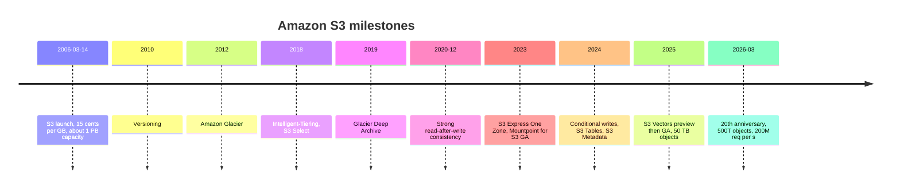

### 1.2 標準化の 5 つの要因

| 要因 | 内容 | なぜ効いたか |
| --- | --- | --- |
| 先行者 | 2006 年。GCS (2010)、Azure Blob (2008 プレビュー / 2010 GA) より早い | 「クラウドのファイル置き場」の最初のメンタルモデルが S3 になった |
| シンプルな API | バケット + キー + HTTP 動詞 (PUT/GET/DELETE/LIST) | 誰でも実装でき、誰でもクライアントを書ける |
| 後方互換の徹底 | AWS 曰く「2006 年に書いた S3 のコードは今日も変更なしで動く」 | 投資したツール・知識が陳腐化しない |
| SDK とツールの生態系 | AWS SDK 全言語、boto3、rclone、s3fs、Hadoop S3A、Spark、DuckDB、Arrow、Iceberg | 「S3 に対応 = 世界中のツールに対応」 |
| 「S3 互換」市場の形成 | Ceph RGW、MinIO、R2、B2、Wasabi、各オンプレ製品 | 互換ベンダーが増えるほど S3 API の価値が上がるネットワーク効果 |

### 1.3 「S3 互換」というカテゴリ

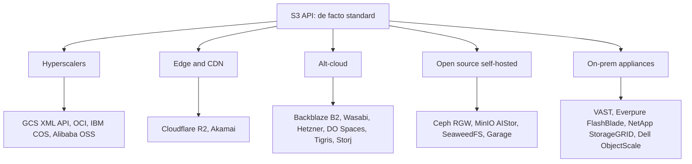

**Azure Blob だけが独自 API を貫いている** のが興味深い。Microsoft は自社エコシステム (ADLS Gen2 + Fabric) の内側で完結させる戦略で、S3 API に合わせる必要を感じていない。

**筆者の評価**: S3 API の標準化は利用者にとって大きな利益 (ポータビリティ) をもたらした一方、**仕様の決定権は AWS 一社にある**。新 API (条件付き書き込み、S3 Tables、S3 Vectors) を AWS が出すたびに互換ベンダーは追随を迫られる。ドイツの heise は 20 周年の論評で、S3 を「AWS が支配する業界標準 = クラウド時代の黄金の檻」と表現している。標準を握る者が最も得をする典型例。

### 1.4 標準であることの経済的価値

標準 API の所有は、AWS に次のような構造的利益をもたらしている。

- **学習コストの独占**: 新人エンジニアが最初に覚えるオブジェクトストレージは S3。`aws s3 cp` と boto3 が事実上の教科書になっている。
- **互換ベンダーが AWS の営業を代行する**: 「S3 互換」を名乗るベンダーは、自社製品の説明のたびに S3 を基準として紹介する。比較対象として常に S3 が想起される。
- **新機能の先行者利益**: 条件付き書き込みや S3 Tables のような新 API は、まず AWS 上で使え、互換ベンダーは数か月〜数年遅れて追随する。最新の OSS (Iceberg のコミット、ディスクレス Kafka 等) は AWS で最初に動く。
- **ロックインの見えにくさ**: API が標準化されているため「いつでも出られる」と感じさせつつ、実際には IAM・イベント連携・分析サービスとの統合や egress がスイッチングコストになる。

逆に利用者側の利益は、**データの置き場を変えてもアプリのコードをほとんど変えずに済む** こと。37signals が約 6 PB を「ほぼドロップイン」で自社の FlashBlade に移せたのは、S3 API が標準だったからだ (第 9 章)。

## 2. 市場データ

### 2.1 クラウドインフラ市場シェア (Synergy Research Group)

Synergy の定義は IaaS + PaaS + ホステッドプライベートクラウド。各社決算の「クラウド」売上 (SaaS を含むことがある) とは直接比較できない。

| 四半期 | 市場規模 ($B) | AWS | Microsoft | Google | その他 | 備考 |
| --- | --- | --- | --- | --- | --- | --- |
| 2025 Q2 | 98.8 | 30% | 20% | 13% | 37% | 社別シェアは Synergy を引用した二次報道 |
| 2025 Q3 | 106.9 | 29% | 20% | 13% | 38% | |
| 2025 Q4 | 119.1 | 28% | 21% | 14% | 37% | Google は 15% とする報道もあり |
| 2026 Q1 | 128.6 | 28% | 21% | 14% | 37% | Oracle 4%、ネオクラウド計 5% |
| 2026 Q2 | 143 | 28% | 20% | 15% | 37% | 前年比 +43%、8 年で最高の成長率 |

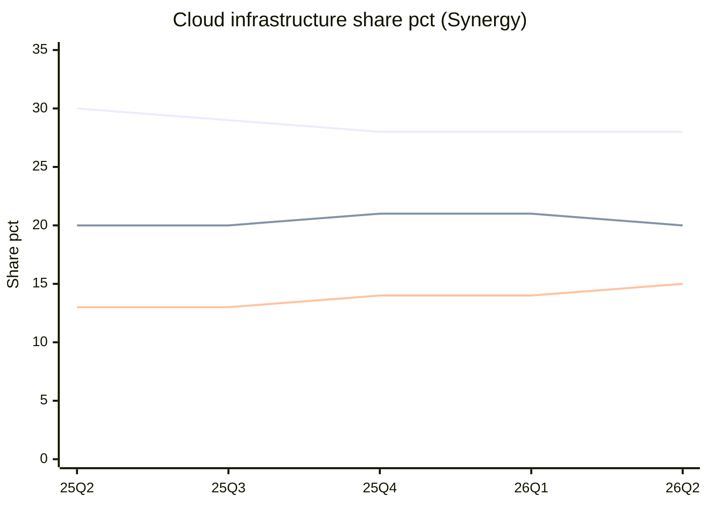

上から AWS / Microsoft / Google。

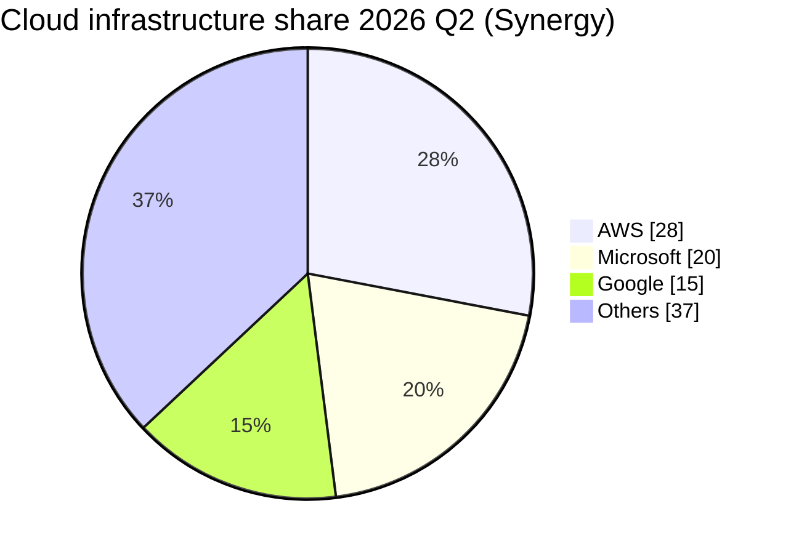

読み方:

- **AWS はシェアを落としながら売上は加速している**。市場全体が年 40% 超で伸びているので、AWS の 37% 成長でもシェアは横ばい〜微減になる。
- Synergy は「その他」の中で CoreWeave、OpenAI、Oracle、Crusoe、Nebius、Anthropic などの急成長を挙げている。**GPU ネオクラウドの台頭** は、学習データを「どこに置くか」の議論を再燃させている (後述)。
- Synergy の John Dinsdale によれば、AWS のシェアは 2021 年の 32% 超から直近 4 四半期平均で 30% 弱に低下 (2025 Q3 時点のコメント)。

### 2.2 AWS の売上

| 四半期 | AWS 売上 ($B) | 前年比 | AWS 営業利益 ($B) |
| --- | --- | --- | --- |
| 2025 Q2 | 30.9 | +17.5% | 10.2 |
| 2025 Q3 | 33.0 | +20% | 11.4 |
| 2025 Q4 | 35.6 | +24% | 12.5 |
| 2026 Q1 | 37.6 | +28% | 14.2 |
| 2026 Q2 | 42.2 | +37% | 16.6 |

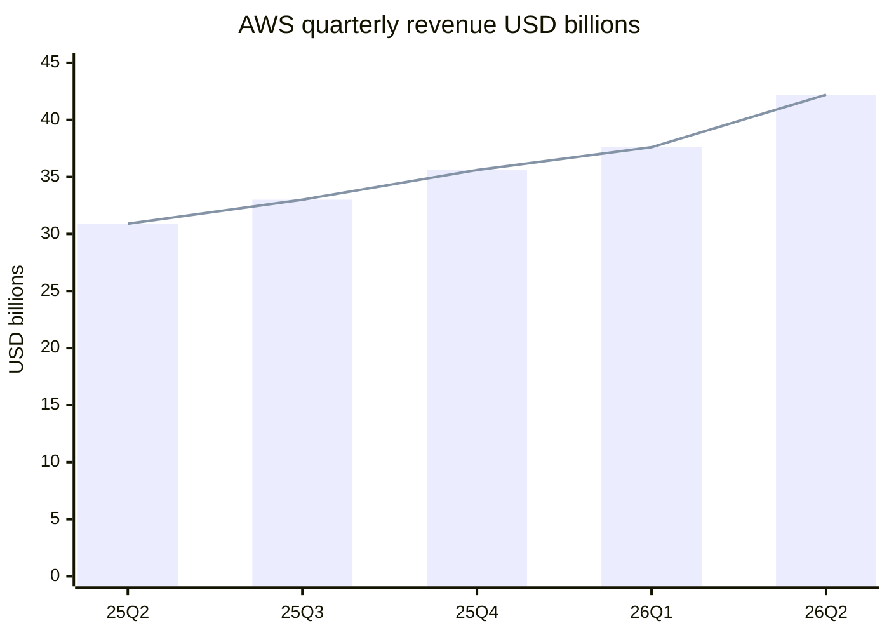

- 2025 年通期の AWS 売上は **$128.7B (+20%)**。
- 2026 Q2 時点で **年換算ランレート $169B**、バックログ $496B (Amazon の決算発表/電話会議)。営業利益率は 39% 台。
- **S3 単体の売上は開示されていない**。「S3 の売上が AWS の X%」という数字を見かけたら推定値なので出典を確認すること。

### 2.3 オブジェクトストレージ市場規模 (推定値の比較)

調査会社ごとに定義 (クラウドサービスのみ / ソフトウェア / ハード込み) が違い、**同じ年でも 10 倍以上の差** がある。

| 出典 | 定義 | 基準年の値 | 予測 | CAGR |
| --- | --- | --- | --- | --- |
| Research and Markets | Cloud Object Storage | 2025: $9.44B | 2026: $10.97B、2030: $18.79B | 2026〜2030 で 14.4% |
| Strategic Market Research | Object-based storage | 2024: $9.7B | 2030: $19.8B | 12.4% |
| Mordor Intelligence | Object-based storage (狭義) | 2025: $1.67B | 2030: $2.74B | 10.41% |
| IndustryARC | Object based storage | 2023: $2.8B | 2030: $7B | 12% |
| Market Data Forecast | Object-based storage | 2024: $7.60B | 2033: $23.76B | 13.5% |

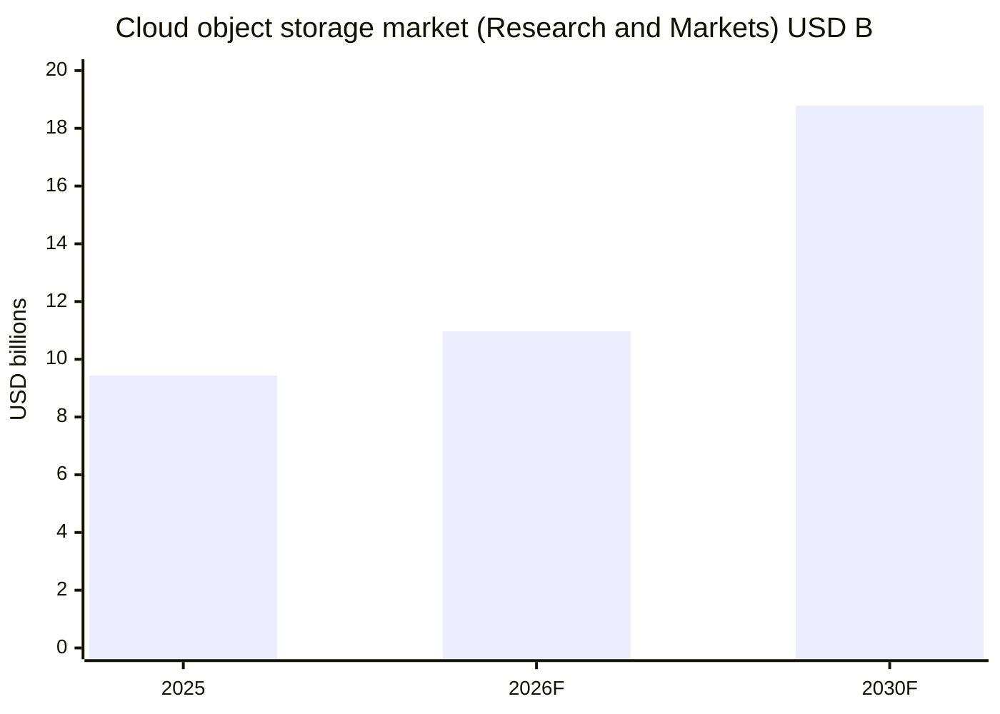

**筆者の見立て**: これらの数字はどれも「S3 という巨大な実体」をうまく捉えていない。AWS は S3 売上を開示せず、調査会社は推計に頼るしかないからだ。実感としての規模感は、**S3 は数百 EB を保存** しており、仮に 300 EB が平均 $0.01/GB-月 (階層ミックスの仮定) で課金されているとすると月 $3B、年 $36B 規模になる。これは上表のどの市場規模よりも大きい。この試算は **仮定に基づく筆者の推定** で、根拠のある数字ではないが、「市場調査レポートの数字は過小評価の可能性が高い」ことは指摘しておく。

### 2.4 S3 の規模 (AWS 公表値)

| 指標 | 値 | 時点 | 出典 |
| --- | --- | --- | --- |
| 保存オブジェクト数 | 500 兆超 | 2026-03 | AWS 20 周年ブログ |
| リクエスト | 毎秒 2 億超 | 2026-03 | 同上 |
| 保存量 | 数百 EB | 2026-03 | 同上 |
| 提供範囲 | 39 リージョン / 123 AZ | 2026-03 | 同上 |
| 最大オブジェクトサイズ | 50 TB (ローンチ時 5 GB) | 2025-12 | re:Invent 2025 |
| 単価 | $0.15/GB → 2 セント強 (約 85% 低下) | 2006 → 2026 | AWS 20 周年ブログ |
| Intelligent-Tiering による顧客の累計削減 | $6B 超 | 2026-03 | 同上 |
| S3 Vectors (2025 年 7〜12 月) | 25 万超のインデックス、400 億超のベクトル、10 億超のクエリ | 2025 | 同上 |
| ローンチ時の構成 | 約 1 PB、約 400 ノード、15 ラック、3 DC、総帯域 15 Gbps | 2006 | 同上 |

参考として、AWS は S3 Express One Zone GA のプレスリリース (2023-11-28) で「350 兆オブジェクト超・平均毎秒 1 億リクエスト超」と公表している。毎秒 1 億リクエストは Pi Day 2022 の時点で既に出ており、「400 兆オブジェクト超」は 2024-12 が初出。2023-11 から 2026-03 (約 2 年 4 か月) でオブジェクト数が約 1.4 倍、リクエストが 2 倍になった計算で、成長は鈍っていない。

### 2.5 アナリスト評価

- **Gartner Magic Quadrant for Strategic Cloud Platform Services (2025-08-04)**: AWS は 15 年連続で Leader、Ability to Execute で最上位。Leaders は AWS / Google / Microsoft / Oracle。
- **Gartner Enterprise Storage Platforms MQ (2025-09-02)**: 2025 年から Primary Storage と File and Object Storage を統合。Leaders は Dell / HPE / Huawei / IBM / NetApp / Pure Storage (現 Everpure)。**パブリッククラウドの S3 自体は対象外**。つまり「オブジェクトストレージ製品の MQ」で S3 は評価されない。S3 は製品カテゴリを超えた「プラットフォームの一部」として扱われている。
- IDC はファイル / オブジェクトストレージ市場データやクラウドストレージサービスのベンダーシェア (ファイル / ブロック / オブジェクト別) を有料レポート・トラッカーでのみ提供している。IDC / Canalys による S3 単独・オブジェクトストレージ単独の公開シェア数値は見つからず、数値は **未確認**。Canalys はクラウドインフラ全体のシェアを出しているが、Synergy と定義が異なる (Synergy は 2026 年時点で TechInsights 傘下)。

## 3. データ基盤における S3

### 3.1 レイクハウスの「底」

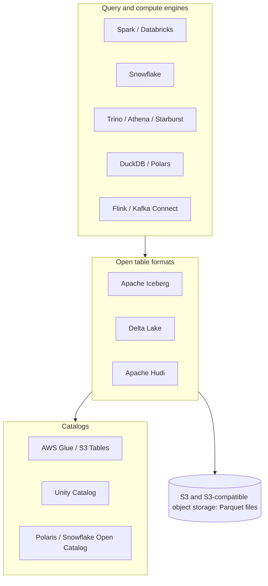

- **Databricks**: レイクハウスの概念を推進。AWS 上では顧客の S3 バケットにデータ (Delta / Iceberg) を置き、コンピュートを分離。2024 年に Iceberg 創業者の会社 Tabular を買収し、Delta と Iceberg の収束を進めている。
- **Snowflake**: 従来は内部ストレージ (実体は S3 等) に独自フォーマットで格納していたが、外部ステージ (S3 上のファイル読み込み) と **Iceberg テーブル** (顧客の S3 に Iceberg で書く) を提供。オープン化の圧力に応じた形。
- **AWS S3 Tables (2024-12)**: S3 自身が Iceberg テーブルを「バケットの一種」として提供し、コンパクションなどのメンテナンスを自動化。**ストレージ事業者がテーブルフォーマットのレイヤーまで上がってきた** のは大きな転換。Cloudflare (Basin Catalog)、Google (BigLake) も同じ方向。

**意味**: 2010 年代の Hadoop/HDFS は「計算とストレージが同じノード」だった。S3 の登場でそれが分離され、2020 年代は「S3 + オープンテーブルフォーマット + 任意のエンジン」が標準形になった。**データの重力 (data gravity) の中心が DWH ベンダーから S3 に移った**。

### 3.2 AI/ML における S3

| 用途 | S3 の使われ方 | 関連機能 |
| --- | --- | --- |
| 学習データセット | Parquet / WebDataset / JSONL を大量に並列読み出し | Mountpoint for S3、S3 Connector for PyTorch、S3 Express One Zone |
| チェックポイント | 数百 GB〜TB の書き込みを定期実行 | マルチパートアップロード、Express One Zone (低遅延) |
| モデル重みの配布 | 推論ノード起動時に一斉ダウンロード | CloudFront、他社では Tigris / R2 |
| RAG / ベクトル | 埋め込みベクトルの保存と検索 | S3 Vectors (2025-12 GA、1 インデックス最大 20 億ベクトル) |
| ログ・評価データ | 推論ログ、評価結果の蓄積 | Lifecycle、Intelligent-Tiering |

**GPU ネオクラウドとの緊張関係**: CoreWeave / Nebius などの GPU クラウドで学習する場合、データが S3 にあると毎回 egress がかかる。これがネオクラウド側の自前ストレージ (VAST 等の S3 互換) や R2 のような egress 無料ストレージの追い風になっている。Backblaze は 2026-06-16 付で CoreWeave と Master Strategic Agreement を締結し、初期発注 (5 年・7 年) の契約総額を約 $335M と見積もっている (8-K による)。

### 3.3 S3 が業界に定着させた概念

| 概念 | S3 での登場 | 業界への波及 |
| --- | --- | --- |
| バケット + キーのフラットな名前空間 | 2006 年のローンチ時 | 「ディレクトリはプレフィックスにすぎない」という理解が一般化。Hadoop S3A などのコミットプロトコルはこの前提で再設計された |
| presigned URL | 初期から | ブラウザ/モバイルから直接アップロードさせる設計の定番に。R2・GCS も同等機能を持つ |
| ストレージクラスと Lifecycle | 2012 年 Glacier 以降 | 「アクセス頻度で単価を変える」階層化がクラウドストレージ全般の標準メニューに |
| イレブンナイン (99.999999999%) | 耐久性の設計目標として | 競合各社が同じ数字を掲げるようになり、耐久性の業界共通語に |
| イベント駆動 (S3 → Lambda) | 2014 年の Lambda と同時期 | 「ファイルが置かれたら処理」というサーバーレスの原型。GCS → Pub/Sub、R2 → Queues も同型 |
| Object Lock (WORM) | 2018 年 | ランサムウェア対策の immutable バックアップが S3 互換ストレージの必須要件に |
| ストレージ上のテーブル / ベクトル | 2024〜2025 年 | 「ストレージ事業者がデータベースのレイヤーまで提供する」競争の起点 |

**ポイント**: S3 の新機能は 2〜5 年遅れで業界標準になる傾向がある。互換ベンダーの機能表を見るとき、「S3 で何年前に出た機能まで追いついているか」を物差しにすると成熟度が測りやすい。

## 4. 「S3 as database」: アーキテクチャへの影響

### 4.1 何が起きているか

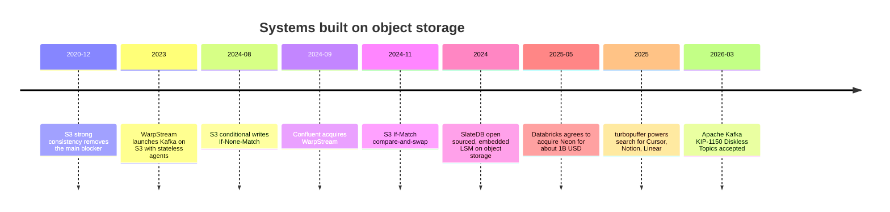

### 4.2 代表的なシステム

| システム | 種類 | S3 の使い方 | 意義 |
| --- | --- | --- | --- |
| WarpStream | Kafka 互換ストリーミング | ブローカーをステートレス化し、全データを S3 に直接書く | AZ 間レプリケーション料金の削減。2024-09 に Confluent が買収 (Confluent は 2026 年に IBM が買収完了と報道) |
| Apache Kafka Diskless Topics (KIP-1150) | Kafka 本体 | メッセージをオブジェクトストレージに直接書き、ブローカーディスクはキャッシュ | 2026-03-02 に承認。実装 KIP (1163/1164) は議論中で、2026-08 時点で GA ではない |
| Neon | サーバーレス Postgres | WAL を Safekeeper、ページを Pageserver 経由で S3 に永続化 | ストレージとコンピュートの分離。ブランチ作成が瞬時。Databricks が約 $1B で買収 |
| turbopuffer | ベクトル + 全文検索 | S3 を主ストア、NVMe とメモリをキャッシュ階層に | 「ベクトル DB をメモリに全部載せる」モデルの 1 桁以上の低コスト化。S3 の強整合と CAS に依存 |
| SlateDB | 組み込み KV (LSM) | WAL を含むすべてをオブジェクトストレージに書く | 「底なし」ストレージ、Apache 2.0 |
| LanceDB / Lance | ベクトル DB / 列指向フォーマット | S3 上の Lance ファイルを直接クエリ | マルチモーダル AI データ向け |
| Iceberg / Delta | テーブルフォーマット | メタデータとデータを全部 S3 に置き、コミットは条件付き書き込みやカタログで調停 | DWH を S3 の上に再構築 |

### 4.3 なぜ今なのか

1. **強整合 (2020-12)**: 書いた直後の読み出しと list が正しくなり、「S3 上のメタデータ」を信頼できるようになった。
2. **条件付き書き込み (2024)**: `If-None-Match: *` (存在しなければ書く) と `If-Match: <ETag>` (変わっていなければ書く) により、外部のロックサービス (DynamoDB 等) なしでリーダー選出やコミットの調停ができるようになった。
3. **経済性**: AWS では AZ 間転送が課金される一方、S3 への書き込みは AZ 間転送料金がかからない。ディスクを 3 AZ に複製する Kafka より、S3 に 1 回書くほうが安い場合が多い。
4. **S3 Express One Zone**: 1 桁ミリ秒のレイテンシで、「S3 は遅いからホットパスに置けない」という制約を緩めた。

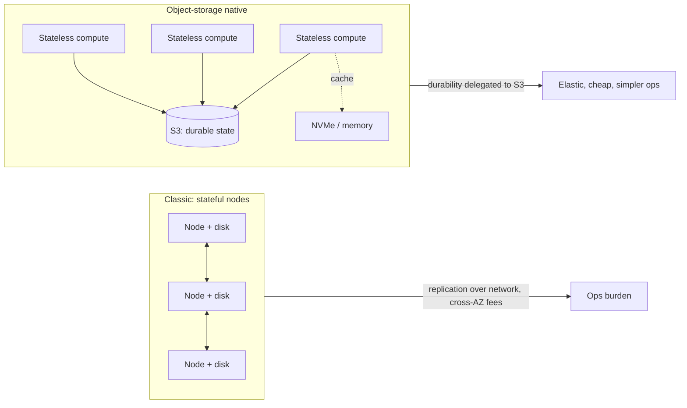

**筆者の意見**: これは「S3 が一番安いディスクになった」以上の意味を持つ。耐久性 (11 ナイン) とレプリケーションという分散システムで最も難しい部分を S3 にアウトソースし、自分は「キャッシュとコンピュート」だけ作ればよくなった。その代償として、**レイテンシ (数十 ms) とリクエスト課金** を設計に組み込む必要がある。PUT $0.005/1,000 件は、毎秒 1,000 件書くと月 $13,000 近くになる。「S3 as database」はバッチ化 (まとめ書き) の設計力が問われるアーキテクチャだ。

## 5. 障害と業界への影響

### 5.1 主要インシデント

| 日付 | 範囲 | 原因 | 影響時間 | 業界への教訓 |
| --- | --- | --- | --- | --- |
| 2008-07-20 | S3 (US/EU) | サーバー間のゴシップ通信でのメッセージ破損 (単一ビットエラー) が状態伝播を汚染 | 約 8 時間 (当時の報道) | 初期クラウドの信頼性問題。チェックサムの重要性 |
| 2017-02-28 | S3 us-east-1 | 課金系の調査中、運用者がコマンドの入力を誤り、意図より多くのサーバーを削除。index と placement サブシステムが再起動 | 9:37〜13:54 PST、約 4 時間 17 分 | 「インターネットの半分が落ちた」。AWS の Service Health Dashboard 自体も S3 依存で更新できなかった |
| 2025-10-19〜20 | us-east-1 (DynamoDB 起点) | DynamoDB の DNS 自動化 (Planner/Enactor) の競合状態で、エンドポイントの DNS レコードが空に | DNS は約 3 時間、EC2/NLB などの波及で全体復旧は約 14〜15 時間 | S3 そのものの障害ではないが、us-east-1 の内部依存の連鎖が露呈 |

### 5.2 2017 年 S3 障害の詳細

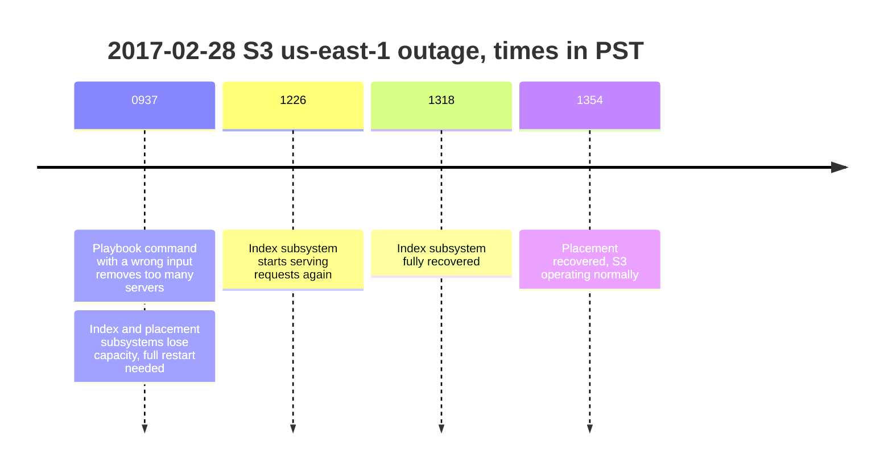

AWS の事後報告から:

- 「承認された S3 チームのメンバーが確立されたプレイブックに従ってコマンドを実行したが、コマンドへの入力の 1 つを誤って入力し、意図より大きなサーバー集合が削除された」。
- index サブシステムと placement サブシステムは **数年間フル再起動されたことがなく**、想定より再起動に時間がかかった。
- 改善策: キャパシティ削除の速度を落とし、サブシステムが最低必要容量を下回る削除を拒否するセーフガードを追加。index サブシステムを小さな「セル」に分割する作業を優先。Service Health Dashboard を複数リージョンで動くように変更。

**業界への影響**: この障害は「マルチリージョン設計」と「セルベースアーキテクチャ」を業界の常識にした。また、**ダッシュボードやステータスページを監視対象と同じ基盤に置かない** という教訓は、今も多くの SRE チームで語られる。

### 5.3 2025 年 10 月 us-east-1 障害

- 起点は DynamoDB の DNS 管理の競合状態: 遅延した Enactor が古いプランを適用し、別の Enactor のクリーンアップ処理がそのプランを削除した結果、`dynamodb.us-east-1.amazonaws.com` の IP アドレスが Route 53 から消えた。
- DynamoDB に依存する AWS 内部サービス (EC2 のインスタンス管理 DropletWorkflow Manager など) が連鎖的に劣化し、NLB のヘルスチェック異常まで波及した。
- Snapchat、Fortnite、Ring、Roblox、Coinbase、Signal、Slack などに影響が出たと報じられた。
- **S3 との関係**: 公開情報の範囲では、S3 は主要な原因ではない。ただし「us-east-1 は AWS 自身のコントロールプレーンの集中点」という構造は 2017 年と同じで、**単一リージョン設計の S3 利用者も巻き添えになる** リスクは変わっていない。
- AWS は DNS Planner/Enactor の自動化を世界的に停止し、修正とセーフガードの追加を約束した。

### 5.4 教訓

1. **us-east-1 は特別なリージョン**。最古で最大、グローバルサービスのコントロールプレーンが集中している。重要なワークロードは us-east-1 だけに置かない。
2. **S3 の耐久性 (11 ナイン) と可用性 (Standard で 99.99% 設計) は別物**。データは失われなくても、数時間読めないことはある。
3. **Cross-Region Replication + アプリ側のフェイルオーバー** が唯一の実効的な対策。Multi-Region Access Points も選択肢。

## 6. 規制: データ主権と egress 料金

### 6.1 年表

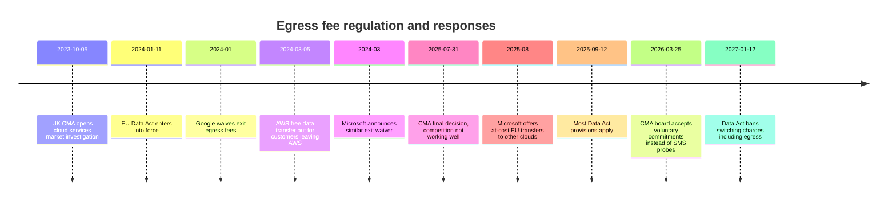

### 6.2 EU Data Act

| 期間 | スイッチング料金の扱い |
| --- | --- |
| 2024-01-11 〜 2027-01-12 | 課金可能だが、プロバイダーの直接コスト (egress 等) を上限とし、契約前に明示 |
| 2027-01-12 以降 | 第 29 条により、スイッチングプロセスに対するスイッチング料金 (egress を含む) の課金を禁止 |

- 対象は **EU 顧客に提供される** IaaS / PaaS / SaaS。リージョンが米国でも顧客が EU なら対象になりうる。
- **日常の egress (ユーザーへの配信、リージョン間複製) は対象外**。マルチクラウドの並行運用も「運用」扱いで対象外とする解釈が一般的。
- 標準のサービス料金と早期解約ペナルティは残る。**コミット契約の残額が実質的なロックイン** として残る点は要注意。

### 6.3 英国 CMA

- 2023-10-05 に市場調査を開始し、**2025-07-31 に最終決定**: 英国のクラウド市場で競争が十分に機能していないと認定。
- IaaS で Microsoft と AWS はそれぞれ 30〜40% のシェア (2024)、Google は 5〜10%。
- **egress 料金をスイッチングとマルチクラウドの主要な商業的障壁と認定**。小規模顧客と大量データを持つ顧客ほど影響が大きい。
- Microsoft のライセンス慣行 (他社クラウドで Microsoft ソフトを使うと高くなる) も競争を阻害すると指摘。
- 勧告は「AWS と Microsoft について戦略的市場地位 (SMS) 調査を優先する」ことだったが、**2026-03-25 に CMA 理事会は SMS 調査を開始せず、両社の自主的コミットメント (egress 料金と相互運用性) を受け入れる** 決定をした (2026-03-31 公表)。拘束力のない約束であり、業界団体からは監視強化を求める声が出ている。

### 6.4 AWS の対応

- **2024-03-05**: AWS から他社 IT 事業者へ移行する顧客に、インターネット向け egress を無料化 (全世界・全リージョン)。全データ (またはあるサービスの全データ) を移す場合が対象で、サポートへの申請が必要。クレジット付与後 60 日以内に移行を完了する条件。CloudFront / Direct Connect / Snow / Global Accelerator は対象外。
- 37signals は 2025 年の S3 脱出で、この制度により約 $250k の egress を免除されたと公表している (第 9 章)。
- 通常の無料枠は月 100 GB (全サービス・リージョン合算)。S3 料金ページには「EU Data Act に基づき EU 顧客は適格なユースケースで割引料金を申請できる」旨の記載がある。

**筆者の意見**: 規制が狙い撃ちしているのは「出口」だけで、**日常の egress という本丸は手つかず**。配信や分析で毎月 egress を払う構造は 2027 年以降も変わらない。むしろ規制が「退去時は無料」を標準化したことで、ハイパースケーラーは「出ていけるのだからロックインではない」と主張しやすくなった面もある。ユーザー側の実利は「交渉材料が増えた」程度と見るのが現実的。

## 7. SWOT 分析 (S3)

| | プラス | マイナス |
| --- | --- | --- |
| 内部 | **Strengths**: API 標準の所有者 / 20 年の後方互換 / 500 兆オブジェクトの実績と 11 ナイン設計 / 最も広いストレージクラス / AWS 全サービスとの統合 / S3 Tables・Vectors・Express による機能拡張の速さ | **Weaknesses**: egress $0.09/GB / 課金項目の複雑さ / ホット層の単価が alt-cloud の約 3 倍 / us-east-1 への構造的集中 / S3 単体の売上非開示で透明性が低い |
| 外部 | **Opportunities**: AI 学習・推論データの爆発 / レイクハウスの標準化 (Iceberg) / 「S3 as database」で S3 がプライマリストアに / ベクトル検索の汎用化 / 2026 年のハード高騰で規模の経済が効く (alt-cloud は値上げ、S3 は据え置き) | **Threats**: egress 規制 (EU Data Act、CMA) / R2 など egress 無料勢 / GPU ネオクラウドの自前ストレージ / 37signals 型リパトリエーション / データ主権 (欧州の主権クラウド需要) / 互換 API による乗り換えコストの低下 |

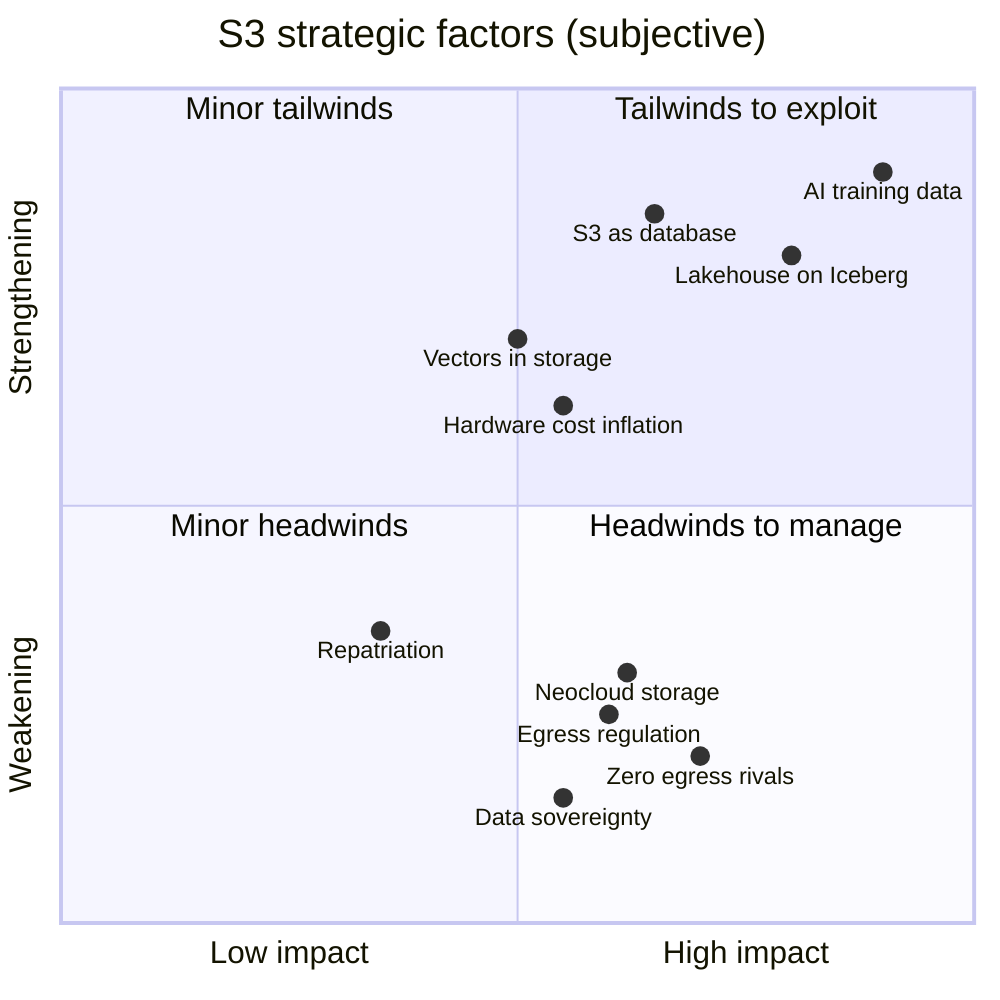

座標は筆者の主観評価。

## 8. 今後の見通し (2026 年以降)

### 8.1 予測

| テーマ | 見通し | 確度 (筆者主観) |
| --- | --- | --- |
| ストレージの「データベース化」 | S3 Tables / Vectors / Metadata の拡張が続き、「バケットの種類」が増える (汎用・ディレクトリ・テーブル・ベクトル...) | 高 |
| egress 料金 | 退去時無料は定着。日常 egress の定価は据え置き、CloudFront バンドルや EU 向け割引など「非定価の値下げ」で対応 | 中 |
| 価格 | 2026〜2027 年の HDD/NAND 高騰で alt-cloud はさらに値上げ。ハイパースケーラーは標準層を据え置き、最低保存期間・取り出し料金などで調整 | 中 |
| S3 互換の分断 | 条件付き書き込みやテーブル/ベクトル API への追随力で互換ベンダーの優劣が明確化 | 高 |
| ディスクレス化 | Kafka (KIP-1150 の実装)、Postgres、検索、時系列 DB で「状態は S3、計算はステートレス」が標準設計に | 高 |
| セルフホスト | MinIO 後の空白を Ceph・Garage・SeaweedFS・MinIO の fork が分け合う。商用 S3 互換 (VAST, Everpure 等) は AI 需要で伸びる | 中 |
| 規制 | EU Data Act の 2027-01-12 施行で欧州発の「スイッチング」事例が増える。英国は自主的コミットメントの履行状況が焦点 | 中 |
| 主権クラウド | AWS European Sovereign Cloud など、運営主体を EU 内に置く形態が拡大 | 中 |

### 8.2 筆者の結論

S3 は 2026 年時点で「オブジェクトストレージ製品」ではなく **「クラウド時代のファイルシステム兼データバス」** になった。競合は価格 (特に egress) で S3 を上回れても、API 標準の所有権・エコシステム・20 年の運用実績では追いつけていない。

一方で S3 の弱点も明確で、それは技術ではなく **ビジネスモデル (egress による囲い込み)** にある。規制と R2 型の競合はまさにそこを突いている。今後 5 年の焦点は「AWS が egress 収益を手放してでもデータ基盤としての地位を守るか」であり、筆者は **AWS は日常の egress 定価を下げず、代わりに S3 上の付加価値 (Tables, Vectors, Express) を厚くして「出る理由」を減らす** 戦略を続けると予想する。

## 9. Web アプリ向けデータ

`data/market.json` に以下を格納している (文字列は `{ "en", "ja" }` の二言語)。

| キー | 内容 | 推奨チャート |
| --- | --- | --- |
| `cloudShare` | 2025 Q2〜2026 Q2 の Synergy シェアと市場規模 | 折れ線 (シェア推移)、ドーナツ (最新四半期) |
| `awsRevenue` | 同期間の AWS 売上・成長率・営業利益 | 棒 + 折れ線 (成長率) |
| `s3Stats` | AWS 公表の S3 規模指標 | KPI タイル |
| `objectStorageMarket` | 調査会社別の市場規模推計 (`segment` で定義を区別) | segment ごとに別系列の棒 |
| `notes` | データの注意点 | 脚注 |

## 参考文献

- AWS, Twenty years of Amazon S3 and building what's next (2026-03-13): <https://aws.amazon.com/blogs/aws/twenty-years-of-amazon-s3-and-building-whats-next/>
- The Register, AWS S3 turns 20 and reaches hundreds of exabytes (2026-03-16): <https://www.theregister.com/off-prem/2026/03/16/aws-s3-turns-20-and-reaches-hundreds-of-exabytes/5219872>
- heise, 20 Years of Amazon S3: The Golden Cage of the Cloud Era: <https://www.heise.de/en/opinion/20-Years-of-Amazon-S3-The-Golden-Cage-of-the-Cloud-Era-11210907.html>
- ByteByteGo, How Amazon S3 Stores 350 Trillion Objects: <https://blog.bytebytego.com/p/how-amazon-s3-stores-350-trillion>
- AWS, Amazon S3 pricing: <https://aws.amazon.com/s3/pricing/>
- Blocks & Files, AWS piles on S3 upgrades from vector search to 50 TB objects (2025-12-03): <https://blocksandfiles.com/2025/12/03/aws-s3/>
- StorageNewsletter, Amazon S3 Vectors is now generally available (2025-12-05): <https://www.storagenewsletter.com/2025/12/05/aws-reinvent-2025-amazon-s3-vectors-is-now-generally-available-with-40-times-the-scale-of-preview/>
- AWS, Top announcements of AWS re:Invent 2025: <https://aws.amazon.com/blogs/aws/top-announcements-of-aws-reinvent-2025/>
- Synergy Research Group, Q2 Cloud Market Passes $143 Billion (2026-07-30): <https://www.srgresearch.com/articles/q2-cloud-market-passes-143-billion-highest-growth-rate-in-eight-years>
- Synergy Research Group, Q2 Cloud Market Nears $100 Billion Milestone (2025): <https://www.srgresearch.com/articles/q2-cloud-market-nears-100-billion-milestone-and-its-still-growing-by-25-year-over-year>
- Synergy Research Group, Cloud Market Growth Rate Rises Again in Q3 (2025): <https://www.srgresearch.com/articles/cloud-market-growth-rate-rises-again-in-q3-biggest-ever-sequential-increase>
- Synergy Research Group, GenAI Helps Drive Quarterly Cloud Revenues to $119 Billion (Q4 2025): <https://www.srgresearch.com/articles/genai-helps-drive-quarterly-cloud-revenues-to-119-billion-as-growth-rate-jumped-yet-again-in-q4>
- DCD, Synergy: cloud spending hits $129bn in Q1 2026: <https://www.datacenterdynamics.com/en/news/synergy-research-cloud-spending-hits-129bn-in-q1-2026-ninth-consecutive-quarter-of-growth/>
- DCD, Neoclouds gradually increasing CIS market share, as Amazon declines: <https://www.datacenterdynamics.com/en/news/synergy-research-neoclouds-gradually-increasing-cis-market-share-as-amazon-declines/>
- Statista, Big Three Hold Dominant Lead in Accelerating Cloud Market: <https://www.statista.com/chart/18819/worldwide-market-share-of-leading-cloud-infrastructure-service-providers/>
- TechTarget, GenAI drives $119B cloud revenue in Q4: <https://www.techtarget.com/searchcloudcomputing/news/366638805/GenAI-drives-119B-cloud-revenue-in-Q4>
- The Register, AWS under pressure as big three battle (2025-11-20): <https://www.theregister.com/2025/11/20/aws_loses_market_share_azure_google/>
- Amazon, Q2 2026 earnings release: <https://www.aboutamazon.com/news/company-news/amazon-earnings-q2-2026-report>
- Amazon IR, Amazon.com Announces Second Quarter Results (2026): <https://ir.aboutamazon.com/news-release/news-release-details/2026/Amazon-com-Announces-Second-Quarter-Results/>
- Amazon, Q1 2026 earnings release: <https://www.aboutamazon.com/news/company-news/amazon-earnings-q1-2026-report>
- Amazon, Q4 2025 earnings release: <https://www.aboutamazon.com/news/company-news/amazon-earnings-q4-2025-report>
- CNBC, AWS earnings Q1 2026: <https://www.cnbc.com/2026/04/29/aws-earnings-q1-2026.html>
- Research and Markets, Cloud Object Storage Market: <https://www.researchandmarkets.com/report/global-cloud-oss-market>
- Mordor Intelligence, Object-Based Storage Market: <https://www.mordorintelligence.com/industry-reports/object-based-storage-market>
- Strategic Market Research, Object-Based Storage Market: <https://www.strategicmarketresearch.com/market-report/object-based-storage-market>
- IndustryARC, Object Based Storage Market: <https://www.industryarc.com/research/object-based-storage-research-800542>
- Market Data Forecast, Object-Based Storage Market: <https://www.marketdataforecast.com/market-reports/object-based-storage-market>
- AWS, AWS named as a Leader in 2025 Gartner MQ for Strategic Cloud Platform Services: <https://aws.amazon.com/blogs/aws/aws-named-as-a-leader-in-2025-gartner-magic-quadrant-for-strategic-cloud-platform-services-for-15-years-in-a-row/>
- StorageNewsletter, New Enterprise Storage Platforms MQ from Gartner for 2025: <https://www.storagenewsletter.com/2025/09/18/new-enterprise-storage-platforms-mq-from-gartner-for-2025/>
- NetApp, Gartner Magic Quadrant leader 2025: <https://www.netapp.com/blog/gartner-magic-quadrant-leader-2025/>
- AWS, Amazon S3 Availability Event: July 20, 2008: <https://web.archive.org/web/2008/http://status.aws.amazon.com/s3-20080720.html> (archived)
- AWS, Summary of the Amazon S3 Service Disruption (2017): <https://aws.amazon.com/message/41926/>
- The Register, A single DNS race condition brought AWS to its knees (2025-10-23): <https://www.theregister.com/2025/10/23/amazon_outage_postmortem/>
- ThousandEyes, AWS Outage Analysis: October 20, 2025: <https://www.thousandeyes.com/blog/aws-outage-analysis-october-20-2025>
- Forbes, AWS Outage Latest (2025-10-23): <https://www.forbes.com/sites/kateoflahertyuk/2025/10/23/aws-outage-new-analysis-explains-what-went-wrong-and-why/>
- GOV.UK, Cloud services market investigation (CMA case page): <https://www.gov.uk/cma-cases/cloud-services-market-investigation>
- CMA, Summary of final decision (2025-07-31): <https://assets.publishing.service.gov.uk/media/688b20e6ff8c05468cb7b120/summary_of_final_decision.pdf>
- CMA, Final decision report (2025-07-31): <https://assets.publishing.service.gov.uk/media/688b8891fdde2b8f73469544/final_decision_report.pdf>
- CMA, Appendix N: Egress fees: <https://assets.publishing.service.gov.uk/media/67976be7419bdbc8514fde5d/.Appendix_N.pdf>
- Tech Policy Press, UK Regulator Probes Microsoft While Backing Voluntary Cloud Rules: <https://www.techpolicy.press/uk-cloud-regulator-opts-for-voluntary-commitments-launches-microsoft-investigation/>
- Lindahl, New requirements for cloud portability in the EU Data Act: <https://www.lindahl.se/en/latest-news/knowledge/new-requirements-for-cloud-portability-in-the-eu-data-act-practical-implications-for-cloud-service-providers/>
- cloudmagazin, EU Data Act: When Cloud Switching Fees Are Abolished (2026-07-06): <https://www.cloudmagazin.com/en/2026/07/06/eu-data-act-when-cloud-switching-fees-are-abolished-what-cios-need-to-examine/>
- DCD, AWS removes some data transfer fees for customers exiting its cloud: <https://www.datacenterdynamics.com/en/news/aws-removes-some-data-transfer-fees-for-customers-exiting-its-cloud/>
- TechCrunch, Amazon follows Google in announcing free data transfers out of AWS (2024-03-05): <https://techcrunch.com/2024/03/05/amazon-follows-google-in-announcing-free-data-transfers-out-of-aws>
- Network World, Google waives multicloud egress fee in EU ahead of the Data Act deadline: <https://www.networkworld.com/article/4055548/google-waives-multicloud-egress-fee-in-eu-ahead-of-the-data-act-deadline.html>
- Confluent, Confluent acquires WarpStream (2024-09-09): <https://www.confluent.io/blog/confluent-acquires-warpstream/>
- Apache Kafka, KIP-1150: Diskless Topics: <https://cwiki.apache.org/confluence/display/KAFKA/KIP-1150:+Diskless+Topics>
- Aiven, KIP-1150 Accepted, and the Road Ahead: <https://aiven.io/blog/kip-1150-accepted-and-the-road-ahead>
- SoftwareMill, Diskless Kafka: Object Storage, KIP-1150, and Kafka's Future: <https://softwaremill.com/diskless-kafka-object-storage-kip-1150-and-kafkas-future/>
- Databricks, Databricks agrees to acquire Neon: <https://databricks.com/company/newsroom/press-releases/databricks-agrees-acquire-neon-help-developers-deliver-ai-systems>
- CNBC, Databricks is buying database startup Neon for about $1 billion (2025-05-14): <https://www.cnbc.com/2025/05/14/databricks-is-buying-database-startup-neon-for-about-1-billion.html>
- Jason Liu, TurboPuffer: Object Storage-First Vector Database Architecture: <https://jxnl.co/writing/2025/09/11/turbopuffer-object-storage-first-vector-database-architecture/>
- turbopuffer blog: <https://turbopuffer.com/blog/rip-vector-database>
- SlateDB: <https://slatedb.io/>
- SlateDB GitHub: <https://github.com/slatedb/slatedb>
- The New Stack, SlateDB: Bottomless Databases Built on Cloud Object Stores: <https://thenewstack.io/slatedb-bottomless-databases-built-on-cloud-object-stores/>
- Backblaze, Form 8-K (Master Strategic Agreement with CoreWeave, 2026-06-16): <https://www.sec.gov/Archives/edgar/data/0001462056/000162828026044804/blze-20260616.htm>
- Amazon IR, Amazon.com Announces Third Quarter Results (2025): <https://ir.aboutamazon.com/news-release/news-release-details/2025/Amazon-com-Announces-Third-Quarter-Results/default.aspx>
- Amazon, AWS announces general availability of Amazon S3 Express One Zone (2023-11-28): <https://press.aboutamazon.com/2023/11/aws-announces-the-general-availability-of-amazon-s3-express-one-zone>
- AWS, Welcome to AWS Pi Day 2022: <https://aws.amazon.com/blogs/aws/welcome-to-aws-pi-day-2022/>
- Amazon, Amazon S3 expands capabilities with managed Apache Iceberg tables (2024-12-03): <https://press.aboutamazon.com/2024/12/amazon-s3-expands-capabilities-with-managed-apache-iceberg-tables-for-faster-data-lake-analytics-and-automatic-metadata-generation-to-simplify-data-discovery-and-understanding>
- IDC, Storage Software and Cloud Services Tracker (paid): <https://www.idc.com/tracker/showproductinfo.jsp?containerId=IDC_P24761>
