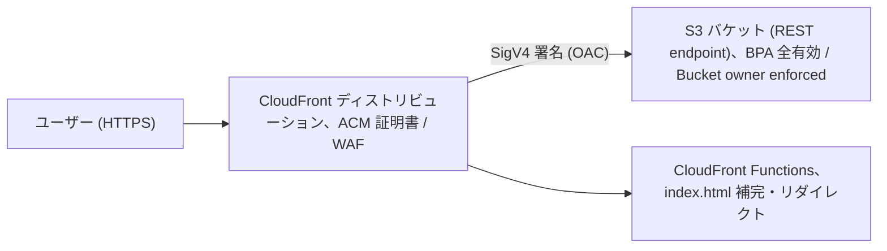
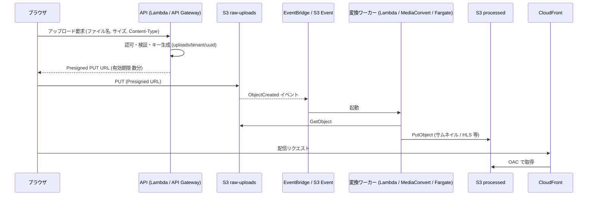
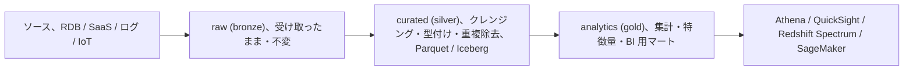
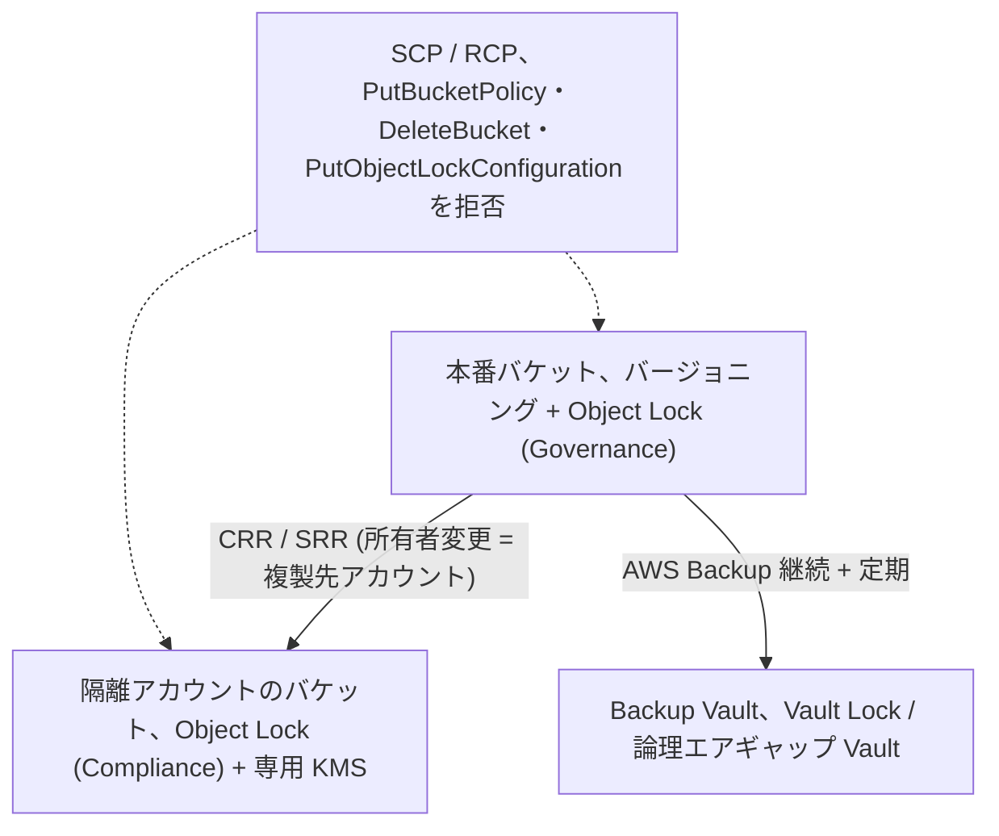
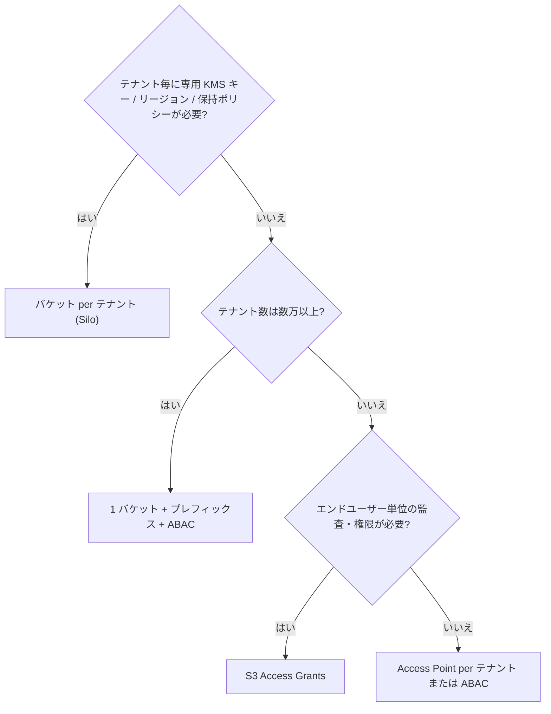
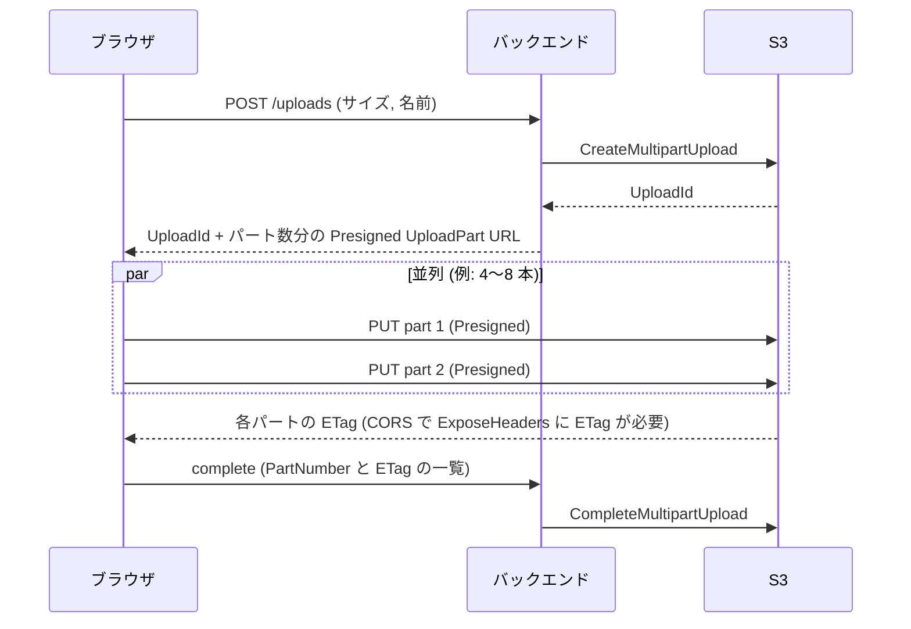

# 設計パターン & ベストプラクティス

_最終確認: 2026-10-03_

この章では、S3 を「部品」として使う代表的なアーキテクチャパターンと、AWS Well-Architected Framework の観点から見たベストプラクティス、そして現場でよく見るアンチパターンを整理する。個々の機能 (バージョニング、レプリケーション、ライフサイクル等) の詳細は各章を参照し、ここでは「組み合わせ方」に焦点を当てる。

## 0. 全体像

S3 を中心にしたワークロードは、おおむね次の 5 系統に分類できる。

| 系統 | 代表パターン | 主に効く S3 機能 |
| --- | --- | --- |
| 配信 (Delivery) | 静的サイト、SPA、メディア配信 | CloudFront + OAC、Block Public Access、Cache-Control |
| 取り込み (Ingest) | ブラウザ直アップロード、IoT/ログ収集 | Presigned URL、マルチパートアップロード、Transfer Acceleration |
| 処理 (Process) | メディア変換、イベント駆動 ETL | Event Notifications、EventBridge、Lambda、Step Functions |
| 分析 (Analyze) | データレイク、S3 Tables (Iceberg)、ML 学習 | パーティション設計、Athena、Glue、S3 Express One Zone |
| 保護 (Protect) | ログアーカイブ、バックアップ/DR、ランサムウェア対策 | バージョニング、Object Lock、CRR/SRR、AWS Backup |

```text
                 +-------------------+
   users ------> |  CloudFront (CDN) | --OAC--> [ S3: static assets ]
                 +-------------------+
   browser --(presigned PUT / MPU)--> [ S3: raw uploads ] --event--> Lambda/Step Functions
                                                                   |
                                                                   v
                                      [ S3: processed ] --> [ S3 data lake: raw/curated/analytics ]
                                                                   |
                                     Athena / Glue / EMR / SageMaker
   all accounts --CloudTrail/Config/VPC Flow Logs--> [ Log Archive account: S3 + Object Lock ]
   critical buckets --CRR / AWS Backup--> [ DR region / backup vault ]
```

## 1. 静的 Web サイトホスティング

### 1.1 2 つの方式

S3 で静的サイトを配信する方法は大きく 2 つある。

| 項目 | S3 website endpoint を直接公開 | CloudFront + OAC + S3 REST endpoint |
| --- | --- | --- |
| エンドポイント形式 | `http://bucket.s3-website-region.amazonaws.com` (リージョンによっては `s3-website.region`) | `https://dxxxx.cloudfront.net` または独自ドメイン |
| HTTPS | 非対応 (website endpoint は HTTP のみ) | 対応 (ACM 証明書を CloudFront に設定) |
| バケットの公開 | 必要 (Block Public Access を外し、`s3:GetObject` を `Principal: "*"` に許可) | 不要 (バケットは完全プライベートのまま) |
| index.html の自動補完 | サブディレクトリでも可 | ルートのみ (Default root object)。サブディレクトリは CloudFront Functions 等で補完 |
| リダイレクトルール | website 設定の RoutingRules で可能 | CloudFront Functions / Lambda@Edge で実装 |
| WAF / DDoS 対策 | 不可 | AWS WAF、Shield Standard |
| キャッシュ / 帯域コスト | すべて S3 から DataTransfer-Out | エッジでキャッシュ。S3→CloudFront 間のデータ転送は無料 |
| 推奨度 | 社内検証・一時的な用途のみ | 本番の標準 |

CloudFront のドキュメントにも明記されている通り、S3 バケットを website endpoint として構成した場合、CloudFront から origin への通信に HTTPS は使えない (S3 側がその構成で HTTPS をサポートしないため)。そのため本番では「REST endpoint を origin にし、OAC (Origin Access Control) で署名付きアクセス」が基本形になる。

### 1.2 OAC 構成の推奨形



バケットポリシーは CloudFront サービスプリンシパルに対して、特定ディストリビューションからのアクセスだけを許可する。

```json
{
  "Version": "2012-10-17",
  "Statement": [
    {
      "Sid": "AllowCloudFrontServicePrincipalReadOnly",
      "Effect": "Allow",
      "Principal": { "Service": "cloudfront.amazonaws.com" },
      "Action": "s3:GetObject",
      "Resource": "arn:aws:s3:::example-site-bucket/*",
      "Condition": {
        "StringEquals": {
          "AWS:SourceArn": "arn:aws:cloudfront::111122223333:distribution/EDFDVBD6EXAMPLE"
        }
      }
    }
  ]
}
```

ポイント:

- Block Public Access (BPA) は 4 項目すべて ON のままで良い。OAC はパブリックアクセスではない。
- 旧方式の OAI (Origin Access Identity) は SSE-KMS や全リージョンの新機能に制約があるため、新規構築は OAC を使う。
- SSE-KMS で暗号化したオブジェクトを配信する場合は、KMS キーポリシーに `cloudfront.amazonaws.com` からの `kms:Decrypt` を `AWS:SourceArn` 条件付きで許可する。
- 存在しないキーへのアクセスは、CloudFront に `s3:ListBucket` を与えていなければ 403 になる。404 ページを出したい場合は CloudFront のカスタムエラーレスポンスで 403/404 を `/404.html` にマップする。

### 1.3 SPA (Single Page Application) ホスティング

React / Vue などの SPA では、`/users/42` のようなクライアントルーティングのパスに対応するオブジェクトが S3 に存在しない。対策は 2 通り。

| 方式 | 方法 | 注意点 |
| --- | --- | --- |
| カスタムエラーレスポンス | CloudFront で 403 と 404 を `/index.html` + HTTP 200 に置き換える | 本当に存在しない画像なども 200 + HTML になり、監視やSEOで紛らわしい |
| CloudFront Functions で URI 書き換え | 拡張子のないパスだけ `/index.html` に書き換える | 推奨。アセットの 404 は正しく 404 のまま |

```javascript
// CloudFront Functions (viewer request)
function handler(event) {
  var req = event.request;
  // 拡張子を含まないパスは SPA のルートとみなす
  if (!req.uri.includes('.')) {
    req.uri = '/index.html';
  }
  return req;
}
```

キャッシュ戦略の定石:

| オブジェクト | Cache-Control | 理由 |
| --- | --- | --- |
| `index.html` | `no-cache` または短い `max-age` | デプロイ直後に新しいアセット参照へ切り替えるため |
| `assets/app.3f9a1c.js` などハッシュ付きファイル | `public, max-age=31536000, immutable` | ファイル名が内容に依存するので永久キャッシュ可 |
| 画像など | 数時間〜数日 | 更新頻度に応じて |

デプロイ手順の例:

1. ハッシュ付きアセットを先にアップロードする (`aws s3 sync dist/assets s3://bucket/assets --cache-control "public,max-age=31536000,immutable"`)。
2. 最後に `index.html` をアップロードする。
3. `index.html` だけ CloudFront Invalidation を発行する (`/index.html`)。

この順序だと、古い `index.html` を持つユーザーも古いアセットを取得でき、壊れた画面が出ない。

## 2. メディア処理パイプライン

### 2.1 典型構成

ユーザーが画像や動画をアップロードし、サムネイル生成やトランスコードを行うパターン。



### 2.2 設計上のポイント

| 論点 | 推奨 |
| --- | --- |
| キー命名 | サーバー側で UUID 等を生成し、ユーザー入力のファイル名をそのままキーにしない (パストラバーサル風の値、文字コード問題、上書き競合を回避) |
| 上書き防止 | Presigned URL 生成時に `If-None-Match: *` を前提とした条件付き書き込みを利用するか、キーを一意にする |
| バケット分離 | raw と processed を別バケットにする。同一バケットで「書き込み→イベント→同一バケットへ書き込み」をすると再帰呼び出しの無限ループになりうる |
| サイズ制限 | Presigned PUT は 1 リクエスト最大 5 GiB。サイズ上限を強制したい場合は Presigned POST の `content-length-range` 条件を使う |
| Content-Type 強制 | Presigned URL 生成時に `ContentType` を署名に含めると、クライアントは同じヘッダーで送る必要がある |
| マルウェア対策 | Amazon GuardDuty Malware Protection for S3 で新規オブジェクトをスキャンし、結果タグで後続処理を分岐する |
| 冪等性 | S3 イベントは at-least-once 配信。同じイベントが複数回届いても結果が同じになるようにする (出力キーを入力キーから決定的に生成するなど) |
| 大きなファイル | 15 分を超える処理は Lambda ではなく MediaConvert、ECS/Fargate、AWS Batch を使う。Step Functions でサイズ別に振り分ける構成も一般的 |
| 未完了 MPU | ライフサイクルで `AbortIncompleteMultipartUpload` (例: 7 日) を設定し、ゴミパーツへの課金を防ぐ |

### 2.3 S3 Event Notifications と EventBridge の使い分け

| 項目 | S3 Event Notifications | Amazon EventBridge |
| --- | --- | --- |
| 宛先 | SNS、SQS (標準キューのみ)、Lambda | EventBridge の全ターゲット (Step Functions、SQS、API 宛先等) |
| フィルタ | プレフィックス / サフィックスのみ | オブジェクトサイズ、メタデータ、キーのワイルドカード等の高度なフィルタ |
| 1 イベントの複数宛先 | 同一イベント種別・重複プレフィックスで複数宛先を設定不可 (SNS ファンアウトで回避) | ルールを複数作れば自由にファンアウト |
| 有効化 | 通知設定ごと | バケットで「EventBridge に送信」を ON にするだけで全イベント |
| 再送 / アーカイブ | なし | アーカイブとリプレイ可能 |
| 遅延 | 通常は数秒、ときに 1 分以上かかる (S3 User Guide の記載。数値 SLA はない) | 数値の公表なし (ルーティングが 1 段増える)。エンドツーエンドの配信遅延は `IngestionToInvocationSuccessLatency` メトリクスで観測できる |

## 3. データレイク (Zone 設計)

### 3.1 ゾーン構成



| ゾーン | 形式 | 保持 | アクセス | ストレージクラス例 |
| --- | --- | --- | --- | --- |
| landing (任意) | 任意 | 数日 | 取り込みジョブのみ | Standard、短期で削除 |
| raw | 元フォーマット (JSON、CSV、ログ) | 長期 (監査・再処理用) | データエンジニアのみ | Standard → Intelligent-Tiering / Glacier |
| curated | Parquet / ORC、Apache Iceberg | 中〜長期 | 分析者 (Lake Formation 経由) | Standard / Intelligent-Tiering |
| analytics | Parquet、Iceberg、S3 Tables | 用途次第 | BI、アプリ | Standard |

### 3.2 実装のポイント

- ゾーンごとにバケットを分けると、バケットポリシー・暗号化キー・ライフサイクル・レプリケーションをゾーン単位で設計できる。プレフィックス分割でも良いが、権限境界はバケットの方が明確。
- パーティションは Hive 形式 (`s3://lake-curated/sales/year=2026/month=10/day=03/`) が Athena / Glue と相性が良い。
- 小さなファイルを大量に作らない。目安として Parquet は数十 MB〜数百 MB / ファイル程度にまとめる。Iceberg テーブルなら S3 Tables の自動コンパクションを使える。
- テーブル形式は Apache Iceberg が事実上の標準。S3 Tables (テーブルバケット) は Iceberg のメンテナンス (コンパクション、スナップショット管理、未参照ファイル削除) を S3 側がマネージドで行う。
- 権限は AWS Lake Formation で列・行レベル制御し、S3 側は Lake Formation のサービスロールのみに許可する、という分担が一般的。
- オブジェクトのインベントリや変更履歴は S3 Inventory や S3 Metadata (journal / live inventory テーブル) を使い、LIST の連打を避ける。

## 4. ログアーカイブ (マルチアカウント)

### 4.1 Control Tower / Landing Zone の Log Archive アカウント

AWS Control Tower は、Organizations 配下の専用 Log Archive アカウントに CloudTrail と AWS Config のログを集約する S3 バケットを作成する。これを拡張して VPC Flow Logs、ALB アクセスログ、S3 サーバーアクセスログなどもここに集約するのが定石。

```text
 Organization
 ├── Management account
 ├── Security (Audit) account  ── GuardDuty / Security Hub 委任管理者
 ├── Log Archive account
 │     └── S3: org-logs-<account>-<region>
 │           ├── AWSLogs/<org-id>/<account-id>/CloudTrail/...
 │           ├── AWSLogs/<account-id>/Config/...
 │           └── vpcflowlogs/ ...
 └── Workload accounts (dev / stg / prod)  ── ログは書き込みのみ
```

### 4.2 推奨設定

| 設定 | 推奨値 | 理由 |
| --- | --- | --- |
| バージョニング | 有効 | 上書き・削除からの復旧 |
| Object Lock | Compliance または Governance、既定保持期間を設定 | ログ改ざん防止。監査要件に応じる |
| 暗号化 | SSE-KMS (専用 CMK) + S3 Bucket Keys | キーポリシーで復号できる人を限定。Bucket Keys で KMS リクエストコストを削減 |
| バケットポリシー | `aws:SourceOrgID` や `aws:SourceArn` 条件でログ配信元を限定、`aws:SecureTransport` false を Deny | 他組織からの書き込み・平文通信を拒否 |
| Object Ownership | Bucket owner enforced (ACL 無効) | クロスアカウント書き込みでもオブジェクト所有者をバケット所有者に統一 |
| ライフサイクル | 90 日後 Glacier Instant/Flexible Retrieval、数年後 Deep Archive、保持期限後に Expire | ログは参照頻度が低い |
| アクセス | 書き込みはサービスプリンシパルのみ、読み取りはセキュリティチームのロールのみ | 最小権限 |
| 削除保護 | SCP / RCP でバケットポリシー変更・Object Lock 設定変更・バケット削除を拒否 | 管理者権限の奪取に対する多層防御 |

小さなログオブジェクトが大量に生成されるので、128 KB 未満のオブジェクトはライフサイクル遷移の既定対象外になる点 (2024 年 9 月以降の既定動作) に注意する。遷移コストが保存コスト削減を上回ることもあるため、集約 (例: Firehose でまとめて書く、s3tar 等で固める) を検討する。

## 5. バックアップと DR

### 5.1 手段の比較

| 手段 | 守れるもの | RPO の目安 | 主なコスト | 注意 |
| --- | --- | --- | --- | --- |
| バージョニング | 誤上書き・誤削除 | 0 (同一バケット内) | 旧バージョンの保存料 | バケット/リージョン/アカウント障害は守れない。ライフサイクルで旧バージョンを整理 |
| SRR (Same-Region Replication) | 別アカウントへのコピー、ログ集約 | 秒〜分 | 複製先保存料 + リクエスト | 削除マーカー複製は既定で無効 (設定次第) |
| CRR (Cross-Region Replication) | リージョン障害 | 通常 15 分以内に大半。RTC 有効で 99.99% を 15 分以内 (SLA) | 保存料 + リージョン間転送 + RTC 料金 | 既存オブジェクトは Batch Replication が必要 |
| Object Lock | 改ざん・ランサムウェアによる削除/暗号化上書き | — | 保持期間中は削除不可の保存料 | Compliance モードは root でも短縮不可 |
| AWS Backup for S3 | 論理破損、アカウント侵害 (別アカウント vault へのコピー) | 継続バックアップで 35 日以内の任意時点 (PITR) | バックアップストレージ料金 | バージョニング必須。EventBridge 通知に依存 |
| 別アカウントへのレプリカ + Object Lock | 本番アカウントの完全侵害 | 秒〜分 | 二重保存 | 複製先アカウントの権限を本番と分離 |

### 5.2 ランサムウェア対策の多層防御



ポイント:

1. 攻撃者が本番アカウントの管理者権限を得ても消せない場所 (別アカウント、Compliance モード、Vault Lock) にコピーを持つ。
2. KMS キーの削除・無効化もデータ破壊と同じ効果を持つ。キーポリシーで `kms:ScheduleKeyDeletion` / `kms:DisableKey` を限定し、SCP で保護する。
3. SSE-C は鍵を AWS が保持しないため、攻撃者が自前の鍵で上書き暗号化する手口に使われうる。2026 年 4 月以降、新規バケットと SSE-C オブジェクトのない既存バケットでは SSE-C が既定で無効化されるロールアウトが始まっている。明示的に `BlockedEncryptionTypes` で SSE-C をブロックしておくと確実。
4. GuardDuty S3 Protection で異常な `DeleteObject` / `PutObject` の急増を検知する。

### 5.3 マルチリージョン構成

| 構成 | 仕組み | 用途 |
| --- | --- | --- |
| Active-Passive | CRR + DNS / アプリでフェイルオーバー | 一般的な DR |
| Active-Active | 双方向レプリケーション + Multi-Region Access Points (MRAP) | グローバル低レイテンシ、リージョン障害時の自動ルーティング |
| MRAP フェイルオーバー制御 | Active/Passive ルーティングをコンソール/API で切り替え | 計画的切り替え、DR 訓練 |

双方向レプリケーションではレプリカの変更 (メタデータ等) も同期させるため「replica modification sync」を有効にする。書き込み競合は「最後に書いたものが勝つ」に近い挙動になるため、同一キーへの同時書き込みをアプリ側で避ける。

## 6. ML 学習データとチェックポイント

| 課題 | パターン |
| --- | --- |
| 学習データの高スループット読み込み | Mountpoint for Amazon S3、S3 Connector for PyTorch、データを数十〜数百 MB のシャード (WebDataset tar、TFRecord、Parquet) にまとめる |
| 小さなファイル大量 (画像 1 枚 = 1 オブジェクト) | シャード化してリクエスト数を削減。どうしても必要なら S3 Express One Zone (ディレクトリバケット) |
| 低レイテンシ・同一 AZ 計算 | S3 Express One Zone を GPU クラスターと同じ AZ に置く |
| チェックポイント書き込み | 非同期・並列マルチパート書き込み (CRT ベースのクライアント)。古いチェックポイントはライフサイクルで削除 |
| ファイルシステム互換が必要な既存ツール | Amazon S3 Files (EFS ベースで S3 バケットをファイルシステムとしてマウント、2026 年 GA) や FSx for Lustre の S3 連携 |
| ベクトル埋め込みの保存 | Amazon S3 Vectors (ベクトルバケット) |
| データセットの来歴管理 | バージョニング + オブジェクトタグ、または Iceberg のスナップショット |

チェックポイントのキー設計例:

```text
s3://ml-checkpoints/run=2026-10-01-llm-a/step=000120000/rank=0007.pt
s3://ml-checkpoints/run=2026-10-01-llm-a/step=000120000/_COMPLETE
```

最後に `_COMPLETE` マーカーを書き、読み込み側はマーカーの存在で完了を判定する (S3 は強い read-after-write 整合性を持つので、マーカーが見えた時点で先行書き込みも読める)。

## 7. マルチテナント SaaS の分離

### 7.1 分離モデルの比較

| モデル | 構成 | 長所 | 短所 | 向いている規模 |
| --- | --- | --- | --- | --- |
| Pool: プレフィックス分離 | 1 バケット、`tenants/<tenant-id>/...` | シンプル、バケット数制限に無縁 | 権限ミスが全テナント漏洩に直結。テナント別 KMS / ライフサイクルは工夫が必要 | 多数の小規模テナント |
| Pool + ABAC (セッションタグ) | 1 ロール + `aws:PrincipalTag/tenant` を Resource ARN に埋め込む | ポリシー 1 つで全テナント対応 | 認証基盤側でタグ付与を確実に | 多数テナント |
| Bridge: アクセスポイント per テナント | バケット 1 つ + テナント毎の Access Point | ポリシーをテナント単位に分割、VPC 限定も可能 | Access Point 数のクォータ | 中規模 |
| Silo: バケット per テナント | テナント毎のバケット (+ 専用 KMS キー) | 分離・課金・削除が明快 | バケット数 (既定 10,000、引き上げ可) の管理、2,000 超のバケットは課金対象 | 少数の大口・規制テナント |
| アカウント per テナント | テナント毎の AWS アカウント | 最強の分離 | 運用コスト大 | エンタープライズ専用環境 |
| S3 Access Grants | IdP (IAM Identity Center) のユーザー/グループにプレフィックス単位の許可を付与 | ユーザー単位の細かい付与、CloudTrail にエンドユーザー ID が残る | 新しい概念の習得、Requests-Tier8 課金 | 社内データ共有、エンドユーザー単位の権限 |

### 7.2 セッションタグを使った ABAC の例

テナントのユーザーが API にログインすると、バックエンドが `sts:AssumeRole` に `Tags=[{Key: tenant, Value: acme}]` を付けて一時クレデンシャルを得る。ロールのポリシーは 1 つで全テナントに使える。

```json
{
  "Version": "2012-10-17",
  "Statement": [
    {
      "Sid": "TenantObjectAccess",
      "Effect": "Allow",
      "Action": ["s3:GetObject", "s3:PutObject", "s3:DeleteObject"],
      "Resource": "arn:aws:s3:::saas-data/tenants/${aws:PrincipalTag/tenant}/*"
    },
    {
      "Sid": "TenantList",
      "Effect": "Allow",
      "Action": "s3:ListBucket",
      "Resource": "arn:aws:s3:::saas-data",
      "Condition": {
        "StringLike": { "s3:prefix": "tenants/${aws:PrincipalTag/tenant}/*" }
      }
    }
  ]
}
```

注意点:

- 信頼ポリシーで `sts:TagSession` を許可し、`aws:RequestTag/tenant` を検証する (任意のタグ値で AssumeRole されないようにする)。
- 2025 年 11 月から S3 汎用バケット自体の ABAC (バケットタグを `aws:ResourceTag` で評価) もサポートされた。有効化は `PutBucketAbac` で行い、有効化後は `TagResource` / `UntagResource` でバケットタグを管理する。Silo モデルでは「テナントタグが一致するバケットのみ許可」というポリシーが書ける。
- テナント別のコスト配分は、Silo ならバケットのコスト配分タグ、Pool なら S3 Storage Lens のプレフィックス集計や S3 Inventory / Metadata を使って算出する。

### 7.3 判断フロー



## 8. ブラウザからの大容量アップロード

単一 PUT は最大 5 GiB、オブジェクトの最大サイズは 2025 年 12 月以降 50 TB (48.8 TiB) になった。数百 MB を超えるファイルをブラウザから送るなら、マルチパートアップロード + パート毎の Presigned URL が定石。



チェックリスト:

| 項目 | 内容 |
| --- | --- |
| パートサイズ | 5 MiB〜5 GiB (最後のパートは下限なし)。最大 10,000 パート。回線品質が悪いなら 8〜16 MiB 程度で再送コストを抑える |
| CORS | `AllowedMethods: PUT`、`AllowedOrigins` は自サイトのみ、`ExposeHeaders: ["ETag"]` が必須 (ないとブラウザ JS から ETag が読めない) |
| Presigned URL の有効期限 | 短め (数分〜1 時間)。署名に使うクレデンシャルの有効期限が先に切れると URL も無効になる |
| 再開 | `ListParts` で既にアップロード済みのパートを確認し、残りだけ送る |
| 整合性 | `x-amz-checksum-crc32` 等のチェックサムを使うと破損を検知できる (Presigned 時は署名対象に含める) |
| 後始末 | ライフサイクルで `AbortIncompleteMultipartUpload` を必ず設定 |
| 遠距離ユーザー | S3 Transfer Acceleration で CloudFront エッジ経由にする (高速化しない場合は課金されない) |

## 9. イベント駆動アーキテクチャの定石

| 定石 | 理由 |
| --- | --- |
| S3 → SQS → Lambda (またはワーカー) | バッファリング、リトライ、DLQ、同時実行制御が得られる。S3 → Lambda 直結は簡単だが、スパイク時のスロットリングで失敗イベントが失われるリスクを Lambda の非同期リトライ設定と DLQ で補う必要がある |
| 冪等処理 | S3 イベントは at-least-once で、まれに重複・順序入れ替わりが起こる。`sequencer` フィールドで同一キーのイベント順を判定できる |
| 再帰ループ防止 | 入力と出力のバケット (またはプレフィックス+フィルタ) を分ける。Lambda には再帰ループ検出機能もあるが、設計で防ぐ |
| 大量の既存オブジェクト処理 | イベントではなく S3 Batch Operations (Inventory マニフェスト + Lambda 呼び出し) を使う |
| 変更履歴の分析 | 個々のイベント処理ではなく S3 Metadata の journal テーブルを Athena でクエリする |
| ワークフロー | 複数ステップは Step Functions (Distributed Map で数百万オブジェクトを並列処理可能) |

## 10. Well-Architected の柱ごとのマッピング

### 10.1 セキュリティ

| ベストプラクティス | S3 での実装 |
| --- | --- |
| パブリックアクセスを既定で遮断 | アカウントレベル BPA を ON (新規バケットは既定で BPA ON) |
| ACL を使わない | Object Ownership = Bucket owner enforced (2023 年 4 月以降の新規バケットの既定) |
| 暗号化 | 既定で SSE-S3 (2023 年 1 月以降すべての新規オブジェクト)。要件に応じ SSE-KMS + Bucket Keys、DSSE-KMS。SSE-C はブロック |
| 転送中の暗号化 | `aws:SecureTransport` = false を Deny、必要なら `s3:TlsVersion` で最小 TLS を指定 |
| 最小権限 | IAM Access Analyzer でバケットの外部共有を検出、未使用アクセスの分析、ポリシー生成 |
| ネットワーク境界 | VPC エンドポイント (Gateway / Interface) + `aws:SourceVpce`、データ境界 (`aws:PrincipalOrgID`、`aws:ResourceOrgID`) を SCP/RCP/VPCE ポリシーで |
| 検知 | CloudTrail データイベント、GuardDuty S3 Protection、Macie による機密データ検出、AWS Config ルール |

### 10.2 信頼性

| ベストプラクティス | S3 での実装 |
| --- | --- |
| データ保護 | バージョニング、Object Lock、AWS Backup |
| リージョン障害対策 | CRR、MRAP |
| リトライ | SDK の標準/適応リトライモードを使う (503 SlowDown、500 InternalError を指数バックオフ) |
| 単一 AZ ストレージの理解 | One Zone-IA と Express One Zone は AZ 障害でデータを失いうる。再生成可能なデータに限定 |

### 10.3 パフォーマンス効率

| ベストプラクティス | S3 での実装 |
| --- | --- |
| リクエストレートの水平分散 | プレフィックスあたり 3,500 PUT/COPY/POST/DELETE、5,500 GET/HEAD リクエスト/秒。プレフィックス数に上限はないので分散させる |
| 大きなオブジェクトの並列化 | マルチパートアップロード、Range GET、CRT ベースの SDK / Transfer Manager |
| 低レイテンシ | S3 Express One Zone、CloudFront キャッシュ |
| 長距離転送 | Transfer Acceleration |
| 段階的なスケール | 急激なトラフィック増の前に徐々にランプアップ (S3 が内部パーティションを分割する時間を与える) |

### 10.4 コスト最適化

| ベストプラクティス | S3 での実装 |
| --- | --- |
| アクセスパターン不明 | S3 Intelligent-Tiering (128 KB 未満は監視対象外で常に Frequent Access 料金) |
| 明確に古くなるデータ | ライフサイクルで Standard-IA → Glacier Instant Retrieval → Glacier Flexible Retrieval → Deep Archive |
| 不要データの削除 | 非現行バージョンの期限、期限切れ削除マーカーの削除、未完了 MPU の中止 |
| 可視化 | S3 Storage Lens、Cost Explorer (Usage Type 別)、CUR 2.0 + Athena |
| データ転送 | CloudFront 経由配信、同一リージョン内処理、Gateway VPC エンドポイント (NAT Gateway のデータ処理料を回避) |
| KMS コスト | S3 Bucket Keys で KMS API 呼び出しを削減 |

### 10.5 運用上の優秀性

| ベストプラクティス | S3 での実装 |
| --- | --- |
| IaC | CloudFormation / CDK / Terraform でバケット設定を宣言的に管理 |
| 監視 | CloudWatch リクエストメトリクス (有料、フィルタ単位)、Storage Lens、イベント失敗の DLQ |
| 監査 | CloudTrail (管理イベントは既定、データイベントは要設定)、サーバーアクセスログ |
| 変更管理 | AWS Config で設定ドリフトを検出、Security Hub の S3 コントロール |

### 10.6 持続可能性

| ベストプラクティス | S3 での実装 |
| --- | --- |
| 不要データを持たない | ライフサイクル Expire、重複データ排除 |
| 適切なストレージクラス | Well-Architected 持続可能性の柱 (SUS 4) は、要件が下がったデータを「より効率的で性能の低いストレージ」へ移すことを推奨 (ライフサイクルで IA / Glacier 系へ)。ストレージクラス別のエネルギー定量値は未確認: AWS がそうした数値を公表している資料は見つからなかった |
| 効率的なフォーマット | 圧縮・列指向 (Parquet) でスキャン量と保存量を削減 |
| 転送削減 | キャッシュ、同一リージョン処理 |

## 11. 命名とタグ付けの規約

### 11.1 バケット名

バケット名はグローバル名前空間 (パーティション内で一意) で、3〜63 文字の小文字・数字・ハイフン・ドットのみ。2026 年 3 月からは「アカウントリージョナル名前空間」が追加され、`mybucket-123456789012-us-east-1-an` のように自アカウント固有のサフィックスを付けた名前で作成すると、他アカウントにその名前を取られることがない (`x-amz-bucket-namespace: account-regional` ヘッダー、CDK / CloudFormation では `bucketNamespace` プロパティ)。

| 推奨 | 理由 |
| --- | --- |
| `<org>-<env>-<system>-<purpose>-<region>` のような規則 | 一目で用途がわかる |
| アカウントリージョナル名前空間を使う | 名前の先取り (bucket squatting) や、削除後に第三者に同名で再作成される問題を回避 |
| ドットを使わない | 仮想ホスト形式 + HTTPS でワイルドカード証明書が一致せず TLS エラーになる。Transfer Acceleration も不可 |
| 機密情報を含めない | バケット名は DNS 等で外部に露出しうる |

### 11.2 オブジェクトキー

| 推奨 | 理由 |
| --- | --- |
| 日付やテナントで階層化 (`app/tenant=acme/2026/10/03/uuid.json`) | ライフサイクル・権限・分析のフィルタに使える |
| 高スループットなら上位で分散 | プレフィックスごとのリクエストレート上限を回避 |
| ASCII の安全な文字に限定 | `&`、`$`、`@`、`=`、`;`、`+`、スペース、非 ASCII は URL エンコード問題を招く |
| 末尾 `/` のゼロバイトオブジェクトに依存しない | コンソールの「フォルダ」は単なるキーの区切り表現 |

### 11.3 タグ

| 種類 | 例 | 用途 |
| --- | --- | --- |
| バケットタグ (コスト配分) | `CostCenter=1234`、`Project=atlas`、`Env=prod` | Cost Explorer での按分。コスト配分タグとして有効化が必要 |
| バケットタグ (ABAC) | `tenant=acme`、`data-classification=confidential` | `aws:ResourceTag` 条件での権限制御 |
| オブジェクトタグ | `retention=7y`、`malware-scan=clean` | ライフサイクルフィルタ、`s3:ExistingObjectTag` 条件 (オブジェクトあたり最大 10 個、TagStorage 課金あり) |

## 12. IaC ベースライン

新しいバケットを作るたびに毎回考えないよう、組織の「標準バケット」を IaC モジュール化する。以下は CDK (TypeScript) の例。

```typescript
import { Duration, RemovalPolicy } from 'aws-cdk-lib';
import * as s3 from 'aws-cdk-lib/aws-s3';
import * as kms from 'aws-cdk-lib/aws-kms';
import { Construct } from 'constructs';

export class BaselineBucket extends Construct {
  public readonly bucket: s3.Bucket;
  constructor(scope: Construct, id: string, props: { key?: kms.IKey; logBucket: s3.IBucket }) {
    super(scope, id);
    this.bucket = new s3.Bucket(this, 'Bucket', {
      blockPublicAccess: s3.BlockPublicAccess.BLOCK_ALL,
      objectOwnership: s3.ObjectOwnership.BUCKET_OWNER_ENFORCED,
      encryption: props.key ? s3.BucketEncryption.KMS : s3.BucketEncryption.S3_MANAGED,
      encryptionKey: props.key,
      bucketKeyEnabled: !!props.key,
      enforceSSL: true,
      minimumTLSVersion: 1.2,
      versioned: true,
      serverAccessLogsBucket: props.logBucket,
      lifecycleRules: [
        { abortIncompleteMultipartUploadAfter: Duration.days(7) },
        { noncurrentVersionExpiration: Duration.days(90) },
      ],
      removalPolicy: RemovalPolicy.RETAIN,
    });
  }
}
```

ベースラインに含めたい項目:

| 項目 | 既定値 | 例外を許す条件 |
| --- | --- | --- |
| Block Public Access | 4 項目すべて ON | なし (公開配信は CloudFront で) |
| Object Ownership | Bucket owner enforced | ACL が必須なレガシー連携のみ |
| 暗号化 | SSE-S3 または SSE-KMS + Bucket Keys、SSE-C ブロック | — |
| TLS 強制 | `aws:SecureTransport` Deny、TLS 1.2 以上 | — |
| バージョニング | 有効 | 一時データ・再生成可能データ |
| ライフサイクル | 未完了 MPU 中止、非現行バージョン期限 | — |
| ログ | サーバーアクセスログ または CloudTrail データイベント | コスト制約時は重要バケットのみ |
| 削除ポリシー | IaC スタック削除でバケットを消さない (RETAIN) | 開発用の一時スタック |
| タグ | Owner、CostCenter、DataClassification を必須 | — |

組織レベルでは SCP / RCP、AWS Config Conformance Pack、Security Hub (AWS Foundational Security Best Practices の S3 コントロール) で「ベースラインを外れたバケット」を検出・拒否する。

## 13. アンチパターン

| # | アンチパターン | 何がまずいか | 代替 |
| --- | --- | --- | --- |
| 1 | S3 をキュー代わりにする (ポーリングで LIST して処理済みを削除) | LIST はコストがかかり (Tier1 料金)、順序保証もロックもない。複数ワーカーで重複処理 | SQS、EventBridge、Kinesis。S3 はペイロード置き場にし、キューにはキーだけ流す |
| 2 | 数 KB の小さなオブジェクトを数十億個 | リクエスト料金が支配的、IA 系は 128 KB 最小課金、ライフサイクル遷移料金がかさむ、分析が遅い | まとめて書く (Firehose、Parquet、tar)、DynamoDB 等の KV ストア |
| 3 | LIST に依存した設計 (「最新のファイルを探す」を毎回 LIST) | 1,000 件ずつのページングで遅い、コスト大 | キー設計で一意に決める、DynamoDB でインデックス、S3 Inventory / Metadata テーブル |
| 4 | website endpoint を CDN なしで本番公開 | HTTPS 不可、WAF 不可、バケットを公開する必要がある、DataTransfer-Out が高い | CloudFront + OAC |
| 5 | ACL に依存した権限設計 | ACL は粒度が粗く監査が困難。オブジェクト毎に所有者が違うと権限が複雑化 | Bucket owner enforced + バケットポリシー / IAM / Access Points |
| 6 | `"Action": "s3:*", "Resource": "*"` を付与 | バケット削除、ポリシー変更、Object Lock 設定まで可能 | 必要なアクションとバケット/プレフィックスに限定。Access Analyzer のポリシー生成 |
| 7 | `Principal: "*"` の Allow を条件なしで書く | 世界中に公開 (BPA が ON なら拒否されるが、BPA を外した瞬間に漏洩) | `aws:PrincipalOrgID` 条件、CloudFront サービスプリンシパル |
| 8 | 長期アクセスキーをアプリに埋め込む | 漏洩時の影響大 | IAM ロール、IRSA / EKS Pod Identity、IAM Roles Anywhere |
| 9 | バージョニング有効 + ライフサイクルなし | 非現行バージョンが無限に溜まり請求が膨らむ | `NoncurrentVersionExpiration`、`NewerNoncurrentVersions` |
| 10 | 未完了マルチパートの放置 | 見えないパーツに保存料金 | `AbortIncompleteMultipartUpload` |
| 11 | 同じバケットへの書き込みで自分自身をトリガーする Lambda | 無限ループで莫大な請求 | 入出力バケット分離、プレフィックスフィルタ |
| 12 | 連番・日付だけの上位プレフィックスに超高レートで集中 | 503 SlowDown | 上位プレフィックスを分散、ランプアップ、リトライ |
| 13 | NAT Gateway 経由で S3 に大量転送 | NAT のデータ処理料 | Gateway VPC エンドポイント (無料) |
| 14 | クロスリージョンで日常的に大量読み出し | リージョン間転送料 | 同一リージョンに計算を置く、CRR でローカルコピー |
| 15 | バケット名にドットや機密語を含める | TLS 証明書不一致、情報露出 | ハイフン区切り、アカウントリージョナル名前空間 |
| 16 | 「削除したバケット名」を外部から参照し続ける | 第三者が同名バケットを作成して乗っ取る (bucket sniping) | 参照を先に消す、アカウントリージョナル名前空間、`aws:ResourceAccount` 条件 / `ExpectedBucketOwner` パラメータ |
| 17 | 署名付き URL を長期間 (7 日) で発行して配布 | 漏洩時に無効化困難 | 短い有効期限、CloudFront 署名付き URL/Cookie、必要なら署名に使ったロールのセッションを失効 |
| 18 | One Zone 系に唯一のコピーを置く | AZ 喪失で消失 | 再生成可能データのみ、または別 AZ / リージョンにコピー |

## 14. 設計レビューのチェックリスト

1. データの分類 (公開 / 社内 / 機密 / 規制) と、それに応じたバケット分割を決めたか。
2. BPA、Object Ownership、暗号化、TLS 強制がベースライン通りか。
3. 誰が (どのプリンシパルが) どの経路 (VPC エンドポイント、CloudFront、インターネット) でアクセスするかを図にしたか。
4. キー設計がリクエストレート・ライフサイクル・権限・分析の全てに合っているか。
5. 削除・上書き・ランサムウェアに対する復旧手段 (バージョニング、Object Lock、別アカウントコピー、AWS Backup) と RPO/RTO を定義したか。
6. ライフサイクル (遷移、非現行バージョン、削除マーカー、未完了 MPU) を設定したか。
7. イベント処理は冪等で、DLQ と再処理手順があるか。
8. コスト可視化 (タグ、Storage Lens、CUR) と予算アラートがあるか。
9. 監査ログ (CloudTrail データイベント / サーバーアクセスログ) の保存先と保持期間は決まっているか。
10. IaC で管理され、ドリフト検出があるか。

## 参考文献

- Hosting a static website using Amazon S3: <https://docs.aws.amazon.com/AmazonS3/latest/userguide/WebsiteHosting.html>
- Restrict access to an Amazon S3 origin (OAC): <https://docs.aws.amazon.com/AmazonCloudFront/latest/DeveloperGuide/private-content-restricting-access-to-s3.html>
- Request and response behavior for Amazon S3 origins (website endpoint は HTTPS 不可): <https://docs.aws.amazon.com/AmazonCloudFront/latest/DeveloperGuide/RequestAndResponseBehaviorS3Origin.html>
- Uploading objects with presigned URLs: <https://docs.aws.amazon.com/AmazonS3/latest/userguide/PresignedUrlUploadObject.html>
- Amazon S3 multipart upload limits: <https://docs.aws.amazon.com/AmazonS3/latest/userguide/qfacts.html>
- Amazon S3 increases the maximum object size to 50 TB (2025-12): <https://aws.amazon.com/about-aws/whats-new/2025/12/amazon-s3-maximum-object-size-50-tb/>
- Amazon S3 Event Notifications: <https://docs.aws.amazon.com/AmazonS3/latest/userguide/EventNotifications.html>
- Using EventBridge with S3: <https://docs.aws.amazon.com/AmazonS3/latest/userguide/EventBridge.html>
- Performance design patterns for Amazon S3: <https://docs.aws.amazon.com/AmazonS3/latest/userguide/optimizing-performance-design-patterns.html>
- How to prevent object overwrites with conditional writes: <https://docs.aws.amazon.com/AmazonS3/latest/userguide/conditional-writes.html>
- AWS Control Tower: Log Archive account: <https://docs.aws.amazon.com/controltower/latest/userguide/accounts.html>
- AWS Backup: Continuous backups and PITR: <https://docs.aws.amazon.com/aws-backup/latest/devguide/point-in-time-recovery.html>
- AWS Backup FAQs (S3 backup options): <https://aws.amazon.com/backup/faqs/>
- Locking objects with Object Lock: <https://docs.aws.amazon.com/AmazonS3/latest/userguide/object-lock.html>
- Replicating objects: <https://docs.aws.amazon.com/AmazonS3/latest/userguide/replication.html>
- Multi-Region Access Points: <https://docs.aws.amazon.com/AmazonS3/latest/userguide/MultiRegionAccessPoints.html>
- S3 Access Grants: <https://docs.aws.amazon.com/AmazonS3/latest/userguide/access-grants.html>
- Amazon S3 now supports attribute-based access control (2025-11): <https://aws.amazon.com/about-aws/whats-new/2025/11/amazon-s3-attribute-based-access-control/>
- Introducing account regional namespaces for Amazon S3 general purpose buckets (2026-03): <https://aws.amazon.com/blogs/aws/introducing-account-regional-namespaces-for-amazon-s3-general-purpose-buckets/>
- Amazon S3 starts rolling out new security best practice (SSE-C 既定無効化, 2026-04): <https://aws.amazon.com/about-aws/whats-new/2026/04/s3-default-bucket-security-setting/>
- Announcing Amazon S3 Files (2026-04): <https://aws.amazon.com/about-aws/whats-new/2026/04/amazon-s3-files/>
- General purpose bucket quotas: <https://docs.aws.amazon.com/AmazonS3/latest/userguide/BucketRestrictions.html>
- Cost-optimized log aggregation and archival in Amazon S3 using s3tar: <https://aws.amazon.com/blogs/storage/cost-optimized-log-aggregation-and-archival-in-amazon-s3-using-s3tar/>
- AWS Well-Architected Framework: <https://docs.aws.amazon.com/wellarchitected/latest/framework/welcome.html>
- Security best practices for Amazon S3: <https://docs.aws.amazon.com/AmazonS3/latest/userguide/security-best-practices.html>
- Amazon S3 Event Notifications (delivery timing): <https://docs.aws.amazon.com/AmazonS3/latest/userguide/EventNotifications.html>
- Best practices for monitoring event delivery in Amazon EventBridge: <https://docs.aws.amazon.com/eventbridge/latest/userguide/eb-monitoring-events-best-practices.html>
- Well-Architected Sustainability pillar, SUS 4 (data management): <https://docs.aws.amazon.com/wellarchitected/latest/framework/sus-04.html>
