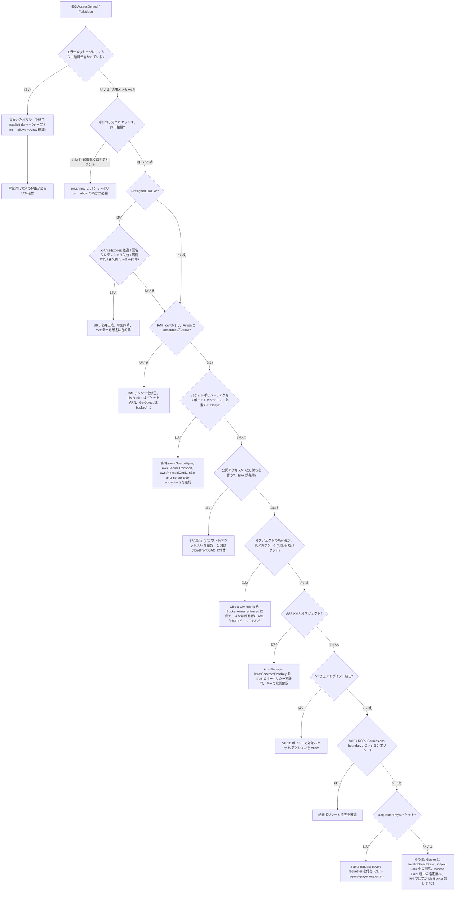
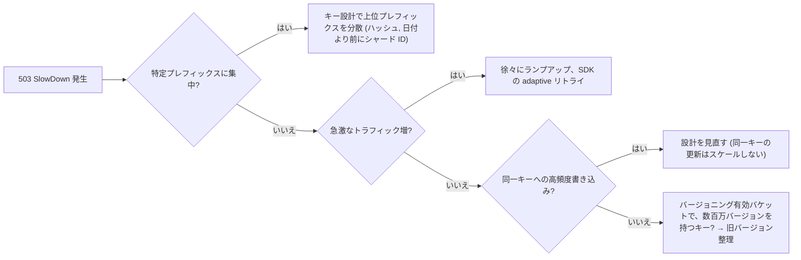

# トラブルシューティング

_最終確認: 2026-10-03_

S3 で遭遇する問題の 8 割は「権限 (403)」「場所 (301/404)」「署名と時刻」「スロットリング (503)」「想定外の請求」のどれかに分類できる。この章では、まずエラーコードの全体表で当たりを付け、次に症状別の切り分け手順を示す。

## 0. 切り分けの基本手順

1. 正確なエラーコードとメッセージを取る。CLI なら `--debug`、SDK ならレスポンスの `Code` / `Message` / `x-amz-request-id` / `x-amz-id-2` を記録する (AWS サポートへの問い合わせに必要)。
2. 「誰が」「どのエンドポイントに」「どの API を」「どのリソースに」呼んだかを確定する。`aws sts get-caller-identity` で実際のプリンシパルを確認する。
3. CloudTrail (管理イベント、データイベントを有効にしていればオブジェクト操作も) で `errorCode` / `errorMessage` を確認する。強化された AccessDenied メッセージは CloudTrail にも記録される。
4. HEAD リクエストのエラーはボディがないため、汎用的なステータスコード (400/403/404/412 等) しか返らない。原因を詳しく知りたい場合は同じ条件で GET を試す。
5. 再現を最小化する (別のプリンシパル、別のキー、別のネットワーク経路で試す)。

```bash
# 自分が誰かを確認
aws sts get-caller-identity

# 詳細なデバッグ出力 (署名に使った正規リクエストやエンドポイントが見える)
aws s3api get-object --bucket amzn-s3-demo-bucket --key path/to/key out.bin --debug 2>&1 | less

# バケットのリージョンを確認
aws s3api get-bucket-location --bucket amzn-s3-demo-bucket
aws s3api head-bucket --bucket amzn-s3-demo-bucket   # x-amz-bucket-region ヘッダーが返る
```

## 1. エラーコード早見表

S3 の REST API は XML の `<Error><Code>...</Code><Message>...</Message></Error>` を返す。主要なものを HTTP ステータス別にまとめる。

### 1.1 3xx / 4xx (クライアント側)

| コード | HTTP | 主な原因 | 対処 |
| --- | --- | --- | --- |
| `PermanentRedirect` | 301 | バケットが別リージョンにあるのに、別リージョンのエンドポイントへ送った | 正しいリージョンを指定 (`--region`、SDK の region)。レスポンスの `Endpoint` / `x-amz-bucket-region` を確認 |
| `TemporaryRedirect` | 307 | 作成直後のバケットで DNS 伝播前に古いエンドポイントへアクセス | 時間をおく、リージョン付きエンドポイントを使う |
| `AuthorizationHeaderMalformed` | 400 | 署名に使ったリージョンが誤り (例: `us-east-1` で署名して `ap-northeast-1` のバケットへ) | クライアントのリージョンをバケットに合わせる。メッセージに期待されるリージョンが含まれる |
| `BadDigest` | 400 | `Content-MD5` / チェックサムが受信データと一致しない | 送信データとチェックサム計算を確認、ネットワーク破損ならリトライ |
| `InvalidDigest` | 400 | `Content-MD5` の形式が不正 (Base64 でない等) | Base64 エンコードされた 128 bit MD5 を送る |
| `XAmzContentSHA256Mismatch` | 400 | `x-amz-content-sha256` とボディのハッシュが不一致 | ストリームを途中で書き換えていないか、プロキシの変換を確認 |
| `EntityTooSmall` | 400 | マルチパートで最後以外のパートが 5 MiB 未満 | パートサイズを 5 MiB 以上に |
| `EntityTooLarge` | 400 | 単一 PUT が 5 GiB 超、または Presigned POST の `content-length-range` 超過 | マルチパートアップロードを使う、ポリシーの上限を見直す |
| `ExpiredToken` | 400 | STS 一時クレデンシャル (セッショントークン) の期限切れ | クレデンシャルを再取得。Presigned URL は署名に使ったトークンが切れると無効 |
| `InvalidToken` | 400 | セッショントークンの形式不正・不一致 | トークンとキーの組を確認 |
| `IllegalLocationConstraintException` | 400 | `CreateBucket` の LocationConstraint とエンドポイントのリージョンが不一致 | 両者を揃える。`us-east-1` では LocationConstraint を指定しない |
| `InvalidArgument` | 400 | パラメータ値が不正 (ヘッダー値、暗号化指定の組み合わせ等) | メッセージの `ArgumentName` を確認 |
| `InvalidBucketName` | 400 | 命名規則違反 (大文字、アンダースコア、63 文字超等) | 3〜63 文字の小文字・数字・ハイフン・ドット |
| `InvalidPart` | 400 | Complete 時に指定したパートが存在しない / ETag 不一致 | `ListParts` で実在パートと ETag を確認 |
| `InvalidPartOrder` | 400 | Complete のパート一覧が昇順でない | PartNumber 昇順に並べる |
| `InvalidRequest` | 400 | 機能の組み合わせが不正 (例: ドット付きバケットで Transfer Acceleration、SigV2 を要求する等) | メッセージの詳細を確認 |
| `KeyTooLongError` | 400 | キーが 1,024 バイト (UTF-8) を超える | キーを短く |
| `MalformedXML` / `MalformedPolicy` | 400 | XML / JSON ポリシーの構文誤り、存在しないプリンシパル ARN | バリデーター (IAM Access Analyzer のポリシー検証) を通す |
| `MaxMessageLengthExceeded` | 400 | リクエストが大きすぎる (例: DeleteObjects で 1,000 キー超) | 分割する |
| `RequestTimeout` | 400 | ソケットへの書き込みがタイムアウト時間内に完了しなかった | ネットワーク・クライアントの送信ストール。リトライ、パートを小さく |
| `TooManyBuckets` | 400 | バケット数クォータ (既定 10,000) 超過 | Service Quotas で引き上げ申請 |
| `AccessDenied` | 403 | 権限不足 (詳細は 2 章) | 403 決定木で切り分け |
| `AccountProblem` | 403 | アカウントの支払い問題・停止等 | AWS サポート / 請求ダッシュボード |
| `AllAccessDisabled` | 403 | このバケット/オブジェクトへのアクセスがすべて無効化されている (アカウント停止、AWS による措置など) | AWS サポートに問い合わせ |
| `InvalidAccessKeyId` | 403 | アクセスキー ID が存在しない (削除済み、別パーティションのキー、タイプミス) | プロファイル・環境変数の優先順位を確認 (`AWS_ACCESS_KEY_ID` が残っていないか) |
| `InvalidObjectState` | 403 | Glacier Flexible Retrieval / Deep Archive / Intelligent-Tiering アーカイブ層のオブジェクトを復元せずに GET | `RestoreObject` して完了を待つ |
| `RequestTimeTooSkewed` | 403 | クライアント時刻とサーバー時刻の差が 15 分超 | NTP (chrony、Amazon Time Sync Service) で時刻同期 |
| `SignatureDoesNotMatch` | 403 | 署名不一致 (シークレットキー誤り、ヘッダーの改変、エンコードの違い、Presigned URL に署名外のヘッダーを付けた) | 6 章参照 |
| `NoSuchBucket` | 404 | バケットが存在しない (名前誤り、削除済み) | 名前とパーティションを確認 |
| `NoSuchKey` | 404 | キーが存在しない (呼び出し側に `s3:ListBucket` があるときのみ 404。ないと 403) | キーのエンコード (スペース・`+`・Unicode 正規化) を確認 |
| `NoSuchVersion` | 404 | 指定 versionId が存在しない | `ListObjectVersions` で確認 |
| `NoSuchUpload` | 404 | UploadId が存在しない (既に Complete / Abort、ライフサイクルで中止された) | 新しくマルチパートを開始 |
| `NoSuchBucketPolicy` / `NoSuchLifecycleConfiguration` / `NoSuchCORSConfiguration` / `NoSuchTagSet` | 404 | 該当設定が未設定 | 「未設定」の正常系として扱う |
| `ServerSideEncryptionConfigurationNotFoundError` / `ObjectLockConfigurationNotFoundError` / `ReplicationConfigurationNotFoundError` | 404 | 該当設定が未設定 | 同上 |
| `MethodNotAllowed` | 405 | リソースに対して許可されないメソッド (例: 削除マーカーに GET) | 対象バージョンを確認 |
| `MissingContentLength` | 411 | `Content-Length` ヘッダーがない | チャンク転送を使う場合は SigV4 ストリーミングまたはマルチパート |
| `PreconditionFailed` | 412 | `If-Match` / `If-None-Match` / `If-Unmodified-Since` 等の条件不成立。条件付き書き込みで既存オブジェクトがある、ETag 不一致 | 最新状態を読み直してから再試行 (楽観ロック) |
| `InvalidRange` | 416 | Range が オブジェクトサイズ外 | サイズを HEAD で確認 |
| `BucketAlreadyExists` | 409 | その名前は他のアカウントが使用中 (グローバル名前空間) | 別名、またはアカウントリージョナル名前空間 |
| `BucketAlreadyOwnedByYou` | 409 | 自分のアカウントが既に同名バケットを所有 (us-east-1 のレガシー挙動では 200 OK が返り ACL がリセットされうる) | 冪等な IaC で既存チェック |
| `BucketNotEmpty` | 409 | 空でないバケットの削除 (旧バージョン・削除マーカー・未完了 MPU も含む) | 12 章参照 |
| `ConditionalRequestConflict` | 409 | 条件付き書き込み中に同じキーへの競合操作 (例: 同時に削除が成功) | `PutObject` はリトライ可。`CompleteMultipartUpload` の場合は MPU を最初からやり直す |
| `InvalidBucketState` | 409 | バケットの状態と矛盾する要求 (例: Object Lock 有効バケットでバージョニング停止) | 設定の前提条件を確認 |
| `OperationAborted` | 409 | 同じリソースへの競合する条件付き操作が進行中 | 少し待ってリトライ |
| `RestoreAlreadyInProgress` | 409 | 既に復元処理中 | `HeadObject` の `x-amz-restore` で進捗確認 |

### 1.2 5xx (サーバー側・スロットリング)

| コード | HTTP | 意味 | 対処 |
| --- | --- | --- | --- |
| `InternalError` | 500 | S3 内部エラー | 指数バックオフ付きリトライ (SDK の既定動作)。継続するなら request-id を添えてサポートへ |
| `NotImplemented` | 501 | 未実装の機能 / ヘッダー (例: 未対応の `Transfer-Encoding`) | ヘッダーを見直す |
| `ServiceUnavailable` | 503 | 一時的に処理不可 | リトライ |
| `SlowDown` | 503 | リクエストレートが高すぎる (プレフィックス単位のスケール途中、KMS ではない) | 5 章参照 |

5xx はバケット所有者に課金されない。4xx は基本的に課金されるが、組織外 / アカウント外から来た 403 はバケット所有者に課金されない (2024 年の変更)。

### 1.3 KMS 関連エラー

SSE-KMS オブジェクトの読み書きでは、S3 が呼び出し元に代わって KMS を呼ぶ。KMS 側の失敗は S3 のエラーとして返る (多くは `AccessDenied` だが、メッセージや CloudTrail の KMS イベントで判別できる)。

| 現象 / KMS 側エラー | 原因 | 対処 |
| --- | --- | --- |
| `AccessDenied` (PUT 時) | 呼び出し元に `kms:GenerateDataKey` がない | IAM とキーポリシー両方で許可 |
| `AccessDenied` (GET 時) | 呼び出し元に `kms:Decrypt` がない | 同上。クロスアカウントはキーポリシーで相手アカウントを許可 |
| `AccessDenied` (マルチパート) | `CreateMultipartUpload` / `UploadPart` で `kms:GenerateDataKey`、`CompleteMultipartUpload` で `kms:Decrypt` が必要 | 両方を付与 |
| `KMS.DisabledException` | キーが無効化されている | キーを有効化 |
| `KMS.KMSInvalidStateException` | キーが削除待ち等の状態 | 削除待ちならキャンセル |
| `KMS.NotFoundException` | キーが存在しない (削除済み、別リージョンのキー ARN) | 同一リージョンのキーを指定。削除済みなら復号不能 |
| `KMS.ThrottlingException` / 503 | KMS のリクエストクォータ超過 | S3 Bucket Keys を有効にして KMS 呼び出しを削減、クォータ引き上げ |
| AWS マネージドキー (`aws/s3`) でクロスアカウント不可 | AWS マネージドキーのキーポリシーは編集できない | カスタマーマネージドキーを使う |
| 暗号化コンテキストで拒否 | キーポリシーが `kms:EncryptionContext:aws:s3:arn` を条件にしているが、Bucket Keys 有効時はバケット ARN がコンテキストになる | 条件をバケット ARN ベースに変更 |

S3 API Reference のエラーコード一覧には `KMS.DisabledException`、`KMS.KMSInvalidStateException`、`KMS.NotFoundException` など `KMS.` プレフィックス付きのコードが載っている (KMS の例外を S3 がそのまま返すもの)。他の API では表記が異なり (S3 Vectors は `KmsDisabledException` など)、KMS の権限不足は S3 では通常 `AccessDenied` として現れる。CloudTrail の KMS イベント (`Decrypt`、`GenerateDataKey`) の `errorCode` を確認するのが確実。

## 2. 403 AccessDenied の体系的な切り分け

### 2.1 2024 年以降の強化されたエラーメッセージ

同一アカウント、または同一 AWS Organizations 組織内からのリクエストでは、AccessDenied メッセージに「どの種類のポリシーが」「明示的拒否か暗黙的拒否か」が含まれる。明示的拒否 (Deny 文) の場合、SCP / RCP / アイデンティティベースポリシー / セッションポリシー / Permissions boundary については拒否したポリシーの ARN まで含まれる。

```text
User: arn:aws:iam::777788889999:user/MaryMajor is not authorized to perform:
s3:GetObject on resource: "arn:aws:s3:::amzn-s3-demo-bucket1/object-name"
with an explicit deny in a resource control policy, with policy ARN:
arn:aws:organizations::777788889999:policy/o-exampleorgid/resource_control_policy/p-examplepolicyid
```

```text
User: arn:aws:iam::123456789012:user/MaryMajor is not authorized to perform:
s3:GetObject because no VPC endpoint policy allows the s3:GetObject action
```

メッセージの読み方:

| フレーズ | 意味 | 見るべき場所 |
| --- | --- | --- |
| `with an explicit deny in a service control policy` | SCP の Deny | Organizations の SCP (ARN が付く) |
| `with an explicit deny in a resource control policy` | RCP の Deny | Organizations の RCP (ARN が付く) |
| `with an explicit deny in a resource-based policy` | バケットポリシー / アクセスポイントポリシーの Deny | バケットポリシー |
| `with an explicit deny in an identity-based policy` | IAM ポリシーの Deny | IAM (ARN が付く) |
| `with an explicit deny in a VPC endpoint policy` | VPCE ポリシーの Deny | VPC エンドポイント |
| `with an explicit deny in a permissions boundary` / `session policy` | 境界 / セッションポリシーの Deny | IAM / AssumeRole 時の Policy パラメータ |
| `because no identity-based policy allows the ... action` | IAM で Allow がない (暗黙的拒否) | IAM ポリシーに Allow を追加 |
| `because no resource-based policy allows ...` | クロスアカウント等でバケットポリシーに Allow がない | バケットポリシー |
| `because no service control policy allows ...` | SCP の Allow リストに含まれない | SCP |
| `because public access control lists (ACLs) are blocked by the BlockPublicAcls block public access setting` などの BPA 系 | Block Public Access による拒否 | アカウント / バケット / アクセスポイントの BPA |
| `because this bucket has blocked upload requests that specify Server Side Encryption with Customer provided keys (SSE-C)` | SSE-C がブロックされている | バケットの既定暗号化設定 (`BlockedEncryptionTypes`) |

制約 (公式ドキュメントより):

- 組織外のクロスアカウントリクエストには汎用の `Access Denied` しか返らない。
- 同一組織内でも、VPC エンドポイントポリシーによる拒否では強化メッセージが返らない。
- ディレクトリバケットには強化メッセージがない。
- 複数のポリシータイプ / 複数の理由で拒否された場合、メッセージには 1 つしか表示されない。1 つ直したら別の理由で再び拒否されることがある。

### 2.2 決定木



### 2.3 原因別チェックリスト

| 観点 | よくあるミス | 確認コマンド / 方法 |
| --- | --- | --- |
| IAM | `s3:ListBucket` の Resource を `arn:aws:s3:::bucket/*` にしている (正しくは `arn:aws:s3:::bucket`) | IAM Policy Simulator、`aws iam simulate-principal-policy` |
| IAM | `s3:GetObject` を `arn:aws:s3:::bucket` に付けている (正しくは `bucket/*`) | 同上 |
| バケットポリシー | `aws:SourceVpce` 条件付き Deny でコンソール (インターネット経由) からのアクセスも拒否 | `aws s3api get-bucket-policy` |
| バケットポリシー | `NotPrincipal` + Deny でロールセッション ARN を想定しておらず自分も締め出し | root ユーザーでポリシー削除 (誤って全員拒否した場合の公式手順あり) |
| BPA | 公開したいのに BPA が ON | `aws s3api get-public-access-block`、`aws s3control get-public-access-block` |
| Object Ownership / ACL | ACL 有効バケットで他アカウントが書いたオブジェクトをバケット所有者が読めない | `aws s3api get-object-acl`、`get-bucket-ownership-controls` |
| Object Ownership | Bucket owner enforced なのに PUT で `x-amz-acl: public-read` 等を指定 → `AccessControlListNotSupported` (400) | ACL ヘッダーを外す (`bucket-owner-full-control` は許容) |
| KMS | キーポリシーにクロスアカウントのプリンシパルがない | `aws kms get-key-policy` |
| VPCE | エンドポイントポリシーが特定バケットのみ許可で、新しいバケットが漏れている | `aws ec2 describe-vpc-endpoints` |
| SCP / RCP | リージョン制限 SCP (`aws:RequestedRegion`) でグローバルな S3 操作が拒否 | Organizations コンソール |
| Requester Pays | リクエスタ側が支払いに同意するヘッダーを付けていない | `aws s3api get-bucket-request-payment` |
| 別アカウント所有オブジェクト | ACL 有効バケットでアップロード時に `bucket-owner-full-control` を付けなかった | Object Ownership を enforced にすれば既存オブジェクトも所有者がバケット所有者に変わる |
| Presigned URL | 有効期限切れ、`ExpiredToken`、署名に使ったロールのセッション期限 (最大 12 時間等) が URL より短い | URL の `X-Amz-Date` と `X-Amz-Expires`、`X-Amz-Security-Token` |
| Presigned URL | 生成者自身に権限がない (Presigned URL は生成者の権限で実行される) | 生成者のロールで直接 API を叩いて確認 |
| 時刻ずれ | クライアント時計が 15 分超ずれ → `RequestTimeTooSkewed`。Presigned URL では未来日時の `X-Amz-Date` で失敗 | `date -u`、`chronyc tracking` |
| 存在しないキー | `s3:ListBucket` がないと 404 ではなく 403 が返る | キーの存在を別の権限で確認 |
| Object Lock | 保持期間中のバージョン削除・上書き (バージョン ID 指定の削除) | `aws s3api get-object-retention`、`get-object-legal-hold` |
| Access Point | アクセスポイントポリシーとバケットポリシー (アクセスポイントへの委任) の両方が必要 | バケットポリシーに `s3:DataAccessPointAccount` 条件で委任 |
| CloudFront OAC | バケットポリシーの `AWS:SourceArn` がディストリビューション ARN と不一致、KMS キーポリシーに CloudFront がない | CloudFront の origin 設定と比較 |

### 2.4 IAM Access Analyzer と Policy Simulator

```bash
# あるロールが GetObject できるかシミュレーション (リソースポリシーも考慮させる)
aws iam simulate-principal-policy \
  --policy-source-arn arn:aws:iam::111122223333:role/app-role \
  --action-names s3:GetObject \
  --resource-arns arn:aws:s3:::amzn-s3-demo-bucket/path/key \
  --resource-policy file://bucket-policy.json

# ポリシーの文法・セキュリティ警告を検証
aws accessanalyzer validate-policy --policy-type RESOURCE_POLICY \
  --policy-document file://bucket-policy.json \
  --validate-policy-resource-type AWS::S3::Bucket
```

## 3. CORS のデバッグ

ブラウザのコンソールに `No 'Access-Control-Allow-Origin' header is present` と出る場合の確認ポイント。

| 症状 | 原因 | 対処 |
| --- | --- | --- |
| プリフライト (OPTIONS) が 403 | CORS 設定がない、`AllowedOrigins` / `AllowedMethods` / `AllowedHeaders` に該当しない | CORS ルールを追加。リクエストの `Access-Control-Request-Headers` をすべて許可 |
| GET は成功するが JS から読めない | レスポンスに `Access-Control-Allow-Origin` がない (リクエストに `Origin` ヘッダーがない、CloudFront キャッシュが Origin なしの応答を返した) | CloudFront で `Origin` ヘッダーをキャッシュキー / オリジンリクエストポリシーに含める (マネージドポリシー `CORS-S3Origin`) |
| マルチパート完了時に ETag が `null` | `ExposeHeaders` に `ETag` がない | `ExposeHeaders: ["ETag"]` |
| website endpoint で CORS が効かない | REST endpoint と website endpoint の挙動差、リダイレクト | REST endpoint + CloudFront を使う |
| 403 なのに CORS エラーに見える | 実際は権限エラー。エラーレスポンスにも CORS ヘッダーが付かないとブラウザは CORS エラーとして表示 | `curl -v` で実ステータスを確認 |

```bash
# プリフライトを手動で再現
curl -i -X OPTIONS "https://amzn-s3-demo-bucket.s3.ap-northeast-1.amazonaws.com/uploads/a.png" \
  -H "Origin: https://app.example.com" \
  -H "Access-Control-Request-Method: PUT" \
  -H "Access-Control-Request-Headers: content-type"
```

```json
[
  {
    "AllowedOrigins": ["https://app.example.com"],
    "AllowedMethods": ["GET", "PUT", "HEAD"],
    "AllowedHeaders": ["*"],
    "ExposeHeaders": ["ETag", "x-amz-version-id"],
    "MaxAgeSeconds": 3000
  }
]
```

## 4. アップロード / ダウンロードが遅い

| 原因 | 診断 | 対処 |
| --- | --- | --- |
| 単一ストリームで大きなファイル | 1 接続のスループット上限に張り付く | マルチパート並列アップロード、Range GET 並列ダウンロード、AWS CRT ベースの SDK / CLI (`aws configure set default.s3.preferred_transfer_client crt`) |
| リージョンが遠い | レイテンシ (RTT) が大きい | 近いリージョン、Transfer Acceleration (Speed Comparison ツールで効果確認)、CloudFront |
| NAT Gateway 経由 | NAT の帯域・コスト | Gateway VPC エンドポイント |
| EC2 インスタンスのネットワーク帯域 | インスタンスタイプのネットワーク性能上限 | ネットワーク性能の高いインスタンスタイプ。ENA Express は効かない: 両方で有効化した EC2 インスタンス間の通信にのみ適用され、S3 との通信は対象外 |
| 小さなファイル大量 | 1 リクエストあたりのオーバーヘッドが支配的 | 並列度を上げる、ファイルをまとめる、S3 Express One Zone |
| SSE-KMS の KMS スロットリング | KMS の `ThrottlingException` | S3 Bucket Keys |
| クライアントの CPU (TLS / チェックサム) | CPU 使用率 100% | CRT クライアント、適切な並列数 |
| `aws s3 sync` が遅い | 大量のキー比較 (LIST) が発生 | `--size-only` / `--exact-timestamps` の見直し、S3 Batch Operations、DataSync |

CLI の並列度調整:

```bash
aws configure set default.s3.max_concurrent_requests 32
aws configure set default.s3.multipart_threshold 64MB
aws configure set default.s3.multipart_chunksize 16MB
```

## 5. 503 SlowDown (スロットリング)

S3 はプレフィックスあたり少なくとも毎秒 3,500 の PUT/COPY/POST/DELETE、5,500 の GET/HEAD をサポートし、負荷に応じて自動的にパーティションを分割してスケールする。分割の途中では一時的に 503 SlowDown が返ることがある。



| 対処 | 詳細 |
| --- | --- |
| リトライ | SDK の `retry_mode = adaptive` または `standard`、`max_attempts` を増やす |
| プレフィックス分散 | `logs/2026/10/03/...` を `logs/a7/2026/10/03/...` のように |
| 監視 | CloudWatch リクエストメトリクス (`5xxErrors`)、Storage Lens のアクティビティメトリクス |
| 503 は課金されない | ただしリトライで成功した分は課金 |
| 大量のバージョン | 同一キーに数百万のバージョンがあると 503 が出やすいと公式にも記載あり。ライフサイクルで非現行バージョンを削除 |

## 6. SignatureDoesNotMatch

| よくある原因 | 対処 |
| --- | --- |
| シークレットアクセスキーの誤り / 前後の空白 | クレデンシャルを再設定 |
| Presigned URL を作成した後にクライアントが署名外のヘッダー (`Content-Type` 等) を付けて送った | 生成時に指定したヘッダーと同じ値で送る、または指定しない |
| キーのエンコード不一致 (スペース、`+`、Unicode) | SDK に任せ、自前で URL エンコードしない |
| プロキシ / CDN がヘッダーやクエリを書き換えた | 直接接続で再現確認 |
| 署名リージョンの不一致 | `AuthorizationHeaderMalformed` と併発しやすい |
| SigV2 を使っている | SigV4 に移行 (SigV2 は新規バケットでサポートされない) |

エラーレスポンスの `<StringToSign>` と `<CanonicalRequest>` を、クライアント側の `--debug` 出力と比較すると差分がわかる。

## 7. 想定外の請求

### 7.1 調査の手順

1. Cost Explorer で Service = S3、Group by = Usage Type にして、どの Usage Type が増えたかを特定する。
2. 増えた Usage Type に応じて、Storage Lens (バケット / プレフィックス別)、CloudWatch リクエストメトリクス、サーバーアクセスログ / CloudTrail データイベントで「どのバケット・誰が」を特定する。
3. 詳細は CUR 2.0 (Data Exports) を Athena でクエリし、`line_item_resource_id` (バケット名) と `line_item_usage_type`、`line_item_operation` で集計する。

```sql
-- CUR 2.0 をバケット × Usage Type × Operation で集計
SELECT line_item_resource_id AS bucket,
       line_item_usage_type,
       line_item_operation,
       SUM(line_item_usage_amount) AS usage,
       SUM(line_item_unblended_cost) AS cost
FROM cur2
WHERE line_item_product_code = 'AmazonS3'
  AND billing_period = '2026-09'
GROUP BY 1, 2, 3
ORDER BY cost DESC
LIMIT 50;
```

### 7.2 Usage Type 別の典型原因

Usage Type は `APN1-TimedStorage-ByteHrs` のようにリージョンプレフィックスが付く (us-east-1 は省略)。

| Usage Type (リージョン接頭辞を除く) | 意味 | よくある原因 | 対処 |
| --- | --- | --- | --- |
| `TimedStorage-ByteHrs` | Standard の保存量 (GB-月) | 非現行バージョンの蓄積、未完了 MPU、ログの無期限保持 | ライフサイクル、Storage Lens の「非現行バージョンのバイト数」「未完了 MPU バイト数」 |
| `TimedStorage-SIA-ByteHrs` / `TimedStorage-SIA-SmObjects` | Standard-IA の保存量 / 128 KB 未満の最小課金分 | 小さなオブジェクトを IA に遷移 | 128 KB 未満は Standard のまま |
| `TimedStorage-GlacierByteHrs` / `TimedStorage-GDA-ByteHrs` | Glacier Flexible / Deep Archive | 想定通りなら問題なし。アーカイブ毎に約 40 KB のメタデータ分の追加課金がある | 小さなファイルはまとめてからアーカイブ |
| `EarlyDelete-*` | 最低保存期間 (IA 系 30 日、GIR/GFR 90 日、GDA 180 日) 前の削除・上書き・遷移 | 頻繁に上書きされるデータを IA/Glacier に入れた | アクセスパターンを見直す |
| `Requests-Tier1` | PUT/COPY/POST/LIST | LIST ループ、小さなオブジェクトの大量書き込み、`aws s3 sync` の多用 | LIST を減らす、まとめ書き |
| `Requests-Tier2` | GET/HEAD 等 | クローラ、CDN キャッシュミス、ポーリング | CloudFront キャッシュ、ポーリング廃止 |
| `Requests-Tier3` / `Tier4` | Glacier への遷移・標準復元 / IA・GIR・INT への遷移 | 小さなオブジェクト大量のライフサイクル遷移 | 遷移対象サイズの下限、集約 |
| `Retrieval-SIA` / `Retrieval-GIR` | IA / GIR からの取り出し (GB) | 「アクセス頻度が低い」前提が崩れている | Standard / Intelligent-Tiering へ |
| `Monitoring-Automation-INT` | Intelligent-Tiering の監視料 (オブジェクト数) | 小さなオブジェクト大量 (128 KB 未満は監視対象外で料金もかからない) | 平均オブジェクトサイズを確認 |
| `DataTransfer-Out-Bytes` | インターネットへの転送 | 公開バケット、website endpoint 直配信、外部からのダウンロード | CloudFront、Requester Pays、アクセス制限 |
| `region1-region2-AWS-Out-Bytes` | リージョン間転送 | CRR、別リージョンの計算からの読み出し | 計算を同一リージョンへ |
| `C3DataTransfer-Out-Bytes` | 同一リージョンの EC2 への転送 | 通常無料 (料金 0 の行) | — |
| `TagStorage-TagHrs` | オブジェクトタグ | 全オブジェクトにタグ | 必要なものだけ |
| `Inventory-ObjectsListed` / `StorageLens-ObjCount` | Inventory / Storage Lens 高度なメトリクス | 不要な日次 Inventory | 頻度・対象の見直し |
| `Global-Bucket-Hrs` | 2,000 バケットの無料枠を超えたバケット数 | テナント毎バケット等で大量作成 | 不要バケットの削除、設計見直し |
| `KMS` (別サービス) | SSE-KMS の API 呼び出し | Bucket Keys 未使用 | S3 Bucket Keys |

見落としがちな「隠れストレージ」:

```bash
# 未完了のマルチパートアップロード一覧
aws s3api list-multipart-uploads --bucket amzn-s3-demo-bucket

# 非現行バージョンと削除マーカーの数をざっくり数える (大きなバケットでは Inventory を使う)
aws s3api list-object-versions --bucket amzn-s3-demo-bucket \
  --query '{versions: length(Versions[?IsLatest==`false`]), markers: length(DeleteMarkers)}'
```

`aws s3 ls --summarize --recursive` は現行バージョンしか数えないので、請求の保存量と一致しないことがある。

### 7.3 知らない誰かに PUT された / 403 で課金される

2024 年 5 月に AWS は、バケット所有者のアカウントまたは組織外から来た未認可リクエスト (403) にバケット所有者が課金されないよう変更した。それでも予期しないリクエストが多い場合はバケット名が外部 (OSS の設定ファイル等) に露出していないかを確認し、アカウントリージョナル名前空間などで推測されにくい名前にする。

## 8. ライフサイクルが動かない

| 原因 | 説明 | 対処 |
| --- | --- | --- |
| 反映待ち | ルールは 1 日 1 回非同期に評価され、適用まで数日かかることがある。期限の日付は「作成日 + 日数」の翌日 00:00 UTC に丸められる | 待つ。課金は対象になった時点で止まる |
| フィルタ不一致 | プレフィックスの末尾 `/` 有無、タグの大文字小文字、AND 条件 | `aws s3api get-bucket-lifecycle-configuration` |
| 128 KB 未満 | 2024 年 9 月以降、既定では 128 KB 未満のオブジェクトは遷移されない | `ObjectSizeGreaterThan` で明示的に小さい値を指定 (コストに注意) |
| 遷移の制約 | Standard-IA / One Zone-IA へは作成後 30 日以上、ウォーターフォールの上向き遷移は不可 | 日数とクラスを見直す |
| バージョニング | Expiration は現行バージョンに削除マーカーを付けるだけで、データは非現行として残る | `NoncurrentVersionExpiration` と `ExpiredObjectDeleteMarker` を併用 |
| Object Lock | 保持期間中のバージョンは削除されない | 保持期限を待つ |
| レプリケーション保留 | レプリケーションが `PENDING` のオブジェクトは遷移しない | レプリケーションの問題を解消 |
| 状態が Disabled | ルールの `Status` が `Disabled` | `Enabled` に |
| 確認方法 | — | `HeadObject` の `x-amz-expiration` ヘッダー、Storage Lens、サーバーアクセスログの `S3.EXPIRE.OBJECT` / `S3.TRANSITION...` 操作 |

## 9. レプリケーションが動かない

```bash
# オブジェクト単位の状態を確認 (PENDING / COMPLETED / FAILED / REPLICA)
aws s3api head-object --bucket src-bucket --key path/key --query ReplicationStatus
```

| 原因 | 確認 | 対処 |
| --- | --- | --- |
| 既存オブジェクト | ルール作成前のオブジェクトは複製されない | S3 Batch Replication |
| バージョニング | 送信元・送信先の両方で有効化が必要 | 両方有効化 |
| IAM ロール | `s3:GetObjectVersionForReplication`、`s3:GetObjectVersionAcl`、`s3:GetObjectVersionTagging` (送信元)、`s3:ReplicateObject`、`s3:ReplicateDelete`、`s3:ReplicateTags` (送信先) | ロールのポリシーと信頼ポリシー (`s3.amazonaws.com`) |
| 送信先バケットポリシー (クロスアカウント) | 送信元のレプリケーションロールを許可していない | 送信先バケットポリシーで許可、所有者を送信先に変更するなら `s3:ObjectOwnerOverrideToBucketOwner` |
| KMS | ルールで「KMS 暗号化オブジェクトを複製」が未選択、ロールに送信元キーの `kms:Decrypt`、送信先キーの `kms:Encrypt` がない、AWS マネージドキー (`aws/s3`) をクロスアカウントで使用 | カスタマーマネージドキーと両方のキーポリシー |
| SSE-C | S3 レプリケーションは SSE-C オブジェクトをサポートし、非暗号化オブジェクトと同じ手順で設定でき追加の権限も不要。自動で複製されるのは新規アップロードされた SSE-C オブジェクトのみ | 既存の SSE-C オブジェクトは S3 Batch Replication。可能なら SSE-KMS へ |
| Object Lock | 送信先でも Object Lock が必要 | 送信先で有効化 |
| 削除 | 削除マーカー複製は既定 (V2 設定) で無効、バージョン ID 指定削除は複製されない (悪意のある削除から守る設計) | 必要なら `DeleteMarkerReplication` を有効化 |
| レプリカの再複製 | レプリカはチェーン複製されない (A→B→C では A のオブジェクトは C に行かない) | 各送信元からルールを作る |
| ライフサイクルで作られたもの | ライフサイクル遷移・削除は複製されない | 送信先にもライフサイクル |
| 監視 | — | S3 Replication metrics (RTC 有効時、または有効化)、`OperationsFailedReplication`、イベント `s3:Replication:OperationFailedReplication` で失敗理由を取得 |

## 10. イベント通知が来ない

| 原因 | 対処 |
| --- | --- |
| 宛先のリソースポリシーが S3 に送信を許可していない (SNS トピックポリシー、SQS キューポリシー、Lambda の resource-based policy) | `aws:SourceArn` / `aws:SourceAccount` 条件付きで `s3.amazonaws.com` を許可 |
| SQS が FIFO キュー | S3 Event Notifications は FIFO キュー非対応。EventBridge 経由にする |
| 暗号化 SQS / SNS のキーが AWS マネージドキー | S3 がキーを使えるよう、カスタマーマネージドキーのキーポリシーで `s3.amazonaws.com` に `kms:GenerateDataKey`・`kms:Decrypt` を許可 |
| プレフィックス / サフィックスの不一致 | URL エンコード (スペースは `+`) されたキーで比較される点に注意 |
| 同一イベントタイプ・重複するプレフィックスで複数通知を定義しようとして設定エラー | 1 宛先 (SNS ファンアウト) か EventBridge |
| イベント種別の不一致 | マルチパートは `s3:ObjectCreated:CompleteMultipartUpload`。`ObjectCreated:*` を推奨 |
| EventBridge に届かない | バケットで EventBridge 送信を有効化したか、ルールのパターン (`detail.bucket.name`) |
| ライフサイクルによる削除 | `s3:LifecycleExpiration:*` を購読 |
| テストイベント | 設定直後に `s3:TestEvent` が送られる。コード側でスキップ |

## 11. Glacier からの復元

| 項目 | Glacier Flexible Retrieval | Glacier Deep Archive | Intelligent-Tiering Archive 層 |
| --- | --- | --- | --- |
| Expedited | 通常 1〜5 分 (250 MB 未満が目安、プロビジョンド容量で保証) | 不可 | Archive Access 層のみ可 |
| Standard | 通常 3〜5 時間 (Batch Operations 経由なら数分で開始される改善あり) | 通常 12 時間以内 | 3〜5 時間 / 12 時間 |
| Bulk | 通常 5〜12 時間 (無料) | 通常 48 時間以内 | 5〜12 時間 / 48 時間以内 (Archive Access 層 / Deep Archive Access 層) |
| 復元後 | 指定日数だけ一時コピー (Standard 料金で課金) | 同左 | 復元されると Frequent Access 層に戻る (日数指定なし) |

よくあるつまずき:

1. 復元せずに GET → `InvalidObjectState` (403)。
2. 復元済みか確認するには `HeadObject` の `x-amz-restore` ヘッダー (`ongoing-request="false", expiry-date="..."`) を見る。
3. 復元を重ねて実行 → `RestoreAlreadyInProgress` (409)。
4. 大量復元は S3 Batch Operations の「Restore」ジョブ + `s3:ObjectRestore:Completed` イベントで完了を検知する。
5. 恒久的にクラスを戻すには、復元後に同じキーへ `CopyObject` (ストレージクラス指定) する。
6. Glacier Instant Retrieval は復元不要 (ミリ秒アクセス、取り出し料金あり)。

```bash
aws s3api restore-object --bucket amzn-s3-demo-bucket --key archive/2019/data.tar \
  --restore-request '{"Days":7,"GlacierJobParameters":{"Tier":"Bulk"}}'
aws s3api head-object --bucket amzn-s3-demo-bucket --key archive/2019/data.tar --query Restore
```

## 12. 数百万バージョンを持つバケットを削除する

バケットを削除するには、すべてのオブジェクトバージョン・削除マーカー・未完了マルチパートを消して空にする必要がある (`BucketNotEmpty`)。

| 方法 | 長所 | 短所 |
| --- | --- | --- |
| コンソールの「空にする (Empty)」 | 手軽 | 大規模だとブラウザを開いたまま長時間。料金は DELETE リクエスト (無料) と LIST |
| ライフサイクルで全期限切れ | API 呼び出し不要、DELETE は無料、オブジェクト数に関係なくスケール | 1 日 1 回評価で数日かかる |
| `DeleteObjects` スクリプト | 即時性 | 1 リクエスト 1,000 キー、LIST 料金、スロットリング対策が必要 |
| S3 Batch Operations | 管理された並列処理 | Batch Operations の料金 + Lambda。Batch Operations に組み込みの削除操作はないため「Lambda 関数の呼び出し」操作で削除する |

ライフサイクルで空にする設定 (KC 記事の手順と同等):

```json
{
  "Rules": [
    {
      "ID": "empty-current-and-noncurrent",
      "Status": "Enabled",
      "Filter": {},
      "Expiration": { "Days": 1 },
      "NoncurrentVersionExpiration": { "NoncurrentDays": 1 },
      "AbortIncompleteMultipartUpload": { "DaysAfterInitiation": 1 }
    },
    {
      "ID": "remove-expired-delete-markers",
      "Status": "Enabled",
      "Filter": {},
      "Expiration": { "ExpiredObjectDeleteMarker": true }
    }
  ]
}
```

注意点:

1. Object Lock で保持中のバージョンは削除できない (Compliance モードは期限まで待つしかない)。
2. MFA Delete が有効だとライフサイクルは使えない (MFA Delete 有効バケットではライフサイクル設定不可)。root で MFA Delete を先に無効化する。
3. レプリケーション設定があると、送信先にも削除マーカーが複製されることがある。先にレプリケーション設定を削除する。
4. 空になったら `aws s3api delete-bucket`。削除後、同じ名前は第三者が再作成できる (外部からの参照を先に消す)。

## 13. その他のよくある症状

| 症状 | 原因 | 対処 |
| --- | --- | --- |
| コンソールでフォルダを削除したのに容量が減らない | バージョニング有効で削除マーカーが付いただけ | 「バージョンを表示」で非現行を削除、ライフサイクル |
| アップロード直後に LIST に出ない | 2020 年 12 月以降 S3 は強い read-after-write 整合性 (LIST も含む)。出ない場合は別キー / 別リージョン / キャッシュ (CloudFront) を疑う | キーとエンドポイントを確認 |
| CloudFront 経由で古いファイルが出る | エッジキャッシュ | Invalidation、ハッシュ付きファイル名 |
| `aws s3 cp` で `Content-Type` が `binary/octet-stream` | 拡張子から推測できない | `--content-type` を指定 |
| ETag が MD5 と一致しない | マルチパート (ETag は「パート MD5 の MD5-パート数」)、SSE-KMS / SSE-C | 完全性検証には追加チェックサム (CRC64NVME / CRC32C / SHA256) を使う |
| 日本語キーが文字化け / 見つからない | NFC/NFD の Unicode 正規化差 (macOS は NFD) | アップロード前に NFC 正規化 |
| `HeadBucket` が 403 / 404 | 403 は存在するが権限なし (他人のバケット)、404 は存在しない | 名前を確認 |
| `AccessControlListNotSupported` (400) | Bucket owner enforced のバケットに ACL 付き PUT | ACL ヘッダーを外す |
| `InvalidRequest: ... SSE-C` | SSE-C がブロックされているバケット (2026 年 4 月からの既定) | SSE-KMS / SSE-S3 を使う、必要なら `BlockedEncryptionTypes` を変更 |

## 参考文献

- Troubleshoot access denied (403 Forbidden) errors in Amazon S3: <https://docs.aws.amazon.com/AmazonS3/latest/userguide/troubleshoot-403-errors.html>
- Amazon S3 Error Responses (Error code list): <https://docs.aws.amazon.com/AmazonS3/latest/API/ErrorResponses.html>
- Amazon S3 error best practices: <https://docs.aws.amazon.com/AmazonS3/latest/developerguide/ErrorBestPractices.html>
- How do I troubleshoot explicit deny error messages: <https://repost.aws/knowledge-center/iam-explicit-deny-errors>
- Why am I getting a 403 Forbidden error when I try to upload files: <https://repost.aws/knowledge-center/s3-403-forbidden-error>
- How to prevent object overwrites with conditional writes: <https://docs.aws.amazon.com/AmazonS3/latest/userguide/conditional-writes.html>
- Performance design patterns for Amazon S3: <https://docs.aws.amazon.com/AmazonS3/latest/userguide/optimizing-performance-design-patterns.html>
- Understanding your AWS billing and usage reports for Amazon S3: <https://docs.aws.amazon.com/AmazonS3/latest/userguide/aws-usage-report-understand.html>
- Billing for Amazon S3 error responses: <https://docs.aws.amazon.com/AmazonS3/latest/userguide/ErrorCodeBilling.html>
- Amazon S3 multipart upload limits: <https://docs.aws.amazon.com/AmazonS3/latest/userguide/qfacts.html>
- How do I troubleshoot lifecycle configuration rule issues: <https://repost.aws/knowledge-center/s3-lifecycle-configuration-rule>
- How do I use a lifecycle configuration rule to empty an S3 bucket: <https://repost.aws/knowledge-center/s3-empty-bucket-lifecycle-rule>
- Why don't my Amazon S3 objects replicate: <https://repost.aws/knowledge-center/s3-troubleshoot-replication>
- Troubleshooting replication: <https://docs.aws.amazon.com/AmazonS3/latest/userguide/replication-troubleshoot.html>
- Amazon S3 Glacier storage classes (retrieval times): <https://aws.amazon.com/s3/storage-classes/glacier/>
- Restoring an archived object: <https://docs.aws.amazon.com/AmazonS3/latest/userguide/restoring-objects.html>
- Using CORS: <https://docs.aws.amazon.com/AmazonS3/latest/userguide/cors.html>
- Amazon S3 Event Notifications: <https://docs.aws.amazon.com/AmazonS3/latest/userguide/EventNotifications.html>
- Amazon S3 starts rolling out new security best practice (SSE-C, 2026-04): <https://aws.amazon.com/about-aws/whats-new/2026/04/s3-default-bucket-security-setting/>
- General purpose bucket quotas: <https://docs.aws.amazon.com/AmazonS3/latest/userguide/BucketRestrictions.html>
- ENA Express (requirements: traffic between EC2 instances): <https://docs.aws.amazon.com/AWSEC2/latest/UserGuide/ena-express.html>
- Replicating encrypted objects (SSE-S3, SSE-KMS, DSSE-KMS, SSE-C): <https://docs.aws.amazon.com/AmazonS3/latest/userguide/replication-config-for-kms-objects.html>
- Operations supported by S3 Batch Operations: <https://docs.aws.amazon.com/AmazonS3/latest/userguide/batch-ops-operations.html>
