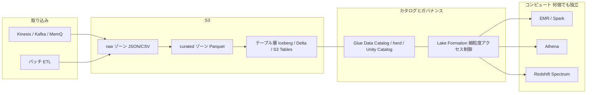
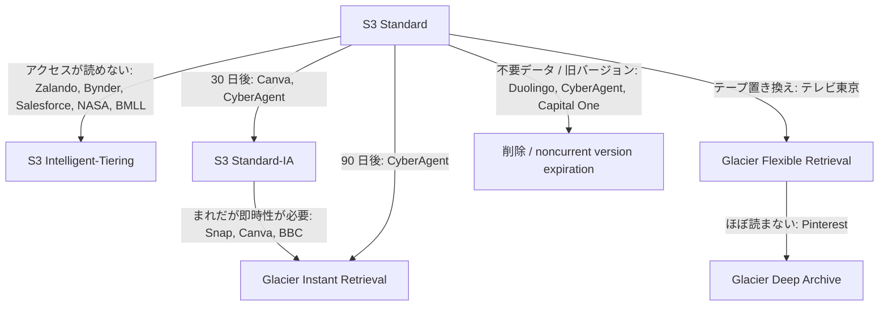
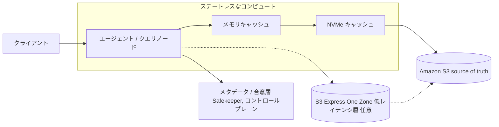
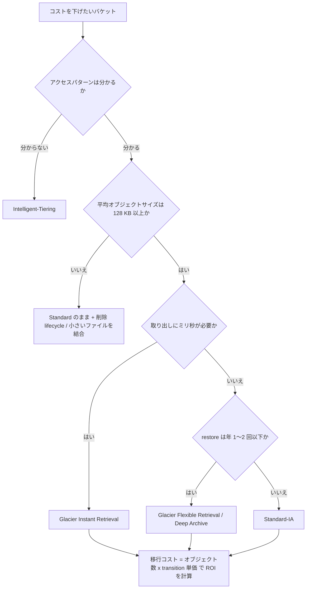

# 企業の活用事例 — 誰が S3 をどう使い、何を学んだか

_最終確認: 2026-10-03_

この章では、Amazon S3 を使っている (または S3 の上に製品を作った、あるいは S3 から離れた) 実在企業の公開事例を、業種別に整理する。数字は **すべて公開ソースにある値** だけを載せる。出典 URL は各事例の末尾と「参考文献」にまとめた。

## この章のルール

- 数値は「公開された時点の値」。年を必ず添える。S3 の利用量は増え続けるので、古い数字は下限の目安として読む
- 「AWS 公式事例」「企業の技術ブログ」「re:Invent 講演」「報道」を区別して書く。ベンダー自身の主張 (WarpStream のコスト比較など) はそう明記する
- 出典から確認できなかったことは **未確認** と書く。推測で埋めない
- 種別は 3 つに分ける
  - **adopter**: S3 を自社システムのストレージとして使う
  - **built-on-s3**: S3 を土台に製品・サービスそのものを作っている
  - **migrated-away**: S3 から自前ストレージへ移った (反例)
- 機械可読版は `data/cases.json` にある (英日併記)。JSON の `year` は出典の公開年。ページに日付がない事例は、PDF 版の著作権表記とメタデータ (Ancestry 2023、テレビ東京 2020)、AWS の事例インデックス (Bynder 2024)、その事例を引用した日付付きの AWS 記事 (BMLL 2025) から年を決めた。BMW Group はページに日付がないため、`year` は確認年の 2026

## 前提: 2026 年時点の S3 の規模

S3 20 周年の AWS News Blog (2026-03-13) によると、S3 は **500 兆を超えるオブジェクト** を保存し、**毎秒 2 億を超えるリクエスト** を処理し、データ量は **数百エクサバイト** に達する。2006 年のローンチ時の容量は約 1 PB、価格は 15 セント/GB から現在は 2 セント強へ約 85% 下がった。S3 Intelligent-Tiering による顧客の累計節約額は **60 億ドル超** とされている。

以下の事例は、この巨大な基盤の上で「どこに何を置き、どのストレージクラスに落とし、どこで失敗したか」の具体例になる。

## 1. メディア・コンシューマー

メディア系に共通するのは「作られた直後はよく見られるが、すぐ冷える。でも見たいときは即座に返さないといけない」というアクセスパターン。ここでは S3 Glacier Instant Retrieval (以下 Glacier IR) が主役になる。

### 1.1 Netflix — エクサバイト級データレイクを Iceberg に統一

- **業種**: 動画配信
- **保存対象**: 分析用データウェアハウス / データレイクのテーブルデータ
- **規模**: AWS re:Invent 2023 の講演 (NFX306) で「exabyte-scale data warehouse」と説明されている。講演紹介では、移行時点で約 300 PB が旧来の Apache Hive テーブル形式のまま残っていた
- **アーキテクチャ**:
  - S3 上のデータを、Netflix 自身が生み出したテーブルフォーマット **Apache Iceberg** で管理する
  - Hive から「Iceberg のみ」の構成へ移行するために、独自の移行ツール、secure Iceberg tables、Iceberg REST catalog を作った
  - データの物理的な移動とユーザーへの影響を最小限にする方針をとった
- **成果**: ACID トランザクション、リッチなメタデータ層、クエリ性能の向上 (講演の要約より)。削減額などの数値は講演の紹介文には書かれていない
- **教訓**: S3 は「ファイルを置く場所」で、テーブルとしての整合性やスキーマ進化はテーブルフォーマットが担う。Netflix は Iceberg の生みの親であり、S3 Tables (2024 年発表) のような「マネージド Iceberg」が登場する流れの起点になった
- **出典**: [AWS re:Invent 2023 NFX306](https://aws.amazon.com/video/watch/3db41488539/)

### 1.2 Snap — 2 EB を 3 か月で Glacier IR へ

- **業種**: SNS (Snapchat)
- **保存対象**: ユーザーが保存した写真・動画 (Memories)
- **規模**: 約 **1.5 兆** のメディアファイル、**2 エクサバイト** (2022 年)。日次アクティブユーザー 3 億 6,300 万人
- **アーキテクチャ**:
  - もともと保存メディアは S3 Standard-IA に置いていた
  - 「数日見られたあと、数か月〜数年見られない」というパターンに合わせて、2022 年 3 月から 6 月にかけて既存コンテンツをすべて Glacier IR に移行し、新規コンテンツも Glacier IR に保存するようにした
- **成果**: ストレージコストで「**数千万ドル**」の節約。一部リージョンでダウンロードレイテンシが 20〜30% 改善、可用性 99.99% 超
- **教訓**: Glacier IR はミリ秒で取り出せるので、ユーザー体験を変えずにクラスを下げられる。Snap の担当者は「この大規模移行に顧客の誰も気づかなかったことが大きな勝利だった」と述べている
- **出典**: [AWS case study: Snap](https://aws.amazon.com/solutions/case-studies/snap-case-study/)

### 1.3 Canva — 230 PB のうち 130 PB を Glacier IR へ、年 360 万ドル削減

- **業種**: デザイン SaaS
- **保存対象**: ユーザーが作ったデザインとアップロード素材
- **規模**: S3 全体で **230 PB**、**3,000 億を超えるオブジェクト**。最大のバケットは 45 PB (2023 年 5 月時点)
- **アーキテクチャ**:
  - lifecycle で S3 Standard → 30 日後に Standard-IA という構成だった
  - S3 Storage Class Analysis でアクセスパターンを調べ、130 PB (全体の 56%) を Glacier IR へ移した。約 800 億オブジェクトの移行を約 2 日で実施
- **成果**: 月 **30 万ドル**、年 **360 万ドル** の削減。移行の一時コストは **160 万ドル** で、数か月で回収
- **教訓** (この章で最も実務的な教訓の 1 つ):
  - 移行コストは **オブジェクト数** に比例する (Glacier IR への移行は 1,000 オブジェクトあたり 0.02 ドル)。全 3,000 億オブジェクトを動かすと約 600 万ドルかかる試算だった
  - Standard-IA と Glacier IR は最小課金サイズが **128 KB**。小さいオブジェクトは下げても得をしない
  - 平均オブジェクトサイズが **400 KB 以上** のバケットから着手すると早く元が取れる。20 KB 未満のオブジェクトは S3 Standard のままのほうが安い場合がある
- **出典**: [Canva Engineering Blog: How Canva saves millions annually in Amazon S3 costs](https://www.canva.dev/blog/engineering/optimising-s3-savings/), [Glacier IR 製品ページの Canva の引用](https://aws.amazon.com/s3/storage-classes/glacier/instant-retrieval/)

### 1.4 Pinterest — 約 1 EB をアクセス分析して Deep Archive へ、MemQ で Kafka 代替

- **業種**: SNS / ビジュアル検索
- **保存対象**: 画像、ML 学習データ、ログなど
- **規模**: 3,000 億を超える Pin、複数リージョンにまたがる **約 1 エクサバイト**、数十億オブジェクト (2021 年 12 月)
- **アーキテクチャ (コスト最適化)**:
  - S3 Server Access Logs と S3 Inventory を Hadoop/Spark で集計し、S3 Storage Lens とオブジェクトタグでプレフィックス単位の可視化を行う「storage insights」パイプラインを構築
  - 例として、2 年前のオブジェクトがあるのに、作成から最終アクセスまで最大 6 日、アクセスされたのは全体の 0.009% だけというデータセットを Deep Archive 候補にした
  - 移行は S3 Lifecycle の transition rule で行い、大量オブジェクトには S3 Batch Operations を使った
- **アーキテクチャ (MemQ)**:
  - ML 学習データを流す自社製 Pub/Sub「MemQ」は S3 をストレージに使う。Pinterest の Kafka 構成と比べて **90% 以上安い** (2022 年 2 月の AWS Storage Blog)
  - S3 のホットスポットを避けるため、2 バイトの hex ハッシュで 256 個のプレフィックスに分散 (salted prefix)
  - 2023 年の S3 Express One Zone の GA 発表では、MemQ で Express One Zone を試して **10 倍以上のレイテンシ改善** を確認したと Pinterest がコメントしている
- **成果**: Deep Archive 導入で「年間数百万ドル規模の節約」(具体額は非公開)
- **教訓**: 「頻繁な restore は Deep Archive の節約を台無しにする」。アーカイブ前にアクセス実績を必ず見る。restore の手順を標準化して無駄な取り出しを防ぐ
- **出典**: [AWS Storage Blog: Pinterest と Glacier Deep Archive](https://aws.amazon.com/blogs/storage/how-pinterest-uses-amazon-s3-glacier-deep-archive-to-manage-storage-for-its-visual-discovery-engine/), [AWS Storage Blog: MemQ](https://aws.amazon.com/blogs/storage/memq-by-pinterest-an-efficient-scalable-cloud-native-publish-subscribe-system/), [S3 Express One Zone GA プレスリリース](https://press.aboutamazon.com/2023/11/aws-announces-the-general-availability-of-amazon-s3-express-one-zone)

### 1.5 BBC — 100 年分のアーカイブ 25 PB を 10 か月で移行

- **業種**: 公共放送
- **保存対象**: 1 世紀分のアーカイブ (歴史的フィルムから現代のデジタル素材まで 1,600 万アセット)
- **規模**: **25 PB** をピーク **120 TB/日** で移行。2022 年 11 月開始、10 か月で完了
- **アーキテクチャ**: Glacier IR と S3 Intelligent-Tiering を組み合わせる。速報ニュースや番組制作で急にアーカイブが必要になるため、ミリ秒で取り出せることが要件だった
- **成果**: アーカイブ用物理インフラの半分を廃止し、インフラ全体のコストを削減 (削減率は非公開)
- **教訓**: 「アーカイブ = 取り出しに時間がかかる」は過去の話。放送局のような即時性が必要なアーカイブでも Glacier IR で成り立つ
- **出典**: [AWS case study: BBC](https://aws.amazon.com/solutions/case-studies/bbc-s3-case-study/)

### 1.6 Twitch — 100 PB 超の分析データレイク「Tahoe」

- **業種**: ライブ配信
- **保存対象**: 配信録画 (VOD) のセグメント・サムネイル・プレイリスト、分析データ
- **規模**: データレイク Tahoe は **100 PB 超** (2023 年 9 月、日次の compaction と不要データ削除をしたうえで)
- **アーキテクチャ**:
  - 録画を有効にした配信は、生成されたセグメント・サムネイル・プレイリストが S3 バケットに保存され、そこから Highlights を切り出す
  - Tahoe は中央のバッチ取り込み API がデータを変換して S3 に保存する構成
- **教訓**: 2014 年の Twitch ブログでは「ストレージ容量の 80% が一度も視聴されない過去配信で埋まっていた」として、無期限保存をやめている。保存期間ポリシーは技術ではなくプロダクト判断で決まる。2014 年の記事は過去配信を「30 分単位のチャンクで複数のメディアサーバーに」保存していたとだけ書いており、S3 の名前は出てこない。2015 年 12 月の Twitch のエンジニアリング概要記事は「AWS へ移すサービスを増やしている」と書くが、VOD のストレージがそこに含まれるかは書いていない。2014 年当時のストレージが S3 だったかは引き続き未確認
- **出典**: [Twitch State of Engineering 2023](https://blog.twitch.tv/en/2023/09/28/twitch-state-of-engineering-2023/), [Twitch: Update: Changes To VODs (2014)](https://blog.twitch.tv/en/2014/08/06/update-changes-to-vods-on-twitch-169cd8bda850/), [Twitch Engineering: An Introduction and Overview (2015)](https://blog.twitch.tv/en/2015/12/18/twitch-engineering-an-introduction-and-overview-a23917b71a25/)

### 1.7 Epic Games — Fortnite のテレメトリを S3 データレイクへ

- **業種**: ゲーム
- **保存対象**: Fortnite クライアントのイベントデータ
- **規模**: 2018 年時点で S3 上に **14 PB**、月 **2 PB** のペースで増加。ピーク時は毎分 40 GB を取り込み
- **アーキテクチャ**:
  - 毎分 9,200 万イベント (1 日約 540 億) を約 5,000 シャードの Kinesis で受ける
  - 22 の本番 EMR クラスタ (EC2 4,000 台超) が 1 日 8,000 本超のバッチ ETL を回し、Hive テーブルに集約
  - S3 をデータウェアハウスの土台として使い、リアルタイム系は Spark + DynamoDB
- **教訓**: ストリーム (Kinesis) とバッチ (EMR) の両方が同じ S3 を最終的な置き場にすることで、ピークが最小時の 10 倍になるゲームの負荷変動にも耐える
- **出典**: [BigDATAwire (旧 Datanami): Inside Fortnite's Massive Data Analytics Pipeline (2018)](https://hpcwire.com/bigdatawire/2018/07/31/inside-fortnites-massive-data-analytics-pipeline/)

### 1.8 Duolingo — バージョニング済みバケットに lifecycle を入れる

- **業種**: 語学学習アプリ
- **保存対象**: アプリケーションデータ (詳細は非公開)
- **規模**: 非公開
- **アーキテクチャ**: 使用中の S3 バケットで「リビジョン履歴をすべて保存し続けて」料金を払っていたことに気づき、最大級のバケットに lifecycle rule を追加した
- **成果**: クラウド費用全体で数か月のうちに **年換算 20%** を削減 (2024 年 10 月)。S3 単体の削減額は非公開
- **教訓**: 「バックアップは好きだが、創世記からのものは要らない」。バージョニングを有効にしたら、noncurrent version の expiration を必ずセットで設計する
- **出典**: [Duolingo Blog: Reducing Cloud Spending](https://blog.duolingo.com/reducing-cloud-spending/)

## 2. 金融・取引所・規制当局

金融では「全取引データを長期保持しつつ、規制・監査のためにいつでもクエリできる」ことが求められる。ストレージとコンピュートの分離がここで効く。

### 2.1 FINRA — 1 日 370 億レコードを S3 に

- **業種**: 米国の金融規制機関
- **保存対象**: 米国株・オプション市場の全取引データ
- **規模**: 平均的な 1 日で **6 TB / 370 億レコード**、繁忙日は 750 億レコード超。S3 上で **3 億を超えるオブジェクト** を管理 (2017 年)
- **アーキテクチャ**:
  - データをすべて S3 に置き、EMR / HBase / Redshift などを用途別に乗せる
  - 「同じデータの 1 コピーに対して複数の分析ワークロードを同時に実行」「ストレージと独立してコンピュートを伸縮」が設計原則
  - 各データセットのアーカイブコピーを S3 に置き、暗号化とアクセスポリシーで保護
  - 3 億オブジェクトを追跡するために、データカタログ兼オーケストレーションツール **herd** を自作してオープンソース化
- **教訓**: オブジェクト数が億を超えると「どこに何があるか」の管理が本題になる。カタログと lineage は監査要件そのもの
- **出典**: [AWS Public Sector Blog: Analytics without limits — FINRA](https://aws.amazon.com/blogs/publicsector/analytics-without-limits-finras-scalable-and-secure-big-data-architecture-part-1/)

### 2.2 Nasdaq — Redshift クラスタから S3 データレイクへ

- **業種**: 証券取引所
- **保存対象**: 取引・請求・レポート用データ
- **規模**: 毎晩最大 600 億レコードを翌朝の開場前までにロード。1 日のレコード数は 300 億から 700 億へ増加 (2018〜2019 年)
- **アーキテクチャ**:
  - 2014 年に Redshift へ移行し、2018 年までに 70 ノード (ds2.8xlarge、合計 1.12 PB) に成長
  - 2018 年、S3 を新しいデータレイクの基盤とし、取り込みを S3 に書き込む形に変更。クエリは Redshift Spectrum で S3 を直接読む
- **成果**: S3 に書いたらロードなしで 15 TB を即クエリ可能。クラスタを 70 ノードから 20 ノード (dc2.8xlarge) に縮小し、リザーブドインスタンス費用を 75% 削減 (Spectrum のスキャン料金で一部相殺される点は講演でも注記)
- **教訓**: 「書き込みと読み取りが互いに邪魔しない」ことが要件なら、ストレージを S3 に出してコンピュートを分離するのが効く
- **出典**: [AWS case study: Nasdaq data lake](https://aws.amazon.com/solutions/case-studies/nasdaq-data-lake/), [re:Invent 2019 FSI304 スライド](https://d1.awsstatic.com/events/reinvent/2019/Nasdaq_From_data_warehouse_to_data_lake_FSI304.pdf)

### 2.3 Capital One — 「1 つの lifecycle ポリシーで全バケットは賄えない」

- **業種**: 銀行
- **保存対象**: アプリケーションデータ、バックアップ、社内データレイクの分析データ
- **規模**: 数百のバケット、その **90% 以上がバージョニング有効** (2021 年 10 月)。2020 年に米大手金融機関として初めてオンプレミスのデータセンターを全廃し、8 つのデータセンターから AWS へ移行
- **アーキテクチャ**: Standard / Intelligent-Tiering / Standard-IA / Glacier / Deep Archive を併用。current version は Standard に置き、noncurrent version を保持期間後に安いクラスへ移す。同じバケット内でもプレフィックス単位でポリシーを変える
- **成果**: 削減額は非公開。分析データの移行が「総ストレージの大きな部分」を占めたと述べている
- **教訓** (ブログより):
  - Glacier への移行は、オブジェクトが数か月〜数年そこに留まるときに ROI が高い
  - Glacier / Deep Archive は年 1〜2 回の restore で済むデータに向く
  - 「大量の小さな古いバージョン」は、オブジェクト単位の transition 料金に注意
  - 1 つの lifecycle ポリシーですべてのバケットとユースケースは賄えない
- **補足**: Capital One は 2019 年に S3 上の顧客データが流出するインシデントを経験している。S3 のアクセス制御設計の重要性を示す事例としても知られる (詳細はセキュリティの章を参照)
- **出典**: [AWS Storage Blog: Capital One と S3 Glacier](https://aws.amazon.com/blogs/storage/how-capital-one-uses-amazon-s3-glacier-to-optimize-data-storage-costs-and-maximize-resources/), [AWS case study: Capital One all in](https://aws.amazon.com/solutions/case-studies/capital-one-all-in-on-aws/)

### 2.4 BMLL Technologies — 20 PB の過去取引データで年 350 万ドル削減

- **業種**: 金融データ / 分析
- **保存対象**: 過去の板情報・取引データ
- **規模**: **20 PB 超**、2030 年までに 50 PB を見込む (2025 年の AWS 事例。ページに日付はないが、2026-02-02 公開の AWS ブログ「Cloud Adoption Update for Financial Market Infrastructure Providers 2H25」が BMLL の公開した事例として引用している)
- **アーキテクチャ**: S3、Intelligent-Tiering、Replication、Glacier、Access Points、Object Lock。S3 Tables の検討も挙げている
- **成果**: Intelligent-Tiering で年 **50 万ドル**、アーカイブ・バックアップ用の Glacier で年 **300 万ドル**、合計 **年 350 万ドル** の削減
- **教訓**: 「アクセスが読めない現役データ」は Intelligent-Tiering、「明確にコールドなバックアップ」は Glacier と、性質で分けると両方から削減が取れる
- **出典**: [AWS case study: BMLL](https://aws.amazon.com/solutions/case-studies/bmll-case-study/), [AWS for Industries Blog: Cloud Adoption Update for Financial Market Infrastructure Providers 2H25 (2026)](https://aws.amazon.com/blogs/industries/cloud-adoption-update-for-financial-market-infrastructure-providers-2h25/)

## 3. ヘルスケア・ライフサイエンス・公共

### 3.1 NASA Earthdata — 170 PB の地球科学アーカイブ、Intelligent-Tiering で約 60% 削減

- **業種**: 政府 / 宇宙・地球科学
- **保存対象**: 地球観測衛星データ (EOSDIS)
- **規模**: アーカイブは **170 PB 超**、その **90% 超** が S3 にある。毎日 450 TB 超を年間 800 万人超のユーザーに配信 (2026 年 6 月)
- **アーキテクチャ**: S3 Intelligent-Tiering で使用状況に応じて自動的にティアを移動。6,000 を超える地球科学コレクションを Registry of Open Data on AWS で公開
- **成果**: Intelligent-Tiering により、ストレージコストを **推定 60%** 削減
- **教訓**: 公開データは「誰がいつ何を読むか」が読めない典型。Intelligent-Tiering はこういうデータで最も効く。ユーザーには同じリージョン内で計算させる (データを動かさず計算を持っていく) 設計が NASA の Earthdata Cloud の前提になっている
- **出典**: [AWS Public Sector Blog: NASA Earth science data archive (2026)](https://aws.amazon.com/blogs/publicsector/providing-equitable-access-to-nasas-earth-science-data-archive/)

### 3.2 Moderna — リアルワールドデータを S3 データレイクに集約

- **業種**: バイオテクノロジー / 製薬
- **保存対象**: 治験計画などに使うリアルワールドデータ
- **規模**: 非公開
- **アーキテクチャ**: AWS Data Exchange で購読したデータを、パーティションと構成を指定して S3 データレイクに取り込み、Redshift で分析。2017 年の事例では、mRNA 設計ツール (Drug Design Studio) のジョブデータとバックアップも S3 に置いていた
- **成果**: データ抽出・分析が **70% 高速化**、データソースのオンボーディングが 8〜10 日から **3 日** に短縮 (2023 年)
- **教訓**: データソースごとに取り込みを作り込むのをやめ、「S3 に標準形式で着地させる」ことを共通化すると、データ取得のリードタイムが縮む
- **出典**: [AWS case study: Moderna](https://aws.amazon.com/solutions/case-studies/moderna-case-study/)

### 3.3 Ancestry — Glacier からの大量 restore が「日」から「時間」へ

- **業種**: 系図・家系調査
- **保存対象**: 手書き歴史文書の画像 (手書き文字認識 AI の学習用)
- **規模**: 数百 TB の画像を S3 Glacier に保存 (AWS の PDF 事例、© 2023。PDF の作成日は 2023-03-21)
- **アーキテクチャ**: 学習データの元画像を Glacier に置き、学習時に restore する
- **成果**: 「数百 TB の画像の restore が、数日ではなく数時間で済む」。2022 年 11 月の S3 Glacier の restore スループット最大 10 倍改善 (アカウント・リージョンあたり最大 1,000 TPS の restore リクエスト) が背景にある
- **教訓**: ML 学習データのような「たまに一括で読む」データは Glacier Flexible Retrieval / Deep Archive に置ける。ボトルネックは restore のスループットで、ここは AWS 側の改善で変わってきた
- **出典**: [AWS: Ancestry uses Amazon S3 Glacier (PDF)](https://d1.awsstatic.com/AWS%20Cloud%20Storage/Ancestry-uses-Amazon-S3-Glacier-to-restore-terabytes-of-images-in-mere-hours-instead-of-days.pdf), [What's New: Glacier restore throughput 10x (2022)](https://aws.amazon.com/about-aws/whats-new/2022/11/amazon-s3-glacier-restore-throughput-10x-large-volumes-archived-data)

## 4. 自動車・製造

### 4.1 BMW Group — Cloud Data Hub (20 PB、日次 110 TB)

- **業種**: 自動車
- **保存対象**: 開発・生産・販売・車両稼働データ
- **規模**: 2020 年のローンチ時は「数 PB」。2024 年末の AWS ブログで 10 PB 超・1,500 データアセット・9,000 人超のユーザー。2026 年確認時点の AWS 事例ページでは **20 PB**、平均 **110 TB/日** を取り込み、2,000 万台超のコネクテッドカーからのデータを扱う
- **アーキテクチャ**:
  - S3 上の全社データレイク「Cloud Data Hub (CDH)」。現在は Data Lakehouse として運用
  - 技術メタデータカタログに AWS Glue、探索に Athena、BI に QuickSight
  - 当初はデータアセット単位の粗いアクセス制御しかなかったため、AWS Lake Formation を導入して細粒度アクセス制御に移行
- **教訓**: データレイクは「置く」より「誰に何を見せるか」が後から問題になる。粒度の細かいアクセス制御は最初から設計に入れたほうがいい
- **出典**: [AWS case study: BMW Group](https://aws.amazon.com/solutions/case-studies/bmw-group-case-study/), [AWS Big Data Blog: BMW と Lake Formation](https://aws.amazon.com/blogs/big-data/how-bmw-streamlined-data-access-using-aws-lake-formation-fine-grained-access-control/)

### 4.2 Toyota Connected — 数百万パーティションの小さな Parquet 問題

- **業種**: 自動車 (コネクテッドカー)
- **保存対象**: 数百万台のコネクテッドカーから取り込むデータ
- **規模**: 「ペタバイト規模」、S3 データレイクに数百万のパーティション。各パーティションには 3〜5 MB の小さな Parquet ファイル (2022 年 5 月)
- **アーキテクチャ**: EMR でデータを整形し、Athena で S3 を直接分析。HDFS ではなく S3 を使う
- **成果**: 65,000 の S3 プレフィックスのフィルタリングが **540% 高速化**、処理時間が 27 分から **30 秒** に短縮
- **教訓**: パーティションを細かく切りすぎると、ファイルが小さくなり、プレフィックスの列挙とリクエスト数がボトルネックになる。後述の Grab の事例と同じ構造の問題
- **出典**: [AWS for Industries Blog: Toyota Connected と EMR](https://aws.amazon.com/blogs/industries/toyota-connected-optimizes-emr-costs-and-improves-resiliency-of-batch-jobs/)

## 5. EC・SaaS・HR テック

### 5.1 Zalando — 15 PB のデータレイクで Intelligent-Tiering 37% 削減

- **業種**: ファッション EC (欧州)
- **保存対象**: 全社データレイク (Web トラッキングデータなど)
- **規模**: **15 PB** (2020 年初め)、8,000 を超えるバケット、アクティブ顧客 3,200 万人超
- **アーキテクチャ**: S3 を中央データレイクの基盤層とする。30 日アクセスがないオブジェクトを Intelligent-Tiering で自動的に低頻度ティアへ移す
- **成果**: Intelligent-Tiering で **年 37%** のストレージコスト削減
- **教訓**:
  - ストレージクラスの手動管理は「データとユースケースを正確に知っているとき」しか機能しない。知らないなら Intelligent-Tiering に任せる
  - 数百チーム・数千バケットでは、バケットポリシーではなく IAM ロールでアクセスを管理する
  - テラバイト単位の Web トラッキングデータを誤削除したとき、**バージョニングで 1 日以内に復旧** できた
- **出典**: [AWS Storage Blog: How Zalando built its data lake on Amazon S3 (2020)](https://aws.amazon.com/blogs/storage/how-zalando-built-its-data-lake-on-amazon-s3/)

### 5.2 Bynder — 1 億 7,500 万アセットを Intelligent-Tiering で 65% 削減

- **業種**: デジタルアセット管理 SaaS
- **保存対象**: 顧客企業のデジタルアセット (画像・動画など)
- **規模**: **18 PB**、**1 億 7,500 万** アセット、顧客企業約 4,000 社 (2024 年の AWS 事例。AWS の事例インデックスではページの作成日が 2024-03-22)
- **アーキテクチャ**: S3 Intelligent-Tiering に全面的に載せる。AWS Transfer Family も併用
- **成果**: ストレージコストを **65%** 削減
- **教訓**: 顧客ごとにアクセスパターンが違う SaaS では、手動のアクセス分析よりも Intelligent-Tiering のほうが運用負荷とコストの両方で勝つ
- **出典**: [AWS case study: Bynder](https://aws.amazon.com/solutions/case-studies/bynder-amazon-s3-case-study/), [AWS 事例インデックスの Bynder エントリ (JSON)](https://aws.amazon.com/api/dirs/items/search?item.directoryId=customer-references&item.locale=en_US&q=Bynder&size=10)

### 5.3 Salesforce — 100 PB 超の社内データレイクを Intelligent-Tiering で

- **業種**: SaaS (CRM)
- **保存対象**: 複数アプリケーションのログ (社内データレイク Unified Intelligence Platform = UIP)
- **規模**: **100 PB 超**、日次 **250 TB 超** を取り込み、1 兆を超えるイベント。100 を超える社内チームと 1,000 人超の社内ユーザー (2023 年)
- **アーキテクチャ**: オンプレミスのデータレイクのスケール問題と取り出しの遅さを解消するため AWS へ移行。S3 + EMR、ストレージクラスに Intelligent-Tiering
- **成果**: 年間 **数百万ドル** の削減と、データレイクの性能・弾力性の向上
- **教訓**: ログの分析データは「直近は熱く、古いものはたまに読む」パターンだが、どれが読まれるかは予測しにくい。ここでも Intelligent-Tiering が選ばれている
- **出典**: [AWS case study: Salesforce と S3 Intelligent-Tiering (アーカイブ。元の URL は現在 AWS の事例一覧にリダイレクトされる)](https://web.archive.org/web/2024/https://aws.amazon.com/solutions/case-studies/salesforce-amazons3-intelligent-tiering-case-study/)

### 5.4 Indeed — 101 PB の Hive データレイクを S3 Tables へ

- **業種**: 求人検索 (Recruit Holdings 傘下)
- **保存対象**: データ基盤の全データセット
- **規模**: 当初 85 PB として発表、re:Invent 2025 (STG210) では 87 PB (Hive 68 PB + Iceberg 19 PB) と 15,000 超のテーブル。2026 年の AWS 事例では **101 PB**、**18,000** データセット、**1 日 19 万クエリ**、**5 億 3,000 万** の S3 オブジェクト
- **アーキテクチャ**:
  - Hive の「書き込みは一度だけ」モデルでは、1 行の更新でもパーティション全体の書き直しが必要で、データサイエンスチームが毎日何度も数年分のデータを書き直していた
  - **S3 Tables** (マネージド Apache Iceberg) へ移行。compaction と snapshot 管理を自動化し、テーブル単位のリソースポリシーでアクセス制御
  - 以前は「パーティションの書き直しのたびに Glacier Deep Archive にコピーを取る」複雑なバックアップをしていたが、S3 Tables の自動レプリケーションで、30 日分の noncurrent snapshot を持つライブレプリカに置き換えた
  - Intelligent-Tiering、Glue Data Catalog、Athena、EMR (Spark) と連携
- **成果**: 既存データレイク比 **10% のコスト削減**、年 **1,000 時間超** の開発工数を削減、データのオンボーディングが丸 1 日から数分に
- **教訓**: テーブルフォーマット (Iceberg) によって「行単位の更新」「スキーマ変更」「point-in-time 復旧」ができるようになると、バックアップやデータ修正の運用がまるごと簡素化される
- **出典**: [AWS case study: Indeed と S3 Tables](https://aws.amazon.com/solutions/case-studies/indeed-s3-tables-case-study/), [S3 Tables 製品ページ](https://aws.amazon.com/s3/features/tables/)

### 5.5 Grab — Iceberg 化で S3 API コストを最大 95% 削減

- **業種**: スーパーアプリ (配車・フードデリバリー・決済、東南アジア)
- **保存対象**: データレイク (運用テーブル、ナビゲーション、ファネル分析など)
- **規模**: 数十億の S3 オブジェクトにまたがるペタバイト級のデータ (2026 年 7 月)
- **アーキテクチャ**: Hive + Parquet から Apache Iceberg へ移行。Hive 構成では S3 のオブジェクト列挙とメタデータリクエストのレイテンシが API コストを押し上げ、スキャンを遅くしていた
- **成果**:
  - 頻繁にクエリされる運用テーブルで、**日次の S3 API コストを最大 95% 削減** (クエリの変更なし)。主因はファイルサイズの大型化と、クエリ計画時の高価なオブジェクト列挙の廃止
  - ナビゲーション系データセットでクエリ時間が 70 秒から 6 秒に (約 10 倍)
  - ファネル分析のデータセットでクラスタのリソース使用量が約半分
- **教訓**: Iceberg のメタデータ生成で過去データを読むと、S3 のストレージティアから一時的にコストが跳ねる。移行はスキャン頻度と API コストで優先順位をつけ、一括移行を避ける
- **出典**: [Grab Engineering: Our journey to Apache Iceberg adoption](https://engineering.grab.com/our-journey-to-apache-iceberg-adoption)

## 6. AI / ML

### 6.1 Anthropic — 学習データ数百 PB を S3 で管理

- **業種**: AI (基盤モデル開発)
- **保存対象**: AI モデルの学習データ
- **規模**: 「数百 PB」(re:Invent 2023 の講演紹介より)
- **アーキテクチャ**: AWS re:Invent 2023「Optimizing storage price and performance with Amazon S3」(STG211) に Anthropic の Nova DasSarma が登壇。S3 Storage Lens による可視化、Intelligent-Tiering によるコスト最適化、スループットを最大化するベストプラクティスを紹介
- **成果**: 講演の紹介文に削減額は書かれていない。今回の確認では講演の文字起こしを取得できなかったため、講演本編で数値が出たかは未確認
- **補足**: Amazon の Project Rainier (Trainium2 のクラスタ) の記事はチップ、サーバー、ネットワーク、サステナビリティを説明しているが、学習データの保存方法 (S3 かどうかを含む) には触れていない。これを明示した公開資料はほかにも見つからず、未確認のまま
- **教訓**: 学習データは「巨大で、読み出しスループットが命で、古いデータの再利用が予測しにくい」。可視化 → 自動ティアリング → 並列読み出しの最適化、という順番が基本になる
- **出典**: [AWS re:Invent 2023 STG211 (AWS video)](https://aws.amazon.com/video/watch/70d82a08dd0/), [YouTube: STG211](https://www.youtube.com/watch?v=RxgYNrXPOLw), [About Amazon: Project Rainier](https://www.aboutamazon.com/news/aws/aws-project-rainier-ai-trainium-chips-compute-cluster)

### 6.2 Hugging Face — Hub のモデル・データセットを S3 に、Xet でチャンク単位に重複排除

- **業種**: AI プラットフォーム (モデル / データセットのホスティング)
- **保存対象**: モデル重み、データセット
- **規模**: Git LFS バックエンドの S3 に合計 **45 PB** (Hub のストレージドキュメントの記載時点)。2025 年 7 月までの 6 か月で **50 万リポジトリ / 20 PB** を Xet に移行
- **アーキテクチャ**:
  - 以前は Git LFS がファイルの SHA ハッシュをキーに S3 に保存していた
  - Xet は content-defined chunking でファイルをチャンクに分け、content addressed store (CAS) 経由でチャンクを S3 に保存する。ダウンロード時はクライアントが必要なチャンク範囲を S3 から取得して再構成する
  - 旧クライアント向けには、presigned URL を返す Git LFS Bridge で互換性を保つ
- **成果**: CAS のスループットはピークで約 300 Gb/s (通常負荷約 40 Gb/s を処理しながら)
- **教訓**: S3 の上に「重複排除層」を作ると、数 GB のファイルの小さな更新でも全体を再アップロードしなくて済む。S3 はチャンクの置き場に徹し、賢さは上の層に持たせる
- **出典**: [Hugging Face Blog: Migrating the Hub from Git LFS to Xet](https://huggingface.co/blog/migrating-the-hub-to-xet), [Hugging Face Docs: Storage](https://huggingface.co/docs/hub/storage-backends)

### 6.3 March Networks — S3 Vectors と Glacier で映像検索

- **業種**: 映像監視 (銀行・小売向け)
- **保存対象**: 監視映像と、そのスナップショットのベクトル埋め込み
- **規模**: 数十億のベクトル埋め込み、数百店舗の映像スナップショット (2025 年)
- **アーキテクチャ**: 自然言語での映像検索「AI Smart Search」を S3 Vectors で実現し、長期の映像アーカイブは Glacier に階層化
- **成果**: 長期の映像ストレージコストを 5 年間で **最大 80%** 削減 (March Networks の発表、2025 年 12 月)。S3 Vectors の「最大 90% 削減」は AWS の製品全般の主張で、March Networks 固有の数値ではない点に注意
- **補足**: S3 20 周年ブログでは、S3 Vectors はプレビュー開始から 5 か月で 25 万超のインデックス、400 億超のベクトル、10 億超のクエリに達したとされる
- **出典**: [March Networks のプレスリリース](https://www.marchnetworks.com/news/march-networks-reduces-long-term-video-storage-cost-by-up-to-80-with-amazon-s3/), [S3 Vectors 製品ページ](https://aws.amazon.com/s3/features/vectors/)

## 7. 日本企業

日本企業の事例は、AWS 公式事例 (aws.amazon.com/jp) と各社の技術ブログから、S3 の使い方が具体的に書かれているものだけを選んだ。

### 7.1 テレビ東京 — 13 PB の映像アーカイブをテープから S3 / Glacier へ

- **業種**: 放送
- **保存対象**: 開局以来の映像アーカイブ (放送しなかった素材を含む)
- **規模**: **13 PB**、HDCAM / XDCAM テープ約 **22 万本**、年 **約 600 TB** 増加 (2020 年の AWS 事例。PDF 版は © 2020、作成日は 2020-03-25)
- **アーキテクチャ**: 本社とアーカイブセンターの 2 拠点を AWS Direct Connect で接続。MXF ファイルを S3 に置き、Lambda でメタデータのタグ付けを自動化。lifecycle で S3 Glacier に移して長期保管
- **成果**: 「年間数千万円の直接費の削減」。毎年 1 万本以上買っていたテープの購入費が不要になった
- **教訓**: 放送局のアーカイブは「テープの調達・保管・劣化対策」というコストが見えにくい。S3 化でこれが従量課金に置き換わる
- **出典**: [AWS 導入事例: テレビ東京](https://aws.amazon.com/jp/solutions/case-studies/tv-tokyo/), [AWS 導入事例: テレビ東京 (PDF、2020)](https://d1.awsstatic.com/case-studies/jp/pdf/tvtokyo.pdf)

### 7.2 NTT ドコモ — 約 9,000 万会員のデータ分析基盤を 7 か月で AWS へ

- **業種**: 通信
- **保存対象**: 会員データを含む分析基盤のデータ
- **規模**: 約 9,000 万会員 (d ポイントクラブ会員数は 2021 年度末時点で 8,908 万人)。データ基盤は 2021 年 1 月から構築し、同年 7 月に提供開始 (AWS の PDF 事例、© 2023。PDF の作成日は 2023-03-14)
- **アーキテクチャ**: オンプレミスのデータ基盤を約 7 か月で AWS に移行。画一的な分析環境から、組織ごとの個別分析環境を提供する形に変更し、データカタログを整備。主なサービスは Amazon S3、SageMaker、QuickSight、PrivateLink
- **成果**: 提供開始から 1 年足らずで分析環境のアカウント数が **13 倍**、環境構築数が **10 倍**、データカタログの MAU が **2.4 倍**
- **教訓**: データを S3 に集めたうえで、組織ごとに分析環境を切り出せるようにすると、利用者が一気に増える。「データを置く」より「使える状態にする」設計が成果を決めた
- **出典**: [AWS 導入事例: NTT ドコモ (PDF)](https://d1.awsstatic.com/case-studies/jp/pdf/AWS322_docomo_0314_4.pdf)

### 7.3 クックパッド — Redshift Spectrum で「容量無限」のログ基盤

- **業種**: レシピサービス
- **保存対象**: アプリケーションログ
- **規模**: ログテーブル約 300 本を Redshift 内部から S3 (Spectrum) に移した (2017〜2020 年)
- **アーキテクチャ**:
  - ログは S3 に JSON で 1 分間隔で着地し、内製ツール (Prism) で Parquet に変換して Redshift Spectrum の外部テーブルにする
  - S3 上のデータを Redshift 内のテーブルと JOIN できる。クエリを速くするためにパーティションを切る
- **成果**: Redshift のディスク使用率が 50% を切り、旧ロードシステムを廃止できた。Spectrum の実行速度は「遅い場合もせいぜい +10% 程度」で許容範囲
- **教訓**: 186 ジョブ・284 テーブルを 1 つずつ検証する泥臭い作業が必要で、移行完了まで **丸 3 年** かかった。ストレージ移行の工数は技術より「既存ジョブの検証」で決まる
- **出典**: [クックパッド開発者ブログ: Redshift Spectrum でログ基盤 (2018)](https://techlife.cookpad.com/entry/2018/11/21/121500), [クックパッドデータ基盤のすべて 2020](https://techlife.cookpad.com/entry/2020/12/29/004145), [データ活用基盤の今 (2019)](https://techlife.cookpad.com/entry/2019/10/18/090000)

### 7.4 サイバーエージェント — lifecycle とストレージクラス変更で年約 1,200 万円削減

- **業種**: インターネット広告 (AI 事業本部)
- **保存対象**: 広告・AI 系サービスのデータ (詳細は記事参照)
- **規模**: 不要データ削除で 100 TB、クラス変更対象で約 168 TB (168,529 GB) など (2022 年 12 月)
- **アーキテクチャ**:
  - lifecycle rule で不要オブジェクトを削除
  - 作成 30 日後に S3 Standard-IA、90 日後に Glacier IR、1 年後に削除
  - Intelligent-Tiering は採用していない (理由は記事参照)
- **成果**: 容量削減で月約 31 万円、クラス変更で瞬間効果月約 53 万円・継続効果月約 7 万円など、合計で **年間約 1,200 万円**
- **教訓**: 最初の一手は「消す」。削除とクラス変更を組み合わせた lifecycle だけで、大きな改修なしに効果が出る
- **出典**: [CyberAgent Developers Blog: 私がやった Amazon S3 コストカット全ステップ](https://developers.cyberagent.co.jp/blog/archives/38950/)

### 7.5 ナビタイムジャパン — Glacier に移したらコストが増えた (反面教師)

- **業種**: ナビゲーションサービス
- **保存対象**: キロバイト級の小さなファイルが大半のデータ
- **規模**: 非公開
- **アーキテクチャ**: コスト削減のために S3 Standard から S3 Glacier Deep Archive へ移行 (2023 年 3 月の記事)
- **成果**: 削減どころか、ある月は **100 万円以上のコスト増**。その後も改善しなかった
- **原因**: Glacier Flexible Retrieval / Deep Archive は、オブジェクトごとに **40 KB の課金対象オーバーヘッド** (8 KB は Standard 料金、32 KB は Glacier 料金) が加算される。さらに移行時の PUT (transition) リクエスト料金がオブジェクト数分かかる。キロバイト級のファイルでは、この 2 つが節約分を上回った
- **教訓**: 移行前に「バケットの総容量」だけでなく「ファイルサイズの分布とファイル数」を必ず確認する。Canva が平均 400 KB 以上のバケットから着手したのと同じ論点
- **出典**: [NAVITIME Tech: S3 Glacier にデータ移行したら大きな教訓を得た話](https://note.com/navitime_tech/n/n13e8badc0c4c)

## 8. S3 の上に作られた製品 (built-on-s3)

ここからは「S3 を使っている」のではなく「S3 がなければ成り立たない」製品群。共通するのは、**耐久性とレプリケーションを S3 に丸投げし、自分たちはステートレスなコンピュートとキャッシュに集中する** という設計。

### 8.1 Snowflake — ストレージとコンピュートの分離の先駆け

- **業種**: クラウドデータウェアハウス
- **S3 の使い方**: AWS 上の Snowflake では、すべての永続データ (テーブル) を S3 に保存する。テーブルは不変 (immutable) のマイクロパーティションに分割され、Snowflake 独自の列指向・圧縮フォーマットで書かれる。各パーティションの min/max などのメタデータでプルーニングする
- **アーキテクチャ**: ストレージ層 (S3) / コンピュート層 (仮想ウェアハウス = EC2) / クラウドサービス層 (メタデータ、最適化、認証) の 3 層。2016 年の SIGMOD 論文「The Snowflake Elastic Data Warehouse」で設計が公開されている
- **教訓**: 「データの 1 コピーを S3 に置き、コンピュートは何個でも独立に立てる」というモデルは、FINRA や Nasdaq が自前で組んだ構成をマネージド製品にしたもの、と見ることができる
- **出典**: [The Snowflake Elastic Data Warehouse (SIGMOD 2016)](https://dl.acm.org/doi/10.1145/2882903.2903741)

### 8.2 Databricks — データは顧客の S3 バケットに置く

- **業種**: データ / AI プラットフォーム (lakehouse)
- **S3 の使い方**: Delta Lake のテーブルは Parquet ファイル + トランザクションログとして S3 に置かれる。Unity Catalog の managed table も、顧客が所有する S3 バケットに保存できる (サーバーレスでは Databricks 所有アカウントの default storage を使う構成もある)
- **アーキテクチャ**: Unity Catalog の metastore / catalog / schema ごとに managed location (S3 パス) を指定し、cross-account IAM ロールで Unity Catalog がバケットにアクセスする
- **注意点 (Databricks ドキュメント)**:
  - Delta Lake のデータを置くバケットでは **S3 バージョニングを有効にしない** ことを推奨。VACUUM で消したファイルが旧バージョンとして残り、料金がかかり続ける
  - S3 上での複数クラスタからの同時書き込み保証は、単一 workspace 内に限られる
- **出典**: [Databricks Blog: Your data, your storage, your rules (2026)](https://www.databricks.com/blog/your-data-your-storage-your-rules-2026-guide-storing-unity-catalog-managed-tables), [Databricks Docs: Delta Lake limitations on S3](https://docs.databricks.com/aws/en/delta/s3-limitations)

### 8.3 WarpStream — ディスクを持たない Kafka 互換ストリーミング

- **業種**: データストリーミング (2024 年に Confluent が買収)
- **S3 の使い方**: Kafka プロトコル互換のステートレスなエージェントが、プロデューサーから受けたデータを直接 S3 に書き、コンシューマーには S3 から読んで返す。ローカルディスク、ブローカーのリバランス、ZooKeeper がない
- **ベンダーの主張 (WarpStream 自身の数字)**:
  - 通常の Kafka はレプリケーションのために AZ 間通信が発生し、スループットの大きいクラスタでは費用の 70〜90% が AZ 間の帯域料金になる
  - 1 GiB/s・保持 7 日の条件で、MSK 比 87% 安いと主張 (2026 年 4 月時点の比較)
  - S3 の API 料金を抑えるため、複数エージェントのバッファをまとめる工夫が必要
- **トレードオフ**: 10 ms 未満のレイテンシが必要な用途には向かない。低レイテンシ版の Lightning Topics は S3 Express One Zone を使う
- **教訓**: S3 の 3 AZ 冗長を「タダで使えるレプリケーション」とみなすと、クラウドの AZ 間転送料金を構造的に消せる。代わりにレイテンシとリクエスト料金を設計で吸収する
- **出典**: [WarpStream Blog: Kafka Is Dead, Long Live Kafka](https://www.warpstream.com/blog/kafka-is-dead-long-live-kafka), [WarpStream Blog: Minimizing S3 API Costs with Distributed mmap](https://www.warpstream.com/blog/minimizing-s3-api-costs-with-distributed-mmap)

### 8.4 turbopuffer — S3 を正とするベクトル / 全文検索 DB

- **業種**: 検索データベース (ベクトル + 全文検索)
- **S3 の使い方**: オブジェクトストレージが唯一の source of truth。書き込みは S3 上の WAL にコミットされてからクライアントに返る。namespace ごとに S3 のプレフィックスを持つ
- **アーキテクチャ**: メモリ → NVMe SSD → S3 の多段キャッシュ。ベクトルインデックスは S3 向けに最適化した SPFresh を使う
- **性能 (公式ドキュメント)**: 100 万ドキュメントで、コールドクエリ p50 = 874 ms、キャッシュ済み p50 = 14 ms。コールドクエリは S3 への往復 3〜4 回 (1 回約 100 ms)
- **教訓**: 創業者は、S3 の strong consistency (2020 年) や NVMe の低価格化によって「オブジェクトストレージ正」の DB が現実的になったと語っている (Jason Liu によるインタビュー記事)。コールドスタートの遅さを許容できるかが採用の分かれ目
- **出典**: [turbopuffer Docs: Architecture](https://turbopuffer.com/docs/architecture), [Jason Liu: TurboPuffer: Object Storage-First Vector Database Architecture](https://jxnl.co/writing/2025/09/11/turbopuffer-object-storage-first-vector-database-architecture/)

### 8.5 Neon — Postgres のストレージを S3 に分離

- **業種**: サーバーレス PostgreSQL
- **S3 の使い方**: Postgres のコンピュートはステートレス。WAL は複数 AZ の Safekeeper (Paxos 系の合意) に書かれ、Pageserver が WAL をページ単位に整理した layer file を S3 に置く
- **アーキテクチャ**: コンピュート (Postgres + ローカルファイルキャッシュ) → Pageserver (キャッシュ) → S3 (長期保存)。WAL の S3 への反映はコミット後に非同期
- **教訓**: 「直近の WAL は低レイテンシな合意層、古い履歴は S3」という分担で、scale-to-zero とブランチ機能を実現した。Pageserver を挟む分、ローカルディスクより 1 ホップ多い
- **出典**: [GitHub: neondatabase/neon](https://github.com/neondatabase/neon), [Jack Vanlightly: Neon - Serverless PostgreSQL (2023)](https://jack-vanlightly.com/analyses/2023/11/15/neon-serverless-postgresql-asds-chapter-3)

## 9. S3 から離れた事例 (migrated-away)

反例も同じくらい重要。どちらの事例も「S3 が悪かった」のではなく「規模と成長の予測可能性が十分大きく、自前で運用する力があった」ことが前提になっている。

### 9.1 Dropbox — Magic Pocket (2016)

- **業種**: クラウドストレージ
- **何をしたか**: ユーザーデータの大部分を S3 から自社開発のストレージ「Magic Pocket」へ移した。2013 年夏に開発を始め、2015 年 10 月にユーザーデータの 90% 超を自社インフラで保存・配信する状態に到達、2016 年 3 月に発表
- **規模**: 顧客データは 2012 年の 40 PB から 500 PB に増加 (2016 年時点、ユーザー 5 億人)。後の講演では 3 リージョン、60 万台超のドライブ、12 ナインの耐久性
- **理由**: 性能 (スタック全体を自分たちで調整できる) と、ハードウェアとソフトウェアを両方カスタマイズすることによるユニットエコノミクスの改善
- **その後**: AWS から完全に離れたわけではなく、特に米国外の顧客向けには AWS を使い続けた (2016 年の報道)。S3 と Magic Pocket 間でデータを双方向に動かす仕組みも残している
- **教訓**: Dropbox の開発者自身が「エクサバイト規模でないと割に合わない」と述べている。ほとんどの企業にとっての教訓は「真似するな」のほう
- **出典**: [Dropbox Tech Blog: Scaling to exabytes and beyond (2016)](https://dropbox.tech/infrastructure/magic-pocket-infrastructure), [DCD: How Dropbox pulled off its hybrid cloud transition](https://www.datacenterdynamics.com/en/analysis/how-dropbox-pulled-off-its-hybrid-cloud-transition/)

### 9.2 37signals — S3 からオンプレの Pure Storage へ (2025)

- **業種**: SaaS (Basecamp、HEY)
- **何をしたか**: 2023 年にコンピュート・DB・キャッシュを AWS から自社ハードウェアに移したあと、4 年契約が切れる 2025 年 6 月 30 日に合わせて S3 から撤退
- **規模とコスト** (DHH のブログより):
  - S3 の費用は年 150 万ドル弱 (4 年契約でこの価格)
  - 移行先は 2 つのデータセンターに置いた合計 **18 PB** の Pure Storage (約 1,600 km 離してレプリケーション)。ハードウェア約 150 万ドル、5 年間の保守が 100 万ドル弱
  - S3 から移す必要があったのは **約 6 PB**。後に DHH は約 **50 億オブジェクト** を移したと投稿
  - AWS は退出顧客向けの方針に沿って、約 25 万ドルの egress 料金を免除した
- **成果**: 5 年でほぼ 500 万ドルの節約見込み (ブログ)。報道では年 130 万ドル、DHH の後の投稿では年 100 万ドル近く、など数字には揺れがある
- **注意**: 報道 (DCD) は、比較がハードウェアの初期費用中心で、運用人件費などを含んでいない可能性を指摘している
- **教訓**:
  - Pure Storage が S3 互換 API を持っていたので、アプリ側の変更はほぼ不要だった。**S3 API は事実上の標準** になっていて、それが「離れやすさ」も生んでいる
  - データ量がほぼ予測でき、自前でハードウェアを運用する体制があるなら、長期契約の S3 より安くなりうる
- **出典**: [DHH: It's five grand a day to miss our S3 exit](https://world.hey.com/dhh/it-s-five-grand-a-day-to-miss-our-s3-exit-b8293563), [The Register (2025-05)](https://www.theregister.com/2025/05/09/37signals_cloud_repatriation_storage_savings), [DCD: 37signals begins exiting AWS storage service](https://www.datacenterdynamics.com/en/news/37signals-begins-exiting-aws-storage-service/)

## 10. 横断分析

### 10.1 業種別パターン

| 業種 | 典型的なデータ | よく使う S3 機能 | 代表事例 |
| --- | --- | --- | --- |
| メディア・SNS | 写真・動画・UGC、作成直後だけ熱い | Glacier IR、lifecycle、Storage Class Analysis | Snap、Canva、BBC、テレビ東京 |
| 金融・規制 | 全取引データの長期保持と監査クエリ | データレイク、Glacier、Object Lock、Intelligent-Tiering | FINRA、Nasdaq、BMLL、Capital One |
| 公共・科学 | 公開データ、誰が読むか予測不能 | Intelligent-Tiering、Open Data | NASA |
| ライフサイエンス | 研究・実データ、たまに一括で読む | データレイク、Glacier | Moderna、Ancestry |
| 自動車・製造 | 車両テレメトリ、日次 100 TB 級 | データレイク + Glue/Athena/Lake Formation | BMW、Toyota Connected |
| EC・SaaS | ログと顧客アセット | Intelligent-Tiering、Iceberg / S3 Tables | Zalando、Bynder、Salesforce、Indeed、Grab |
| AI | 学習データ、モデル重み、ベクトル | Storage Lens、Intelligent-Tiering、Express One Zone、S3 Vectors | Anthropic、Hugging Face、Pinterest、March Networks |
| データ基盤製品 | 製品そのもののストレージ層 | 標準 S3、conditional write、Express One Zone | Snowflake、Databricks、WarpStream、turbopuffer、Neon |

### 10.2 共通アーキテクチャ A: S3 データレイク / lakehouse

FINRA、Nasdaq、Epic Games、BMW、Indeed、Grab、Netflix はほぼ同じ形に収束している。違いは「テーブルフォーマット」と「カタログ」の世代だけ。

世代ごとの違い:

1. 第 1 世代 (2014〜2018 年ごろ): Hive テーブル + S3。FINRA、Nasdaq、Epic Games、クックパッド
2. 第 2 世代 (2018 年〜): オープンテーブルフォーマット (Iceberg / Delta)。Netflix、Grab、Databricks
3. 第 3 世代 (2024 年〜): マネージド Iceberg (S3 Tables)。Indeed

### 10.3 共通アーキテクチャ B: アクセスパターンに応じた階層化

コスト削減の事例は、ほぼすべてがこの図のどこかの矢印に当たる。

### 10.4 共通アーキテクチャ C: S3 ネイティブなシステム (diskless)

WarpStream、turbopuffer、Neon、Hugging Face Xet、Pinterest MemQ は、層の名前は違っても同じ構造をしている。

この構造の利点と代償:

| 観点 | 利点 | 代償 |
| --- | --- | --- |
| 耐久性 | S3 の 11 ナインと複数 AZ 冗長をそのまま使える | なし (S3 に任せる) |
| コスト | ローカルディスクの 3 重化と AZ 間転送料金が消える | リクエスト料金が増えるのでバッチ化が必須 |
| 運用 | ノードがステートレスなのでリバランスがない | メタデータ層の設計が難しい |
| レイテンシ | キャッシュヒット時はミリ秒台 | コールドスタートは数百 ms (turbopuffer で p50 874 ms) |

### 10.5 機能別の採用状況

| 機能 | 事例 | 典型的な成果 |
| --- | --- | --- |
| Intelligent-Tiering | Zalando、Bynder、Salesforce、NASA、BMLL、BBC、Indeed、Anthropic、Capital One | 20〜65% のストレージ削減 (Zalando 37%、Bynder 65%、NASA 推定 60%) |
| Glacier Instant Retrieval | Snap、Canva、BBC、CyberAgent | Snap 数千万ドル、Canva 年 360 万ドル |
| Glacier Flexible Retrieval / Deep Archive | Pinterest、Capital One、Ancestry、テレビ東京、BMLL、NAVITIME (失敗) | Pinterest 年数百万ドル、BMLL 年 300 万ドル |
| Lifecycle (削除・バージョン整理) | Duolingo、CyberAgent、Capital One、Canva | CyberAgent 年約 1,200 万円 |
| Storage Lens / Storage Class Analysis / Inventory | Pinterest、Canva、Anthropic | 移行判断の根拠 |
| オープンテーブルフォーマット (Iceberg) | Netflix、Grab、Indeed | Grab で S3 API コスト最大 95% 削減 |
| S3 Tables | Indeed | 10% のコスト削減、年 1,000 時間超の工数削減 |
| Express One Zone | Pinterest (MemQ)、WarpStream (Lightning Topics) | Pinterest で 10 倍超のレイテンシ改善 |
| S3 Vectors | March Networks | 長期映像ストレージ最大 80% 削減 (Glacier との併用) |
| バージョニング | Zalando (誤削除から復旧)、Capital One (90% 超のバケットで有効) | 誤削除からの復旧。ただし noncurrent の管理が必須 |

### 10.6 失敗・注意点のパターン

事例をまたいで、同じ落とし穴が何度も出てくる。

1. **小さいオブジェクトの罠**: Glacier IR / Standard-IA は 128 KB の最小課金、Glacier Flexible / Deep Archive は 1 オブジェクトあたり 40 KB のオーバーヘッド、さらに transition 料金はオブジェクト数に比例する。NAVITIME はこれでコストが増え、Canva は平均 400 KB 以上のバケットに絞って回避した
2. **小さいファイル・細かすぎるパーティション**: Toyota Connected (3〜5 MB の Parquet が数百万パーティション) と Grab (Hive の列挙コスト) は、リクエスト数と列挙が性能とコストを悪化させた例。テーブルフォーマットと compaction が解決策
3. **バージョニングの放置**: Duolingo は「創世記からのリビジョン」に料金を払っていた。Databricks は Delta のバケットでバージョニングを無効にするよう推奨している。有効にするなら noncurrent version の expiration とセットで
4. **アーカイブからの頻繁な restore**: Pinterest は「頻繁な restore は Deep Archive の節約を台無しにする」と明言。Capital One も「年 1〜2 回の restore」が目安としている
5. **移行の一時コスト**: Canva の 160 万ドル、Grab の Iceberg 化に伴うティアからの読み出しコスト。ROI は「移行コスト ÷ 月間削減額」で先に計算する
6. **アクセス制御の後付け**: BMW は粗い制御から Lake Formation へ、Zalando はバケットポリシーから IAM ロールへ移った。Capital One の 2019 年のインシデントは、設定ミスが大規模な流出につながりうることを示した

移行判断の流れをまとめるとこうなる。

### 10.7 S3 から離れる判断について

Dropbox と 37signals に共通する条件は次の 3 つ。

1. データ量が大きく、かつ成長が予測できる (Dropbox は 500 PB、37signals は約 6 PB を 18 PB の設備へ)
2. ハードウェアとストレージソフトウェアを自前で運用できる体制がある (Dropbox は Magic Pocket を自作、37signals は S3 互換の商用製品を採用)
3. S3 の価格交渉の余地 (長期契約) を使い切っている

逆に言えば、この 3 つのどれかが欠けるなら S3 に留まるほうが合理的になりやすい。また、AWS は 2024 年 3 月から退出顧客の egress 料金を免除する方針をとっており、37signals も実際に約 25 万ドルを免除された。「データを持ち出せない」というロックインは、少なくとも転送料金の面では弱まっている。

## 11. 全事例サマリー

| 企業 | 業種 | 種別 | 規模 (年) | 主な機能 | 成果 |
| --- | --- | --- | --- | --- | --- |
| Netflix | 動画配信 | adopter | エクサバイト級 DWH (2023) | Iceberg、データレイク | Hive から約 300 PB を Iceberg へ |
| Snap | SNS | adopter | 2 EB / 1.5 兆ファイル (2022) | Glacier IR | 数千万ドル削減 |
| Canva | デザイン SaaS | adopter | 230 PB / 3,000 億オブジェクト (2023) | Glacier IR、lifecycle、Storage Class Analysis | 年 360 万ドル削減 |
| Pinterest | SNS | adopter | 約 1 EB (2021) | Deep Archive、Storage Lens、Inventory、Batch Operations | 年数百万ドル削減 |
| Pinterest (MemQ) | SNS | adopter | GB/s 級の Pub/Sub (2022) | S3 Standard、Express One Zone | Kafka 比 90% 超安い |
| BBC | 放送 | adopter | 25 PB (2023) | Glacier IR、Intelligent-Tiering | 物理インフラ半減 |
| Twitch | ライブ配信 | adopter | 100 PB 超 (2023) | データレイク | 未公開 |
| Epic Games | ゲーム | adopter | 14 PB、月 2 PB 増 (2018) | データレイク、Kinesis、EMR | 未公開 |
| Duolingo | 教育 | adopter | 非公開 (2024) | lifecycle、バージョニング | クラウド費 年換算 20% 削減 |
| FINRA | 金融規制 | adopter | 1 日 370 億レコード、3 億オブジェクト (2017) | データレイク、EMR | 同一データに複数ワークロード |
| Nasdaq | 取引所 | adopter | 1 日 700 億レコード (2019) | データレイク、Redshift Spectrum | RI 費用 75% 削減 |
| Capital One | 銀行 | adopter | 数百バケット (2021) | lifecycle、Glacier、Deep Archive、バージョニング | 非公開 |
| BMLL | 金融データ | adopter | 20 PB 超 (2025) | Intelligent-Tiering、Glacier、Object Lock、Replication | 年 350 万ドル削減 |
| NASA Earthdata | 公共・科学 | adopter | 170 PB 超 (2026) | Intelligent-Tiering、Open Data | 推定 60% 削減 |
| Moderna | バイオ | adopter | 非公開 (2023) | データレイク | 抽出・分析 70% 高速化 |
| Ancestry | 系図 | adopter | 数百 TB (2023) | Glacier | restore が日から時間へ |
| BMW Group | 自動車 | adopter | 20 PB、日次 110 TB (2026) | データレイク、Lake Formation | 全社データ基盤 |
| Toyota Connected | 自動車 | adopter | PB 級 (2022) | データレイク、EMR、Athena | 処理 27 分から 30 秒 |
| Zalando | EC | adopter | 15 PB (2020) | Intelligent-Tiering、バージョニング | 年 37% 削減 |
| Bynder | SaaS | adopter | 18 PB / 1.75 億アセット (2024) | Intelligent-Tiering | 65% 削減 |
| Salesforce | SaaS | adopter | 100 PB 超 (2023) | Intelligent-Tiering、EMR | 年数百万ドル削減 |
| Indeed | HR テック | adopter | 101 PB (2026) | S3 Tables、Replication、Intelligent-Tiering | 10% 削減、年 1,000 時間超 |
| Grab | スーパーアプリ | adopter | PB 級 / 数十億オブジェクト (2026) | Iceberg | S3 API コスト最大 95% 削減 |
| Anthropic | AI | adopter | 数百 PB (2023) | Storage Lens、Intelligent-Tiering | 講演紹介文に記載なし |
| Hugging Face | AI | adopter | 45 PB (LFS)、Xet へ 20 PB (2025) | S3 Standard、presigned URL | チャンク単位の重複排除 |
| March Networks | 映像監視 | adopter | 数十億ベクトル (2025) | S3 Vectors、Glacier | 最大 80% 削減 (5 年) |
| テレビ東京 | 放送 | adopter | 13 PB (2020) | S3、Glacier、lifecycle、Direct Connect | 年数千万円削減 |
| NTT ドコモ | 通信 | adopter | 約 9,000 万会員 (2023) | データレイク | 利用アカウント 13 倍 |
| クックパッド | レシピ | adopter | ログテーブル約 300 本 (2020) | Redshift Spectrum、Parquet | ディスク使用率 50% 未満に |
| サイバーエージェント | 広告 | adopter | 100 TB 超を削除・移行 (2022) | lifecycle、Standard-IA、Glacier IR | 年約 1,200 万円削減 |
| ナビタイムジャパン | ナビ | adopter | 非公開 (2023) | Deep Archive | 月 100 万円超のコスト増 (反面教師) |
| Snowflake | データ基盤製品 | built-on-s3 | — (2016 論文) | S3 Standard | ストレージ・コンピュート分離 |
| Databricks | データ基盤製品 | built-on-s3 | — (2026) | S3 Standard、IAM | 顧客バケットにデータを保持 |
| WarpStream | ストリーミング | built-on-s3 | — (2026) | S3 Standard、Express One Zone | MSK 比 87% 安い (ベンダー主張) |
| turbopuffer | 検索 DB | built-on-s3 | — (2025) | S3 Standard | キャッシュ時 p50 14 ms |
| Neon | サーバーレス Postgres | built-on-s3 | — (2023) | S3 Standard | scale-to-zero、ブランチ |
| Dropbox | クラウドストレージ | migrated-away | 500 PB (2016) | — | 90% 超を自社基盤へ |
| 37signals | SaaS | migrated-away | 約 6 PB / 50 億オブジェクト (2025) | — | 5 年で約 500 万ドル節約見込み |

## 12. 調査したが掲載を見送った企業

以下は候補に挙がったが、S3 の使い方を具体的に示す一次ソース (公式事例・技術ブログ・講演) が見つからなかった、または情報が古すぎるため本文に入れなかった。

| 企業 | 見送った理由 |
| --- | --- |
| Airbnb | AWS 事例はあるが、S3 にユーザー写真 10 TB という初期の数字のみで年が不明 |
| Zoom | 録画を S3 に送る連携サンプルはあるが、Zoom 自身のストレージ基盤を説明した AWS 事例や Zoom の公開資料は見つからない (AWS の事例インデックスに Zoom のエントリはない)。未確認 |
| Shopify | S3 に関する一次ソースが見つからない。Shopify Engineering (2018 年 3 月) は、自社データセンターから Google Cloud へ移行中で、データセンターのワークロードの 50% 超を移したと書いている |
| Riot Games | Databricks lakehouse が S3 上にあるという言及 (Alation 事例) のみで、数値と年がない |
| Woven by Toyota | Step Functions の結果を S3 に書くという記述のみ。データレイクの規模を示す AWS 事例や Woven by Toyota の公開資料は見つからず、未確認 |
| Peloton、Pfizer、任天堂 | S3 に特化した公開事例が見つからない |
| ソニー (aibo) | 構成要素に S3 があるが、S3 固有の規模・成果の記載なし |
| メルカリ | 2019 年のブログで商品画像・バックアップに S3 を使うとあるが、規模の数字なし |
| SmartNews、freee、日本経済新聞 | S3 を使う記述はあるが、S3 固有の規模・成果がない、または資料が古い |

## 参考文献

すべて 2026-10-03 に確認。

1. [AWS News Blog: Twenty years of Amazon S3 and building what's next (2026)](https://aws.amazon.com/blogs/aws/twenty-years-of-amazon-s3-and-building-whats-next/)
2. [Amazon S3 customers](https://aws.amazon.com/s3/customers/)
3. [AWS re:Invent 2023 NFX306: Netflix's journey to an Apache Iceberg-only data lake](https://aws.amazon.com/video/watch/3db41488539/)
4. [AWS case study: Snap](https://aws.amazon.com/solutions/case-studies/snap-case-study/)
5. [Canva Engineering Blog: How Canva saves millions annually in Amazon S3 costs (2023)](https://www.canva.dev/blog/engineering/optimising-s3-savings/)
6. [Amazon S3 Glacier Instant Retrieval](https://aws.amazon.com/s3/storage-classes/glacier/instant-retrieval/)
7. [AWS Storage Blog: How Pinterest uses Amazon S3 Glacier Deep Archive (2021)](https://aws.amazon.com/blogs/storage/how-pinterest-uses-amazon-s3-glacier-deep-archive-to-manage-storage-for-its-visual-discovery-engine/)
8. [AWS Storage Blog: MemQ by Pinterest (2022)](https://aws.amazon.com/blogs/storage/memq-by-pinterest-an-efficient-scalable-cloud-native-publish-subscribe-system/)
9. [Amazon Press: AWS Announces the General Availability of Amazon S3 Express One Zone (2023)](https://press.aboutamazon.com/2023/11/aws-announces-the-general-availability-of-amazon-s3-express-one-zone)
10. [AWS case study: BBC](https://aws.amazon.com/solutions/case-studies/bbc-s3-case-study/)
11. [Twitch Blog: State of Engineering 2023](https://blog.twitch.tv/en/2023/09/28/twitch-state-of-engineering-2023/)
12. [Twitch Blog: Update: Changes To VODs On Twitch (2014)](https://blog.twitch.tv/en/2014/08/06/update-changes-to-vods-on-twitch-169cd8bda850/)
13. [BigDATAwire (旧 Datanami): Inside Fortnite's Massive Data Analytics Pipeline (2018)](https://hpcwire.com/bigdatawire/2018/07/31/inside-fortnites-massive-data-analytics-pipeline/)
14. [Duolingo Blog: Reducing Cloud Spending (2024)](https://blog.duolingo.com/reducing-cloud-spending/)
15. [AWS Public Sector Blog: Analytics without limits — FINRA (2017)](https://aws.amazon.com/blogs/publicsector/analytics-without-limits-finras-scalable-and-secure-big-data-architecture-part-1/)
16. [AWS case study: Nasdaq Migrates to a More Modern Data Lake Architecture](https://aws.amazon.com/solutions/case-studies/nasdaq-data-lake/)
17. [AWS re:Invent 2019 FSI304: Nasdaq — From data warehouse to data lake (PDF)](https://d1.awsstatic.com/events/reinvent/2019/Nasdaq_From_data_warehouse_to_data_lake_FSI304.pdf)
18. [AWS Storage Blog: How Capital One uses Amazon S3 Glacier (2021)](https://aws.amazon.com/blogs/storage/how-capital-one-uses-amazon-s3-glacier-to-optimize-data-storage-costs-and-maximize-resources/)
19. [AWS case study: Capital One All In](https://aws.amazon.com/solutions/case-studies/capital-one-all-in-on-aws/)
20. [AWS case study: BMLL](https://aws.amazon.com/solutions/case-studies/bmll-case-study/)
21. [AWS Public Sector Blog: Providing equitable access to NASA's Earth science data archive (2026)](https://aws.amazon.com/blogs/publicsector/providing-equitable-access-to-nasas-earth-science-data-archive/)
22. [AWS case study: Moderna](https://aws.amazon.com/solutions/case-studies/moderna-case-study/)
23. [AWS: Ancestry uses Amazon S3 Glacier (PDF)](https://d1.awsstatic.com/AWS%20Cloud%20Storage/Ancestry-uses-Amazon-S3-Glacier-to-restore-terabytes-of-images-in-mere-hours-instead-of-days.pdf)
24. [AWS What's New: Amazon S3 Glacier improves restore throughput by up to 10x (2022)](https://aws.amazon.com/about-aws/whats-new/2022/11/amazon-s3-glacier-restore-throughput-10x-large-volumes-archived-data)
25. [AWS case study: BMW Group](https://aws.amazon.com/solutions/case-studies/bmw-group-case-study/)
26. [AWS Big Data Blog: How BMW streamlined data access using AWS Lake Formation](https://aws.amazon.com/blogs/big-data/how-bmw-streamlined-data-access-using-aws-lake-formation-fine-grained-access-control/)
27. [AWS for Industries Blog: Toyota Connected optimizes EMR costs (2022)](https://aws.amazon.com/blogs/industries/toyota-connected-optimizes-emr-costs-and-improves-resiliency-of-batch-jobs/)
28. [AWS Storage Blog: How Zalando built its data lake on Amazon S3 (2020)](https://aws.amazon.com/blogs/storage/how-zalando-built-its-data-lake-on-amazon-s3/)
29. [AWS case study: Bynder](https://aws.amazon.com/solutions/case-studies/bynder-amazon-s3-case-study/)
30. [AWS case study: Salesforce and S3 Intelligent-Tiering (アーカイブ)](https://web.archive.org/web/2024/https://aws.amazon.com/solutions/case-studies/salesforce-amazons3-intelligent-tiering-case-study/)
31. [AWS case study: Indeed and Amazon S3 Tables](https://aws.amazon.com/solutions/case-studies/indeed-s3-tables-case-study/)
32. [Amazon S3 Tables](https://aws.amazon.com/s3/features/tables/)
33. [Grab Engineering: Scaling Grab's Data Lake: Our journey to Apache Iceberg adoption (2026)](https://engineering.grab.com/our-journey-to-apache-iceberg-adoption)
34. [AWS re:Invent 2023 STG211: Optimizing storage price and performance with Amazon S3](https://aws.amazon.com/video/watch/70d82a08dd0/)
35. [Hugging Face Blog: Migrating the Hub from Git LFS to Xet (2025)](https://huggingface.co/blog/migrating-the-hub-to-xet)
36. [Hugging Face Docs: Storage](https://huggingface.co/docs/hub/storage-backends)
37. [March Networks: Reduces Long-Term Video Storage Cost By Up To 80% With Amazon S3 (2025)](https://www.marchnetworks.com/news/march-networks-reduces-long-term-video-storage-cost-by-up-to-80-with-amazon-s3/)
38. [Amazon S3 Vectors](https://aws.amazon.com/s3/features/vectors/)
39. [AWS 導入事例: テレビ東京](https://aws.amazon.com/jp/solutions/case-studies/tv-tokyo/)
40. [AWS 導入事例: NTT ドコモ (PDF)](https://d1.awsstatic.com/case-studies/jp/pdf/AWS322_docomo_0314_4.pdf)
41. [クックパッド開発者ブログ: 最新のログもすぐクエリできる速くて容量無限の最強ログ基盤を Redshift Spectrum で作る (2018)](https://techlife.cookpad.com/entry/2018/11/21/121500)
42. [クックパッド開発者ブログ: データ活用基盤の今 〜DWH 外観図〜 (2019)](https://techlife.cookpad.com/entry/2019/10/18/090000)
43. [クックパッド開発者ブログ: クックパッドデータ基盤のすべて 2020](https://techlife.cookpad.com/entry/2020/12/29/004145)
44. [CyberAgent Developers Blog: 私がやった Amazon S3 コストカット全ステップ (2022)](https://developers.cyberagent.co.jp/blog/archives/38950/)
45. [NAVITIME Tech: S3 Glacier にデータ移行したら大きな教訓を得た話 (2023)](https://note.com/navitime_tech/n/n13e8badc0c4c)
46. [Dageville et al., The Snowflake Elastic Data Warehouse, SIGMOD 2016](https://dl.acm.org/doi/10.1145/2882903.2903741)
47. [Databricks Blog: Your data, your storage, your rules (2026)](https://www.databricks.com/blog/your-data-your-storage-your-rules-2026-guide-storing-unity-catalog-managed-tables)
48. [Databricks Docs: Delta Lake limitations on S3](https://docs.databricks.com/aws/en/delta/s3-limitations)
49. [WarpStream Blog: Kafka Is Dead, Long Live Kafka](https://www.warpstream.com/blog/kafka-is-dead-long-live-kafka)
50. [WarpStream Blog: Minimizing S3 API Costs with Distributed mmap](https://www.warpstream.com/blog/minimizing-s3-api-costs-with-distributed-mmap)
51. [turbopuffer Docs: Architecture](https://turbopuffer.com/docs/architecture)
52. [Jason Liu: TurboPuffer: Object Storage-First Vector Database Architecture (2025)](https://jxnl.co/writing/2025/09/11/turbopuffer-object-storage-first-vector-database-architecture/)
53. [GitHub: neondatabase/neon](https://github.com/neondatabase/neon)
54. [Jack Vanlightly: Neon - Serverless PostgreSQL (2023)](https://jack-vanlightly.com/analyses/2023/11/15/neon-serverless-postgresql-asds-chapter-3)
55. [Dropbox Tech Blog: Scaling to exabytes and beyond (2016)](https://dropbox.tech/infrastructure/magic-pocket-infrastructure)
56. [DCD: How Dropbox pulled off its hybrid cloud transition](https://www.datacenterdynamics.com/en/analysis/how-dropbox-pulled-off-its-hybrid-cloud-transition/)
57. [DHH: It's five grand a day to miss our S3 exit (2025)](https://world.hey.com/dhh/it-s-five-grand-a-day-to-miss-our-s3-exit-b8293563)
58. [The Register: 37signals is completing its on-prem move (2025)](https://www.theregister.com/2025/05/09/37signals_cloud_repatriation_storage_savings)
59. [DCD: 37signals begins exiting AWS storage service](https://www.datacenterdynamics.com/en/news/37signals-begins-exiting-aws-storage-service/)
60. [AWS 導入事例: テレビ東京 (PDF、2020)](https://d1.awsstatic.com/case-studies/jp/pdf/tvtokyo.pdf)
61. [AWS for Industries Blog: Cloud Adoption Update for Financial Market Infrastructure Providers 2H25 (2026)](https://aws.amazon.com/blogs/industries/cloud-adoption-update-for-financial-market-infrastructure-providers-2h25/)
62. [AWS 事例インデックスの Bynder エントリ (JSON)](https://aws.amazon.com/api/dirs/items/search?item.directoryId=customer-references&item.locale=en_US&q=Bynder&size=10)
63. [Twitch Blog: Twitch Engineering: An Introduction and Overview (2015)](https://blog.twitch.tv/en/2015/12/18/twitch-engineering-an-introduction-and-overview-a23917b71a25/)
64. [About Amazon: Project Rainier](https://www.aboutamazon.com/news/aws/aws-project-rainier-ai-trainium-chips-compute-cluster)
65. [Shopify Engineering: Shopify's Infrastructure Collaboration with Google (2018)](https://shopify.engineering/shopify-infrastructure-collaboration-with-google)
