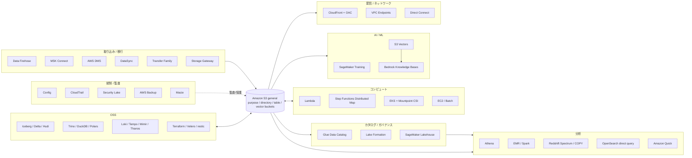
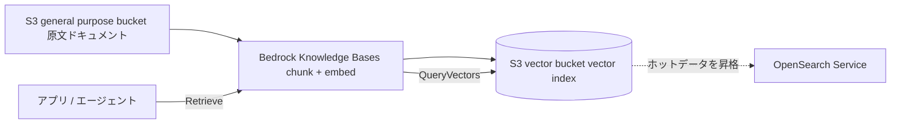
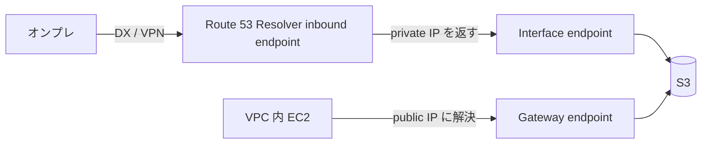
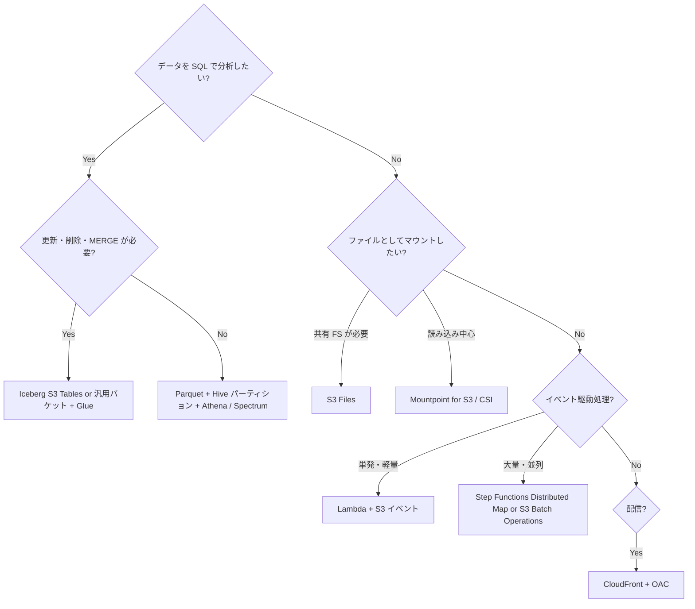

# S3 を中心としたエコシステム

_最終確認: 2026-10-03_

S3 は「ただのオブジェクトストレージ」ではなく、AWS のほぼすべてのデータ系サービスと、多くの OSS が **共通の永続層 (system of record)** として使う基盤になっている。この章では「誰が S3 をどう使っているか」「設定の勘所」「ハマりどころ」を横断的に整理する。

この章のスコープ:

- AWS サービスとの統合 (analytics / compute / AI/ML / delivery / network / governance / migration)
- OSS・サードパーティとの統合 (テーブルフォーマット、クエリエンジン、観測基盤、バックアップ、IaC、MLOps)
- ファイルフォーマットとパーティショニング戦略
- すぐ使えるスニペット (Athena CTAS、Redshift COPY/UNLOAD、DuckDB、Spark、Terraform backend)

機械可読な一覧は `data/ecosystem.json` にある (このドキュメントと同じ情報源から作成)。

## 1. 全体マップ



考え方として押さえておきたいのは次の 3 点。

1. **ストレージと計算の分離**: データは S3 に 1 か所だけ置き、Athena / EMR / Redshift / Trino / DuckDB など複数エンジンが同じファイルを読む。
2. **メタデータ層が別にある**: 「どのファイルが何のテーブルか」は S3 ではなく Glue Data Catalog / Iceberg メタデータ / Hive Metastore が持つ。S3 は bytes を持つだけ。
3. **権限は二重**: S3 の IAM / bucket policy に加え、Lake Formation (テーブル・列・行レベル) が上に乗る。どちらで拒否されているのかを切り分けるのがトラブルシュートの基本。

## 2. 分析 (Analytics)

### 2.1 統合テーブル

| サービス                                                         | S3 の使い方                                                                            | 主要設定                                                                                     | ハマりどころ                                                                                                                                      |
| ---------------------------------------------------------------- | -------------------------------------------------------------------------------------- | -------------------------------------------------------------------------------------------- | ------------------------------------------------------------------------------------------------------------------------------------------------- |
| Amazon Athena                                                    | S3 上のファイルを Glue Data Catalog 経由でサーバーレス SQL。結果も S3 に書く           | workgroup の query result location、`partitioned_by`、partition projection                   | CTAS / INSERT INTO は 1 クエリで書けるパーティションが最大 100 (`HIVE_TOO_MANY_OPEN_PARTITIONS`)。スキャン量課金なので列指向 + パーティション必須 |
| Glue Data Catalog                                                | S3 上のデータのテーブル定義 (Hive 互換メタストア / Iceberg REST)                       | database / table の `LOCATION`、SerDe、パーティション                                        | カタログと実ファイルのズレ (パーティション未登録で 0 件)                                                                                          |
| Glue crawler                                                     | S3 prefix をスキャンしてスキーマとパーティションを推定・登録                           | include path、exclude パターン、schema change policy                                         | 小さいファイルが大量だと遅い / 高い。フォルダ構造が揃っていないと別テーブルに分裂する                                                             |
| Glue ETL                                                         | Spark ジョブで S3 を読み書き                                                           | job bookmark、`--enable-s3-parquet-optimized-committer` 等                                   | 小ファイル問題は出力側で coalesce / repartition して自分で防ぐ                                                                                    |
| Lake Formation                                                   | S3 location を登録し、カタログ単位で列・行・セル単位の権限を一元化                     | data lake location 登録、hybrid access mode、LF-Tags                                         | IAM で S3 を直読みできるロールは LF を迂回できる。登録ロールと IAM 権限の二重管理に注意                                                           |
| Amazon EMR                                                       | Spark / Hive / Trino / Presto から S3 を読み書き (EMRFS / S3A)                         | instance profile、EMRFS 設定、S3 最適化コミッタ                                              | `s3://` スキームは EMR では EMRFS。OSS Spark では `s3a://` を使う                                                                                 |
| Redshift Spectrum                                                | 外部スキーマ (Glue Data Catalog) 経由で S3 を直接クエリ                                | `CREATE EXTERNAL SCHEMA ... FROM DATA CATALOG`、IAM role                                     | Redshift クラスターと S3 バケットが同一リージョンである必要あり                                                                                   |
| Redshift COPY / UNLOAD                                           | S3 → Redshift のバルクロード、Redshift → S3 の Parquet / CSV / JSON 書き出し           | `IAM_ROLE`、`FORMAT AS PARQUET`、`PARTITION BY`、`MAXFILESIZE`                               | UNLOAD はデフォルト `PARALLEL ON` でスライスごとに小さいファイルが大量に出る                                                                      |
| Redshift auto-copy                                               | S3 event integration で新規ファイルを自動 COPY (COPY JOB)                              | `COPY ... JOB CREATE <name> AUTO ON`                                                         | 読み込み済みファイルを追跡するので、同じキーへの上書きは再ロードされない前提で設計                                                                |
| SageMaker Lakehouse (lakehouse architecture of Amazon SageMaker) | S3 データレイクと Redshift を 1 つのカタログ (Iceberg 互換) で扱う                     | managed catalog (S3 / RMS)、federated catalog、Iceberg REST endpoint                         | 権限判定は Lake Formation。外部エンジンは vended credentials を使う                                                                               |
| SageMaker Unified Studio                                         | 上記 Lakehouse を UI / ノートブックから使う統合スタジオ                                | ドメイン / プロジェクト単位のロール                                                          | プロジェクトロールに S3 権限が付与されているかを最初に確認                                                                                        |
| Amazon Quick (旧 QuickSight)                                     | S3 manifest / Athena / S3 Tables を BI のデータソースに                                | データソース設定、SPICE                                                                      | 2025-10 に Quick Suite へ、2026 には Amazon Quick 表記に変わっている。古い記事は QuickSight 名                                                    |
| OpenSearch direct query                                          | S3 上のデータを取り込まずに OpenSearch Dashboards から SQL / PPL でクエリ              | data source (Amazon S3 with Glue Data Catalog)、checkpoint bucket                            | テーブルは Glue Data Catalog に手動で作る必要がある (Security Lake は自動)                                                                        |
| OpenSearch Ingestion                                             | S3 (SQS 通知 or スキャン) から OpenSearch に取り込むパイプライン                       | pipeline の `s3` source                                                                      | SQS 通知方式は重複・順序保証なしを前提に                                                                                                          |
| Amazon Data Firehose                                             | ストリームをバッファして S3 に PUT。Parquet/ORC 変換、動的パーティション、Iceberg 宛先 | buffer size 1–128 MB / interval 0–900 秒、prefix、dynamic partitioning                       | Parquet 変換 / 動的パーティション有効時はバッファ 64–128 MB。小さいバッファ = 小ファイル大量                                                      |
| MSK Connect                                                      | Kafka Connect の S3 sink connector (Confluent 等) で topic → S3                        | `connector.class=io.confluent.connect.s3.S3SinkConnector`、`flush.size`、`partitioner.class` | `flush.size` が小さいと小ファイル化。プラグインは自前でカスタムプラグインとしてアップロード                                                       |
| AWS DMS                                                          | DB の full load + CDC を S3 に CSV / Parquet で出力                                    | `DataFormat=parquet`、`ParquetVersion`、`CdcPath`、`DatePartitionEnabled`                    | CDC は `Op` 列 (I/U/D) 付きの追記ログ。そのままではテーブルにならないので Iceberg 等で MERGE する                                                 |

### 2.2 Athena CTAS: CSV を Parquet + パーティションに変換

```sql
CREATE TABLE analytics.events_parquet
WITH (
  format = 'PARQUET',
  write_compression = 'ZSTD',
  external_location = 's3://amzn-s3-demo-bucket/curated/events/',
  partitioned_by = ARRAY['dt']
) AS
SELECT
  event_id,
  user_id,
  event_type,
  payload,
  date_format(event_time, '%Y-%m-%d') AS dt   -- パーティション列は SELECT の最後
FROM raw.events_csv
WHERE event_time >= TIMESTAMP '2026-09-01 00:00:00';
```

ポイント:

- パーティション列は **SELECT リストの最後** に置く (Athena の仕様)。
- 1 回の CTAS で作れるパーティションは最大 100。超える場合は CTAS + 複数回の `INSERT INTO` に分割する。
- `external_location` は空の prefix を指定する。既存オブジェクトがあると失敗する。

Iceberg テーブルとして作る場合:

```sql
CREATE TABLE analytics.events_iceberg
WITH (
  table_type = 'ICEBERG',
  is_external = false,
  location = 's3://amzn-s3-demo-bucket/iceberg/events/',
  format = 'PARQUET',
  partitioning = ARRAY['day(event_time)']
) AS
SELECT * FROM raw.events_csv;
```

Iceberg は hidden partitioning (`day(event_time)` のような変換) が使えるので、クエリ側でパーティション列を意識しなくてよい。

### 2.3 Athena partition projection

パーティション数が多い (日次 × 数年 × テナント等) テーブルでは、Glue にパーティションを登録せず、テーブルプロパティで規則を宣言する partition projection が有効。

```sql
ALTER TABLE raw.access_logs SET TBLPROPERTIES (
  'projection.enabled' = 'true',
  'projection.dt.type' = 'date',
  'projection.dt.format' = 'yyyy/MM/dd',
  'projection.dt.range' = '2024/01/01,NOW',
  'projection.dt.interval' = '1',
  'projection.dt.interval.unit' = 'DAYS',
  'storage.location.template' = 's3://amzn-s3-demo-bucket/logs/${dt}/'
);
```

- crawler も `MSCK REPAIR TABLE` も不要になる。
- projection は Athena 独自機能。Redshift Spectrum や EMR はこの設定を解釈しない点に注意。

### 2.4 Redshift COPY / UNLOAD

```sql
-- S3 の Parquet をロード
COPY sales.orders
FROM 's3://amzn-s3-demo-bucket/curated/orders/'
IAM_ROLE 'arn:aws:iam::111122223333:role/RedshiftS3Read'
FORMAT AS PARQUET;

-- CSV (gzip) をロード
COPY sales.orders_staging
FROM 's3://amzn-s3-demo-bucket/raw/orders/2026/10/'
IAM_ROLE 'arn:aws:iam::111122223333:role/RedshiftS3Read'
CSV GZIP IGNOREHEADER 1
REGION 'ap-northeast-1';

-- 自動 COPY (S3 event integration を事前に作成)
COPY sales.orders
FROM 's3://amzn-s3-demo-bucket/landing/orders/'
IAM_ROLE 'arn:aws:iam::111122223333:role/RedshiftS3Read'
FORMAT AS PARQUET
JOB CREATE orders_autocopy AUTO ON;

-- Redshift → S3 (データレイクへ書き出し)
UNLOAD ('SELECT * FROM sales.orders WHERE order_date < ''2025-01-01''')
TO 's3://amzn-s3-demo-bucket/archive/orders/'
IAM_ROLE 'arn:aws:iam::111122223333:role/RedshiftS3Write'
FORMAT AS PARQUET
PARTITION BY (order_date)
MAXFILESIZE 256 MB;
```

- COPY は **ファイル数をスライス数の倍数** にすると並列度を活かしやすい。
- UNLOAD の出力は 128–512 MB 程度に寄せるのが AWS ブログでも推奨されている。
- `REGION` はバケットとクラスターのリージョンが異なる場合に必要 (COPY)。

### 2.5 Data Firehose → S3 の設計

- バッファは「サイズ (1–128 MB)」か「時間 (0–900 秒)」の早い方で flush される。
- Parquet / ORC 変換や動的パーティションを有効にするとバッファサイズは 64–128 MB (デフォルト 128 MB)。
- prefix は `!{partitionKeyFromQuery:tenant}/!{timestamp:yyyy/MM/dd}/` のように書ける。動的パーティションのキーは jq で JSON から抽出する。
- エラーは `errorOutputPrefix` に別出しする。設定しないとエラーレコードの場所が分かりづらい。
- Iceberg テーブル (S3 Tables 含む) を直接宛先にもできる。小ファイルはテーブル側のコンパクションで吸収する。

## 3. コンピュート (Compute)

### 3.1 統合テーブル

| サービス                           | S3 の使い方                                                                                                         | 主要設定                                                                       | ハマりどころ                                                                                                                                                                                                                                 |
| ---------------------------------- | ------------------------------------------------------------------------------------------------------------------- | ------------------------------------------------------------------------------ | -------------------------------------------------------------------------------------------------------------------------------------------------------------------------------------------------------------------------------------------- |
| AWS Lambda (S3 トリガー)           | S3 イベント通知 (直接 / SNS / SQS / EventBridge) で関数起動                                                         | event type (`s3:ObjectCreated:*`)、prefix / suffix フィルタ                    | 同じバケットに書き戻すと無限ループ。Lambda の recursive loop detection は S3 を含むループを検知するが、prefix 分離 or 別バケットが基本                                                                                                       |
| Lambda + S3 Files                  | Lambda から S3 バケットをファイルシステムとしてマウント (2026-04 発表)                                              | 関数のファイルシステム設定                                                     | capacity provider を使う関数では非対応                                                                                                                                                                                                       |
| Step Functions Distributed Map     | `ItemReader` で S3 の object 一覧 / CSV / JSON / JSONL / S3 Inventory manifest を読み、子ワークフローを大量並列実行 | `ItemReader`、`ItemBatcher`、`ResultWriter`、`MaxConcurrency`                  | コンソールで作った「フォルダ」オブジェクトも 1 item として扱われ、余計な子実行が起きる                                                                                                                                                       |
| Amazon EKS + Mountpoint CSI driver | `s3.csi.aws.com` で S3 バケットを PersistentVolume として Pod にマウント                                            | EKS add-on `aws-mountpoint-s3-csi-driver`、IRSA / Pod Identity、`mountOptions` | 静的プロビジョニングのみ。Fargate・Windows・Hybrid Nodes 非対応。POSIX 完全互換ではない (追記・リネーム制約)                                                                                                                                 |
| Amazon ECS                         | タスクロールで SDK 経由アクセス。ファイルとして使うなら S3 Files / 自前 Mountpoint                                  | task role、VPC endpoint                                                        | ECS にはネイティブの S3 Files ボリュームタイプがある (`s3filesVolumeConfiguration`。2026-09 時点で Fargate / ECS Managed Instances / EC2)。EKS の Mountpoint CSI ドライバーに相当するネイティブの Mountpoint ボリュームタイプは ECS にはない |
| Amazon EC2                         | instance profile (IAM role) の一時認証情報で SDK / CLI / Mountpoint                                                 | instance profile、IMDSv2                                                       | 認証情報を AMI やユーザーデータに埋めない。IMDSv2 の hop limit がコンテナから見えない原因になりがち                                                                                                                                          |
| AWS Batch                          | ジョブの入出力を S3 に。大規模なら S3 Batch Operations と使い分け                                                   | job role、コンテナの入出力 prefix                                              | 「S3 オブジェクトごとに API を叩くだけ」なら S3 Batch Operations の方が安く単純                                                                                                                                                              |
| Amazon S3 Files                    | S3 バケットを EFS ベースのファイルシステムとして公開 (2026-04 GA)                                                   | file system 作成、マウントターゲット                                           | ファイル API とオブジェクト API の同時利用時の整合性モデルは個別に確認 (詳細は別章)                                                                                                                                                          |

### 3.2 Step Functions Distributed Map (抜粋)

```json
{
  "Type": "Map",
  "ItemReader": {
    "Resource": "arn:aws:states:::s3:listObjectsV2",
    "Parameters": {
      "Bucket": "amzn-s3-demo-bucket",
      "Prefix": "incoming/images/"
    }
  },
  "ItemBatcher": {
    "MaxItemsPerBatch": 100
  },
  "MaxConcurrency": 1000,
  "ItemProcessor": {
    "ProcessorConfig": {
      "Mode": "DISTRIBUTED",
      "ExecutionType": "EXPRESS"
    },
    "StartAt": "Process",
    "States": {
      "Process": {
        "Type": "Task",
        "Resource": "arn:aws:states:::lambda:invoke",
        "Parameters": {
          "FunctionName": "arn:aws:lambda:ap-northeast-1:111122223333:function:resize",
          "Payload.$": "$"
        },
        "End": true
      }
    }
  },
  "ResultWriter": {
    "Resource": "arn:aws:states:::s3:putObject",
    "Parameters": {
      "Bucket": "amzn-s3-demo-bucket",
      "Prefix": "map-results/"
    }
  },
  "End": true
}
```

- `ItemReader` の入力形式は object 一覧のほか CSV / JSON / JSONL / S3 Inventory manifest。
- prefix を指定して `LOAD_AND_FLATTEN` 変換を使うと、複数オブジェクトの中身を直接 item として読める。
- 下流 (Lambda 同時実行数、S3 prefix あたりのリクエストレート) に合わせて `MaxConcurrency` を絞る。

### 3.3 Mountpoint CSI driver (EKS) の PV 例

```yaml
apiVersion: v1
kind: PersistentVolume
metadata:
  name: s3-pv
spec:
  capacity:
    storage: 1200Gi # 値は無視されるが必須項目
  accessModes:
    - ReadWriteMany
  storageClassName: ''
  mountOptions:
    - allow-delete
    - region ap-northeast-1
  csi:
    driver: s3.csi.aws.com
    volumeHandle: s3-csi-driver-volume
    volumeAttributes:
      bucketName: amzn-s3-demo-bucket
---
apiVersion: v1
kind: PersistentVolumeClaim
metadata:
  name: s3-pvc
spec:
  accessModes:
    - ReadWriteMany
  storageClassName: ''
  resources:
    requests:
      storage: 1200Gi
  volumeName: s3-pv
```

- v2 では Mountpoint を専用 Pod で動かし、同じ設定のボリュームを複数 Pod で共有できる (pod sharing)。EKS Pod Identity と SELinux にも対応。
- 得意なのは ML の学習データのような大きなファイルの逐次・並列読み込みと、新規ファイルの逐次書き込み。既存ファイルの変更は制限され、ランダム書き込みは不可、上書きは `--allow-overwrite` + `O_TRUNC` での全体書き換えのみ、追記 (`--incremental-upload`) とリネームは S3 Express One Zone のディレクトリバケットでのみ可能。ログを既存ファイルに追記し続ける用途には向かない。

## 4. AI / ML

### 4.1 統合テーブル

| サービス                           | S3 の使い方                                                                               | 主要設定                                                                                  | ハマりどころ                                                                                                  |
| ---------------------------------- | ----------------------------------------------------------------------------------------- | ----------------------------------------------------------------------------------------- | ------------------------------------------------------------------------------------------------------------- |
| SageMaker Training (File mode)     | 学習開始前に S3 prefix をインスタンスの EBS にダウンロード                                | `TrainingInputMode=File`、`S3DataDistributionType` (`FullyReplicated` / `ShardedByS3Key`) | データセット全体がローカルに入る容量が必要。ダウンロード完了まで学習が始まらない                              |
| SageMaker Training (FastFile mode) | S3 を読み取り専用 FUSE として `/opt/ml/data/<channel>` に公開し、オンデマンドでストリーム | `TrainingInputMode=FastFile`                                                              | S3 prefix のみ対応 (manifest / augmented manifest 非対応)。ランダムアクセスや小ファイルはスループットが落ちる |
| SageMaker Training (Pipe mode)     | S3 から学習コンテナへ名前付きパイプでストリーム                                           | `TrainingInputMode=Pipe`                                                                  | シーケンシャル読み込み前提。新規なら FastFile が第一候補                                                      |
| SageMaker モデル成果物             | `model.tar.gz` や checkpoint を S3 に保存                                                 | `OutputDataConfig`、`CheckpointConfig`                                                    | KMS キーと VPC endpoint ポリシーを学習ロールに合わせる                                                        |
| Bedrock Knowledge Bases            | S3 を RAG のデータソースとして同期 (取り込み → チャンク → 埋め込み)                       | data source の S3 URI、`<file>.metadata.json` サイドカー                                  | sync を明示実行しないと S3 の変更が反映されない。メタデータファイル名は元ファイル名 + `.metadata.json`        |
| Amazon S3 Vectors                  | vector bucket / vector index に埋め込みを保存し `QueryVectors` で近傍検索 (2025-12 GA)    | 次元数、距離 (cosine / euclidean)、non-filterable metadata keys                           | 1 index 最大 20 億ベクトル。filterable metadata は 2 KB / vector。高 QPS 用途は OpenSearch が推奨             |
| Bedrock KB + S3 Vectors            | KB のベクトルストアに S3 Vectors を選択                                                   | vector store 設定                                                                         | KB 経由だと custom metadata は 1 KB / 35 keys まで。階層チャンキングで上限超過しやすい                        |
| OpenSearch + S3 Vectors            | 低頻度ベクトルを S3 Vectors に置き、OpenSearch とハイブリッド検索                         | engine 設定                                                                               | 構成の詳細はバージョンで変わるため要確認                                                                      |
| Amazon Q Business                  | S3 コネクタでドキュメントをインデックス                                                   | data source 設定                                                                          | 2026-07-31 で新規顧客受付終了 (maintenance)。新規は Amazon Quick 等を検討                                     |
| Bedrock batch inference            | 入力 JSONL を S3 から読み、出力を S3 へ                                                   | `inputDataConfig` / `outputDataConfig`                                                    | 結果処理は Step Functions Distributed Map の JSONL ItemReader と相性がよい                                    |

### 4.2 学習データ配置の指針

- **小ファイル大量はアンチパターン**: 画像 1 枚 = 1 オブジェクトのような配置は FastFile / Mountpoint いずれでも遅くなる。WebDataset (tar shards)、TFRecord、Parquet などで 100 MB 以上のシャードにまとめる。
- **分散学習ではシャーディング**: File mode の `ShardedByS3Key` でインスタンスごとに別ファイルを割り当てる。
- **同一リージョン**: 学習ジョブと S3 バケットは同一リージョン。クロスリージョンは転送料金とレイテンシの両面で不利。
- **S3 Express One Zone (directory bucket)**: 学習中の高頻度読み込みやチェックポイント保存の低レイテンシ層として使われる (詳細は別章)。

### 4.3 S3 Vectors の位置づけ



- 「安く大量に持つ、問い合わせは低頻度〜中頻度」が S3 Vectors の得意領域。
- 数百〜数千 QPS を持続的に捌くなら OpenSearch を前段に置く、というのが AWS の想定する住み分け。

## 5. コンテンツ配信 (Delivery)

| 機能                               | S3 の使い方                                                        | 主要設定                                                                                  | ハマりどころ                                                                                                    |
| ---------------------------------- | ------------------------------------------------------------------ | ----------------------------------------------------------------------------------------- | --------------------------------------------------------------------------------------------------------------- |
| CloudFront + OAC                   | S3 REST endpoint をオリジンにし、CloudFront だけが SigV4 で取得    | Origin Access Control、bucket policy で `cloudfront.amazonaws.com` + `AWS:SourceArn` 条件 | OAI は legacy。SSE-KMS の場合は KMS キーポリシーにも CloudFront を許可。S3 website endpoint には OAC は使えない |
| CloudFront 署名付き URL / Cookie   | プライベートコンテンツを期限付きで配信                             | key group (公開鍵)、trusted key groups                                                    | S3 の presigned URL とは別物。CloudFront の署名はエッジで検証され、S3 には OAC で取りに行く                     |
| S3 presigned URL                   | クライアントから S3 へ直接 GET / PUT                               | 有効期限、署名者の権限                                                                    | 署名者の認証情報の期限 (STS) が先に切れると URL も無効になる                                                    |
| Lambda@Edge / CloudFront Functions | オリジンリクエスト書き換え (例: `/` → `/index.html`、画像リサイズ) | viewer / origin request トリガー                                                          | Lambda@Edge は us-east-1 で作成。CloudFront Functions は S3 アクセス不可の軽量処理向け                          |
| S3 Object Lambda                   | GET 時に Lambda で変換                                             | Object Lambda Access Point                                                                | 2025-11-07 以降は新規顧客受付停止 (maintenance)。新規設計は CloudFront + Lambda@Edge 等で代替                   |

OAC 用 bucket policy の典型:

```json
{
  "Version": "2012-10-17",
  "Statement": [
    {
      "Sid": "AllowCloudFrontServicePrincipalReadOnly",
      "Effect": "Allow",
      "Principal": { "Service": "cloudfront.amazonaws.com" },
      "Action": "s3:GetObject",
      "Resource": "arn:aws:s3:::amzn-s3-demo-bucket/*",
      "Condition": {
        "StringEquals": {
          "AWS:SourceArn": "arn:aws:cloudfront::111122223333:distribution/EDFDVBD6EXAMPLE"
        }
      }
    }
  ]
}
```

## 6. ネットワーク (Network)

| 経路                              | 特徴                                                                        | 料金                    | ハマりどころ                                                                                                                        |
| --------------------------------- | --------------------------------------------------------------------------- | ----------------------- | ----------------------------------------------------------------------------------------------------------------------------------- |
| Gateway endpoint                  | ルートテーブルに S3 の prefix list を追加。VPC 内からのアクセス             | 追加料金なし            | 同一リージョンのみ。オンプレや peering 先 VPC からは使えない                                                                        |
| Interface endpoint (PrivateLink)  | サブネットに ENI を作り、プライベート IP で S3 に到達                       | 時間 + 処理データ量課金 | private DNS を有効にすると VPC 内トラフィックも有料経路に流れる。「inbound endpoint のみ private DNS」で gateway と併用するのが定石 |
| Direct Connect / Site-to-Site VPN | オンプレ → interface endpoint、または public VIF で S3 公開エンドポイントへ | DX のポート / 転送料金  | Route 53 Resolver inbound endpoint でオンプレ DNS を S3 の private IP に解決させる                                                  |
| VPC endpoint policy               | エンドポイント経由で到達できるバケットを制限 (データ持ち出し対策)           | なし                    | AWS マネージドサービスが使う AWS 所有バケット (例: リポジトリ) まで塞いでパッケージ取得が壊れる                                     |
| bucket policy `aws:SourceVpce`    | 特定 endpoint 経由以外を拒否                                                | なし                    | コンソール操作もブロックされる。管理用ロールの例外を必ず入れる                                                                      |

gateway + interface の併用 (コスト最適):



## 7. ガバナンス / セキュリティ (Governance)

| サービス                                                   | S3 との関係                                                                                    | 主要設定                                                                                                          | ハマりどころ                                                                                          |
| ---------------------------------------------------------- | ---------------------------------------------------------------------------------------------- | ----------------------------------------------------------------------------------------------------------------- | ----------------------------------------------------------------------------------------------------- |
| AWS Organizations                                          | SCP / RCP でアカウント横断に S3 操作をガード (例: Block Public Access の無効化禁止)            | SCP、RCP、組織単位の S3 Block Public Access 方針                                                                  | SCP は Principal 側、RCP はリソース側の上限。どちらも許可は与えない                                   |
| AWS Control Tower                                          | ランディングゾーンで Log Archive アカウントに集中ログバケットを作成。S3 関連の controls を提供 | landing zone、controls (preventive / detective / proactive)                                                       | Control Tower 管理バケットを手で変更するとドリフト扱い                                                |
| AWS Config                                                 | S3 の設定を記録し managed rule で評価                                                          | 例: `s3-bucket-public-read-prohibited`、`s3-bucket-ssl-requests-only`、`s3-bucket-server-side-encryption-enabled` | Config 自身の配信先も S3。ルール名は増減するので一覧はドキュメントで確認                              |
| AWS CloudTrail                                             | 管理イベントと S3 データイベント (GetObject / PutObject 等) を S3 バケットに配信               | trail、advanced event selectors                                                                                   | データイベントは量が多く高額になりやすい。対象バケット・操作を絞る                                    |
| CloudTrail Lake                                            | CloudTrail イベントのマネージド SQL ストア                                                     | event data store                                                                                                  | 2026-05-31 で新規顧客受付停止 (maintenance)。AWS は CloudWatch への移行を推奨                         |
| Amazon Security Lake                                       | セキュリティログを OCSF に正規化し、Parquet + Iceberg で自アカウントの S3 に保存               | リージョンごとに 1 バケット、rollup Region、subscriber                                                            | カスタムソースは OCSF + Parquet で書く必要がある。バケットは Security Lake 管理ロール以外から触らない |
| AWS Backup                                                 | S3 の continuous backup (35 日 PITR) と periodic backup (最長 99 年)                           | backup plan、vault                                                                                                | バケットのバージョニングが前提。EventBridge 通知を無効にすると continuous backup が止まる             |
| Amazon Macie                                               | S3 オブジェクトを機械学習 + パターンで機密データ検出。バケットの公開状態も評価                 | automated sensitive data discovery、classification job                                                            | ジョブはスキャン量課金。対象を絞らないと高額                                                          |
| IAM Access Analyzer for S3                                 | 外部共有されたバケットを検出                                                                   | analyzer                                                                                                          | アカウント外 / 組織外の判定は analyzer の zone of trust 次第                                          |
| Amazon GuardDuty S3 Protection / Malware Protection for S3 | データイベントの異常検知、アップロードオブジェクトのマルウェアスキャン                         | protection plan                                                                                                   | マルウェアスキャン結果はオブジェクトタグで返る。タグでアクセス制御を組むなら ABAC 設計を先に          |

## 8. 移行 (Migration)

| サービス                                      | S3 の使い方                                                              | 主要設定                                      | ハマりどころ / ステータス                                                                    |
| --------------------------------------------- | ------------------------------------------------------------------------ | --------------------------------------------- | -------------------------------------------------------------------------------------------- |
| AWS DataSync                                  | NFS / SMB / HDFS / 他クラウド → S3、S3 ↔ S3 / EFS / FSx のオンライン転送 | agent (オンプレ)、task、transfer mode、filter | 検証 (verify) モードで時間が延びる。S3 の storage class を宛先で指定可能                     |
| AWS Transfer Family (SFTP / FTPS / FTP / AS2) | プロトコルサーバーのバックエンドが S3                                    | server、user、logical directory、IAM role     | ディレクトリはプレフィックスの擬似表現。リネームは CopyObject + DeleteObject                 |
| Transfer Family web apps                      | ブラウザから S3 を閲覧・アップロード・ダウンロードするマネージドポータル | IAM Identity Center、S3 Access Grants、CORS   | 2025-11 から VPC endpoint 経由のプライベート利用に対応。権限は S3 Access Grants で表現       |
| Storage Gateway - S3 File Gateway             | NFS / SMB でファイルを書くと S3 オブジェクトになる                       | file share、cache disk、refresh cache         | S3 側を直接変更したら RefreshCache が必要                                                    |
| Storage Gateway - FSx File Gateway            | FSx for Windows のローカルキャッシュ                                     | -                                             | 2024-10-28 以降は新規顧客受付停止                                                            |
| Storage Gateway - Volume Gateway              | iSCSI ブロックボリューム。スナップショットは EBS スナップショット        | cached / stored volume                        | データは S3 上にあるが S3 API で直接は見えない                                               |
| Storage Gateway - Tape Gateway                | VTL。仮想テープを S3 / S3 Glacier 系に保存                               | tape pool                                     | Snowball Edge 上での Tape Gateway は 2024-03 に廃止                                          |
| AWS Snowball Edge                             | 物理デバイスでのオフライン転送                                           | -                                             | 2025-11-07 以降は新規顧客受付停止。新規は DataSync / AWS Data Transfer Terminal / パートナー |
| AWS Data Transfer Terminal                    | 物理拠点に機器を持ち込んで高速アップロード                               | 予約                                          | 対応拠点は限定的。詳細は公式ページ                                                           |
| S3 Batch Operations / S3 Replication          | 大量オブジェクトのコピー・移行、リージョン間複製                         | manifest (Inventory)、replication rule        | 既存オブジェクトの複製は Batch Replication が必要                                            |

## 9. オープンソース / サードパーティ

### 9.1 テーブルフォーマットとクエリエンジン

| OSS                            | S3 の使い方                                                                                                          | 主要設定                                                                                             | ハマりどころ                                                                                                                                                                                                                                                                       |
| ------------------------------ | -------------------------------------------------------------------------------------------------------------------- | ---------------------------------------------------------------------------------------------------- | ---------------------------------------------------------------------------------------------------------------------------------------------------------------------------------------------------------------------------------------------------------------------------------- |
| Apache Iceberg                 | メタデータ (metadata.json / manifest list / manifest) とデータファイルを S3 に置く。コミットはカタログでアトミックに | catalog (Glue / REST / S3 Tables)、`S3FileIO`                                                        | 小ファイルとスナップショットが溜まる。compaction・expire snapshots・orphan file 削除が運用必須 (S3 Tables は自動)                                                                                                                                                                  |
| Delta Lake                     | `_delta_log/` の JSON コミットログ + Parquet                                                                         | `S3DynamoDBLogStore` (複数クラスター書き込み時)                                                      | 公式 storage ドキュメントでは、複数クラスターからの同時書き込みは DynamoDB による排他 (`S3DynamoDBLogStore`) が必要と記載。S3 条件付き書き込みへのネイティブ対応は Delta 4.4.0 (2026-08) 時点で未リリース: 機能要望は not planned でクローズ、プロトタイプ PR は未マージでクローズ |
| Apache Hudi                    | タイムライン (`.hoodie/`) + Parquet / log file。CoW / MoR                                                            | table type、lock provider (DynamoDB 等)                                                              | 並行書き込みにはロックプロバイダが必要。バージョニング有効バケットでは cleaner が delete marker を溜めるので lifecycle で掃除                                                                                                                                                      |
| Apache Spark (S3A)             | `s3a://` で Hadoop S3A コネクタ経由                                                                                  | `fs.s3a.*`、S3A committer                                                                            | デフォルト committer は `file` (rename ベース) で S3 には不向き。`magic` / `directory` / `partitioned` を指定                                                                                                                                                                      |
| Trino / Presto                 | Hive / Iceberg / Delta コネクタで S3 を読む                                                                          | `fs.s3.enabled=true` (Trino 483 時点)、`s3.region`、metastore                                        | ネイティブ S3 ファイルシステムと旧 Hadoop ベース (legacy) 設定はキーが異なる。バージョンごとのドキュメントで確認                                                                                                                                                                   |
| DuckDB                         | `httpfs` 拡張で `s3://` を直接読み書き                                                                               | `CREATE SECRET (TYPE s3, PROVIDER credential_chain)`                                                 | glob で大量のオブジェクトを LIST するので、prefix を絞る。Hive パーティションは `hive_partitioning`                                                                                                                                                                                |
| Polars                         | `scan_parquet("s3://...")` で遅延評価 + predicate pushdown                                                           | `storage_options` (region 等)                                                                        | 認証情報の解決順は環境変数 / プロファイル依存。明示が安全                                                                                                                                                                                                                          |
| Apache Arrow (PyArrow)         | `pyarrow.fs.S3FileSystem` と `pyarrow.dataset`                                                                       | `region`、`endpoint_override`                                                                        | region 自動判定に頼るとクロスリージョンで遅い / 失敗                                                                                                                                                                                                                               |
| ClickHouse                     | `s3()` テーブル関数、`S3` テーブルエンジン、`S3Queue`、MergeTree の S3 disk                                          | `ENGINE = S3(path, format)`、partition strategy                                                      | S3 エンジンはパーティション書き込みは可能だが、パーティション付き読み込みは未実装 (公式ドキュメント記載)                                                                                                                                                                           |
| Kafka tiered storage (KIP-405) | 古いログセグメントをリモート (S3 等) に退避                                                                          | `remote.log.storage.system.enable=true`、topic の `remote.storage.enable=true`、`local.retention.ms` | Apache Kafka 3.9 で production ready。S3 実装は同梱されないので Aiven 等のプラグインが必要。compacted topic は非対応                                                                                                                                                               |

### 9.2 観測基盤 (Grafana 系 / Prometheus 系)

| OSS           | S3 に置くもの                                                              | 主要設定                                                                                                           | ハマりどころ                                                           |
| ------------- | -------------------------------------------------------------------------- | ------------------------------------------------------------------------------------------------------------------ | ---------------------------------------------------------------------- |
| Grafana Loki  | ログ chunk と TSDB index                                                   | `storage_config.aws` (`bucketnames`, `region`)、`schema_config` (`store: tsdb`, `object_store: s3`, `schema: v13`) | スキーマ変更は既存エントリを編集せず、未来の `from` で新エントリを追加 |
| Grafana Tempo | トレースブロック                                                           | `storage.trace.backend: s3`                                                                                        | 小さい block が大量に出るので compactor を必ず動かす                   |
| Grafana Mimir | メトリクス TSDB block、ruler、alertmanager 状態                            | `common.storage.backend: s3`                                                                                       | blocks / ruler / alertmanager でバケット or prefix を分ける            |
| Thanos        | Prometheus の 2 時間 block を sidecar がアップロード、store gateway が読む | objstore config (`type: S3`)                                                                                       | compactor はバケットごとに 1 インスタンスのみ                          |
| Cortex        | Mimir と同系統の block storage                                             | `blocks_storage.backend: s3`                                                                                       | 新規なら Mimir を検討するケースが多い (方針判断は各自)                 |

Loki の最小構成例:

```yaml
schema_config:
  configs:
    - from: 2024-04-01
      store: tsdb
      object_store: s3
      schema: v13
      index:
        prefix: index_
        period: 24h

storage_config:
  tsdb_shipper:
    active_index_directory: /loki/index
    cache_location: /loki/index_cache
  aws:
    region: ap-northeast-1
    bucketnames: amzn-s3-demo-loki-chunks
    s3forcepathstyle: false
```

### 9.3 バックアップ / IaC / DevOps / MLOps

| OSS                                 | S3 の使い方                                                                        | 主要設定                                                                                              | ハマりどころ                                                                                                                                                                                    |
| ----------------------------------- | ---------------------------------------------------------------------------------- | ----------------------------------------------------------------------------------------------------- | ----------------------------------------------------------------------------------------------------------------------------------------------------------------------------------------------- |
| Terraform S3 backend                | state ファイルを S3 に保存。`use_lockfile` で S3 ネイティブロック                  | `bucket`、`key`、`region`、`encrypt`、`use_lockfile = true`                                           | 1.10 で実験的導入、1.11 で GA。`dynamodb_table` 等は deprecated。バージョニング有効化を推奨                                                                                                     |
| OpenTofu S3 backend                 | Terraform と同様に S3 lockfile をサポート                                          | `use_lockfile`                                                                                        | 1.10.0 (2025-06) で追加、experimental 扱いではない。Terraform と違い `dynamodb_table` は非推奨ではなく両方の排他方式がサポートされ、両方を有効にしてから移行できる                              |
| Velero                              | Kubernetes リソースのバックアップを S3 に、PV はスナップショット or ファイルレベル | `velero-plugin-for-aws`、BackupStorageLocation                                                        | バケット prefix を複数クラスターで共有しない                                                                                                                                                    |
| restic                              | 重複排除 + 暗号化済みリポジトリを S3 に                                            | `restic -r s3:s3.ap-northeast-1.amazonaws.com/bucket_name init` (リージョン別 endpoint の path-style) | Object Lock や lifecycle の noncurrent 削除と prune の相互作用に注意                                                                                                                            |
| Docker Registry (CNCF Distribution) | イメージ layer / manifest を S3 に                                                 | `storage.s3` (`region`, `bucket`, `encrypt`, `rootdirectory`, `chunksize`)                            | `chunksize` は 5 MB 超が必要 (デフォルト 10 MB)。GC 実行中は read-only モードに                                                                                                                 |
| Git LFS                             | LFS サーバー (GitLab / Gitea 等) のバックエンドとして S3 を使う                    | 各サーバーの object storage 設定                                                                      | 標準では Git LFS クライアントは S3 を直接話さず、LFS Batch API を実装したサーバーが必要。例外はスタンドアロンのカスタム転送エージェント (awslabs/git-remote-s3 の `git-lfs-s3` など)            |
| MLflow                              | artifact store として `s3://`                                                      | `--artifacts-destination s3://...` (proxy) / `--default-artifact-root`                                | proxy モード (デフォルト、`--artifacts-destination`) ではサーバーが S3 の認証情報を持つ。直アクセス (`--default-artifact-root` + `--no-serve-artifacts`) ではクライアントに S3 の認証情報が必要 |
| DVC                                 | データ / モデルのバージョン管理リモート                                            | `dvc remote add -d storage s3://bucket/path`                                                          | コンテンツアドレス方式なのでオブジェクト数が増える。lifecycle で消すと過去バージョンが壊れる                                                                                                    |
| rclone / s5cmd                      | 高速コピー / 同期 CLI                                                              | remote 設定、並列度                                                                                   | 並列度を上げすぎると 503 SlowDown                                                                                                                                                               |

## 10. スニペット集

### 10.1 DuckDB で s3:// を直接クエリ

```sql
INSTALL httpfs;
LOAD httpfs;

-- 環境変数 / ~/.aws / IMDS などの AWS 標準の解決順で認証
CREATE OR REPLACE SECRET s3_default (
    TYPE s3,
    PROVIDER credential_chain,
    REGION 'ap-northeast-1'
);

-- glob + Hive パーティション
SELECT dt, count(*) AS events
FROM read_parquet(
    's3://amzn-s3-demo-bucket/curated/events/*/*.parquet',
    hive_partitioning = true
)
WHERE dt >= '2026-09-01'
GROUP BY dt
ORDER BY dt;

-- 結果を S3 にパーティション付きで書き戻す
COPY (
    SELECT * FROM read_parquet('s3://amzn-s3-demo-bucket/curated/events/*/*.parquet', hive_partitioning = true)
    WHERE event_type = 'purchase'
) TO 's3://amzn-s3-demo-bucket/marts/purchases' (
    FORMAT parquet,
    PARTITION_BY (dt),
    OVERWRITE_OR_IGNORE true
);
```

### 10.2 Spark (S3A + Iceberg + Glue Catalog)

```properties
# S3A 基本
spark.hadoop.fs.s3a.aws.credentials.provider=software.amazon.awssdk.auth.credentials.DefaultCredentialsProvider
spark.hadoop.fs.s3a.endpoint.region=ap-northeast-1
spark.hadoop.fs.s3a.connection.maximum=200
spark.hadoop.fs.s3a.fast.upload=true

# S3A committer (rename ベースの file committer を避ける)
spark.hadoop.fs.s3a.committer.name=magic
spark.hadoop.fs.s3a.committer.magic.enabled=true
spark.sql.sources.commitProtocolClass=org.apache.spark.internal.io.cloud.PathOutputCommitProtocol
spark.sql.parquet.output.committer.class=org.apache.spark.internal.io.cloud.BindingParquetOutputCommitter

# Iceberg + Glue Data Catalog
spark.sql.extensions=org.apache.iceberg.spark.extensions.IcebergSparkSessionExtensions
spark.sql.catalog.glue=org.apache.iceberg.spark.SparkCatalog
spark.sql.catalog.glue.catalog-impl=org.apache.iceberg.aws.glue.GlueCatalog
spark.sql.catalog.glue.io-impl=org.apache.iceberg.aws.s3.S3FileIO
spark.sql.catalog.glue.warehouse=s3://amzn-s3-demo-bucket/warehouse/
```

注意:

- `PathOutputCommitProtocol` / `BindingParquetOutputCommitter` は `spark-hadoop-cloud` モジュールが classpath に必要。
- `fs.s3a.aws.credentials.provider` に指定するクラス名は Hadoop のバージョン (AWS SDK v1 / v2) で異なる。Hadoop 3.4 系は SDK v2。
- EMR では `s3://` (EMRFS) と EMR の S3 最適化コミッタがデフォルトで使えるため、上記の S3A 設定は不要なことが多い。
- Iceberg は rename に依存しないので、Iceberg テーブルへの書き込みでは S3A committer の問題は発生しない。

### 10.3 Terraform backend (S3 ネイティブロック)

```hcl
terraform {
  required_version = ">= 1.11.0"

  backend "s3" {
    bucket       = "amzn-s3-demo-tfstate"
    key          = "prod/network/terraform.tfstate"
    region       = "ap-northeast-1"
    encrypt      = true
    use_lockfile = true
    # dynamodb_table = "tf-locks"  # 1.11 で deprecated。移行期間のみ併用可
  }
}
```

- ロックは state と同じ場所に `<key>.tflock` オブジェクトを S3 の条件付き書き込み (`If-None-Match`) で作る仕組み。
- `use_lockfile` のデフォルトは `false`。明示的に `true` にする。
- `dynamodb_table` と併用すると両方でロックを取るので、段階的移行が安全。移行後に `terraform init -reconfigure`。
- IAM には `.tflock` オブジェクトに対する `s3:GetObject` / `s3:PutObject` / `s3:DeleteObject` が必要。
- state バケットはバージョニング + SSE-KMS + Block Public Access + `aws:SecureTransport` 強制が定番。

state バケット用 IAM の抜粋:

```json
{
  "Version": "2012-10-17",
  "Statement": [
    {
      "Effect": "Allow",
      "Action": "s3:ListBucket",
      "Resource": "arn:aws:s3:::amzn-s3-demo-tfstate",
      "Condition": { "StringLike": { "s3:prefix": ["prod/network/*"] } }
    },
    {
      "Effect": "Allow",
      "Action": ["s3:GetObject", "s3:PutObject"],
      "Resource": "arn:aws:s3:::amzn-s3-demo-tfstate/prod/network/terraform.tfstate"
    },
    {
      "Effect": "Allow",
      "Action": ["s3:GetObject", "s3:PutObject", "s3:DeleteObject"],
      "Resource": "arn:aws:s3:::amzn-s3-demo-tfstate/prod/network/terraform.tfstate.tflock"
    }
  ]
}
```

### 10.4 Polars / PyArrow

```python
import polars as pl
import pyarrow.dataset as ds
import pyarrow.fs as pafs

# Polars: 遅延評価で predicate / projection pushdown
lf = pl.scan_parquet(
    "s3://amzn-s3-demo-bucket/curated/events/**/*.parquet",
    storage_options={"aws_region": "ap-northeast-1"},
    hive_partitioning=True,
)
daily = (
    lf.filter(pl.col("dt") >= "2026-09-01")
    .group_by("dt")
    .agg(pl.len().alias("events"))
    .collect()
)

# PyArrow: S3FileSystem + dataset
s3 = pafs.S3FileSystem(region="ap-northeast-1")
dataset = ds.dataset(
    "amzn-s3-demo-bucket/curated/events/",
    filesystem=s3,
    format="parquet",
    partitioning="hive",
)
table = dataset.to_table(columns=["event_id", "dt"], filter=ds.field("dt") >= "2026-09-01")
```

### 10.5 ClickHouse

```sql
-- 一回限りの読み込み (テーブル関数)
SELECT count()
FROM s3('https://amzn-s3-demo-bucket.s3.ap-northeast-1.amazonaws.com/curated/events/*/*.parquet', 'Parquet');

-- テーブルエンジン
CREATE TABLE events_s3
(
    event_id String,
    user_id  UInt64,
    dt       Date
)
ENGINE = S3('https://amzn-s3-demo-bucket.s3.ap-northeast-1.amazonaws.com/exports/events/*.parquet', 'Parquet');
```

### 10.6 Kafka tiered storage (broker / topic)

```properties
# broker
remote.log.storage.system.enable=true
remote.log.storage.manager.class.name=io.aiven.kafka.tieredstorage.RemoteStorageManager
remote.log.storage.manager.class.path=/opt/kafka/tiered-storage/*
rsm.config.storage.backend.class=io.aiven.kafka.tieredstorage.storage.s3.S3Storage
rsm.config.storage.s3.bucket.name=amzn-s3-demo-kafka-tiered
rsm.config.storage.s3.region=ap-northeast-1

# topic (kafka-configs で設定)
remote.storage.enable=true
local.retention.ms=86400000
retention.ms=2592000000
```

`rsm.config.*` 以下のキー名はプラグイン (ここでは Aiven) 固有。採用するプラグインのドキュメントで必ず確認する。

## 11. ファイルフォーマット

| フォーマット           | 種類                                              | 向いている用途                                          | S3 上での注意                                                        |
| ---------------------- | ------------------------------------------------- | ------------------------------------------------------- | -------------------------------------------------------------------- |
| Parquet                | 列指向・圧縮・統計付き                            | 分析全般。Athena / Spark / Redshift / DuckDB の第一候補 | row group の min/max 統計で skip が効く。ソートして書くと効果大      |
| ORC                    | 列指向                                            | Hive 系エコシステム                                     | Parquet と同等の役割。新規は Parquet が無難                          |
| Avro                   | 行指向・スキーマ埋め込み                          | Kafka / ストリーミング、スキーマ進化                    | 分析クエリには不向き。取り込み層 (bronze) 向け                       |
| JSON / JSONL           | 行指向テキスト                                    | ログ、API ダンプ、Bedrock batch 入出力                  | 圧縮 (gzip / zstd) 必須。gzip は分割不可なのでファイルサイズを抑える |
| CSV                    | 行指向テキスト                                    | 外部連携、レガシー                                      | 型・エスケープ・ヘッダの揺れ。早めに Parquet 化                      |
| Iceberg / Delta / Hudi | テーブルフォーマット (Parquet の上のメタデータ層) | ACID、タイムトラベル、スキーマ進化、MERGE               | メタデータ・スナップショットのメンテナンスが必要                     |
| WebDataset / TFRecord  | シャード化コンテナ                                | ML 学習データ                                           | 1 シャード 100 MB〜1 GB 程度にまとめる                               |

Parquet ベストプラクティス:

1. **ファイルサイズは 128 MB〜1 GB 程度** を目安にする。小ファイル (数 KB〜数 MB) が大量にあると LIST / GET のリクエスト数とエンジンのタスク数が爆発する。
2. **圧縮は ZSTD か Snappy**。ZSTD は圧縮率、Snappy は CPU 負荷の低さで選ぶ。
3. **よくフィルタする列でソート / クラスタリング** してから書く。row group 統計による skip が効く。
4. **row group サイズ** は 128 MB 前後がよく使われる (エンジンのデフォルトに従ってよい)。
5. **スキーマ進化** は列の追加のみに留めると、どのエンジンでも安全。型変更・リネームはテーブルフォーマット (Iceberg) に任せる。
6. **ネストの深い構造** はエンジンごとにサポート差がある。分析用には適度にフラット化する。

## 12. パーティショニング戦略

### 12.1 Hive 形式と S3 キー設計

```text
s3://amzn-s3-demo-bucket/curated/events/dt=2026-10-01/part-00000.parquet
s3://amzn-s3-demo-bucket/curated/events/dt=2026-10-01/part-00001.parquet
s3://amzn-s3-demo-bucket/curated/events/dt=2026-10-02/part-00000.parquet
```

- `key=value/` 形式は Athena / Glue / Spark / Trino / DuckDB / Polars がすべて理解する共通語。
- S3 のリクエストレートは prefix 単位でスケールする (prefix あたり PUT 3,500 / GET 5,500 req/s が目安)。日付で prefix が分かれると自然に分散する。

### 12.2 粒度の選び方

| 状況                              | 推奨                                                                              |
| --------------------------------- | --------------------------------------------------------------------------------- |
| 1 日あたりのデータが数 GB 以上    | `dt=` (日次)。必要なら `hour=` を追加                                             |
| 1 日あたりのデータが数十 MB       | 月次 (`month=`) にまとめるか、パーティションなしで Iceberg の hidden partitioning |
| テナント数が多い (数千以上)       | テナントをパーティションキーにしない。ソート列にするか Iceberg の bucket 変換     |
| クエリが常に直近 N 日             | 日次 + partition projection、または Iceberg                                       |
| 高カーディナリティ列 (user_id 等) | パーティションではなくソート / bucketing                                          |

アンチパターン:

1. **パーティション過多**: 1 パーティションあたりのファイルが数 MB しかない。メタデータとリクエスト数が支配的になる。
2. **年/月/日を別階層で文字列ソート不能にする**: `year=2026/month=9/` のようにゼロ埋めしないと範囲指定が難しくなる。`dt=2026-09-01` 1 列の方が扱いやすい。
3. **パーティション列をデータファイルにも重複保持して値が食い違う**: エンジンによってどちらを信じるかが異なる。
4. **Glue にパーティション未登録**: データはあるのに 0 件。projection か Iceberg で根本解決する。

### 12.3 Hive パーティション vs Iceberg

| 観点                 | Hive 形式 (ディレクトリ)        | Apache Iceberg                                         |
| -------------------- | ------------------------------- | ------------------------------------------------------ |
| パーティションの所在 | S3 のパス + カタログ登録        | Iceberg メタデータ (manifest)                          |
| パーティション変更   | 再書き込みが必要                | partition evolution で新旧共存                         |
| クエリ側の意識       | パーティション列で WHERE が必要 | hidden partitioning で通常列の条件から自動 prune       |
| LIST の必要性        | エンジンが prefix を LIST       | manifest から直接ファイル一覧 (LIST 不要)              |
| 同時書き込み         | 基本的に保護なし                | カタログによる楽観的並行制御                           |
| 運用                 | 小ファイル対策を自前で          | compaction / snapshot expire が必要 (S3 Tables は自動) |

## 13. 選択の指針 (まとめ)



- 迷ったら「データは S3 に 1 つ、メタデータはカタログ、権限は IAM + Lake Formation、エンジンは用途で選ぶ」。
- 新規設計では maintenance 入りしたサービス (S3 Object Lambda、Snowball Edge、CloudTrail Lake、Amazon Q Business、FSx File Gateway) を前提にしない。

## 14. サービスのステータス変化 (2024〜2026)

| 対象                                                          | 変化                                                                     | 時期         |
| ------------------------------------------------------------- | ------------------------------------------------------------------------ | ------------ |
| Amazon FSx File Gateway                                       | 新規顧客受付停止                                                         | 2024-10-28   |
| Terraform S3 backend `use_lockfile`                           | 1.10 で実験的導入、1.11 で GA、DynamoDB 系引数は deprecated              | 1.10 / 1.11  |
| Amazon S3 Vectors                                             | preview (2025-07) → GA (2025-12)                                         | 2025         |
| Amazon QuickSight                                             | Amazon Quick Suite へ (2025-10)、現在は Amazon Quick 表記                | 2025-10 以降 |
| AWS Snowball Edge / S3 Object Lambda / Amazon Glacier (vault) | maintenance (新規顧客受付停止)                                           | 2025-11-07   |
| Transfer Family web apps                                      | VPC endpoint 対応                                                        | 2025-11      |
| Amazon S3 Files                                               | GA (EFS ベースで S3 をファイルシステム化)、Lambda からのマウントにも対応 | 2026-04      |
| AWS CloudTrail Lake                                           | maintenance (新規顧客は 2026-05-31 で受付終了)                           | 2026-03 発表 |
| Amazon Q Business                                             | maintenance (2026-07-31 で新規受付終了)                                  | 2026-06 発表 |
| Apache Kafka tiered storage                                   | 3.9 で production ready                                                  | 2024-11      |

## 参考文献

- [Amazon S3 Vectors is now generally available](https://aws.amazon.com/about-aws/whats-new/2025/12/amazon-s3-vectors-generally-available/)
- [Amazon S3 Vectors: Limitations and restrictions](https://docs.aws.amazon.com/AmazonS3/latest/userguide/s3-vectors-limitations.html)
- [Bedrock: Prerequisites for using a vector store you created for a knowledge base](https://docs.aws.amazon.com/bedrock/latest/userguide/knowledge-base-setup.html)
- [Bedrock: Include metadata in a data source](https://docs.aws.amazon.com/bedrock/latest/userguide/kb-metadata.html)
- [AWS Service Availability Updates (2025-10)](https://aws.amazon.com/about-aws/whats-new/2025/10/aws-service-availability/)
- [AWS Service Availability Updates (2026-03)](https://aws.amazon.com/about-aws/whats-new/2026/03/aws-service-availability/)
- [AWS Service Availability Updates (2026-06)](https://aws.amazon.com/about-aws/whats-new/2026/06/aws-service-availability/)
- [CloudTrail Lake availability change](https://docs.aws.amazon.com/awscloudtrail/latest/userguide/cloudtrail-lake-service-availability-change.html)
- [AWS Snowball Edge availability change](https://docs.aws.amazon.com/snowball/latest/developer-guide/snowball-edge-availability-change.html)
- [Storage Gateway Volume Gateway document history](https://docs.aws.amazon.com/storagegateway/latest/vgw/DocumentHistory.html)
- [Announcing Amazon S3 Files](https://aws.amazon.com/about-aws/whats-new/2026/04/amazon-s3-files/)
- [AWS Lambda functions can now mount Amazon S3 buckets as file systems with S3 Files](https://aws.amazon.com/about-aws/whats-new/2026/04/aws-lambda-amazon-s3/)
- [AWS Transfer Family web apps now support VPC endpoints](https://aws.amazon.com/about-aws/whats-new/2025/11/transfer-family-web-apps-vpc-endpoints/)
- [AWS Transfer Family Terraform module now supports web apps](https://aws.amazon.com/about-aws/whats-new/2026/01/aws-transfer-family-terraform-webapps/)
- [Directly querying Amazon S3 data in OpenSearch Service](https://docs.aws.amazon.com/opensearch-service/latest/developerguide/direct-query-s3-overview.html)
- [Working with Amazon OpenSearch Service direct queries](https://docs.aws.amazon.com/opensearch-service/latest/developerguide/direct-query.html)
- [Step Functions ItemReader (Map)](https://docs.aws.amazon.com/step-functions/latest/dg/input-output-itemreader.html)
- [Processing Amazon S3 objects at scale with Step Functions Distributed Map S3 prefix](https://aws.amazon.com/blogs/compute/processing-amazon-s3-objects-at-scale-with-aws-step-functions-distributed-map-s3-prefix/)
- [Access Amazon S3 objects with Mountpoint for Amazon S3 CSI driver](https://docs.aws.amazon.com/eks/latest/userguide/s3-csi.html)
- [Mountpoint for Amazon S3 CSI driver v2](https://aws.amazon.com/blogs/storage/mountpoint-for-amazon-s3-csi-driver-v2-accelerated-performance-and-improved-resource-usage-for-kubernetes-workloads/)
- [SageMaker: Setting up training jobs to access datasets](https://docs.aws.amazon.com/sagemaker/latest/dg/model-access-training-data.html)
- [Choose the best data source for your Amazon SageMaker training job](https://aws.amazon.com/blogs/machine-learning/choose-the-best-data-source-for-your-amazon-sagemaker-training-job/)
- [What is the lakehouse architecture of Amazon SageMaker?](https://docs.aws.amazon.com/sagemaker-lakehouse-architecture/latest/userguide/what-is-smlh.html)
- [Key components of the lakehouse architecture of Amazon SageMaker](https://docs.aws.amazon.com/sagemaker-lakehouse-architecture/latest/userguide/lakehouse-components.html)
- [Open Cybersecurity Schema Framework (OCSF) in Security Lake](https://docs.aws.amazon.com/security-lake/latest/userguide/open-cybersecurity-schema-framework.html)
- [Source management in Security Lake](https://docs.aws.amazon.com/security-lake/latest/userguide/source-management.html)
- [Amazon Data Firehose FAQs](https://aws.amazon.com/firehose/faqs/)
- [Athena: Use CTAS and INSERT INTO to work around the 100 partition limit](https://docs.aws.amazon.com/athena/latest/ug/ctas-insert-into.html)
- [Athena: INSERT INTO](https://docs.aws.amazon.com/athena/latest/ug/insert-into.html)
- [Redshift: Unloading semi-structured data](https://docs.aws.amazon.com/redshift/latest/dg/unload-super.html)
- [Redshift: Create an S3 event integration to automatically copy files](https://docs.aws.amazon.com/redshift/latest/dg/loading-data-copy-job.html)
- [Extend your Amazon Redshift Data Warehouse to your Data Lake](https://aws.amazon.com/blogs/big-data/extend-your-amazon-redshift-data-warehouse-to-your-data-lake/)
- [MSK Connect: Set up Amazon S3 sink connector](https://docs.aws.amazon.com/msk/latest/developerguide/mkc-S3sink-connector-example.html)
- [How can I use AWS DMS to migrate data to Amazon S3 in Parquet format?](https://repost.aws/knowledge-center/dms-s3-parquet-format)
- [AWS PrivateLink for Amazon S3](https://docs.aws.amazon.com/AmazonS3/latest/userguide/privatelink-interface-endpoints.html)
- [Gateway endpoints for Amazon S3](https://docs.aws.amazon.com/vpc/latest/privatelink/vpc-endpoints-s3.html)
- [How do I use my CloudFront distribution to restrict access to an Amazon S3 bucket?](https://repost.aws/knowledge-center/cloudfront-access-to-amazon-s3)
- [Lambda recursive loop detection](https://docs.aws.amazon.com/lambda/latest/dg/invocation-recursion.html)
- [AWS Backup: Amazon S3 backups](https://docs.aws.amazon.com/aws-backup/latest/devguide/s3-backups.html)
- [Amazon Quick now supports S3 tables bucket as a data source](https://aws.amazon.com/about-aws/whats-new/2026/05/quick-direct-query-s3-tables/)
- [Reimagine business intelligence: Amazon QuickSight evolves to Amazon Quick Suite](https://aws.amazon.com/blogs/business-intelligence/reimagine-business-intelligence-amazon-quicksight-evolves-to-amazon-quick-suite/)
- [S3 native state locking (Terraform)](https://www.bschaatsbergen.com/s3-native-state-locking)
- [Terraform S3 backend documentation](https://developer.hashicorp.com/terraform/language/backend/s3)
- [Hadoop S3A committers](https://hadoop.apache.org/docs/stable/hadoop-aws/tools/hadoop-aws/committers.html)
- [DuckDB S3 API support](https://duckdb.org/docs/current/core_extensions/httpfs/s3api)
- [ClickHouse S3 table engine](https://clickhouse.com/docs/engines/table-engines/integrations/s3)
- [KIP-405: Kafka Tiered Storage](https://cwiki.apache.org/confluence/spaces/KAFKA/pages/97554472/KIP-405+Kafka+Tiered+Storage)
- [Aiven tiered-storage-for-apache-kafka](https://github.com/Aiven-Open/tiered-storage-for-apache-kafka)
- [Grafana Loki storage](https://grafana.com/docs/loki/latest/configure/storage/)
- [CNCF Distribution S3 storage driver](https://distribution.github.io/distribution/storage-drivers/s3/)
- [Apache Iceberg AWS integration](https://iceberg.apache.org/docs/latest/aws/)
- [Delta Lake storage configuration](https://docs.delta.io/latest/delta-storage.html)
- [Velero plugin for AWS](https://github.com/vmware-tanzu/velero-plugin-for-aws)
- [restic: Amazon S3 repository](https://restic.readthedocs.io/en/stable/030_preparing_a_new_repo.html#amazon-s3)
- [MLflow artifact stores](https://mlflow.org/docs/latest/self-hosting/architecture/artifact-store/)
- [Apache Hudi: AWS S3](https://hudi.apache.org/docs/s3_hoodie/)
- [Trino: S3 file system support](https://trino.io/docs/current/object-storage/file-system-s3.html)
- [Polars: Cloud storage](https://docs.pola.rs/user-guide/io/cloud-storage/)
- [PyArrow: Filesystem Interface](https://arrow.apache.org/docs/python/filesystems.html)
- [Grafana Tempo: Amazon S3](https://grafana.com/docs/tempo/latest/configuration/hosted-storage/s3/)
- [Grafana Mimir: Configure object storage](https://grafana.com/docs/mimir/latest/configure/configure-object-storage-backend/)
- [Thanos: Object Storage](https://thanos.io/tip/thanos/storage.md/)
- [DVC remote: Amazon S3](https://doc.dvc.org/user-guide/data-management/remote-storage/amazon-s3)
- [Amazon ECS: Amazon S3 Files volumes](https://docs.aws.amazon.com/AmazonECS/latest/developerguide/s3files-volumes.html)
- [Amazon ECS extends Amazon S3 Files support to the Amazon EC2 compute type (2026-09)](https://aws.amazon.com/about-aws/whats-new/2026/09/amazon-ecs-s3-files-ec2/)
- [delta-io/delta #3596: S3 Conditional Writes (closed, not planned)](https://github.com/delta-io/delta/issues/3596)
- [Delta Lake v4.4.0 release](https://github.com/delta-io/delta/releases/tag/v4.4.0)
- [OpenTofu v1.10.0 release (native S3 locking)](https://github.com/opentofu/opentofu/releases/tag/v1.10.0)
- [OpenTofu S3 backend](https://opentofu.org/docs/language/settings/backends/s3/)
- [Git LFS custom transfer agents](https://github.com/git-lfs/git-lfs/blob/main/docs/custom-transfers.md)
- [awslabs/git-remote-s3](https://github.com/awslabs/git-remote-s3)
- [MLflow tracking server architecture](https://github.com/mlflow/mlflow/blob/master/docs/docs/self-hosting/architecture/tracking-server.mdx)
- [ClickHouse S3Queue table engine](https://clickhouse.com/docs/engines/table-engines/integrations/s3queue)
- [ClickHouse external disks for storing data](https://clickhouse.com/docs/operations/storing-data)
